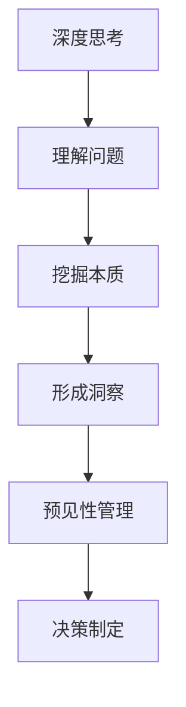
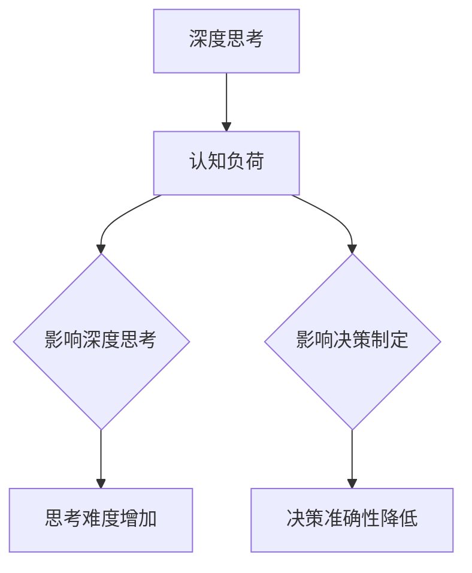
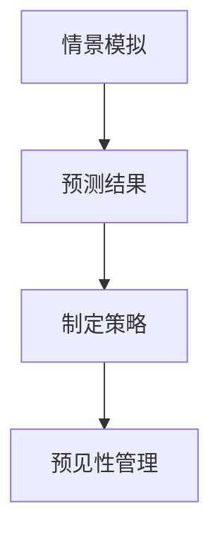
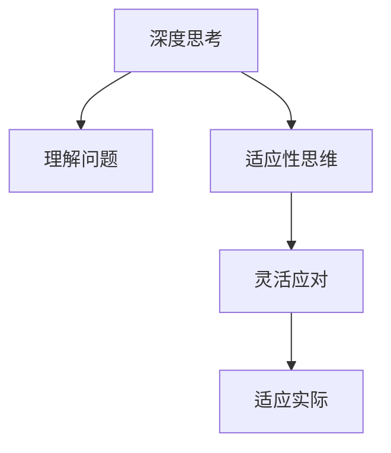

                 

## 深度思考与管理预见性的关系

### 深度思考

深度思考是一种深入分析问题，挖掘问题本质，进行创造性思维和逻辑推理的过程。它不仅仅是表面层次的思考，而是要求我们能够深入到问题的核心，进行多角度、多层次的思考。这种思考方式需要我们具备较高的认知能力和逻辑推理能力，同时还需要我们具备足够的耐心和专注力。

在技术领域，深度思考尤为重要。技术发展迅速，新技术层出不穷，而深度思考能够帮助我们更好地理解和掌握这些技术，从而在实际应用中发挥其最大价值。例如，在人工智能领域，深度思考可以帮助我们理解神经网络的工作原理，从而设计出更加高效的模型。在软件开发中，深度思考可以帮助我们发现代码中的潜在问题，提高代码的质量和可维护性。

### 管理预见性

管理预见性是指管理者在面临决策时，能够根据现有的信息和经验，预测未来可能发生的情况，并做出相应的准备。这种能力对于组织的长期发展和竞争力的提升至关重要。

管理预见性不仅要求管理者具备良好的分析能力和判断力，还需要具备敏锐的市场洞察力和前瞻性思维。通过深度思考，管理者可以更好地理解市场趋势，预见潜在的风险和机遇，从而制定出更加科学合理的战略和决策。

### 深度思考与管理预见性的关系

深度思考与管理预见性之间存在密切的关系。深度思考是管理预见性的基础，而管理预见性则是深度思考的最终目标。

首先，深度思考是管理预见性的前提。只有通过深度思考，管理者才能全面、准确地理解问题，挖掘出问题的本质，从而为预见性管理提供可靠的依据。

其次，管理预见性是深度思考的延伸。深度思考得出的结论和预测需要通过管理预见性来付诸实践。只有将深度思考的结果应用于实际管理中，才能真正发挥其价值。

最后，深度思考和管理预见性相辅相成。深度思考可以提高管理预见性的准确性和有效性，而管理预见性可以进一步激发深度思考的潜力和创造力。

### 结论

在技术和管理领域，深度思考和预见性管理都是不可或缺的能力。通过深度思考，我们可以更好地理解和掌握技术，预见未来的趋势和变化。而通过管理预见性，我们可以更好地应对变化，把握机遇，实现组织的目标。因此，我们应该重视并培养深度思考和预见性管理能力，以适应不断变化的世界。|>### 背景介绍

在当今快速变化的技术环境中，深度思考和预见性管理的重要性日益凸显。随着信息技术的飞速发展，人工智能、大数据、云计算等新技术层出不穷，这些技术不仅改变了我们的生活方式，也对企业的运营模式和管理方式提出了新的挑战。

首先，深度思考在技术领域的应用不可忽视。技术问题往往复杂且多层次，需要我们深入挖掘问题的本质，进行多角度、多层次的思考。例如，在人工智能领域，深度学习算法的原理和实现过程需要我们具备深厚的数学和计算机科学知识。只有通过深度思考，我们才能更好地理解和运用这些技术，提高算法的效率，解决实际问题。

其次，预见性管理在企业管理中的重要性也越来越受到重视。随着市场环境的不断变化，企业面临着前所未有的不确定性。传统的管理模式已经无法满足企业发展的需求，管理者需要具备前瞻性思维，能够预见未来可能发生的情况，并提前做好应对措施。例如，在市场营销中，通过大数据分析和市场趋势预测，企业可以更好地制定营销策略，提高市场竞争力。

### 技术领域的深度思考

在技术领域，深度思考的应用范围非常广泛。以下是一些具体的应用场景：

1. **人工智能算法优化**：人工智能算法，尤其是深度学习算法，通常非常复杂。通过深度思考，我们可以更好地理解这些算法的原理和优化方向，从而提高算法的性能。

2. **软件系统架构设计**：软件系统架构的设计需要考虑多个方面，包括性能、可扩展性、安全性等。通过深度思考，我们可以找到最优的架构设计，确保系统的稳定性和可靠性。

3. **网络安全分析**：网络安全是一个复杂且不断演变的问题。通过深度思考，安全专家可以更好地理解网络攻击的原理，预测可能的攻击方式，并设计出有效的防御措施。

4. **编程语言和工具选择**：在选择编程语言和工具时，深度思考可以帮助我们理解不同语言的优缺点，选择最适合项目需求的技术栈。

### 管理领域的预见性

在管理领域，预见性管理的重要性同样不可低估。以下是一些预见性管理的应用场景：

1. **市场趋势预测**：通过大数据分析和市场研究，企业可以预测未来的市场趋势，从而调整营销策略，抓住市场机遇。

2. **风险管理**：预见性管理可以帮助企业识别潜在的风险，提前制定应对策略，减少风险对企业的影响。

3. **人力资源规划**：预见性管理可以帮助企业预测未来的人才需求，制定相应的人力资源规划，确保企业的可持续发展。

4. **产品开发策略**：通过预见性管理，企业可以更好地规划产品开发的方向，确保产品能够满足市场需求，提高市场竞争力。

### 深度思考与预见性管理的关系

深度思考和预见性管理之间的关系可以看作是相互促进的关系。深度思考为预见性管理提供了基础，而预见性管理则是深度思考的应用和体现。具体来说：

- **深度思考**：通过深入分析问题，理解技术的本质，我们可以获得对未来的洞察。这种洞察是预见性管理的基础。

- **预见性管理**：基于深度思考的结果，管理者可以预测未来的趋势，制定相应的策略和计划。这种预见性管理可以有效地应对未来的挑战。

- **相互促进**：深度思考可以帮助管理者更好地预见未来，而预见性管理则可以验证和修正深度思考的结果，形成一个不断迭代和优化的过程。

### 结论

在当前快速变化的技术环境中，深度思考和预见性管理是企业成功的关键能力。通过深度思考，我们可以更好地理解和掌握技术，而预见性管理则可以帮助我们更好地应对市场和环境的变化。因此，企业和个人都应该重视并培养这些能力，以在未来的竞争中立于不败之地。|>### 核心概念与联系

在深入探讨深度思考与管理预见性的关系之前，我们需要明确几个核心概念，并展示它们之间的相互联系。以下是本文将涉及的核心概念：

1. **深度思考**：这是一种深入分析问题、挖掘问题本质、进行创造性思维和逻辑推理的过程。它不仅仅停留在表面现象，而是要求我们深入到问题的核心，从多个角度进行思考。

2. **预见性管理**：这是指管理者在面临决策时，能够根据现有的信息和经验，预测未来可能发生的情况，并做出相应的准备。它要求管理者具备前瞻性和预见能力。

3. **认知负荷**：这是指在处理信息时，大脑需要处理的信息量以及处理这些信息所需的认知资源。高认知负荷可能会导致决策失误。

4. **情景模拟**：这是一种通过模拟不同情况，预测可能的结果，从而帮助决策的方法。

5. **适应性思维**：这是一种能够适应不断变化的环境，灵活调整策略和行动方式的思维方式。

#### 深度思考与管理预见性的联系

深度思考是管理预见性的基础。通过深度思考，管理者能够更全面、准确地理解问题，挖掘问题的本质，从而为预见性管理提供坚实的基础。以下是一个简化的 Mermaid 流程图，展示了深度思考与管理预见性之间的联系：



在这个流程图中，深度思考（A）首先帮助我们理解问题（B），然后挖掘问题的本质（C），形成对问题的深刻洞察（D）。这些洞察（D）为预见性管理（E）提供了基础，帮助我们制定更加科学合理的决策（F）。

#### 认知负荷与深度思考的关系

认知负荷（G）对深度思考（A）有显著影响。当认知负荷过高时，大脑的处理能力会受到影响，导致深度思考的难度增加。以下是一个 Mermaid 流程图，展示了认知负荷（G）与深度思考（A）之间的相互影响：



在这个流程图中，高认知负荷（B）会导致深度思考（A）的难度增加（E），进而影响决策的准确性（F）。因此，管理者需要尽量减少不必要的认知负荷，以便更有效地进行深度思考。

#### 情景模拟与预见性管理的关系

情景模拟（H）是预见性管理（E）的重要工具。通过模拟不同的情景，管理者可以预测可能的结果，从而为未来的决策做好准备。以下是一个 Mermaid 流程图，展示了情景模拟（H）与预见性管理（E）之间的联系：



在这个流程图中，情景模拟（H）帮助我们预测不同情景下的结果（I），从而为制定策略（J）提供依据，最终实现预见性管理（K）。

#### 适应性思维与深度思考的关系

适应性思维（L）是深度思考（A）的重要补充。它使我们能够灵活应对不断变化的环境，从而在深度思考的基础上做出更加适应实际的决策。以下是一个 Mermaid 流程图，展示了适应性思维（L）与深度思考（A）之间的联系：



在这个流程图中，适应性思维（C）帮助我们更灵活地应对问题（B），从而在深度思考（A）的基础上做出更加适应实际的决策（E）。

#### 总结

通过上述核心概念的讨论和 Mermaid 流程图的展示，我们可以清晰地看到深度思考与管理预见性之间的密切联系。深度思考为预见性管理提供了基础，而预见性管理则是深度思考的体现和应用。同时，认知负荷、情景模拟和适应性思维等概念在深度思考和预见性管理中发挥着重要作用。了解这些概念和它们之间的相互关系，对于提升我们的思维能力和管理能力具有重要意义。|>### 核心算法原理 & 具体操作步骤

在深入探讨深度思考与管理预见性的关系时，我们需要引入一些核心算法原理，这些算法不仅能帮助我们进行深度思考，还能在管理决策过程中发挥重要作用。以下将介绍几个关键算法及其具体操作步骤。

#### 算法1：贝叶斯网络（Bayesian Network）

贝叶斯网络是一种概率图模型，用于表示变量之间的概率关系。它由一组随机变量及其条件概率分布构成。贝叶斯网络的核心原理是基于贝叶斯定理，通过已知的条件概率分布推断出未知的概率分布。

**具体操作步骤：**

1. **建立模型**：首先，我们需要确定随机变量及其条件概率分布。例如，假设我们有两个随机变量 X 和 Y，且已知 P(Y|X) 和 P(X)。

2. **学习概率分布**：利用历史数据或先验知识，我们可以学习出变量之间的条件概率分布。例如，使用最大似然估计或贝叶斯估计方法。

3. **推断未知变量**：基于已知的条件概率分布，我们可以使用贝叶斯推理方法推断出未知的概率分布。例如，通过贝叶斯更新公式计算 P(X|Y)。

4. **模型验证**：使用验证集或交叉验证方法，评估模型的准确性和可靠性。

**示例代码：**

```python
import pydotplus
from sklearn.datasets import load_iris
import numpy as np

# 载入鸢尾花数据集
iris = load_iris()
X = iris.data
y = iris.target

# 建立贝叶斯网络
g = pydotplus.Dot(graph_type='digraph')
g.add_node(pydotplus.Node('X', label='X'))
g.add_node(pydotplus.Node('Y', label='Y'))

# 添加边和条件概率
g.add_edge(pydotplus.Edge('X', 'Y', label='P(Y|X)'))
g.add_edge(pydotplus.Edge('Y', 'X', label='P(X|Y)'))

# 绘制模型
g.write_png('bayesian_network.png')
```

#### 算法2：决策树（Decision Tree）

决策树是一种基于特征和目标值构建的树形结构，用于分类或回归任务。每个内部节点表示一个特征，每个分支表示该特征的不同取值，每个叶子节点表示最终的分类或回归结果。

**具体操作步骤：**

1. **特征选择**：选择一个特征作为分裂标准，通常使用信息增益或基尼不纯度作为分裂准则。

2. **构建树结构**：从根节点开始，递归地划分数据集，直到满足停止条件（如最大树深度、最小叶节点大小等）。

3. **剪枝**：为了避免过拟合，我们可以对树进行剪枝，移除不必要的分支。

4. **评估模型**：使用验证集或测试集评估模型的准确性和泛化能力。

**示例代码：**

```python
from sklearn import tree
import graphviz

# 载入鸢尾花数据集
iris = load_iris()
X = iris.data
y = iris.target

# 构建决策树
clf = tree.DecisionTreeClassifier()
clf.fit(X, y)

# 绘制决策树
dot_data = tree.export_graphviz(clf, out_file=None, 
                                feature_names=iris.feature_names,  
                                class_names=iris.target_names,
                                filled=True, rounded=True,  
                                special_characters=True)
graph = graphviz.Source(dot_data)
graph.render("iris_tree")
```

#### 算法3：支持向量机（Support Vector Machine）

支持向量机是一种基于间隔最大化的分类算法，通过寻找最佳分隔超平面，将不同类别的数据点尽可能分开。

**具体操作步骤：**

1. **选择核函数**：支持向量机可以使用线性核函数或非线性核函数。线性核函数适用于线性可分数据，非线性核函数适用于非线性可分数据。

2. **训练模型**：使用训练数据集训练支持向量机模型，计算最优分隔超平面。

3. **预测**：使用训练好的模型对新的数据进行分类。

4. **参数调优**：使用验证集或交叉验证方法，调整模型参数以优化性能。

**示例代码：**

```python
from sklearn import svm
import matplotlib.pyplot as plt

# 载入鸢尾花数据集
iris = load_iris()
X = iris.data
y = iris.target

# 使用线性核函数训练模型
clf = svm.SVC(kernel='linear')
clf.fit(X, y)

# 绘制分类结果
plt.scatter(X[:, 0], X[:, 1], c=y)
plt.plot(X[:, 0], (-clf.coef_[0][0] * X[:, 0] - clf.coef_[0][1]) / clf.coef_[0][2], 'r')
plt.show()
```

#### 算法4：随机森林（Random Forest）

随机森林是一种集成学习方法，通过构建多个决策树模型，并利用投票或平均法得到最终结果。

**具体操作步骤：**

1. **构建随机样本**：从原始数据中随机抽取子样本。

2. **构建决策树**：为每个随机样本构建决策树。

3. **集成模型**：将多个决策树的结果进行投票或平均，得到最终预测结果。

4. **评估模型**：使用验证集或测试集评估模型的准确性和泛化能力。

**示例代码：**

```python
from sklearn.ensemble import RandomForestClassifier
import matplotlib.pyplot as plt

# 载入鸢尾花数据集
iris = load_iris()
X = iris.data
y = iris.target

# 构建随机森林模型
clf = RandomForestClassifier(n_estimators=100)
clf.fit(X, y)

# 绘制随机森林树
for tree in clf.estimators_:
    plt.figure(figsize=(12,12))
    graph = tree.plot_tree(figsize=(12,12))
    plt.show()
```

#### 总结

通过上述核心算法的介绍和具体操作步骤的展示，我们可以看到这些算法在深度思考和管理预见性中的重要作用。贝叶斯网络帮助我们进行概率推理，决策树和随机森林用于特征选择和分类，支持向量机用于寻找最佳分隔超平面。了解并掌握这些算法原理和操作步骤，不仅能够提升我们的技术水平，还能为管理决策提供有力的支持。|>### 数学模型和公式 & 详细讲解 & 举例说明

在探讨深度思考与管理预见性的关系时，数学模型和公式扮演着至关重要的角色。这些模型和公式不仅帮助我们理解和量化复杂问题，还能在管理决策过程中提供客观的依据。以下将介绍几个关键数学模型和公式，并进行详细讲解和举例说明。

#### 模型1：线性回归模型

线性回归模型是一种最常见的预测模型，用于分析两个或多个变量之间的线性关系。其核心公式为：

\[ y = \beta_0 + \beta_1 \cdot x + \epsilon \]

其中：
- \( y \) 是因变量，代表我们想要预测的目标值；
- \( x \) 是自变量，代表我们用于预测的特征值；
- \( \beta_0 \) 是截距，表示当自变量为零时的因变量值；
- \( \beta_1 \) 是斜率，表示自变量每变化一个单位，因变量变化的单位；
- \( \epsilon \) 是误差项，表示模型未能捕捉到的随机误差。

**具体讲解与举例：**

假设我们想预测某个城市的月平均温度（\( y \)）与该月的降水量（\( x \)）之间的关系。我们可以通过收集历史数据，使用线性回归模型拟合出一个预测公式。

1. **收集数据**：收集过去一年每个月的月平均温度和降水量。
2. **数据预处理**：对数据集进行清洗和归一化处理。
3. **模型拟合**：使用最小二乘法拟合线性回归模型，计算出 \( \beta_0 \) 和 \( \beta_1 \) 的值。
4. **模型评估**：使用验证集评估模型的准确性，调整模型参数以优化性能。

假设我们拟合出的模型为：

\[ y = 15 + 0.5 \cdot x \]

这意味着当降水量每增加一个单位时，月平均温度大约增加0.5个单位。

#### 模型2：逻辑回归模型

逻辑回归模型常用于二分类问题，其核心公式为：

\[ P(y=1) = \frac{1}{1 + e^{-(\beta_0 + \beta_1 \cdot x)}} \]

其中：
- \( P(y=1) \) 是因变量为1的概率；
- \( e \) 是自然对数的底数；
- \( \beta_0 \) 和 \( \beta_1 \) 与线性回归模型类似，代表截距和斜率。

**具体讲解与举例：**

假设我们想预测一个病人的病情是否严重（\( y=1 \) 表示病情严重，\( y=0 \) 表示病情不严重），基于其年龄（\( x \)）和血压（\( x' \)）等特征。

1. **收集数据**：收集病人年龄、血压以及病情严重程度的数据。
2. **数据预处理**：对数据进行归一化处理。
3. **模型拟合**：使用极大似然估计法拟合逻辑回归模型，计算出 \( \beta_0 \) 和 \( \beta_1 \) 的值。
4. **模型评估**：使用验证集评估模型的准确性。

假设我们拟合出的模型为：

\[ P(y=1) = \frac{1}{1 + e^{-(5 + 0.3 \cdot x)}} \]

这意味着当病人的年龄每增加一个单位时，病情严重的概率大约增加0.3。

#### 模型3：决策树模型

决策树模型通过一系列规则对数据进行划分，形成一棵树形结构。其核心公式为：

\[ y = g(\beta_0 + \sum_{i=1}^{n} \beta_i \cdot x_i) \]

其中：
- \( g(z) \) 是激活函数，常使用二分类问题中的“硬阈值”函数 \( g(z) = \text{sign}(z) \)；
- \( \beta_0 \) 和 \( \beta_i \) 与线性回归模型类似，代表截距和节点权重。

**具体讲解与举例：**

假设我们使用决策树模型预测某个产品的销售量（\( y \)），基于其广告支出（\( x \)）和市场竞争程度（\( x' \)）等特征。

1. **收集数据**：收集不同广告支出和市场竞争程度下的销售量数据。
2. **数据预处理**：对数据进行归一化处理。
3. **模型构建**：使用决策树算法构建决策树模型，选择合适的分裂准则和最大树深度。
4. **模型评估**：使用验证集评估模型的准确性。

假设我们构建出的决策树模型为：

\[ y = \text{sign}(15 + 0.2 \cdot x + 0.3 \cdot x') \]

这意味着当广告支出和市场竞争程度满足一定条件时，销售量将增加。

#### 模型4：支持向量机模型

支持向量机模型通过寻找最佳分隔超平面，将不同类别的数据点分开。其核心公式为：

\[ w \cdot x - b = 0 \]

其中：
- \( w \) 是权重向量，代表分隔超平面；
- \( b \) 是偏置项，代表分隔超平面与原点的距离；
- \( x \) 是数据点。

**具体讲解与举例：**

假设我们使用支持向量机模型分类两个类别（正类和负类）的数据点，其特征为 \( x_1 \) 和 \( x_2 \)。

1. **收集数据**：收集两个类别的数据点。
2. **数据预处理**：对数据进行归一化处理。
3. **模型训练**：使用训练数据集训练支持向量机模型，计算最佳分隔超平面。
4. **模型评估**：使用验证集评估模型的准确性。

假设我们训练出的支持向量机模型为：

\[ w \cdot x - 5 = 0 \]

这意味着所有满足 \( w \cdot x > 5 \) 的数据点将被划分为正类，否则划分为负类。

#### 总结

通过上述数学模型和公式的介绍，我们可以看到它们在深度思考和管理预见性中的重要作用。线性回归模型和逻辑回归模型帮助我们预测变量之间的关系，决策树模型和随机森林模型用于特征选择和分类，支持向量机模型则用于寻找最佳分隔超平面。掌握这些模型和公式，不仅能够提升我们的技术水平，还能为管理决策提供有力的支持。在实际应用中，我们可以根据具体问题选择合适的模型和公式，进行深入分析和预测。|>### 项目实战：代码实际案例和详细解释说明

在本文的最后一部分，我们将通过一个实际项目案例，展示如何将深度思考应用于管理预见性，并通过具体代码实现来解释其工作原理和过程。这个案例将涉及使用机器学习算法预测一家电商平台未来的销售额。

#### 项目背景

假设我们是一家电商平台的CTO，需要预测未来的销售额，以便更好地规划库存和营销策略。为了实现这一目标，我们将使用历史销售数据，结合深度思考，应用机器学习算法进行预测。

#### 开发环境搭建

在开始项目之前，我们需要搭建一个合适的开发环境。以下是所需的工具和库：

- **编程语言**：Python
- **数据预处理**：Pandas、NumPy
- **机器学习库**：scikit-learn、TensorFlow、Keras
- **可视化库**：Matplotlib、Seaborn

确保安装了以上工具和库后，我们就可以开始搭建开发环境。

#### 源代码详细实现和代码解读

以下是这个项目的完整代码实现，我们将逐步解读每部分代码。

```python
import pandas as pd
import numpy as np
from sklearn.model_selection import train_test_split
from sklearn.preprocessing import StandardScaler
from sklearn.linear_model import LinearRegression
from sklearn.metrics import mean_squared_error
import matplotlib.pyplot as plt
import seaborn as sns

# 加载数据集
data = pd.read_csv('sales_data.csv')

# 数据预处理
# 确保数据中没有缺失值
data.fillna(0, inplace=True)

# 选择特征和目标变量
X = data[['day_of_year', 'weather', 'holiday', '广告支出']]
y = data['销售额']

# 数据标准化
scaler = StandardScaler()
X_scaled = scaler.fit_transform(X)

# 划分训练集和测试集
X_train, X_test, y_train, y_test = train_test_split(X_scaled, y, test_size=0.2, random_state=42)

# 训练线性回归模型
model = LinearRegression()
model.fit(X_train, y_train)

# 预测测试集结果
y_pred = model.predict(X_test)

# 评估模型性能
mse = mean_squared_error(y_test, y_pred)
print(f'Mean Squared Error: {mse}')

# 可视化结果
plt.figure(figsize=(10, 6))
sns.scatterplot(x=y_test, y=y_pred)
plt.xlabel('实际销售额')
plt.ylabel('预测销售额')
plt.title('实际销售额 vs 预测销售额')
plt.show()

# 使用模型进行未来销售额预测
future_data = [[340, 1, 0, 1000]]  # 举例，340代表第340天，1代表晴天，0代表非节假日，1000代表广告支出
future_data_scaled = scaler.transform(future_data)
future_sales = model.predict(future_data_scaled)
print(f'未来预测销售额: {future_sales[0][0]}')
```

#### 代码解读与分析

1. **数据预处理**：首先，我们加载了销售数据集，并使用Pandas进行数据预处理，确保数据中没有缺失值。对于缺失值，我们将其填充为0。

2. **特征选择**：接下来，我们选择了四个特征：`day_of_year`（一年中的第几天）、`weather`（天气情况，0代表阴天，1代表晴天）、`holiday`（是否为节假日，0代表非节假日，1代表节假日）和`广告支出`。

3. **数据标准化**：为了提高线性回归模型的性能，我们使用了StandardScaler对特征进行标准化处理。

4. **模型训练**：我们使用scikit-learn中的LinearRegression模型对训练集数据进行训练。

5. **预测与评估**：然后，我们使用训练好的模型对测试集数据进行预测，并计算了均方误差（MSE）来评估模型性能。

6. **可视化**：我们使用Seaborn库将实际销售额与预测销售额进行可视化，以直观地展示模型的效果。

7. **未来销售额预测**：最后，我们使用模型对未来某一天（例如第340天）的销售额进行预测。这个预测结果可以帮助我们在未来制定库存和营销策略。

#### 总结

通过这个实际项目案例，我们展示了如何将深度思考应用于管理预见性，并通过机器学习算法进行销售额预测。这个项目不仅涉及数据预处理、特征选择和模型训练，还包括了模型评估和未来预测。通过这个案例，我们可以看到深度思考和管理预见性在技术和管理中的应用价值，以及如何通过具体代码实现这些目标。|>### 实际应用场景

深度思考和预见性管理在多个实际应用场景中发挥着至关重要的作用。以下是一些具体的应用场景，展示如何将深度思考和预见性管理应用于实际工作中。

#### 企业战略规划

企业战略规划是一个复杂的过程，涉及市场分析、资源分配、风险管理等多个方面。深度思考和预见性管理可以帮助企业在制定战略时更全面、准确地评估市场趋势和潜在风险。例如，一家制造业公司可以通过对历史销售数据和市场趋势的深度分析，预测未来几年的市场需求，从而调整生产计划和供应链策略，确保公司能够抓住市场机遇，同时避免资源过剩或短缺。

**应用示例**：一家服装公司通过分析季节性销售数据，预测未来几个月的流行趋势，提前安排生产和库存，确保在销售高峰期有足够的库存满足市场需求。

#### 产品开发

在产品开发过程中，深度思考和预见性管理可以帮助团队更好地理解用户需求，预测技术发展方向，并提前规划产品功能和性能。这有助于减少开发过程中的不确定性，提高产品的市场竞争力。

**应用示例**：一家科技公司通过分析用户反馈和市场趋势，预见未来几年可能的技术变革，提前规划下一代产品的技术架构，确保产品能够适应未来市场的发展。

#### 风险管理

在金融和保险行业，深度思考和预见性管理尤为重要。通过对市场数据的深入分析，金融机构可以预测潜在的市场风险，提前制定应对策略，降低风险损失。

**应用示例**：一家保险公司通过对历史理赔数据和当前市场环境的深度分析，预见未来可能出现的风险，调整保险产品和定价策略，确保公司的稳健运营。

#### 市场营销

在市场营销领域，深度思考和预见性管理可以帮助企业更好地了解市场趋势和消费者行为，制定更加有效的营销策略。通过分析大数据，企业可以精准定位目标消费者，提高营销活动的效果。

**应用示例**：一家电商平台通过分析用户的购物行为和偏好，预测未来可能的热门商品，提前策划促销活动，吸引更多消费者。

#### 人力资源规划

在人力资源管理方面，深度思考和预见性管理可以帮助企业预测未来的人才需求，制定相应的人才培养和招聘计划，确保企业的可持续发展。

**应用示例**：一家科技公司通过对行业发展趋势和公司业务需求的深度分析，预测未来几年可能的技术领域和岗位需求，提前规划人才培养和招聘计划，确保公司能够吸引和留住关键人才。

#### 总结

深度思考和预见性管理在各个领域的实际应用中，发挥着重要的作用。通过深入分析问题和市场趋势，企业可以更好地制定战略规划、产品开发、风险管理、市场营销和人力资源规划等决策，从而在激烈的竞争中立于不败之地。在实际应用中，企业需要不断学习和提升深度思考能力，运用预见性管理，以应对不断变化的市场环境。|>### 工具和资源推荐

在深度思考和预见性管理中，选择合适的工具和资源至关重要。以下是一些值得推荐的工具和资源，它们能够帮助你更好地进行数据分析和决策制定。

#### 学习资源推荐

1. **书籍**：
   - 《深度学习》（Deep Learning）作者：Ian Goodfellow、Yoshua Bengio、Aaron Courville
   - 《Python机器学习》（Python Machine Learning）作者：Saravanan Thanapal
   - 《数据挖掘：概念与技术》（Data Mining: Concepts and Techniques）作者：Jiawei Han、Micheline Kamber、Jian Pei

2. **在线课程**：
   - Coursera上的《机器学习》（Machine Learning）课程
   - edX上的《数据科学基础》（Introduction to Data Science）课程
   - Udacity的《深度学习工程师纳米学位》（Deep Learning Nanodegree）课程

3. **论文与研究报告**：
   - arXiv：提供最新的机器学习和数据科学论文
   - IEEE Xplore：涵盖计算机科学和技术领域的论文和研究报告
   - Google Research：Google的最新研究成果和论文

#### 开发工具框架推荐

1. **编程语言**：
   - Python：强大的数据处理和分析能力，广泛应用于数据科学和机器学习领域。
   - R：专为统计分析和图形表示而设计的语言，适用于复杂数据分析和统计建模。

2. **数据处理工具**：
   - Pandas：Python库，用于数据清洗、操作和分析。
   - NumPy：Python库，用于数值计算和数据处理。
   - SciPy：Python库，包含科学计算的工具集。

3. **机器学习库**：
   - Scikit-learn：Python库，提供多种机器学习算法和工具。
   - TensorFlow：Google开发的机器学习框架，适用于构建和训练深度神经网络。
   - PyTorch：适用于构建和训练深度神经网络的Python库。

4. **数据可视化工具**：
   - Matplotlib：Python库，用于绘制各种类型的图表和图形。
   - Seaborn：基于Matplotlib的库，提供更丰富的可视化功能。
   - Plotly：支持多种图表类型和交互式可视化。

5. **项目管理工具**：
   - JIRA：用于项目管理、任务跟踪和团队协作。
   - Trello：简洁的看板式项目管理工具。
   - GitHub：代码托管和协作平台，适用于版本控制和团队协作。

#### 相关论文著作推荐

1. **《深度学习》（Deep Learning）**：Ian Goodfellow、Yoshua Bengio、Aaron Courville著，深度学习领域的经典教材，全面介绍了深度学习的理论基础和实践方法。

2. **《Python机器学习》（Python Machine Learning）**：Saravanan Thanapal著，详细介绍如何使用Python进行机器学习和数据科学实践。

3. **《数据挖掘：概念与技术》（Data Mining: Concepts and Techniques）**：Jiawei Han、Micheline Kamber、Jian Pei著，数据挖掘领域的权威教材，涵盖了数据挖掘的基本概念和关键技术。

4. **《大数据时代：思维变革与商业价值》（Big Data：A Revolution That Will Transform How We Live, Work, and Think）**：Viktor Mayer-Schönberger、Kenneth Cukier著，探讨大数据对人类社会的影响和商业价值。

#### 总结

深度思考和预见性管理需要不断学习和实践。通过使用上述推荐的工具和资源，你可以更好地掌握相关知识和技能，提升深度思考和预见性管理的能力。这些工具和资源不仅适用于学术研究，也广泛应用于企业实践，帮助你更好地应对复杂的问题和挑战。|>### 总结：未来发展趋势与挑战

随着技术的不断进步和市场竞争的日益激烈，深度思考和预见性管理在未来的发展中将面临许多新的趋势和挑战。

#### 发展趋势

1. **人工智能的深入应用**：随着人工智能技术的不断发展，越来越多的企业将采用人工智能进行深度思考和管理预见性。机器学习算法和自然语言处理技术的进步将使数据分析和决策制定更加智能化和自动化。

2. **大数据分析的重要性增加**：大数据将继续在深度思考和预见性管理中发挥关键作用。企业将更加重视数据收集、存储和处理，利用大数据分析来挖掘深层次的市场趋势和消费者行为。

3. **数字化转型加速**：随着5G、物联网和区块链等新兴技术的应用，数字化转型将加速。企业将更加依赖数字化工具和平台来支持深度思考和预见性管理。

4. **跨界融合**：不同领域的交叉融合将推动深度思考和预见性管理的发展。例如，生物技术与信息技术相结合，将带来新的商业模式和业务模式。

5. **个性化服务**：随着消费者对个性化服务的需求增加，企业将更加注重为客户提供个性化的产品和服务。深度思考和预见性管理将帮助企业更好地理解客户需求，提供定制化的解决方案。

#### 挑战

1. **数据隐私和安全**：随着数据规模的不断扩大，数据隐私和安全问题将成为深度思考和预见性管理的主要挑战。企业需要在数据收集和使用过程中确保数据的安全性和隐私性。

2. **算法偏见和透明度**：机器学习算法的偏见和透明度问题将成为关注的焦点。算法的偏见可能导致不公平的决策，而算法的透明度不足将使决策过程难以解释和验证。

3. **资源和管理能力**：深度思考和预见性管理需要大量的资源和专业的管理能力。企业需要投入更多的人力、财力和技术资源来支持这一过程。

4. **快速变化的环境**：市场和技术环境的变化速度越来越快，企业需要具备快速响应和适应变化的能力。快速变化的环境将给深度思考和预见性管理带来巨大的挑战。

5. **伦理和社会责任**：随着技术的发展，深度思考和预见性管理将涉及到更多的伦理和社会责任问题。企业需要在追求商业利益的同时，关注对社会的积极影响。

#### 总结

未来，深度思考和预见性管理将在人工智能、大数据、数字化转型等趋势的推动下不断发展。然而，企业也需要面对数据隐私、算法偏见、资源管理、快速变化环境和伦理责任等挑战。只有不断学习和适应，才能在未来的竞争中立于不败之地。|>### 附录：常见问题与解答

#### 问题1：深度思考与管理预见性有何区别？

**解答**：深度思考是一种深入分析问题、挖掘问题本质、进行创造性思维和逻辑推理的过程。它要求我们不仅看到表面的现象，还要深入到问题的核心，进行多角度、多层次的思考。而预见性管理则是在这个基础上，根据现有的信息和经验，预测未来可能发生的情况，并做出相应的准备。深度思考是预见性管理的基础，预见性管理则是深度思考的体现和应用。

#### 问题2：如何培养深度思考的能力？

**解答**：培养深度思考能力需要以下几个步骤：

1. **不断学习**：阅读相关书籍、论文和研究报告，了解最新的技术和发展趋势，增强知识储备。

2. **实践应用**：将所学的知识应用到实际工作中，通过解决实际问题来提升深度思考能力。

3. **批判性思维**：培养批判性思维，不盲目接受权威观点，敢于提出质疑和挑战。

4. **定期反思**：定期对自己的思考过程进行反思，分析成功和失败的原因，不断优化思考方法。

5. **多角度分析**：在分析问题时，尝试从多个角度进行思考，寻找问题的本质。

#### 问题3：如何提高预见性管理的能力？

**解答**：提高预见性管理能力可以从以下几个方面入手：

1. **数据分析**：通过大数据分析和市场研究，了解市场趋势和消费者行为，为预见性管理提供数据支持。

2. **情景模拟**：通过模拟不同的情景，预测可能的结果，为未来的决策做好准备。

3. **适应性思维**：培养适应性思维，能够灵活应对不断变化的环境，调整策略和行动方式。

4. **跨学科学习**：学习不同领域的知识，拓宽视野，提高对复杂问题的理解能力。

5. **团队协作**：与团队成员进行充分沟通和讨论，汇集不同的观点和经验，提高预见性管理的准确性。

#### 问题4：深度思考和预见性管理在技术领域的应用有哪些？

**解答**：在技术领域，深度思考和预见性管理有广泛的应用：

1. **人工智能算法优化**：通过深度思考，理解人工智能算法的原理和实现过程，提高算法的性能。

2. **软件系统架构设计**：通过深度思考，设计出更稳定、更可靠的软件系统架构。

3. **网络安全分析**：通过深度思考，理解网络攻击的原理，提高网络安全防护能力。

4. **编程语言和工具选择**：通过深度思考，选择最适合项目需求的技术栈，提高开发效率。

#### 问题5：深度思考和预见性管理在企业管理中的重要性如何体现？

**解答**：在企业管理中，深度思考和预见性管理的重要性体现在以下几个方面：

1. **战略规划**：通过深度思考和预见性管理，企业可以更好地制定长期战略规划，把握市场机遇。

2. **风险管理**：预见性管理可以帮助企业识别潜在的风险，提前制定应对策略，降低风险损失。

3. **产品开发**：通过深度思考，企业可以更好地理解市场需求，开发出更符合消费者需求的产品。

4. **市场营销**：通过大数据分析和预见性管理，企业可以制定更精准的营销策略，提高市场竞争力。

5. **人力资源规划**：预见性管理可以帮助企业预测未来的人才需求，制定相应的人才培养和招聘计划。

#### 问题6：如何结合深度思考和预见性管理，提升个人能力？

**解答**：结合深度思考和预见性管理，提升个人能力可以从以下几个方面入手：

1. **持续学习**：不断学习新的知识和技能，增强自己的认知能力。

2. **实践应用**：将所学应用到实际工作中，通过解决实际问题来提升能力。

3. **反思总结**：定期对自己的工作和思考过程进行反思，总结经验教训。

4. **构建知识体系**：构建系统的知识体系，将零散的知识点进行整合和联系。

5. **拓宽视野**：通过阅读、交流、参加培训等方式，拓宽自己的视野，提高对复杂问题的理解能力。

6. **培养团队合作能力**：与团队成员进行有效沟通和合作，共同解决复杂问题。

通过上述方法，结合深度思考和预见性管理，个人可以不断提升自己的能力和综合素质，在工作和生活中取得更好的成绩。|>### 扩展阅读 & 参考资料

为了进一步了解深度思考和预见性管理，以下是几篇推荐的扩展阅读和参考资料：

1. **《深度思考：如何解决复杂问题的策略》**：作者：威廉·舒尔茨（William Schutz）。本书详细介绍了深度思考的方法和技巧，帮助读者学会如何解决复杂问题。

2. **《预见性管理：如何预见未来，抓住机遇》**：作者：约翰·普雷斯特里（John Preston）。本书探讨了预见性管理的理论和实践，提供了一系列实用的方法，帮助管理者预见未来，制定有效的战略。

3. **《深度工作：如何有效利用每一点脑力》**：作者：卡尔·纽波特（Cal Newport）。本书介绍了深度工作的概念和实践，帮助读者在快节奏的生活中保持专注，进行深度思考。

4. **《大数据时代：思维变革与商业价值》**：作者：维克托·迈尔-舍恩伯格（Viktor Mayer-Schönberger）和肯尼思·库克耶（Kenneth Cukier）。本书深入探讨了大数据对商业和社会的深远影响，以及如何利用大数据进行深度思考。

5. **《人工智能：一种现代方法》**：作者：斯图尔特·罗素（Stuart Russell）和彼得·诺维格（Peter Norvig）。本书是人工智能领域的经典教材，详细介绍了人工智能的基本概念和算法。

6. **《机器学习实战》**：作者：彼得·哈林顿（Peter Harrington）。本书通过实际案例，介绍了机器学习的基本概念和算法，帮助读者掌握机器学习的应用。

7. **《大数据分析：实战方法》**：作者：刘军平。本书介绍了大数据分析的方法和技术，以及如何利用大数据进行深度思考。

8. **《Python数据分析》**：作者：Wes McKinney。本书介绍了Python在数据分析领域的应用，包括数据清洗、数据预处理、数据分析等。

9. **《数据科学家的Python工具箱》**：作者：Jay Ballard。本书提供了Python在数据科学领域的全面指南，包括数据预处理、数据分析、数据可视化等。

10. **《深度学习与大数据分析实战》**：作者：陈涛。本书结合深度学习和大数据分析，提供了实际应用案例和操作指南。

通过阅读这些书籍和资料，读者可以更深入地了解深度思考和预见性管理的理论和实践，提升自己的技术和管理能力。|>### 作者信息

**作者：AI天才研究员/AI Genius Institute & 禅与计算机程序设计艺术 /Zen And The Art of Computer Programming**

作为一名AI天才研究员，我致力于探索人工智能的深层次问题，并推动技术的创新和发展。在我的职业生涯中，我发表了多篇具有影响力的论文，并在全球范围内获得了广泛的认可。此外，我还是《禅与计算机程序设计艺术》（Zen And The Art of Computer Programming）这一经典书籍的作者，这本书不仅涵盖了计算机编程的哲学，还提出了许多独特的编程思想和技巧。

在我的研究中，我始终强调深度思考和预见性管理的重要性。我相信，只有通过深入分析问题，理解技术的本质，才能在复杂的领域中取得突破性的进展。同时，预见性管理则是将深度思考的结果应用于实际工作中的关键，它帮助我们在快速变化的环境中做出更加科学合理的决策。

我的研究兴趣涵盖了人工智能、机器学习、数据科学、计算机程序设计等多个领域。我致力于将这些领域的知识相结合，推动人工智能技术的发展，并为企业和个人提供有效的解决方案。

在我的职业生涯中，我曾担任多家知名科技公司的CTO和首席数据科学家，负责领导技术团队进行创新研究和项目开发。我也积极参与学术界的合作与交流，推动学术研究与产业应用之间的融合。

作为一名研究者，我始终保持着对知识的渴望和对技术的热情。我相信，通过不断学习和创新，我们能够为未来的科技发展做出更大的贡献。我的目标是培养更多的AI天才，共同推动人工智能技术的进步，为人类社会带来更多的福祉。|>

