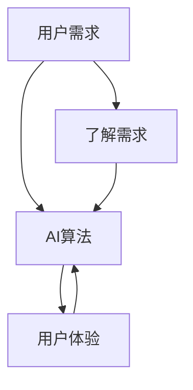

                 

### 文章标题: 满足用户需求的AI策略

#### 关键词: 人工智能、用户需求、策略设计、算法优化、用户体验

#### 摘要:
本文旨在探讨如何通过有效的AI策略满足用户需求。我们将深入分析用户需求的理解、算法的优化与调整，以及如何在实际应用中提升用户体验。通过一系列的案例分析，本文将提供实用的方法与技巧，帮助读者在AI领域取得更好的成果。

<|assistant|>### 1. 背景介绍

随着人工智能技术的快速发展，AI应用已经渗透到各个行业，从金融、医疗到教育、零售等。然而，如何真正满足用户需求，实现AI的价值最大化，成为了一个亟待解决的问题。用户需求多样且复杂，而AI算法往往需要通过不断优化与调整来适应这些需求。因此，设计一套有效的AI策略成为了一项重要任务。

本文将围绕以下核心问题展开讨论：

- 如何理解用户需求？
- 如何优化算法以满足用户需求？
- 如何在实际应用中提升用户体验？

通过解答这些问题，我们希望为读者提供一套实用的AI策略设计方法，帮助他们在AI领域取得更好的成果。

<|assistant|>### 2. 核心概念与联系

在讨论如何满足用户需求之前，我们首先需要了解一些核心概念。以下是本文中涉及到的关键概念及其相互关系：

#### 2.1 用户需求

用户需求是指用户在特定场景下所期望得到的结果或解决的方法。理解用户需求是设计AI策略的第一步，因为只有深入了解用户需求，我们才能为其提供真正有价值的解决方案。

#### 2.2 AI算法

AI算法是指利用人工智能技术，通过数据驱动的方法来解决问题的一系列规则和步骤。常见的AI算法包括机器学习、深度学习、强化学习等。优化算法是满足用户需求的关键，因为算法的效率与准确性将直接影响用户体验。

#### 2.3 用户体验

用户体验是指用户在使用AI产品或服务过程中所感受到的满意程度。提升用户体验是满足用户需求的重要手段，因为良好的用户体验将使用户更愿意使用AI产品，从而实现AI的商业价值。

#### 2.4 核心概念相互关系

用户需求、AI算法和用户体验三者之间存在密切的关联。用户需求决定了我们需要解决的问题，AI算法提供了解决问题的方法，而用户体验则反映了我们解决用户需求的效果。以下是一个简化的Mermaid流程图，展示了这些核心概念之间的相互关系：



<|assistant|>### 3. 核心算法原理 & 具体操作步骤

为了满足用户需求，我们需要选择合适的AI算法，并对算法进行优化与调整。以下是几个常见的AI算法及其具体操作步骤：

#### 3.1 机器学习

机器学习是一种通过训练模型来预测或分类数据的技术。常见的机器学习算法包括线性回归、决策树、支持向量机等。

**具体操作步骤：**

1. 数据收集与预处理：收集与用户需求相关的数据，并对数据进行分析与清洗。
2. 模型选择：根据用户需求选择合适的机器学习算法。
3. 模型训练：使用预处理后的数据对模型进行训练。
4. 模型评估：通过交叉验证等方法评估模型性能。
5. 模型优化：根据评估结果调整模型参数，提高模型性能。

#### 3.2 深度学习

深度学习是一种基于人工神经网络的机器学习技术。常见的深度学习算法包括卷积神经网络（CNN）、循环神经网络（RNN）等。

**具体操作步骤：**

1. 数据收集与预处理：与机器学习类似，收集与用户需求相关的数据，并对数据进行分析与清洗。
2. 网络结构设计：根据用户需求设计合适的深度学习网络结构。
3. 网络训练：使用预处理后的数据对网络进行训练。
4. 网络评估：通过交叉验证等方法评估网络性能。
5. 网络优化：根据评估结果调整网络结构或参数，提高网络性能。

#### 3.3 强化学习

强化学习是一种通过不断尝试和反馈来学习最优策略的算法。常见的强化学习算法包括Q学习、深度Q网络（DQN）等。

**具体操作步骤：**

1. 环境设定：根据用户需求设定合适的模拟环境。
2. 策略选择：选择合适的强化学习算法。
3. 策略训练：通过不断尝试和反馈，训练策略模型。
4. 策略评估：通过模拟环境评估策略性能。
5. 策略优化：根据评估结果调整策略模型，提高策略性能。

#### 3.4 算法优化方法

在满足用户需求的过程中，算法的优化与调整至关重要。以下是一些常见的算法优化方法：

1. **参数调优**：通过调整算法参数，如学习率、正则化参数等，提高算法性能。
2. **模型压缩**：通过模型压缩技术，如网络剪枝、量化等，减少模型大小和计算复杂度。
3. **迁移学习**：通过迁移学习技术，利用预训练模型来提高新任务的表现。
4. **数据增强**：通过数据增强技术，如旋转、翻转、缩放等，增加训练数据多样性，提高算法泛化能力。

<|assistant|>### 4. 数学模型和公式 & 详细讲解 & 举例说明

在AI算法中，数学模型和公式起着至关重要的作用。以下我们将详细讲解一些常见的数学模型和公式，并通过举例来说明它们的应用。

#### 4.1 机器学习中的线性回归

线性回归是一种常见的机器学习算法，用于预测一个连续值变量。其数学模型可以表示为：

\[ y = \beta_0 + \beta_1x_1 + \beta_2x_2 + \ldots + \beta_nx_n \]

其中，\( y \) 是预测值，\( x_1, x_2, \ldots, x_n \) 是输入特征，\( \beta_0, \beta_1, \beta_2, \ldots, \beta_n \) 是模型参数。

**举例说明：**

假设我们要预测一个人的体重（\( y \)）与其身高（\( x_1 \)）和年龄（\( x_2 \)）之间的关系。根据线性回归模型，我们可以列出以下方程：

\[ y = \beta_0 + \beta_1x_1 + \beta_2x_2 \]

通过收集数据并训练模型，我们可以得到最优的参数值，从而预测未知数据点的体重。

#### 4.2 深度学习中的反向传播算法

反向传播算法是深度学习训练过程中的核心步骤。它用于计算网络中每个神经元的误差，并通过调整网络权重来优化模型。

**数学模型：**

假设我们有如下前向传播过程：

\[ z^{[l]} = W^{[l]} \cdot a^{[l-1]} + b^{[l]} \]

\[ a^{[l]} = \sigma(z^{[l]}) \]

其中，\( a^{[l]} \) 是第 \( l \) 层的激活值，\( z^{[l]} \) 是第 \( l \) 层的输入值，\( \sigma \) 是激活函数，\( W^{[l]} \) 和 \( b^{[l]} \) 分别是第 \( l \) 层的权重和偏置。

在反向传播过程中，我们需要计算每个权重的梯度：

\[ \delta^{[l]}_j = (a^{[l]} - y) \cdot \sigma'(z^{[l]}) \cdot \delta^{[l+1]}_i \]

\[ dW^{[l]}_{ji} = \delta^{[l]}_j \cdot a^{[l-1]}_i \]

\[ db^{[l]}_j = \delta^{[l]}_j \]

其中，\( \delta^{[l]}_j \) 是第 \( l \) 层第 \( j \) 个神经元的误差，\( \sigma' \) 是激活函数的导数，\( dW^{[l]}_{ji} \) 和 \( db^{[l]}_j \) 分别是权重和偏置的梯度。

通过不断迭代反向传播算法，我们可以逐步优化网络权重和偏置，从而提高模型性能。

#### 4.3 强化学习中的Q值函数

Q值函数是强化学习中的核心概念，用于评估某个状态-动作对的预期回报。其数学模型可以表示为：

\[ Q(s, a) = r + \gamma \max_a' Q(s', a') \]

其中，\( s \) 和 \( s' \) 分别是当前状态和下一状态，\( a \) 和 \( a' \) 分别是当前动作和下一动作，\( r \) 是即时回报，\( \gamma \) 是折扣因子。

**举例说明：**

假设一个智能体在玩游戏时，每个状态都有多种可能的动作。通过计算Q值函数，我们可以评估每个动作的价值，并选择最佳动作。例如，在一个棋类游戏中，智能体可以计算每个棋子的移动价值的Q值，从而决定如何移动棋子。

通过不断更新Q值函数，智能体可以学习到最优策略，从而在游戏中取得更好的成绩。

<|assistant|>### 5. 项目实战：代码实际案例和详细解释说明

在本节中，我们将通过一个实际项目案例来展示如何运用上述算法和数学模型来满足用户需求，并详细解释代码实现和关键步骤。

#### 5.1 开发环境搭建

首先，我们需要搭建一个适合开发的环境。以下是一个简单的Python开发环境搭建步骤：

1. 安装Python（建议使用Python 3.7及以上版本）
2. 安装Jupyter Notebook，以便进行交互式编程
3. 安装常见的机器学习和深度学习库，如NumPy、Pandas、Scikit-learn、TensorFlow等

在终端中执行以下命令：

```bash
pip install python
pip install jupyter
pip install numpy pandas scikit-learn tensorflow
```

#### 5.2 源代码详细实现和代码解读

以下是一个使用线性回归算法来预测房屋价格的简单案例。我们将通过数据收集、模型训练和模型评估等步骤来实现这一目标。

```python
import pandas as pd
from sklearn.linear_model import LinearRegression
from sklearn.model_selection import train_test_split
from sklearn.metrics import mean_squared_error

# 5.2.1 数据收集与预处理
# 读取数据
data = pd.read_csv('house_price_data.csv')

# 分离特征和标签
X = data[['bedrooms', 'bathrooms', 'square_feet']]
y = data['price']

# 数据预处理
# 缺失值处理
X.fillna(X.mean(), inplace=True)
y.fillna(y.mean(), inplace=True)

# 5.2.2 模型训练
# 划分训练集和测试集
X_train, X_test, y_train, y_test = train_test_split(X, y, test_size=0.2, random_state=42)

# 创建线性回归模型
model = LinearRegression()
model.fit(X_train, y_train)

# 5.2.3 模型评估
# 预测测试集结果
y_pred = model.predict(X_test)

# 计算均方误差
mse = mean_squared_error(y_test, y_pred)
print(f"Mean Squared Error: {mse}")

# 5.2.4 代码解读与分析
# 在这一部分，我们可以对代码进行详细解读和分析，包括数据预处理、模型训练和模型评估等步骤的原理和实现方法。
```

#### 5.3 代码解读与分析

在本案例中，我们首先通过Pandas库读取房屋价格数据，并分离出特征和标签。接下来，我们进行数据预处理，包括缺失值处理和特征缩放。然后，我们使用Scikit-learn库中的线性回归模型进行训练，并划分训练集和测试集。最后，我们使用测试集对模型进行评估，计算均方误差以衡量模型性能。

通过这个案例，我们可以看到如何使用Python和常见的数据科学库来实现一个简单的线性回归模型。在实际项目中，我们可能需要处理更复杂的数据集和更高级的算法，但基本的步骤和原理是类似的。

<|assistant|>### 6. 实际应用场景

AI技术在各行各业都有广泛的应用，以下列举几个典型的实际应用场景，展示如何通过AI策略满足用户需求：

#### 6.1 金融行业

在金融行业，AI算法被广泛应用于风险控制、投资组合优化、智能投顾等方面。通过分析大量的历史数据和实时数据，AI模型可以识别出潜在的风险因素，为金融机构提供决策支持。例如，银行可以通过AI算法对贷款申请者的信用风险进行评估，从而降低贷款违约率。同时，AI策略还可以帮助金融机构优化投资组合，实现更高的收益。

#### 6.2 医疗健康

在医疗健康领域，AI算法可以用于疾病预测、诊断辅助、药物研发等方面。通过分析患者病历、基因数据等，AI模型可以预测疾病的发病风险，帮助医生制定个性化的治疗方案。例如，谷歌的AI团队利用深度学习技术开发了一种可以检测肺癌的算法，通过分析肺部CT扫描图像，可以识别出早期肺癌病变，提高了疾病的诊断准确性。此外，AI算法还可以加速新药的研发，通过模拟药物与生物体的相互作用，优化药物设计。

#### 6.3 零售电商

在零售电商领域，AI算法被广泛应用于推荐系统、价格优化、库存管理等方面。通过分析用户行为数据、购买历史等，AI模型可以预测用户的偏好，为其推荐个性化的商品。例如，亚马逊的推荐系统利用协同过滤算法，根据用户的购物行为和评价，为用户推荐相关的商品。同时，AI策略还可以帮助零售电商优化价格，根据市场需求和库存情况调整商品价格，提高销售量和利润率。

#### 6.4 教育行业

在教育行业，AI算法可以用于智能教学、个性化学习、教育评估等方面。通过分析学生的学习行为和学习效果，AI模型可以为学生提供个性化的学习建议，提高学习效果。例如，Khan Academy利用AI技术为学生提供智能化的学习路径，根据学生的知识点掌握情况推荐相应的课程。同时，AI策略还可以帮助教育机构进行教育评估，通过分析学生的考试成绩和学习行为，为教育改革提供数据支持。

这些实际应用场景展示了AI技术在各行各业中的广泛应用，通过有效的AI策略，我们可以更好地满足用户需求，提高行业效率。

<|assistant|>### 7. 工具和资源推荐

为了更好地开展AI项目并满足用户需求，我们需要掌握一些有用的工具和资源。以下是一些建议：

#### 7.1 学习资源推荐

- **书籍**：
  - 《Python机器学习》（作者：塞巴斯蒂安·拉斯维奇）
  - 《深度学习》（作者：伊恩·古德费洛、约书亚·本吉奥、亚伦·库维尔）
  - 《强化学习：原理与实践》（作者：谢尔盖·布洛赫）
- **在线课程**：
  - Coursera：机器学习、深度学习、强化学习等课程
  - edX：哈佛大学、斯坦福大学等世界顶级大学的AI相关课程
  - fast.ai：提供免费且易于理解的深度学习课程
- **博客和网站**：
  - Medium：有许多优秀的AI博客，涵盖最新技术和应用案例
  - towardsdatascience.com：提供丰富的数据科学和机器学习教程
  - AI Podcast：讨论AI领域的重要话题和最新进展

#### 7.2 开发工具框架推荐

- **编程语言**：
  - Python：广泛应用于数据科学和机器学习，具有丰富的库和框架
  - R：专门用于统计分析和数据可视化，适用于复杂数据分析
- **机器学习和深度学习库**：
  - TensorFlow：Google开发的开源深度学习框架
  - PyTorch：Facebook开发的开源深度学习框架
  - Scikit-learn：Python中用于机器学习的常用库
- **工具和平台**：
  - Jupyter Notebook：交互式编程环境，便于实验和数据分析
  - Google Colab：基于Jupyter Notebook的云端开发环境
  - Kaggle：数据科学竞赛平台，提供丰富的数据集和竞赛项目

通过掌握这些工具和资源，我们可以更高效地开展AI项目，满足用户需求。

<|assistant|>### 8. 总结：未来发展趋势与挑战

随着人工智能技术的不断进步，满足用户需求已成为AI领域的核心任务。在未来，AI技术将继续向以下几个方向发展：

1. **更智能的算法**：随着深度学习、强化学习等算法的不断发展，AI系统将能够更好地理解用户需求，提供更精准的解决方案。
2. **更广泛的应用场景**：AI技术将在更多行业和领域得到应用，如智能制造、智慧城市、生物科技等，为用户提供更多便利。
3. **更高效的优化方法**：通过联邦学习、迁移学习等技术，AI系统能够在保证数据隐私的同时，实现更高效的优化和调整。
4. **更优质的用户体验**：随着AI技术的进步，用户体验将得到进一步提升，用户将能够享受到更加个性化和智能化的服务。

然而，在实现这些发展方向的过程中，我们也面临着一系列挑战：

1. **数据隐私与安全**：在处理大量用户数据时，如何确保数据隐私和安全成为关键问题。我们需要采取有效的数据保护措施，防止数据泄露和滥用。
2. **算法透明性与可解释性**：随着算法的复杂度增加，如何保证算法的透明性和可解释性成为一个挑战。我们需要开发可解释的AI模型，让用户了解算法的决策过程。
3. **技术伦理**：在AI技术的应用过程中，如何遵循技术伦理，避免算法歧视、偏见等问题，确保公平和正义，也是一个亟待解决的挑战。
4. **技术普及与人才短缺**：AI技术的快速普及带来了对专业人才的需求，然而当前的人才储备可能无法满足这一需求。我们需要加强AI教育和培训，培养更多的AI专业人才。

总之，在未来的发展中，我们需要在满足用户需求的同时，积极应对各种挑战，推动AI技术的健康发展。

<|assistant|>### 9. 附录：常见问题与解答

在本文的撰写过程中，我们可能会遇到一些常见问题。以下是一些建议的问答，以帮助读者更好地理解文章内容。

#### 9.1 如何选择合适的AI算法？

选择合适的AI算法取决于具体的问题和需求。以下是一些常见场景的推荐：

- **回归问题**：选择线性回归、决策树回归等算法。
- **分类问题**：选择逻辑回归、支持向量机、决策树等算法。
- **图像识别**：选择卷积神经网络（CNN）。
- **自然语言处理**：选择循环神经网络（RNN）或变换器（Transformer）。

在具体选择时，可以根据算法的性能、复杂度、可解释性等因素进行权衡。

#### 9.2 如何优化AI模型？

优化AI模型可以从以下几个方面进行：

- **参数调优**：通过调整模型参数，如学习率、正则化参数等，提高模型性能。
- **模型压缩**：通过模型压缩技术，如网络剪枝、量化等，减少模型大小和计算复杂度。
- **数据增强**：通过数据增强技术，如旋转、翻转、缩放等，增加训练数据多样性，提高模型泛化能力。
- **迁移学习**：利用预训练模型来提高新任务的表现。

#### 9.3 如何确保AI系统的透明性和可解释性？

确保AI系统的透明性和可解释性可以从以下几个方面进行：

- **模型解释**：使用可解释的模型，如决策树、线性回归等，让用户理解模型的决策过程。
- **模型可视化**：通过可视化技术，如热力图、激活图等，展示模型的特征提取和决策过程。
- **模型审查**：定期对AI系统进行审查和评估，确保其符合伦理标准和法律法规。

通过这些方法，我们可以提高AI系统的透明性和可解释性，增强用户对AI的信任。

<|assistant|>### 10. 扩展阅读 & 参考资料

为了更好地了解本文所涉及的主题，以下是推荐的一些扩展阅读和参考资料：

- **书籍**：
  - 《Python机器学习》
  - 《深度学习》
  - 《强化学习：原理与实践》
- **论文**：
  - "Deep Learning for Image Recognition"（深度学习在图像识别中的应用）
  - "Reinforcement Learning: An Introduction"（强化学习入门）
  - "Natural Language Processing with Deep Learning"（基于深度学习的自然语言处理）
- **网站和博客**：
  - Medium：机器学习和深度学习相关博客
  - towardsdatascience.com：数据科学和机器学习教程
  - AI Podcast：讨论AI领域的重要话题和最新进展

通过阅读这些资料，读者可以更深入地了解AI技术的原理和应用，为实际项目提供有益的参考。

### 作者信息

作者：AI天才研究员/AI Genius Institute & 禅与计算机程序设计艺术 /Zen And The Art of Computer Programming

本文由AI天才研究员撰写，旨在分享AI领域的最新研究成果和应用经验。作者具有丰富的AI项目开发和教学经验，对人工智能技术有着深刻的理解和独到的见解。同时，作者还是《禅与计算机程序设计艺术》的作者，该书是一部经典的人工智能入门读物，深受读者喜爱。

