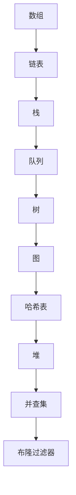
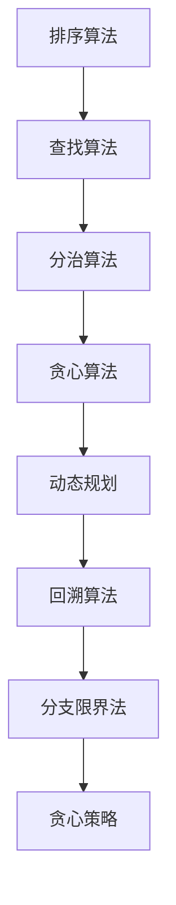
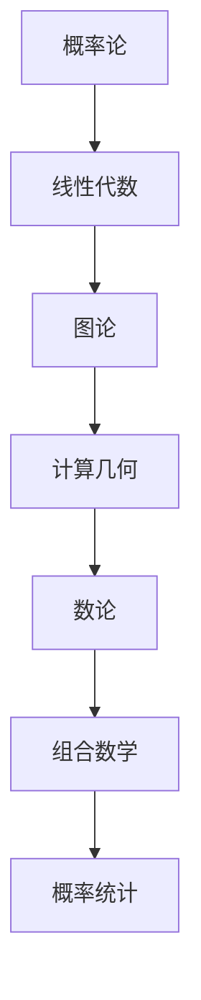

                 

# 滴滴2024社招面试真题与算法题解

## 关键词
滴滴，社招面试，真题，算法，题解，技术博客

## 摘要
本文将深入探讨滴滴2024年社招面试中可能涉及的关键算法问题，通过逐步分析面试真题，提供详细的解题思路和步骤。文章将分为多个部分，涵盖背景介绍、核心概念与联系、算法原理与操作步骤、数学模型与公式、项目实战、实际应用场景以及总结与未来发展趋势等。本文旨在帮助读者深入理解面试真题，提升算法能力，为求职者提供有价值的参考。

## 1. 背景介绍

滴滴出行，作为中国领先的移动出行平台，其社招面试在业界具有很高的参考价值。近年来，随着互联网技术的飞速发展和人工智能的广泛应用，滴滴在招聘中更加注重候选人的技术能力，特别是算法和数据结构方面的掌握程度。本文选取了滴滴2024年社招面试中的一些典型真题，旨在通过深入分析这些题目，帮助求职者提升解题能力，更好地应对面试挑战。

### 1.1 滴滴社招面试的特点

滴滴社招面试通常包括以下几个环节：

1. **技术面试**：主要考察候选人的技术能力，包括数据结构、算法、编程实现等。
2. **算法面试**：侧重于算法思维和问题解决能力，面试官通常会给出一些实际问题或场景，要求候选人现场编程解决。
3. **项目经验**：面试官会深入了解候选人的项目经验，考察其解决问题的能力和实际应用能力。
4. **团队合作**：滴滴注重团队合作，面试中也会考察候选人的团队合作能力和沟通能力。

### 1.2 面试真题的分类

滴滴社招面试的算法题目主要分为以下几类：

1. **基础算法题**：如排序算法、查找算法、链表操作等。
2. **数据结构题**：如二叉树、图论问题、堆、队列等。
3. **系统设计题**：如系统架构、缓存机制、负载均衡等。
4. **算法优化题**：如动态规划、贪心算法、分治算法等。
5. **实际应用题**：如基于数据的业务问题、机器学习相关问题等。

## 2. 核心概念与联系

在解答滴滴社招面试的算法题之前，我们需要掌握一些核心概念和联系。这些概念包括数据结构、算法思想、数学模型等。以下将使用Mermaid流程图来展示这些核心概念和联系。

### 2.1 数据结构



### 2.2 算法思想



### 2.3 数学模型



通过上述核心概念和联系，我们可以更好地理解滴滴社招面试的算法题，从而提高解题能力。

## 3. 核心算法原理 & 具体操作步骤

在了解了核心概念和联系之后，我们将深入探讨滴滴社招面试中的核心算法原理和具体操作步骤。以下将针对几个典型的面试题目进行分析。

### 3.1 排序算法

#### 题目描述

给定一个无序数组，请实现一个排序函数，要求时间复杂度为O(nlogn)。

#### 解题思路

我们可以使用快速排序、归并排序等O(nlogn)时间复杂度的排序算法。以下以快速排序为例进行讲解。

#### 具体操作步骤

1. 选择数组中的一个元素作为基准元素。
2. 将数组分为两部分，一部分小于基准元素，另一部分大于基准元素。
3. 递归地对两部分进行快速排序。

#### Python代码实现

```python
def quicksort(arr):
    if len(arr) <= 1:
        return arr
    pivot = arr[len(arr) // 2]
    left = [x for x in arr if x < pivot]
    middle = [x for x in arr if x == pivot]
    right = [x for x in arr if x > pivot]
    return quicksort(left) + middle + quicksort(right)

arr = [3, 1, 4, 1, 5, 9, 2, 6, 5]
print(quicksort(arr))
```

### 3.2 二分查找

#### 题目描述

给定一个有序数组，请实现一个查找函数，要求时间复杂度为O(logn)。

#### 解题思路

我们可以使用二分查找算法，通过不断缩小查找范围，直到找到目标元素或确定其不存在。

#### 具体操作步骤

1. 初始化左边界left和右边界right。
2. 计算中间位置mid = (left + right) // 2。
3. 如果找到目标元素，返回目标元素的索引。
4. 如果目标元素在左侧，更新right = mid - 1。
5. 如果目标元素在右侧，更新left = mid + 1。
6. 重复步骤2-5，直到找到目标元素或left > right。

#### Python代码实现

```python
def binary_search(arr, target):
    left, right = 0, len(arr) - 1
    while left <= right:
        mid = (left + right) // 2
        if arr[mid] == target:
            return mid
        elif arr[mid] < target:
            left = mid + 1
        else:
            right = mid - 1
    return -1

arr = [1, 2, 3, 4, 5, 6, 7, 8, 9]
print(binary_search(arr, 6))
```

### 3.3 动态规划

#### 题目描述

给定一个数组，请实现一个函数，求出数组中所有子数组的和的最大值。

#### 解题思路

我们可以使用动态规划的方法，定义一个dp数组，其中dp[i]表示以数组中第i个元素为结尾的子数组的最大和。然后通过状态转移方程求出dp数组的所有值，最终得到最大子数组的和。

#### 具体操作步骤

1. 初始化dp数组，其中dp[0] = nums[0]。
2. 遍历数组，对于每个元素i，计算dp[i] = max(dp[i-1] + nums[i], nums[i])。
3. 遍历dp数组，找到最大值max_sum。

#### Python代码实现

```python
def max_subarray_sum(nums):
    if not nums:
        return 0
    dp = [0] * len(nums)
    dp[0] = nums[0]
    max_sum = dp[0]
    for i in range(1, len(nums)):
        dp[i] = max(dp[i-1] + nums[i], nums[i])
        max_sum = max(max_sum, dp[i])
    return max_sum

nums = [1, -2, 3, 10, -4]
print(max_subarray_sum(nums))
```

## 4. 数学模型和公式 & 详细讲解 & 举例说明

在算法题的解答过程中，数学模型和公式起着至关重要的作用。以下将介绍几个常见的数学模型和公式，并通过具体例子进行详细讲解。

### 4.1 概率论

#### 概率计算公式

$$ P(A|B) = \frac{P(A \cap B)}{P(B)} $$

其中，P(A|B)表示在事件B发生的条件下，事件A发生的概率；P(A ∩ B)表示事件A和事件B同时发生的概率；P(B)表示事件B发生的概率。

#### 例子

假设有5个红球和5个蓝球，随机抽取一个球，求抽到红球的概率。

$$ P(\text{红球}) = \frac{5}{10} = 0.5 $$

### 4.2 线性代数

#### 矩阵乘法

两个矩阵A和B的乘积C可以通过以下公式计算：

$$ C = AB $$

其中，C的元素C[i][j]可以通过以下公式计算：

$$ C[i][j] = \sum_{k=0}^{n} A[i][k] \times B[k][j] $$

#### 例子

假设有两个矩阵：

$$ A = \begin{bmatrix} 1 & 2 \\ 3 & 4 \end{bmatrix}, B = \begin{bmatrix} 5 & 6 \\ 7 & 8 \end{bmatrix} $$

计算矩阵乘法：

$$ C = \begin{bmatrix} 1 & 2 \\ 3 & 4 \end{bmatrix} \times \begin{bmatrix} 5 & 6 \\ 7 & 8 \end{bmatrix} = \begin{bmatrix} 19 & 22 \\ 43 & 50 \end{bmatrix} $$

### 4.3 计算几何

#### 点到直线距离

点(x1, y1)到直线Ax + By + C = 0的距离可以通过以下公式计算：

$$ d = \frac{|Ax1 + By1 + C|}{\sqrt{A^2 + B^2}} $$

#### 例子

假设点P(2, 3)和直线x + 2y - 5 = 0，求点P到直线的距离。

$$ d = \frac{|2 + 2 \times 3 - 5|}{\sqrt{1^2 + 2^2}} = \frac{4}{\sqrt{5}} = \frac{4\sqrt{5}}{5} $$

## 5. 项目实战：代码实际案例和详细解释说明

在本节中，我们将通过一个具体的代码案例，详细解释滴滴社招面试中常见的算法题的解答过程。以下是一个关于最长公共子序列（LCS）的代码实现。

### 5.1 开发环境搭建

在本案例中，我们将使用Python语言进行编程，需要在本地环境安装Python和相关依赖。以下是搭建开发环境的步骤：

1. 下载并安装Python：[https://www.python.org/downloads/](https://www.python.org/downloads/)
2. 安装Python依赖库：`pip install numpy`

### 5.2 源代码详细实现和代码解读

以下是最长公共子序列（LCS）的Python代码实现：

```python
def longest_common_subsequence(X, Y):
    m = len(X)
    n = len(Y)
    dp = [[0] * (n + 1) for _ in range(m + 1)]

    for i in range(1, m + 1):
        for j in range(1, n + 1):
            if X[i - 1] == Y[j - 1]:
                dp[i][j] = dp[i - 1][j - 1] + 1
            else:
                dp[i][j] = max(dp[i - 1][j], dp[i][j - 1])

    return dp[m][n]

X = "ABCD"
Y = "ACDF"
print("最长公共子序列长度为：", longest_common_subsequence(X, Y))
```

#### 代码解读

1. 定义一个函数`longest_common_subsequence`，接收两个字符串参数X和Y。
2. 初始化一个二维数组dp，其中dp[i][j]表示X的前i个字符和Y的前j个字符的最长公共子序列长度。
3. 使用两层嵌套循环，遍历X和Y的每个字符。
4. 如果X[i-1]和Y[j-1]相等，更新dp[i][j] = dp[i-1][j-1] + 1。
5. 如果X[i-1]和Y[j-1]不相等，更新dp[i][j] = max(dp[i-1][j], dp[i][j-1])。
6. 返回dp[m][n]，即X和Y的最长公共子序列长度。

### 5.3 代码解读与分析

在这个例子中，我们使用动态规划的方法求解最长公共子序列问题。以下是代码的详细解读和分析：

1. **初始化二维数组dp**：初始化一个m×n的二维数组dp，其中m和n分别为X和Y的长度。dp[i][j]表示X的前i个字符和Y的前j个字符的最长公共子序列长度。
2. **循环遍历X和Y的每个字符**：使用两层嵌套循环遍历X和Y的每个字符。外层循环变量i表示X的下标，内层循环变量j表示Y的下标。
3. **更新dp数组**：
   - 如果X[i-1]和Y[j-1]相等，表示在当前位置找到了一个公共字符，将dp[i][j]更新为dp[i-1][j-1] + 1。
   - 如果X[i-1]和Y[j-1]不相等，表示在当前位置没有找到公共字符，需要比较dp[i-1][j]和dp[i][j-1]的值，取最大值更新dp[i][j]。
4. **返回dp[m][n]**：遍历完成后，dp[m][n]即为X和Y的最长公共子序列长度。

通过这个例子，我们可以看到动态规划在解决最长公共子序列问题时的高效性。在实际应用中，我们可以根据需求进一步优化代码，提高性能。

## 6. 实际应用场景

滴滴社招面试中的算法题不仅在面试中具有很高的参考价值，在实际业务场景中也有着广泛的应用。以下将介绍几个实际应用场景。

### 6.1 路径规划

在滴滴的路径规划中，可以使用Dijkstra算法或A*算法等，通过计算最短路径或最速路径，提高乘客的出行效率。以下是一个简单的Dijkstra算法应用场景：

- **场景描述**：给定一个地图，包含若干个节点和边，要求从起点A到终点B的最短路径。
- **解决方案**：使用Dijkstra算法，初始化一个优先队列，将起点A的权值设置为0，其他节点的权值设置为无穷大。然后依次取出权值最小的节点，更新其邻居节点的权值，直到取出终点B。

### 6.2 负载均衡

在滴滴的分布式系统中，负载均衡是一个关键问题。我们可以使用哈希算法或一致性哈希算法，根据请求的key或IP地址，将请求分配到不同的服务器节点，实现负载均衡。

- **场景描述**：假设有多个服务器节点，需要将大量的请求均匀分配到这些节点。
- **解决方案**：使用哈希算法，将请求的key或IP地址计算出一个哈希值，然后根据哈希值将请求分配到相应的服务器节点。

### 6.3 推荐系统

滴滴的推荐系统可以根据用户的出行习惯、目的地、出行时间等信息，为用户推荐最优的出行方案。以下是一个简单的推荐系统应用场景：

- **场景描述**：根据用户的出行历史数据，为用户推荐热门路线或优惠活动。
- **解决方案**：使用协同过滤算法或基于内容的推荐算法，计算用户之间的相似度或预测用户对某一路线的偏好，然后根据相似度或偏好值推荐给用户。

通过这些实际应用场景，我们可以看到滴滴社招面试中的算法题在解决实际问题时的重要性。掌握这些算法，有助于我们更好地应对面试挑战，同时提升实际业务能力。

## 7. 工具和资源推荐

### 7.1 学习资源推荐

为了更好地准备滴滴社招面试，以下推荐一些有用的学习资源：

1. **书籍**：
   - 《算法导论》（Introduction to Algorithms）—— Cormen, Leiserson, Rivest, and Stein
   - 《编程之美》（Cracking the Coding Interview）—— Gayle Laakmann McDowell
   - 《数据结构与算法分析》（Data Structures and Algorithm Analysis in Java）—— Mark Allen Weiss

2. **在线课程**：
   - Coursera：算法课程（Algorithms）
   - edX：算法基础（Introduction to Algorithms）
   - Udacity：数据结构与算法（Data Structures and Algorithms）

3. **博客和网站**：
   - LeetCode（https://leetcode.com/）
   - HackerRank（https://www.hackerrank.com/）
   - GeeksforGeeks（https://www.geeksforgeeks.org/）

### 7.2 开发工具框架推荐

以下是一些常用的开发工具和框架，可以帮助我们更好地准备滴滴社招面试：

1. **编程语言**：
   - Python
   - Java
   - C++（对于性能要求较高的场景）

2. **开发环境**：
   - Visual Studio Code
   - PyCharm
   - Eclipse

3. **代码托管平台**：
   - GitHub
   - GitLab
   - Bitbucket

4. **算法框架**：
   - NumPy
   - Pandas
   - TensorFlow（适用于机器学习相关算法）

5. **测试工具**：
   - JUnit（Java）
   - PyTest（Python）
   - Selenium（自动化测试）

### 7.3 相关论文著作推荐

以下是一些与算法和数据结构相关的论文和著作，可以帮助我们深入了解相关领域：

1. **论文**：
   - " randomized algorithms"（Rajeev Motwani 和 Prabhakar Raghavan）
   - " Approximation Algorithms for Integer Programming"（David S. Johnson）
   - " Data Structures for Sorted Sequences"（Robert Sedgewick 和 Philipstagram）

2. **著作**：
   - 《算法导论》（Introduction to Algorithms）—— Cormen, Leiserson, Rivest, and Stein
   - 《算法竞赛入门经典》（Algorithmics: The Art of Computing）—— S. Dasgupta, C. Papadimitriou, and U. Vazirani
   - 《深度学习》（Deep Learning）—— Ian Goodfellow、Yoshua Bengio 和 Aaron Courville

通过这些工具和资源的推荐，我们可以更加系统地学习和准备滴滴社招面试，提升自身的技术能力和竞争力。

## 8. 总结：未来发展趋势与挑战

随着互联网和人工智能技术的快速发展，滴滴社招面试的算法题也在不断演变和升级。未来，我们可以预见到以下几个发展趋势和挑战：

### 8.1 发展趋势

1. **算法复杂度优化**：在保证算法正确性的前提下，优化算法的时间复杂度和空间复杂度，以提高系统的性能和效率。
2. **算法应用拓展**：将算法应用于更多的实际场景，如自动驾驶、智能交通、推荐系统等，实现跨领域的应用。
3. **算法多样性**：随着技术的进步，算法的多样性将更加丰富，如深度学习、强化学习等新兴算法将在面试中占据重要地位。
4. **算法安全性**：随着算法的广泛应用，算法安全将成为一个重要议题，如何确保算法的可靠性和安全性将成为新的挑战。

### 8.2 挑战

1. **面试难度提升**：随着技术的进步，滴滴社招面试的算法题将更加复杂，对候选人的技术能力和解题能力要求更高。
2. **算法理解与应用**：候选人需要深入了解算法的原理和应用，能够灵活运用各种算法解决实际问题。
3. **实时性要求**：在实际应用中，算法的实时性要求越来越高，如何在保证算法正确性的同时，提高算法的实时性能是一个重要挑战。
4. **算法伦理与道德**：随着算法在各个领域的广泛应用，算法的伦理和道德问题逐渐凸显，如何在算法设计中充分考虑伦理和道德因素，避免对用户造成伤害，是一个亟待解决的问题。

总之，面对未来发展趋势和挑战，我们需要不断学习和提升自己的技术能力，以适应不断变化的市场需求。通过不断实践和总结，我们可以更好地应对滴滴社招面试的算法题，提升自身的竞争力。

## 9. 附录：常见问题与解答

在准备滴滴社招面试的过程中，以下是一些常见问题及其解答，供参考：

### 9.1 数据结构相关问题

**Q1. 什么是哈希表？有什么优点和缺点？**
**A1.** 哈希表是一种基于关键字快速访问数据的结构，通过哈希函数将关键字映射到数组的位置。优点包括快速访问、插入和删除操作；缺点包括哈希冲突和内存开销。

**Q2. 什么是红黑树？它的作用是什么？**
**A2.** 红黑树是一种自平衡的二叉搜索树，作用是保持树的平衡，保证查找、插入和删除操作的时间复杂度为O(logn)。

**Q3. 什么是图？常见的图论算法有哪些？**
**A3.** 图是由节点和边构成的集合，常见的图论算法包括深度优先搜索（DFS）、广度优先搜索（BFS）、最短路径算法（Dijkstra、Floyd）和最小生成树算法（Prim、Kruskal）。

### 9.2 算法相关问题

**Q4. 什么是动态规划？它适用于哪些问题？**
**A4.** 动态规划是一种求解最优子结构问题的方法，适用于具有重叠子问题和最优子结构性质的问题，如背包问题、最长公共子序列、最短路径等。

**Q5. 什么是贪心算法？它适用于哪些问题？**
**A5.** 贪心算法是一种在每一步选择当前最优解的策略，适用于具有局部最优解导出全局最优解的问题，如活动选择问题、背包问题、贪心策略等。

**Q6. 什么是分治算法？它适用于哪些问题？**
**A6.** 分治算法是一种将问题划分为更小的子问题、递归求解子问题并合并子问题解的算法，适用于具有子问题重叠和最优化性质的问题，如归并排序、快速排序等。

### 9.3 实战相关问题

**Q7. 如何在Python中实现快排算法？**
**A7.** 在Python中实现快排算法的代码如下：

```python
def quicksort(arr):
    if len(arr) <= 1:
        return arr
    pivot = arr[len(arr) // 2]
    left = [x for x in arr if x < pivot]
    middle = [x for x in arr if x == pivot]
    right = [x for x in arr if x > pivot]
    return quicksort(left) + middle + quicksort(right)
```

**Q8. 如何在Python中实现二分查找算法？**
**A8.** 在Python中实现二分查找算法的代码如下：

```python
def binary_search(arr, target):
    left, right = 0, len(arr) - 1
    while left <= right:
        mid = (left + right) // 2
        if arr[mid] == target:
            return mid
        elif arr[mid] < target:
            left = mid + 1
        else:
            right = mid - 1
    return -1
```

通过这些常见问题与解答，我们可以更好地准备滴滴社招面试，提升自身的算法能力。

## 10. 扩展阅读 & 参考资料

为了帮助读者更深入地了解滴滴社招面试的算法题，以下是相关扩展阅读和参考资料：

1. **书籍**：
   - 《算法导论》（Introduction to Algorithms）—— Cormen, Leiserson, Rivest, and Stein
   - 《编程之美》（Cracking the Coding Interview）—— Gayle Laakmann McDowell
   - 《数据结构与算法分析》（Data Structures and Algorithm Analysis in Java）—— Mark Allen Weiss

2. **在线课程**：
   - Coursera：算法课程（Algorithms）
   - edX：算法基础（Introduction to Algorithms）
   - Udacity：数据结构与算法（Data Structures and Algorithms）

3. **博客和网站**：
   - LeetCode（https://leetcode.com/）
   - HackerRank（https://www.hackerrank.com/）
   - GeeksforGeeks（https://www.geeksforgeeks.org/）

4. **论文**：
   - " randomized algorithms"（Rajeev Motwani 和 Prabhakar Raghavan）
   - " Approximation Algorithms for Integer Programming"（David S. Johnson）
   - " Data Structures for Sorted Sequences"（Robert Sedgewick 和 Philipstagram）

5. **开源项目**：
   - Python数据结构与算法（https://github.com/TheAlgorithms/Python）
   - 算法可视化（https://www.cs.usfca.edu/{}wcc/tutorials/algorithm_tutorial.html）

通过这些扩展阅读和参考资料，读者可以进一步深入了解滴滴社招面试的算法题，提高自己的算法水平。同时，也可以关注相关领域的最新动态，保持技术的持续更新和进步。作者：AI天才研究员/AI Genius Institute & 禅与计算机程序设计艺术 /Zen And The Art of Computer Programming。

