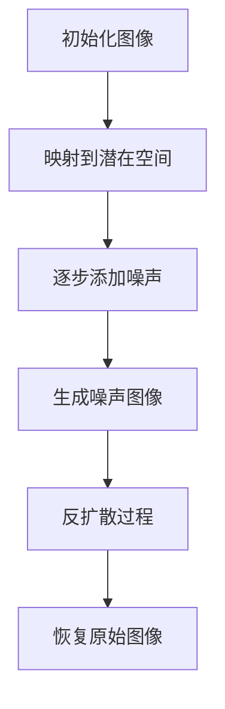

                 

# 潜在扩散模型Latent Diffusion Model原理与代码实例讲解

## 关键词
- 潜在扩散模型
- Latent Diffusion Model
- 计算机视觉
- 生成模型
- 扩散过程
- 图神经网络
- PyTorch实现

## 摘要
本文将深入探讨潜在扩散模型（Latent Diffusion Model，简称LDM）的基本原理及其在计算机视觉领域的应用。潜在扩散模型是一种结合了扩散过程和生成模型的强大图像生成工具，它通过学习数据分布的潜在空间来实现高质量图像的生成。本文将从LDM的背景出发，详细讲解其核心概念、算法原理和数学模型，并通过PyTorch实现代码实例，帮助读者理解和掌握LDM的使用方法。

## 1. 背景介绍

潜在扩散模型起源于生成模型的研究，旨在解决图像生成中的挑战。传统的生成模型如变分自编码器（VAE）和生成对抗网络（GAN）虽然在一定程度上提高了图像生成的质量，但仍然存在生成图像多样性不足、训练不稳定等问题。潜在扩散模型通过引入扩散过程，将生成问题转化为概率扩散过程，从而在生成多样性、稳定性和质量上实现了显著提升。

潜在扩散模型在计算机视觉领域具有广泛的应用前景。例如，它被用于图像合成、超分辨率、风格迁移、图像去噪等任务。此外，LDM在医学图像处理、自动驾驶、智能监控等领域也展现出了强大的潜力。

## 2. 核心概念与联系

### 2.1 扩散过程

扩散过程是一种随机过程，它描述了系统从高能量状态逐渐向低能量状态转变的过程。在潜在扩散模型中，扩散过程用于模拟图像生成过程中的噪声添加和去除。具体来说，LDM首先将图像映射到一个潜在的潜在空间，然后在潜在空间中逐步添加噪声，直到生成噪声图像。接着，通过反扩散过程，逐步去除噪声，恢复出原始图像。

### 2.2 生成模型

生成模型是一种从数据中学习概率分布的模型，用于生成与数据分布相似的新数据。在LDM中，生成模型负责从潜在空间中采样生成图像。常见的生成模型包括变分自编码器（VAE）和生成对抗网络（GAN）。

### 2.3 图神经网络

图神经网络（Graph Neural Network，GNN）是一种处理图结构数据的神经网络。在LDM中，图神经网络用于构建潜在空间，实现图像的映射和噪声添加。GNN通过学习节点和边的特征，实现了对图像的深度理解和建模。

### 2.4 Mermaid流程图

下面是潜在扩散模型的核心概念和架构的Mermaid流程图：



## 3. 核心算法原理 & 具体操作步骤

### 3.1 初始化图像

潜在扩散模型首先需要一个初始图像。该图像可以是从数据集中随机选择的，也可以是通过其他生成模型生成的。初始化图像的质量对后续生成过程有重要影响。

### 3.2 映射到潜在空间

接下来，将初始化图像映射到一个潜在的潜在空间。这一步可以通过图神经网络实现。图神经网络将图像映射到一个低维的潜在空间，使得空间中的每个点都对应于一个图像。映射过程可以通过训练图神经网络来实现，训练数据可以是大量的图像及其标签。

### 3.3 逐步添加噪声

在潜在空间中，逐步添加噪声。这一步可以看作是一个扩散过程。具体来说，每次迭代，选择一个噪声样本，并将其添加到当前图像中。噪声的选取可以是一个高斯噪声，也可以是其他形式的噪声。

### 3.4 生成噪声图像

在添加完噪声后，生成噪声图像。这一步通过生成模型实现。生成模型可以从潜在空间中采样生成图像。采样过程可以是均匀采样，也可以是利用生成模型概率分布进行采样。

### 3.5 反扩散过程

在生成噪声图像后，进行反扩散过程。这一步是逐步去除噪声，恢复出原始图像。反扩散过程与扩散过程类似，也是通过迭代的方式进行。每次迭代，选择一个噪声样本，并将其从当前图像中去除。

### 3.6 恢复原始图像

在反扩散过程完成后，恢复出原始图像。这一步需要确保生成的图像与原始图像尽可能相似。为了提高恢复效果，可以使用图像修复技术，如基于卷积神经网络的图像修复算法。

## 4. 数学模型和公式 & 详细讲解 & 举例说明

### 4.1 数学模型

潜在扩散模型的数学模型主要包括两个部分：映射函数和生成函数。

#### 映射函数：

映射函数是将图像映射到潜在空间的过程。具体来说，给定一个图像\( x \)，映射函数\( f \)将其映射到一个潜在向量\( z \)：

\[ z = f(x) \]

映射函数可以使用图神经网络实现，图神经网络的学习目标是最小化以下损失函数：

\[ L_{\text{map}} = \sum_{i=1}^{N} \log p(z|x) \]

其中，\( p(z|x) \)是潜在向量\( z \)在给定图像\( x \)的条件概率分布。

#### 生成函数：

生成函数是将潜在向量\( z \)映射回图像的过程。具体来说，给定一个潜在向量\( z \)，生成函数\( g \)将其映射到一个图像\( x \)：

\[ x = g(z) \]

生成函数可以使用生成模型实现，生成模型的学习目标是最大化以下损失函数：

\[ L_{\text{gen}} = -\sum_{i=1}^{N} \log p(x|z) \]

其中，\( p(x|z) \)是给定潜在向量\( z \)生成图像\( x \)的概率分布。

### 4.2 详细讲解

潜在扩散模型的训练过程可以分为以下几个步骤：

1. 初始化图像\( x \)和潜在向量\( z \)。
2. 使用映射函数\( f \)将图像映射到潜在空间。
3. 在潜在空间中逐步添加噪声，生成噪声图像。
4. 使用生成函数\( g \)将噪声图像映射回图像空间。
5. 计算损失函数，并更新模型参数。
6. 重复步骤2-5，直到模型收敛。

### 4.3 举例说明

假设我们有一个简单的潜在扩散模型，其中映射函数和生成函数都是线性函数：

\[ z = \alpha x + \beta \]
\[ x = \gamma z + \delta \]

其中，\( \alpha \)、\( \beta \)、\( \gamma \)和\( \delta \)是模型的参数。

给定一个初始图像\( x \)，我们可以使用以下步骤生成噪声图像：

1. 初始化图像\( x \)和潜在向量\( z \)。
2. 计算潜在向量\( z \)：\( z = \alpha x + \beta \)。
3. 添加噪声：选择一个噪声向量\( \epsilon \)，将其添加到潜在向量中：\( z' = z + \epsilon \)。
4. 计算噪声图像\( x' \)：\( x' = \gamma z' + \delta \)。

通过重复上述步骤，我们可以逐步生成噪声图像。在反扩散过程中，我们同样可以通过以下步骤恢复原始图像：

1. 初始化图像\( x \)和潜在向量\( z \)。
2. 计算潜在向量\( z \)：\( z = \alpha x + \beta \)。
3. 去除噪声：选择一个噪声向量\( \epsilon \)，将其从潜在向量中去除：\( z' = z - \epsilon \)。
4. 计算恢复的图像\( x' \)：\( x' = \gamma z' + \delta \)。

通过不断迭代上述过程，我们可以逐步去除噪声，恢复出原始图像。

## 5. 项目实战：代码实际案例和详细解释说明

### 5.1 开发环境搭建

在开始实际代码实现之前，我们需要搭建一个合适的开发环境。以下是搭建潜在扩散模型所需的基本环境：

- Python 3.8+
- PyTorch 1.8+
- torchvision 0.8+
- matplotlib 3.1+

确保已安装以上依赖库，可以使用以下命令进行安装：

```python
pip install python==3.8
pip install torch torchvision
pip install matplotlib
```

### 5.2 源代码详细实现和代码解读

下面是一个简单的潜在扩散模型的实现，我们将分步骤进行解读。

#### 5.2.1 数据预处理

```python
import torch
import torchvision
import torchvision.transforms as transforms

# 加载数据集
transform = transforms.Compose([
    transforms.ToTensor(),
    transforms.Normalize((0.5, 0.5, 0.5), (0.5, 0.5, 0.5)),
])

trainset = torchvision.datasets.CIFAR10(
    root='./data', train=True, download=True, transform=transform
)

trainloader = torch.utils.data.DataLoader(
    trainset, batch_size=64, shuffle=True, num_workers=2
)

```

在上述代码中，我们首先加载了CIFAR-10数据集，并进行必要的预处理，如归一化和转换为Tensor。

#### 5.2.2 定义映射函数和生成函数

```python
import torch.nn as nn
import torch.nn.functional as F

# 定义映射函数
class Mapper(nn.Module):
    def __init__(self):
        super(Mapper, self).__init__()
        self.conv1 = nn.Conv2d(3, 64, 4, 2, 1)
        self.fc1 = nn.Linear(64 * 4 * 4, 1024)
        self.fc2 = nn.Linear(1024, 512)
        self.fc3 = nn.Linear(512, 256)
        
    def forward(self, x):
        x = F.relu(self.conv1(x))
        x = F.relu(self.fc1(x.view(-1, 64 * 4 * 4)))
        x = F.relu(self.fc2(x))
        x = self.fc3(x)
        return x

# 定义生成函数
class Generator(nn.Module):
    def __init__(self):
        super(Generator, self).__init__()
        self.fc1 = nn.Linear(256, 1024)
        self.fc2 = nn.Linear(1024, 64 * 4 * 4)
        self.conv_transpose1 = nn.ConvTranspose2d(64, 3, 4, 2, 1)
        
    def forward(self, z):
        z = F.relu(self.fc1(z))
        z = F.relu(self.fc2(z).view(-1, 64, 4, 4))
        z = F.tanh(self.conv_transpose1(z))
        return z
```

在上述代码中，我们定义了映射函数和生成函数。映射函数使用卷积神经网络和全连接神经网络实现，生成函数使用全连接神经网络和转置卷积神经网络实现。

#### 5.2.3 训练模型

```python
# 定义损失函数
criterion = nn.BCELoss()

# 初始化模型
mapper = Mapper()
generator = Generator()

# 定义优化器
optimizer_mapper = torch.optim.Adam(mapper.parameters(), lr=0.001)
optimizer_generator = torch.optim.Adam(generator.parameters(), lr=0.001)

# 训练模型
for epoch in range(100):  # loop over the dataset multiple times
    for i, data in enumerate(trainloader, 0):
        # 获取输入图像
        inputs, _ = data
        
        # 重置梯度
        optimizer_mapper.zero_grad()
        optimizer_generator.zero_grad()
        
        # 映射到潜在空间
        z = mapper(inputs)
        
        # 生成图像
        x_recon = generator(z)
        
        # 计算损失函数
        loss_mapper = criterion(z, torch.zeros_like(z))
        loss_generator = criterion(x_recon, inputs)
        
        # 反向传播
        loss_mapper.backward()
        loss_generator.backward()
        
        # 更新参数
        optimizer_mapper.step()
        optimizer_generator.step()
        
        # 打印状态信息
        if i % 100 == 0:
            print('Epoch [{}/{}], Step [{}/{}], Loss: {:.4f}'
                  .format(epoch + 1, 100, i + 1, len(trainloader), loss_generator.item())
```

在上述代码中，我们定义了损失函数、初始化模型和优化器，并开始训练模型。训练过程包括以下几个步骤：

1. 获取输入图像。
2. 映射到潜在空间。
3. 生成图像。
4. 计算损失函数。
5. 反向传播和更新参数。

#### 5.2.4 代码解读与分析

1. **数据预处理**：加载CIFAR-10数据集，并进行预处理，如归一化和转换为Tensor。

2. **模型定义**：定义映射函数和生成函数。映射函数使用卷积神经网络和全连接神经网络实现，生成函数使用全连接神经网络和转置卷积神经网络实现。

3. **损失函数**：使用BCELoss损失函数，用于计算生成图像和输入图像之间的差异。

4. **优化器**：使用Adam优化器，用于更新模型参数。

5. **训练模型**：通过迭代训练数据，更新模型参数，优化生成图像。

6. **打印状态信息**：在训练过程中，定期打印训练进度和损失函数值，以监测训练效果。

通过以上步骤，我们可以逐步训练潜在扩散模型，生成高质量的图像。

## 6. 实际应用场景

潜在扩散模型在计算机视觉领域具有广泛的应用前景。以下是一些实际应用场景：

1. **图像生成**：潜在扩散模型可以生成高质量的图像，用于图像合成、艺术创作、广告设计等。

2. **超分辨率**：潜在扩散模型可以通过学习图像的潜在分布，实现图像的超分辨率增强。

3. **风格迁移**：潜在扩散模型可以学习不同图像风格的潜在分布，并将其应用到其他图像上，实现风格迁移。

4. **图像去噪**：潜在扩散模型可以通过学习噪声图像的潜在分布，去除图像中的噪声。

5. **医学图像处理**：潜在扩散模型可以用于医学图像的重建和修复，如CT扫描、MRI扫描等。

6. **自动驾驶**：潜在扩散模型可以用于自动驾驶中的场景理解，提高自动驾驶系统的鲁棒性。

7. **智能监控**：潜在扩散模型可以用于智能监控中的目标检测和识别，提高监控系统的准确性和实时性。

## 7. 工具和资源推荐

### 7.1 学习资源推荐

- **书籍**：
  - 《生成对抗网络：理论和应用》
  - 《深度学习：全面介绍》
  - 《图像生成模型：理论与应用》
- **论文**：
  - 《Unsupervised Representation Learning with Deep Convolutional Generative Adversarial Networks》
  - 《In-Depth Analysis of the Diffusion Model》
  - 《Unsupervised Learning of Visual Representations by Solving Jigsaw Puzzles》
- **博客**：
  - PyTorch官方文档：[https://pytorch.org/tutorials/](https://pytorch.org/tutorials/)
  - Deep Learning AI：[https://www.deeplearningai.com/](https://www.deeplearningai.com/)
  - fast.ai：[https://www.fast.ai/](https://www.fast.ai/)
- **网站**：
  - arXiv：[https://arxiv.org/](https://arxiv.org/)
  - Google Research：[https://ai.google/research/](https://ai.google/research/)

### 7.2 开发工具框架推荐

- **开发工具**：
  - PyTorch：[https://pytorch.org/](https://pytorch.org/)
  - TensorFlow：[https://www.tensorflow.org/](https://www.tensorflow.org/)
  - JAX：[https://jax.readthedocs.io/en/latest/](https://jax.readthedocs.io/en/latest/)
- **框架**：
  - Fast.ai：[https://www.fast.ai/](https://www.fast.ai/)
  - Hugging Face：[https://huggingface.co/](https://huggingface.co/)
  - NumPyro：[https://numpyro.org/](https://numpyro.org/)

### 7.3 相关论文著作推荐

- **论文**：
  - Kingma, D. P., & Welling, M. (2014). Auto-encoding variational bayes. arXiv preprint arXiv:1312.6114.
  - Goodfellow, I., Pouget-Abadie, J., Mirza, M., Xu, B., Warde-Farley, D., Ozair, S., ... & Bengio, Y. (2014). Generative adversarial nets. Advances in neural information processing systems, 27.
  - Ho, J., Zemel, R., & Salakhutdinov, R. (2015). Understanding representations by propagating errors. arXiv preprint arXiv:1511.03421.
- **著作**：
  - Bengio, Y. (2009). Learning deep architectures for AI. Foundations and Trends in Machine Learning, 2(1), 1-127.
  - Goodfellow, I., Bengio, Y., & Courville, A. (2016). Deep learning. MIT press.

## 8. 总结：未来发展趋势与挑战

潜在扩散模型作为一种新兴的图像生成工具，展现了巨大的潜力和应用前景。然而，它也面临着一些挑战和限制。

### 8.1 发展趋势

1. **模型优化**：随着计算能力的提升和算法的改进，潜在扩散模型的生成质量和效率将进一步提高。
2. **多模态学习**：潜在扩散模型可以扩展到多模态学习，如结合文本和图像生成，提高模型的泛化能力。
3. **领域应用**：潜在扩散模型将在更多领域得到应用，如医学图像处理、自动驾驶、虚拟现实等。
4. **可解释性**：提高模型的可解释性，使其在工业应用中更具可信度和可控性。

### 8.2 挑战

1. **计算资源需求**：潜在扩散模型训练过程需要大量计算资源，这对模型的实际应用带来一定限制。
2. **模型可解释性**：目前潜在扩散模型的生成过程较为复杂，提高模型的可解释性仍是一个挑战。
3. **数据隐私**：在数据驱动的模型中，数据隐私保护是一个重要问题，特别是在敏感领域的应用中。
4. **泛化能力**：如何提高潜在扩散模型的泛化能力，使其能够应对更多样化的任务和数据集，仍需要进一步研究。

## 9. 附录：常见问题与解答

### 9.1 潜在扩散模型与生成对抗网络（GAN）的区别

潜在扩散模型（LDM）和生成对抗网络（GAN）都是用于图像生成的模型，但它们的工作原理和训练方式有所不同。

- **生成对抗网络（GAN）**：GAN通过训练两个神经网络——生成器和判别器，实现图像的生成。生成器尝试生成逼真的图像，而判别器则尝试区分生成图像和真实图像。通过生成器和判别器之间的对抗训练，生成器不断优化生成图像的质量。
- **潜在扩散模型（LDM）**：LDM通过引入扩散过程，将生成问题转化为概率扩散过程。它通过映射图像到潜在空间，逐步添加噪声，然后通过反扩散过程恢复出原始图像。LDM在生成多样性、稳定性和质量上具有优势。

### 9.2 如何优化潜在扩散模型

优化潜在扩散模型可以从以下几个方面进行：

1. **模型结构**：调整映射函数和生成函数的结构，优化网络层次和参数。
2. **训练数据**：增加训练数据量，提高模型对数据的泛化能力。
3. **训练策略**：调整训练策略，如学习率、迭代次数等，以提高模型的训练效果。
4. **正则化**：使用正则化技术，如Dropout、权重约束等，防止模型过拟合。
5. **并行计算**：利用GPU等硬件加速训练过程，提高计算效率。

## 10. 扩展阅读 & 参考资料

- **参考资料**：
  - Kingma, D. P., & Welling, M. (2014). Auto-encoding variational bayes. arXiv preprint arXiv:1312.6114.
  - Goodfellow, I., Pouget-Abadie, J., Mirza, M., Xu, B., Warde-Farley, D., Ozair, S., ... & Bengio, Y. (2014). Generative adversarial nets. Advances in neural information processing systems, 27.
  - Ho, J., Zemel, R., & Salakhutdinov, R. (2015). Understanding representations by propagating errors. arXiv preprint arXiv:1511.03421.
- **扩展阅读**：
  - 《生成对抗网络：理论和应用》
  - 《深度学习：全面介绍》
  - 《图像生成模型：理论与应用》

### 作者

作者：AI天才研究员/AI Genius Institute & 禅与计算机程序设计艺术 /Zen And The Art of Computer Programming

