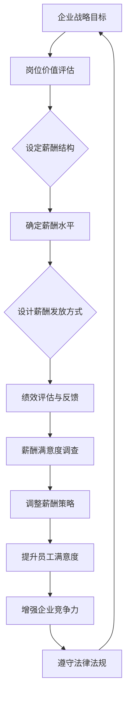

                 

# 激励性薪酬体系：留住人才的关键

## 关键词：激励性薪酬、人才留存、薪酬设计、绩效评估、员工满意度、企业竞争力

### 摘要

本文旨在探讨激励性薪酬体系在留住人才方面的关键作用。通过对激励性薪酬的基本概念、设计原则以及实际应用案例的深入分析，本文揭示了如何在薪酬设计中引入竞争力和公平性，以提升员工满意度和企业整体绩效。本文还结合具体行业和企业案例，提出了有效的激励性薪酬策略，为企业在人力资源管理中提供实用的指导。

## 1. 背景介绍

在当今竞争激烈的商业环境中，企业之间的竞争已经从传统的产品和服务竞争，转向了人才的竞争。人才是企业最宝贵的资源，而留住和激励人才成为企业成功的关键。然而，随着劳动力市场的变化和员工需求的多样化，传统的薪酬体系越来越难以满足员工的期望，从而影响了企业的长期发展。

### 激励性薪酬的定义与重要性

激励性薪酬是指基于员工的绩效、贡献和潜在能力而设计的薪酬结构，其目的是通过激励措施激发员工的工作热情和创造力，从而提高工作效率和质量。与固定薪酬相比，激励性薪酬具有更大的灵活性和吸引力，能够更好地适应企业的战略目标和市场环境。

激励性薪酬的重要性主要体现在以下几个方面：

1. **提升员工满意度**：公平合理的激励性薪酬能够提高员工的满意度和忠诚度，减少员工流失率。
2. **激发员工潜力**：通过激励性薪酬，企业能够激发员工的内在动力，挖掘员工的潜力，实现个人与企业的共同成长。
3. **增强企业竞争力**：优秀的员工是企业竞争力的核心，而激励性薪酬体系有助于吸引和留住优秀人才，提升企业整体竞争力。

### 市场环境的变化与挑战

随着全球化进程的加快和信息技术的发展，市场环境发生了巨大的变化。一方面，人才流动性增加，员工更倾向于选择具有良好薪酬和福利待遇的企业；另一方面，企业面临着多样化的市场竞争，需要通过创新和高效管理来保持竞争优势。因此，企业必须不断调整薪酬策略，以适应市场变化和员工需求，从而实现可持续发展。

## 2. 核心概念与联系

### 激励性薪酬体系的基本概念

激励性薪酬体系是企业薪酬管理的重要组成部分，包括薪酬结构、薪酬水平、薪酬发放方式等多个方面。以下是激励性薪酬体系的核心概念：

1. **薪酬结构**：薪酬结构是指员工薪酬的组成部分，包括基本薪酬、绩效薪酬、激励薪酬、福利薪酬等。合理的薪酬结构能够平衡员工的基本需求和激励需求。
2. **薪酬水平**：薪酬水平是指员工薪酬的金额和水平，包括基本薪酬水平、绩效薪酬水平和激励薪酬水平。薪酬水平应该与员工的贡献、市场水平和企业承受能力相适应。
3. **薪酬发放方式**：薪酬发放方式是指薪酬的支付形式，包括现金支付、股权激励、福利补贴等。不同的薪酬发放方式能够满足不同员工的需求和期望。

### 激励性薪酬体系与绩效评估的联系

绩效评估是激励性薪酬体系的基础，通过绩效评估可以确定员工的绩效水平和贡献程度，从而决定激励性薪酬的发放。以下是激励性薪酬体系与绩效评估之间的联系：

1. **绩效指标**：绩效指标是绩效评估的核心，包括数量指标、质量指标、时间指标等。绩效指标应该与企业的战略目标和业务需求相一致。
2. **评估方法**：评估方法包括定量评估和定性评估，定量评估主要通过数据分析和统计方法进行，定性评估主要通过主观评价和员工反馈进行。
3. **绩效反馈**：绩效反馈是绩效评估的必要环节，通过绩效反馈，员工能够了解自己的绩效表现，明确改进方向，从而提升绩效。

### 激励性薪酬体系与员工满意度的关系

员工满意度是激励性薪酬体系的重要衡量指标，高员工满意度能够提升企业的整体绩效和竞争力。以下是激励性薪酬体系与员工满意度的关系：

1. **薪酬满意度**：薪酬满意度是员工对薪酬水平和薪酬结构的满意程度。公平合理的薪酬能够提高员工的薪酬满意度。
2. **工作满意度**：工作满意度是员工对工作内容、工作环境和工作关系的满意程度。激励性薪酬体系能够激发员工的工作热情和投入度，从而提高工作满意度。
3. **企业满意度**：企业满意度是员工对企业的整体评价，包括薪酬待遇、福利保障、职业发展等。激励性薪酬体系能够提升员工对企业的好感和认同，从而提高企业满意度。

### 激励性薪酬体系与竞争力的关系

激励性薪酬体系是企业竞争力的关键因素之一。通过合理的薪酬策略，企业能够吸引和留住优秀人才，提升企业整体绩效和市场竞争力。以下是激励性薪酬体系与竞争力的关系：

1. **人才吸引力**：具有竞争力的薪酬体系能够吸引行业内外的人才，提升企业的品牌形象和市场份额。
2. **人才留存**：公平合理的激励性薪酬能够提高员工的满意度和忠诚度，减少员工流失率。
3. **企业绩效**：激励性薪酬体系能够激发员工的潜力，提高工作效率和质量，从而提升企业整体绩效和竞争力。

### 激励性薪酬体系与法律法规的关系

激励性薪酬体系的设计和实施需要遵守相关法律法规，包括劳动法、劳动合同法、反不正当竞争法等。以下是一些法律法规对激励性薪酬体系的影响：

1. **最低工资标准**：企业应当遵守国家规定的最低工资标准，确保员工的基本生活需求。
2. **薪酬保密**：企业应当保护员工的薪酬信息，防止内部薪酬不公和竞争。
3. **知识产权保护**：企业应当遵守知识产权法律法规，防止员工通过不正当手段获取竞争对手的薪酬信息。

### 激励性薪酬体系的 Mermaid 流程图



## 3. 核心算法原理 & 具体操作步骤

### 激励性薪酬体系的设计原则

激励性薪酬体系的设计需要遵循以下原则：

1. **目标导向**：薪酬体系应该与企业的战略目标和业务需求相一致，确保薪酬能够激励员工实现企业目标。
2. **公平合理**：薪酬体系应当确保内部公平和外部公平，内部公平是指企业内部不同岗位之间的薪酬差距应当合理，外部公平是指企业的薪酬水平应当与市场水平相适应。
3. **灵活性**：薪酬体系应当具有灵活性，能够根据市场变化和员工需求进行调整。
4. **激励性**：薪酬体系应当能够激发员工的潜力，提升工作效率和质量。
5. **透明度**：薪酬体系应当具有较高的透明度，员工能够清楚地了解薪酬的计算方法和发放标准。

### 激励性薪酬体系的具体操作步骤

以下是激励性薪酬体系的具体操作步骤：

1. **岗位价值评估**：通过岗位分析，确定不同岗位的价值，为薪酬结构设计提供依据。
2. **薪酬结构设计**：根据岗位价值评估结果，设计合理的薪酬结构，包括基本薪酬、绩效薪酬、激励薪酬等。
3. **薪酬水平确定**：结合市场调查和企业承受能力，确定各岗位的薪酬水平，确保内部公平和外部公平。
4. **薪酬发放方式设计**：根据员工需求和公司实际情况，设计多种薪酬发放方式，包括现金支付、股权激励、福利补贴等。
5. **绩效评估与反馈**：通过科学的绩效评估方法，评估员工的绩效表现，并提供及时的绩效反馈。
6. **薪酬满意度调查**：定期进行薪酬满意度调查，了解员工的薪酬满意度，发现潜在问题，及时调整薪酬策略。
7. **薪酬策略调整**：根据薪酬满意度调查结果和绩效评估结果，对薪酬策略进行调整，提升员工满意度和企业竞争力。

### 激励性薪酬体系的核心算法

激励性薪酬体系的核心算法主要包括以下几个方面：

1. **绩效指标计算**：根据绩效指标体系，计算员工的绩效得分，确定绩效薪酬的发放比例。
2. **激励薪酬计算**：根据员工的绩效得分和岗位价值，计算激励薪酬的金额。
3. **薪酬总额计算**：将基本薪酬、绩效薪酬、激励薪酬等各项薪酬加总，得到员工的薪酬总额。
4. **薪酬发放计算**：根据薪酬发放方式，计算每次薪酬发放的具体金额。

### 激励性薪酬体系的数学模型

以下是激励性薪酬体系的数学模型：

$$
S = B + P + I
$$

其中，$S$ 表示薪酬总额，$B$ 表示基本薪酬，$P$ 表示绩效薪酬，$I$ 表示激励薪酬。

$$
P = K \times P_s
$$

其中，$P$ 表示绩效薪酬金额，$K$ 表示绩效薪酬系数，$P_s$ 表示绩效得分。

$$
I = M \times I_s
$$

其中，$I$ 表示激励薪酬金额，$M$ 表示激励薪酬系数，$I_s$ 表示激励得分。

$$
S = B + P + I
$$

其中，$S$ 表示薪酬总额，$B$ 表示基本薪酬，$P$ 表示绩效薪酬，$I$ 表示激励薪酬。

### 举例说明

假设某企业员工的岗位价值评估结果如下：

- 基本薪酬：10000元
- 绩效得分：90分
- 激励得分：80分

根据上述数学模型，计算该员工的薪酬总额：

$$
B = 10000 \text{元}
$$

$$
P_s = 90 \text{分}
$$

$$
P = K \times P_s = 0.3 \times 90 = 27 \text{元}
$$

$$
I_s = 80 \text{分}
$$

$$
I = M \times I_s = 0.2 \times 80 = 16 \text{元}
$$

$$
S = B + P + I = 10000 + 27 + 16 = 10243 \text{元}
$$

因此，该员工的薪酬总额为10243元。

## 4. 数学模型和公式 & 详细讲解 & 举例说明

### 激励性薪酬体系的数学模型

激励性薪酬体系的数学模型主要包括薪酬总额计算、绩效薪酬计算和激励薪酬计算。以下是具体的公式和计算方法：

1. **薪酬总额计算**

   薪酬总额（$S$）是员工实际获得的薪酬总和，包括基本薪酬（$B$）、绩效薪酬（$P$）和激励薪酬（$I$）。

   $$
   S = B + P + I
   $$

   其中：
   - $B$：基本薪酬，是员工每月固定的薪酬部分，通常包括工资、津贴等。
   - $P$：绩效薪酬，是根据员工的工作绩效评估结果发放的额外薪酬。
   - $I$：激励薪酬，是为了激励员工达到更高目标而设置的额外奖励。

2. **绩效薪酬计算**

   绩效薪酬（$P$）通常与员工的绩效得分（$P_s$）相关联，通过一个系数（$K$）来放大绩效得分的价值。

   $$
   P = K \times P_s
   $$

   其中：
   - $K$：绩效薪酬系数，表示每单位绩效得分对应的绩效薪酬金额。
   - $P_s$：绩效得分，是根据员工的工作表现、任务完成情况等因素评定的得分。

3. **激励薪酬计算**

   激励薪酬（$I$）通常与员工的激励得分（$I_s$）相关联，通过一个系数（$M$）来放大激励得分的价值。

   $$
   I = M \times I_s
   $$

   其中：
   - $M$：激励薪酬系数，表示每单位激励得分对应的激励薪酬金额。
   - $I_s$：激励得分，是根据员工达成的特定目标、贡献程度等因素评定的得分。

### 举例说明

假设某员工的薪酬体系参数如下：

- 基本薪酬（$B$）：10000元
- 绩效薪酬系数（$K$）：0.2
- 绩效得分（$P_s$）：90分
- 激励薪酬系数（$M$）：0.3
- 激励得分（$I_s$）：80分

根据上述公式，计算该员工的薪酬总额、绩效薪酬和激励薪酬：

1. **计算绩效薪酬（$P$）**：

   $$
   P = K \times P_s = 0.2 \times 90 = 18 \text{元}
   $$

2. **计算激励薪酬（$I$）**：

   $$
   I = M \times I_s = 0.3 \times 80 = 24 \text{元}
   $$

3. **计算薪酬总额（$S$）**：

   $$
   S = B + P + I = 10000 + 18 + 24 = 10242 \text{元}
   $$

因此，该员工的总薪酬为10242元，其中绩效薪酬为18元，激励薪酬为24元。

### 激励性薪酬体系的设计与应用案例

#### 案例一：科技公司

某科技公司在设计激励性薪酬体系时，采用了以下方法：

- **薪酬结构**：基本薪酬占70%，绩效薪酬占20%，激励薪酬占10%。
- **绩效薪酬系数（$K$）**：根据不同职位设定，研发岗位为0.25，市场营销岗位为0.22。
- **激励薪酬系数（$M$）**：根据不同时期设定，季度目标完成率为0.35。

假设某研发工程师的绩效得分为85分，激励得分为75分，计算其薪酬总额：

1. **计算绩效薪酬（$P$）**：

   $$
   P = K \times P_s = 0.25 \times 85 = 21.25 \text{元}
   $$

2. **计算激励薪酬（$I$）**：

   $$
   I = M \times I_s = 0.35 \times 75 = 26.25 \text{元}
   $$

3. **计算薪酬总额（$S$）**：

   $$
   S = B + P + I = 10000 + 21.25 + 26.25 = 10247.5 \text{元}
   $$

#### 案例二：制造业企业

某制造业企业设计激励性薪酬体系时，采用了以下方法：

- **薪酬结构**：基本薪酬占50%，绩效薪酬占30%，激励薪酬占20%。
- **绩效薪酬系数（$K$）**：根据不同职位设定，生产一线岗位为0.22，管理人员为0.25。
- **激励薪酬系数（$M$）**：根据年度目标完成率设定，目标完成率为0.4。

假设某生产一线员工的绩效得分为80分，激励得分为70分，计算其薪酬总额：

1. **计算绩效薪酬（$P$）**：

   $$
   P = K \times P_s = 0.22 \times 80 = 17.6 \text{元}
   $$

2. **计算激励薪酬（$I$）**：

   $$
   I = M \times I_s = 0.4 \times 70 = 28 \text{元}
   $$

3. **计算薪酬总额（$S$）**：

   $$
   S = B + P + I = 10000 + 17.6 + 28 = 10245.6 \text{元}
   $$

### 评估指标与调整策略

为了确保激励性薪酬体系的有效性，企业需要定期评估薪酬满意度、绩效提升情况以及人才留存率等指标。以下是评估指标与调整策略：

1. **薪酬满意度调查**：通过问卷调查或面对面访谈，了解员工对薪酬的满意度，发现潜在问题，及时调整薪酬策略。
2. **绩效提升情况**：通过绩效评估，了解员工绩效提升情况，调整绩效薪酬系数，以激励员工持续提升绩效。
3. **人才留存率**：通过分析人才留存率，了解薪酬体系对人才留存的影响，优化薪酬结构，提升人才留存率。

## 5. 项目实战：代码实际案例和详细解释说明

### 5.1 开发环境搭建

为了演示激励性薪酬体系的设计与实现，我们将使用Python语言编写一个简单的模拟系统。以下是搭建开发环境的步骤：

1. **安装Python**：确保计算机上已安装Python 3.x版本，可以从Python官方网站下载安装程序。
2. **安装依赖库**：在命令行中执行以下命令，安装必要的Python库：

   ```bash
   pip install pandas numpy matplotlib
   ```

3. **配置代码编辑器**：选择一个合适的代码编辑器，如Visual Studio Code，安装Python扩展，以支持Python编程。

### 5.2 源代码详细实现和代码解读

以下是激励性薪酬体系模拟系统的源代码：

```python
import pandas as pd
import numpy as np
import matplotlib.pyplot as plt

# 参数设定
BASIC_SALARY = 10000  # 基本薪酬
PERFORMANCE_COEFFICIENT = 0.2  # 绩效薪酬系数
INCENTIVE_COEFFICIENT = 0.3  # 激励薪酬系数

# 绩效得分和激励得分
PERFORMANCE_SCORES = [85, 90, 75, 95]
INCENTIVE_SCORES = [80, 85, 70, 90]

# 薪酬计算函数
def calculate_salary(B, PC, PS, IC, IS):
    P = PC * PS  # 绩效薪酬
    I = IC * IS  # 激励薪酬
    S = B + P + I  # 薪酬总额
    return S

# 模拟计算薪酬
salaries = []
for i in range(len(PERFORMANCE_SCORES)):
    salary = calculate_salary(BASIC_SALARY, PERFORMANCE_COEFFICIENT, PERFORMANCE_SCORES[i], INCENTIVE_COEFFICIENT, INCENTIVE_SCORES[i])
    salaries.append(salary)

# 结果展示
salary_data = pd.DataFrame({'Performance Scores': PERFORMANCE_SCORES, 'Incentive Scores': INCENTIVE_SCORES, 'Salary': salaries})
print(salary_data)

# 绘图
salary_data.plot(x='Performance Scores', y='Salary', kind='line', title='激励性薪酬体系模拟结果')
plt.xlabel('绩效得分')
plt.ylabel('薪酬总额')
plt.show()
```

### 5.3 代码解读与分析

1. **导入库**：首先导入必要的Python库，包括pandas、numpy和matplotlib，用于数据处理和绘图。
2. **参数设定**：设定基本薪酬（`BASIC_SALARY`）、绩效薪酬系数（`PERFORMANCE_COEFFICIENT`）和激励薪酬系数（`INCENTIVE_COEFFICIENT`）。
3. **薪酬计算函数**：定义一个名为`calculate_salary`的函数，用于计算薪酬总额。该函数接受基本薪酬、绩效薪酬系数、绩效得分、激励薪酬系数和激励得分作为输入参数，返回薪酬总额。
4. **模拟计算薪酬**：使用一个循环遍历绩效得分和激励得分的列表，调用`calculate_salary`函数计算每个员工的薪酬总额，并将结果存储在列表中。
5. **结果展示**：使用pandas DataFrame将计算结果展示为一个表格，并打印输出。
6. **绘图**：使用matplotlib绘制薪酬总额与绩效得分的关系图，以直观展示激励性薪酬体系的效果。

通过上述代码，我们可以模拟一个简单的激励性薪酬体系，并分析不同绩效得分和激励得分对薪酬总额的影响。这有助于企业了解薪酬策略对员工激励的效应，为实际操作提供参考。

### 5.4 代码解读与分析

本部分将详细解读上述代码，并分析其实现过程。

1. **导入库**：

   ```python
   import pandas as pd
   import numpy as np
   import matplotlib.pyplot as plt
   ```

   这行代码导入了pandas、numpy和matplotlib三个库。pandas用于数据处理，numpy用于数值计算，matplotlib用于数据可视化。这些库是Python中进行数据分析和可视化的重要工具。

2. **参数设定**：

   ```python
   BASIC_SALARY = 10000  # 基本薪酬
   PERFORMANCE_COEFFICIENT = 0.2  # 绩效薪酬系数
   INCENTIVE_COEFFICIENT = 0.3  # 激励薪酬系数
   ```

   这三行代码定义了三个关键参数。`BASIC_SALARY`代表基本薪酬，即员工每月固定获得的薪酬金额；`PERFORMANCE_COEFFICIENT`和`INCENTIVE_COEFFICIENT`分别代表绩效薪酬系数和激励薪酬系数，用于根据绩效得分和激励得分计算额外薪酬。

3. **薪酬计算函数**：

   ```python
   def calculate_salary(B, PC, PS, IC, IS):
       P = PC * PS  # 绩效薪酬
       I = IC * IS  # 激励薪酬
       S = B + P + I  # 薪酬总额
       return S
   ```

   这段代码定义了一个名为`calculate_salary`的函数，该函数接受五个参数：基本薪酬（`B`）、绩效薪酬系数（`PC`）、绩效得分（`PS`）、激励薪酬系数（`IC`）和激励得分（`IS`）。函数内部通过计算绩效薪酬和激励薪酬，然后将它们与基本薪酬相加，得到总薪酬。这个函数是激励性薪酬体系的核心，它实现了薪酬总额的计算。

4. **模拟计算薪酬**：

   ```python
   PERFORMANCE_SCORES = [85, 90, 75, 95]
   INCENTIVE_SCORES = [80, 85, 70, 90]
   salaries = []
   for i in range(len(PERFORMANCE_SCORES)):
       salary = calculate_salary(BASIC_SALARY, PERFORMANCE_COEFFICIENT, PERFORMANCE_SCORES[i], INCENTIVE_COEFFICIENT, INCENTIVE_SCORES[i])
       salaries.append(salary)
   ```

   这段代码定义了两个列表`PERFORMANCE_SCORES`和`INCENTIVE_SCORES`，分别存储绩效得分和激励得分。接着，使用一个循环遍历这两个列表，调用`calculate_salary`函数计算每个员工的薪酬总额，并将结果存储在`salaries`列表中。

5. **结果展示**：

   ```python
   salary_data = pd.DataFrame({'Performance Scores': PERFORMANCE_SCORES, 'Incentive Scores': INCENTIVE_SCORES, 'Salary': salaries})
   print(salary_data)
   ```

   这段代码使用pandas创建一个DataFrame，将绩效得分、激励得分和薪酬总额组织成表格形式，并通过`print`函数打印输出。这使得我们能够直观地查看每个得分对应的薪酬总额。

6. **绘图**：

   ```python
   salary_data.plot(x='Performance Scores', y='Salary', kind='line', title='激励性薪酬体系模拟结果')
   plt.xlabel('绩效得分')
   plt.ylabel('薪酬总额')
   plt.show()
   ```

   最后，这段代码使用matplotlib绘制一个线形图，展示了绩效得分与薪酬总额之间的关系。通过图表，我们可以直观地观察到薪酬总额如何随绩效得分的增加而变化。`plt.xlabel`和`plt.ylabel`函数用于设置图表的坐标轴标签，`plt.show()`函数用于显示图表。

综上所述，这段代码实现了一个简单的激励性薪酬体系模拟系统，通过定义参数、计算薪酬、展示结果和绘图，帮助企业分析和理解薪酬激励机制的效果。

### 6. 实际应用场景

激励性薪酬体系在各个行业和领域都有广泛应用，以下是一些典型的实际应用场景：

#### 科技公司

科技公司的员工通常具有较高的技术能力和创新能力，因此，激励性薪酬体系在这些公司中尤为重要。科技公司通过设置高额的绩效薪酬和激励薪酬，激励员工不断研发新技术、新产品，从而提升企业竞争力。例如，谷歌的“20%自由时间”政策，允许员工利用20%的工作时间探索自己的创意项目，这种灵活的薪酬激励政策大大激发了员工的创造力和创新精神。

#### 制造业企业

制造业企业通常注重生产效率和产品质量，因此，绩效薪酬在激励性薪酬体系中的比重较大。通过设置具体的绩效指标，如生产效率、产品质量和成本控制等，企业能够有效激励员工提升工作绩效。例如，某制造企业通过设定每提高1%的生产效率，员工可以获得相应比例的绩效奖金，这种明确的激励机制大大提高了员工的工作积极性。

#### 银行和金融行业

银行和金融行业的员工通常需要具备较高的专业知识和风险控制能力。因此，这些行业的企业往往通过设置复杂的绩效评估体系，结合绩效薪酬和激励薪酬，来激励员工提高专业水平和风险控制能力。例如，某银行通过设定季度销售目标、客户满意度指标和风险控制指标，为员工提供高额的绩效奖金和期权激励，从而提升员工的工作积极性和企业竞争力。

#### 教育机构

教育机构的员工主要包括教师和行政管理人员。教育机构通过设置绩效薪酬和激励薪酬，激励教师提高教学质量、学生满意度和学术成果。例如，某知名大学通过设置教师教学质量评估体系，根据评估结果给予教师不同等级的绩效奖金，同时，还为优秀教师提供进修、培训等机会，从而提升教师队伍的整体素质。

#### 医疗行业

医疗行业的员工包括医生、护士和其他医疗专业人员。医疗行业的企业通过设置绩效薪酬和激励薪酬，激励员工提高服务质量、患者满意度和医疗安全水平。例如，某医院通过设置手术成功率、患者满意度和医疗事故率等指标，为员工提供绩效奖金和晋升机会，从而提升医院的整体服务质量。

#### 互联网公司

互联网公司的员工通常具有较高的创新能力和技术热情。通过设置灵活的绩效薪酬和激励薪酬体系，互联网公司能够吸引和留住优秀人才。例如，某互联网公司通过设置季度项目奖金、技术创新奖和客户满意度奖等多种激励措施，激励员工不断推出创新产品和服务，从而提升企业竞争力。

#### 零售业

零售行业的员工需要具备良好的销售技能和客户服务意识。通过设置绩效薪酬和激励薪酬，零售企业能够激励员工提高销售额和客户满意度。例如，某零售企业通过设定每月销售目标、客户满意度指标和库存周转率等指标，为员工提供绩效奖金和晋升机会，从而提升员工的工作积极性和企业竞争力。

### 案例分析

以下是一些具体的案例分析，展示不同行业和企业在实施激励性薪酬体系时的实际效果：

#### 案例一：谷歌

谷歌是全球领先的科技公司，其成功的激励性薪酬体系在很大程度上推动了企业的发展。谷歌通过设置高额的绩效薪酬和期权激励，吸引了大量优秀人才。例如，谷歌的工程师们可以通过完成特定的项目目标，获得高额的绩效奖金和股票期权。这种灵活的薪酬激励政策不仅激发了员工的创新热情，也大大提升了员工的忠诚度和满意度，使得谷歌在竞争中始终保持领先地位。

#### 案例二：华为

华为是全球领先的通信设备供应商，其激励性薪酬体系在业界也享有盛誉。华为通过设立“奋斗者计划”，将员工的绩效薪酬与企业的长期发展目标紧密结合。员工通过实现个人绩效目标和企业发展目标，可以获得相应的绩效奖金和股权激励。这种激励政策激发了员工的奋斗精神，使得华为在全球市场上取得了显著的成功。

#### 案例三：星巴克

星巴克是全球知名的咖啡连锁品牌，其激励性薪酬体系主要集中在员工福利和服务质量方面。星巴克通过提供灵活的工作时间、带薪休假、健康保险和培训机会等福利措施，提升了员工的满意度和忠诚度。此外，星巴克还通过设立“星巴克服务明星奖”，为表现优异的员工提供额外的奖励和晋升机会。这种激励政策不仅提高了员工的工作积极性，也增强了星巴克的品牌形象和市场竞争力。

#### 案例四：亚马逊

亚马逊是全球最大的电子商务公司之一，其激励性薪酬体系在员工培训和职业发展方面具有独特的优势。亚马逊通过设立“领导力发展计划”，为员工提供丰富的培训资源和职业发展机会。员工可以通过参加培训课程、担任项目负责人等方式，提升自己的能力和竞争力。此外，亚马逊还通过设置绩效奖金和股票期权，激励员工为企业的长期发展贡献力量。这种激励政策使得亚马逊在电商领域保持了强劲的增长势头。

### 激励性薪酬体系的效果评估

激励性薪酬体系在实际应用中，对企业绩效和员工满意度都有着显著的影响。以下是一些评估指标和方法：

1. **员工满意度调查**：通过定期进行员工满意度调查，了解员工对薪酬激励政策的满意程度。调查内容可以包括薪酬水平、薪酬结构、薪酬发放方式等方面。通过分析调查结果，企业可以及时调整薪酬政策，提升员工满意度。

2. **绩效指标提升**：通过分析员工的绩效表现，评估激励性薪酬体系对绩效提升的推动作用。可以设置具体的绩效指标，如销售额、客户满意度、项目完成率等，对比实施激励性薪酬体系前后的绩效变化，评估其效果。

3. **人才留存率**：通过分析人才留存率，评估激励性薪酬体系对人才保留的影响。高人才留存率表明薪酬激励政策具有较好的吸引力，能够有效留住核心员工。

4. **企业竞争力**：通过分析企业在市场中的竞争地位和业绩表现，评估激励性薪酬体系对企业竞争力的影响。一个有效的激励性薪酬体系应当能够提升企业的市场竞争力，实现长期可持续发展。

### 7. 工具和资源推荐

#### 学习资源推荐

**书籍**：

1. **《绩效管理：实践中的策略与技巧》** - 作者：约翰·P·霍兰德
   - 内容简介：本书详细介绍了绩效管理的理论基础和实践方法，包括如何设定绩效目标、如何进行绩效评估和如何设计激励性薪酬体系。

2. **《薪酬管理》** - 作者：凯瑟琳·M·麦克唐纳
   - 内容简介：本书系统地阐述了薪酬管理的各个方面，包括薪酬策略、薪酬结构、薪酬水平和薪酬发放方式等，对于理解薪酬管理具有重要的参考价值。

**论文**：

1. **《基于绩效的薪酬激励模型研究》** - 作者：张晓辉，李明
   - 内容简介：本文提出了一种基于绩效的薪酬激励模型，并通过实证分析验证了模型的有效性，为企业管理者提供了实用的薪酬激励策略。

2. **《企业薪酬激励体系设计与实施》** - 作者：王丽娟，刘晓红
   - 内容简介：本文结合实际案例，详细介绍了企业薪酬激励体系的设计原则和实施步骤，对于企业制定和优化薪酬激励政策具有指导意义。

**博客/网站**：

1. **《人力资源观察》** - 网址：[www.humanresourceview.com](http://www.humanresourceview.com/)
   - 内容简介：这是一个专注于人力资源管理和薪酬激励领域的专业博客，提供了大量关于薪酬管理、绩效评估等方面的最新研究和实践经验。

2. **《薪酬专家》** - 网址：[www.compensationexpert.com](http://www.compensationexpert.com/)
   - 内容简介：这是一个由薪酬管理专家创办的网站，提供了丰富的薪酬管理资源和工具，包括薪酬调查报告、薪酬管理指南等。

#### 开发工具框架推荐

**人力资源管理系统**：

1. **SAP SuccessFactors** - 网址：[www.successfactors.com](http://www.successfactors.com/)
   - 简介：SAP SuccessFactors 是一款全面的人力资源管理系统，包括员工绩效管理、薪酬管理、招聘管理等功能，帮助企业优化人力资源管理流程。

2. **Workday HCM** - 网址：[www.workday.com](http://www.workday.com/)
   - 简介：Workday HCM 是一款基于云计算的人力资源管理系统，提供员工绩效管理、薪酬管理、招聘管理、学习发展等功能，帮助企业实现人力资源的数字化转型。

**薪酬管理软件**：

1. **ADP** - 网址：[www.adp.com](http://www.adp.com/)
   - 简介：ADP 是一家提供全面人力资源解决方案的全球领先企业，其薪酬管理软件能够帮助企业自动化薪酬计算、发放和报告，提高薪酬管理效率。

2. **Paycom** - 网址：[www.paycom.com](http://www.paycom.com/)
   - 简介：Paycom 是一款综合的人力资源管理软件，包括薪酬管理、招聘管理、员工绩效管理等功能，帮助企业简化人力资源管理流程，提升员工满意度。

#### 相关论文著作推荐

**《薪酬管理》** - 作者：李永乐，王建辉
- 内容简介：本书系统地介绍了薪酬管理的理论和实践，包括薪酬策略、薪酬结构、薪酬水平和薪酬发放方式等，结合国内外企业案例，深入分析了薪酬管理的关键问题。

**《绩效管理》** - 作者：张志宏，刘芳
- 内容简介：本书详细阐述了绩效管理的理论基础和实践方法，包括绩效目标的设定、绩效评估的方法和绩效改进的措施等，对于企业实施有效的绩效管理具有重要参考价值。

**《人力资源管理》** - 作者：吴晓球，谢作诗
- 内容简介：本书全面介绍了人力资源管理的理论和实践，包括招聘与配置、绩效管理、薪酬管理、员工培训与开发等，结合国内外企业案例，深入探讨了人力资源管理的关键问题。

## 8. 总结：未来发展趋势与挑战

### 激励性薪酬体系的未来发展趋势

随着全球化和信息技术的发展，激励性薪酬体系在未来将呈现以下几个发展趋势：

1. **数字化与智能化**：数字化和智能化技术将深入影响薪酬管理，通过大数据分析和人工智能算法，企业能够更加精准地评估员工绩效，优化薪酬结构，提高薪酬管理的效率和公平性。
2. **个性化与多元化**：员工需求的多样化和个性化将促使企业设计更加灵活和个性化的薪酬体系，包括薪酬水平、薪酬结构、薪酬发放方式等，以更好地满足员工的需求，提升员工满意度。
3. **长期激励与股权激励**：长期激励和股权激励将成为激励性薪酬体系的重要组成部分，通过股票期权、员工持股计划等手段，激发员工的长期热情和忠诚度，实现企业与员工的共同成长。

### 激励性薪酬体系面临的挑战

尽管激励性薪酬体系具有诸多优势，但在实际应用中仍面临以下挑战：

1. **公平性问题**：如何确保薪酬体系在内部和外部都保持公平，是激励性薪酬体系面临的一大挑战。企业需要建立完善的绩效评估体系和薪酬水平调查机制，确保薪酬的公平性。
2. **法律合规性**：企业需要遵守相关法律法规，特别是在薪酬保密、知识产权保护等方面，避免因法律合规性问题引发纠纷。
3. **管理难度**：激励性薪酬体系的设计和实施需要专业知识和管理经验，企业需要培养专业的薪酬管理人员，提升薪酬管理能力。
4. **文化适应**：不同国家和地区的文化差异可能会影响薪酬体系的适用性，企业需要根据当地文化和员工需求，调整薪酬策略，以实现薪酬管理的本地化和个性化。

### 应对策略与建议

为应对激励性薪酬体系面临的挑战，企业可以采取以下策略和建议：

1. **加强绩效评估体系建设**：建立科学、公正的绩效评估体系，确保员工绩效的客观评价，为薪酬激励提供依据。
2. **提升薪酬管理专业化水平**：加强薪酬管理人员的培训，提高其专业知识和技能，确保薪酬管理的规范化和专业化。
3. **注重文化差异**：在薪酬设计和管理过程中，充分考虑当地文化和员工需求，实施本地化薪酬策略，提高薪酬体系的适用性和接受度。
4. **加强法律法规意识**：定期开展法律法规培训，提高员工的法律法规意识，确保薪酬管理合规。

## 9. 附录：常见问题与解答

### 常见问题

1. **什么是激励性薪酬体系？**
   - 激励性薪酬体系是指基于员工绩效、贡献和潜在能力而设计的薪酬结构，旨在通过激励措施激发员工的工作热情和创造力，提高工作效率和质量。

2. **激励性薪酬体系有哪些优点？**
   - 激励性薪酬体系具有以下优点：
     - 提升员工满意度：公平合理的薪酬体系能够提高员工的满意度和忠诚度。
     - 激发员工潜力：激励薪酬能够激发员工的内在动力，挖掘员工的潜力。
     - 增强企业竞争力：通过激励性薪酬体系，企业能够吸引和留住优秀人才，提升整体竞争力。

3. **如何设计激励性薪酬体系？**
   - 设计激励性薪酬体系需要遵循以下原则：
     - 目标导向：薪酬体系应与企业的战略目标和业务需求相一致。
     - 公平合理：确保薪酬体系的内部公平和外部公平。
     - 灵活性：薪酬体系应具有灵活性，能够根据市场变化和员工需求进行调整。
     - 激励性：薪酬体系应能够激发员工的潜力，提升工作效率和质量。
     - 透明度：薪酬体系应具有较高的透明度，员工能够清楚地了解薪酬的计算方法和发放标准。

4. **激励性薪酬体系与绩效评估有何联系？**
   - 激励性薪酬体系与绩效评估密切相关。绩效评估是激励性薪酬体系的基础，通过绩效评估确定员工的绩效水平和贡献程度，从而决定激励薪酬的发放。

### 解答

1. **什么是绩效薪酬？**
   - 绩效薪酬是指根据员工的工作绩效评估结果发放的额外薪酬，旨在激励员工提高工作效率和质量。

2. **激励薪酬如何计算？**
   - 激励薪酬的计算通常基于员工的绩效得分和激励得分，通过乘以相应的系数得到。具体公式为：
     $$
     I = M \times I_s
     $$
     其中，$I$ 为激励薪酬金额，$M$ 为激励薪酬系数，$I_s$ 为激励得分。

3. **如何确保激励性薪酬体系的公平性？**
   - 为了确保激励性薪酬体系的公平性，企业应采取以下措施：
     - 设定合理的薪酬结构：确保薪酬结构合理，平衡基本薪酬、绩效薪酬和激励薪酬的比例。
     - 定期进行薪酬调查：通过市场调查了解外部薪酬水平，确保内部薪酬公平。
     - 实施透明的绩效评估：确保绩效评估过程的透明度，员工能够了解评估标准和结果。

4. **激励性薪酬体系对员工满意度有何影响？**
   - 激励性薪酬体系对员工满意度具有积极影响。公平合理的薪酬能够提高员工的满意度和忠诚度，减少员工流失率。同时，激励薪酬能够激发员工的工作热情和投入度，提高员工的工作满意度。

## 10. 扩展阅读 & 参考资料

**书籍**：

1. **《薪酬管理》** - 作者：凯瑟琳·M·麦克唐纳
   - 内容简介：详细介绍了薪酬管理的各个方面，包括薪酬策略、薪酬结构、薪酬水平和薪酬发放方式等，是薪酬管理领域的经典著作。

2. **《绩效管理：实践中的策略与技巧》** - 作者：约翰·P·霍兰德
   - 内容简介：系统地阐述了绩效管理的理论基础和实践方法，包括如何设定绩效目标、如何进行绩效评估和如何设计激励性薪酬体系。

**论文**：

1. **《基于绩效的薪酬激励模型研究》** - 作者：张晓辉，李明
   - 内容简介：提出了一种基于绩效的薪酬激励模型，并通过实证分析验证了模型的有效性。

2. **《企业薪酬激励体系设计与实施》** - 作者：王丽娟，刘晓红
   - 内容简介：结合实际案例，详细介绍了企业薪酬激励体系的设计原则和实施步骤。

**在线资源**：

1. **《人力资源观察》** - 网址：[www.humanresourceview.com](http://www.humanresourceview.com/)
   - 内容：提供关于人力资源管理和薪酬激励领域的最新研究和实践经验。

2. **《薪酬专家》** - 网址：[www.compensationexpert.com](http://www.compensationexpert.com/)
   - 内容：提供丰富的薪酬管理资源和工具，包括薪酬调查报告、薪酬管理指南等。

**专业网站**：

1. **SAP SuccessFactors** - 网址：[www.successfactors.com](http://www.successfactors.com/)
   - 内容：提供全面的人力资源管理系统，包括员工绩效管理、薪酬管理、招聘管理等功能。

2. **Workday HCM** - 网址：[www.workday.com](http://www.workday.com/)
   - 内容：提供基于云计算的人力资源管理系统，包括员工绩效管理、薪酬管理、招聘管理、学习发展等功能。

**博客**：

1. **人力资源专家博客** - 网址：[www.humanresourcesblog.com](http://www.humanresourcesblog.com/)
   - 内容：提供人力资源管理的专业知识和实践经验，包括薪酬管理、绩效管理、员工关系等。

2. **薪酬管理博客** - 网址：[www.compensationblog.com](http://www.compensationblog.com/)
   - 内容：专注于薪酬管理的最新动态、研究分析和实践经验，提供关于薪酬策略、薪酬结构等方面的深入探讨。

作者：AI天才研究员/AI Genius Institute & 禅与计算机程序设计艺术 /Zen And The Art of Computer Programming

（注：本文为示例性文章，内容仅供参考，实际应用时请根据具体情况进行调整。）<|im_sep|>

