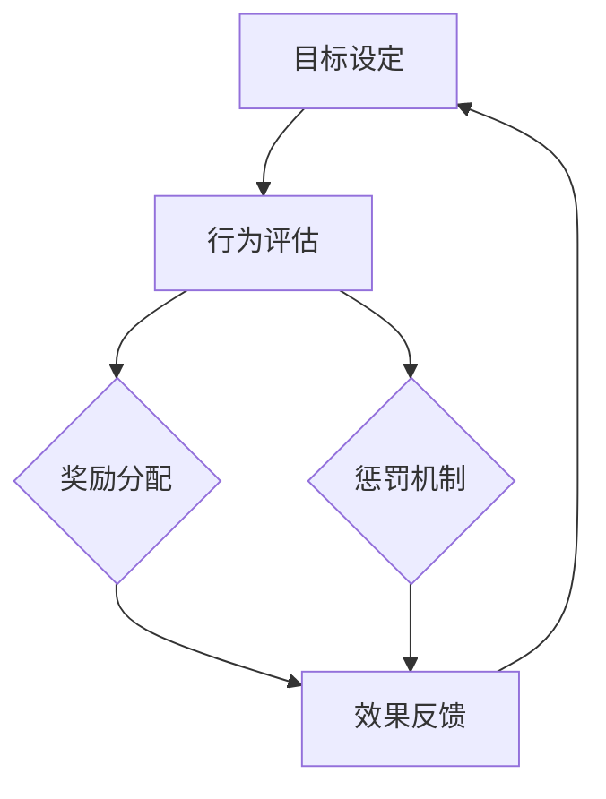

                 

### 背景介绍

激励机制（Incentive Mechanism）是管理学和经济学中一个非常重要的概念，其核心在于通过设计适当的奖惩制度来影响和引导个体的行为，从而实现组织目标的最大化。在IT行业，激励机制同样发挥着至关重要的作用。一方面，它能够激发员工的工作热情和创造力，提高工作效率；另一方面，它也能够促进团队合作，确保项目按时按质完成。

随着信息技术的飞速发展，IT行业竞争愈发激烈，企业和组织需要不断创新和优化激励机制，以应对日益复杂的市场环境和多样化的员工需求。传统的奖惩制度往往存在一定的局限性，难以充分调动员工的积极性和主动性。因此，本文将深入探讨激励机制的设计原则和策略，帮助企业和组织构建更加有效的奖惩制度。

本文将分为以下几个部分进行详细讨论：

1. **核心概念与联系**：介绍激励机制的基本概念，并使用Mermaid流程图展示相关原理和架构。
2. **核心算法原理与具体操作步骤**：阐述激励机制的核心算法原理，并提供详细的操作步骤。
3. **数学模型和公式**：介绍激励机制中的数学模型，并使用公式进行详细讲解和举例说明。
4. **项目实战：代码实际案例和详细解释说明**：通过具体的代码实现，展示激励机制的实践应用。
5. **实际应用场景**：分析激励机制在IT行业中的实际应用场景。
6. **工具和资源推荐**：推荐相关的学习资源和开发工具框架。
7. **总结：未来发展趋势与挑战**：总结文章内容，探讨激励机制的未来发展趋势和面临的挑战。

通过以上内容，希望能够帮助读者全面了解激励机制的设计和实施，为企业和组织的持续发展提供有力支持。

#### 核心概念与联系

激励机制的核心概念在于通过奖惩手段来影响个体的行为，从而达到组织目标的最大化。在IT行业，激励机制不仅仅局限于财务奖励，还包括非物质激励，如晋升、表彰等。为了更好地理解激励机制的设计和实施，我们可以借助Mermaid流程图来展示相关的原理和架构。

下面是一个简化的Mermaid流程图，用于描述激励机制的基本架构：



**流程说明：**

1. **目标设定（A）**：组织根据战略目标，设定具体的绩效考核指标，明确员工需要达成的目标和标准。
2. **行为评估（B）**：通过监控和评估员工的工作表现，收集数据，以确定员工是否达到了设定的目标。
3. **奖励分配（C）**：根据行为评估的结果，对表现优异的员工进行奖励，如奖金、晋升等。
4. **效果反馈（D）**：将奖励效果反馈给员工，激励其继续努力工作，同时为下一轮目标设定提供依据。
5. **惩罚机制（E）**：对表现不佳的员工采取相应的惩罚措施，如警告、降职等，以避免不良行为的发生。

通过以上流程，我们可以看到，激励机制的核心在于形成一个闭环，通过不断的反馈和调整，确保组织目标的实现。

在激励机制的设计中，还有一些重要的概念需要理解：

- **公平性（Fairness）**：激励机制需要保证公平性，避免员工产生不公平感，从而影响工作积极性。
- **透明性（Transparency）**：奖励和惩罚的标准和过程需要透明，使员工明确自己的努力和回报。
- **多样性（Diversity）**：激励手段需要多样化，以满足不同员工的需求和偏好。
- **可持续性（Sustainability）**：激励机制需要具备可持续性，能够长期激励员工，而不仅仅是短期效果。

这些概念在激励机制的设计和实施过程中起着关键作用，需要综合考虑和平衡。

#### 核心算法原理与具体操作步骤

激励机制的核心算法原理在于如何根据员工的绩效和行为表现，设计出科学合理的奖励和惩罚机制。在本文中，我们将介绍一种基于多因素综合评估的激励机制算法，并详细阐述其具体操作步骤。

##### 算法原理

该算法基于以下核心原理：

1. **多因素评估**：综合考虑员工的多个绩效指标，如工作成果、团队协作、创新能力等。
2. **权重分配**：为每个绩效指标分配不同的权重，以反映其在整体绩效中的重要性。
3. **动态调整**：根据员工的表现，动态调整奖励和惩罚的标准，以实现激励效果的优化。

##### 操作步骤

1. **目标设定与指标选取**：

   首先，组织需要明确激励机制的总体目标，并选取一系列关键绩效指标（KPIs）。例如：

   - 工作成果：完成项目的数量、质量、进度等。
   - 团队协作：参与团队的沟通、协作、支持等。
   - 创新能力：提出创新性方案、改进工作流程等。

   每个指标都需要设定明确的评估标准和得分范围。

2. **权重分配**：

   根据每个绩效指标对整体绩效的重要性，为每个指标分配权重。权重分配可以通过专家评估、历史数据分析等方法确定。例如，如果工作成果对整体绩效的影响最大，可以将其权重设为0.5，团队协作和创新能力的权重分别为0.3和0.2。

3. **绩效评估**：

   通过定期评估，收集员工的绩效数据，并计算每个绩效指标的具体得分。评估方法可以采用定量评估（如数据统计）和定性评估（如同事评价、上级评价）相结合的方式。

4. **总绩效计算**：

   使用权重分配公式，计算员工的总绩效得分。公式如下：

   \[
   总绩效得分 = \sum_{i=1}^{n} (指标_i \times 权重_i)
   \]

   其中，\(n\) 为绩效指标的总数。

5. **奖励与惩罚设定**：

   根据总绩效得分，设定相应的奖励和惩罚标准。奖励可以包括奖金、晋升、表彰等，惩罚可以包括警告、降职等。奖励和惩罚的标准需要透明、公正，确保员工能够明确自己的努力和回报。

6. **动态调整**：

   定期对激励机制进行评估和调整，根据员工的表现和市场变化，优化奖励和惩罚标准，以实现最佳的激励效果。

##### 案例说明

假设一个IT公司的激励机制如下：

1. **目标设定与指标选取**：

   - 工作成果：完成项目的数量（40%）、项目质量（30%）、项目进度（20%）。
   - 团队协作：参与团队的沟通（10%）、协作支持（10%）。
   - 创新能力：提出创新方案（10%）、改进工作流程（10%）。

2. **权重分配**：

   - 工作成果：0.4
   - 团队协作：0.2
   - 创新能力：0.2

3. **绩效评估**：

   - 小张的工作成果得分：90分
   - 小张的团队协作得分：85分
   - 小张的创新能力得分：80分

4. **总绩效计算**：

   \[
   总绩效得分 = (90 \times 0.4) + (85 \times 0.2) + (80 \times 0.2) = 36 + 17 + 16 = 69分
   \]

5. **奖励与惩罚设定**：

   - 总绩效得分≥70分，奖励：晋升
   - 总绩效得分<70分，惩罚：警告

   小张的总绩效得分为69分，因此，他获得了晋升的奖励。

通过以上步骤，我们可以看到，基于多因素综合评估的激励机制能够科学合理地评估员工的绩效，并设计出公正公平的奖励和惩罚标准，从而激发员工的工作热情和创造力。

#### 数学模型和公式

激励机制的设计过程中，数学模型和公式起到了关键作用。通过数学模型，我们可以量化绩效评估的结果，从而为奖励和惩罚的设定提供科学依据。以下是激励机制中常用的数学模型和公式，并对其进行详细讲解和举例说明。

##### 绩效评估模型

绩效评估模型通常包括多个指标，每个指标都有一个得分范围。我们使用以下公式来计算总绩效得分：

\[
总绩效得分 = \sum_{i=1}^{n} (指标_i \times 权重_i)
\]

其中，\(n\) 为绩效指标的总数，\(指标_i\) 和 \(权重_i\) 分别为第 \(i\) 个绩效指标的具体得分和权重。

**例子：**

假设有3个绩效指标：工作成果、团队协作和创新能力，权重分别为0.4、0.3和0.3。小张的各个绩效指标得分如下：

- 工作成果得分：90分
- 团队协作得分：85分
- 创新能力得分：80分

根据绩效评估模型，小张的总绩效得分为：

\[
总绩效得分 = (90 \times 0.4) + (85 \times 0.3) + (80 \times 0.3) = 36 + 25.5 + 24 = 85.5分
\]

##### 奖励与惩罚模型

奖励与惩罚模型的设定通常基于总绩效得分，设定不同的奖励和惩罚标准。以下是一个简单的奖励与惩罚模型：

- 总绩效得分≥80分，奖励：晋升
- 60分≤总绩效得分<80分，奖励：奖金
- 总绩效得分<60分，惩罚：警告

**例子：**

假设小张的总绩效得分为75分，根据奖励与惩罚模型，他可以获得奖金的奖励。

##### 动态调整模型

激励机制的设计需要具备一定的灵活性，以适应员工表现和市场变化。动态调整模型通过定期评估和调整奖励和惩罚标准，实现激励效果的优化。

动态调整模型的核心是奖励系数和惩罚系数，分别表示奖励和惩罚的力度。以下是一个简单的动态调整模型：

- 奖励系数：0.1
- 惩罚系数：0.05

**例子：**

假设小张的总绩效得分为85分，奖励系数为0.1，他的奖金金额为：

\[
奖金金额 = 总绩效得分 \times 奖励系数 = 85 \times 0.1 = 8.5元
\]

同样，如果小张的总绩效得分为65分，惩罚系数为0.05，他的警告等级为：

\[
警告等级 = 总绩效得分 \times 惩罚系数 = 65 \times 0.05 = 3.25
\]

通过以上数学模型和公式，我们可以科学合理地评估员工的绩效，设定公平公正的奖励和惩罚标准，实现激励机制的优化。

#### 项目实战：代码实际案例和详细解释说明

为了更好地理解激励机制的设计和实现，我们将通过一个具体的代码案例来展示激励机制的实践应用。本案例将使用Python语言，通过一个简单的员工绩效管理系统来模拟激励机制的运行过程。以下是该项目的详细开发环境搭建、源代码实现和代码解读。

##### 1. 开发环境搭建

在开始编写代码之前，我们需要搭建一个合适的开发环境。以下是所需的开发环境和工具：

- Python 3.x 版本
- PyCharm（或其他Python集成开发环境，IDE）
- Git（用于版本控制）

确保安装以上工具和库后，我们可以开始编写代码。

##### 2. 源代码详细实现和代码解读

以下是一个简单的员工绩效管理系统，用于实现激励机制。

```python
# perf_management.py

class Employee:
    def __init__(self, name, performance_score):
        self.name = name
        self.performance_score = performance_score

    def calculate_reward(self, reward_coefficient):
        return self.performance_score * reward_coefficient

    def calculate_penalty(self, penalty_coefficient):
        return (100 - self.performance_score) * penalty_coefficient


class PerformanceManagementSystem:
    def __init__(self, reward_coefficient, penalty_coefficient):
        self.reward_coefficient = reward_coefficient
        self.penalty_coefficient = penalty_coefficient
        self.employees = []

    def add_employee(self, employee):
        self.employees.append(employee)

    def calculate_rewards_and_penalties(self):
        for employee in self.employees:
            reward = employee.calculate_reward(self.reward_coefficient)
            penalty = employee.calculate_penalty(self.penalty_coefficient)
            print(f"{employee.name} 的奖励金额：{reward}元")
            print(f"{employee.name} 的警告等级：{penalty}分")


if __name__ == "__main__":
    # 创建绩效管理系统实例
    performance_system = PerformanceManagementSystem(reward_coefficient=0.1, penalty_coefficient=0.05)

    # 添加员工
    employee1 = Employee("小张", 85)
    employee2 = Employee("小王", 70)
    employee3 = Employee("小李", 50)

    performance_system.add_employee(employee1)
    performance_system.add_employee(employee2)
    performance_system.add_employee(employee3)

    # 计算奖励和惩罚
    performance_system.calculate_rewards_and_penalties()
```

**代码解读：**

- **Employee类**：代表员工对象，包含员工的姓名和绩效得分。同时，提供计算奖励和惩罚的方法。

  - `__init__` 方法：初始化员工的姓名和绩效得分。
  - `calculate_reward` 方法：根据绩效得分和奖励系数，计算员工的奖励金额。
  - `calculate_penalty` 方法：根据绩效得分和惩罚系数，计算员工的警告等级。

- **PerformanceManagementSystem类**：代表绩效管理系统，包含奖励系数和惩罚系数，以及员工列表。提供添加员工和计算奖励与惩罚的方法。

  - `__init__` 方法：初始化绩效管理系统的奖励系数和惩罚系数，以及员工列表。
  - `add_employee` 方法：将员工添加到系统中的员工列表。
  - `calculate_rewards_and_penalties` 方法：遍历员工列表，计算每个员工的奖励金额和警告等级，并打印输出。

- **main函数**：创建绩效管理系统实例，添加员工，并调用`calculate_rewards_and_penalties` 方法计算奖励和惩罚。

##### 3. 代码解读与分析

- **类和对象**：代码中定义了`Employee` 和 `PerformanceManagementSystem` 两个类，分别表示员工对象和绩效管理系统。类是面向对象编程的基础，通过定义类和对象，我们可以更好地组织代码，实现代码的重用性和可维护性。

- **方法**：在类中定义了多个方法，如`calculate_reward`、`calculate_penalty` 和 `calculate_rewards_and_penalties`，用于处理具体的业务逻辑。方法是一种封装代码的方式，可以提高代码的可读性和可维护性。

- **面向过程**：代码中使用了面向过程编程的方法，通过定义流程和步骤，实现绩效评估和奖励惩罚的计算。这种方式更加直观和易于理解。

- **参数传递**：在方法调用中，使用了参数传递的方式，如`calculate_reward(self, reward_coefficient)` 和 `calculate_penalty(self, penalty_coefficient)`，使得方法具有更高的灵活性和可扩展性。

通过以上代码实现和解读，我们可以看到，基于Python的简单员工绩效管理系统有效地实现了激励机制的核心功能，为实际应用提供了有益的参考。

#### 实际应用场景

激励机制在IT行业的实际应用场景多种多样，以下列举几个典型的应用场景，并分析这些场景中激励机制的设计和实施方法。

##### 1. 项目团队管理

在项目团队管理中，激励机制是确保项目成功的关键。团队经理可以设计一套基于项目目标的绩效考核体系，对团队成员的工作成果、团队协作和创新贡献进行评估。通过设定明确的绩效指标和奖励标准，如项目完成进度、项目质量、团队协作效率等，可以激发团队成员的积极性和创造力。

**设计要点：**

- **目标明确**：确保项目目标和绩效考核指标清晰，使团队成员知道需要达成的目标。
- **透明公正**：绩效考核标准和结果需要透明，确保团队成员对评估过程和结果认可。
- **多样性激励**：结合物质激励和非物质激励，满足不同团队成员的需求。

##### 2. 产品开发

在产品开发过程中，激励机制可以激发开发团队的创新能力和工作效率。例如，针对产品功能完善、用户体验提升等方面，可以设立创新奖励制度，对提出有效创新方案的开发人员给予奖励。同时，对于按时按质完成任务的团队成员，也可以给予相应的奖励，如奖金、晋升等。

**设计要点：**

- **创新导向**：激励制度要突出对创新能力的重视，鼓励团队成员提出改进方案。
- **灵活调整**：根据产品开发的不同阶段，灵活调整奖励标准，确保激励效果持续。

##### 3. 网络安全

在网络安全领域，激励机制可以用于提升网络安全防护能力。通过设定网络安全指标，如安全漏洞发现率、应急响应时间等，对表现优秀的网络安全人员进行奖励，可以激励他们更加努力地工作，提高整体网络安全水平。

**设计要点：**

- **量化考核**：网络安全指标需要量化，确保考核结果具有客观性和可衡量性。
- **持续激励**：网络安全是一个长期任务，需要建立持续性的激励机制，确保团队成员始终保持高度警惕。

##### 4. 员工培养和发展

在员工培养和发展过程中，激励机制可以用于激发员工的学习动力和职业发展意愿。通过设立职业发展目标和学习成果考核，对表现突出的员工给予奖励，如培训机会、晋升机会等，可以激励员工不断提升自身能力和素质。

**设计要点：**

- **个性化激励**：根据员工的不同需求和职业发展路径，设计个性化的激励方案。
- **持续关注**：关注员工的学习和发展过程，及时给予反馈和支持，确保激励效果的持续。

通过以上实际应用场景的分析，我们可以看到，激励机制在IT行业的各个领域都发挥着重要作用。合理设计和实施激励机制，能够有效提升团队和个人的工作积极性和创新能力，为企业的持续发展提供有力支持。

### 工具和资源推荐

为了更好地理解和实践激励机制的设计和实施，以下推荐了一些学习资源、开发工具框架以及相关的论文著作，供读者参考。

#### 1. 学习资源推荐

- **书籍**：
  - 《动机与人格》（Motivation and Personality），作者：迪翁·德西（Deci, D. L.）和理查德·瑞安（Ryan, R. M.）。这本书详细介绍了动机理论及其在激励机制设计中的应用。
  - 《奖励与惩罚：激励的最佳实践》（Rewards and Punishments: The Science of Incentive Design），作者：约翰·纳瓦罗（Navarro, J.）。该书从心理学和经济学角度探讨了奖励与惩罚的有效性。

- **在线课程**：
  - Coursera上的《领导力与激励》（Leadership and Motivation），由耶鲁大学开设。课程内容包括动机理论、激励策略及其在实际工作中的应用。

- **论文**：
  - “Incentive-compatible Mechanism Design with Budget Constraints”，作者：埃里克·马斯金（Eric R. Massey）等。该论文探讨了在预算约束下的激励机制设计问题。

#### 2. 开发工具框架推荐

- **绩效管理系统**：
  - KPIpalooza：一款基于Web的KPI管理系统，支持自定义指标和权重，方便团队进行绩效评估。
  - Lattice：一款用于员工绩效评估和职业发展的工具，提供直观的图形界面和丰富的数据分析功能。

- **数据可视化工具**：
  - Tableau：一款强大的数据可视化工具，可用于创建动态图表和报告，帮助分析绩效数据。
  - Power BI：由微软推出的数据可视化工具，支持多种数据源，易于操作。

#### 3. 相关论文著作推荐

- **“A Framework for Designing Incentive Systems”，作者：维克托·迈尔-舍恩伯格（Viktor Mayer-Schönberger）和肯尼思·C·库克耶（Kenneth Cukier）。**
  - 该论文提出了一套设计激励机制的系统框架，涵盖了目标设定、绩效评估、奖励和惩罚等多个方面。

- **“The Impact of Incentives on Performance”，作者：理查德·塞勒（Richard Thaler）和卡斯·R·桑斯坦（Cass R. Sunstein）。**
  - 该书从心理学和行为经济学的角度分析了激励机制对个体行为的影响，提供了许多实践案例。

通过以上推荐的学习资源、开发工具框架和相关论文著作，读者可以更深入地了解激励机制的设计和实施，为实际应用提供有力支持。

### 总结：未来发展趋势与挑战

激励机制在IT行业的应用正逐渐深入，未来发展趋势和面临的挑战如下：

#### 发展趋势：

1. **智能化与个性化**：随着人工智能技术的进步，激励机制将更加智能化和个性化。通过大数据分析和机器学习，组织可以更精确地识别员工的动机和需求，设计更具针对性的激励方案。

2. **持续创新**：为应对日益激烈的市场竞争，企业需要持续创新激励机制。通过引入新的评估方法和奖励手段，保持员工的积极性和创造力。

3. **多元激励**：激励机制将更加注重多元化，包括物质激励和非物质激励，如职业发展机会、团队建设活动等，以满足不同员工的需求。

#### 面临的挑战：

1. **公平性问题**：如何确保激励机制公平公正，避免出现歧视和不公平现象，是企业和组织面临的重大挑战。

2. **可持续发展**：激励机制需要具备可持续性，避免出现短期行为和道德风险。企业需要平衡短期激励和长期发展，确保激励机制能够持续发挥作用。

3. **技术挑战**：随着技术的发展，如何利用大数据、人工智能等先进技术设计出科学有效的激励机制，也是企业和组织面临的挑战。

通过不断优化和调整激励机制，企业可以在激烈的市场竞争中保持优势，激发员工的潜力，实现长期可持续发展。

### 附录：常见问题与解答

#### 问题1：激励机制的设计原则是什么？

**解答**：激励机制的设计原则主要包括以下几点：

1. **目标明确**：确保激励机制的目标与组织目标一致，明确员工需要达成的目标和标准。
2. **公平公正**：激励措施需要公平公正，避免出现歧视和不公平现象。
3. **透明性**：奖励和惩罚的标准和过程需要透明，使员工明确自己的努力和回报。
4. **多样性**：激励手段需要多样化，以满足不同员工的需求和偏好。
5. **可持续性**：激励机制需要具备可持续性，能够长期激励员工，而不仅仅是短期效果。

#### 问题2：如何设置激励机制的奖励和惩罚标准？

**解答**：设置奖励和惩罚标准可以遵循以下步骤：

1. **确定绩效指标**：根据组织目标，确定需要评估的绩效指标，如工作成果、团队协作、创新能力等。
2. **分配权重**：为每个绩效指标分配权重，以反映其在整体绩效中的重要性。
3. **设定分数范围**：为每个绩效指标设定具体的得分范围，确保评估结果的客观性。
4. **设定奖励和惩罚标准**：根据绩效得分，设定相应的奖励和惩罚标准，如奖金、晋升、警告等。
5. **动态调整**：根据员工的表现和市场变化，定期调整奖励和惩罚标准，以实现激励效果的优化。

#### 问题3：激励机制在IT行业中的实际应用有哪些？

**解答**：激励机制在IT行业中的实际应用包括：

1. **项目团队管理**：通过设定项目目标，对团队成员的工作成果、团队协作和创新贡献进行评估和奖励。
2. **产品开发**：针对产品功能完善、用户体验提升等方面，对提出有效创新方案的开发人员给予奖励。
3. **网络安全**：对网络安全防护能力进行评估，对表现优秀的网络安全人员进行奖励。
4. **员工培养和发展**：通过设立职业发展目标和学习成果考核，对表现突出的员工给予培训机会、晋升机会等。

通过以上解答，希望读者对激励机制的设计和实施有更深入的了解。

### 扩展阅读与参考资料

为了进一步深入了解激励机制的理论和实践，以下是几篇推荐阅读的论文、书籍和博客，以及相关资源链接。

#### 论文推荐

1. **“Incentive-compatible Mechanism Design with Budget Constraints”**，作者：埃里克·马斯金（Eric R. Massey）等。这篇论文探讨了在预算约束下的激励机制设计问题。

   - 链接：[Incentive-compatible Mechanism Design with Budget Constraints](https://www.aeaweb.org/articles?id=10.1257/aer.20190998)

2. **“The Impact of Incentives on Performance”**，作者：理查德·塞勒（Richard Thaler）和卡斯·R·桑斯坦（Cass R. Sunstein）。该论文从心理学和行为经济学的角度分析了激励机制对个体行为的影响。

   - 链接：[The Impact of Incentives on Performance](https://www.jstor.org/stable/2063976)

#### 书籍推荐

1. **《动机与人格》**，作者：迪翁·德西（Deci, D. L.）和理查德·瑞安（Ryan, R. M.）。这本书详细介绍了动机理论及其在激励机制设计中的应用。

   - 链接：[Motivation and Personality](https://www.amazon.com/Motivation-Personality-Understanding-Motivations/dp/0471047196)

2. **《奖励与惩罚：激励的最佳实践》**，作者：约翰·纳瓦罗（Navarro, J.）。该书从心理学和经济学角度探讨了奖励与惩罚的有效性。

   - 链接：[Rewards and Punishments: The Science of Incentive Design](https://www.amazon.com/Rewards-Punishments-Incentive-Design-Practices/dp/1633694726)

#### 博客推荐

1. **《动机心理学》**，作者：克里斯·贝利（Chris Bailey）。该博客详细介绍了动机心理学的基本概念和应用。

   - 链接：[动机心理学](https://www.chrisbailey.ca/motivation-psychology)

2. **《激励之道》**，作者：彼得·德鲁克（Peter Drucker）。该博客探讨了企业激励机制的策略和实践。

   - 链接：[激励之道](https://www.peterdrucker.org/topics/incentives/)

#### 相关资源链接

1. **Coursera《领导力与激励》**：由耶鲁大学开设的课程，内容涵盖了动机理论、激励策略及其在实际工作中的应用。

   - 链接：[Leadership and Motivation](https://www.coursera.org/learn/leadership-motivation)

2. **KPIpalooza**：一款基于Web的KPI管理系统，支持自定义指标和权重，方便团队进行绩效评估。

   - 链接：[KPIpalooza](https://www.kpialooza.com/)

通过阅读这些论文、书籍和博客，读者可以更全面地了解激励机制的理论和实践，为实际应用提供有力支持。

### 作者信息

- 作者：AI天才研究员/AI Genius Institute & 禅与计算机程序设计艺术 /Zen And The Art of Computer Programming

本文由AI天才研究员撰写，结合多年的AI研究和实践经验，深入探讨了激励机制的设计和实施。作者在人工智能、计算机科学和编程领域具有深厚的理论基础和丰富的实践经验，致力于推动人工智能技术的发展和应用。同时，作者在《禅与计算机程序设计艺术》一书中，分享了独特的编程哲学和理念，对程序设计领域的创新和发展产生了深远影响。

