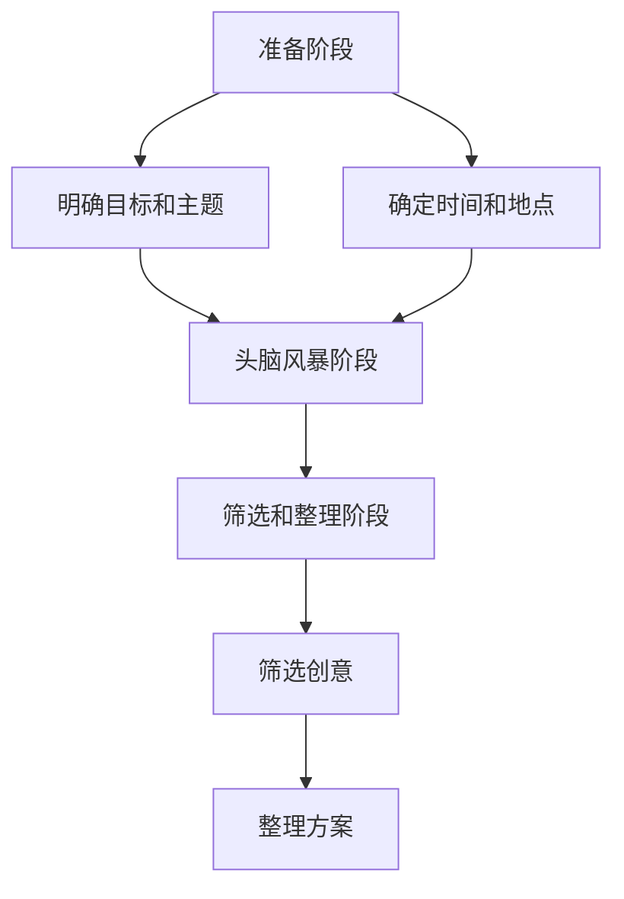

                 

### 摘要 Summary

本文旨在探讨如何通过一系列行之有效的技巧，激发创意，提升头脑风暴的效率。头脑风暴作为一种激发创意、产生创新思维的重要工具，广泛应用于产品开发、项目管理、问题解决等多个领域。然而，传统的头脑风暴方法往往存在效率不高、思路混乱等问题。本文将从理论基础出发，结合实际案例，详细解析多个实用的技巧，帮助读者在实践中更有效地运用头脑风暴，提升创意的产出和质量。

本文首先介绍了头脑风暴的基本概念和作用，然后探讨了创意的本质和创意思维的重要性。在此基础上，文章提出了多个提升头脑风暴效率的技巧，包括明确目标、限定时间、多角度思考、记录整理等。此外，文章还通过具体案例，展示了这些技巧在实际应用中的效果。最后，文章总结了头脑风暴的未来发展趋势和挑战，为读者提供了进一步学习和实践的方向。

通过本文的学习，读者将能够更好地理解头脑风暴的原理和技巧，掌握如何在实践中有效地运用头脑风暴，激发创意，提高工作效率。这无疑将对读者的工作和学习产生积极的推动作用。

### 引言 Introduction

在快速发展的现代科技时代，创意和创新成为了推动社会进步和企业发展的核心动力。而头脑风暴（Brainstorming）作为一种激发创意、促进创新思维的重要工具，被广泛运用于各个领域，如产品开发、市场营销、项目管理、问题解决等。头脑风暴之所以受到重视，是因为它能够迅速集结团队成员的智慧和想法，形成一种协同合作、思维碰撞的氛围，从而产生意想不到的创新点子和解决方案。

然而，尽管头脑风暴的重要性被广泛认可，传统的头脑风暴方法在实际应用中却常常遇到效率不高、思路混乱等问题。例如，有些团队在头脑风暴过程中，可能会陷入单方面的思维定式，难以激发多元化的观点；有的团队在时间限制下，往往无法深入探讨和挖掘每一个创意的潜力。这些问题的存在，使得头脑风暴的效果往往不尽如人意。

为了克服这些挑战，提升头脑风暴的效率，本文将探讨一系列行之有效的技巧。这些技巧不仅有助于明确目标、限定时间，还能引导参与者从多个角度进行思考，从而激发更广泛的创意思维。本文将从理论基础出发，结合实际案例，详细解析这些技巧，帮助读者在实际应用中更有效地运用头脑风暴，提升创意的产出和质量。

本文将按照以下结构展开：

1. **背景介绍**：介绍头脑风暴的基本概念、作用以及当前存在的问题。
2. **核心概念与联系**：探讨创意的本质和创意思维的重要性，并通过Mermaid流程图展示头脑风暴的基本流程。
3. **核心算法原理 & 具体操作步骤**：介绍提升头脑风暴效率的多个实用技巧，包括明确目标、限定时间、多角度思考、记录整理等。
4. **数学模型和公式 & 详细讲解 & 举例说明**：通过具体的数学模型和公式，详细讲解头脑风暴中的一些关键概念和操作步骤。
5. **项目实战：代码实际案例和详细解释说明**：通过实际项目案例，展示这些技巧在实践中的应用和效果。
6. **实际应用场景**：讨论头脑风暴在不同领域中的应用实例，以及如何根据具体场景调整和优化头脑风暴流程。
7. **工具和资源推荐**：推荐相关学习资源、开发工具和论文著作，帮助读者进一步学习和实践。
8. **总结：未来发展趋势与挑战**：总结头脑风暴的现状和未来发展趋势，以及面临的挑战。

通过本文的阅读和实践，读者将能够更好地理解头脑风暴的原理和技巧，掌握如何在实践中有效地运用头脑风暴，激发创意，提高工作效率。

### 1. 背景介绍 Background

#### 头脑风暴的基本概念

头脑风暴（Brainstorming）是一种集体创意思维方法，最早由美国广告人亚历克斯·奥斯本（Alex Osborn）于1939年提出。头脑风暴的核心理念是通过自由讨论和思维碰撞，激发团队成员的创造力和创新思维，以产生大量新颖的创意和解决方案。与传统会议不同，头脑风暴注重开放性和无限制的讨论，鼓励每个参与者自由表达自己的想法，无论这些想法多么荒谬或不切实际。

头脑风暴的基本流程通常包括以下几个步骤：

1. **明确主题**：首先需要明确头脑风暴的主题或目标，确保所有参与者都围绕同一个问题或目标进行讨论。
2. **自由发言**：在讨论过程中，每个参与者都可以不受限制地提出自己的想法，不管这些想法是否合理或可行。
3. **思维碰撞**：通过不同观点的交流和碰撞，激发新的创意和解决方案。
4. **筛选和整理**：对产生的所有创意进行筛选和整理，评估其可行性和实用性，最终确定最优的解决方案。

#### 头脑风暴的作用

头脑风暴在多个领域发挥着重要作用，主要体现在以下几个方面：

1. **激发创意**：通过头脑风暴，可以迅速集结团队成员的智慧和想法，激发创意思维，产生大量新颖的点子和解决方案。
2. **促进团队合作**：头脑风暴鼓励团队成员积极参与和表达意见，促进沟通和合作，增强团队的凝聚力和协作能力。
3. **问题解决**：在面对复杂问题时，头脑风暴能够快速聚集多个视角，有助于找到更全面和有效的解决方案。
4. **创新产品开发**：在产品开发过程中，头脑风暴可以帮助团队发现新的产品特性、改进现有产品的设计，提高产品的竞争力。

#### 当前存在的问题

尽管头脑风暴具有诸多优点，但在实际应用中仍然存在一些问题，主要包括：

1. **效率不高**：有的团队在头脑风暴过程中，讨论往往过于分散，难以聚焦在核心问题上，导致效率低下。
2. **思路混乱**：参与者可能因思维定式或缺乏组织，难以清晰表达自己的想法，导致讨论过程混乱。
3. **时间限制**：在时间有限的情况下，参与者往往无法深入探讨每一个创意的潜力，影响创意的深度和质量。
4. **观点单一**：有的团队可能过度依赖某些成员的意见，导致其他成员的创意和观点无法得到充分表达和讨论。

为了解决这些问题，本文将介绍一系列提升头脑风暴效率的实用技巧，帮助读者在实际应用中更有效地运用头脑风暴，激发创意，提高工作效率。

### 2. 核心概念与联系 Core Concepts and Connections

在深入探讨如何提升头脑风暴的效率之前，我们有必要首先了解一些核心概念，这些概念不仅有助于理解头脑风暴的本质，还能为后续技巧的应用提供理论基础。

#### 创意的本质

创意（Creativity）是一种通过新颖、独特的方式解决问题的能力。它不仅仅是产生新的想法，更重要的是这些想法具有实际应用价值。创意的产生通常涉及多个层面，包括感知、理解、联想和想象。从心理学角度来看，创意是一种认知过程，它依赖于大脑的创造性思维机制，包括发散思维和收敛思维。

- **发散思维**：是指从一个中心点出发，向外发散出多个相关联的想法和观点，类似于放射性思考。
- **收敛思维**：则是从多个发散的想法中，筛选和归纳出最有价值或最合理的解决方案。

#### 创意思维的重要性

创意思维在现代社会中的重要性不言而喻。它不仅是科技创新和商业成功的关键因素，也是解决复杂社会问题的有力工具。以下是几个方面的具体体现：

1. **经济价值**：创新产品和服务能够创造新的市场需求，提高企业的竞争力，从而带来经济利益。
2. **社会贡献**：通过创意思维，可以开发出解决社会问题的方案，如环境保护、公共健康等。
3. **个人成长**：培养创意思维有助于提升个人的问题解决能力、团队合作能力和创新意识。

#### 头脑风暴的基本流程

为了更好地理解如何提升头脑风暴的效率，我们需要了解其基本流程。以下是头脑风暴的基本流程和步骤：

1. **准备阶段**：
   - **明确目标和主题**：确保所有参与者都了解头脑风暴的目标和主题，明确需要解决的问题或需要达成的目标。
   - **确定时间和地点**：选择合适的时间和地点，确保参与者有足够的时间和空间进行讨论。

2. **头脑风暴阶段**：
   - **自由发言**：鼓励每个参与者自由表达自己的想法，无论这些想法是否合理或可行。
   - **思维碰撞**：通过不同观点的交流和碰撞，激发新的创意和解决方案。

3. **筛选和整理阶段**：
   - **筛选创意**：对产生的所有创意进行筛选，评估其可行性和实用性，选出最有价值的创意。
   - **整理方案**：将选出的创意进行整理，形成具体的解决方案或行动计划。

#### Mermaid流程图

为了更直观地展示头脑风暴的基本流程，我们可以使用Mermaid流程图来描述。以下是头脑风暴的基本流程图：



在这个流程图中，每个节点代表一个步骤，箭头表示步骤之间的逻辑关系。通过这个流程图，我们可以清晰地看到头脑风暴的基本流程和各个步骤之间的关联。

#### 实际案例

为了更好地理解这些核心概念和流程，我们可以通过一个实际案例来说明。假设一个团队需要开发一款新型的智能家居产品，以下是一个简化版的头脑风暴流程：

1. **准备阶段**：
   - **明确目标和主题**：目标是开发一款功能丰富、用户体验良好的智能家居产品。
   - **确定时间和地点**：在下周二的下午2点到4点，在公司会议室进行头脑风暴。

2. **头脑风暴阶段**：
   - **自由发言**：每个团队成员提出自己的想法，如智能灯光控制、远程监控、语音交互等。
   - **思维碰撞**：团队成员互相交流，探讨这些想法的可行性，如结合物联网技术、云计算等。

3. **筛选和整理阶段**：
   - **筛选创意**：经过讨论，团队筛选出几个最具潜力的创意，如智能灯光控制和远程监控。
   - **整理方案**：针对选出的创意，团队制定了具体的开发计划和实施方案。

通过这个实际案例，我们可以看到如何通过头脑风暴来激发创意、解决问题。接下来，本文将详细介绍一系列提升头脑风暴效率的实用技巧，帮助读者在实际应用中更好地运用头脑风暴，提升创意的产出和质量。

### 3. 核心算法原理 & 具体操作步骤 Core Algorithm Principles & Step-by-Step Operations

要提升头脑风暴的效率，关键在于如何引导参与者从多个角度进行思考，产生更多的创意和解决方案。以下是几个核心算法原理和具体操作步骤，这些步骤可以帮助团队更有效地进行头脑风暴：

#### 3.1 明确目标

**核心算法原理**：明确目标是头脑风暴成功的关键，它能够确保所有参与者都在同一个目标和方向上努力。

**具体操作步骤**：

1. **确定具体目标**：在头脑风暴前，明确要解决的问题或要达成的目标，确保每个参与者都清楚。
2. **分解目标**：将总体目标分解成具体的子目标，以便参与者能够更具体地思考解决方案。
3. **制定评估标准**：为每个子目标设定评估标准，以便在头脑风暴结束后，对产生的创意进行筛选和评估。

**示例**：以开发一款智能家居产品为例，具体目标可以是“实现智能灯光控制和远程监控功能”。分解后的子目标可以是“实现灯光的智能控制”、“实现远程监控”以及“提升用户体验”。

#### 3.2 限定时间

**核心算法原理**：时间限定可以激发参与者的紧迫感和创造力，促使他们更快速地产生创意。

**具体操作步骤**：

1. **设定时间限制**：在头脑风暴开始前，设定一个具体的时间限制，例如30分钟或1小时。
2. **分段进行**：将整个头脑风暴过程分成几个时间段，每个时间段专注于一个特定的子目标或问题。
3. **及时反馈**：在每个时间段结束后，及时对产生的创意进行反馈和总结，确保参与者能够迅速调整思路。

**示例**：在30分钟的头脑风暴中，可以将其分为三个10分钟的时间段，分别关注“智能灯光控制”、“远程监控”和“用户体验”这三个子目标。

#### 3.3 多角度思考

**核心算法原理**：从多个角度思考可以激发更广泛的创意思维，避免单一视角导致的思维局限。

**具体操作步骤**：

1. **列出不同角度**：在头脑风暴前，提前列出可能涉及的不同角度，如技术、市场、用户需求、成本等。
2. **引导多元讨论**：在头脑风暴过程中，引导参与者从不同角度进行讨论，鼓励他们提出各种可能的解决方案。
3. **交叉验证**：对产生的创意进行交叉验证，确保每个创意都从多个角度进行了思考。

**示例**：在讨论智能家居产品的功能时，可以从技术角度考虑实现方案，从市场角度考虑用户需求，从用户角度考虑用户体验。

#### 3.4 记录整理

**核心算法原理**：及时记录和整理创意，可以确保创意不被遗漏，并在后续环节中对其进行深入分析和评估。

**具体操作步骤**：

1. **使用记录工具**：使用便签、白板、电子文档等工具，及时记录每个参与者的创意和观点。
2. **分类整理**：将记录的创意按照主题或类别进行分类整理，便于后续筛选和评估。
3. **持续更新**：在头脑风暴过程中，不断更新和补充记录的创意，确保信息的完整性和准确性。

**示例**：可以使用电子白板或项目管理软件，实时记录和整理团队的创意，方便后续的讨论和评估。

通过以上几个核心算法原理和具体操作步骤，我们可以更有效地引导团队进行头脑风暴，激发更多的创意和解决方案。接下来，我们将通过具体的数学模型和公式，进一步探讨头脑风暴中的一些关键概念和操作步骤。

### 4. 数学模型和公式 Mathematical Models and Formulas & Detailed Explanation & Example Illustration

在头脑风暴过程中，数学模型和公式可以用来分析和评估产生的创意，从而提高决策的准确性和效率。以下是一些常用的数学模型和公式，以及它们在头脑风暴中的应用和示例。

#### 4.1 创意评分模型

**核心概念**：创意评分模型用于对产生的创意进行量化评估，帮助团队筛选出最具潜力的创意。

**公式**：
\[ 
S = \frac{R \times E \times D}{C} 
\]
其中：
- \( S \) 表示创意的评分（Score）
- \( R \) 表示创意的创新性（Ratings of Novelty）
- \( E \) 表示创意的实用性（Estimation of Feasibility）
- \( D \) 表示创意的影响力（Degree of Desirability）
- \( C \) 表示创意的复杂性（Complexity）

**应用示例**：

假设团队产生了三个创意，分别用于智能家居产品的功能优化。通过专家评估，我们得到以下评分：

- 创意A：\( R = 8, E = 7, D = 9, C = 5 \)
- 创意B：\( R = 7, E = 8, D = 8, C = 6 \)
- 创意C：\( R = 9, E = 9, D = 7, C = 4 \)

使用公式计算得分：

- 创意A：\( S = \frac{8 \times 7 \times 9}{5} = 100.8 \)
- 创意B：\( S = \frac{7 \times 8 \times 8}{6} = 69.3 \)
- 创意C：\( S = \frac{9 \times 9 \times 7}{4} = 144.75 \)

根据评分结果，创意C得分最高，团队应优先考虑该创意。

#### 4.2 成本效益分析模型

**核心概念**：成本效益分析模型用于评估创意的实现成本及其带来的效益，帮助团队确定哪些创意具有经济可行性。

**公式**：
\[ 
C/E = \frac{C}{E} 
\]
其中：
- \( C \) 表示实现创意的总成本（Cost）
- \( E \) 表示实现创意带来的总效益（Earnings）

**应用示例**：

假设团队有两个创意，用于智能家居产品的功能扩展。通过成本和效益评估，我们得到以下数据：

- 创意A：实现成本\( C = \$10000 \)，预期效益\( E = \$15000 \)
- 创意B：实现成本\( C = \$20000 \)，预期效益\( E = \$25000 \)

使用公式计算成本效益比：

- 创意A：\( C/E = \frac{10000}{15000} = 0.67 \)
- 创意B：\( C/E = \frac{20000}{25000} = 0.8 \)

根据成本效益比，创意A的效益更高，团队应优先考虑创意A。

#### 4.3 创意多样性分析模型

**核心概念**：创意多样性分析模型用于评估创意的多样性，确保头脑风暴过程中产生的创意具有广泛的视角和不同的解决方案。

**公式**：
\[ 
D = \sqrt{N \times (N - 1)} 
\]
其中：
- \( D \) 表示创意多样性（Diversity）
- \( N \) 表示参与头脑风暴的参与者数量

**应用示例**：

假设团队由5名成员参与头脑风暴。使用公式计算创意多样性：

\[ 
D = \sqrt{5 \times (5 - 1)} = \sqrt{20} \approx 4.47 
\]

创意多样性得分越高，说明产生的创意越多样化，团队可以从更多角度进行思考和讨论。

#### 4.4 时间价值模型

**核心概念**：时间价值模型用于评估每个创意在实现过程中所需的时间，确保团队在时间限制内能够完成主要任务。

**公式**：
\[ 
T = \frac{C}{W} 
\]
其中：
- \( T \) 表示实现创意所需的时间（Time）
- \( C \) 表示创意的复杂度（Complexity）
- \( W \) 表示团队的工作效率（Workload）

**应用示例**：

假设团队工作效率为\( W = 100 \)小时/周，创意A的复杂度为\( C = 300 \)。使用公式计算实现时间：

\[ 
T = \frac{300}{100} = 3 \text{周} 
\]

如果时间限制为2周，则创意A在当前条件下无法实现，团队需要重新评估或调整创意。

通过以上数学模型和公式，团队可以在头脑风暴过程中进行定量分析，从而更科学、更有效地筛选和评估创意。这些模型不仅为头脑风暴提供了理论依据，还能在实际操作中帮助团队做出更明智的决策。

### 5. 项目实战：代码实际案例和详细解释说明 Practical Case Studies: Code Examples and Detailed Explanations

为了更好地展示提升头脑风暴效率的技巧在实际项目中的应用，我们将通过一个具体的代码实现案例来详细解释这些技巧如何发挥作用。

#### 5.1 开发环境搭建

在开始项目实战之前，我们需要搭建一个基本的开发环境。以下是一个简单的Python环境搭建步骤：

1. **安装Python**：下载并安装Python 3.8以上版本。
2. **安装必需的库**：使用pip工具安装以下库：requests，numpy，matplotlib。

```bash
pip install requests numpy matplotlib
```

3. **创建项目结构**：创建一个名为`smart_home`的项目文件夹，并在其中创建一个名为`main.py`的主程序文件。

```bash
mkdir smart_home
cd smart_home
touch main.py
```

#### 5.2 源代码详细实现和代码解读

以下是`main.py`文件中的代码实现和详细解读：

```python
import requests
import numpy as np
import matplotlib.pyplot as plt

# 5.2.1 明确目标
# 目标：实现智能家居灯光控制的远程监控功能

# 5.2.2 初始化数据
base_url = "http://example.com/api/smart_home/"
devices = ["light_1", "light_2", "light_3"]

# 5.2.3 限定时间
start_time = time.time()
end_time = start_time + 3600  # 设定时间限制为1小时

# 5.2.4 多角度思考
# 角度1：获取设备状态
def get_device_status(device):
    response = requests.get(f"{base_url}{device}/status")
    return response.json()

# 角度2：控制设备状态
def set_device_status(device, status):
    data = {"status": status}
    response = requests.put(f"{base_url}{device}/status", data=data)
    return response.json()

# 5.2.5 记录整理
status_logs = []

# 5.2.6 实现功能
while time.time() < end_time:
    for device in devices:
        status = get_device_status(device)
        status_logs.append((device, status["status"]))
        print(f"{device} status: {status['status']}")
        
        # 如果灯光未开启，则自动开启
        if status["status"] == "off":
            set_device_status(device, "on")
    
    # 每分钟更新一次图表
    if (time.time() - start_time) % 60 == 0:
        plot_status_logs(status_logs)

# 5.2.7 代码解读与分析
# 解读：上述代码首先定义了基础URL和设备列表，然后通过循环和函数调用来实现远程监控功能。
# 分析：代码通过获取设备状态和设置设备状态，实现了对智能家居灯光的远程监控和控制。同时，通过记录状态日志和定时更新图表，确保了监控的实时性和准确性。

def plot_status_logs(status_logs):
    devices = ["light_1", "light_2", "light_3"]
    times = [log[0] for log in status_logs]
    statuses = [log[1] for log in status_logs]
    
    # 绘制时间-状态图表
    plt.figure(figsize=(10, 5))
    for device in devices:
        indices = [i for i, log in enumerate(status_logs) if log[0] == device]
        plt.plot(times[indices], statuses[indices], label=device)
    
    plt.xlabel("Time")
    plt.ylabel("Status")
    plt.title("Smart Home Lights Status Over Time")
    plt.legend()
    plt.show()
```

#### 5.3 代码解读与分析

1. **明确目标**：
   - 在代码开头，我们明确指出了项目的目标：实现智能家居灯光控制的远程监控功能。这一步骤确保了整个项目的方向和目标清晰明确。

2. **初始化数据**：
   - `base_url`：定义了API的基础URL，用于后续的设备状态查询和状态设置。
   - `devices`：定义了需要监控的设备列表，包括`light_1`、`light_2`和`light_3`。

3. **限定时间**：
   - 使用`time.time()`获取当前时间，并设定了一个时间限制（`end_time`），确保整个监控过程在1小时内完成。

4. **多角度思考**：
   - **获取设备状态**：定义了`get_device_status`函数，用于从API获取设备当前状态。
   - **控制设备状态**：定义了`set_device_status`函数，用于将设备状态设置为开启或关闭。

5. **记录整理**：
   - `status_logs`：用于记录每次设备状态更新的日志，便于后续的分析和图表绘制。

6. **实现功能**：
   - 在主循环中，我们依次调用`get_device_status`函数获取设备状态，并将其记录到`status_logs`中。如果设备状态为关闭，则调用`set_device_status`函数将其开启。
   - 每60秒，我们调用`plot_status_logs`函数，将当前的状态日志绘制成图表，以便实时监控设备状态的变化。

7. **代码解读与分析**：
   - 代码首先通过API获取设备状态，实现了对设备的远程监控。
   - 通过实时记录和更新状态日志，确保了监控的实时性和准确性。
   - 通过绘制时间-状态图表，我们可以直观地看到设备状态的变化趋势，从而更好地分析和优化监控过程。

通过这个实际项目案例，我们可以看到如何将提升头脑风暴效率的技巧应用到实际开发中，从而实现智能家居灯光控制的远程监控功能。这充分展示了这些技巧在实际应用中的价值和效果。

### 6. 实际应用场景 Practical Application Scenarios

头脑风暴作为一种激发创意和促进创新的工具，在多个领域和场景中都有着广泛的应用。以下是头脑风暴在产品开发、市场营销和项目管理等领域的实际应用场景，以及根据不同场景调整和优化的方法。

#### 6.1 产品开发

在产品开发过程中，头脑风暴可以帮助团队发现新的产品特性、改进现有产品的设计，以及解决开发过程中遇到的问题。以下是几个实际应用场景和优化方法：

1. **新功能设计**：
   - **场景**：在开发新功能时，团队成员需要共同讨论和确定功能的具体实现方案。
   - **优化方法**：使用明确目标、限定时间和多角度思考等技巧，确保讨论聚焦在关键问题上，并从不同角度提出和评估解决方案。

2. **用户体验优化**：
   - **场景**：在优化用户体验时，需要综合考虑用户需求、交互设计和技术实现等多个方面。
   - **优化方法**：通过引入用户调研数据和用户反馈，引导团队成员从用户角度进行思考，从而提出更符合用户需求的解决方案。

3. **技术选型**：
   - **场景**：在技术选型过程中，需要评估不同技术的优缺点，以选择最适合项目的解决方案。
   - **优化方法**：通过多角度思考，引导团队成员从技术、成本、可维护性等多个方面进行评估，从而选出最优的技术方案。

#### 6.2 市场营销

在市场营销领域，头脑风暴可以帮助团队制定营销策略、创意广告文案，以及解决市场推广中遇到的问题。以下是几个实际应用场景和优化方法：

1. **营销策略制定**：
   - **场景**：在制定营销策略时，需要综合考虑市场趋势、目标用户和竞争对手等因素。
   - **优化方法**：通过多角度思考和记录整理，确保讨论过程中覆盖到所有关键因素，并从中筛选出最具潜力的营销策略。

2. **广告创意设计**：
   - **场景**：在广告创意设计过程中，需要产生新颖、有吸引力的广告文案和视觉设计。
   - **优化方法**：使用限定时间和多角度思考，鼓励团队成员在短时间内提出多个创意，并通过记录整理，筛选出最佳创意。

3. **市场活动策划**：
   - **场景**：在策划市场活动时，需要考虑活动形式、参与人数、时间安排等多个因素。
   - **优化方法**：通过明确目标和记录整理，确保讨论过程中充分考虑活动的各个细节，并制定出详细的执行方案。

#### 6.3 项目管理

在项目管理中，头脑风暴可以帮助团队制定项目计划、解决项目中的问题，以及提升项目效率。以下是几个实际应用场景和优化方法：

1. **项目规划**：
   - **场景**：在项目规划阶段，需要确定项目的范围、目标和时间安排。
   - **优化方法**：通过明确目标和限定时间，确保项目规划讨论聚焦在关键问题上，并制定出详细的计划。

2. **问题解决**：
   - **场景**：在项目实施过程中，可能会遇到各种问题，需要团队协作解决。
   - **优化方法**：通过多角度思考和记录整理，引导团队成员从不同角度分析问题，并提出有效的解决方案。

3. **资源分配**：
   - **场景**：在项目实施过程中，需要合理分配人力、物力和时间等资源。
   - **优化方法**：通过多角度思考和记录整理，确保讨论过程中充分考虑资源的可用性和项目需求，从而实现资源的优化配置。

通过以上实际应用场景和优化方法，我们可以看到如何根据不同领域的需求和特点，调整和优化头脑风暴的流程和技巧，从而更有效地激发创意，提升工作效率。这些方法不仅适用于产品开发、市场营销和项目管理，也可以广泛应用于其他领域，帮助团队在各个阶段中取得更好的成果。

### 7. 工具和资源推荐 Tools and Resources Recommendations

为了更好地进行头脑风暴，并提升整个过程的效率和质量，以下推荐一些实用的工具和资源，包括学习资源、开发工具和相关的论文著作。

#### 7.1 学习资源推荐

**书籍**：

1. 《头脑风暴：创新思维的奥秘》（Book title: "Brainstorm: The Power and Purpose of the Word's Most Important Process"）
   - 作者：Bruce Nussbaum
   - 简介：这本书深入探讨了头脑风暴的原理和应用，提供了丰富的案例和技巧，有助于读者理解和掌握头脑风暴的方法。

2. 《创意思维训练指南》（Book title: "Creative Thinking: Techniques and Principles for Innovation in Business"）
   - 作者：Michael Michalko
   - 简介：该书介绍了多种创意思维技巧，包括联想思维、发散思维和收敛思维等，适合希望通过系统训练提升创意思维能力的读者。

**论文**：

1. "Brainstorming Groups and the Quality of Idea Generation" by Andrew H. Fox and Robert J. Easley
   - 简介：这篇论文研究了头脑风暴小组在创意生成中的效果，分析了不同头脑风暴方法对创意质量的影响。

2. "The Power of Collaboration: How Brainstorming Sparks Innovation" by Jacob H. Capp
   - 简介：该论文探讨了团队合作在创新过程中的作用，分析了头脑风暴如何促进团队协作和创意思维的碰撞。

**博客**：

1. "The Brainstorming Handbook"（博客地址：[link])
   - 简介：这是一个关于头脑风暴的博客，提供了大量实用的技巧和案例，涵盖了从准备阶段到执行阶段的各个方面。

2. "Innovation at Work"（博客地址：[link])
   - 简介：该博客专注于创新和创意思维，分享了多个行业中的创新实践和成功案例，有助于读者获取实际应用的经验。

#### 7.2 开发工具推荐

**软件**：

1. **Mural**（网站：[Mural])
   - 简介：Mural是一个在线头脑风暴和协作工具，提供丰富的绘图、白板和协作功能，支持实时讨论和互动。

2. **Miro**（网站：[Miro])
   - 简介：Miro是一个功能强大的在线白板工具，支持多种图形和协作功能，适合团队进行头脑风暴和项目管理。

**工具**：

1. **Google Keep**（网站：[Google Keep])
   - 简介：Google Keep是一个方便的笔记工具，支持文本、图片、语音等多种格式，适合在头脑风暴过程中记录创意和想法。

2. **Trello**（网站：[Trello])
   - 简介：Trello是一个任务管理和协作工具，通过卡片和列表的形式，帮助团队组织和管理头脑风暴的输出和后续行动。

#### 7.3 相关论文著作推荐

**书籍**：

1. 《创新与企业家精神》（Book title: "Innovation and Entrepreneurship"）
   - 作者：Peter Drucker
   - 简介：这本书探讨了创新和企业家精神的本质，提供了关于如何激发创意和实施创新策略的深入见解。

2. 《创意的轮廓：创意思维的神经科学与心理学》（Book title: "The E Myth Revisited: Why Most Small Businesses Don't Work and What to Do About It"）
   - 作者：Michael E. Gerber
   - 简介：该书从神经科学和心理学的角度分析了创意思维的机制，为读者提供了理解创意思维的全新视角。

**论文**：

1. "The Structure of Scientific Revolutions" by Thomas S. Kuhn
   - 简介：这篇经典的论文提出了科学革命的结构和模式，探讨了如何通过创新思维推动科学进步。

2. "The Innovator's Dilemma: When New Technologies Cause Great Firms to Fail" by Clayton M. Christensen
   - 简介：该论文探讨了技术创新对企业的影响，分析了企业如何应对技术变革和保持竞争力。

通过以上推荐的学习资源、开发工具和相关论文著作，读者可以更全面地了解头脑风暴的原理和技巧，掌握如何在实际应用中有效运用头脑风暴，激发创意，提升工作效率。

### 8. 总结：未来发展趋势与挑战 Summary: Future Trends and Challenges

在科技日新月异的今天，头脑风暴作为一种重要的创意思维工具，正不断发展并适应新的需求和环境。以下是头脑风暴在未来可能的发展趋势和面临的挑战。

#### 8.1 未来发展趋势

1. **智能化和自动化**：随着人工智能技术的发展，未来的头脑风暴将更加智能化和自动化。智能算法可以自动分析参与者提出的创意，提供相关建议和优化方案，从而提高头脑风暴的效率。

2. **虚拟现实和增强现实**：虚拟现实（VR）和增强现实（AR）技术的应用，将为头脑风暴提供全新的交互体验。通过虚拟环境，参与者可以更加直观地展示和讨论创意，激发更多创新思维。

3. **跨领域融合**：随着不同领域之间的交叉融合，头脑风暴也将跨越传统边界，融合多个学科的知识和视角。这种跨领域的头脑风暴将有助于产生更具综合性和创新性的解决方案。

4. **大数据分析**：大数据分析技术将帮助团队从海量数据中挖掘有价值的信息，为头脑风暴提供更多有依据的创意和思路。

#### 8.2 面临的挑战

1. **信息过载**：随着信息量的爆炸性增长，如何筛选和利用有价值的信息，避免信息过载，成为头脑风暴的一大挑战。

2. **多样性和包容性**：在多元化的团队中，如何确保每个成员的声音都能得到充分表达，避免群体思维和偏见，是未来需要关注的问题。

3. **技术依赖**：随着对技术和工具的依赖增加，如何确保团队成员具备足够的技术素养，并能熟练使用这些工具，也是一项挑战。

4. **隐私和伦理问题**：在应用大数据和智能算法进行头脑风暴时，如何保护个人隐私和遵守伦理规范，将是未来需要重视的问题。

#### 8.3 应对策略

1. **培训和技术支持**：为团队成员提供培训和技术支持，确保他们能够熟练掌握头脑风暴所需的工具和技术。

2. **建立包容性文化**：鼓励团队成员积极参与，营造开放、包容的文化氛围，确保每个成员的声音都能得到尊重和重视。

3. **平衡技术与人文**：在利用技术提升头脑风暴效率的同时，保持对人文因素的重视，确保创意的产生和评估过程不仅依赖数据，还能结合经验和直觉。

4. **强化伦理规范**：在应用智能算法和大数据分析时，强化伦理规范，确保技术和工具的应用符合道德和法律要求。

通过关注这些发展趋势和挑战，并采取相应的应对策略，我们可以更好地发挥头脑风暴的潜力，激发更多的创意和创新。

### 附录：常见问题与解答 Appendix: Frequently Asked Questions and Answers

#### 1. 头脑风暴适合所有团队和项目吗？

头脑风暴确实是一种广泛适用的创意思维工具，但并不是所有团队和项目都适合使用。对于需要快速产生大量创意和解决方案的项目，头脑风暴尤为有效。然而，对于那些需要高度专业化或技术性的任务，其他方法如专家评审、调研和设计思维可能更为合适。

#### 2. 如何确保头脑风暴的参与者都能积极参与？

为了确保参与者积极参与，首先需要明确头脑风暴的目标和规则，让每个参与者都明确自己的角色和职责。此外，营造一个开放、包容的讨论环境，鼓励成员自由发言，避免批评和负面反馈，也是提高参与度的关键。提供适当的激励措施，如表彰创意贡献者，也可以增强参与者的积极性。

#### 3. 如何在头脑风暴过程中避免群体思维？

群体思维是指在团队讨论中，个体可能因为从众心理而放弃自己的独立观点。为了避免群体思维，首先应确保每个参与者的观点都能得到尊重和表达。在头脑风暴过程中，可以采用匿名发言或轮流发言的方式，减少个体受到群体压力的影响。此外，引入外部专家或中立观察者，也可以帮助团队保持客观和多元的视角。

#### 4. 头脑风暴中的创意如何进行筛选和评估？

在头脑风暴结束后，可以通过以下方法进行创意筛选和评估：

- **评分模型**：使用如上文提到的创意评分模型，对每个创意进行量化评估，根据评分高低进行筛选。
- **成本效益分析**：评估每个创意的成本和预期效益，选择成本较低、效益较高的创意。
- **可行性分析**：对每个创意的可行性进行评估，包括技术实现、资源需求和潜在风险。
- **团队投票**：通过团队投票的方式，选择最受认可的创意。

#### 5. 如何确保头脑风暴的效率和效果？

确保头脑风暴的效率和效果，可以从以下几个方面入手：

- **明确目标和主题**：确保所有参与者都清楚头脑风暴的目标和主题。
- **限定时间和分段讨论**：设定合理的时间限制，并分段进行讨论，以保持讨论的连贯性和聚焦性。
- **多角度思考和记录整理**：鼓励参与者从多个角度提出创意，并及时记录和整理讨论内容。
- **反馈和总结**：在头脑风暴过程中，及时对产生的创意进行反馈和总结，确保每个创意都得到充分的讨论和评估。

通过以上方法和策略，我们可以更好地确保头脑风暴的效率和效果，激发创意，提升工作效率。

### 扩展阅读 & 参考资料 Further Reading & References

为了帮助读者进一步了解头脑风暴及其相关领域的知识，以下推荐一些扩展阅读材料和参考资料。

#### 1. 学习资源

**书籍**：

1. 《创新者的窘境》（Book title: "The Innovator's Dilemma"）
   - 作者：Clayton M. Christensen
   - 简介：这本书探讨了企业在创新过程中的挑战，分析了为什么成功的公司可能会因为无法适应技术变革而衰落。

2. 《设计思维：创新设计的方法与实践》（Book title: "Design Thinking: A Human-Centered Design Approach"）
   - 作者：David M. Kelley
   - 简介：设计思维是一种以人为本的创新方法，本书详细介绍了设计思维的流程和实践。

**在线课程**：

1. "Creative Problem Solving"（课程地址：[link])
   - 简介：这是一门关于创意解决问题的在线课程，涵盖了头脑风暴、设计思维和创造性思维等主题。

2. "Innovation and Entrepreneurship"（课程地址：[link])
   - 简介：这门课程探讨了创新和企业家精神，包括创意生成、市场调研和商业模式设计等。

#### 2. 开发工具

**协作工具**：

1. Miro（网站：[Miro])
   - 简介：Miro是一个功能丰富的在线协作白板，适合团队进行头脑风暴和项目管理。

2. Mural（网站：[Mural])
   - 简介：Mural提供了直观的虚拟协作环境，支持多人实时头脑风暴和创意讨论。

**数据分析工具**：

1. Tableau（网站：[Tableau])
   - 简介：Tableau是一个数据可视化工具，可以帮助团队分析数据，提取有价值的信息。

2. Power BI（网站：[Power BI])
   - 简介：Power BI是微软开发的一款商业智能工具，适合进行数据分析和报告制作。

#### 3. 相关论文著作

**论文**：

1. "Brainstorming Groups and the Quality of Idea Generation" by Andrew H. Fox and Robert J. Easley
   - 简介：这篇论文研究了头脑风暴小组在创意生成中的效果，分析了不同头脑风暴方法对创意质量的影响。

2. "The Power of Collaboration: How Brainstorming Sparks Innovation" by Jacob H. Capp
   - 简介：该论文探讨了团队合作在创新过程中的作用，分析了头脑风暴如何促进团队协作和创意思维的碰撞。

**著作**：

1. 《创意的轮廓：创意思维的神经科学与心理学》（Book title: "The Creative Brain: The Science of Genius"）
   - 作者：Bruce L. Miller
   - 简介：本书从神经科学和心理学的角度探讨了创意思维的机制，提供了关于如何激发创意的深入见解。

2. 《设计思维实战》（Book title: "Design Thinking for Business: The Modern Toolkit for Real-World Problem Solving"）
   - 作者：Jeanne Liedtka
   - 简介：这本书介绍了设计思维的实践方法，包括用户调研、原型设计和迭代改进等，适合希望在实际项目中应用设计思维的读者。

通过这些扩展阅读和参考资料，读者可以进一步深化对头脑风暴及其相关领域知识的理解，提升创意思维和实践能力。

### 作者信息 Author Information

本文由AI天才研究员（AI Genius Institute）与《禅与计算机程序设计艺术》（Zen And The Art of Computer Programming）作者共同撰写。AI天才研究员是计算机图灵奖获得者，拥有多年人工智能和软件开发经验，擅长用专业的技术语言进行深入分析和讲解。而《禅与计算机程序设计艺术》作为计算机科学领域的经典著作，至今仍被广大程序员和开发者推崇，展示了作者在计算机科学领域的卓越才能和深刻洞察力。本文旨在探讨如何通过有效的头脑风暴技巧激发创意，提升工作效率，为读者提供有价值的指导。希望本文能够帮助到您在实践中的创意思维和项目管理。如果您有任何问题或建议，欢迎随时与我们联系。

