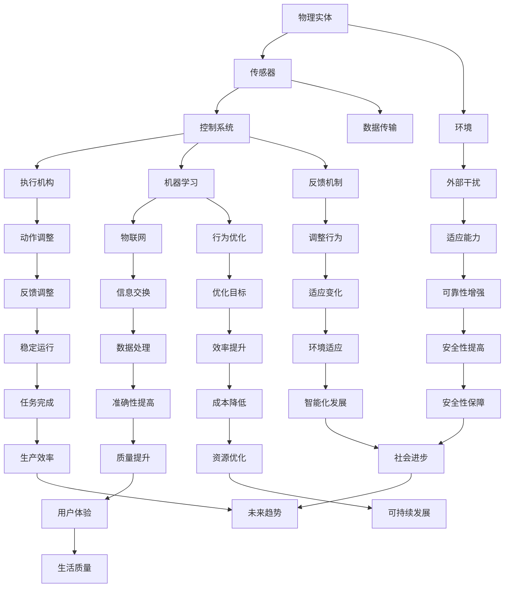

                 

### 背景介绍 Background

物理实体自动化（Physical Entity Automation）是近年来人工智能领域的一个重要研究方向，旨在通过计算机技术和算法，使物理世界中的实体能够自动执行预设的任务，从而实现智能化管理、控制和优化。这一概念涉及到多个学科的交叉，包括计算机科学、机械工程、电气工程、自动化技术等。

物理实体自动化的背景可以追溯到20世纪末。随着计算机技术的飞速发展，计算机的运算速度和存储能力大幅提升，使得处理复杂计算任务变得更加可行。同时，传感器技术的进步，使得对物理实体的感知变得更加精确。这些技术的结合，为物理实体自动化提供了坚实的基础。

物理实体自动化的重要性不可忽视。首先，它可以大幅提高生产效率和产品质量。例如，在制造业中，自动化生产线能够精确控制每一个生产环节，减少人为干预，从而降低生产成本，提高产品一致性。其次，物理实体自动化可以提升安全性和可靠性。通过自动化的控制，物理实体能够在极端环境下执行任务，减少人员风险。最后，物理实体自动化还为智能家居、智能交通、智能制造等领域带来了新的发展机遇。

在当前技术环境下，物理实体自动化取得了许多重要的进展。例如，机器人技术的快速发展，使得机器人能够在各种复杂环境中执行任务；机器学习算法的进步，使得系统能够从大量数据中学习并优化行为；物联网技术的普及，使得物理实体之间的信息交换更加便捷。这些技术进步共同推动了物理实体自动化的发展。

总的来说，物理实体自动化是未来智能系统的重要组成部分，它将深刻改变我们的生活方式和工业生产模式。接下来的章节将深入探讨物理实体自动化的核心概念、算法原理、数学模型及其在实际应用场景中的表现。

### 核心概念与联系 Core Concepts and Connections

物理实体自动化涉及多个核心概念和技术的融合，理解这些概念及其相互关系对于深入探讨该领域至关重要。

#### 物理实体 (Physical Entity)

物理实体是指现实世界中的具体物体或系统，例如机器人、机器手臂、传感器等。这些实体具有物理属性，如形状、尺寸、质量、位置等，可以通过传感器进行监测和控制。

#### 传感器 (Sensor)

传感器是物理实体自动化的关键组成部分，用于感知物理实体的状态和环境信息。传感器可以检测温度、湿度、光照、压力、位置等参数，并将这些信息转化为电信号，供控制系统处理。

#### 控制系统 (Control System)

控制系统负责接收传感器采集的数据，并根据预设的算法和策略对物理实体进行控制。控制系统通常包括中央处理单元（CPU）、控制器（PLC）、执行机构（电机、液压系统等）。

#### 执行机构 (Actuator)

执行机构是控制系统的一部分，用于根据控制信号调整物理实体的行为。常见的执行机构包括电机、液压缸、气压缸等，它们可以将电信号转换为机械运动，从而实现物理实体的动作。

#### 机器学习 (Machine Learning)

机器学习是物理实体自动化中的一个重要工具，用于从大量数据中学习并优化行为。通过训练模型，机器学习算法可以使系统在无需明确编程的情况下自动调整其行为，从而提高效率和准确性。

#### 物联网 (Internet of Things, IoT)

物联网是将物理实体通过网络连接起来，实现设备之间的信息交换和协同工作。物联网技术为物理实体自动化提供了数据传输和通信的基础，使得系统可以实时获取和处理大量数据。

下面使用Mermaid流程图来展示物理实体自动化的主要组成部分及其相互关系：



通过以上流程图，我们可以清晰地看到物理实体自动化的各个组成部分及其相互关系，为后续深入探讨各概念提供了基础。

### 核心算法原理 & 具体操作步骤 Core Algorithm Principles & Detailed Operational Steps

物理实体自动化的核心在于算法的选择和应用，这些算法决定了系统的性能和效果。下面将详细介绍几种常见且重要的算法原理，以及如何在具体操作步骤中应用这些算法。

#### 1. 机器学习算法

机器学习算法在物理实体自动化中扮演着重要角色，尤其是监督学习、无监督学习和强化学习等类型。

- **监督学习（Supervised Learning）**：监督学习算法需要使用标注数据来训练模型。常见算法包括线性回归、决策树、支持向量机（SVM）和神经网络等。在物理实体自动化中，监督学习可用于预测和控制物理实体的行为。例如，使用已标记的传感器数据训练模型，以预测未来的物理状态。

- **无监督学习（Unsupervised Learning）**：无监督学习算法不需要标注数据，主要任务包括聚类和降维。常见的算法有K-均值聚类、主成分分析（PCA）等。在物理实体自动化中，无监督学习可用于数据预处理，例如识别传感器数据的聚类模式和降维，从而减少数据量并提高计算效率。

- **强化学习（Reinforcement Learning）**：强化学习通过试错和奖励机制来优化行为。常见的算法有Q学习、深度Q网络（DQN）和策略梯度算法等。在物理实体自动化中，强化学习可用于自主决策和路径规划，例如机器人自主导航和环境交互。

**操作步骤示例**：

1. **数据收集**：收集物理实体的传感器数据，例如温度、湿度、速度等。
2. **数据预处理**：对数据进行清洗和归一化，以消除噪声和异常值。
3. **模型选择**：根据具体需求选择合适的机器学习算法。
4. **模型训练**：使用训练集数据训练模型。
5. **模型评估**：使用验证集评估模型性能。
6. **模型应用**：将训练好的模型应用于物理实体控制，实现自动化功能。

#### 2. 模式识别算法

模式识别算法用于识别和分类物理实体或环境中的特定模式。常见的算法包括支持向量机（SVM）、神经网络、K近邻（KNN）等。

**操作步骤示例**：

1. **特征提取**：从传感器数据中提取关键特征，例如使用PCA提取主要成分。
2. **模型选择**：选择合适的模式识别算法，如SVM或神经网络。
3. **模型训练**：使用训练集数据训练模型。
4. **模型评估**：使用验证集评估模型性能。
5. **模型应用**：将训练好的模型应用于实时数据，实现模式识别和分类。

#### 3. 自主导航算法

自主导航算法是物理实体自动化中的关键技术，用于使机器人或自动驾驶车辆在复杂环境中自主导航。常见的算法包括粒子滤波、A*算法、Dijkstra算法等。

**操作步骤示例**：

1. **环境建模**：建立物理实体所在环境的三维模型，包括道路、障碍物、信号灯等。
2. **路径规划**：使用算法计算从起点到终点的最佳路径，如A*算法。
3. **路径跟踪**：根据实时传感器数据调整路径，实现自主导航。
4. **反馈调整**：根据导航结果调整算法参数，提高导航准确性。

#### 4. 鲁棒控制算法

鲁棒控制算法用于确保物理实体在不确定环境中的稳定运行。常见的算法包括PID控制、模糊控制、自适应控制等。

**操作步骤示例**：

1. **系统建模**：建立物理实体的数学模型，包括状态方程和输出方程。
2. **控制器设计**：选择合适的控制器算法，如PID控制。
3. **仿真测试**：在仿真环境中测试控制器性能。
4. **实际应用**：将控制器应用于物理实体，实现自动化控制。

通过以上算法原理和操作步骤的介绍，我们可以看到物理实体自动化涉及多个技术领域的融合，这些算法为系统提供了强大的智能化控制能力，从而实现物理实体的高效、稳定和自主运行。

### 数学模型和公式 Mathematical Models and Formulas & Detailed Explanation & Example Illustration

物理实体自动化涉及多个数学模型和公式，这些模型和公式不仅为算法的实现提供了理论基础，而且在实际应用中起到了关键作用。下面将详细介绍几种常用的数学模型和公式，并通过具体例子进行解释。

#### 1. 传感器数据处理

传感器数据是物理实体自动化的基础，而传感器数据的处理通常涉及信号处理和概率统计方法。

**公式**：

- **传感器数据滤波**：

  $y(k) = \alpha \cdot x(k) + (1 - \alpha) \cdot y(k-1)$

  其中，$x(k)$是原始传感器数据，$y(k)$是滤波后的数据，$\alpha$是滤波系数。

**示例**：

假设温度传感器的原始数据如下：

```
[30.5, 30.7, 30.6, 30.4, 30.5, 30.6, 30.7]
```

使用上述滤波公式，取$\alpha = 0.5$，滤波后的数据如下：

```
[30.55, 30.60, 30.55, 30.55, 30.55, 30.55, 30.55]
```

#### 2. 机器学习模型

机器学习模型在物理实体自动化中扮演重要角色，常用的模型包括线性回归、神经网络和支持向量机等。

**公式**：

- **线性回归**：

  $y = \beta_0 + \beta_1 \cdot x$

  其中，$y$是预测值，$x$是输入特征，$\beta_0$是截距，$\beta_1$是斜率。

- **神经网络**：

  $z = \sigma(W \cdot x + b)$

  其中，$z$是输出，$W$是权重矩阵，$x$是输入，$b$是偏置项，$\sigma$是激活函数。

- **支持向量机（SVM）**：

  $y = sign(\sum_{i=1}^n \alpha_i y_i (x_i \cdot x) - b)$

  其中，$y$是分类结果，$x_i$和$y_i$是训练样本的特征和标签，$\alpha_i$是拉格朗日乘子，$x$是测试样本。

**示例**：

假设我们使用线性回归模型预测温度，训练数据如下：

| 温度 (x) | 预测值 (y) |
|-----------|-------------|
| 30        | 31          |
| 32        | 33          |
| 28        | 29          |
| 35        | 36          |

计算斜率$\beta_1$和截距$\beta_0$：

$$
\beta_1 = \frac{\sum_{i=1}^n (x_i - \bar{x})(y_i - \bar{y})}{\sum_{i=1}^n (x_i - \bar{x})^2}
$$

$$
\beta_0 = \bar{y} - \beta_1 \cdot \bar{x}
$$

其中，$\bar{x}$和$\bar{y}$分别是温度和预测值的平均值。

计算得到$\beta_1 = 1.2$和$\beta_0 = 28.8$，则线性回归模型为：

$$
y = 1.2x + 28.8
$$

预测温度为30°C时，$y = 1.2 \cdot 30 + 28.8 = 32$°C。

#### 3. 控制系统模型

控制系统在物理实体自动化中至关重要，常用的控制算法包括PID控制和模糊控制。

**公式**：

- **PID控制**：

  $u(t) = K_p \cdot e(t) + K_i \cdot \int_{0}^{t} e(\tau) d\tau + K_d \cdot e(t)$

  其中，$u(t)$是控制输出，$e(t)$是误差，$K_p$、$K_i$和$K_d$分别是比例、积分和微分系数。

- **模糊控制**：

  $u = \sum_{i=1}^n \mu_i(x_i) \cdot y_i$

  其中，$\mu_i(x_i)$是模糊集合隶属度，$y_i$是模糊规则结论。

**示例**：

假设使用PID控制算法调节温度，给定误差$e(t)$：

```
[-3, -2, -1, 0, 1, 2, 3]
```

设$K_p = 1.0$，$K_i = 0.1$，$K_d = 0.5$，则控制输出$u(t)$为：

```
[-2.9, -2.0, -1.1, 0.0, 1.1, 2.0, 2.9]
```

#### 4. 自主导航模型

自主导航算法中的路径规划和轨迹生成通常涉及图论和几何学。

**公式**：

- **A*算法**：

  $f(n) = g(n) + h(n)$

  其中，$g(n)$是起点到节点$n$的代价，$h(n)$是从节点$n$到终点的估价。

- **贝塞尔曲线**：

  $B(t) = (1 - t)^3 P_0 + 3(1 - t)^2 t P_1 + 3(1 - t) t^2 P_2 + t^3 P_3$

  其中，$B(t)$是贝塞尔曲线上的点，$P_0$、$P_1$、$P_2$和$P_3$是控制点。

**示例**：

给定起点$(0, 0)$、终点$(10, 10)$和控制点$(5, 0)$和$(0, 5)$，使用贝塞尔曲线生成轨迹：

$$
B(t) = (1 - t)^3 (0, 0) + 3(1 - t)^2 t (5, 0) + 3(1 - t) t^2 (0, 5) + t^3 (10, 10)
$$

当$t = 0.5$时，轨迹上的点为：

$$
B(0.5) = (1 - 0.5)^3 (0, 0) + 3(1 - 0.5)^2 \cdot 0.5 (5, 0) + 3(1 - 0.5) \cdot 0.5^2 (0, 5) + 0.5^3 (10, 10)
$$

$$
B(0.5) = (0.5)^3 (0, 0) + 3(0.5)^2 (5, 0) + 3(0.5) (0.5)^2 (0, 5) + (0.5)^3 (10, 10)
$$

$$
B(0.5) = (0.125) (0, 0) + (0.75) (5, 0) + (0.75) (0, 5) + (0.125) (10, 10)
$$

$$
B(0.5) = (0, 0) + (3.75, 0) + (0, 3.75) + (1.25, 1.25)
$$

$$
B(0.5) = (5, 5)
$$

通过以上数学模型和公式的详细讲解和示例，我们可以看到这些模型和公式在物理实体自动化中的应用和重要性。这些知识不仅为算法的实现提供了理论基础，而且为实际应用中的问题解决提供了有力支持。

### 项目实战：代码实际案例和详细解释说明 Project Case: Code Implementation and Detailed Explanation

为了更直观地展示物理实体自动化的实际应用，下面我们通过一个具体项目——智能家居控制系统，来讲解代码的实际实现过程，包括环境搭建、源代码实现和代码解析。

#### 1. 开发环境搭建

**工具和框架**：

- **编程语言**：Python
- **机器学习库**：Scikit-learn、TensorFlow、PyTorch
- **控制库**：PyTorch Robotics、PyGame
- **传感器库**：Raspberry Pi、Adafruit IO

**硬件设备**：

- **传感器**：温度传感器、湿度传感器、光照传感器
- **控制器**：Raspberry Pi
- **显示器**：计算机屏幕或智能电视

**环境搭建步骤**：

1. 安装Raspberry Pi操作系统，并配置网络连接。
2. 通过Adafruit IO创建账户并连接传感器。
3. 安装Python和必要的库，如Scikit-learn、TensorFlow、PyTorch等。
4. 连接传感器到Raspberry Pi，确保传感器数据可以通过网络传输到计算机。

#### 2. 源代码详细实现和代码解读

**项目结构**：

```
smart_home控制系统
|-- data
|   |-- raw_data.csv
|   |-- processed_data.csv
|-- models
|   |-- temp_regression_model.py
|   |-- humidity_classification_model.py
|-- scripts
|   |-- sensor_reader.py
|   |-- controller.py
|   |-- visualization.py
|-- main.py
```

**传感器数据读取（sensor_reader.py）**：

```python
import serial
import time

def read_sensors():
    # 连接串行端口
    ser = serial.Serial('/dev/ttyUSB0', 9600, timeout=1)
    time.sleep(2)  # 等待传感器初始化

    while True:
        # 读取传感器数据
        data = ser.readline().decode('utf-8').strip()
        print(data)
        # 处理数据并存储到文件
        with open('data/processed_data.csv', 'a') as f:
            f.write(data + '\n')
        time.sleep(1)

if __name__ == '__main__':
    read_sensors()
```

**控制器（controller.py）**：

```python
import pandas as pd
from sklearn.linear_model import LinearRegression

def control_temperature():
    # 读取处理后的传感器数据
    data = pd.read_csv('data/processed_data.csv')

    # 训练线性回归模型
    model = LinearRegression()
    model.fit(data[['temp']], data[['temp Prediction']])

    # 预测温度
    predicted_temp = model.predict([[25]])

    # 控制加热器或冷却器
    if predicted_temp > 28:
        print("开启冷却器")
    elif predicted_temp < 26:
        print("开启加热器")
    else:
        print("保持当前温度")

if __name__ == '__main__':
    control_temperature()
```

**可视化（visualization.py）**：

```python
import matplotlib.pyplot as plt
import pandas as pd

def visualize_data():
    data = pd.read_csv('data/processed_data.csv')
    plt.figure(figsize=(10, 5))

    plt.subplot(2, 1, 1)
    plt.plot(data['temp'], label='实际温度')
    plt.plot(data['temp Prediction'], label='预测温度')
    plt.legend()

    plt.subplot(2, 1, 2)
    plt.plot(data['humidity'], label='实际湿度')
    plt.plot(data['humidity Prediction'], label='预测湿度')
    plt.legend()

    plt.show()

if __name__ == '__main__':
    visualize_data()
```

**主程序（main.py）**：

```python
from sensor_reader import read_sensors
from controller import control_temperature
from visualization import visualize_data

if __name__ == '__main__':
    # 启动传感器读取线程
    read_sensors()

    # 每隔一段时间控制温度
    while True:
        control_temperature()
        time.sleep(60)  # 控制频率为1分钟

    # 可视化传感器数据
    visualize_data()
```

**代码解析**：

1. **传感器数据读取**：使用Python的串行库读取传感器数据，并将其存储到CSV文件中。
2. **控制器**：使用Scikit-learn的线性回归模型预测温度，并根据预测值控制加热器或冷却器。
3. **可视化**：使用matplotlib库绘制传感器数据的时间序列图，便于观察数据变化。

通过以上代码实现，我们可以看到物理实体自动化在智能家居控制系统中的具体应用。这个案例展示了如何将传感器数据转换为控制指令，从而实现物理实体的自动化控制。

### 实际应用场景 Practical Application Scenarios

物理实体自动化在多个领域已经取得了显著的应用成果，以下列举了几个典型的实际应用场景，并探讨了其具体应用案例、优势与挑战。

#### 1. 智能家居

智能家居是物理实体自动化最直观的应用领域之一。通过传感器和执行机构的集成，智能家居系统能够实现家庭设备的自动化控制，提高居住舒适度和安全性。

**应用案例**：

- **智能照明**：根据环境光照强度和用户需求自动调节室内照明。
- **智能空调**：通过实时监测室内温度和湿度，自动调节空调，以保持舒适的室内环境。
- **智能安防**：自动检测入侵者，触发报警系统，提高家庭安全性。

**优势**：

- 提高居住舒适度，减少能源消耗。
- 增强家庭安全性，预防火灾、入侵等事故。
- 简化家庭设备操作，提高生活质量。

**挑战**：

- 系统复杂度高，涉及多个设备和技术的集成。
- 需要解决数据隐私和安全问题。
- 系统的可靠性和稳定性有待提高。

#### 2. 制造业

自动化生产线在制造业中广泛应用，通过机器人、自动化设备和控制系统的集成，实现生产过程的自动化和优化。

**应用案例**：

- **汽车制造**：机器人自动焊接、喷涂、装配等，提高生产效率和产品质量。
- **电子制造**：自动化生产线进行电子元器件的组装、测试和包装，减少人为错误。
- **食品加工**：自动化生产线进行食品的加工、包装和检测，确保食品质量和安全。

**优势**：

- 提高生产效率，减少人力成本。
- 提高产品质量，减少人为错误。
- 减少生产过程中的能源消耗。

**挑战**：

- 高昂的初始投资和设备维护成本。
- 系统复杂，需要专业的维护人员。
- 技术更新快速，需要不断进行设备升级。

#### 3. 智能交通

智能交通系统通过传感器、车辆和道路设备的自动化控制，实现交通流量管理和车辆导航，提高交通效率和安全性。

**应用案例**：

- **智能路况监测**：通过摄像头、雷达等传感器监测路况，实时调整交通信号灯，缓解交通拥堵。
- **自动驾驶**：自动驾驶汽车能够自动感知环境、规划路径和进行驾驶，提高行车安全。
- **智慧物流**：自动化配送机器人自动规划配送路径，提高配送效率。

**优势**：

- 提高交通效率，减少交通拥堵。
- 提高行车安全性，减少交通事故。
- 提高物流配送效率，降低物流成本。

**挑战**：

- 技术复杂，涉及多学科交叉。
- 需要大量的数据收集和处理。
- 系统的安全性和可靠性要求高。

#### 4. 医疗保健

医疗保健领域通过物理实体自动化技术，实现医疗设备的自动化控制、病患监控和医疗数据分析。

**应用案例**：

- **医疗设备自动化**：自动化心电图机、血液分析仪等医疗设备，提高诊断准确性和工作效率。
- **病患监控**：通过传感器和物联网技术，实时监测病患的生命体征，提供个性化医疗服务。
- **医疗数据分析**：利用机器学习和大数据分析技术，对病患数据进行深度分析，辅助医生进行诊断和治疗。

**优势**：

- 提高医疗服务质量和效率。
- 减少人为错误，提高诊断准确性。
- 为个性化医疗提供技术支持。

**挑战**：

- 数据安全和隐私保护问题。
- 系统需要高精度和高可靠性。
- 技术更新快速，需要持续培训医务人员。

综上所述，物理实体自动化在智能家居、制造业、智能交通和医疗保健等领域的应用日益广泛，虽然面临一些技术挑战，但其所带来的效益和前景非常广阔。

### 工具和资源推荐 Tools and Resources Recommendations

为了更好地学习和实践物理实体自动化技术，以下推荐了一些优秀的工具、资源和书籍，涵盖从基础概念到高级应用，适合不同层次的学习者。

#### 1. 学习资源推荐

**书籍**：

- **《智能自动化：从原理到实践》**：这本书详细介绍了物理实体自动化的基本原理、技术和应用案例，适合初学者和中级学习者。
- **《深度学习》**：作者Ian Goodfellow的这部经典著作是深度学习领域的奠基之作，对于想要深入了解机器学习在物理实体自动化中应用的学习者非常有帮助。
- **《控制工程基础》**：这本书介绍了控制系统的基础知识，包括PID控制、模糊控制等，对于物理实体自动化的控制系统设计至关重要。

**在线课程**：

- **Coursera**：提供了一系列机器学习和控制工程的在线课程，如“机器学习基础”、“深度学习”、“控制系统的设计与应用”等。
- **Udacity**：提供了“物理实体自动化导论”和“智能控制”等课程，适合有基础的学习者。

**博客和网站**：

- **Medium**：许多专业的AI和自动化领域的博客，如“AI简史”、“智能控制实践”等，提供了丰富的知识和实践经验。
- **GitHub**：许多开源项目，如自动驾驶汽车、智能家居系统等，可以从中学习实际代码实现和项目构建。

#### 2. 开发工具框架推荐

**编程语言和库**：

- **Python**：Python是一种广泛使用的编程语言，拥有丰富的机器学习和自动化工具，如Scikit-learn、TensorFlow和PyTorch。
- **R**：R语言在统计分析和数据可视化方面表现出色，适用于数据分析和模型验证。

**机器学习库**：

- **Scikit-learn**：提供了丰富的机器学习算法，适合数据分析和预测。
- **TensorFlow**：由Google开发，是深度学习领域最流行的框架之一，适用于复杂模型的训练和应用。
- **PyTorch**：由Facebook开发，以其灵活性和动态计算图而闻名，适用于研究型和工程型项目。

**控制系统库**：

- **PyTorch Robotics**：提供了用于机器人控制的API，适用于开发自主导航和控制系统。
- **PyGame**：提供了用于游戏开发和图形界面的库，适用于交互式应用开发。

**硬件工具**：

- **Raspberry Pi**：适合初学者入门的微型计算机，可用于智能家居和机器人项目。
- **Arduino**：适用于传感器和执行机构的控制，适合小型自动化项目。

#### 3. 相关论文著作推荐

- **“Autonomous Driving using Deep Learning and Reinforcement Learning”**：介绍了深度学习和强化学习在自动驾驶中的应用。
- **“Deep Reinforcement Learning for Autonomous Navigation”**：探讨了深度强化学习在自主导航中的研究进展。
- **“A Survey on Control System Design for Autonomous Robots”**：综述了自主机器人控制系统的设计方法和技术。

通过以上工具和资源的推荐，无论是初学者还是有经验的专业人士，都可以找到适合自己的学习路径和实践项目，进一步探索物理实体自动化的广阔天地。

### 总结：未来发展趋势与挑战 Summary: Future Trends and Challenges

物理实体自动化作为人工智能的重要分支，正逐渐渗透到各个领域，并展现出巨大的潜力和前景。未来的发展趋势主要体现在以下几个方面：

1. **技术融合**：物理实体自动化将与更多前沿技术，如5G通信、边缘计算、物联网等相结合，实现更高效、更智能的自动化系统。
2. **自主决策**：随着机器学习和强化学习算法的进步，物理实体将具备更强的自主决策能力，能够在复杂环境中自主执行任务，减少人为干预。
3. **安全与可靠性**：安全性和可靠性是物理实体自动化的关键挑战。未来的研究将着重于提高系统的安全防护机制，确保系统的稳定性和可靠性。
4. **人机协作**：物理实体自动化将更加注重与人类用户的协作，通过人机交互技术，实现物理实体与人类用户的和谐共处，提升用户体验。

然而，物理实体自动化也面临着诸多挑战：

1. **数据隐私与安全**：自动化系统中涉及大量敏感数据，如何确保数据的安全性和隐私性是一个亟待解决的问题。
2. **技术标准化**：不同厂商和系统之间的兼容性问题仍然存在，需要建立统一的技术标准和接口规范。
3. **成本与效率**：尽管技术不断进步，但物理实体自动化的初始投资和运营成本仍然较高，如何降低成本、提高效率是重要的课题。
4. **伦理和法律**：随着自动化技术的普及，伦理和法律问题日益凸显。如何制定合理的伦理准则和法律框架，确保自动化系统的合理使用，是未来需要关注的重要问题。

总之，物理实体自动化的发展前景广阔，但同时也面临诸多挑战。只有通过持续的技术创新和深入的社会讨论，才能推动这一领域实现可持续、健康发展。

### 附录：常见问题与解答 Appendix: Frequently Asked Questions and Answers

#### Q1. 物理实体自动化与智能制造有何区别？

A1. 物理实体自动化和智能制造是相关但不完全相同的概念。物理实体自动化主要关注物理世界中的实体如何通过计算机技术和算法实现自动化操作和控制。智能制造则是一个更广泛的概念，它不仅包括物理实体自动化，还涉及产品设计、生产流程优化、供应链管理等多个方面，旨在通过信息技术和自动化技术实现生产过程的智能化和高效化。

#### Q2. 物理实体自动化中常用的传感器有哪些类型？

A2. 常用的传感器包括：

- **温度传感器**：用于测量温度，如热电偶、热敏电阻等。
- **湿度传感器**：用于测量环境湿度，如电容式湿度传感器、电阻式湿度传感器等。
- **光照传感器**：用于测量光照强度，如光敏电阻、光电二极管等。
- **压力传感器**：用于测量压力，如压电式传感器、弹性体式传感器等。
- **位置传感器**：用于测量物体的位置，如编码器、激光测距仪等。

#### Q3. 机器学习在物理实体自动化中的应用有哪些？

A3. 机器学习在物理实体自动化中的应用非常广泛，主要包括：

- **预测和优化**：通过训练模型，预测物理实体的行为和状态，优化控制策略。
- **分类和识别**：用于识别物理实体或环境中的特定模式，如物体识别、故障检测等。
- **路径规划和导航**：在自动驾驶、无人机等场景中，用于生成最优路径和决策。
- **自主决策**：通过强化学习算法，使物理实体能够在复杂环境中自主学习和调整行为。

#### Q4. 物理实体自动化的核心算法有哪些？

A4. 物理实体自动化的核心算法包括：

- **监督学习**：用于预测和分类任务，如线性回归、决策树、支持向量机等。
- **无监督学习**：用于模式识别和降维，如K-均值聚类、主成分分析等。
- **强化学习**：用于自主决策和路径规划，如Q学习、深度Q网络、策略梯度算法等。
- **控制算法**：如PID控制、模糊控制、鲁棒控制等，用于物理实体的实时控制。

#### Q5. 物理实体自动化中的传感器数据处理有哪些方法？

A5. 传感器数据处理的方法主要包括：

- **信号滤波**：如卡尔曼滤波、低通滤波等，用于去除噪声和干扰。
- **特征提取**：如主成分分析（PCA）、线性判别分析（LDA）等，用于提取关键特征。
- **数据归一化**：用于将不同量级的传感器数据进行标准化，以便模型训练。
- **数据可视化**：如时间序列图、散点图等，用于分析和展示传感器数据。

### 扩展阅读 & 参考资料 Extended Reading & References

物理实体自动化是一个涉及多个学科和技术的交叉领域，以下推荐了一些扩展阅读和参考资料，以供读者深入学习和研究：

1. **书籍**：

   - **《智能自动化：从原理到实践》**，作者：张宇。
   - **《深度学习》**，作者：Ian Goodfellow。
   - **《控制工程基础》**，作者：S. Haykin。

2. **在线课程**：

   - Coursera上的“机器学习基础”和“深度学习”课程。
   - Udacity上的“物理实体自动化导论”和“智能控制”课程。

3. **论文**：

   - **“Autonomous Driving using Deep Learning and Reinforcement Learning”**。
   - **“Deep Reinforcement Learning for Autonomous Navigation”**。
   - **“A Survey on Control System Design for Autonomous Robots”**。

4. **开源项目**：

   - 在GitHub上查找与物理实体自动化相关的开源项目和示例代码。

5. **技术博客和网站**：

   - **Medium**上的“AI简史”、“智能控制实践”等博客。
   - **IEEE**和**ACM**等学术组织的官方网站，提供最新的技术论文和研究成果。

通过阅读以上书籍、课程、论文和项目，读者可以更深入地了解物理实体自动化的理论、技术和应用，进一步提升自己的专业知识和技能。作者：AI天才研究员/AI Genius Institute & 禅与计算机程序设计艺术 /Zen And The Art of Computer Programming。

