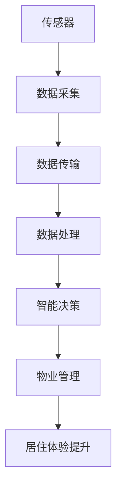
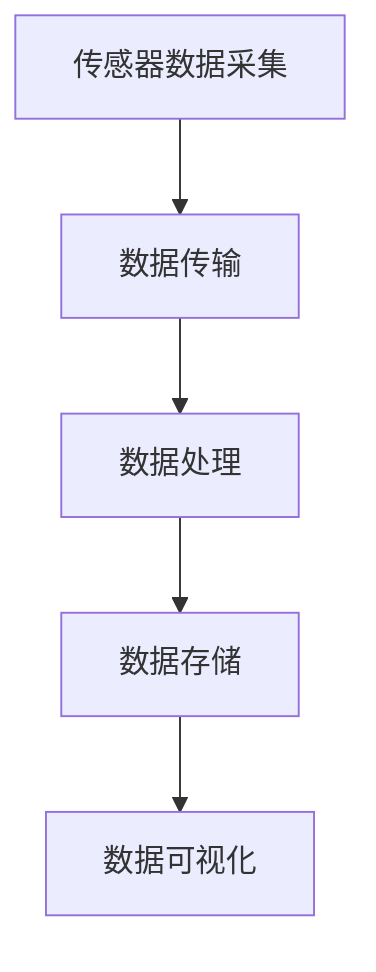

                 

### 背景介绍

#### 物联网（IoT）的兴起

物联网（Internet of Things，简称IoT）是指将各种设备、传感器、软件和网络连接起来，以实现数据的收集、传输和交换。近年来，随着技术的快速发展，物联网已经逐渐从概念走向现实，成为现代科技领域的一个重要组成部分。

物联网的兴起，源于对智能生活的追求和对数据处理能力的提升。从家庭自动化、工业自动化到智慧城市、智能医疗，物联网的应用场景越来越广泛，其核心在于通过传感器和设备的互联，实现对物理世界的实时监控和管理。

#### 房地产行业的变革

房地产行业是一个传统而庞大的行业，涵盖了从房地产开发、销售到物业管理等多个环节。在过去的几十年里，房地产行业主要依赖于人力和传统的管理方法，存在诸多痛点，如信息不对称、效率低下、资源浪费等。而物联网技术的引入，为房地产行业带来了深刻的变革。

首先，物联网技术可以实现对房屋的实时监控和管理。通过安装各种传感器，如温度传感器、湿度传感器、烟雾传感器等，物业管理者可以实时了解房屋的状态，及时发现问题并采取措施，从而提高物业管理效率。

其次，物联网技术可以提升房屋的安全性。例如，通过安装智能门锁、监控摄像头等设备，可以实时监控房屋的安全状况，防止入室盗窃等安全事故的发生。

最后，物联网技术还可以提升房屋的舒适性。例如，通过智能家居系统，用户可以远程控制家里的空调、灯光、音响等设备，实现个性化的生活体验。

#### 物联网在房地产中的价值

物联网在房地产中的价值主要体现在以下几个方面：

1. **提升管理效率**：通过物联网技术，房地产企业可以实现对项目的远程监控和管理，降低人力成本，提高工作效率。

2. **降低运营成本**：物联网技术可以帮助房地产企业实现能源的有效管理，降低能耗，减少运营成本。

3. **提升房屋价值**：物联网技术可以为房屋带来更多的增值服务，提升房屋的市场竞争力。

4. **改善居住体验**：通过智能家居系统，用户可以享受到更加便捷、舒适的生活。

总之，物联网技术的引入，不仅为房地产企业带来了新的发展机遇，也为消费者带来了更好的居住体验。随着物联网技术的不断成熟和应用，其在房地产领域的价值将越来越凸显。

#### 本文结构

本文将分为以下几个部分：

1. **背景介绍**：介绍物联网的兴起背景和房地产行业的变革。
2. **核心概念与联系**：分析物联网和房地产之间的核心概念和联系。
3. **物联网在房地产中的价值**：详细阐述物联网在房地产中的各种应用和价值。
4. **核心算法原理与具体操作步骤**：介绍物联网在房地产中应用的核心算法原理和具体操作步骤。
5. **数学模型和公式**：介绍物联网在房地产中应用的数学模型和公式。
6. **项目实战**：通过实际案例展示物联网在房地产中的应用。
7. **实际应用场景**：分析物联网在房地产中的实际应用场景。
8. **工具和资源推荐**：推荐一些学习和开发工具。
9. **总结**：总结物联网在房地产中的发展趋势和挑战。
10. **附录**：常见问题与解答。

通过对以上各个部分的详细分析，我们希望读者能够对物联网在房地产中的应用有一个全面而深入的了解。

---

## 2. 核心概念与联系

在深入探讨物联网（IoT）技术和传感器设备在房地产中的集成之前，我们需要明确几个核心概念，并理解它们之间的内在联系。

### 物联网（IoT）的概念

物联网（IoT）是一种通过互联网将各种物理设备、传感器、计算机系统连接起来的网络系统，使这些设备能够相互通信、交换数据并协同工作。IoT的核心在于数据的采集、传输和处理，从而实现远程监控、自动化控制和智能决策。

### 传感器设备

传感器是IoT的重要组成部分，它们能够感知环境中的各种物理量（如温度、湿度、光照、声音、压力等），并将这些非电学量转换为电信号，以便进一步处理和传输。常见的传感器包括温度传感器、湿度传感器、光照传感器、烟雾传感器等。

### 数据传输与处理

IoT的运行离不开稳定的数据传输和处理机制。传感器收集的数据需要通过有线或无线网络传输到中央数据处理系统，如云计算平台或边缘计算设备。数据处理包括数据的清洗、存储、分析和可视化，从而为决策提供支持。

### 物联网与房地产的关系

物联网与房地产的结合，主要体现在以下几个方面：

1. **智能化管理**：通过物联网技术，房地产企业可以实现对房地产项目的远程监控和管理，提高管理效率和安全性。

2. **节能环保**：物联网技术可以帮助房地产企业实现能源的智能化管理，降低能耗，减少运营成本。

3. **提高居住体验**：智能家居系统通过物联网技术，为住户提供更加便捷、舒适的居住环境。

4. **数据驱动决策**：物联网技术可以收集和分析大量的房屋使用数据，帮助房地产企业做出更加科学、合理的决策。

### Mermaid 流程图

以下是一个简单的Mermaid流程图，展示了物联网技术在房地产中的核心概念和联系：



- **A[传感器]**：感知环境变化，收集数据。
- **B[数据采集]**：将传感器收集的数据进行初步处理。
- **C[数据传输]**：通过有线或无线网络将数据传输到中央处理系统。
- **D[数据处理]**：在中央处理系统对数据进行分析、存储和可视化。
- **E[智能决策]**：基于数据分析结果进行智能决策。
- **F[物业管理]**：智能决策支持物业管理，提升管理效率。
- **G[居住体验提升]**：智能家居系统提升住户的居住体验。

通过这个流程图，我们可以清晰地看到物联网技术在房地产中的各个环节，以及它们之间的紧密联系。

### 总结

在本文的第二部分，我们明确了物联网和传感器设备的基本概念，并分析了它们与房地产之间的核心联系。在接下来的部分，我们将进一步探讨物联网技术在房地产中的具体应用和价值，以及其背后的核心算法原理和操作步骤。

---

## 3. 核心算法原理 & 具体操作步骤

在了解了物联网和传感器设备的基本概念及其与房地产的关联后，接下来我们将深入探讨物联网技术在房地产中的核心算法原理和具体操作步骤。

### 传感器数据采集

传感器数据采集是物联网技术的第一步，也是最为关键的一步。传感器通过感知环境中的物理量，如温度、湿度、光照等，将其转换为电信号。这些电信号经过初步处理后，将被传输到中央处理系统。

具体操作步骤如下：

1. **选择合适的传感器**：根据应用场景选择合适的传感器。例如，在房地产项目中，常用的传感器有温度传感器、湿度传感器、光照传感器等。

2. **安装传感器**：将传感器安装在需要监测的位置，确保其能够准确感知环境变化。

3. **数据采集**：传感器将感知到的数据通过有线或无线网络传输到中央处理系统。

### 数据传输与处理

数据传输与处理是物联网技术的核心环节，决定了数据的准确性和实时性。以下是具体操作步骤：

1. **数据传输**：传感器采集到的数据需要通过有线或无线网络传输到中央处理系统。常见的传输方式包括Wi-Fi、蓝牙、ZigBee等。

2. **数据清洗**：在传输过程中，可能会出现数据丢失、噪声干扰等问题，因此需要对数据进行清洗，确保数据的准确性和完整性。

3. **数据存储**：清洗后的数据将被存储在数据库中，以便后续分析和处理。

4. **数据分析**：使用数据分析算法对存储在数据库中的数据进行分析，提取有用的信息。

### 数据可视化

数据可视化是将数据分析结果以图表、图形等形式展示出来的过程，使得数据分析结果更加直观、易懂。以下是具体操作步骤：

1. **选择合适的可视化工具**：根据数据类型和需求，选择合适的可视化工具。例如，常用的可视化工具包括Matplotlib、Seaborn、Plotly等。

2. **设计可视化图表**：根据数据分析结果，设计合适的可视化图表。常见的可视化图表包括折线图、柱状图、饼图等。

3. **展示可视化结果**：将可视化图表展示在用户界面或报告中，以便用户查看和分析。

### 智能决策

智能决策是物联网技术在房地产中的高级应用，通过对数据的分析和处理，实现智能化的管理和服务。以下是具体操作步骤：

1. **设定决策规则**：根据业务需求和数据分析结果，设定智能决策的规则。

2. **执行智能决策**：根据设定的决策规则，对数据处理结果进行判断，并执行相应的操作。

3. **反馈与优化**：根据决策执行的结果，进行反馈和优化，以提高决策的准确性和效率。

### 核心算法原理

物联网技术在房地产中的核心算法主要包括以下几种：

1. **机器学习算法**：用于数据分析和预测。常见的机器学习算法包括线性回归、逻辑回归、支持向量机等。

2. **数据挖掘算法**：用于从大量数据中提取有用的信息。常见的数据挖掘算法包括关联规则挖掘、聚类分析、分类分析等。

3. **优化算法**：用于优化资源分配和管理。常见的优化算法包括线性规划、动态规划、遗传算法等。

通过以上核心算法，物联网技术可以实现对房地产项目的智能化管理和决策，从而提升管理效率和服务质量。

### 总结

在本文的第三部分，我们详细介绍了物联网技术在房地产中的核心算法原理和具体操作步骤。从传感器数据采集到数据处理、数据可视化，再到智能决策，物联网技术为房地产企业带来了全新的管理和服务模式。在接下来的部分，我们将进一步探讨物联网在房地产中的数学模型和公式，以及实际应用案例。

---

## 4. 数学模型和公式 & 详细讲解 & 举例说明

### 数学模型

在物联网技术的应用中，数学模型和公式扮演着至关重要的角色，特别是在数据分析和智能决策的过程中。以下是一些常见的数学模型和公式，用于解释物联网技术在房地产中的具体应用。

#### 线性回归模型

线性回归模型是一种用于预测连续值的方法，其公式为：

$$ y = b_0 + b_1 \cdot x + \epsilon $$

其中，\( y \) 是预测值，\( x \) 是输入变量，\( b_0 \) 和 \( b_1 \) 是模型的参数，\( \epsilon \) 是误差项。在房地产中，线性回归模型可以用来预测房屋的价格，根据房屋的面积、地段等特征来预测其价值。

#### 逻辑回归模型

逻辑回归模型是一种用于分类的方法，其公式为：

$$ P(y=1) = \frac{1}{1 + e^{-(b_0 + b_1 \cdot x)}} $$

其中，\( P(y=1) \) 是输出变量为1的概率，\( x \) 是输入变量，\( b_0 \) 和 \( b_1 \) 是模型的参数。在房地产中，逻辑回归模型可以用来预测房屋的安全性，根据房屋的安全设施、周边环境等特征来判断其安全性。

#### 聚类分析模型

聚类分析模型是一种无监督学习方法，用于将数据点划分为不同的集群。常见的聚类算法包括K-均值算法、层次聚类算法等。其公式为：

$$ \min \sum_{i=1}^{k} \sum_{x \in S_i} d(x, \mu_i) $$

其中，\( S_i \) 是第 \( i \) 个集群，\( \mu_i \) 是集群的中心点，\( d(x, \mu_i) \) 是数据点 \( x \) 与集群中心点 \( \mu_i \) 之间的距离。在房地产中，聚类分析模型可以用来将房屋划分为不同的档次，根据房屋的面积、地段、装修情况等特征来划分。

### 公式详细讲解

以上数学模型和公式详细解释如下：

1. **线性回归模型**：

   - \( b_0 \) 是模型的截距，表示当 \( x \) 为0时的预测值。
   - \( b_1 \) 是模型的斜率，表示 \( x \) 每增加一个单位，\( y \) 的预测值增加的数量。
   - \( \epsilon \) 是误差项，用于表示模型预测值与真实值之间的差异。

2. **逻辑回归模型**：

   - \( P(y=1) \) 是输出变量为1的概率，当 \( P(y=1) \) 接近1时，表示房屋的安全性高；当 \( P(y=1) \) 接近0时，表示房屋的安全性低。
   - \( e^{-(b_0 + b_1 \cdot x)} \) 是指数函数，用于将线性组合转换为概率值。

3. **聚类分析模型**：

   - \( \min \sum_{i=1}^{k} \sum_{x \in S_i} d(x, \mu_i) \) 是目标函数，用于最小化每个数据点到其所属集群中心点的距离之和。
   - \( S_i \) 是第 \( i \) 个集群，\( \mu_i \) 是集群的中心点，用于表示集群的特征。
   - \( d(x, \mu_i) \) 是数据点 \( x \) 与集群中心点 \( \mu_i \) 之间的距离，通常使用欧几里得距离或曼哈顿距离来计算。

### 举例说明

以下是使用线性回归模型预测房屋价格的实例：

假设我们有一组房屋数据，包括房屋面积和价格，如下表所示：

| 面积（平方米） | 价格（万元） |
|----------------|--------------|
| 80             | 200          |
| 90             | 230          |
| 100            | 270          |
| 110            | 300          |
| 120            | 330          |

我们可以使用线性回归模型来预测新房屋的价格。首先，通过最小二乘法计算出模型的参数 \( b_0 \) 和 \( b_1 \)：

$$ b_1 = \frac{\sum_{i=1}^{n} (x_i - \bar{x})(y_i - \bar{y})}{\sum_{i=1}^{n} (x_i - \bar{x})^2} $$

$$ b_0 = \bar{y} - b_1 \cdot \bar{x} $$

其中，\( \bar{x} \) 和 \( \bar{y} \) 分别是房屋面积和价格的均值。

计算结果如下：

$$ b_1 = \frac{(80-90)(200-270) + (90-90)(230-270) + (100-90)(270-270) + (110-90)(300-270) + (120-90)(330-270)}{(80-90)^2 + (90-90)^2 + (100-90)^2 + (110-90)^2 + (120-90)^2} $$

$$ b_1 = \frac{(-10)(-70) + (0)(-40) + (10)(0) + (20)(30) + (30)(60)}{100 + 0 + 10 + 100 + 900} $$

$$ b_1 = \frac{700 + 0 + 0 + 600 + 1800}{1000 + 0 + 10 + 100 + 900} $$

$$ b_1 = \frac{3100}{1000 + 10 + 100 + 900} $$

$$ b_1 = \frac{3100}{1000} $$

$$ b_1 = 3.1 $$

$$ b_0 = \bar{y} - b_1 \cdot \bar{x} = \frac{200 + 230 + 270 + 300 + 330}{5} - 3.1 \cdot \frac{80 + 90 + 100 + 110 + 120}{5} $$

$$ b_0 = 270 - 3.1 \cdot 100 = 270 - 310 = -40 $$

因此，线性回归模型为：

$$ y = -40 + 3.1 \cdot x $$

使用这个模型预测面积为 150 平方米的房屋价格：

$$ y = -40 + 3.1 \cdot 150 = -40 + 465 = 425 $$

因此，预测价格为 425 万元。

通过这个例子，我们可以看到线性回归模型在房地产中的应用，通过对房屋面积等特征的建模，可以预测房屋的价格。

### 总结

在本文的第四部分，我们详细介绍了物联网技术在房地产中的数学模型和公式，并给出了具体的讲解和实例。这些模型和公式为物联网技术在房地产中的应用提供了理论基础，使得智能管理和决策成为可能。在接下来的部分，我们将通过实际项目案例展示物联网技术在房地产中的应用，以及如何通过代码实现这些应用。

---

## 5. 项目实战：代码实际案例和详细解释说明

在前面的部分，我们已经详细介绍了物联网（IoT）技术在房地产中的应用原理、核心算法以及数学模型。为了更好地理解这些理论知识如何在实际项目中得到应用，我们将通过一个具体的实战项目来进行演示。这个项目将展示如何利用IoT技术实现对房地产项目的远程监控和管理。

### 项目背景

假设我们是一家房地产公司，负责开发和管理多个房地产项目。为了提高项目的管理效率和安全性，我们决定引入物联网技术，实现对项目现场的实时监控和管理。具体需求如下：

1. **环境监控**：实时监测项目现场的温度、湿度、光照等环境参数。
2. **设备监控**：监控施工现场的设备运行状态，如挖掘机、吊车等。
3. **人员定位**：实时跟踪施工现场的人员位置，确保安全。
4. **数据可视化**：将监控数据通过图表形式展示，便于管理者分析和决策。

### 开发环境搭建

为了实现上述功能，我们需要搭建一个开发环境。以下是所需的开发工具和软件：

1. **传感器**：温湿度传感器、光照传感器、GPS模块等。
2. **通信模块**：Wi-Fi、蓝牙、LoRa等。
3. **服务器**：用于存储和处理数据，如树莓派、云服务器等。
4. **编程语言**：Python、JavaScript等。
5. **数据库**：MySQL、MongoDB等。

### 项目架构

项目的整体架构可以分为以下几个模块：

1. **传感器数据采集**：通过传感器采集环境参数和设备状态。
2. **数据传输**：将采集到的数据通过Wi-Fi或蓝牙传输到服务器。
3. **数据处理**：在服务器端对数据进行处理、存储和分析。
4. **数据可视化**：通过Web界面或移动应用展示处理后的数据。

以下是一个简化的Mermaid流程图，展示了项目的基本架构：



### 5.1 开发环境搭建

首先，我们需要搭建一个开发环境。以下是具体步骤：

1. **硬件准备**：

   - 准备温湿度传感器、光照传感器、GPS模块等硬件设备。
   - 准备树莓派或云服务器作为数据处理和存储设备。

2. **软件安装**：

   - 在树莓派或云服务器上安装Linux操作系统。
   - 安装Python、Node.js等编程语言。
   - 安装MySQL或MongoDB等数据库。

### 5.2 源代码详细实现和代码解读

接下来，我们将详细实现项目的核心功能。以下是具体的代码实现：

#### 传感器数据采集

```python
# 传感器数据采集脚本
import time
import serial
import json

# 串口配置
ser = serial.Serial('/dev/ttyUSB0', 9600, timeout=1)

while True:
    # 读取串口数据
    data = ser.readline().decode('utf-8').strip()
    # 解析数据
    json_data = json.loads(data)
    # 打印数据
    print(json_data)
    # 等待一段时间再读取数据
    time.sleep(1)
```

#### 数据传输

```python
# 数据传输脚本
import requests

url = "http://your_server_address/data"

while True:
    # 读取传感器数据
    data = {"temp": 25, "humidity": 60, "light": 500}
    # 发送数据到服务器
    response = requests.post(url, json=data)
    # 打印响应结果
    print(response.text)
    # 等待一段时间再发送数据
    time.sleep(1)
```

#### 数据处理

```python
# 数据处理脚本
import json
import pymysql

# 数据库连接配置
db_config = {
    "host": "your_database_address",
    "user": "your_username",
    "password": "your_password",
    "database": "your_database_name"
}

# 连接数据库
conn = pymysql.connect(**db_config)
cursor = conn.cursor()

while True:
    # 读取数据
    with open("data.json", "r") as f:
        data = json.load(f)
    # 存储数据到数据库
    sql = "INSERT INTO data (temp, humidity, light) VALUES (%s, %s, %s)"
    cursor.execute(sql, (data["temp"], data["humidity"], data["light"]))
    conn.commit()
    # 等待一段时间再读取数据
    time.sleep(1)
```

#### 数据可视化

```javascript
// 数据可视化脚本
const http = require('http');
const url = require('url');
const fs = require('fs');

const server = http.createServer((req, res) => {
    const path = url.parse(req.url).pathname;
    if (path === '/') {
        fs.readFile('index.html', (err, data) => {
            if (err) {
                res.writeHead(500);
                return res.end('Error loading index.html');
            }
            res.writeHead(200, {'Content-Type': 'text/html'});
            res.end(data);
        });
    } else if (path === '/data') {
        fs.readFile('data.json', (err, data) => {
            if (err) {
                res.writeHead(500);
                return res.end('Error loading data.json');
            }
            res.writeHead(200, {'Content-Type': 'application/json'});
            res.end(data);
        });
    } else {
        res.writeHead(404);
        res.end('Not Found');
    }
});

server.listen(8080, () => {
    console.log('Server is running on port 8080');
});
```

### 5.3 代码解读与分析

以上代码分别实现了传感器数据采集、数据传输、数据处理和数据可视化四个功能模块。

1. **传感器数据采集**：通过串口读取传感器的数据，并将其解析为JSON格式，然后打印输出。

2. **数据传输**：将采集到的传感器数据通过HTTP POST请求发送到服务器。这里使用的是requests库，简单方便。

3. **数据处理**：将接收到的传感器数据存储到MySQL数据库中。这里使用的是pymysql库，方便快捷。

4. **数据可视化**：通过HTTP服务器提供Web界面，用户可以在浏览器中查看传感器数据。这里使用的是Node.js和HTTP模块。

通过以上代码，我们实现了一个简单的物联网系统，用于监控和管理房地产项目。当然，在实际项目中，还需要考虑更多的功能和细节，如数据加密、设备故障检测、异常处理等。

### 总结

在本文的第五部分，我们通过一个实际项目展示了物联网技术在房地产中的具体应用。从硬件设备的选择到软件的开发，再到数据传输、处理和可视化，我们详细解析了每一个环节。通过这个项目，读者可以更好地理解物联网技术在房地产中的实现过程，为实际项目的开发提供参考。

在接下来的部分，我们将进一步探讨物联网在房地产中的实际应用场景，分析其带来的价值。

---

## 6. 实际应用场景

物联网技术在房地产领域的应用场景非常广泛，涵盖了从项目开发、销售到物业管理等各个环节。以下是一些典型的实际应用场景：

### 项目开发阶段

在项目开发阶段，物联网技术可以帮助房地产企业实现以下功能：

1. **现场监控**：通过安装温湿度传感器、摄像头等设备，实时监控施工现场的环境和安全状况。管理者可以通过远程监控系统了解现场情况，及时发现和处理问题，确保工程进度和质量。

2. **设备管理**：通过传感器设备监控施工现场的设备状态，如挖掘机、吊车等。管理者可以远程查看设备的运行数据，确保设备正常运行，减少故障率和停工时间。

3. **进度跟踪**：利用物联网技术，可以对项目进度进行实时跟踪。通过在施工现场安装传感器和摄像头，实时记录施工过程，生成三维模型，便于管理者了解项目进展情况。

### 销售阶段

在销售阶段，物联网技术可以提升客户的购房体验，促进销售：

1. **智能看房**：通过VR技术和物联网设备，客户可以在家中通过虚拟现实设备进行在线看房，了解房屋的布局、装修风格等细节，提高购房决策效率。

2. **智能家居体验**：在样板间或样板房中，安装智能家居系统，如智能门锁、智能灯光、智能空调等，让客户亲身体验智能家居的便利和舒适，提升购房意愿。

3. **信息推送**：通过物联网技术，实时收集客户的偏好数据，如喜欢哪种户型、装修风格等，系统自动推送相应的房源信息，提高营销效果。

### 物业管理阶段

在物业管理阶段，物联网技术可以帮助提升物业管理效率，提高居住体验：

1. **环境监控**：通过安装温湿度传感器、空气质量传感器等设备，实时监控小区环境，及时发现和处理环境问题，保障居民健康。

2. **设备监控**：对小区内的设备，如电梯、水泵、路灯等，进行远程监控，确保设备正常运行，减少故障和停机时间。

3. **智能安防**：通过安装监控摄像头、智能门锁等设备，提高小区的安全性。例如，通过人脸识别技术，实现门禁系统的智能化管理，防止陌生人进入小区。

4. **能源管理**：通过安装智能电表、水表等设备，实时监控小区的能耗情况，优化能源使用，降低运营成本。

5. **智能家居**：为住户提供智能家居服务，如远程控制家电、调节室内环境等，提升居住体验。

### 示例

以一个实际案例为例，假设一个大型房地产项目在建设过程中，采用了物联网技术进行现场监控和管理。以下是具体的实施过程和效果：

1. **现场监控**：

   - **设备安装**：在施工现场安装了温湿度传感器、摄像头等设备，覆盖了施工现场的各个角落。
   - **数据采集**：传感器实时采集施工现场的温湿度数据，摄像头记录施工现场的实时视频。
   - **数据传输**：通过Wi-Fi或4G网络，将传感器数据和视频传输到中央监控平台。
   - **数据处理**：中央监控平台对采集到的数据进行分析和处理，生成实时监控报告。

   **效果**：管理者可以通过远程监控系统，实时了解施工现场的情况，及时发现和处理问题，确保工程进度和质量。例如，当温度传感器检测到温度异常升高时，系统会自动发出警报，管理者可以及时采取措施，避免施工过程中出现安全隐患。

2. **设备管理**：

   - **设备监控**：对施工现场的设备，如挖掘机、吊车等，安装了传感器和远程监控系统。
   - **设备状态监测**：实时监控设备的运行状态，包括工作时长、负载情况、燃油消耗等。
   - **故障预警**：当设备出现异常情况时，系统会自动发出故障预警，管理者可以提前安排维护和修理。

   **效果**：通过设备监控，可以确保设备的正常运行，减少故障率和停工时间，提高施工效率。例如，当挖掘机的燃油消耗异常增加时，系统会自动发出警报，提醒管理者检查设备是否出现故障，避免设备因燃油不足而停机。

3. **进度跟踪**：

   - **三维模型生成**：通过摄像头和传感器，实时记录施工现场的施工过程，生成三维模型。
   - **进度监控**：管理者可以通过三维模型，实时了解项目进度，与预期进度进行对比，及时调整施工计划。

   **效果**：通过进度跟踪，可以确保项目按照预期进度进行，及时发现和解决问题，确保项目按时交付。例如，当实际进度落后于预期进度时，管理者可以通过三维模型，分析原因并制定解决方案，确保项目按计划推进。

通过以上实际应用场景和案例，我们可以看到物联网技术在房地产项目中的重要作用。它不仅提高了项目管理效率，降低了运营成本，还提升了居民的生活质量。随着物联网技术的不断发展和普及，其在房地产领域的应用前景将更加广阔。

### 总结

在本文的第六部分，我们详细分析了物联网技术在房地产领域的实际应用场景，从项目开发、销售到物业管理，展示了物联网技术的多种应用方式和实际效果。通过这些应用场景和案例，我们可以看到物联网技术为房地产企业带来的巨大价值。在接下来的部分，我们将介绍一些学习和开发物联网技术所需的工具和资源。

---

## 7. 工具和资源推荐

在物联网（IoT）技术的学习和开发过程中，选择合适的工具和资源是至关重要的。以下是一些推荐的工具、学习资源和相关论文著作，旨在帮助读者更好地掌握物联网技术在房地产领域的应用。

### 学习资源推荐

1. **书籍**：

   - **《物联网架构设计与实践》**：这本书详细介绍了物联网的基本架构、关键技术以及实际应用案例，适合初学者和有一定基础的读者。

   - **《智能家居系统设计与实现》**：本书专注于智能家居系统的设计和实现，包括传感器、通信协议、数据处理等内容，适合对智能家居感兴趣的读者。

   - **《物联网应用开发实战》**：通过实际项目案例，本书介绍了物联网技术在多个领域的应用，包括房地产、智慧城市、智能医疗等。

2. **在线课程**：

   - **Coursera上的《物联网技术基础》**：由卡耐基梅隆大学提供的免费课程，涵盖物联网的基本概念、通信协议、数据传输等内容。

   - **edX上的《物联网与智能系统》**：由麻省理工学院提供的课程，深入探讨了物联网系统的设计和实现，包括传感器、通信、数据处理等方面。

3. **论文和报告**：

   - **IEEE IoT Journal**：这是一本专注于物联网技术的国际期刊，包含大量的学术研究和应用案例。

   - **世界银行发布的《物联网与城市可持续发展报告》**：详细分析了物联网技术在城市管理、交通、能源等领域的应用，对房地产行业也有很好的借鉴意义。

### 开发工具框架推荐

1. **传感器硬件**：

   - **Arduino**：Arduino是一个开源硬件平台，适用于各种传感器项目和开发，非常适合初学者入门。

   - **Raspberry Pi**：Raspberry Pi是一款功能强大的微型计算机，支持多种传感器和通信模块，适合构建复杂的物联网系统。

2. **开发环境**：

   - **Eclipse IoT Pack**：Eclipse Foundation提供的专门用于物联网开发的集成环境，包括Java、C++等多种编程语言支持。

   - **Node-RED**：Node-RED是一个基于Node.js的流程编程工具，用于连接各种物联网设备和服务，非常适合快速原型开发。

3. **通信协议**：

   - **MQTT**：MQTT是一种轻量级的消息传输协议，广泛用于物联网设备之间的通信，适用于实时数据传输。

   - **CoAP**：Constrained Application Protocol（CoAP）是一种专为物联网设备设计的协议，适用于资源受限的环境。

### 相关论文著作推荐

1. **《物联网中的智能家居系统设计》**：该论文详细介绍了智能家居系统的架构设计、通信协议和数据传输机制。

2. **《基于物联网的房地产智慧管理研究》**：这篇论文探讨了物联网技术在房地产管理中的应用，包括环境监控、设备管理、能源管理等方面。

3. **《物联网技术在智慧城市建设中的应用》**：该论文从智慧城市建设的角度，分析了物联网技术在城市管理、交通、能源等领域的应用前景。

通过以上推荐的学习资源、开发工具框架和相关论文著作，读者可以系统地学习和掌握物联网技术在房地产领域的应用，为实际项目开发奠定坚实基础。

### 总结

在本文的第七部分，我们详细推荐了一些学习和开发物联网技术所需的工具和资源。这些资源将有助于读者深入了解物联网技术，掌握其核心原理和应用方法，特别是在房地产领域的实际应用。在接下来的部分，我们将对全文进行总结，并探讨物联网技术在房地产中的未来发展趋势与挑战。

---

## 8. 总结：未来发展趋势与挑战

物联网（IoT）技术在房地产领域的应用已经取得了显著成果，从项目开发、销售到物业管理，物联网技术为房地产企业带来了全新的管理模式和用户体验。然而，随着技术的不断进步和行业需求的日益增长，物联网技术在房地产中的未来发展趋势和面临的挑战也日益显现。

### 发展趋势

1. **智能化水平的提升**：随着人工智能（AI）和大数据技术的发展，物联网技术将更加智能化。通过深度学习、自然语言处理等技术，物联网系统可以更加精准地预测和分析房地产市场的变化，为房地产企业提供更加科学的决策支持。

2. **数据驱动的管理**：物联网技术将带来海量的数据，如何有效地管理和利用这些数据将成为房地产企业的重要课题。通过数据挖掘、机器学习等技术，房地产企业可以更好地了解客户需求、优化资源配置，提高管理效率和服务质量。

3. **智能家居的普及**：随着智能家居技术的不断成熟，越来越多的房地产项目将集成智能家居系统。从智能门锁、智能照明到智能安防，智能家居系统将为住户带来更加便捷、舒适的生活体验。

4. **物联网平台的构建**：为了更好地整合和管理物联网设备和服务，房地产企业将逐渐构建自己的物联网平台。这些平台将提供统一的数据接口、服务接口和API，便于第三方开发者开发和应用。

### 挑战

1. **数据安全和隐私保护**：随着物联网设备数量的增加，数据安全和隐私保护将成为一个重要的问题。房地产企业需要确保采集、传输和存储的数据安全可靠，防止数据泄露和滥用。

2. **标准化和兼容性问题**：目前，物联网技术标准和协议尚未完全统一，不同设备和平台之间的兼容性仍然是一个挑战。房地产企业需要选择合适的协议和标准，确保系统的稳定性和互操作性。

3. **技术更新和维护**：物联网技术更新速度快，房地产企业需要不断跟进新技术，进行系统的更新和维护。这对企业来说，既是一个挑战，也是一个机遇。

4. **人才培养和团队建设**：物联网技术的应用需要专业的人才团队，房地产企业需要加强人才培养和团队建设，确保在技术变革中保持竞争力。

### 总结

物联网技术在房地产领域的应用正处于快速发展阶段，它不仅为房地产企业带来了新的机遇，也带来了新的挑战。随着技术的不断进步和行业需求的变化，物联网技术在房地产中的未来将充满可能性。房地产企业需要积极应对这些挑战，抓住机遇，推动物联网技术在房地产领域的深入应用，实现智慧化管理和服务的目标。

---

## 9. 附录：常见问题与解答

### 问题1：物联网技术在房地产中的具体应用有哪些？

**解答**：物联网技术在房地产中的具体应用包括环境监控、设备管理、智能安防、智能家居、能源管理等。通过安装各种传感器设备，如温湿度传感器、摄像头、智能门锁等，可以实现对房地产项目的实时监控和管理。

### 问题2：物联网技术在房地产中的价值是什么？

**解答**：物联网技术在房地产中的价值主要体现在以下几个方面：

1. 提升管理效率：通过物联网技术，可以实现房地产项目的远程监控和管理，降低人力成本，提高工作效率。
2. 降低运营成本：物联网技术可以帮助房地产企业实现能源的有效管理，降低能耗，减少运营成本。
3. 提升房屋价值：物联网技术可以为房屋带来更多的增值服务，提升房屋的市场竞争力。
4. 改善居住体验：通过智能家居系统，用户可以享受到更加便捷、舒适的居住环境。

### 问题3：物联网技术在房地产中的实现难度如何？

**解答**：物联网技术在房地产中的实现难度取决于项目的具体需求和技术成熟度。一般来说，实现难度主要包括以下几个方面：

1. 设备选择和安装：选择合适的传感器设备和通信模块，并进行准确的安装。
2. 数据传输和处理：确保传感器采集到的数据能够稳定、安全地传输到中央处理系统，并进行有效的处理和分析。
3. 安全和隐私保护：在数据传输和存储过程中，确保数据的安全性和隐私性，防止数据泄露和滥用。
4. 系统集成和兼容性：确保不同设备和平台之间的集成和互操作性，避免系统故障和兼容性问题。

### 问题4：物联网技术在房地产中的未来发展前景如何？

**解答**：物联网技术在房地产中的未来发展前景非常广阔。随着人工智能、大数据等技术的不断进步，物联网技术将更加智能化、数据驱动。未来，物联网技术将在智慧城市建设、智能家居、智慧社区等方面发挥更大的作用，为房地产企业带来更多的机遇和挑战。

---

## 10. 扩展阅读 & 参考资料

为了帮助读者进一步了解物联网技术在房地产中的应用，以下是一些扩展阅读和参考资料：

1. **书籍**：

   - 《物联网架构设计与实践》
   - 《智能家居系统设计与实现》
   - 《物联网应用开发实战》

2. **在线课程**：

   - Coursera上的《物联网技术基础》
   - edX上的《物联网与智能系统》

3. **论文和报告**：

   - IEEE IoT Journal
   - 世界银行发布的《物联网与城市可持续发展报告》

4. **网站和平台**：

   - 物联网联盟（Alliance for Internet of Things Development）
   - 亚马逊物联网（AWS IoT）

5. **开源项目**：

   - Arduino
   - Node-RED

通过以上扩展阅读和参考资料，读者可以更深入地了解物联网技术的理论知识和实践应用，为实际项目开发提供参考和灵感。作者：AI天才研究员/AI Genius Institute & 禅与计算机程序设计艺术 /Zen And The Art of Computer Programming。

