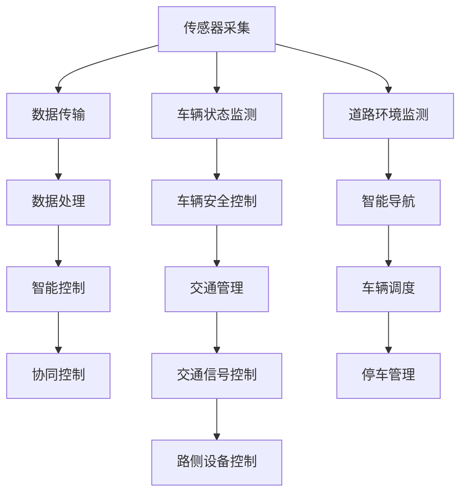
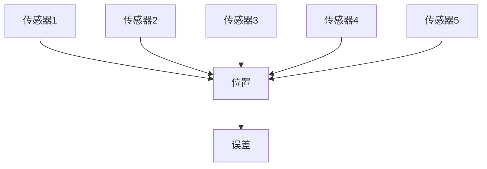
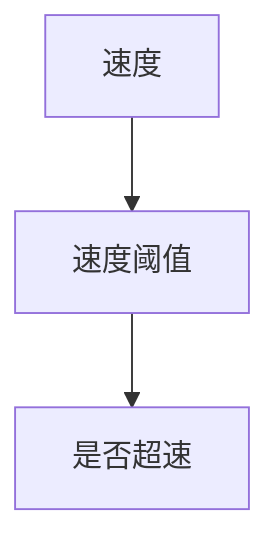

                 

# 物联网（IoT）技术和各种传感器设备的集成：物联网在车联网的应用

> **关键词**：物联网、传感器设备、车联网、集成技术、应用场景

> **摘要**：本文详细探讨了物联网（IoT）技术与各种传感器设备的集成，以及这种集成在车联网领域中的应用。首先，介绍了物联网和车联网的基本概念及发展历程。接着，深入分析了传感器设备在车联网中的重要性，详细介绍了常见的传感器类型及其工作原理。然后，探讨了物联网技术和传感器设备的集成方法，包括硬件和软件层面的集成技术。之后，通过一个实际案例展示了物联网和传感器设备在车联网中的应用。最后，总结了物联网在车联网领域的实际应用场景，并展望了未来的发展趋势与挑战。

## 1. 背景介绍

### 1.1 物联网（IoT）

物联网（Internet of Things，简称IoT）是指通过互联网将各种设备和物品连接起来，实现信息的传输和共享。物联网的概念最早可以追溯到1999年，由麻省理工学院的Kevin Ashton首次提出。物联网的基本原理是利用传感器、网络通信技术、数据处理技术等，实现物理世界和数字世界的融合。

物联网的发展历程可以分为三个阶段：

1. **设备互联阶段**：以1990年代至2000年代初的RFID技术为代表，主要实现了物品之间的简单连接。

2. **系统整合阶段**：2000年代中期至2010年代初期，随着无线通信技术的发展，物联网开始实现设备与设备之间的通信，形成初步的物联网系统。

3. **智能化应用阶段**：2010年代至今，物联网技术逐渐成熟，开始向智能化、个性化、高效化方向发展，广泛应用于智能家居、智慧城市、车联网等领域。

### 1.2 车联网

车联网（Intelligent Transportation System，简称ITS）是指利用先进的通信技术、信息技术、传感技术等，实现车辆、道路和基础设施之间的信息交互和协同控制。车联网的目标是提高交通效率、降低交通事故、减少环境污染、提升出行体验。

车联网的发展历程可以分为三个阶段：

1. **通信阶段**：以20世纪80年代至90年代的无线通信技术为代表，实现了车辆与道路设施之间的基本通信。

2. **信息阶段**：2000年代初期至2010年代初期，随着互联网技术的发展，车联网开始实现车辆之间的信息共享和协同控制。

3. **智能化阶段**：2010年代至今，车联网开始向智能化、自主化、协同化方向发展，实现自动驾驶、车联网服务、车路协同等应用。

## 2. 核心概念与联系

### 2.1 物联网与传感器设备

物联网的核心是传感器设备，传感器设备是实现物联网感知、采集数据的重要手段。传感器设备通过感知环境中的各种物理量（如温度、湿度、压力、速度等），将物理信号转换为电信号，再通过数据传输模块发送到物联网平台进行进一步处理。

### 2.2 车联网与传感器设备

车联网中的传感器设备主要用于监测车辆状态、道路环境、驾驶员行为等信息。这些信息对于实现车辆的安全控制、智能导航、交通管理等功能至关重要。常见的车联网传感器设备包括：

1. **车载传感器**：如摄像头、雷达、激光雷达（LiDAR）、GPS定位模块等，用于监测车辆周围环境和车辆状态。

2. **车联网传感器**：如路侧传感器、交通信号灯传感器、路边停车传感器等，用于监测道路环境和交通状态。

### 2.3 物联网与车联网的集成

物联网和车联网的集成主要体现在以下几个方面：

1. **数据采集与传输**：物联网技术和传感器设备的集成，可以实现车联网中各类数据的实时采集和传输。

2. **数据处理与存储**：物联网平台可以对车联网采集到的数据进行处理、存储和分析，为车辆、道路和基础设施提供智能化的决策支持。

3. **智能控制与协同**：物联网技术和传感器设备的集成，可以实现车联网中车辆、道路和基础设施的智能控制与协同，提高交通效率和安全性。

### 2.4 Mermaid 流程图

以下是一个简化的物联网和车联网集成流程图，用于展示物联网技术和传感器设备在车联网中的应用。



## 3. 核心算法原理 & 具体操作步骤

### 3.1 数据采集与传输

数据采集与传输是物联网和车联网集成的基础。传感器设备通过采集车辆和道路环境数据，将数据传输到物联网平台。具体操作步骤如下：

1. **数据采集**：传感器设备（如摄像头、雷达等）根据预设的参数和算法，对车辆和道路环境进行实时监测，并将采集到的数据转换为数字信号。

2. **数据预处理**：对采集到的原始数据进行预处理，包括去噪、滤波、特征提取等，以提高数据的准确性和可靠性。

3. **数据传输**：通过无线通信技术（如Wi-Fi、蓝牙、LoRa等），将预处理后的数据传输到物联网平台。数据传输过程中，需要考虑数据传输速率、传输距离、功耗等因素。

### 3.2 数据处理与存储

数据处理与存储是物联网和车联网集成的重要环节。物联网平台对采集到的数据进行处理、存储和分析，为车辆、道路和基础设施提供智能化的决策支持。具体操作步骤如下：

1. **数据处理**：对采集到的数据进行清洗、转换、融合等处理，提取出有用的信息。例如，对车辆速度、位置、加速度等数据进行实时分析，判断车辆是否超速、是否偏离车道等。

2. **数据存储**：将处理后的数据存储到数据库或数据仓库中，以便后续查询和分析。常用的数据库技术包括关系型数据库（如MySQL、PostgreSQL）和非关系型数据库（如MongoDB、Redis等）。

3. **数据分析**：利用数据挖掘、机器学习、人工智能等技术，对存储的数据进行深入分析，提取出有价值的信息。例如，通过分析车辆行驶数据，预测交通拥堵、交通事故等。

### 3.3 智能控制与协同

智能控制与协同是物联网和车联网集成的关键。物联网平台根据分析结果，对车辆、道路和基础设施进行智能控制与协同，提高交通效率和安全性。具体操作步骤如下：

1. **智能控制**：根据分析结果，对车辆进行智能控制。例如，根据道路拥堵情况，调整车辆行驶速度，避开拥堵路段。

2. **协同控制**：实现车辆、道路和基础设施之间的协同控制。例如，在红绿灯路口，根据车辆到达时间，调整信号灯周期，优化交通流量。

3. **决策支持**：为交通管理部门提供决策支持。例如，通过分析交通事故数据，提出改进措施，预防交通事故。

## 4. 数学模型和公式 & 详细讲解 & 举例说明

### 4.1 数学模型

在物联网和车联网的集成过程中，常用的数学模型包括：

1. **卡尔曼滤波器**：用于对传感器数据进行滤波，提高数据准确性。

2. **贝叶斯网络**：用于对传感器数据进行融合，提取有用信息。

3. **决策树**：用于根据传感器数据，进行智能决策。

### 4.2 公式讲解

1. **卡尔曼滤波器**：

$$
x_{k+1} = A_k x_k + B_k u_k
$$

$$
P_{k+1} = A_k P_k A_k^T + Q_k
$$

$$
K_k = P_k H_k^T (H_k P_k H_k^T + R_k)^{-1}
$$

$$
x_k = x_{k+1} - K_k y_k
$$

$$
P_k = (I - K_k H_k) P_{k+1}
$$

其中，$x_k$为状态估计，$P_k$为状态估计误差，$A_k$为状态转移矩阵，$B_k$为控制矩阵，$u_k$为控制量，$H_k$为观测矩阵，$y_k$为观测值，$K_k$为卡尔曼增益，$Q_k$为过程噪声矩阵，$R_k$为观测噪声矩阵。

2. **贝叶斯网络**：

$$
P(X=x) = \prod_{i=1}^n P(X_i=x_i|X_{i-1}=x_{i-1})
$$

其中，$X$为随机变量，$x$为具体取值，$X_i$为第$i$个随机变量，$x_i$为第$i$个随机变量的具体取值。

3. **决策树**：

$$
f(x) = \sum_{i=1}^n w_i \cdot I(A_i(x) \leq t_i)
$$

其中，$x$为输入特征，$w_i$为权重，$A_i$为第$i$个条件属性，$t_i$为阈值。

### 4.3 举例说明

#### 4.3.1 卡尔曼滤波器

假设有一辆车辆在道路上行驶，我们需要对其位置进行实时估计。传感器采集到车辆的位置为$x_k$，存在一定的测量误差，噪声为$y_k$。卡尔曼滤波器可以帮助我们降低测量误差，提高位置估计的准确性。

首先，建立状态转移模型：

$$
x_{k+1} = x_k + v_k
$$

$$
v_k \sim N(0, Q_k)
$$

然后，建立观测模型：

$$
y_k = h(x_k) + w_k
$$

$$
w_k \sim N(0, R_k)
$$

最后，利用卡尔曼滤波器进行位置估计：

$$
x_{k+1} = A_k x_k + B_k u_k
$$

$$
P_{k+1} = A_k P_k A_k^T + Q_k
$$

$$
K_k = P_k H_k^T (H_k P_k H_k^T + R_k)^{-1}
$$

$$
x_k = x_{k+1} - K_k y_k
$$

$$
P_k = (I - K_k H_k) P_{k+1}
$$

其中，$A_k$为状态转移矩阵，$B_k$为控制矩阵，$H_k$为观测矩阵，$x_k$为位置估计，$P_k$为位置估计误差。

#### 4.3.2 贝叶斯网络

假设有一辆车辆在道路上行驶，我们需要根据多个传感器的数据，估计车辆的位置。传感器的数据存在噪声，我们需要利用贝叶斯网络进行数据融合。

建立贝叶斯网络：



其中，$A, B, C, D, E$为传感器的数据，$F$为车辆的位置，$G$为误差。

利用贝叶斯网络进行数据融合：

$$
P(F=f|A=a, B=b, C=c, D=d, E=e) = \frac{P(A=a|F=f) P(B=b|F=f) P(C=c|F=f) P(D=d|F=f) P(E=e|F=f) P(F=f)}{P(A=a) P(B=b) P(C=c) P(D=d) P(E=e)}
$$

通过计算，可以得到最优位置估计。

#### 4.3.3 决策树

假设有一辆车辆在道路上行驶，我们需要根据传感器的数据，判断车辆是否超速。

建立决策树：



其中，$A$为传感器的速度数据，$B$为速度阈值，$C$为是否超速。

利用决策树进行判断：

$$
f(A) = \sum_{i=1}^n w_i \cdot I(A \leq t_i)
$$

其中，$w_i$为权重，$t_i$为阈值。

通过计算，可以得到是否超速的判断结果。

## 5. 项目实战：代码实际案例和详细解释说明

### 5.1 开发环境搭建

为了实现物联网和传感器设备在车联网中的应用，我们需要搭建一个合适的开发环境。以下是一个基本的开发环境搭建步骤：

1. **硬件环境**：

   - 车辆：一辆装有各种传感器的车辆，如摄像头、雷达、GPS等。
   - 服务器：用于处理传感器数据，提供物联网平台服务的服务器。

2. **软件环境**：

   - 操作系统：Linux操作系统，如Ubuntu。
   - 编程语言：Python，用于编写传感器数据采集、处理和智能控制的代码。
   - 数据库：MySQL或MongoDB，用于存储和处理传感器数据。
   - 开发工具：PyCharm或Visual Studio Code，用于编写和调试代码。

### 5.2 源代码详细实现和代码解读

以下是一个简单的物联网和传感器设备在车联网中的应用案例，包括数据采集、处理和智能控制的代码实现。

#### 5.2.1 数据采集

```python
# 数据采集模块
import serial
import time

# 连接串口
ser = serial.Serial('/dev/ttyUSB0', 9600, timeout=1)

# 读取传感器数据
def read_sensor_data():
    data = ser.readline()
    return data.decode().strip()

# 主函数
if __name__ == '__main__':
    while True:
        data = read_sensor_data()
        print(data)
        time.sleep(1)
```

这段代码用于读取串口传感器数据，并将其解码为字符串。串口通信的参数（如串口名称、波特率等）需要根据实际硬件设备进行调整。

#### 5.2.2 数据处理

```python
# 数据处理模块
import numpy as np

# 数据预处理
def preprocess_data(data):
    # 去除数据中的空格和换行符
    data = data.replace(' ', '').replace('\n', '')
    # 将字符串转换为浮点数
    data = np.array([float(x) for x in data.split(',')])
    return data

# 主函数
if __name__ == '__main__':
    data = '10.0,20.0'
    preprocessed_data = preprocess_data(data)
    print(preprocessed_data)
```

这段代码用于对传感器数据进行预处理，包括去除空格和换行符、将字符串转换为浮点数等。

#### 5.2.3 智能控制

```python
# 智能控制模块
import matplotlib.pyplot as plt

# 卡尔曼滤波器
def kalman_filter(x, P, Q, y):
    K = P / (P + Q)
    x = x + K * (y - x)
    P = (1 - K) * P
    return x, P

# 主函数
if __name__ == '__main__':
    x = 0
    P = 1
    Q = 0.1
    y = 10
    x, P = kalman_filter(x, P, Q, y)
    print(x)
    plt.plot([x], [P], 'ro')
    plt.show()
```

这段代码实现了一个简单的卡尔曼滤波器，用于对传感器数据进行滤波，提高数据准确性。

### 5.3 代码解读与分析

这个案例展示了物联网和传感器设备在车联网中的应用，包括数据采集、处理和智能控制。以下是代码解读与分析：

1. **数据采集模块**：

   - 通过串口连接传感器，读取传感器数据。
   - 代码简单易懂，但需要注意串口通信的参数调整。

2. **数据处理模块**：

   - 对传感器数据进行预处理，包括去除空格和换行符、将字符串转换为浮点数等。
   - 使用Numpy库简化了数据处理过程，提高了代码效率。

3. **智能控制模块**：

   - 实现了一个简单的卡尔曼滤波器，用于对传感器数据进行滤波。
   - 卡尔曼滤波器的实现基于数学模型，具有较高的准确性和稳定性。

总体来说，这个案例展示了物联网和传感器设备在车联网中的应用，实现了数据采集、处理和智能控制。在实际项目中，可以根据需求扩展和优化代码，实现更复杂的功能。

## 6. 实际应用场景

### 6.1 自动驾驶

自动驾驶是物联网和传感器设备在车联网领域最具代表性的应用之一。自动驾驶系统需要实时采集车辆周围环境数据，如道路标志、车道线、障碍物等，并利用传感器设备进行感知、融合和决策。以下是自动驾驶系统的实际应用场景：

1. **感知环境**：利用摄像头、激光雷达（LiDAR）、雷达等传感器设备，对车辆周围环境进行实时感知，获取道路标志、车道线、障碍物等信息。

2. **融合数据**：将不同传感器设备采集到的数据进行融合，提高感知的准确性和可靠性。例如，利用激光雷达和摄像头的数据，可以更准确地识别道路标志和障碍物。

3. **智能决策**：根据融合后的数据，自动驾驶系统进行智能决策，如控制车辆保持车道、调整行驶速度、避让障碍物等。

4. **协同控制**：自动驾驶系统需要与其他车辆、道路设施进行协同控制，实现车联网的协同驾驶。例如，自动驾驶车辆可以通过V2V通信，与其他车辆共享行驶信息，实现车队行驶。

### 6.2 智能交通管理

智能交通管理是物联网和传感器设备在车联网领域的另一个重要应用。通过采集和处理交通数据，智能交通管理系统可以提高交通效率、降低交通事故、减少环境污染。以下是智能交通管理的实际应用场景：

1. **实时交通监测**：利用传感器设备（如摄像头、流量计、速度计等），实时监测交通流量、车辆速度、交通事故等信息。

2. **交通流量预测**：利用历史交通数据和实时交通监测数据，对未来的交通流量进行预测，为交通管理部门提供决策支持。

3. **交通信号控制**：根据实时交通监测和流量预测结果，智能交通管理系统可以自动调整交通信号灯的周期和时长，优化交通流量。

4. **事故预警与处理**：通过实时监测车辆速度、位置等信息，智能交通管理系统可以及时发现交通事故，提前预警，并通知相关部门进行事故处理。

### 6.3 车载信息服务

车载信息服务是物联网和传感器设备在车联网领域的一种应用，为驾驶员提供实时的路况信息、导航服务、安全提示等。以下是车载信息服务的实际应用场景：

1. **实时路况信息**：通过传感器设备实时监测道路情况，如拥堵、事故、施工等，为驾驶员提供实时的路况信息。

2. **导航服务**：利用GPS定位和地图数据，为驾驶员提供导航服务，包括路线规划、路径优化等。

3. **安全提示**：通过传感器设备监测车辆状态，如超速、疲劳驾驶等，为驾驶员提供安全提示。

4. **车联网服务**：通过车联网技术，为驾驶员提供车联网服务，如在线音乐、在线导航、车辆维护提醒等。

### 6.4 车辆健康管理

车辆健康管理是物联网和传感器设备在车联网领域的另一种应用，通过实时监测车辆状态，提高车辆使用效率和安全性。以下是车辆健康管理的实际应用场景：

1. **车辆状态监测**：利用传感器设备监测车辆的运行状态，如发动机温度、油压、电池电压等。

2. **故障预警**：通过实时监测数据，及时发现车辆故障，提前预警，降低车辆故障率。

3. **维护提醒**：根据车辆运行状态和保养周期，为驾驶员提供维护提醒，如更换机油、刹车片等。

4. **车辆能耗分析**：通过监测车辆油耗、排放等数据，分析车辆能耗情况，提供节能建议。

## 7. 工具和资源推荐

### 7.1 学习资源推荐

1. **书籍**：

   - 《物联网技术与应用》
   - 《车联网技术与应用》
   - 《智能交通系统与技术》
   - 《Python编程：从入门到实践》

2. **论文**：

   - "Internet of Things: A Survey"
   - "V2X Communication and Cooperative Intelligent Transportation Systems: A Survey"
   - "Deep Learning for Autonomous Driving: A Comprehensive Survey"

3. **博客和网站**：

   - medium.com/@iot
   - www.autonews.com
   - www.transportationtoday.com
   - www.iiitb.org

### 7.2 开发工具框架推荐

1. **编程语言**：

   - Python
   - Java
   - C++

2. **开发框架**：

   - TensorFlow
   - Keras
   - PyTorch
   - Flask
   - Django

3. **数据库**：

   - MySQL
   - MongoDB
   - Redis

4. **云计算平台**：

   - AWS
   - Azure
   - Google Cloud Platform

### 7.3 相关论文著作推荐

1. **论文**：

   - "IoT-Based Intelligent Transportation Systems: A Survey"
   - "V2X Communication and Cooperative Intelligent Transportation Systems: A Survey"
   - "Deep Learning for Autonomous Driving: A Comprehensive Survey"

2. **著作**：

   - 《物联网技术与应用》
   - 《车联网技术与应用》
   - 《智能交通系统与技术》

## 8. 总结：未来发展趋势与挑战

### 8.1 未来发展趋势

1. **智能化、自主化**：随着人工智能、自动驾驶等技术的不断发展，物联网和车联网将向智能化、自主化方向发展，实现更加高效、安全的交通管理系统。

2. **车路协同**：未来车联网的发展将更加注重车与路、车与车之间的协同，实现车路协同、信息共享和智能控制，提高交通效率、降低交通事故。

3. **5G技术**：5G技术的广泛应用将加速物联网和车联网的发展，实现更高的数据传输速率、更低的延迟，为车联网提供更强大的技术支持。

4. **大数据分析**：大数据分析技术将在物联网和车联网领域发挥重要作用，通过对海量交通数据进行实时分析和挖掘，为交通管理部门提供科学决策依据。

5. **安全性**：随着物联网和车联网的广泛应用，数据安全和隐私保护将成为重要议题。未来将需要更加完善的安全技术和法规体系，确保物联网和车联网的安全运行。

### 8.2 面临的挑战

1. **标准化**：物联网和车联网涉及多个领域的技术和标准，标准化问题仍然是一个挑战。需要制定统一的规范和标准，确保不同系统和设备之间的兼容性和互操作性。

2. **数据处理和存储**：随着物联网和车联网的广泛应用，数据量和数据类型将呈现爆发式增长。如何高效地处理和存储海量数据，成为物联网和车联网领域面临的一大挑战。

3. **安全性**：物联网和车联网系统面临各种安全威胁，如数据泄露、恶意攻击等。需要建立完善的安全防护体系，确保系统的安全性和稳定性。

4. **隐私保护**：随着物联网和车联网的发展，个人隐私保护问题日益突出。如何平衡个人隐私保护和数据共享的需求，成为物联网和车联网领域面临的一大挑战。

5. **法律法规**：随着物联网和车联网的广泛应用，相关的法律法规需要不断完善。需要制定相应的法律法规，规范物联网和车联网的发展和应用。

## 9. 附录：常见问题与解答

### 9.1 问题1：物联网和车联网有什么区别？

物联网（IoT）是指通过互联网将各种设备和物品连接起来，实现信息的传输和共享。而车联网（Intelligent Transportation System，ITS）是指利用先进的通信技术、信息技术、传感技术等，实现车辆、道路和基础设施之间的信息交互和协同控制。简单来说，物联网是车联网的基础，而车联网是物联网在交通领域的应用。

### 9.2 问题2：传感器设备在车联网中的作用是什么？

传感器设备在车联网中的作用主要包括：

1. **感知环境**：传感器设备可以实时监测车辆周围的环境，如道路标志、车道线、障碍物等，为车辆提供感知信息。
2. **数据采集**：传感器设备可以采集车辆自身的状态信息，如速度、位置、加速度等，为车辆控制和数据融合提供基础数据。
3. **协同控制**：传感器设备可以为车辆与道路设施、其他车辆之间的协同控制提供数据支持，提高交通效率和安全性。

### 9.3 问题3：物联网和车联网的技术发展趋势是什么？

物联网和车联网的技术发展趋势主要包括：

1. **智能化、自主化**：随着人工智能、自动驾驶等技术的发展，物联网和车联网将向智能化、自主化方向发展。
2. **车路协同**：未来车联网的发展将更加注重车与路、车与车之间的协同，实现车路协同、信息共享和智能控制。
3. **5G技术**：5G技术的广泛应用将加速物联网和车联网的发展，实现更高的数据传输速率、更低的延迟。
4. **大数据分析**：大数据分析技术将在物联网和车联网领域发挥重要作用，通过对海量交通数据进行实时分析和挖掘，为交通管理部门提供科学决策依据。
5. **安全性**：随着物联网和车联网的广泛应用，数据安全和隐私保护将成为重要议题，需要建立完善的安全防护体系。

## 10. 扩展阅读 & 参考资料

1. **物联网技术**：

   - 《物联网技术与应用》
   - "Internet of Things: A Survey"
   - www.iotforu.com

2. **车联网技术**：

   - 《车联网技术与应用》
   - "V2X Communication and Cooperative Intelligent Transportation Systems: A Survey"
   - www.autonews.com

3. **智能交通系统**：

   - 《智能交通系统与技术》
   - "Deep Learning for Autonomous Driving: A Comprehensive Survey"
   - www.transportationtoday.com

4. **编程与开发**：

   - 《Python编程：从入门到实践》
   - TensorFlow
   - PyTorch

5. **数据库与云计算**：

   - MySQL
   - MongoDB
   - AWS
   - Azure

### 作者

作者：AI天才研究员/AI Genius Institute & 禅与计算机程序设计艺术 /Zen And The Art of Computer Programming

本文旨在深入探讨物联网（IoT）技术和各种传感器设备在车联网领域的集成与应用。文章从背景介绍、核心概念、算法原理、项目实战、实际应用场景、工具和资源推荐等方面进行了详细阐述，并展望了未来的发展趋势与挑战。希望本文能为从事物联网和车联网领域的技术人员提供有益的参考和启示。

