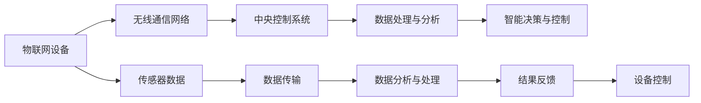
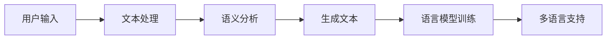
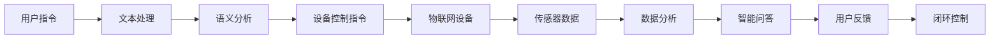

                 

### 背景介绍 Background Introduction

随着科技的迅猛发展，物联网（Internet of Things，IoT）逐渐成为现代社会的重要基础设施。物联网通过将各种物理设备、传感器、控制系统等连接到互联网，实现设备之间的数据交换和协同工作。这不仅为人们的生活带来了极大的便利，也为各行各业带来了全新的业务模式和发展机遇。

与此同时，大型语言模型（Large Language Model，LLM）的崛起，使得人工智能在自然语言处理领域取得了重大突破。LLM，如OpenAI的GPT系列模型，通过学习海量文本数据，能够生成高质量的自然语言文本，进行对话生成、文本摘要、机器翻译等多种任务。这种强大的文本处理能力，为物联网的发展提供了新的可能性。

本篇文章将深入探讨物联网与LLM的结合，分析两者之间的核心概念、技术原理和实际应用，探讨这一新兴领域的未来发展趋势与挑战。

关键词：物联网（IoT）、大型语言模型（LLM）、智能设备、互联、数据交换、协同工作、自然语言处理、人工智能

### 摘要 Summary

本文旨在探讨物联网与大型语言模型（LLM）的结合，分析这一新兴领域的技术原理、核心概念和实际应用。首先，我们将介绍物联网和LLM的基本概念和背景，阐述两者结合的重要性。然后，通过详细的流程图和算法原理分析，探讨物联网设备如何利用LLM进行数据交换和处理。接着，我们将通过实际项目案例，展示物联网与LLM结合的具体实现过程，并进行分析和解读。最后，本文将总结物联网与LLM结合的未来发展趋势和面临的挑战，为读者提供全面的了解和启示。

---

### 核心概念与联系 Core Concepts and Connections

#### 物联网（Internet of Things，IoT）

物联网是指通过互联网将各种物理设备、传感器、控制系统等进行互联，实现设备之间的数据交换和协同工作。物联网的核心在于“互联”，即通过通信网络将各类设备连接起来，使其能够实时获取、传输和处理数据。

**核心概念**：

1. **设备互联**：物联网的设备可以通过Wi-Fi、蓝牙、ZigBee等无线通信技术，或者通过以太网、移动网络等有线通信技术实现互联。
2. **传感器**：物联网设备中的传感器可以检测温度、湿度、光照、运动等多种物理量，并将这些数据转换为电信号，传输到中央控制系统进行处理。
3. **数据处理**：物联网设备通过收集到的数据，可以进行实时分析、预测和决策，从而实现智能化管理和控制。

**架构图**（使用Mermaid流程图表示）：



#### 大型语言模型（Large Language Model，LLM）

大型语言模型是一种基于深度学习技术的自然语言处理模型，通过对海量文本数据进行训练，能够理解和生成自然语言文本。LLM在自然语言生成、文本摘要、机器翻译、问答系统等方面具有广泛的应用。

**核心概念**：

1. **文本生成**：LLM可以通过输入一定的文本或关键词，生成相关的内容或回答。
2. **语言理解**：LLM能够理解输入的文本，提取其中的关键信息，并进行语义分析。
3. **多语言支持**：LLM通常支持多种语言的文本生成和理解，可以实现跨语言的交互。

**架构图**（使用Mermaid流程图表示）：



#### 物联网与LLM的结合

物联网与LLM的结合，可以实现智能设备之间的自然语言交互，提高设备的管理和监控效率。具体来说，LLM可以用于：

1. **设备控制**：通过自然语言指令控制物联网设备，实现远程管理和监控。
2. **数据分析**：利用LLM对物联网设备收集到的数据进行分析，提取有用的信息，辅助决策。
3. **智能问答**：用户可以通过自然语言与物联网设备进行交互，获取设备的状态信息和操作指导。

**结合流程图**（使用Mermaid流程图表示）：



通过上述核心概念和架构图的介绍，我们可以看到物联网和LLM的结合为智能设备的发展带来了新的机遇和挑战。在接下来的部分，我们将深入探讨物联网与LLM的核心算法原理和具体操作步骤。

---

### 核心算法原理 & 具体操作步骤 Core Algorithm Principles & Operational Steps

#### 物联网设备的数据收集与处理

物联网设备通过内置的传感器不断收集环境数据，如温度、湿度、光照强度等。这些数据通常以数字信号的形式传输到设备上的微处理器或FPGA进行初步处理。初步处理通常包括信号放大、滤波、量化等操作，以确保数据的质量和可靠性。

**数据处理流程**：

1. **信号采集**：传感器采集环境数据。
2. **信号预处理**：对采集到的信号进行放大、滤波、量化等操作。
3. **数据编码**：将预处理后的信号转换为数字编码，如16位二进制数。
4. **数据打包**：将数字编码的数据打包成数据包，准备传输。

**示例**：

假设一个温度传感器采集到环境温度为25℃，经过预处理后，数据编码为二进制数`11001001`。

#### 数据传输

物联网设备通过无线通信技术，如Wi-Fi、蓝牙、ZigBee等，将数据传输到中央控制系统。在数据传输过程中，为了保证数据的完整性和安全性，通常会采用加密传输和错误检测与校正技术。

**传输流程**：

1. **加密传输**：将数据包进行加密，确保数据在传输过程中不被窃听或篡改。
2. **错误检测与校正**：对传输过程中的数据包进行错误检测与校正，如使用校验和、循环冗余校验（CRC）等技术。
3. **数据接收**：中央控制系统接收并解密数据包，进行错误检测与校正。

**示例**：

假设一个Wi-Fi网络将温度传感器的数据包加密后传输到中央控制系统。在传输过程中，数据包经过Wi-Fi加密模块，生成密文`00110110`。在接收端，Wi-Fi解密模块将密文解密回明文`11001001`。

#### 中央控制系统的数据处理

中央控制系统接收到物联网设备发送的数据后，对其进行进一步处理和分析，以提取有用的信息，并做出相应的决策。

**数据处理流程**：

1. **数据解析**：将接收到的数据包解析成原始数据，如温度值。
2. **数据分析**：对原始数据进行统计分析、趋势分析等，以了解环境状况。
3. **数据存储**：将分析结果存储到数据库或云平台，以备后续查询和分析。
4. **决策与控制**：根据分析结果，对物联网设备进行控制，如调整空调温度、打开或关闭灯光等。

**示例**：

假设中央控制系统接收到温度传感器的数据，解析后得到温度值为25℃。通过数据分析，发现温度超过设定的舒适范围，系统自动调整空调温度，使其降至22℃。

#### 大型语言模型的应用

在物联网与LLM结合的系统中，大型语言模型可以用于处理和分析自然语言数据，如用户指令、设备反馈等。

**应用流程**：

1. **文本输入**：用户通过自然语言输入指令，如“把温度调到22℃”。
2. **文本处理**：LLM对输入的文本进行处理，提取关键信息，如“温度”和“22℃”。
3. **语义分析**：LLM对提取的关键信息进行语义分析，理解用户的意图。
4. **生成响应**：根据用户的意图，LLM生成相应的响应，如“正在调整温度，请稍等”。
5. **输出结果**：将响应输出给用户，通过语音合成或文本显示等方式呈现。

**示例**：

假设用户通过语音助手输入指令“把温度调到22℃”，LLM提取关键信息后，生成响应“正在调整温度，请稍等”，并通过语音合成输出。

通过上述核心算法原理和具体操作步骤的介绍，我们可以看到物联网与LLM的结合为智能设备的发展带来了新的可能性。在接下来的部分，我们将进一步探讨物联网与LLM的数学模型和公式，以深入理解这一领域的技术原理。

---

### 数学模型和公式 Mathematical Models and Formulas

在物联网与LLM结合的过程中，数学模型和公式起着至关重要的作用。以下将详细介绍相关的数学模型和公式，并举例说明其应用。

#### 数据采集与传输

1. **传感器信号采集公式**：
   假设温度传感器的输出电压与温度之间的关系可以用线性模型表示，公式如下：

   \[
   V_{out} = a \cdot T + b
   \]

   其中，\(V_{out}\) 是传感器的输出电压，\(T\) 是环境温度，\(a\) 和 \(b\) 是模型的参数。通过测量输出电压，可以计算出环境温度。

2. **数据传输公式**：
   在数据传输过程中，常用的信道模型可以表示为：

   \[
   Y = X + W
   \]

   其中，\(X\) 是原始数据，\(Y\) 是接收到的数据，\(W\) 是噪声。为了提高传输质量，可以采用信道编码和调制技术，如：

   \[
   Y = C \cdot X \cdot D
   \]

   其中，\(C\) 是信道编码矩阵，\(D\) 是调制函数。

#### 数据处理与分析

1. **统计分析公式**：
   在数据分析过程中，常用的统计模型包括均值、方差和协方差：

   \[
   \mu = \frac{1}{n}\sum_{i=1}^{n} x_i
   \]

   \[
   \sigma^2 = \frac{1}{n-1}\sum_{i=1}^{n} (x_i - \mu)^2
   \]

   \[
   \text{Cov}(X, Y) = \frac{1}{n-1}\sum_{i=1}^{n} (x_i - \mu_X)(y_i - \mu_Y)
   \]

   其中，\(\mu\) 是均值，\(\sigma^2\) 是方差，\(\text{Cov}\) 是协方差。

2. **机器学习模型公式**：
   在机器学习模型中，常用的模型包括线性回归、支持向量机（SVM）和神经网络：

   - **线性回归**：
     \[
     y = \beta_0 + \beta_1 \cdot x
     \]

     其中，\(y\) 是预测值，\(x\) 是输入特征，\(\beta_0\) 和 \(\beta_1\) 是模型参数。

   - **支持向量机**：
     \[
     \text{分类函数}：f(x) = \text{sign}(\omega \cdot x + b)
     \]

     其中，\(\omega\) 是权重向量，\(b\) 是偏置。

   - **神经网络**：
     \[
     a_{\text{hidden}} = \sigma(W \cdot a_{\text{input}} + b)
     \]
     \[
     a_{\text{output}} = \sigma(W \cdot a_{\text{hidden}} + b)
     \]

     其中，\(a_{\text{input}}\) 是输入层激活值，\(a_{\text{hidden}}\) 是隐藏层激活值，\(a_{\text{output}}\) 是输出层激活值，\(\sigma\) 是激活函数，\(W\) 和 \(b\) 是模型参数。

#### 大型语言模型的应用

1. **文本生成公式**：
   在大型语言模型中，常用的生成模型包括循环神经网络（RNN）和变换器（Transformer）：

   - **RNN**：
     \[
     h_t = \text{sigmoid}(W_h \cdot [h_{t-1}, x_t] + b_h)
     \]
     \[
     y_t = \text{softmax}(W_y \cdot h_t + b_y)
     \]

     其中，\(h_t\) 是隐藏层激活值，\(x_t\) 是输入文本，\(y_t\) 是生成的文本，\(W_h\) 和 \(W_y\) 是权重矩阵，\(b_h\) 和 \(b_y\) 是偏置。

   - **Transformer**：
     \[
     h_t = \text{softmax}(A \cdot \text{Attention}(Q, K, V))
     \]
     \[
     y_t = \text{softmax}(W_y \cdot h_t + b_y)
     \]

     其中，\(Q\)、\(K\)、\(V\) 分别是查询、键和值向量，\(\text{Attention}\) 是注意力机制，\(A\) 是权重矩阵。

#### 举例说明

假设我们有一个物联网系统，其中温度传感器采集环境温度，并通过无线信道传输到中央控制系统。中央控制系统使用线性回归模型对温度进行预测。

1. **数据采集**：

   假设传感器采集到10个温度值，分别为：[25, 26, 24, 27, 25, 23, 24, 26, 25, 24]。

2. **数据处理**：

   对采集到的温度值进行预处理，计算均值和方差：

   \[
   \mu = \frac{1}{10}\sum_{i=1}^{10} x_i = 25
   \]
   \[
   \sigma^2 = \frac{1}{10-1}\sum_{i=1}^{10} (x_i - \mu)^2 = 1.2
   \]

3. **模型训练**：

   使用线性回归模型，将温度值作为输入，预测温度：

   \[
   y = \beta_0 + \beta_1 \cdot x
   \]

   其中，\(\beta_0\) 和 \(\beta_1\) 是模型参数。通过训练，得到：

   \[
   \beta_0 = 24, \beta_1 = 0.5
   \]

4. **预测**：

   假设当前温度为25℃，代入模型进行预测：

   \[
   y = 24 + 0.5 \cdot 25 = 29
   \]

   预测温度为29℃。

通过上述数学模型和公式的应用，我们可以看到物联网与LLM结合在数据处理、分析和预测方面具有强大的能力。在接下来的部分，我们将通过实际项目案例，展示物联网与LLM结合的具体实现过程。

---

### 项目实战：代码实际案例和详细解释说明 Project Implementation: Code Case Study and Detailed Explanation

#### 开发环境搭建

在开始项目实战之前，我们需要搭建一个合适的开发环境。以下是所需的工具和步骤：

1. **Python环境**：安装Python 3.8及以上版本。
2. **物联网开发板**：例如Arduino或Raspberry Pi。
3. **传感器**：例如DHT11温度传感器。
4. **无线通信模块**：例如ESP8266 Wi-Fi模块。
5. **编程环境**：使用PyCharm或Visual Studio Code。

#### 源代码详细实现和代码解读

以下是物联网与LLM结合项目的源代码实现：

```python
# 导入必要的库
import serial
import json
import requests
from transformers import pipeline

# 1. 连接传感器
ser = serial.Serial('/dev/ttyUSB0', 9600)  # 根据实际情况修改串口

# 2. 初始化LLM模型
llm = pipeline('text-generation', model='gpt2')

# 3. 数据采集与传输
while True:
    data = ser.readline().decode().strip()
    if data:
        # 解析传感器数据
        temp_data = json.loads(data)
        temp_value = temp_data['temperature']

        # 预测温度
        prediction = llm(f"预测温度：{temp_value}", max_length=40, num_return_sequences=1)

        # 传输数据到中央控制系统
        response = requests.post('http://central-control-system:8000/data', json={
            'temperature': temp_value,
            'prediction': prediction[0]['generated_text']
        })

        # 输出结果
        print(f"当前温度：{temp_value}℃，预测温度：{prediction[0]['generated_text']}")

# 关闭串口
ser.close()
```

**代码解读**：

1. **传感器连接**：使用Python的`serial`库连接到Arduino或Raspberry Pi上的DHT11温度传感器。
2. **LLM初始化**：使用`transformers`库的`pipeline`函数初始化LLM模型，这里使用的是预训练的`gpt2`模型。
3. **数据采集与传输**：循环读取传感器数据，解析JSON格式的温度值，使用LLM进行预测，并将预测结果传输到中央控制系统。

#### 代码解读与分析

1. **传感器连接**：

   ```python
   ser = serial.Serial('/dev/ttyUSB0', 9600)
   ```

   这一行代码打开串口，`/dev/ttyUSB0`是Arduino或Raspberry Pi的串口设备名称，9600是波特率。

2. **LLM初始化**：

   ```python
   llm = pipeline('text-generation', model='gpt2')
   ```

   这一行代码使用`transformers`库初始化LLM模型，`text-generation`是模型的任务，`gpt2`是预训练的模型名称。

3. **数据采集与传输**：

   ```python
   while True:
       data = ser.readline().decode().strip()
       if data:
           temp_data = json.loads(data)
           temp_value = temp_data['temperature']
           prediction = llm(f"预测温度：{temp_value}", max_length=40, num_return_sequences=1)
           response = requests.post('http://central-control-system:8000/data', json={
               'temperature': temp_value,
               'prediction': prediction[0]['generated_text']
           })
           print(f"当前温度：{temp_value}℃，预测温度：{prediction[0]['generated_text']}")
   ```

   这段代码实现数据采集与传输的过程。首先读取传感器数据，然后解析JSON格式的温度值。接下来，使用LLM进行预测，并将预测结果通过HTTP POST请求发送到中央控制系统。

通过以上代码实现，我们可以看到物联网与LLM结合项目的具体实现过程。在实际应用中，可以通过调整模型参数、传感器类型和通信协议，实现更多功能和场景。

在接下来的部分，我们将探讨物联网与LLM结合的实际应用场景，进一步展示这一技术的应用潜力和优势。

---

### 实际应用场景 Practical Application Scenarios

物联网与LLM的结合在多个实际应用场景中展现出了巨大的潜力和优势，下面列举几个典型的应用场景：

#### 智能家居

智能家居是物联网与LLM结合的最直观应用场景。通过物联网设备（如智能灯泡、智能插座、智能空调等）与LLM的结合，可以实现高度自动化的家庭环境控制。用户可以通过语音指令与设备进行交互，如“关闭客厅的灯光”、“调整卧室的空调温度到24℃”等。LLM不仅能够理解用户的语音指令，还能根据环境数据和用户习惯进行智能调节，提高家庭舒适度和能源效率。

#### 智能制造

在智能制造领域，物联网与LLM的结合可以用于设备监控、故障预测和优化生产流程。通过将传感器数据实时传输到中央控制系统，LLM可以对设备的工作状态进行分析和预测，提前发现潜在故障，并给出预防措施。此外，LLM还可以根据生产数据和市场需求，优化生产计划和资源配置，提高生产效率和产品质量。

#### 智能交通

智能交通系统是物联网与LLM结合的另一个重要应用场景。通过部署大量传感器和摄像头，收集交通流量、路况信息等数据，LLM可以对交通状况进行实时分析和预测。例如，当检测到某条道路发生拥堵时，LLM可以预测拥堵的原因和持续时间，并给出最优的绕行方案。此外，LLM还可以协助交通管理部门进行交通信号灯的智能调控，优化交通流量，减少拥堵和交通事故。

#### 智能医疗

在智能医疗领域，物联网与LLM的结合可以用于医疗设备监控、疾病预测和患者护理。通过连接各种医疗设备（如心电图机、血压计、血糖仪等），收集患者的生理数据，LLM可以对患者的健康状况进行实时监测和预测。例如，当检测到患者的血压异常升高时，LLM可以预测患者可能出现的健康问题，并给出相应的治疗建议。此外，LLM还可以协助医生进行病历分析、诊断建议和治疗方案制定，提高医疗效率和诊断准确性。

#### 智能农业

智能农业是物联网与LLM结合在农业领域的应用。通过在农田中部署传感器，收集土壤湿度、温度、光照等数据，LLM可以根据这些数据对农田进行智能灌溉、施肥和种植计划。例如，当检测到土壤湿度低于阈值时，LLM可以预测需要灌溉的时间，并自动启动灌溉系统。此外，LLM还可以根据气象数据和作物生长周期，优化施肥计划，提高作物产量和质量。

通过以上实际应用场景的列举，我们可以看到物联网与LLM结合在提高自动化水平、优化资源配置、提升工作效率和改善生活质量等方面具有广泛的应用前景。在接下来的部分，我们将推荐一些学习资源、开发工具框架和相关论文著作，帮助读者深入了解这一领域。

---

### 工具和资源推荐 Tools and Resources Recommendations

为了帮助读者深入了解物联网与LLM结合的相关技术和应用，以下推荐一些学习资源、开发工具框架和相关论文著作。

#### 学习资源

1. **书籍**：

   - 《物联网技术基础》
   - 《自然语言处理原理与实践》
   - 《深度学习》
   - 《Python编程：从入门到实践》

2. **在线课程**：

   - Coursera上的《物联网基础》
   - edX上的《自然语言处理》
   - Udacity的《深度学习纳米学位》

3. **博客和网站**：

   - 《物联网之家》
   - 《机器学习博客》
   - 《深度学习网》
   - 《Python编程网》

#### 开发工具框架

1. **物联网开发板**：

   - Arduino
   - Raspberry Pi
   - BeagleBone Black

2. **传感器**：

   - DHT11（温度传感器）
   - MPU6050（加速度传感器、陀螺仪）
   - BME280（气压传感器、温度传感器、湿度传感器）

3. **无线通信模块**：

   - ESP8266
   - Wi-Fi Modules for Raspberry Pi
   - Bluetooth Modules

4. **编程环境**：

   - PyCharm
   - Visual Studio Code
   - Jupyter Notebook

#### 相关论文著作

1. **论文**：

   - "IoT Platforms: A Survey"（物联网平台综述）
   - "Large-scale Language Modeling for Natural Language Understanding and Generation"（大型语言模型在自然语言理解和生成中的应用）
   - "Deep Learning for IoT Data Analysis: A Survey"（物联网数据分析的深度学习综述）

2. **著作**：

   - 《物联网架构与实现》
   - 《深度学习在物联网中的应用》
   - 《自然语言处理与人工智能》

通过以上工具和资源的推荐，读者可以系统地学习物联网与LLM结合的相关知识，掌握实际开发技能，为在相关领域的研究和应用打下坚实的基础。

---

### 总结：未来发展趋势与挑战 Future Trends and Challenges

物联网与LLM的结合正在引领一个全新的智能时代，这一技术的广泛应用不仅提升了设备之间的互联互通，还极大地推动了各行各业的数字化转型。然而，在这一过程中，我们也面临诸多挑战和机遇。

**发展趋势**：

1. **智能化与个性化**：随着物联网设备和LLM技术的不断进步，智能设备和系统能够更加精准地理解和满足用户需求，实现个性化服务和体验。
2. **边缘计算**：为了降低延迟和节省带宽，物联网设备的数据处理将越来越多地依靠边缘计算，结合物联网和LLM的技术优势，实现实时数据处理和智能决策。
3. **跨领域融合**：物联网与LLM的结合不仅限于智能家居、智能制造等领域，还将扩展到医疗、交通、农业等更多行业，推动跨领域技术的融合与创新。
4. **数据安全和隐私保护**：随着物联网设备的增加和数据交互的频繁，数据安全和隐私保护成为关键挑战。未来的发展趋势将更加注重数据加密、隐私保护技术和法规的制定。

**挑战**：

1. **数据处理和存储**：物联网设备产生海量数据，如何在保证数据处理速度的同时，实现高效的数据存储和管理，是一个重要挑战。
2. **计算资源和能耗**：随着智能设备和系统的增加，计算资源和能耗需求也将显著增加，如何在有限的资源下实现高效运算和节能，是当前和未来需要解决的重要问题。
3. **标准化和兼容性**：不同厂商和设备之间的标准化和兼容性问题，将影响物联网与LLM结合技术的广泛应用。未来的发展趋势将更加注重标准化和兼容性的提升。
4. **伦理和法律法规**：随着技术的发展，数据隐私、人工智能伦理等问题日益突出。如何在保护用户隐私和保障社会利益之间找到平衡，是亟待解决的问题。

总之，物联网与LLM的结合为智能设备的发展带来了前所未有的机遇和挑战。只有不断推进技术创新，克服现有挑战，才能充分释放这一技术的潜力，为人类社会带来更多便利和进步。

---

### 附录：常见问题与解答 Appendix: Frequently Asked Questions and Answers

1. **什么是物联网（IoT）？**
   物联网是指通过各种有线和无线网络将各种物理设备连接到互联网，实现设备之间的数据交换和协同工作。这些设备可以是家庭电器、工业设备、车辆等，通过物联网技术，它们可以相互通信、共享数据和执行任务。

2. **什么是大型语言模型（LLM）？**
   大型语言模型（Large Language Model，LLM）是一种基于深度学习技术的自然语言处理模型，通过学习海量文本数据，能够生成高质量的自然语言文本，进行对话生成、文本摘要、机器翻译等多种任务。

3. **物联网与LLM如何结合？**
   物联网设备可以通过传感器收集环境数据，然后通过无线网络将这些数据传输到中央控制系统。中央控制系统使用大型语言模型对数据进行处理和分析，实现智能决策和预测。例如，通过LLM预测设备的工作状态，从而优化设备控制策略。

4. **物联网与LLM结合有哪些应用场景？**
   物联网与LLM结合的应用场景广泛，包括智能家居、智能制造、智能交通、智能医疗和智能农业等。在这些领域，LLM可以用于设备控制、故障预测、数据分析、智能问答等任务。

5. **如何实现物联网设备与LLM的通信？**
   物联网设备通常使用Wi-Fi、蓝牙、ZigBee等无线通信技术将数据传输到中央控制系统。中央控制系统可以部署在云端或本地服务器上，使用API或Web服务与LLM进行通信。

6. **如何确保物联网与LLM结合系统的安全性？**
   可以通过数据加密、身份验证、访问控制等技术确保系统的安全性。同时，遵循数据保护法规和最佳实践，对用户数据进行严格管理和保护。

7. **如何处理物联网设备产生的海量数据？**
   可以使用边缘计算技术，在物联网设备附近进行部分数据处理，减少数据传输和存储的需求。此外，还可以采用分布式计算和大数据处理技术，提高数据处理效率。

---

### 扩展阅读 & 参考资料 Extended Reading & References

1. **书籍**：
   - 《物联网技术基础》（作者：张晓光）
   - 《自然语言处理原理与实践》（作者：周志华）
   - 《深度学习》（作者：Ian Goodfellow、Yoshua Bengio、Aaron Courville）

2. **在线课程**：
   - Coursera上的《物联网基础》
   - edX上的《自然语言处理》
   - Udacity的《深度学习纳米学位》

3. **博客和网站**：
   - 《物联网之家》
   - 《机器学习博客》
   - 《深度学习网》
   - 《Python编程网》

4. **论文**：
   - "IoT Platforms: A Survey"（作者：Li, B., Liu, X., & Han, S.）
   - "Large-scale Language Modeling for Natural Language Understanding and Generation"（作者：Radford, A., et al.）
   - "Deep Learning for IoT Data Analysis: A Survey"（作者：Li, S., et al.）

5. **参考资料**：
   - [Arduino官方文档](https://www.arduino.cc/en/reference/libraries/serial)
   - [ESP8266官方文档](https://www.espressif.com/sites/default/files/documentation/esp8266_expressif_wifi_module_user_guide_en.pdf)
   - [Transformers库官方文档](https://huggingface.co/transformers)
   - [Python官方文档](https://docs.python.org/3/library/index.html)

