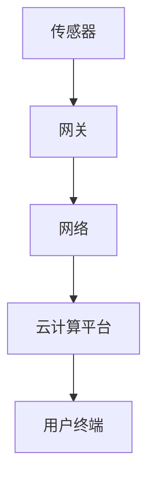

                 

# 物联网生态系统：从传感器到云端的全链路解析

> **关键词**：物联网，传感器，云计算，数据处理，网络安全，边缘计算
>
> **摘要**：本文将从传感器技术、网络通信、云计算、数据处理以及网络安全等方面，深入解析物联网生态系统的全链路，帮助读者全面了解物联网技术的发展与应用。

## 1. 背景介绍

物联网（Internet of Things，IoT）是指通过互联网将各种物品连接起来，实现信息交换和智能控制的技术。随着传感器技术的进步、无线通信技术的发展以及云计算的普及，物联网已经成为信息技术领域的一个重要发展方向。

### 物联网的发展历程

物联网的发展可以分为以下几个阶段：

- **第一阶段（1990s-2000s）**：以RFID（射频识别）技术和早期智能家居产品为代表，物联网的概念开始出现。
- **第二阶段（2010s）**：随着无线通信技术的成熟，物联网设备数量迅速增加，智能家居、工业物联网等领域逐渐成熟。
- **第三阶段（2020s至今）**：物联网与云计算、大数据、人工智能等技术的深度融合，推动物联网生态系统的全面发展。

### 物联网的重要性

物联网在现代社会中具有重要价值，主要体现在以下几个方面：

- **提高生产效率**：通过物联网技术，可以实现设备之间的互联互通，优化生产流程，降低生产成本。
- **改善生活质量**：智能家居、智能交通等物联网应用，为人们的生活带来便利和舒适。
- **促进可持续发展**：物联网技术可以帮助实现资源的优化配置，促进环保和可持续发展。

## 2. 核心概念与联系

### 2.1 物联网架构

物联网生态系统包括以下几个关键组成部分：

1. **传感器**：负责采集物理世界的各种信息，如温度、湿度、光线等。
2. **网关**：负责将传感器采集到的数据上传到云端，同时接收云端下发的控制指令。
3. **网络**：包括有线网络和无线网络，如Wi-Fi、蓝牙、LoRa等，用于数据传输。
4. **云计算平台**：负责处理和分析来自物联网设备的数据，提供各种服务和应用。
5. **用户终端**：包括个人计算机、智能手机等，用于与物联网系统进行交互。

### 2.2 核心概念原理

#### 传感器

传感器是物联网生态系统的基石，其基本原理是将物理信号转换为电信号，常见的传感器有：

- **温度传感器**：利用温度变化导致电阻、电容等物理量的变化，实现温度的测量。
- **湿度传感器**：通过测量空气中的水蒸气含量，实现湿度的监测。
- **光线传感器**：利用光电效应，将光信号转换为电信号，实现光线的测量。

#### 网关

网关是连接传感器和云计算平台的关键设备，其主要功能包括：

- **数据传输**：将传感器采集到的数据上传到云端，同时接收云端下发的控制指令。
- **协议转换**：处理不同传感器和不同网络之间的协议兼容问题。
- **数据处理**：对数据进行初步的过滤、清洗和压缩，提高数据传输效率。

#### 云计算平台

云计算平台负责处理和分析来自物联网设备的海量数据，其主要功能包括：

- **数据存储**：存储物联网设备采集到的原始数据和经过处理后的数据。
- **数据处理**：对数据进行清洗、转换、分析等操作，提供各种数据服务。
- **应用开发**：提供各种开发工具和平台，方便开发者构建物联网应用。

### 2.3 Mermaid 流程图



## 3. 核心算法原理 & 具体操作步骤

### 3.1 数据采集

传感器采集到的数据通常包括温度、湿度、光线、声音等物理量，这些数据需要通过模数转换（ADC）等模块转换为数字信号，然后通过网关上传到云计算平台。

### 3.2 数据传输

数据传输主要通过无线网络和有线网络实现，无线网络包括Wi-Fi、蓝牙、LoRa等，有线网络包括以太网、光纤等。为了保证数据传输的可靠性，可以采用以下技术：

- **数据加密**：使用SSL/TLS等加密协议，确保数据在传输过程中的安全性。
- **数据压缩**：对数据进行压缩，减少数据传输的带宽消耗。
- **数据校验**：使用校验和、哈希等算法对数据进行校验，确保数据传输的准确性。

### 3.3 数据处理

云计算平台对采集到的数据进行处理，主要包括以下步骤：

- **数据清洗**：去除重复数据、噪声数据等，确保数据质量。
- **数据转换**：将数据转换为统一的格式，便于后续处理和分析。
- **数据分析**：使用统计分析、机器学习等方法，对数据进行挖掘和分析，提取有价值的信息。

### 3.4 数据应用

处理后的数据可以应用于各种场景，如智能家居、智能交通、智能医疗等。具体应用步骤包括：

- **数据可视化**：使用图表、报表等工具，将数据以直观的方式展示出来。
- **智能决策**：利用数据分析结果，为用户提供智能化的建议和决策支持。

## 4. 数学模型和公式 & 详细讲解 & 举例说明

### 4.1 数据传输速率

数据传输速率是指单位时间内传输的数据量，通常用比特每秒（bps）表示。根据奈奎斯特定理，数据传输速率与信道的带宽和信噪比（SNR）之间存在以下关系：

$$
C = B \log_2(1 + SNR)
$$

其中，C表示数据传输速率（bps），B表示信道带宽（Hz），SNR表示信噪比（dB）。

### 4.2 数据压缩

数据压缩是指通过减少数据中的冗余信息，降低数据量，提高传输效率。常见的压缩算法包括：

- **无损压缩**：如Huffman编码、LZ77编码等，可以完全恢复原始数据。
- **有损压缩**：如JPEG、MP3等，无法完全恢复原始数据，但可以实现较高的压缩率。

### 4.3 数据挖掘

数据挖掘是指从大量数据中提取有价值的信息和知识。常用的数据挖掘方法包括：

- **关联规则挖掘**：如Apriori算法，用于发现数据之间的关联关系。
- **分类算法**：如K-近邻（KNN）、决策树等，用于对数据进行分类。
- **聚类算法**：如K-均值（K-Means）、层次聚类等，用于对数据进行聚类。

### 4.4 举例说明

假设我们有一个智能家居系统，其中包括温度传感器、湿度传感器和灯光传感器。我们希望实现以下功能：

1. 当温度高于30摄氏度时，自动开启空调。
2. 当湿度高于80%时，自动开启除湿机。
3. 当环境光线较弱时，自动开启灯光。

首先，我们需要对传感器采集到的数据进行处理，将其转换为数字信号，并通过网关上传到云计算平台。然后，云计算平台对数据进行清洗、转换和分析，提取出有价值的信息。最后，根据分析结果，向网关下发控制指令，实现智能家居的自动化控制。

## 5. 项目实战：代码实际案例和详细解释说明

### 5.1 开发环境搭建

为了实现智能家居系统的功能，我们需要搭建一个开发环境，包括以下步骤：

1. 安装物联网开发板，如ESP8266或ESP32。
2. 安装物联网开发平台，如Arduino IDE或PlatformIO。
3. 安装物联网相关库，如MQTT库、HTTP库等。

### 5.2 源代码详细实现和代码解读

以下是一个简单的智能家居系统示例代码，使用ESP8266开发板和Arduino IDE进行开发。

```cpp
#include <ESP8266WiFi.h>
#include <WiFiClient.h>
#include <MQTTClient.h>

// WiFi配置
const char* ssid = "your_ssid";
const char* password = "your_password";

// MQTT服务器配置
const char* mqtt_server = "your_mqtt_server";
int mqtt_port = 1883;

// MQTT客户端
WiFiClient net;
MQTTClient client(&net, mqtt_server, mqtt_port);

// 数据处理函数
void dataProcessing(float temperature, float humidity, int light) {
  if (temperature > 30) {
    // 开启空调
    Serial.println("空调开启");
  }
  if (humidity > 80) {
    // 开启除湿机
    Serial.println("除湿机开启");
  }
  if (light < 50) {
    // 开启灯光
    Serial.println("灯光开启");
  }
}

// 连接WiFi
void connectWiFi() {
  Serial.print("连接WiFi...");
  WiFi.begin(ssid, password);
  while (WiFi.status() != WL_CONNECTED) {
    delay(500);
    Serial.print(".");
  }
  Serial.println("WiFi连接成功");
}

// 连接MQTT服务器
void connectMQTT() {
  Serial.print("连接MQTT服务器...");
  client.connect();
  client.subscribe("home/sensor/data");
  Serial.println("MQTT服务器连接成功");
}

void setup() {
  Serial.begin(115200);
  connectWiFi();
  connectMQTT();
}

void loop() {
  client.loop();
  delay(10);
}
```

### 5.3 代码解读与分析

1. **WiFi配置**：设置WiFi的SSID和密码，用于连接无线网络。
2. **MQTT服务器配置**：设置MQTT服务器的地址和端口号，用于连接MQTT服务器。
3. **数据处理函数**：根据传感器采集到的数据，实现相应的控制逻辑。
4. **连接WiFi**：尝试连接WiFi网络，直到成功连接。
5. **连接MQTT服务器**：连接到MQTT服务器，并订阅传感器数据主题。
6. **主循环**：执行MQTT客户端的循环，处理来自MQTT服务器的消息。

通过以上代码，我们可以实现一个简单的智能家居系统，对温度、湿度和光线进行监测，并根据采集到的数据自动控制空调、除湿机和灯光。

## 6. 实际应用场景

### 6.1 智能家居

智能家居是物联网技术的典型应用场景，通过将各种设备连接到互联网，实现家庭生活的自动化和智能化。常见的智能家居设备包括智能插座、智能灯光、智能空调、智能门锁等。

### 6.2 智能交通

智能交通系统利用物联网技术，实现交通信息的实时监测和智能管理。通过传感器、摄像头等设备，收集道路上的车辆、行人、路况等信息，为交通管理部门提供决策支持，优化交通流量，提高交通安全。

### 6.3 智能农业

智能农业利用物联网技术，实现农作物的自动化管理和监测。通过传感器、无人机等设备，监测土壤湿度、温度、光照等环境参数，为农民提供种植决策支持，提高农业生产效率和农产品质量。

### 6.4 工业物联网

工业物联网（IIoT）将物联网技术应用于工业生产领域，实现设备之间的互联互通和智能控制。通过传感器、网关等设备，收集生产数据，进行实时监控、故障预警和优化生产流程，提高生产效率和产品质量。

## 7. 工具和资源推荐

### 7.1 学习资源推荐

- **书籍**：
  - 《物联网：概念、技术与应用》
  - 《智能家居：设计、实现与应用》
- **论文**：
  - "Smart Home: An Overview of Current Research and Applications"
  - "Internet of Things: A Survey"
- **博客**：
  - "MakerPro"
  - "Smart Home Blog"
- **网站**：
  - Arduino官网（[www.arduino.cc](https://www.arduino.cc/)）
  - MQTT官网（[mqtt.org](https://mqtt.org/)）

### 7.2 开发工具框架推荐

- **开发工具**：
  - Arduino IDE
  - PlatformIO
  - Visual Studio Code
- **框架**：
  - MQTT
  - CoAP
  - HTTP

### 7.3 相关论文著作推荐

- "Internet of Things: A Survey"（物联网：调查）
- "Smart Home: An Overview of Current Research and Applications"（智能家居：当前研究和应用概述）
- "Industrial Internet of Things: A Survey"（工业物联网：调查）

## 8. 总结：未来发展趋势与挑战

随着物联网技术的不断发展，未来物联网生态系统将呈现以下发展趋势：

1. **更广泛的应用场景**：物联网技术将渗透到更多的行业和领域，如医疗、教育、能源等。
2. **更高的连接密度**：随着传感器技术的进步，物联网设备的连接密度将进一步提高。
3. **更智能的数据处理**：物联网数据量巨大，未来数据处理将更加智能化，利用人工智能、大数据等技术，实现更高效的数据分析和应用。
4. **更安全的网络安全**：随着物联网设备的增多，网络安全问题将日益突出，需要加强物联网设备的加密、认证等技术，确保数据安全和设备安全。

然而，物联网生态系统也面临一些挑战：

1. **数据隐私和安全**：物联网设备涉及大量的个人隐私数据，如何确保数据安全和隐私保护是物联网发展的重要问题。
2. **标准化和兼容性**：物联网生态系统需要统一的标准和协议，以确保不同设备和系统之间的兼容性和互操作性。
3. **能耗和可持续性**：物联网设备数量庞大，如何降低能耗，实现可持续发展，是物联网发展的重要挑战。

## 9. 附录：常见问题与解答

### 9.1 物联网与互联网的区别是什么？

物联网是互联网的一种延伸，它将互联网从人与人之间扩展到人与物、物与物之间的连接。物联网强调的是物品之间的互联互通，而互联网则侧重于人与人之间的信息交换。

### 9.2 物联网的安全问题有哪些？

物联网的安全问题主要包括数据泄露、设备被攻击、恶意软件传播等。由于物联网设备数量庞大，且很多设备缺乏有效的安全防护措施，使得物联网系统面临较大的安全风险。

### 9.3 物联网的数据处理如何实现？

物联网的数据处理主要包括数据采集、传输、存储、分析和应用等环节。数据处理技术包括数据压缩、加密、清洗、挖掘等，通过这些技术，可以实现物联网数据的有效处理和应用。

## 10. 扩展阅读 & 参考资料

- "The Internet of Things: A Survey"（物联网：调查）
- "Smart Home: An Overview of Current Research and Applications"（智能家居：当前研究和应用概述）
- "Internet of Things: A Survey"（物联网：调查）
- "Industrial Internet of Things: A Survey"（工业物联网：调查）
- "Internet of Things Security: A Survey"（物联网安全：调查）

### 作者

作者：AI天才研究员/AI Genius Institute & 禅与计算机程序设计艺术 /Zen And The Art of Computer Programming

