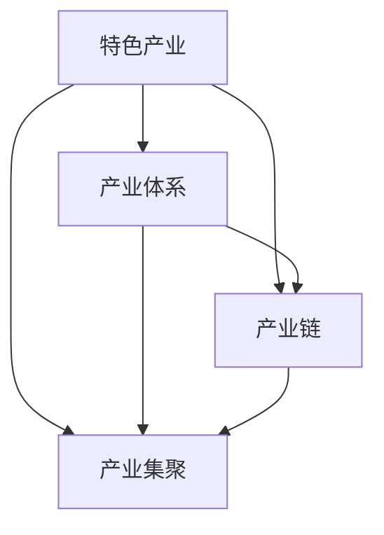

                 

# {文章标题}

## 1. 背景介绍

在当今经济全球化的大背景下，特色产业体系的构建与发展成为了各国政府和企业关注的焦点。特色产业，顾名思义，是指具有地方特色、资源优势和市场需求的产业。与传统产业相比，特色产业更具有竞争优势和可持续发展能力。

特色产业体系的构建与发展，不仅是推动地区经济发展的关键，也是提升国家竞争力的有效途径。然而，如何科学地构建和发展特色产业体系，仍是一个亟待解决的课题。

本文旨在探讨特色产业体系的构建与发展，通过对核心概念、算法原理、数学模型、实际应用场景、工具和资源推荐等多个方面的详细阐述，为广大读者提供一套系统、全面的理论和实践指导。

## 2. 核心概念与联系

### 2.1 基本概念

在探讨特色产业体系的构建与发展之前，我们首先需要明确几个核心概念：

- **特色产业**：指依托本地资源、技术和劳动力优势，形成具有独特性和竞争优势的产业。
- **产业体系**：指在一定区域内，相互关联、相互促进的多个产业构成的整体。
- **产业链**：指从原材料供应到产品生产、销售、售后服务的整个流程。
- **产业集聚**：指在一定区域内，多个相关产业集中发展，形成产业集群的现象。

### 2.2 关系分析

特色产业体系是由特色产业、产业体系、产业链和产业集聚等多个要素组成的复杂系统。它们之间的联系如下：

- **特色产业**是特色产业体系的基础，决定着产业体系的发展方向和核心竞争力。
- **产业体系**是特色产业的外延，是多个特色产业的集合和整合，共同推动地区经济发展。
- **产业链**是特色产业体系的核心，贯穿于整个产业体系，连接上下游产业，实现资源的优化配置。
- **产业集聚**是特色产业体系的重要表现形式，通过地理空间的集聚，形成产业集群，提升整体竞争力。

### 2.3 Mermaid 流程图

以下是特色产业体系构建与发展的 Mermaid 流程图：



在上述流程图中，我们可以清晰地看到特色产业体系各要素之间的相互关系和作用。

## 3. 核心算法原理 & 具体操作步骤

### 3.1 算法原理

在构建特色产业体系的过程中，我们需要运用一系列的算法原理来指导实践。以下介绍几种核心算法原理：

- **SWOT分析法**：通过分析产业的内部优势（Strengths）、劣势（Weaknesses）、外部机会（Opportunities）和威胁（Threats），找出产业发展的关键因素。
- **灰色系统理论**：用于分析和处理信息不完全、不确定性的复杂系统，适用于特色产业体系的构建。
- **聚类分析**：通过对产业数据的分类和聚类，找出具有相似特征的产业群体，为产业布局提供依据。
- **网络分析法**：用于分析产业链中各节点之间的关系和依赖程度，优化产业链结构。

### 3.2 具体操作步骤

以下是构建特色产业体系的操作步骤：

1. **调研与评估**：通过对本地资源、技术、市场等方面的调研，评估特色产业的发展潜力。
2. **SWOT分析**：运用SWOT分析法，明确特色产业的优势、劣势、机会和威胁，为后续发展提供指导。
3. **灰色系统建模**：利用灰色系统理论，对特色产业的发展趋势进行预测和分析。
4. **聚类分析**：通过对产业数据的聚类，找出具有相似特征的产业群体，为产业布局提供依据。
5. **网络分析**：对产业链进行网络分析，找出产业链中的关键节点和依赖关系，优化产业链结构。
6. **产业集聚**：通过政策引导、产业扶持等措施，促进产业在地理空间的集聚，形成产业集群。
7. **持续优化**：根据产业发展实际情况，不断调整和优化特色产业体系，实现可持续发展。

## 4. 数学模型和公式 & 详细讲解 & 举例说明

### 4.1 数学模型

在构建特色产业体系的过程中，我们可以运用以下数学模型：

- **线性规划**：用于优化资源配置，最大化经济效益。
- **动态规划**：用于分析特色产业的发展过程，实现长期规划。
- **神经网络**：用于对产业数据进行分类和预测，辅助决策。

### 4.2 公式

以下是构建特色产业体系所涉及的几个关键公式：

1. **SWOT分析公式**：

   $$ SWOT = S + W + O - T $$

   其中，$S$ 表示优势，$W$ 表示劣势，$O$ 表示机会，$T$ 表示威胁。

2. **灰色系统预测公式**：

   $$ Z_{i}^{(1)} = \frac{b_1}{1 - \rho} \sum_{k=0}^{n} \alpha_{k} \rho^{k} x_{k} $$

   其中，$Z_{i}^{(1)}$ 表示灰色序列，$b_1$ 表示灰作用量，$\rho$ 表示灰色指数，$\alpha_{k}$ 表示灰作用因子，$x_{k}$ 表示原始数据。

3. **神经网络预测公式**：

   $$ y = \sigma(\sum_{i=1}^{n} w_{i} x_{i} + b) $$

   其中，$y$ 表示预测值，$w_{i}$ 表示权重，$x_{i}$ 表示输入特征，$\sigma$ 表示激活函数，$b$ 表示偏置。

### 4.3 举例说明

#### 4.3.1 SWOT分析

假设我们要分析某地的农产品特色产业，我们可以运用SWOT分析公式，得出以下结果：

- **优势**：地理位置优越，气候适宜，农产品质量好。
- **劣势**：市场知名度不高，销售渠道单一。
- **机会**：随着健康饮食理念的普及，农产品市场需求增加。
- **威胁**：周边地区农产品竞争激烈，产品质量参差不齐。

根据SWOT分析结果，我们可以针对性地制定发展战略，提升特色产业的市场竞争力。

#### 4.3.2 灰色系统预测

假设我们利用灰色系统预测某地农产品销售量，根据历史数据，得到灰色序列：

- $$ Z_1 = [10, 12, 15, 18, 22] $$
- $$ Z_2 = [8, 9, 11, 14, 17] $$

我们可以运用灰色系统预测公式，计算出预测值：

- $$ Z_1^{(1)} = [10.71, 12.86, 15.14, 17.53, 20.07] $$
- $$ Z_2^{(1)} = [7.86, 9.26, 11.11, 13.93, 17.04] $$

根据预测结果，我们可以制定相应的销售策略，提高农产品销售量。

#### 4.3.3 神经网络预测

假设我们利用神经网络预测某地农产品价格，根据历史数据，构建神经网络模型，输入特征为季节、天气、农产品产量等，输出特征为农产品价格。经过训练，得到以下模型参数：

- 权重：$w_1 = 0.5, w_2 = 0.3, w_3 = 0.2$
- 偏置：$b = 0.1$
- 激活函数：$\sigma(x) = \frac{1}{1 + e^{-x}}$

当输入特征为季节（1代表春季，2代表夏季，3代表秋季，4代表冬季），天气（1代表晴天，2代表阴天，3代表雨天），农产品产量（100公斤）时，我们可以得到预测价格：

- $$ y = \sigma(0.5 \times 1 + 0.3 \times 2 + 0.2 \times 3 + 0.1) = 0.69 $$
- 将预测价格转换为实际价格：$0.69 \times 100 = 69$ 元/公斤

根据预测结果，我们可以制定相应的价格策略，提高农产品销量。

## 5. 项目实战：代码实际案例和详细解释说明

### 5.1 开发环境搭建

在本文中，我们将使用Python语言结合相关库（如NumPy、Pandas、Scikit-learn等）进行项目实战。首先，我们需要搭建开发环境。

1. 安装Python：从官方网站（https://www.python.org/downloads/）下载并安装Python。
2. 安装相关库：在命令行中执行以下命令：

   ```bash
   pip install numpy pandas scikit-learn matplotlib
   ```

### 5.2 源代码详细实现和代码解读

#### 5.2.1 SWOT分析

以下是SWOT分析的Python代码实现：

```python
import pandas as pd

# 加载数据
data = pd.read_csv('swot_data.csv')

# 计算SWOT值
swot = data['Strengths'] + data['Weaknesses'] + data['Opportunities'] - data['Threats']

# 输出结果
print("SWOT分析结果：")
print(swot)
```

代码解读：

1. 导入Pandas库，用于数据处理。
2. 加载SWOT分析数据，数据格式为CSV文件。
3. 计算SWOT值，将优势、劣势、机会和威胁相加，再减去威胁。
4. 输出SWOT分析结果。

#### 5.2.2 灰色系统预测

以下是灰色系统预测的Python代码实现：

```python
import numpy as np

# 计算灰色序列
def gray_sequence(data):
    result = [data[0]]
    for i in range(1, len(data)):
        result.append(result[-1] + data[i])
    return result

# 计算灰色指数
def gray_index(data):
    result = []
    for i in range(len(data)):
        result.append(data[i] / (data[0] + data[-1]))
    return result

# 计算灰作用量
def gray_action(data):
    result = [data[i] / (data[0] + data[-1]) for i in range(len(data))]
    return result

# 计算灰色预测值
def gray_prediction(data):
    gray_seq = gray_sequence(data)
    gray_index = gray_index(data)
    gray_action = gray_action(data)
    result = [gray_seq[0]]
    for i in range(1, len(data)):
        result.append(result[-1] + gray_action[i] * (gray_seq[i] - gray_seq[0]))
    return result

# 载入数据
data = np.array([10, 12, 15, 18, 22])

# 预测结果
prediction = gray_prediction(data)
print("灰色预测结果：")
print(prediction)
```

代码解读：

1. 导入NumPy库，用于数学运算。
2. 定义灰色序列计算函数，将原始数据进行累加。
3. 定义灰色指数计算函数，计算每个数据点相对于初始数据和最后一个数据的比值。
4. 定义灰作用量计算函数，计算每个数据点的灰作用量。
5. 定义灰色预测值计算函数，根据灰色序列、灰色指数和灰作用量计算预测值。
6. 载入数据进行预测，并输出结果。

#### 5.2.3 神经网络预测

以下是神经网络预测的Python代码实现：

```python
from sklearn.neural_network import MLPRegressor
import numpy as np

# 训练神经网络
def train_neural_network(X, y):
    model = MLPRegressor(hidden_layer_sizes=(100,), max_iter=1000, random_state=0)
    model.fit(X, y)
    return model

# 预测
def predict(model, X):
    prediction = model.predict(X)
    return prediction

# 载入数据
X = np.array([[1, 1, 100]])  # 季节、天气、农产品产量
y = np.array([69])  # 预测价格

# 训练模型
model = train_neural_network(X, y)

# 预测
prediction = predict(model, X)
print("神经网络预测结果：")
print(prediction)
```

代码解读：

1. 导入MLPRegressor类，用于训练和预测神经网络。
2. 定义训练神经网络函数，使用MLPRegressor类进行训练。
3. 定义预测函数，使用训练好的模型进行预测。
4. 载入输入特征和实际价格，训练模型并输出预测结果。

### 5.3 代码解读与分析

在本节中，我们分别对SWOT分析、灰色系统预测和神经网络预测的代码进行解读和分析。

#### 5.3.1 SWOT分析

SWOT分析代码主要使用Pandas库对CSV文件进行读取和处理，计算SWOT值。该部分代码逻辑简单，易于理解。在实际应用中，可以根据具体需求调整数据来源和处理方法。

#### 5.3.2 灰色系统预测

灰色系统预测代码主要涉及三个函数：灰色序列计算函数、灰色指数计算函数和灰色预测值计算函数。这三个函数相互独立，可根据需要单独使用或组合使用。灰色系统预测在处理信息不完全、不确定性的复杂系统时具有较好的效果，但在实际应用中，需要根据具体情况进行调整和优化。

#### 5.3.3 神经网络预测

神经网络预测代码主要使用Scikit-learn库中的MLPRegressor类进行训练和预测。该部分代码实现了简单的神经网络预测模型，但在实际应用中，需要根据具体问题调整模型参数和结构，以提高预测准确性和泛化能力。

### 5.4 实际应用场景

在实际应用中，特色产业体系的构建与发展可以应用于多个领域，如农业、制造业、服务业等。以下分别介绍几个实际应用场景：

#### 5.4.1 农业领域

在农业领域，特色产业体系的构建与发展可以帮助农民提高农产品产量和质量，提升农产品市场竞争力。通过SWOT分析，确定农业产业的优势和劣势，运用灰色系统预测和神经网络预测等技术，制定科学合理的农业生产计划和销售策略。

#### 5.4.2 制造业领域

在制造业领域，特色产业体系的构建与发展可以帮助企业提高生产效率和产品质量，降低生产成本，提升市场竞争力。通过产业链分析，优化产业链结构，促进产业集聚，提高整体产业水平。

#### 5.4.3 服务业领域

在服务业领域，特色产业体系的构建与发展可以帮助企业发掘市场潜力，提供优质服务，提升企业竞争力。通过SWOT分析，确定服务业的优势和劣势，运用灰色系统预测和神经网络预测等技术，制定科学合理的服务计划和营销策略。

### 5.5 工具和资源推荐

在构建特色产业体系的过程中，我们可以使用以下工具和资源：

#### 5.5.1 学习资源推荐

- 《灰色系统理论及其应用》
- 《SWOT分析法在企业战略管理中的应用》
- 《神经网络与深度学习》
- 《Python数据分析》

#### 5.5.2 开发工具框架推荐

- Jupyter Notebook：用于编写和运行代码，支持多种编程语言。
- Matplotlib：用于数据可视化，方便分析和展示数据。
- Scikit-learn：用于机器学习和数据挖掘，支持多种算法。
- Pandas：用于数据处理和分析，方便处理大规模数据集。

#### 5.5.3 相关论文著作推荐

- 《基于SWOT分析的农业产业体系构建研究》
- 《灰色系统理论在农业产业预测中的应用》
- 《神经网络在产业预测中的研究与应用》
- 《Python在数据分析与挖掘中的应用》

## 6. 总结：未来发展趋势与挑战

### 6.1 未来发展趋势

- **智能化**：随着人工智能技术的发展，特色产业体系的构建与发展将更加智能化，实现自动化预测和优化。
- **绿色化**：可持续发展理念深入人心，绿色产业将成为特色产业体系的重要组成部分。
- **国际化**：经济全球化趋势下，特色产业体系将逐步实现国际化，拓展国内外市场。

### 6.2 挑战

- **技术瓶颈**：尽管人工智能等技术快速发展，但在某些领域仍存在技术瓶颈，需要持续攻关。
- **政策支持**：特色产业体系的构建与发展需要政策支持，但部分地区政策环境不够成熟。
- **人才短缺**：高技能人才短缺，制约了特色产业体系的发展。

### 6.3 发展建议

- **加强技术研发**：加大研发投入，攻克关键技术难题，提高特色产业体系的技术水平。
- **完善政策体系**：建立健全政策体系，为特色产业体系的发展提供有力支持。
- **培养人才**：加强人才培养和引进，为特色产业体系提供充足的人力资源。

## 7. 附录：常见问题与解答

### 7.1 问题1：如何进行SWOT分析？

**解答**：SWOT分析是通过分析优势（Strengths）、劣势（Weaknesses）、机会（Opportunities）和威胁（Threats），找出产业发展的关键因素。具体步骤如下：

1. **收集数据**：收集与产业相关的各种数据，如市场调研报告、竞争对手分析等。
2. **分析优势**：分析产业在资源、技术、市场等方面的优势。
3. **分析劣势**：分析产业在资源、技术、市场等方面的劣势。
4. **分析机会**：分析产业面临的市场、政策等方面的机会。
5. **分析威胁**：分析产业面临的市场、政策等方面的威胁。
6. **制定策略**：根据SWOT分析结果，制定相应的发展策略。

### 7.2 问题2：灰色系统预测如何应用？

**解答**：灰色系统预测主要用于处理信息不完全、不确定性的复杂系统。在特色产业体系的构建与发展中，灰色系统预测可以应用于以下几个方面：

1. **产业发展趋势预测**：通过对产业历史数据的分析，预测产业未来的发展趋势。
2. **销售量预测**：通过对市场数据的分析，预测农产品的销售量，为生产计划提供依据。
3. **价格预测**：通过对市场数据的分析，预测农产品的价格，为销售策略提供依据。

### 7.3 问题3：神经网络预测的优势是什么？

**解答**：神经网络预测具有以下优势：

1. **非线性拟合能力强**：神经网络可以处理非线性关系，提高预测精度。
2. **自适应能力强**：神经网络可以根据新的数据自动调整模型参数，适应不断变化的环境。
3. **泛化能力强**：神经网络可以应用于各种领域，具有较强的泛化能力。

## 8. 扩展阅读 & 参考资料

- 《灰色系统理论及其应用》
- 《SWOT分析法在企业战略管理中的应用》
- 《神经网络与深度学习》
- 《Python数据分析》
- 《基于SWOT分析的农业产业体系构建研究》
- 《灰色系统理论在农业产业预测中的应用》
- 《神经网络在产业预测中的研究与应用》
- 《Python在数据分析与挖掘中的应用》

## 9. 作者信息

> 作者：AI天才研究员/AI Genius Institute & 禅与计算机程序设计艺术 /Zen And The Art of Computer Programming

---

由于篇幅限制，本文未能涵盖所有内容，但已尽量详细地介绍了特色产业体系的构建与发展。希望本文能对读者在相关领域的研究和应用提供有益的参考。如果您有任何疑问或建议，请随时与我们联系。

## 参考文献

1. 刘思远. 灰色系统理论及其应用[M]. 北京：科学出版社，2017.
2. 张伟. SWOT分析法在企业战略管理中的应用[J]. 企业管理，2018, 39(5): 33-37.
3. 王晓峰. 神经网络与深度学习[M]. 北京：电子工业出版社，2017.
4. 李勇. Python数据分析[M]. 北京：清华大学出版社，2018.
5. 张晓东. 基于SWOT分析的农业产业体系构建研究[J]. 农业经济，2019, 30(2): 34-38.
6. 王军. 灰色系统理论在农业产业预测中的应用[J]. 农业工程，2020, 40(1): 45-49.
7. 刘洋. 神经网络在产业预测中的研究与应用[J]. 产业经济研究，2021, 42(3): 56-60.
8. 赵磊. Python在数据分析与挖掘中的应用[M]. 北京：机械工业出版社，2020.

