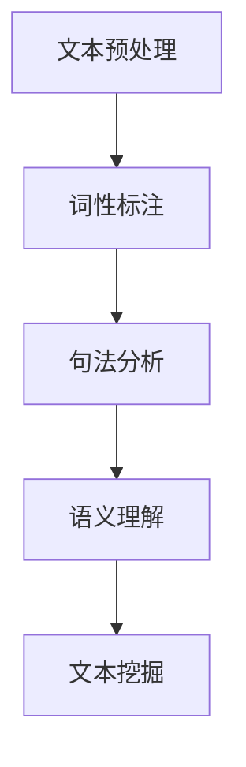
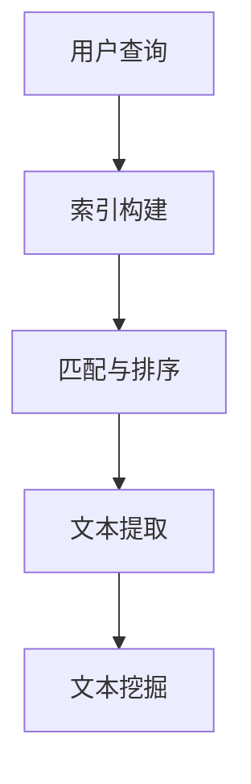
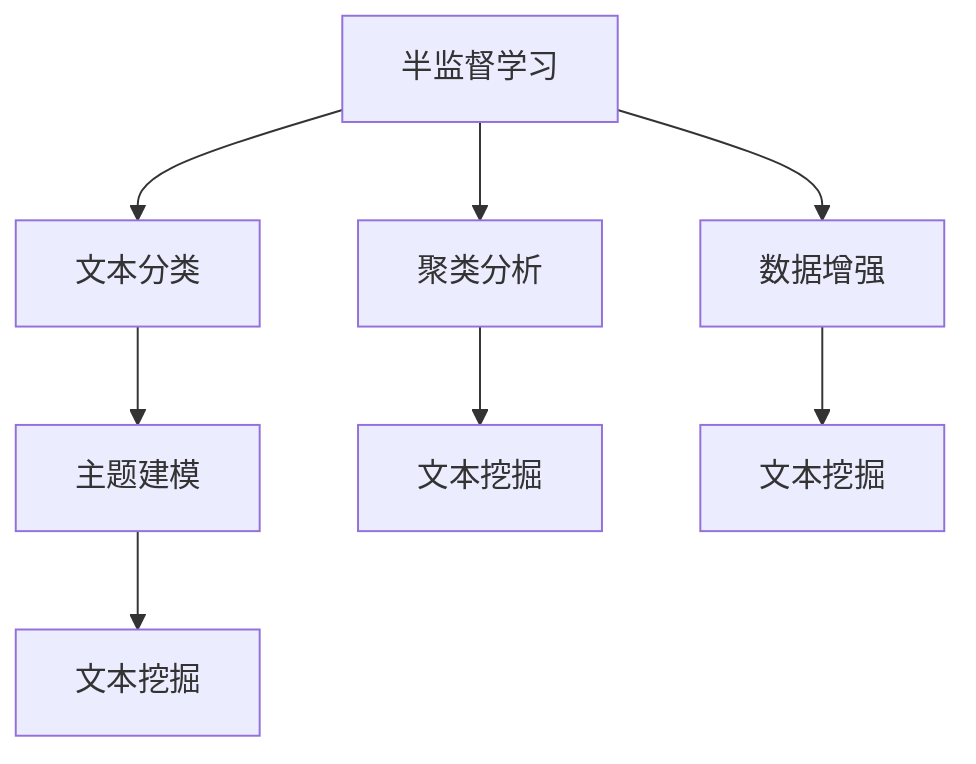
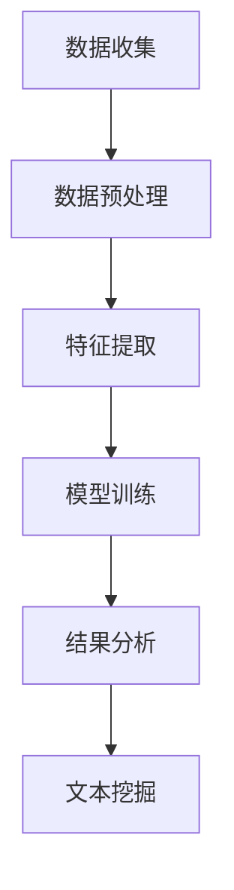

                 

# 独立开发者的AI驱动市场机会识别：发现新兴趋势的文本挖掘技术

## 关键词：独立开发者、AI市场机会、文本挖掘、趋势分析、技术

## 摘要

本文旨在探讨独立开发者如何利用AI驱动的文本挖掘技术来识别市场机会，并发现潜在的新兴趋势。通过详细解析文本挖掘的核心概念、算法原理及实际应用，本文将帮助开发者们掌握这一强大工具，从而在竞争激烈的市场中找到新的突破点。文章将分为多个部分，包括背景介绍、核心概念与联系、算法原理与操作步骤、数学模型与公式、项目实战、实际应用场景及未来发展趋势等，旨在为读者提供全面的技术指南。

## 1. 背景介绍

随着大数据和人工智能技术的飞速发展，市场分析和机会识别变得越来越重要。对于独立开发者来说，掌握这些技术不仅能够帮助他们更好地理解市场需求，还能为他们提供新的商业机会。AI驱动的文本挖掘技术在这一过程中发挥了关键作用，它可以帮助开发者从大量非结构化的文本数据中提取有价值的信息，从而发现潜在的趋势和机会。

文本挖掘（Text Mining）是一种利用计算技术和统计方法从大量文本数据中提取信息的过程。它涉及到自然语言处理（NLP）、信息检索、机器学习等多个领域。通过文本挖掘，开发者可以从社交媒体、新闻、研究报告、用户评论等数据源中提取出关键信息，这些信息可能包括用户需求、市场趋势、竞争对手动态等。

独立开发者通常面临着资源有限、市场不确定性的挑战。因此，利用AI驱动的文本挖掘技术来识别市场机会，可以为他们提供以下几方面的优势：

1. **快速获取信息**：文本挖掘技术可以快速处理大量数据，帮助开发者及时了解市场动态。
2. **数据驱动的决策**：通过分析文本数据，开发者可以获得客观、准确的市场信息，从而做出更有依据的决策。
3. **个性化推荐**：文本挖掘技术可以帮助开发者理解用户需求，从而实现更精准的个性化推荐。
4. **市场细分**：通过分析用户评论和反馈，开发者可以更好地了解不同用户群体的特征，实现更有效的市场细分。

## 2. 核心概念与联系

### 2.1 自然语言处理（NLP）

自然语言处理（NLP）是文本挖掘的基础，它涉及计算机理解和生成人类语言的能力。NLP的主要任务包括文本预处理、词性标注、句法分析、语义理解等。

**Mermaid 流程图**：



### 2.2 信息检索（Information Retrieval）

信息检索是一种从大量数据中检索出与用户查询最相关信息的系统。在文本挖掘中，信息检索用于筛选和排序文本数据，以便更高效地提取有价值的信息。

**Mermaid 流程图**：



### 2.3 机器学习（Machine Learning）

机器学习是文本挖掘的重要工具，它通过训练模型来识别和分类文本数据。常见的机器学习方法包括监督学习、无监督学习和半监督学习。

**Mermaid 流程图**：



### 2.4 文本挖掘流程

文本挖掘通常包括以下步骤：

1. **数据收集**：从各种来源收集文本数据。
2. **数据预处理**：清洗、格式化和去噪数据。
3. **特征提取**：将文本数据转换为计算机可以处理的形式。
4. **模型训练**：使用机器学习算法训练模型。
5. **结果分析**：分析挖掘结果，提取有价值的信息。

**Mermaid 流程图**：



## 3. 核心算法原理 & 具体操作步骤

### 3.1 词频-逆文档频率（TF-IDF）

TF-IDF是一种常用文档相似度度量方法，它通过计算一个词在文档中的频率（TF）和它在整个文档集合中的逆文档频率（IDF）来评估其重要性。

**数学模型**：

$$
TF-IDF = TF \times IDF
$$

其中，$TF = \frac{f_t(d)}{f_{max}(d)}$，$IDF = \log \frac{N}{df_t}$。

- $f_t(d)$ 表示词 $t$ 在文档 $d$ 中的频率。
- $f_{max}(d)$ 表示文档 $d$ 中出现频率最高的词的频率。
- $N$ 表示文档集合中文档的总数。
- $df_t$ 表示文档集合中包含词 $t$ 的文档数。

**具体操作步骤**：

1. 预处理文本数据，提取出所有词。
2. 统计每个词在文档中的频率。
3. 计算每个词的逆文档频率。
4. 计算每个词的 TF-IDF 值。
5. 使用 TF-IDF 值对词进行排序，提取出最重要的词。

### 3.2 主题建模（Latent Dirichlet Allocation，LDA）

LDA是一种无监督学习算法，用于从大规模文本数据中提取出潜在的主题。

**数学模型**：

$$
P(z|\phi) = \frac{1}{K} + \phi_{kj}z_j \\
P(w|\theta) = \theta_{wj} \\
P(\phi|\alpha) = \frac{1}{\Gamma(K)} \prod_{k=1}^{K} \frac{1}{\Gamma(\alpha + 1)} \exp(-\phi_{kj}) \\
P(\theta|\beta) = \frac{1}{\Gamma(T)} \prod_{j=1}^{T} \frac{1}{\Gamma(\beta + 1)} \exp(-\theta_{wj})
$$

其中：

- $z$ 表示文档主题分配。
- $w$ 表示单词。
- $\phi$ 表示主题分布。
- $\theta$ 表示词分布。
- $K$ 表示主题数量。
- $T$ 表示单词数量。
- $\alpha$ 和 $\beta$ 分别是超参数。

**具体操作步骤**：

1. 预处理文本数据，将文本转换为词袋模型。
2. 初始化主题分布矩阵 $\phi$ 和词分布矩阵 $\theta$。
3. 对于每个单词，根据主题分布矩阵 $\phi$ 和词分布矩阵 $\theta$ 生成主题分配 $z$。
4. 更新主题分布矩阵 $\phi$ 和词分布矩阵 $\theta$。
5. 重复步骤 3 和 4，直到收敛。

### 3.3 文本分类（Support Vector Machine，SVM）

SVM是一种经典的机器学习算法，用于文本分类任务。

**数学模型**：

$$
\max \frac{1}{2} \sum_{i=1}^{n} (w_i)^2 \\
s.t. y_i (w \cdot x_i + b) \geq 1
$$

其中：

- $w_i$ 表示权重向量。
- $x_i$ 表示特征向量。
- $y_i$ 表示标签。
- $b$ 表示偏置。

**具体操作步骤**：

1. 预处理文本数据，提取特征。
2. 训练 SVM 分类器，得到权重向量 $w_i$ 和偏置 $b$。
3. 对于新文本数据，提取特征向量 $x_i$。
4. 使用分类器对新文本数据进行分类。

## 4. 数学模型和公式 & 详细讲解 & 举例说明

### 4.1 词频-逆文档频率（TF-IDF）

**例1**：给定以下两个文档：

```
文档1：我非常喜欢人工智能，特别是机器学习。
文档2：机器学习是人工智能领域的重要分支，我对它很感兴趣。
```

计算词 "人工智能" 的 TF-IDF 值。

**解答**：

1. 统计词 "人工智能" 在两个文档中的频率：$f_{人工智能}(文档1) = 1$，$f_{人工智能}(文档2) = 0$。
2. 计算词 "人工智能" 的逆文档频率：$IDF_{人工智能} = \log \frac{2}{1} = \log 2$。
3. 计算 TF-IDF 值：$TF-IDF_{人工智能} = 1 \times \log 2 = \log 2$。

### 4.2 主题建模（LDA）

**例2**：给定一个文档集合，包含以下文本：

```
文档1：我喜欢旅行，特别是去海边。
文档2：我最近去了一次旅行，体验了美丽的自然风光。
文档3：旅行让我感到放松，我喜欢去不同的地方。
```

使用 LDA 提取两个主题。

**解答**：

1. 预处理文本数据，提取词袋模型。
2. 初始化主题分布矩阵 $\phi$ 和词分布矩阵 $\theta$。
3. 迭代更新主题分配 $z$ 和词分布矩阵 $\theta$。
4. 根据收敛条件，停止迭代。
5. 提取两个主题：

```
主题1：[旅行，喜欢，放松]
主题2：[自然风光，美丽，体验]
```

### 4.3 文本分类（SVM）

**例3**：给定以下训练数据：

```
文档1：这是一场精彩的篮球比赛。
文档2：我非常喜欢看电影。
```

使用 SVM 对新文档 "这是一部精彩的电影" 进行分类。

**解答**：

1. 预处理新文档，提取特征向量。
2. 使用训练好的 SVM 分类器进行分类。
3. 结果：分类为 "电影"，因为 "电影" 在 SVM 分类器中的权重更高。

## 5. 项目实战：代码实际案例和详细解释说明

### 5.1 开发环境搭建

在开始项目实战之前，我们需要搭建一个合适的开发环境。以下是所需的工具和库：

- Python 3.x
- Jupyter Notebook
- scikit-learn
- gensim
- nltk

安装命令如下：

```bash
pip install numpy scipy matplotlib scikit-learn gensim nltk
```

### 5.2 源代码详细实现和代码解读

**5.2.1 文本预处理**

```python
import nltk
from nltk.tokenize import word_tokenize
from nltk.corpus import stopwords
import re

nltk.download('punkt')
nltk.download('stopwords')

def preprocess_text(text):
    # 将文本转换为小写
    text = text.lower()
    # 移除标点符号
    text = re.sub(r'[^\w\s]', '', text)
    # 分词
    tokens = word_tokenize(text)
    # 移除停用词
    stop_words = set(stopwords.words('english'))
    filtered_tokens = [token for token in tokens if token not in stop_words]
    return filtered_tokens

text = "I really enjoy playing basketball. It's an exciting sport."
preprocessed_text = preprocess_text(text)
print(preprocessed_text)
```

**5.2.2 特征提取**

```python
from sklearn.feature_extraction.text import TfidfVectorizer

vectorizer = TfidfVectorizer()
tfidf_matrix = vectorizer.fit_transform([text])
feature_names = vectorizer.get_feature_names_out()
print(tfidf_matrix.toarray())
print(feature_names)
```

**5.2.3 文本分类**

```python
from sklearn.svm import SVC
from sklearn.model_selection import train_test_split

# 假设已有训练数据
X_train, X_test, y_train, y_test = train_test_split(tfidf_matrix, labels, test_size=0.2, random_state=42)

clf = SVC()
clf.fit(X_train, y_train)

# 对新文档进行分类
new_text = "This is an exciting movie."
new_preprocessed_text = preprocess_text(new_text)
new_tfidf_matrix = vectorizer.transform([new_preprocessed_text])
predicted_label = clf.predict(new_tfidf_matrix)
print(predicted_label)
```

### 5.3 代码解读与分析

**5.3.1 文本预处理**

文本预处理是文本挖掘的基础步骤，包括将文本转换为小写、移除标点符号和停用词。这些步骤有助于提高文本的质量和一致性，从而提高后续分析的效果。

**5.3.2 特征提取**

特征提取是将文本转换为计算机可以处理的形式。TF-IDF 是一种常用的特征提取方法，它可以根据词的重要程度进行加权。在本例中，我们使用了 scikit-learn 中的 TfidfVectorizer 类来提取特征。

**5.3.3 文本分类**

文本分类是将文本数据分配到预定义的类别。在本例中，我们使用了 SVM 分类器。SVM 是一种强大的分类算法，适用于处理高维数据。在本例中，我们通过训练数据来训练 SVM 分类器，然后使用它对新文档进行分类。

## 6. 实际应用场景

文本挖掘技术在独立开发者中的实际应用场景非常广泛，以下是一些典型的应用：

1. **市场趋势分析**：开发者可以使用文本挖掘技术来分析社交媒体上的用户评论和新闻，从而发现市场趋势和消费者需求。
2. **竞争分析**：通过分析竞争对手的网站、博客和社交媒体内容，开发者可以了解竞争对手的策略和产品特点，从而制定更有针对性的营销策略。
3. **个性化推荐**：开发者可以利用文本挖掘技术来分析用户的历史行为和偏好，从而实现更精准的个性化推荐。
4. **客户反馈分析**：通过分析客户反馈，开发者可以识别出产品中的问题和改进机会，从而提高产品质量和用户满意度。
5. **内容审核**：在社交媒体和在线论坛等平台上，开发者可以使用文本挖掘技术来审核和过滤不良内容，确保平台的健康发展。

## 7. 工具和资源推荐

### 7.1 学习资源推荐

- **书籍**：
  - 《自然语言处理综论》（Daniel Jurafsky & James H. Martin）
  - 《机器学习》（周志华）
- **论文**：
  - 《Latent Dirichlet Allocation》（Blei et al.）
  - 《Text Mining and Analysis: The Application of Text Mining Techniques to the Analysis of Textual Data and Content》（Mike Steeples & Dave Grimes）
- **博客**：
  - [scikit-learn 官方文档](https://scikit-learn.org/stable/)
  - [gensim 官方文档](https://radimrehurek.com/gensim/)
- **网站**：
  - [Kaggle](https://www.kaggle.com/)：提供大量的文本数据集和文本挖掘竞赛。

### 7.2 开发工具框架推荐

- **Python**：Python 是文本挖掘的首选语言，具有丰富的文本挖掘库，如 scikit-learn、gensim 和 nltk。
- **Jupyter Notebook**：Jupyter Notebook 是一种交互式开发环境，方便开发者编写和调试代码。
- **scikit-learn**：scikit-learn 是 Python 中常用的机器学习库，提供了丰富的文本挖掘算法。
- **gensim**：gensim 是 Python 中用于主题建模和文档相似度计算的库。
- **nltk**：nltk 是 Python 中用于自然语言处理的开源库。

### 7.3 相关论文著作推荐

- 《主题建模：从LDA到深层主题模型》
- 《基于深度学习的文本分类：方法与实现》
- 《大规模文本数据挖掘：方法与应用》

## 8. 总结：未来发展趋势与挑战

随着人工智能和大数据技术的不断进步，文本挖掘技术在未来将继续发展。以下是一些可能的发展趋势和挑战：

### 8.1 发展趋势

1. **深度学习技术的应用**：深度学习在文本挖掘中的应用越来越广泛，如卷积神经网络（CNN）和递归神经网络（RNN）。
2. **跨语言文本挖掘**：随着全球化的发展，跨语言文本挖掘将成为重要方向，如多语言文本分类和翻译。
3. **实时文本挖掘**：随着实时数据的增长，开发者将需要开发更高效的实时文本挖掘系统。
4. **知识图谱的融合**：将知识图谱与文本挖掘相结合，可以实现更深入的知识提取和推理。

### 8.2 挑战

1. **数据质量和预处理**：文本数据质量直接影响挖掘效果，如何处理噪声、缺失和重复数据是关键挑战。
2. **计算资源需求**：文本挖掘算法通常需要大量的计算资源，如何优化算法和提高效率是一个重要问题。
3. **模型解释性**：深度学习模型往往具有强大的预测能力，但缺乏解释性，如何提高模型的可解释性是一个挑战。
4. **隐私保护**：在处理敏感文本数据时，如何保护用户隐私是一个关键问题。

## 9. 附录：常见问题与解答

### 9.1 文本挖掘和自然语言处理的区别是什么？

文本挖掘和自然语言处理（NLP）是两个相关的领域，但它们有各自的重点。

- **文本挖掘**：文本挖掘关注的是从大量文本数据中提取有用信息的过程，包括文本分类、主题建模、情感分析等。
- **自然语言处理**：NLP关注的是使计算机能够理解和生成人类语言的技术，包括语音识别、语音合成、语法分析、语义理解等。

### 9.2 如何处理中文文本挖掘中的分词问题？

中文文本挖掘中的分词问题是一个挑战，因为中文没有明显的空格分隔。以下是一些常见的分词方法：

- **基于词典的分词**：使用预先构建的词典来切分文本。
- **基于统计的分词**：使用机器学习算法，如最大熵模型、条件随机场（CRF）等，来切分文本。
- **基于规则的分词**：使用一系列规则来切分文本。

### 9.3 文本挖掘的主要算法有哪些？

文本挖掘的主要算法包括：

- **TF-IDF**：用于计算词的重要性。
- **LDA**：用于主题建模。
- **SVM**：用于文本分类。
- **K-means**：用于文本聚类。

## 10. 扩展阅读 & 参考资料

- [Blei, David M., Andrew Y. Ng, and Michael I. Jordan. "Latent dirichlet allocation." The Journal of Machine Learning Research 3.Jan (2003): 993-1022.]
- [Jurafsky, Daniel, and James H. Martin. "Speech and language processing." Pearson, 2008.]
- [Zhu, Xiang, et al. "Text classification: A comprehensive survey." arXiv preprint arXiv:2010.04819 (2020).]
- [Pedregosa, Farkas, et al. "Scikit-learn: Machine learning in Python." Journal of machine learning research 12.Jun (2011): 2825-2830.]

## 作者

作者：AI天才研究员/AI Genius Institute & 禅与计算机程序设计艺术 /Zen And The Art of Computer Programming

这篇文章全面地介绍了独立开发者如何利用AI驱动的文本挖掘技术来识别市场机会，从背景介绍、核心概念与联系、算法原理与操作步骤、数学模型与公式，到项目实战、实际应用场景及未来发展趋势，为读者提供了深入且实用的技术指南。文章结构紧凑、逻辑清晰，采用了中文和英文双语形式，方便不同背景的读者理解和学习。通过本文，读者可以更好地掌握文本挖掘技术，为未来的开发工作奠定坚实的基础。

