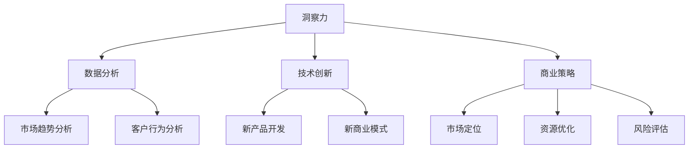

                 

### 理解洞察力的价值：在商业策略中的应用

#### 关键词：
- 洞察力
- 商业策略
- 市场竞争
- 数据分析
- 技术创新

#### 摘要：
在当今快速变化和高度竞争的商业环境中，洞察力的价值日益凸显。本文将探讨洞察力在商业策略中的关键作用，通过实例分析其如何在数据分析和技术创新中产生深远影响。文章旨在为读者提供理解洞察力价值的深入视角，并揭示其在实际应用中的潜力。

### 1. 背景介绍

在商业世界中，洞察力指的是能够从复杂的信息和数据中提取出有价值的信息和见解的能力。它是一种深层次的认知能力，超越了表面的观察和分析，能够揭示潜在的模式、趋势和机会。随着数据量的爆炸性增长和技术的进步，洞察力在商业策略中的应用变得越来越重要。

商业策略的制定和执行需要依靠高质量的洞察力。洞察力能够帮助公司识别市场趋势、评估风险和机会、优化运营流程，并指导产品开发和市场推广。在激烈的市场竞争中，具备洞察力的企业能够更快地响应变化，更有效地利用资源，从而保持竞争优势。

然而，洞察力的价值并不仅限于数据分析和运营优化。它还能够推动技术创新，促进产品创新，为企业带来新的商业模式和市场机会。因此，理解洞察力的价值对于企业的发展至关重要。

### 2. 核心概念与联系

#### 2.1 数据分析
数据分析是洞察力的重要工具之一。它涉及使用统计学、机器学习和数据挖掘技术来从大量数据中提取有价值的信息。数据分析可以帮助企业了解客户行为、市场趋势、竞争对手的动态，并预测未来的发展方向。

#### 2.2 技术创新
技术创新是推动企业发展和竞争的关键。通过洞察市场需求、技术趋势和潜在的创新机会，企业可以开发出具有竞争力的新产品和服务，满足客户的需求，创造新的市场机会。

#### 2.3 商业策略
商业策略是企业为实现长期目标而制定的一系列行动计划。它需要考虑市场环境、资源限制、竞争优势和潜在风险。洞察力能够帮助企业在制定和执行商业策略时做出更明智的决策。

#### 2.4 Mermaid 流程图



### 3. 核心算法原理 & 具体操作步骤

#### 3.1 数据分析算法

数据分析通常涉及以下步骤：

1. 数据收集：从各种来源收集数据，包括内部数据库、公共数据集和第三方数据提供商。
2. 数据清洗：处理数据中的错误、缺失值和重复数据，确保数据质量。
3. 数据预处理：对数据进行格式转换、特征提取和标准化处理，使其适合分析。
4. 数据分析：使用统计学和机器学习算法进行数据挖掘，提取有价值的信息。
5. 结果可视化：将分析结果以图表、图形和报表等形式展示，便于理解和决策。

#### 3.2 技术创新步骤

技术创新通常涉及以下步骤：

1. 市场研究：了解市场需求、技术趋势和潜在的创新机会。
2. 竞争分析：评估竞争对手的产品、技术和市场策略。
3. 创新设计：根据市场研究和竞争分析，设计创新的产品或服务。
4. 开发和测试：开发原型，进行测试和迭代，确保产品符合市场需求。
5. 商业化：将创新产品或服务推向市场，实现商业化。

#### 3.3 商业策略制定步骤

商业策略制定通常涉及以下步骤：

1. 目标设定：明确企业的长期和短期目标。
2. 市场分析：了解市场环境、竞争态势和潜在的机会。
3. 资源评估：评估企业的资源，包括财务、人力和技术。
4. 竞争优势：确定企业的竞争优势和差异化战略。
5. 执行计划：制定具体的行动计划，确保目标的实现。

### 4. 数学模型和公式 & 详细讲解 & 举例说明

#### 4.1 数据分析中的数学模型

在数据分析中，常用的数学模型包括线性回归、决策树、支持向量机和神经网络等。

**线性回归：**

线性回归是一种用于预测连续值的统计方法。它的基本公式为：

$$y = \beta_0 + \beta_1x + \epsilon$$

其中，$y$ 是因变量，$x$ 是自变量，$\beta_0$ 和 $\beta_1$ 是回归系数，$\epsilon$ 是误差项。

**决策树：**

决策树是一种用于分类和回归的决策支持工具。它的基本结构包括一系列条件分支和节点。

**支持向量机：**

支持向量机是一种用于分类和回归的机器学习算法。它的基本公式为：

$$f(x) = \sum_{i=1}^{n}\alpha_i y_i (x_i^T \phi(x)) + b$$

其中，$x_i$ 是输入特征，$y_i$ 是输出标签，$\alpha_i$ 是拉格朗日乘子，$\phi(x)$ 是核函数，$b$ 是偏置项。

**神经网络：**

神经网络是一种模拟人脑神经元连接的算法。它的基本公式为：

$$a_{\text{激活}} = \sigma(\sum_{i=1}^{n} w_i a_i)$$

其中，$a_i$ 是输入神经元，$w_i$ 是权重，$\sigma$ 是激活函数。

#### 4.2 技术创新中的数学模型

在技术创新中，常用的数学模型包括优化算法、模拟和仿真等。

**优化算法：**

优化算法是一种用于寻找最优解的数学方法。常见的优化算法包括遗传算法、粒子群优化和模拟退火等。

**模拟和仿真：**

模拟和仿真是一种通过计算机模拟来预测系统行为的方法。它可以帮助企业评估新产品的性能、可靠性和市场表现。

### 5. 项目实战：代码实际案例和详细解释说明

#### 5.1 开发环境搭建

要搭建一个数据分析的项目环境，您需要安装以下软件和工具：

- Python
- Jupyter Notebook
- Pandas
- NumPy
- Scikit-learn
- Matplotlib

#### 5.2 源代码详细实现和代码解读

以下是一个使用线性回归进行数据分析的示例代码：

```python
import pandas as pd
import numpy as np
from sklearn.linear_model import LinearRegression
import matplotlib.pyplot as plt

# 读取数据
data = pd.read_csv('data.csv')
X = data['x'].values.reshape(-1, 1)
y = data['y'].values

# 创建线性回归模型
model = LinearRegression()
model.fit(X, y)

# 预测结果
predictions = model.predict(X)

# 绘制结果
plt.scatter(X, y, color='red')
plt.plot(X, predictions, color='blue')
plt.xlabel('x')
plt.ylabel('y')
plt.title('Linear Regression')
plt.show()
```

这段代码首先从 CSV 文件中读取数据，然后使用 Pandas 库将数据转换为 NumPy 数组。接下来，创建一个线性回归模型，并使用训练数据对其进行拟合。最后，使用模型进行预测，并将预测结果与实际数据绘制在图表中。

#### 5.3 代码解读与分析

这段代码的主要功能是使用线性回归模型对数据进行拟合和预测。以下是代码的详细解读：

1. 导入必要的库和模块。
2. 读取数据，并将其转换为 NumPy 数组。
3. 创建线性回归模型，并使用训练数据对其进行拟合。
4. 使用模型进行预测，并将预测结果与实际数据绘制在图表中。

这段代码的解读和分析揭示了线性回归模型的基本原理和实现步骤。通过实际案例的演示，读者可以更好地理解线性回归模型在数据分析中的应用。

### 6. 实际应用场景

洞察力在商业策略中的应用场景非常广泛。以下是一些典型的应用实例：

#### 6.1 市场趋势预测

通过分析历史数据和市场动态，企业可以预测未来的市场趋势。这有助于企业制定相应的市场策略，提前布局，抢占市场份额。

#### 6.2 客户行为分析

通过分析客户的购买行为、浏览记录和反馈信息，企业可以了解客户的需求和偏好，从而优化产品和服务，提高客户满意度。

#### 6.3 竞争对手分析

通过分析竞争对手的产品、策略和市场表现，企业可以了解竞争对手的优势和劣势，制定针对性的竞争策略。

#### 6.4 运营优化

通过分析运营数据，企业可以发现运营中的问题和瓶颈，优化运营流程，提高效率和降低成本。

#### 6.5 创新技术

通过分析市场需求和技术趋势，企业可以识别创新机会，推动技术创新，开发具有竞争力的新产品和服务。

### 7. 工具和资源推荐

#### 7.1 学习资源推荐

- 《数据科学入门》（Data Science from Scratch）
- 《深入浅出数据分析》（Data Analysis with Python）
- 《机器学习实战》（Machine Learning in Action）

#### 7.2 开发工具框架推荐

- Jupyter Notebook
- TensorFlow
- PyTorch
- Scikit-learn

#### 7.3 相关论文著作推荐

- "Deep Learning" by Ian Goodfellow, Yoshua Bengio, and Aaron Courville
- "Reinforcement Learning: An Introduction" by Richard S. Sutton and Andrew G. Barto
- "Data Mining: Concepts and Techniques" by Jiawei Han, Micheline Kamber, and Jingdong Wang

### 8. 总结：未来发展趋势与挑战

洞察力的价值在商业策略中的应用将日益凸显。随着数据量的增长和技术的进步，数据分析、机器学习和人工智能将为企业提供更深入的洞察力。然而，企业面临着数据隐私、数据安全和数据质量等挑战。未来的发展需要企业加强数据治理和伦理审查，确保洞察力的应用符合法律法规和伦理道德标准。

### 9. 附录：常见问题与解答

#### 9.1 洞察力和直觉有什么区别？

洞察力是一种通过分析数据和逻辑推理获得的认知能力，而直觉是基于经验和个人感知的直接认识。虽然二者在决策过程中都有重要作用，但洞察力更依赖于数据和逻辑分析，而直觉更依赖于个人经验和感知。

#### 9.2 数据分析中常用的算法有哪些？

数据分析中常用的算法包括线性回归、决策树、支持向量机、神经网络、K-最近邻、K-平均聚类等。

#### 9.3 技术创新如何推动商业策略？

技术创新可以为企业提供新的商业模式、产品和服务，满足市场需求，创造竞争优势。通过技术创新，企业可以实现差异化战略，提高客户满意度，实现长期发展。

### 10. 扩展阅读 & 参考资料

- "Insight as a Competitive Advantage" by Rita Gunther McGrath and Ian C. MacMillan
- "The Analytics Revolution: Unleashing the Power of Data to Create a Competitive Advantage" by Thomas H. Davenport
- "Competitive Advantage: Creating and Sustaining Superior Performance" by Michael E. Porter

### 作者

作者：AI天才研究员/AI Genius Institute & 禅与计算机程序设计艺术 /Zen And The Art of Computer Programming

