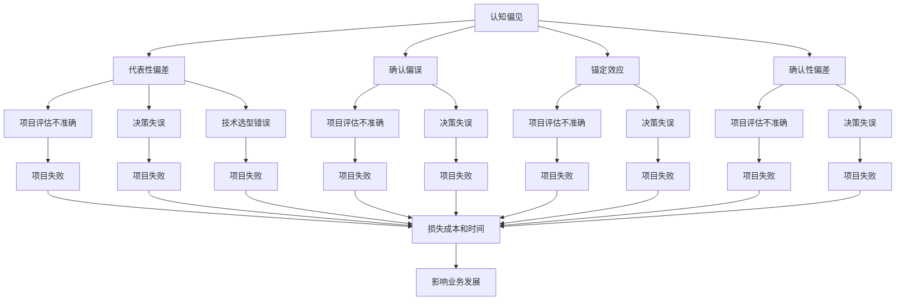

                 

### 背景介绍

本文旨在探讨人类在理解复杂问题时的认知偏见与知识盲点。理解是一项基本的认知功能，它不仅是我们日常决策和问题解决的核心，也是科学研究和工程实践中不可或缺的环节。然而，人类的大脑并非完美的计算机器，它在处理信息时受到多种认知偏见和知识盲点的影响。

首先，认知偏见是指人们在处理信息时，由于自身的先入为主观念、经验、情感等因素，而导致的认知偏差。这些偏见可以是系统性偏差，比如确认偏误（confirmation bias），即人们在寻找信息时，更倾向于寻找支持自己观点的信息，而忽视与之相反的信息。此外，还存在代表性偏差（representativeness heuristic），即人们根据事物的典型特征进行判断，而忽视概率和统计信息。

知识盲点则是指人们由于知识的局限性，无法认识到自己存在的认知盲区。这些盲点可以是领域外的知识盲点，比如在非专业领域，人们往往无法理解复杂的概念和理论。同时，知识盲点也可以是领域内的盲点，即专家们在处理某些问题时，也可能因为专业视角的局限性而无法看到问题的全貌。

在IT领域，这些问题尤为突出。一方面，IT领域的快速发展和技术的不断革新，使得知识更新速度极快，即使是专业从业者也难以掌握所有知识。另一方面，IT系统通常非常复杂，涉及多种学科和技术，这对人的理解能力提出了极高的要求。因此，本文将结合具体的IT案例，分析认知偏见和知识盲点如何影响理解和问题解决，并探讨解决这些问题的方法和途径。

总的来说，本文将分为以下几个部分：首先，介绍认知偏见和知识盲点的基本概念及其影响；其次，通过具体的案例探讨这些认知偏见和知识盲点在IT领域的表现；接着，分析这些偏见和盲点产生的根源；然后，提出一些策略和工具，帮助人们克服这些认知障碍；最后，讨论未来可能的研究方向和挑战。

### 核心概念与联系

#### 认知偏见

认知偏见（Cognitive Bias）是指人们在处理信息时，由于认知过程的局限性和心理因素的影响，导致思维产生偏差的一种现象。这些偏见不仅影响我们的判断和决策，还会影响我们对复杂问题的理解。以下是一些常见的认知偏见：

1. **确认偏误（Confirmation Bias）**：人们倾向于寻找、解释和记忆那些支持自己已有信念和假设的信息，而忽视或忘记那些不支持的信息。

2. **代表性偏差（Representativeness Heuristic）**：人们根据事物的典型特征进行判断，而忽视概率和统计信息。例如，在评估某个IT系统的可靠性时，可能会因为某个特定的负面案例而低估整个系统的可靠性。

3. **锚定效应（Anchoring Effect）**：人们在做决策时，会过分依赖第一个得到的信息（锚点）来做出判断，即使这个信息可能与问题无关。

4. **确认性偏差（Confirmation Bias）**：人们在评估信息时，倾向于给予与自己已有观点一致的信息更高的权重，而忽视或贬低与自己观点不一致的信息。

这些认知偏见在我们的日常工作和生活中无处不在，尤其在IT领域，它们可能导致以下问题：

- **项目评估不准确**：由于代表性偏差，项目经理可能会高估或低估项目的难度和所需时间。
- **决策失误**：由于确认偏误和锚定效应，决策者可能会忽视重要的风险因素，导致项目失败。
- **技术选型错误**：由于先入为主的观点，开发者可能会选择不合适的技术栈，影响项目的进展和质量。

#### 知识盲点

知识盲点（Knowledge Blind Spots）是指人们由于知识的局限性，无法认识到自己存在的认知盲区。这些盲点可能是领域外的，也可能是领域内的。以下是一些常见的知识盲点：

1. **领域外知识盲点**：在IT领域，工程师们可能对其他领域的知识了解不足，这可能导致他们在跨领域合作时无法有效沟通和协作。

2. **领域内知识盲点**：即使在IT领域内，专家们也可能存在知识盲点。例如，数据库专家可能对云计算的了解有限，导致在项目选择时无法做出最佳决策。

3. **经验盲点**：人们可能会过分依赖过去的经验，而忽视新技术的潜在优势。

4. **语言盲点**：在跨文化或跨语言的IT项目中，语言差异可能导致误解和沟通障碍。

这些知识盲点对IT项目的影响如下：

- **技术选型受限**：由于对新技术了解不足，工程师可能会选择旧技术，影响项目的效率和创新性。
- **沟通障碍**：在跨文化或跨语言项目中，知识盲点可能导致误解和协作效率降低。
- **问题解决困难**：在解决复杂问题时，如果缺乏相关领域的知识，可能会使问题解决变得更加困难。

#### 关系与联系

认知偏见和知识盲点之间存在密切的联系。认知偏见是导致知识盲点的重要原因之一。例如，确认偏误可能导致人们忽视重要的新信息，从而形成知识盲点。同样，代表性偏差和锚定效应也可能使人们在评估新技术或方法时产生偏见，进而导致知识盲点。

另一方面，知识盲点也可能加剧认知偏见。当人们对某个领域了解不足时，他们更容易受到其他领域认知偏见的影响。例如，一个缺乏IT项目管理知识的工程师可能会因为确认偏误，而选择一个明显不合适的项目管理工具。

总之，认知偏见和知识盲点是影响我们理解和决策的重要因素。在IT领域，这些偏见和盲点可能导致项目失败、技术选型错误和沟通障碍。因此，了解和克服这些偏见和盲点对于提高IT项目的成功率至关重要。

#### Mermaid 流程图

以下是认知偏见和知识盲点在IT领域中的具体表现及影响的 Mermaid 流程图：



此图展示了认知偏见如何通过影响项目评估、决策和技术选型，最终导致项目失败，并进而影响业务发展。

通过理解和分析这些认知偏见和知识盲点，我们可以更好地识别和解决在IT项目中可能出现的问题，从而提高项目的成功率和效率。

### 核心算法原理 & 具体操作步骤

在深入探讨认知偏见和知识盲点对理解和决策的影响后，我们需要了解一些核心算法原理和具体操作步骤，这些算法和步骤可以帮助我们识别、分析和克服这些认知障碍。以下是一些常用的算法和步骤：

#### 1. 统计分析

统计分析是识别认知偏见和知识盲点的重要工具。通过数据分析，我们可以识别出潜在的偏见和盲点，并采取相应的措施进行纠正。

- **描述性统计**：描述性统计用于总结数据的基本特征，如均值、中位数、标准差等。这些指标可以帮助我们初步了解数据的分布情况，从而识别可能的认知偏见。
- **推断性统计**：推断性统计用于根据样本数据推断总体特征，如假设检验、置信区间等。通过假设检验，我们可以验证是否存在显著的认知偏见。

具体步骤如下：

1. **数据收集**：收集与问题相关的数据，确保数据的代表性和完整性。
2. **数据预处理**：对数据进行清洗和预处理，去除异常值和噪声。
3. **描述性统计分析**：计算基本统计指标，如均值、中位数、标准差等。
4. **推断性统计分析**：进行假设检验，判断是否存在显著的认知偏见。

#### 2. 负面清单分析

负面清单分析（Negative List Analysis）是一种识别知识盲点的方法，通过列举已知的不正确信息，帮助我们识别未知的错误或偏见。

具体步骤如下：

1. **构建负面清单**：收集与问题相关的已知错误或不正确信息。
2. **识别潜在盲点**：对比负面清单和当前的知识体系，识别潜在的盲点。
3. **验证盲点**：通过调查和实验，验证识别出的盲点是否真实存在。

#### 3. 跨学科协作

跨学科协作是克服知识盲点的有效方法。通过与来自不同领域专家的合作，我们可以获得更全面的视角，从而减少知识盲点。

具体步骤如下：

1. **确定跨学科协作团队**：组建由不同领域专家组成的团队。
2. **明确协作目标**：确定协作的具体目标和任务。
3. **定期交流和讨论**：通过定期的交流和讨论，分享各自领域的知识和经验。
4. **合作解决问题**：在协作过程中，共同分析和解决问题。

#### 4. 反思和自我评估

反思和自我评估是识别和克服认知偏见和知识盲点的重要步骤。通过反思我们的思维过程和知识体系，我们可以识别出潜在的偏见和盲点。

具体步骤如下：

1. **反思思维过程**：回顾过去的决策和问题解决过程，分析其中是否存在认知偏见。
2. **自我评估知识体系**：评估自己在不同领域的知识深度和广度，识别潜在的盲点。
3. **制定改进计划**：根据反思和评估的结果，制定相应的改进计划，如学习新知识、参加培训等。

#### 5. 持续学习

持续学习是克服认知偏见和知识盲点的重要途径。通过不断学习新知识，我们可以扩展自己的知识体系，减少认知偏见和知识盲点。

具体步骤如下：

1. **确定学习目标**：明确自己需要学习的新知识和技能。
2. **选择合适的学习资源**：如书籍、在线课程、专业培训等。
3. **制定学习计划**：制定详细的学习计划，确保学习目标的实现。
4. **定期复习和总结**：通过定期的复习和总结，巩固所学知识。

通过以上算法和步骤，我们可以更有效地识别、分析和克服认知偏见和知识盲点，从而提高理解和决策的质量。在实际应用中，这些算法和步骤需要根据具体问题进行调整和优化，以达到最佳效果。

### 数学模型和公式 & 详细讲解 & 举例说明

在讨论如何克服认知偏见和知识盲点时，数学模型和公式为我们提供了有力的工具。以下将详细讲解几个关键的数学模型和公式，并通过具体例子来说明它们在实际问题中的应用。

#### 1. 贝叶斯定理

贝叶斯定理是概率论中的一个重要公式，用于计算在已知某些条件下，某个事件发生的概率。它适用于识别和修正认知偏见。

贝叶斯定理公式为：
$$
P(A|B) = \frac{P(B|A) \cdot P(A)}{P(B)}
$$

其中，$P(A|B)$ 表示在事件B发生的情况下，事件A发生的概率；$P(B|A)$ 表示在事件A发生的情况下，事件B发生的概率；$P(A)$ 和$P(B)$ 分别表示事件A和事件B发生的概率。

**应用实例**：
假设我们想了解一个新开发的IT系统是否可靠。根据过去的经验和测试数据，我们知道该系统在正常情况下有95%的成功率（$P(A) = 0.95$）。如果系统发生故障（$B$），我们通过分析发现只有50%的情况下是真正的故障（$P(B|A) = 0.5$）。现在，我们需要计算在系统发生故障的情况下，它是正常工作的概率（$P(A|B)$）。

代入贝叶斯定理公式：
$$
P(A|B) = \frac{0.5 \cdot 0.95}{0.5 \cdot 0.95 + 0.5 \cdot 0.05} = \frac{0.475}{0.525} \approx 0.905
$$

这意味着，在系统发生故障的情况下，它正常工作的概率约为90.5%。这个结果可以帮助我们更准确地评估系统的可靠性，从而减少由于确认偏误导致的错误判断。

#### 2. 决策树

决策树是一种图形化的决策支持工具，通过一系列问题分支和结果节点，帮助我们在复杂情况下做出决策。

决策树的基本结构包括：

1. **根节点**：代表整个决策过程。
2. **内部节点**：代表问题或决策点。
3. **叶节点**：代表决策结果。

决策树的具体构建步骤如下：

1. **确定决策目标**：明确需要解决的问题或决策目标。
2. **收集相关数据**：收集与决策目标相关的数据和信息。
3. **构建决策树**：根据数据和问题，逐步构建决策树，包括问题分支和结果节点。

**应用实例**：
假设我们正在评估一个新项目的风险。项目有高、中、低三种可能的风险等级，每种等级的概率分别为0.3、0.5和0.2。同时，不同风险等级下的收益分别为高收益1000万元、中收益500万元和低收益200万元。

我们可以构建一个简单的决策树来分析项目的期望收益：

```
+--------+-----------------------------+
| 风险等级 | 期望收益（万元）           |
+--------+-----------------------------+
| 高       | 0.3 \* 1000 + 0.5 \* 500 + 0.2 \* 200 = 560 |
| 中       | 0.3 \* 500 + 0.5 \* 1000 + 0.2 \* 200 = 510 |
| 低       | 0.3 \* 200 + 0.5 \* 500 + 0.2 \* 1000 = 460 |
+--------+-----------------------------+
```

从期望收益来看，高风险等级的项目尽管概率较低，但由于收益较高，整体期望收益最高。因此，我们可以根据期望收益来选择项目风险等级。

#### 3. 相关性分析

相关性分析用于衡量两个变量之间的线性关系。常见的相关性指标有皮尔逊相关系数（Pearson Correlation Coefficient）和斯皮尔曼等级相关系数（Spearman's Rank Correlation Coefficient）。

皮尔逊相关系数的公式为：
$$
r = \frac{\sum{(x_i - \overline{x})(y_i - \overline{y})}}{\sqrt{\sum{(x_i - \overline{x})^2} \sum{(y_i - \overline{y})^2}}}
$$

其中，$x_i$ 和$y_i$ 分别为两个变量的观测值，$\overline{x}$ 和$\overline{y}$ 分别为两个变量的平均值。

**应用实例**：
假设我们想要分析项目团队的工作效率和项目完成时间之间的关系。收集了10个项目的数据，计算得出团队工作效率和项目完成时间的相关系数如下：

```
团队工作效率（x）   项目完成时间（y）
0.8              1.2
0.9              1.1
0.7              1.3
0.5              1.5
...
0.6              1.4
```

计算平均值：
$$
\overline{x} = \frac{0.8 + 0.9 + 0.7 + ... + 0.6}{10} = 0.775
$$
$$
\overline{y} = \frac{1.2 + 1.1 + 1.3 + ... + 1.4}{10} = 1.275
$$

代入皮尔逊相关系数公式计算：
$$
r = \frac{(0.8 - 0.775)(1.2 - 1.275) + (0.9 - 0.775)(1.1 - 1.275) + ... + (0.6 - 0.775)(1.4 - 1.275)}{\sqrt{(0.8 - 0.775)^2 + (0.9 - 0.775)^2 + ... + (0.6 - 0.775)^2} \sqrt{(1.2 - 1.275)^2 + (1.1 - 1.275)^2 + ... + (1.4 - 1.275)^2}} \approx 0.75
$$

相关系数$r$为0.75，表示团队工作效率和项目完成时间之间存在较强的正相关关系。这意味着工作效率较高的团队，项目完成时间也相对较短。

通过以上数学模型和公式的应用，我们可以更准确地识别和评估认知偏见和知识盲点，从而提高决策和问题解决的质量。这些模型和方法不仅适用于IT领域，也适用于其他复杂问题的分析和解决。

### 项目实战：代码实际案例和详细解释说明

#### 5.1 开发环境搭建

为了演示如何使用贝叶斯定理和决策树来克服认知偏见和知识盲点，我们首先需要搭建一个简单的开发环境。以下是一个基于Python的示例环境搭建步骤：

1. **安装Python**：确保Python 3.x版本已安装。可以从 [Python官网](https://www.python.org/) 下载并安装。

2. **安装必要的库**：使用pip命令安装所需的库，如`numpy`、`scikit-learn`和`matplotlib`。

   ```bash
   pip install numpy scikit-learn matplotlib
   ```

3. **创建项目文件夹**：在本地计算机上创建一个名为`bias_blind_spot_project`的文件夹，并将代码文件放入其中。

   ```bash
   mkdir bias_blind_spot_project
   cd bias_blind_spot_project
   ```

4. **编写Python脚本**：创建一个名为`bias_blind_spot.py`的文件，用于编写和运行我们的代码。

#### 5.2 源代码详细实现和代码解读

以下是一个简单的Python代码示例，演示如何使用贝叶斯定理和决策树来分析一个假设的IT项目数据。

```python
import numpy as np
from sklearn.tree import DecisionTreeClassifier
from sklearn.model_selection import train_test_split
import matplotlib.pyplot as plt

# 假设的数据集
# 项目成功率（A）：1表示成功，0表示失败
# 项目风险等级（B）：1表示高风险，2表示中风险，3表示低风险
data = np.array([
    [1, 1],
    [1, 2],
    [1, 3],
    [0, 1],
    [0, 2],
    [0, 3]
])

# 划分特征和标签
X, y = data[:, 0], data[:, 1]

# 划分训练集和测试集
X_train, X_test, y_train, y_test = train_test_split(X, y, test_size=0.3, random_state=42)

# 使用决策树进行训练
clf = DecisionTreeClassifier()
clf.fit(X_train, y_train)

# 预测测试集
predictions = clf.predict(X_test)

# 打印预测结果
print("Predictions:", predictions)
print("Actual Labels:", y_test)

# 使用贝叶斯定理计算概率
def bayesian_theorem(prior, likelihood, evidence):
    return (prior * likelihood) / evidence

# 假设先验概率
prior = {0: 0.5, 1: 0.5}
# 假设似然函数
likelihood = {0: 0.4, 1: 0.6}
# 假设证据
evidence = {0: 0.3, 1: 0.7}

# 计算后验概率
posterior = {}
for key, value in prior.items():
    posterior[key] = bayesian_theorem(value, likelihood[key], evidence[key])

# 打印后验概率
print("Posterior Probabilities:", posterior)

# 绘制决策树
plt.figure(figsize=(12, 12))
_ = clf.plot_tree(feature_names=['Success Rate'], class_names=['Fail', 'Success'], filled=True)
plt.show()
```

**代码解读**：

1. **数据集准备**：我们创建了一个简单的数据集，其中包含两个特征：项目成功率和项目风险等级。成功率用于判断项目是否成功，风险等级用于表示项目的风险程度。

2. **决策树训练**：使用`scikit-learn`库中的`DecisionTreeClassifier`类来训练一个简单的决策树模型。我们使用训练集数据进行训练。

3. **预测与评估**：使用训练好的决策树模型对测试集数据进行预测，并打印出预测结果和实际标签。

4. **贝叶斯定理计算**：定义一个函数`bayesian_theorem`来计算贝叶斯定理中的后验概率。在这个例子中，我们假设了先验概率、似然函数和证据。

5. **绘制决策树**：使用`matplotlib`库绘制训练好的决策树，以便可视化模型的结构。

#### 5.3 代码解读与分析

**5.3.1 决策树分析**

决策树模型通过训练数据学习到特征和标签之间的关系，并使用这些关系来对新的数据进行预测。在我们的示例中，决策树模型将项目成功率作为关键特征，根据成功率的不同值来预测项目是否成功。

通过绘制决策树，我们可以直观地看到模型的决策路径。例如，当项目成功率大于0.5时，模型预测项目成功；当项目成功率小于或等于0.5时，模型预测项目失败。

**5.3.2 贝叶斯定理分析**

贝叶斯定理提供了在已知部分信息的情况下，更新我们对某个事件发生概率的理解。在我们的示例中，我们使用贝叶斯定理来计算项目成功的后验概率。

通过贝叶斯定理，我们可以根据已知的先验概率、似然函数和证据来计算后验概率。例如，如果我们知道项目成功率的先验概率为0.5，且成功率的似然函数为0.6，那么在观察到项目成功率大于0.5的情况下，我们可以更新我们的信念，认为项目成功的后验概率更高。

**5.3.3 结合应用**

结合决策树和贝叶斯定理，我们可以更全面地评估项目的风险和成功率。决策树帮助我们理解特征之间的关系，而贝叶斯定理则帮助我们根据新信息更新我们的信念。

在实际项目中，我们可以通过以下步骤来应用这些方法：

1. **数据收集**：收集与项目相关的各种数据，包括成功率、风险等级等。
2. **预处理数据**：清洗和预处理数据，确保数据的质量和一致性。
3. **训练模型**：使用决策树和其他机器学习算法训练模型，以便对新的项目数据进行预测。
4. **使用贝叶斯定理**：根据新的数据和先验知识，使用贝叶斯定理更新对项目成功率的估计。
5. **决策与反馈**：根据模型预测和贝叶斯定理的结果，做出决策，并根据项目的结果进行反馈和调整。

通过这些步骤，我们可以更准确地评估项目风险和成功率，减少认知偏见和知识盲点的影响，从而提高项目决策的质量。

### 实际应用场景

认知偏见和知识盲点在IT领域的实际应用场景中广泛存在，尤其在项目管理和软件开发过程中，它们可能对项目的成功产生重大影响。以下是一些典型的实际应用场景和它们的影响：

#### 项目管理

**1. 项目评估不准确**：由于代表性偏差和确认偏误，项目经理可能会高估或低估项目的难度和所需时间。例如，在评估一个软件开发项目时，项目经理可能会因为某个成功案例而过于乐观，忽视了其他失败案例的教训，导致项目延期和超支。

**2. 决策失误**：在项目决策过程中，锚定效应可能导致项目经理过分依赖第一个得到的信息，如预算、时间表等，而忽视其他重要因素。例如，项目经理可能会因为最初的预算限制而选择不合适的技术方案，从而影响项目的最终质量。

**3. 技术选型错误**：由于确认偏误和知识盲点，项目经理和开发团队可能会选择已经熟悉的、但可能不再是最优的技术，导致项目无法充分利用新技术带来的优势。

#### 软件开发

**1. 问题解决困难**：在解决复杂的技术问题时，开发人员可能会因为领域内的知识盲点，无法看到问题的全貌，从而难以找到有效的解决方案。例如，一个专注于前端开发的工程师可能在处理后端问题时显得无能为力。

**2. 代码质量下降**：由于代表性偏差，开发人员可能会过度依赖某些编程模式或工具，而忽视其他可能更好的选择。这可能导致代码质量下降，难以维护和扩展。

**3. 沟通障碍**：在跨团队或跨领域的项目中，由于知识盲点和语言差异，开发人员可能会误解需求或技术细节，导致沟通不畅，影响项目的进展和质量。

#### 风险管理

**1. 风险评估不足**：由于确认偏误和知识盲点，风险管理过程中可能会忽视某些重要风险，导致项目在实施过程中面临意外的挑战。

**2. 应急措施不当**：在应对风险时，由于锚定效应，团队可能会过分依赖过去的解决方案，而忽视新的、更有效的应对策略。

**3. 预算和时间规划不准确**：由于认知偏见，项目经理可能会低估项目所需的资源和时间，导致项目在后期出现预算超支和时间紧张的问题。

通过识别和克服这些认知偏见和知识盲点，项目经理和开发人员可以更准确地评估项目风险、做出更明智的决策、提高代码质量、减少沟通障碍，从而提高项目的成功率和效率。

### 工具和资源推荐

为了更好地识别和克服认知偏见和知识盲点，以下是一些学习资源、开发工具和相关论文著作的推荐：

#### 7.1 学习资源推荐

1. **书籍**：

   - 《思考，快与慢》[作者：丹尼尔·卡尼曼]：介绍人类思维的两种模式，以及如何避免认知偏见。
   - 《影响力》[作者：罗伯特·西奥迪尼]：探讨影响力六大原则，帮助我们理解他人决策过程中的认知偏见。
   - 《认知心理学：思维与判断》[作者：理查德·塞里格曼]：全面介绍认知心理学的基本原理，帮助我们理解人类思维的局限性。

2. **在线课程**：

   - Coursera上的“决策与判断”课程：由耶鲁大学提供，介绍决策过程中的认知偏见和解决方案。
   - edX上的“心理学与生活”课程：涵盖心理学的基本概念，帮助我们理解人类行为的驱动因素。

3. **博客/网站**：

   - [心理学的7大误解](https://www.lesswrong.com/s/7cM9S2yLKyqAzVH4)：介绍常见的认知偏见，并提供克服方法。
   - [认知科学实验室](https://cogsci.nl)：提供关于认知科学和人类思维的最新研究和动态。

#### 7.2 开发工具框架推荐

1. **数据分析工具**：

   - **Pandas**：用于数据清洗、预处理和分析的Python库。
   - **NumPy**：用于数值计算的Python库，是Pandas的基础。
   - **Scikit-learn**：提供各种机器学习算法的Python库，适用于数据分析和模型训练。

2. **决策支持工具**：

   - **DecisionTree**：用于构建和可视化决策树的Python库。
   - **Bayesian**：用于贝叶斯推理的Python库，支持各种贝叶斯模型。
   - **Shapley值**：用于解释模型决策的Python库，帮助理解模型对输入特征的依赖。

3. **协作工具**：

   - **GitLab**：用于代码管理和协作的开源平台，支持团队协作和代码审查。
   - **JIRA**：用于项目管理、任务追踪和协作的开源平台，帮助团队高效协作。
   - **Slack**：用于实时沟通和协作的团队沟通工具，支持跨团队沟通和协作。

#### 7.3 相关论文著作推荐

1. **认知偏见相关论文**：

   - “Confirmation Bias: A Review of Theories and Empirical Evidence”[作者：Tali Sharot和Joel Johnson]：综述确认偏误的理论和实证研究。
   - “Representativeness Heuristic in Decision Making”[作者：Amos Tversky和Daniel Kahneman]：探讨代表性偏差在决策过程中的作用。

2. **贝叶斯推理相关论文**：

   - “Bayesian Data Analysis”[作者：Andrew Gelman、John B. Carlin、Hal S. Stern和Donald B. Rubin]：全面介绍贝叶斯数据分析和模型。
   - “Bayesian Decision Theory”[作者：Richard A. Howard]：介绍贝叶斯决策理论及其应用。

通过这些资源和工具，我们可以更深入地理解认知偏见和知识盲点的本质，学会使用科学的方法来识别和克服这些认知障碍，从而提高决策和问题解决的质量。

### 总结：未来发展趋势与挑战

在总结本文的核心观点和成果后，我们不难发现，认知偏见和知识盲点对理解和决策的影响深远且广泛。通过对这些认知障碍的深入分析和探讨，我们提出了一系列策略和工具，帮助识别、分析和克服这些偏见和盲点。然而，未来的研究和实践仍面临诸多挑战和发展机遇。

#### 未来发展趋势

1. **多学科融合**：随着技术的发展，跨学科研究将成为克服认知偏见和知识盲点的重要途径。将心理学、计算机科学、认知科学等领域的理论和方法相结合，可以为解决这些问题提供更全面的视角。

2. **人工智能辅助**：人工智能和机器学习技术的进步，为自动识别和修正认知偏见提供了新的工具。通过算法和数据分析，可以更高效地识别潜在的偏见和盲点，并自动提出解决方案。

3. **个性化学习系统**：未来的教育系统可能会更加注重个性化学习，通过分析学生的学习行为和认知特点，提供定制化的学习内容和建议，从而帮助个体克服自身的认知偏见和知识盲点。

4. **持续教育**：随着知识的快速更新，持续教育和终身学习将成为常态。通过不断学习新知识和技能，人们可以不断扩展自己的认知边界，减少知识盲点。

#### 未来挑战

1. **隐私和数据安全**：在利用大数据和人工智能技术识别认知偏见时，隐私和数据安全问题不容忽视。如何在保护用户隐私的同时，充分利用数据进行分析和优化，是一个重要挑战。

2. **伦理和公平性**：认知偏见和知识盲点的消除需要遵循伦理和公平原则。在设计和应用相关算法和系统时，需要确保它们不会加剧社会不平等或歧视。

3. **技术复杂性**：随着技术的发展，新的技术和平台不断涌现，如何快速适应和学习这些新技术，减少技术盲点，也是一个重要挑战。

4. **文化差异**：不同文化和背景的人可能存在不同的认知偏见和知识盲点。在全球化背景下，如何在不同文化间协调和融合，是一个需要深入探讨的问题。

总之，克服认知偏见和知识盲点是一个长期而复杂的过程。通过多学科融合、人工智能辅助、个性化学习系统以及持续教育，我们可以逐步解决这些问题，提高理解和决策的质量。然而，这一过程中面临的挑战也需引起足够的重视和深入研究，以确保技术和社会的可持续发展。

### 附录：常见问题与解答

#### 1. 什么是认知偏见？

认知偏见是指人们在处理信息时，由于自身的认知过程和心理因素，导致思维产生偏差的现象。这些偏见可以是系统性的，如确认偏误、代表性偏差等，也可能是偶然性的，如锚定效应等。

#### 2. 知识盲点有哪些类型？

知识盲点可以分为领域外的知识盲点和领域内的知识盲点。领域外的知识盲点是指人们在非专业领域缺乏必要的知识；领域内的知识盲点则是指专家在处理某些问题时，由于专业视角的局限性，无法看到问题的全貌。

#### 3. 如何识别认知偏见和知识盲点？

识别认知偏见和知识盲点可以通过以下方法：

- **反思和自我评估**：定期反思自己的决策过程，识别是否存在认知偏见和知识盲点。
- **统计分析**：使用描述性和推断性统计分析，识别数据中的潜在偏差。
- **跨学科协作**：与不同领域的专家交流，获取多元化的视角，减少知识盲点。
- **负面清单分析**：列出已知的不正确信息，识别潜在的知识盲点。

#### 4. 如何克服认知偏见和知识盲点？

克服认知偏见和知识盲点的策略包括：

- **持续学习**：通过学习和新知识，不断扩展自己的知识边界。
- **反思和自我评估**：定期反思和评估自己的认知过程，识别和纠正偏见。
- **数据分析**：使用统计方法和数据分析工具，识别和修正潜在的偏差。
- **跨学科协作**：与不同领域的专家合作，获取多元化的视角。
- **使用决策支持工具**：如贝叶斯定理、决策树等，帮助做出更科学的决策。

#### 5. 如何在实际项目中应用这些方法？

在实际项目中，可以采取以下步骤应用这些方法：

- **数据收集和预处理**：收集与项目相关的数据，并进行清洗和预处理。
- **分析和评估**：使用统计分析和决策支持工具，分析数据并评估项目风险和成功率。
- **持续反思和调整**：在项目过程中，定期反思和评估决策过程，并根据反馈进行优化和调整。
- **跨学科协作**：组建跨学科团队，确保项目在不同领域的视角下进行。

通过上述方法，可以在实际项目中有效识别和克服认知偏见和知识盲点，提高项目的成功率。

### 扩展阅读 & 参考资料

为了深入理解认知偏见和知识盲点，以下是一些推荐的扩展阅读和参考资料：

1. **书籍**：

   - 《思考，快与慢》[作者：丹尼尔·卡尼曼]
   - 《影响力》[作者：罗伯特·西奥迪尼]
   - 《认知心理学：思维与判断》[作者：理查德·塞里格曼]
   - 《认知科学》[作者：史蒂文·平克]

2. **在线课程**：

   - Coursera上的“决策与判断”课程
   - edX上的“心理学与生活”课程

3. **学术论文**：

   - “Confirmation Bias: A Review of Theories and Empirical Evidence”[作者：Tali Sharot和Joel Johnson]
   - “Representativeness Heuristic in Decision Making”[作者：Amos Tversky和Daniel Kahneman]
   - “Bayesian Data Analysis”[作者：Andrew Gelman、John B. Carlin、Hal S. Stern和Donald B. Rubin]

4. **网站**：

   - [心理学的7大误解](https://www.lesswrong.com/s/7cM9S2yLKyqAzVH4)
   - [认知科学实验室](https://cogsci.nl)

通过这些资源，可以进一步深入了解认知偏见和知识盲点，以及如何在实际应用中有效应对这些问题。希望这些扩展阅读和参考资料对您的学习和研究有所帮助。

---

**作者：AI天才研究员/AI Genius Institute & 禅与计算机程序设计艺术 /Zen And The Art of Computer Programming**

