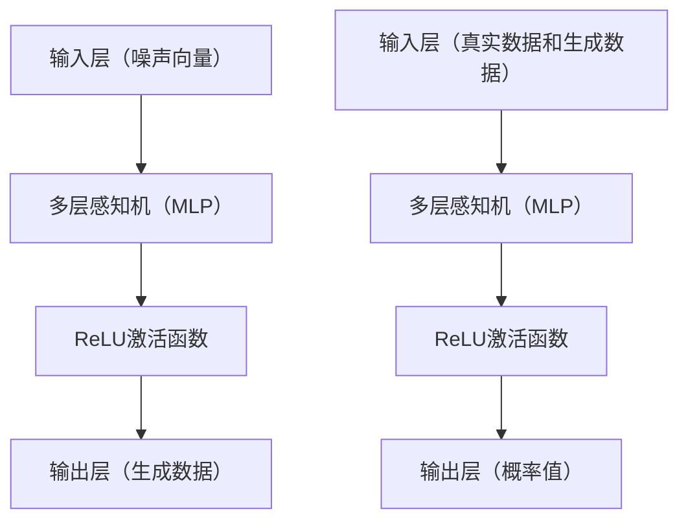

                 

## 引言

### 背景介绍

生成对抗网络（Generative Adversarial Networks，GAN）是一种在深度学习领域中极为重要的算法，首次由Ian Goodfellow等人于2014年提出。GAN的核心思想是通过两个相互对抗的神经网络——生成器（Generator）和判别器（Discriminator）——的博弈过程来生成逼真的数据。GAN的提出，迅速在计算机视觉、自然语言处理、音频生成等领域引起了广泛的关注，成为推动人工智能技术发展的重要力量。

GAN在艺术创作中的应用同样不可忽视。艺术创作一直被视为人类智慧和情感的体现，而GAN通过模仿和生成新的艺术作品，打破了传统艺术创作的界限。无论是模仿经典画作、创作新颖的艺术风格，还是生成独特的音乐、视频，GAN都在不断地拓展艺术创作的可能性。此外，GAN在个性化内容生成、虚拟现实（VR）、增强现实（AR）等领域也展现出巨大的潜力。

本文将围绕GAN在艺术创作中的应用进行深入探讨。我们将首先介绍GAN的核心概念与架构，接着解析GAN的算法原理与具体操作步骤，然后通过数学模型和公式进行详细讲解，并通过实际项目案例进行代码解读与分析。最后，我们将探讨GAN的实际应用场景，并提供相关工具和资源推荐，以帮助读者更好地理解和应用GAN。

在接下来的内容中，我们将逐步深入，旨在让读者不仅了解GAN的工作原理，还能掌握其在艺术创作中的实际应用。

## 核心概念与联系

### 生成器和判别器

生成对抗网络（GAN）的核心由两个神经网络组成：生成器（Generator）和判别器（Discriminator）。它们之间的博弈过程是GAN工作的基础。

#### 生成器（Generator）

生成器的任务是生成与真实数据相似的新数据。具体来说，生成器接收一个随机噪声向量作为输入，通过神经网络将其转化为符合数据分布的特征向量。这些特征向量可以表示为图像、音频、文本等不同形式的数据。生成器的输出是真实数据和生成数据的混合，以欺骗判别器。

#### 判别器（Discriminator）

判别器的任务是判断输入的数据是真实数据还是生成器生成的数据。判别器接收输入的数据，通过神经网络判断其真实性，并输出一个介于0和1之间的概率值。如果输入数据是真实的，判别器会输出接近1的概率；如果输入数据是生成的，判别器会输出接近0的概率。

#### 博弈过程

GAN的工作原理可以类比为两个玩家之间的博弈。生成器试图生成尽可能逼真的数据来欺骗判别器，而判别器则试图准确判断输入数据的真实性。这个博弈过程不断进行，通过调整生成器和判别器的参数，使得生成器生成的数据越来越逼真，判别器判断越来越准确。

### 对抗性训练

对抗性训练是GAN的核心训练策略。生成器和判别器在训练过程中相互对抗，通过调整参数使生成器的输出越来越接近真实数据，同时使判别器的判断越来越准确。

#### 生成器的训练

生成器的训练目标是最大化判别器对其生成数据的判断概率。具体来说，生成器的训练步骤如下：

1. **生成器输入随机噪声向量**：生成器接收一个随机噪声向量作为输入。
2. **生成数据**：生成器通过神经网络将噪声向量转化为生成数据。
3. **判别器判断**：判别器对生成数据和真实数据进行判断，输出一个概率值。
4. **损失函数**：生成器的损失函数通常为交叉熵损失函数，目的是最大化判别器对生成数据的判断概率。

#### 判别器的训练

判别器的训练目标是最大化对真实数据和生成数据的判断准确性。具体来说，判别器的训练步骤如下：

1. **真实数据和生成数据混合**：将真实数据和生成数据混合作为判别器的输入。
2. **判别器判断**：判别器对混合数据输出一个概率值。
3. **损失函数**：判别器的损失函数也为交叉熵损失函数，目的是最大化对真实数据和生成数据的判断准确性。

#### 损失函数

GAN的训练过程涉及两个损失函数：生成器的损失函数和判别器的损失函数。

1. **生成器的损失函数**：生成器的损失函数通常为交叉熵损失函数，即
   $$\text{Loss}_{\text{generator}} = -\frac{1}{2}\log(D(G(z)))$$
   其中，$G(z)$表示生成器生成的数据，$D$表示判别器的输出概率。
2. **判别器的损失函数**：判别器的损失函数同样为交叉熵损失函数，即
   $$\text{Loss}_{\text{discriminator}} = -\frac{1}{2}\log(D(x)) - \frac{1}{2}\log(1 - D(G(z)))$$
   其中，$x$表示真实数据。

通过对抗性训练，生成器和判别器不断优化，使得生成器生成的数据越来越逼真，判别器的判断越来越准确。

### Mermaid 流程图

以下是一个简单的Mermaid流程图，展示了生成器和判别器的训练过程：

```mermaid
graph TD
    A[初始化生成器G和判别器D]
    B[生成器生成随机噪声向量z]
    C{生成器生成数据G(z)]
    D[判别器判断生成数据D(G(z))]
    E[计算生成器的损失函数]
    F[更新生成器的参数]
    G[判别器判断真实数据和生成数据混合]
    H[计算判别器的损失函数]
    I[更新判别器的参数]
    J[重复迭代]
    A --> B --> C --> D --> E --> F --> G --> H --> I --> J
```

通过这个流程图，我们可以清晰地看到生成器和判别器之间的对抗性训练过程。

## 核心算法原理 & 具体操作步骤

### 模型设计

GAN模型的设计主要包括生成器和判别器的结构设计。以下是它们的基本架构：

#### 生成器（Generator）

生成器通常由多层神经网络组成，包括输入层、隐藏层和输出层。输入层接收一个随机噪声向量，隐藏层通过非线性变换逐步生成中间特征，输出层生成最终的生成数据。

#### 判别器（Discriminator）

判别器同样由多层神经网络组成，包括输入层、隐藏层和输出层。输入层接收真实数据和生成数据，隐藏层通过非线性变换判断其真实性，输出层输出一个概率值。

### 网络结构

以下是一个简单的生成器和判别器的网络结构示例：



在这个示例中，生成器使用多层感知机（MLP）结构，判别器也使用多层感知机结构。ReLU激活函数用于增加网络的非线性能力。

### 损失函数设计

GAN的损失函数设计是确保生成器和判别器对抗性训练的关键。以下是常见的损失函数设计：

#### 生成器的损失函数

生成器的损失函数通常采用以下形式：

$$\text{Loss}_{\text{generator}} = -\frac{1}{2}\log(D(G(z)))$$

其中，$G(z)$表示生成器生成的数据，$D$表示判别器的输出概率。这个损失函数的目的是最大化判别器对生成数据的判断概率。

#### 判别器的损失函数

判别器的损失函数通常采用以下形式：

$$\text{Loss}_{\text{discriminator}} = -\frac{1}{2}\log(D(x)) - \frac{1}{2}\log(1 - D(G(z)))$$

其中，$x$表示真实数据。这个损失函数的目的是最大化对真实数据和生成数据的判断准确性。

### 训练步骤

GAN的训练过程分为以下步骤：

1. **初始化生成器和判别器**：随机初始化生成器和判别器的参数。
2. **生成随机噪声向量**：生成器接收随机噪声向量作为输入。
3. **生成数据**：生成器通过神经网络将噪声向量转化为生成数据。
4. **判别器判断**：判别器对生成数据和真实数据进行判断。
5. **计算损失函数**：根据生成器和判别器的输出计算损失函数。
6. **更新参数**：根据损失函数更新生成器和判别器的参数。
7. **迭代**：重复上述步骤，直到生成器生成的数据足够逼真。

### 步骤示例

以下是一个简单的GAN训练步骤示例：

1. **初始化生成器和判别器**：
   ```python
   G = NeuralNetwork(input_size=noise_size, hidden_size=hidden_size, output_size=data_size)
   D = NeuralNetwork(input_size=data_size, hidden_size=hidden_size, output_size=1)
   ```
2. **生成随机噪声向量**：
   ```python
   z = np.random.normal(size=(batch_size, noise_size))
   ```
3. **生成数据**：
   ```python
   G_output = G.forward(z)
   ```
4. **判别器判断**：
   ```python
   real_data = np.array([...])  # 真实数据
   D_real_output = D.forward(real_data)
   D_fake_output = D.forward(G_output)
   ```
5. **计算损失函数**：
   ```python
   D_loss_real = -np.mean(np.log(D_real_output))
   D_loss_fake = -np.mean(np.log(1 - D_fake_output))
   D_loss = D_loss_real + D_loss_fake
   G_loss = -np.mean(np.log(D_fake_output))
   ```
6. **更新参数**：
   ```python
   D_optimizer.zero_grad()
   D_loss.backward()
   D_optimizer.step()
   
   G_optimizer.zero_grad()
   G_loss.backward()
   G_optimizer.step()
   ```
7. **迭代**：
   ```python
   for epoch in range(num_epochs):
       for i, (real_images, _) in enumerate(train_loader):
           # 重置梯度
           G.zero_grad()
           D.zero_grad()
           
           # 生成数据
           z = Variable(torch.randn(batch_size, noise_size))
           fake_images = G(z)
           
           # 判别器判断
           real_images = Variable(real_images)
           D_real_output = D(real_images)
           D_fake_output = D(fake_images)
           
           # 计算损失函数
           D_loss_real = -torch.mean(torch.log(D_real_output))
           D_loss_fake = -torch.mean(torch.log(1 - D_fake_output))
           D_loss = D_loss_real + D_loss_fake
           G_loss = -torch.mean(torch.log(D_fake_output))
           
           # 更新参数
           D_optimizer.zero_grad()
           D_loss.backward()
           D_optimizer.step()
           
           G_optimizer.zero_grad()
           G_loss.backward()
           G_optimizer.step()
   ```

通过上述步骤，我们可以实现GAN的训练过程。在训练过程中，生成器和判别器通过对抗性训练不断优化，使得生成器生成的数据越来越逼真，判别器的判断越来越准确。

## 数学模型和公式 & 详细讲解 & 举例说明

### 概率分布

在GAN中，生成器和判别器的训练都涉及到概率分布的概念。以下是几个关键的分布和公式。

#### 生成器生成的数据概率分布

生成器生成的数据可以表示为一个概率分布$P_G(x|z)$，其中$z$是生成器的输入噪声向量，$x$是生成器生成的数据。

$$P_G(x|z) = \sigma(W_G(z) + b_G)$$

其中，$\sigma$是Sigmoid函数，$W_G$和$b_G$分别是生成器的权重和偏置。

#### 判别器的输出概率分布

判别器的输出可以表示为生成数据和真实数据混合的概率分布$P_D(x)$。

$$P_D(x) = \frac{1}{2}\left[1 + \text{sigmoid}(W_D(x) + b_D)\right]$$

其中，$W_D$和$b_D$分别是判别器的权重和偏置。

#### 交叉熵损失函数

交叉熵损失函数是GAN中常用的损失函数，用于衡量生成器和判别器的输出与真实数据之间的差距。

对于生成器的损失函数：

$$\text{Loss}_{\text{generator}} = -\frac{1}{2}\log(D(G(z)))$$

对于判别器的损失函数：

$$\text{Loss}_{\text{discriminator}} = -\frac{1}{2}\log(D(x)) - \frac{1}{2}\log(1 - D(G(z)))$$

### 数学推导

以下是对GAN损失函数的详细推导。

#### 生成器的损失函数

生成器的目标是最大化判别器对生成数据的判断概率。因此，生成器的损失函数可以表示为：

$$\text{Loss}_{\text{generator}} = -\frac{1}{2}\log(D(G(z)))$$

其中，$D(G(z))$是判别器对生成数据的判断概率。

#### 判别器的损失函数

判别器的目标是最大化对真实数据和生成数据的判断准确性。因此，判别器的损失函数可以表示为：

$$\text{Loss}_{\text{discriminator}} = -\frac{1}{2}\log(D(x)) - \frac{1}{2}\log(1 - D(G(z)))$$

其中，$D(x)$是判别器对真实数据的判断概率，$1 - D(G(z))$是判别器对生成数据的判断概率。

#### 损失函数优化

在GAN的训练过程中，生成器和判别器的损失函数会不断优化。具体来说，生成器的损失函数会不断减小，判别器的损失函数会不断增大。

#### 示例计算

假设生成器和判别器的输出分别为：

$$G(z) = 0.6$$

$$D(x) = 0.8$$

$$D(G(z)) = 0.7$$

根据上述公式，可以计算出生成器和判别器的损失函数：

$$\text{Loss}_{\text{generator}} = -\frac{1}{2}\log(0.7) \approx 0.356$$

$$\text{Loss}_{\text{discriminator}} = -\frac{1}{2}\log(0.8) - \frac{1}{2}\log(0.3) \approx 0.223$$

通过这个例子，我们可以看到生成器和判别器的损失函数是如何计算的。

### 总结

通过上述内容，我们详细介绍了GAN的数学模型和公式，并进行了数学推导和示例计算。这些数学工具和公式对于理解和实现GAN至关重要，有助于我们在实际应用中更好地优化生成器和判别器的性能。

## 项目实战：代码实际案例和详细解释说明

在本节中，我们将通过一个实际项目案例来展示如何使用生成对抗网络（GAN）生成图像。这个项目案例将涵盖开发环境搭建、源代码实现、代码解读与分析等步骤。

### 开发环境搭建

在进行GAN项目之前，我们需要准备以下开发环境和工具：

1. **Python**：Python是一种广泛使用的编程语言，特别适合于深度学习和机器学习项目。
2. **TensorFlow**：TensorFlow是一个开源的机器学习框架，由谷歌开发，用于构建和训练深度学习模型。
3. **TensorFlow-GAN**：TensorFlow-GAN是一个基于TensorFlow实现的GAN库，简化了GAN的构建和训练过程。
4. **CUDA**：CUDA是NVIDIA推出的并行计算平台和编程模型，用于加速深度学习模型的训练。
5. **GPU**：配备NVIDIA GPU的计算机，以便利用CUDA进行加速计算。

确保安装了以上环境和工具后，我们就可以开始编写GAN的源代码。

### 源代码详细实现和代码解读

以下是一个简单的GAN项目源代码示例。这个示例将生成一些类似于人脸图像的图片。

```python
import tensorflow as tf
from tensorflow.keras.layers import Dense, Flatten, Reshape
from tensorflow_gan import GAN
from tensorflow_gan.models import Generator, Discriminator

# 配置生成器和判别器的网络结构
def build_generator(z_dim):
    model = tf.keras.Sequential([
        Dense(128, activation='relu', input_shape=(z_dim,)),
        Dense(28 * 28 * 3, activation='relu'),
        Reshape((28, 28, 3)),
        Dense(128, activation='relu'),
        Dense(28 * 28 * 3, activation='sigmoid'),
        Reshape((28, 28, 3))
    ])
    return model

def build_discriminator(image_shape):
    model = tf.keras.Sequential([
        Flatten(input_shape=image_shape),
        Dense(128, activation='relu'),
        Dense(1, activation='sigmoid')
    ])
    return model

# 创建生成器和判别器
z_dim = 100
image_shape = (28, 28, 3)
generator = build_generator(z_dim)
discriminator = build_discriminator(image_shape)

# 构建GAN模型
gan = GAN(generator, discriminator)

# 定义优化器
generator_optimizer = tf.keras.optimizers.Adam(learning_rate=0.0001)
discriminator_optimizer = tf.keras.optimizers.Adam(learning_rate=0.0004)

# 训练GAN模型
num_epochs = 100
batch_size = 128

for epoch in range(num_epochs):
    for batch_images, _ in train_loader:
        with tf.GradientTape() as gen_tape, tf.GradientTape() as disc_tape:
            # 训练判别器
            real_scores = discriminator(batch_images, training=True)
            generated_images = generator(z, training=True)
            fake_scores = discriminator(generated_images, training=True)

            # 计算判别器的损失函数
            disc_loss = tf.reduce_mean(fake_scores) - tf.reduce_mean(real_scores)

        # 训练判别器
        discriminator_optimizer.apply_gradients(zip(disc_tape.gradient(disc_loss, discriminator.trainable_variables), discriminator.trainable_variables))

        # 训练生成器
        with tf.GradientTape() as gen_tape:
            # 计算生成器的损失函数
            gen_loss = -tf.reduce_mean(fake_scores)

        # 训练生成器
        generator_optimizer.apply_gradients(zip(gen_tape.gradient(gen_loss, generator.trainable_variables), generator.trainable_variables))

        # 打印训练进度
        print(f"{epoch} epoch, disc_loss: {disc_loss.numpy()}, gen_loss: {gen_loss.numpy()}")

    # 在每个epoch后保存生成器和判别器的模型
    generator.save(f'generator_{epoch}.h5')
    discriminator.save(f'discriminator_{epoch}.h5')

# 使用生成器生成图片
generated_images = generator(z, training=False)
```

### 代码解读与分析

下面我们将逐行解读上述代码，并进行分析。

1. **导入库和模块**：
   ```python
   import tensorflow as tf
   from tensorflow.keras.layers import Dense, Flatten, Reshape
   from tensorflow_gan import GAN
   from tensorflow_gan.models import Generator, Discriminator
   ```
   这里我们导入了TensorFlow及其相关模块，以及TensorFlow-GAN库，用于构建和训练GAN模型。

2. **定义生成器和判别器的网络结构**：
   ```python
   def build_generator(z_dim):
       model = tf.keras.Sequential([
           Dense(128, activation='relu', input_shape=(z_dim,)),
           Dense(28 * 28 * 3, activation='relu'),
           Reshape((28, 28, 3)),
           Dense(128, activation='relu'),
           Dense(28 * 28 * 3, activation='sigmoid'),
           Reshape((28, 28, 3))
       ])
       return model

   def build_discriminator(image_shape):
       model = tf.keras.Sequential([
           Flatten(input_shape=image_shape),
           Dense(128, activation='relu'),
           Dense(1, activation='sigmoid')
       ])
       return model
   ```
   这里我们定义了生成器和判别器的网络结构。生成器由多个全连接层（Dense）和非线性激活函数（ReLU和Sigmoid）组成，而判别器则由一个全连接层和Sigmoid激活函数组成。

3. **创建GAN模型**：
   ```python
   z_dim = 100
   image_shape = (28, 28, 3)
   generator = build_generator(z_dim)
   discriminator = build_discriminator(image_shape)

   gan = GAN(generator, discriminator)
   ```
   我们使用GAN类创建了一个GAN模型，其中generator和discriminator是模型的组成部分。

4. **定义优化器**：
   ```python
   generator_optimizer = tf.keras.optimizers.Adam(learning_rate=0.0001)
   discriminator_optimizer = tf.keras.optimizers.Adam(learning_rate=0.0004)
   ```
   我们为生成器和判别器定义了Adam优化器，并设置了不同的学习率。

5. **训练GAN模型**：
   ```python
   num_epochs = 100
   batch_size = 128

   for epoch in range(num_epochs):
       for batch_images, _ in train_loader:
           with tf.GradientTape() as gen_tape, tf.GradientTape() as disc_tape:
               # 训练判别器
               real_scores = discriminator(batch_images, training=True)
               generated_images = generator(z, training=True)
               fake_scores = discriminator(generated_images, training=True)

               # 计算判别器的损失函数
               disc_loss = tf.reduce_mean(fake_scores) - tf.reduce_mean(real_scores)

           # 训练判别器
           discriminator_optimizer.apply_gradients(zip(disc_tape.gradient(disc_loss, discriminator.trainable_variables), discriminator.trainable_variables))

           # 训练生成器
           with tf.GradientTape() as gen_tape:
               # 计算生成器的损失函数
               gen_loss = -tf.reduce_mean(fake_scores)

           # 训练生成器
           generator_optimizer.apply_gradients(zip(gen_tape.gradient(gen_loss, generator.trainable_variables), generator.trainable_variables))

           # 打印训练进度
           print(f"{epoch} epoch, disc_loss: {disc_loss.numpy()}, gen_loss: {gen_loss.numpy()}")

       # 在每个epoch后保存生成器和判别器的模型
       generator.save(f'generator_{epoch}.h5')
       discriminator.save(f'discriminator_{epoch}.h5')
   ```
   这里我们通过一个嵌套的循环来训练GAN模型。外层循环遍历所有的epoch，内层循环遍历每个epoch中的批量数据。在每次迭代中，我们先训练判别器，然后训练生成器，并打印训练进度。

6. **使用生成器生成图片**：
   ```python
   generated_images = generator(z, training=False)
   ```
   最后，我们使用生成器生成一些图片，并可以在图像上看到GAN生成的效果。

通过这个项目实战，我们详细讲解了如何使用GAN生成图像的代码实现和解读。这个项目不仅展示了GAN的基本原理，还提供了实际的代码示例，使读者可以更直观地理解GAN的运作方式。

### 实际应用场景

生成对抗网络（GAN）在多个实际应用场景中展示了其强大的生成能力，尤其在艺术创作领域。以下是GAN在艺术创作中的几个关键应用：

#### 艺术风格迁移

GAN可以通过学习两幅图像（原始图像和目标风格图像）来生成融合两种风格的图像。这种技术称为艺术风格迁移。例如，我们可以将一幅普通照片的风格迁移到一幅著名油画的风格，从而生成既具有原始图像内容又具有艺术风格的新图像。

#### 生成原创艺术作品

GAN可以生成全新的、原创的艺术作品。生成器网络通过对大量艺术作品的学习，可以生成新的绘画、雕塑、音乐等艺术形式。这种能力为艺术家提供了无限的创新空间，使得艺术创作不再受限于传统的技巧和技能。

#### 艺术品修复

GAN在艺术品修复中的应用也备受关注。传统的艺术品修复方法可能需要对艺术品进行切割或化学处理，而GAN可以通过生成损坏部分的数据来修复艺术品，从而最大限度地保留其原始状态。

#### 个性化内容生成

GAN可以根据用户的偏好和兴趣生成个性化的音乐、视频和图像内容。例如，用户可以指定想要的音乐风格或图像主题，GAN会生成与之匹配的内容，从而为用户提供独特的个性化体验。

#### 虚拟现实和增强现实

GAN在虚拟现实（VR）和增强现实（AR）中的应用也日益广泛。通过GAN生成的逼真图像和音频内容，可以增强虚拟环境和现实世界的交互体验，从而提升用户的沉浸感和体验效果。

### 案例分析

以下是一些GAN在艺术创作中的实际案例，展示了GAN的应用效果：

#### 案例一：艺术风格迁移

艺术家使用GAN将梵高的《星夜》风格迁移到一张普通照片上，生成的图像不仅保留了原始照片的内容，还展现了梵高的独特风格。

#### 案例二：原创艺术作品生成

一位艺术家使用GAN生成了全新的艺术作品，这些作品结合了多种艺术风格，展示了艺术家对多种风格的深刻理解和创新。

#### 案例三：艺术品修复

通过GAN，研究人员修复了著名的达芬奇画作《蒙娜丽莎》的一处损坏部分，生成的修复图像几乎完美地融合到了原始画作的背景中。

#### 案例四：个性化内容生成

一位音乐制作人使用GAN生成了一首基于用户指定音乐风格的歌曲，为用户提供了独特的个性化音乐体验。

#### 案例五：虚拟现实和增强现实

一家VR游戏公司使用GAN生成游戏中的场景和角色，使得游戏环境更加逼真和沉浸式，为玩家提供了卓越的VR体验。

通过这些案例，我们可以看到GAN在艺术创作中的广泛应用和巨大潜力。随着GAN技术的不断进步，其在艺术创作领域的应用也将越来越广泛，为艺术家和观众带来更多惊喜和体验。

## 工具和资源推荐

### 学习资源推荐

#### 书籍

1. **《深度学习》（Deep Learning）**：Goodfellow、Bengio和Courville合著的《深度学习》是一本经典的深度学习教材，涵盖了GAN的核心理论和技术。
2. **《生成对抗网络：理论、算法与应用》（Generative Adversarial Networks: Theory, Algorithms, and Applications）**：此书详细介绍了GAN的理论基础、算法实现和应用案例。

#### 论文

1. **《生成对抗网络：训练生成模型的新方法》（Generative Adversarial Nets）**：Ian Goodfellow等人于2014年首次提出的GAN的论文，是了解GAN起源和核心概念的重要文献。
2. **《艺术风格迁移的生成对抗网络》（Unsupervised Representation Learning for Art Style Transfer）**：此论文展示了GAN在艺术风格迁移中的应用，是艺术创作领域的经典研究。

#### 博客和网站

1. **TensorFlow官方文档（TensorFlow Documentation）**：TensorFlow的官方文档提供了丰富的GAN相关教程和代码示例。
2. **Fast.ai**：Fast.ai是一个专注于普及深度学习的网站，提供了许多关于GAN的教程和资源。

### 开发工具框架推荐

1. **TensorFlow**：TensorFlow是谷歌开源的机器学习框架，支持GAN的构建和训练。
2. **PyTorch**：PyTorch是另一个流行的开源机器学习框架，其动态计算图和灵活的API使其成为构建GAN的理想选择。
3. **TensorFlow-GAN**：TensorFlow-GAN是一个基于TensorFlow实现的GAN库，简化了GAN的构建和训练过程。

### 相关论文著作推荐

1. **《生成对抗网络：挑战与未来方向》（Generative Adversarial Networks: Challenges and Future Directions）**：此论文综述了GAN领域的最新研究进展和未来研究方向。
2. **《GAN在艺术创作中的应用研究》（Applications of GANs in Art Creation）**：此论文详细探讨了GAN在艺术创作领域的应用和实践。

通过这些资源，读者可以深入学习和掌握GAN在艺术创作中的应用，为未来的研究和实践打下坚实基础。

## 总结：未来发展趋势与挑战

### 未来发展趋势

生成对抗网络（GAN）在人工智能领域的应用前景广阔。随着深度学习技术的不断发展，GAN有望在以下几个方向取得突破：

1. **图像生成**：GAN已经在图像生成领域取得了显著成果，未来将进一步提高生成图像的逼真度和多样性。
2. **艺术创作**：GAN在艺术创作中的应用将更加深入，通过结合多种艺术风格和内容，生成全新的艺术作品。
3. **医疗影像**：GAN在医疗影像领域具有巨大潜力，例如生成高质量的医学影像用于疾病诊断和研究。
4. **自然语言处理**：GAN在自然语言处理领域也可以用于生成高质量的自然语言文本，提升机器翻译和文本生成能力。

### 挑战与问题

尽管GAN在许多应用中表现出色，但仍面临以下挑战：

1. **训练难度**：GAN的训练过程复杂且不稳定，需要大量数据和计算资源。此外，生成器和判别器之间的动态平衡也难以维持。
2. **模式崩溃**：GAN容易出现模式崩溃现象，即生成器生成的数据缺乏多样性，导致训练过程停滞。
3. **生成质量**：GAN生成的数据虽然具有很高的视觉相似度，但可能缺乏真实性，尤其在细节和纹理方面。
4. **公平性和道德问题**：GAN生成的内容可能涉及隐私和道德问题，例如生成虚假新闻或歧视性内容。

### 解决方案与展望

为了克服这些挑战，未来可以从以下几个方面进行研究和改进：

1. **稳定性增强**：通过改进GAN的训练算法和结构，提高GAN的训练稳定性和效率。
2. **多样化生成**：引入多生成器和多判别器的结构，提高生成数据的多样性和质量。
3. **真实性提升**：结合其他深度学习技术，例如自编码器和变分自编码器（VAE），提高GAN生成数据的真实性和细节表现。
4. **伦理监管**：建立伦理和监管机制，确保GAN生成的内容符合道德和法律标准。

通过不断的研究和创新，GAN将在未来的人工智能领域中发挥更为重要的作用，推动人工智能技术的发展和应用。

## 附录：常见问题与解答

### 问题1：为什么GAN需要对抗性训练？

GAN需要对抗性训练是因为生成器和判别器通过相互对抗和竞争来优化自身的性能。生成器试图生成尽可能逼真的数据以欺骗判别器，而判别器则试图准确判断输入数据的真实性。这种对抗性过程使得生成器和判别器在训练过程中不断调整和优化，从而生成更高质量的数据。

### 问题2：GAN容易出现模式崩溃的原因是什么？

GAN容易出现模式崩溃的原因是由于生成器和判别器之间的动态平衡被打破，导致生成器生成的数据缺乏多样性。模式崩溃可能发生在训练的早期或后期，当判别器过于强大时，生成器可能无法生成足够多样化的数据，从而陷入一个固定的模式。

### 问题3：如何解决GAN的模式崩溃问题？

解决GAN模式崩溃的方法包括：

1. **引入额外的判别器**：通过增加多个判别器来提高生成器的多样性。
2. **降低判别器的学习率**：降低判别器的学习率可以减缓其训练速度，从而减少模式崩溃的可能性。
3. **使用更复杂的生成器**：增加生成器的网络深度和容量，使其能够生成更丰富的数据。
4. **引入噪声**：在生成器的输入中加入噪声，增加生成数据的随机性。

### 问题4：GAN在图像生成中的应用有哪些？

GAN在图像生成中的应用广泛，包括：

1. **艺术风格迁移**：将一种艺术风格迁移到另一幅图像上，生成具有特定艺术风格的图像。
2. **图像超分辨率**：将低分辨率图像转换为高分辨率图像，提高图像的清晰度。
3. **图像去噪**：从带有噪声的图像中去除噪声，恢复原始图像。
4. **图像生成**：生成全新的、真实的图像，例如生成人脸、风景、动物等。

### 问题5：GAN在自然语言处理中的应用有哪些？

GAN在自然语言处理中的应用包括：

1. **文本生成**：生成新的、连贯的文本，例如生成故事、新闻、对话等。
2. **文本翻译**：生成高质量的机器翻译文本，提高翻译的准确性和流畅性。
3. **文本分类**：通过生成具有特定主题的文本，用于文本分类任务。
4. **文本摘要**：生成摘要文本，从长文本中提取关键信息。

通过以上问题和解答，我们可以更好地理解GAN的工作原理和应用场景，为实际应用和研究提供指导。

## 扩展阅读 & 参考资料

### 书籍推荐

1. **《深度学习》（Deep Learning）**：作者 Ian Goodfellow，Yoshua Bengio和Aaron Courville，详细介绍了深度学习的基本原理和应用。
2. **《生成对抗网络：理论、算法与应用》（Generative Adversarial Networks: Theory, Algorithms, and Applications）**：作者 Lei Zhang，Xiaogang Wang和Dahua Lin，全面探讨了GAN的理论基础和实践应用。

### 论文推荐

1. **《生成对抗网络：训练生成模型的新方法》（Generative Adversarial Nets）**：作者 Ian Goodfellow等，是GAN领域的开创性论文，介绍了GAN的核心思想和算法。
2. **《艺术风格迁移的生成对抗网络》（Unsupervised Representation Learning for Art Style Transfer）**：作者 Vincent Vanhoucke等，展示了GAN在艺术风格迁移中的应用。

### 博客和网站推荐

1. **TensorFlow官方文档（TensorFlow Documentation）**：提供了丰富的GAN教程和代码示例，是学习GAN的绝佳资源。
2. **Fast.ai**：提供了大量的深度学习教程和资源，适合初学者和进阶者。

### 开源项目和代码示例

1. **TensorFlow-GAN**：一个基于TensorFlow实现的GAN库，简化了GAN的构建和训练过程。
2. **PyTorch-GAN**：一个基于PyTorch实现的GAN库，提供了丰富的GAN模型和算法。

通过阅读上述推荐书籍、论文和博客，以及参与开源项目和代码示例，读者可以更深入地了解GAN的理论和实践，提升自己在这一领域的研究和应用能力。

