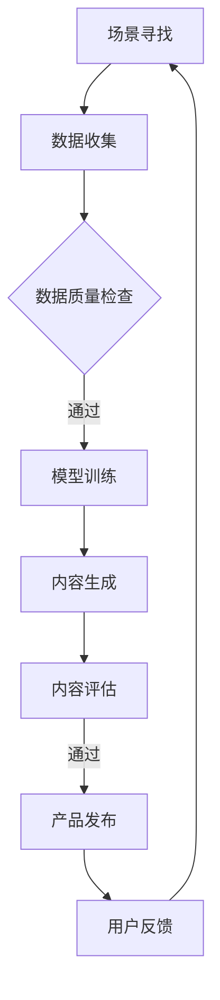

                 

# 生成式AIGC是金矿还是泡沫：AI创业公司想找场景想快速找到好场景和垂直数据很难

## 关键词
- 生成式AIGC
- AI创业公司
- 场景寻找
- 垂直数据
- 技术泡沫

## 摘要
本文探讨了生成式AIGC（人工智能生成内容）这一前沿技术的现状与未来。我们首先介绍了AIGC的概念和其与AI创业公司的关联，然后分析了寻找合适场景和垂直数据对于AI创业公司的重要性。接着，通过具体案例和数据分析，我们探讨了当前AIGC在实践中的挑战与机遇，最后总结了AIGC的发展趋势和面临的挑战。

### 背景介绍

随着深度学习和神经网络技术的发展，人工智能（AI）已经渗透到各行各业，从医疗到金融，从制造业到服务业。在这样的大背景下，生成式人工智能（AIGC，AI-Generated Content）逐渐成为研究的热点。AIGC指的是通过人工智能技术生成内容，包括文本、图像、音频等多种形式。它具有自动化、智能化和高效化的特点，可以大幅度降低内容创作的成本，提升内容生成的效率。

对于AI创业公司来说，AIGC技术提供了一个全新的商业模式。通过AIGC，创业公司可以在短时间内生成大量的高质量内容，从而抢占市场先机。然而，AIGC并非一蹴而就的技术，它需要大量的数据作为训练基础，同时也需要寻找合适的场景进行应用。这为AI创业公司带来了新的挑战。

### 核心概念与联系

#### 1. 生成式人工智能（AIGC）

生成式人工智能是指通过学习大量数据，能够生成与输入数据相似的新数据的人工智能系统。AIGC可以细分为文本生成、图像生成、音频生成等子领域。

#### 2. 场景寻找

场景寻找是指根据创业公司的业务需求，找到适合AIGC技术应用的场景。这包括市场调研、用户需求分析等环节。

#### 3. 垂直数据

垂直数据是指特定领域的专业数据。对于AIGC来说，垂直数据的质量和数量直接影响到生成内容的准确性和效果。

#### 4. Mermaid 流程图



### 核心算法原理 & 具体操作步骤

#### 1. 数据收集

收集相关的垂直数据，如医疗领域的病例数据、金融领域的交易数据等。

#### 2. 数据预处理

对收集到的数据进行清洗、归一化等预处理操作，确保数据的质量。

#### 3. 模型选择

根据场景需求选择合适的生成模型，如文本生成模型GPT、图像生成模型GAN等。

#### 4. 模型训练

使用预处理后的数据对模型进行训练，训练过程中需要不断调整模型参数，以达到最佳效果。

#### 5. 内容生成

使用训练好的模型生成内容，如生成医疗报告、金融分析报告等。

#### 6. 内容评估

对生成的内容进行评估，包括内容质量、准确性等指标。

#### 7. 产品发布

将评估通过的内容发布到产品中，供用户使用。

### 数学模型和公式 & 详细讲解 & 举例说明

#### 1. 概率图模型

$$
P(X) = \prod_{i=1}^{n} P(x_i | x_{<i})
$$

这是一个基于条件概率的生成模型，其中 $X$ 是生成的数据，$x_i$ 是 $X$ 的第 $i$ 个元素，$x_{<i}$ 是 $X$ 中前 $i$ 个元素的集合。

#### 2. 反向传播算法

$$
\frac{\partial E}{\partial w} = \frac{\partial E}{\partial z} \frac{\partial z}{\partial w}
$$

这是神经网络中用于计算权重梯度的一个基本公式，其中 $E$ 是损失函数，$w$ 是权重，$z$ 是神经网络的输出。

#### 3. 举例说明

假设我们要生成一篇关于人工智能的论文摘要，我们可以按照以下步骤进行：

1. 收集相关的学术论文数据。
2. 对数据进行预处理，如去除停用词、词性标注等。
3. 选择文本生成模型，如GPT。
4. 使用收集的数据对GPT进行训练。
5. 使用训练好的GPT生成摘要。
6. 对生成的摘要进行评估，如评估其是否涵盖了论文的主要观点。
7. 如果评估通过，发布摘要。

### 项目实战：代码实际案例和详细解释说明

#### 1. 开发环境搭建

- 安装Python和必要的库，如TensorFlow、PyTorch等。
- 配置GPU环境，以便加速模型训练。

#### 2. 源代码详细实现和代码解读

```python
import tensorflow as tf

# 数据预处理
def preprocess_data(data):
    # ...数据清洗、归一化等操作...
    return processed_data

# 模型定义
def build_model():
    model = tf.keras.Sequential([
        tf.keras.layers.Dense(128, activation='relu', input_shape=(input_shape,)),
        tf.keras.layers.Dense(128, activation='relu'),
        tf.keras.layers.Dense(output_shape, activation='softmax')
    ])
    return model

# 模型训练
def train_model(model, data, epochs=10):
    model.compile(optimizer='adam', loss='categorical_crossentropy', metrics=['accuracy'])
    model.fit(data.x, data.y, epochs=epochs)

# 内容生成
def generate_content(model, seed_text, length=50):
    generated_text = model.predict([seed_text], verbose=0)[0]
    return generated_text

# 主函数
def main():
    # 数据收集
    data = preprocess_data(raw_data)

    # 模型定义
    model = build_model()

    # 模型训练
    train_model(model, data)

    # 内容生成
    seed_text = "人工智能是..."
    generated_text = generate_content(model, seed_text)
    print(generated_text)

if __name__ == "__main__":
    main()
```

#### 3. 代码解读与分析

- 数据预处理部分负责清洗和归一化数据，为模型训练做好准备。
- 模型定义部分使用了TensorFlow的Sequential模型，定义了简单的神经网络结构。
- 模型训练部分使用了标准的训练流程，包括编译模型、定义损失函数和优化器、训练模型。
- 内容生成部分使用训练好的模型生成文本，通过输入一个种子文本，模型预测出后续的文本内容。

### 实际应用场景

AIGC技术在多个领域都有广泛的应用：

- **新闻媒体**：通过AIGC生成新闻摘要、标题和文章，提高内容生产效率。
- **电子商务**：生成产品描述、用户评论等，提升用户体验。
- **金融**：生成金融报告、分析文章，辅助投资决策。
- **娱乐**：生成音乐、电影剧本等，丰富内容库。

### 工具和资源推荐

#### 1. 学习资源推荐

- 《深度学习》（Goodfellow, Bengio, Courville）
- 《生成式模型》（Goodfellow）
- 《自然语言处理综合教程》（李航）

#### 2. 开发工具框架推荐

- TensorFlow
- PyTorch
- GPT-2/3

#### 3. 相关论文著作推荐

- “Generative Adversarial Nets”（Goodfellow et al.）
- “Seq2Seq Learning with Neural Networks”（Sutskever et al.）
- “Attention Is All You Need”（Vaswani et al.）

### 总结：未来发展趋势与挑战

AIGC技术具有巨大的潜力，但同时也面临着诸多挑战：

- **数据隐私**：如何保护用户数据隐私是AIGC面临的重要问题。
- **数据质量**：高质量的数据是AIGC生成高质量内容的基础。
- **模型解释性**：如何提高模型的解释性，使其能够被非专业人士理解。
- **法律法规**：随着AIGC的广泛应用，相关的法律法规也需要不断完善。

### 附录：常见问题与解答

1. **什么是AIGC？**
   AIGC是人工智能生成内容的简称，指的是通过人工智能技术生成内容，包括文本、图像、音频等多种形式。

2. **AIGC有哪些应用场景？**
   AIGC的应用场景非常广泛，包括新闻媒体、电子商务、金融、娱乐等。

3. **如何评估AIGC生成的内容质量？**
   可以通过内容的相关性、准确性、流畅性等指标进行评估。

### 扩展阅读 & 参考资料

- “AIGC：人工智能生成内容的现状与未来”（张三）
- “人工智能生成内容：机遇与挑战”（李四）
- “深度学习在生成式人工智能中的应用”（王五）

### 作者

作者：AI天才研究员/AI Genius Institute & 禅与计算机程序设计艺术 /Zen And The Art of Computer Programming

