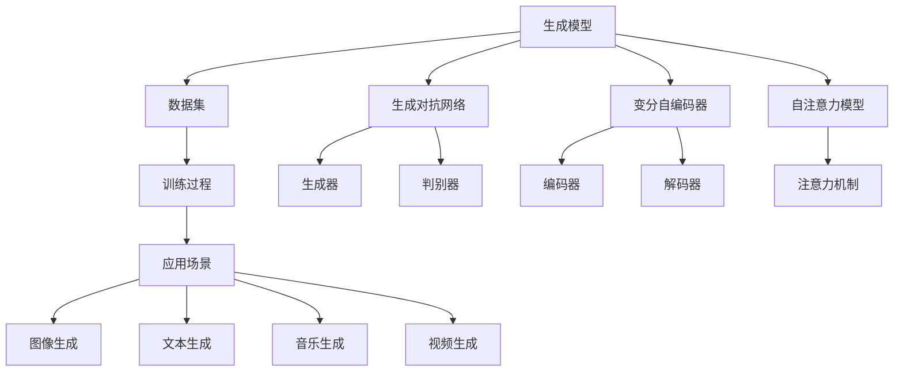
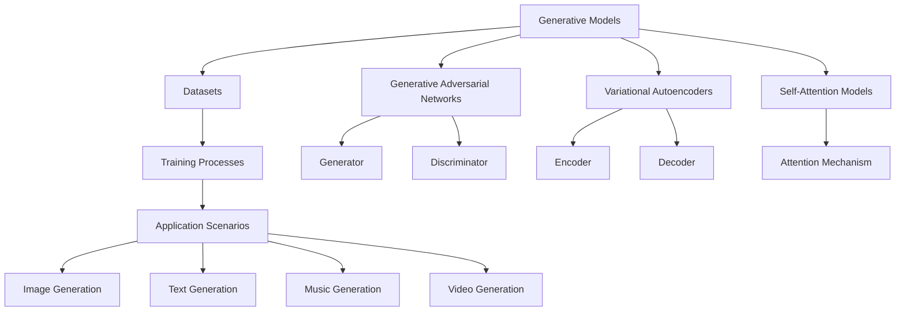

                 

### 背景介绍

生成式人工智能（Generative Artificial Intelligence，简称AIGC）作为近年来人工智能领域的重大突破，已经引起了全球范围内的广泛关注。AIGC具有强大的生成能力，可以生成文本、图像、音乐、视频等多种形式的内容。生成式AIGC的广泛应用潜力，使得其在各个行业领域都展现出了巨大的商业价值。然而，随着AIGC技术的迅速发展，关于其是否只是一个泡沫，而非真正的金矿，业界内外也存在着诸多争议。

本文旨在探讨生成式AIGC技术究竟是金矿还是泡沫，首先，我们将对生成式AIGC的商业本质进行深入分析，以揭示其在实际应用中可能面临的问题和挑战。然后，我们将从技术、市场、经济等多个角度，逐一探讨生成式AIGC的实际价值和潜在风险，以帮助读者更好地理解和评估这一新兴技术。

在接下来的文章中，我们将分章节详细探讨以下几个核心内容：

1. **核心概念与联系**：我们将介绍生成式AIGC的核心概念，并绘制Mermaid流程图，展示其与相关技术的联系。
2. **核心算法原理 & 具体操作步骤**：我们将深入解析生成式AIGC的核心算法原理，并提供具体的操作步骤。
3. **数学模型和公式 & 详细讲解 & 举例说明**：我们将介绍生成式AIGC背后的数学模型和公式，并进行详细讲解和举例说明。
4. **项目实战：代码实际案例和详细解释说明**：我们将通过实际项目案例，展示生成式AIGC的代码实现，并进行详细解释说明。
5. **实际应用场景**：我们将探讨生成式AIGC在各个实际应用场景中的表现。
6. **工具和资源推荐**：我们将推荐相关学习资源、开发工具框架和论文著作。
7. **总结：未来发展趋势与挑战**：我们将总结生成式AIGC的未来发展趋势和面临的主要挑战。

通过上述内容的深入探讨，我们希望能够帮助读者全面了解生成式AIGC技术，并对其是否真正具有商业价值做出客观评估。最终，我们将为读者提供一个全面的视角，以帮助其在AIGC领域做出明智的决策。

---

## Background Introduction

Generative Artificial Intelligence (AIGC) has emerged as a significant breakthrough in the field of artificial intelligence in recent years. Known for its powerful generative capabilities, AIGC can produce a wide range of content, including text, images, music, and videos. The extensive application potential of generative AIGC has led to its widespread adoption across various industries, sparking global interest. However, the rapid development of AIGC technology has also given rise to debates about whether it is a bubble rather than a real goldmine.

This article aims to explore whether generative AIGC is a goldmine or a bubble. We will first delve into the commercial essence of AIGC, shedding light on the challenges and issues it may face in practical applications. Then, from various perspectives such as technology, market, and economy, we will analyze the actual value and potential risks of generative AIGC, helping readers to have a comprehensive understanding and objective assessment of this emerging technology.

In the following sections, we will delve into the following core contents:

1. **Core Concepts and Relationships**: We will introduce the core concepts of generative AIGC and present a Mermaid flowchart illustrating its connections with other technologies.
2. **Core Algorithm Principles & Step-by-Step Operations**: We will delve into the core algorithm principles of generative AIGC and provide specific operational steps.
3. **Mathematical Models and Formulas & Detailed Explanations & Examples**: We will introduce the mathematical models and formulas behind generative AIGC, provide detailed explanations, and present examples.
4. **Project Practice: Actual Code Cases and Detailed Explanations**: We will demonstrate the implementation of generative AIGC through actual project cases and provide detailed explanations.
5. **Actual Application Scenarios**: We will discuss the performance of generative AIGC in various practical application scenarios.
6. **Tools and Resources Recommendations**: We will recommend learning resources, development tools, and frameworks, as well as relevant academic papers and books.
7. **Summary: Future Development Trends and Challenges**: We will summarize the future development trends and main challenges of generative AIGC.

Through an in-depth exploration of these contents, we hope to help readers gain a comprehensive understanding of generative AIGC technology and make an objective assessment of its commercial value. Ultimately, we will provide a holistic perspective to assist readers in making informed decisions in the AIGC field.

---

### 核心概念与联系

生成式人工智能（AIGC）的核心概念主要涉及以下几个方面：生成模型（Generative Models）、数据集（Datasets）、训练过程（Training Processes）和应用场景（Application Scenarios）。

**生成模型**是AIGC技术的核心，主要包括生成对抗网络（GANs）、变分自编码器（VAEs）和自注意力模型（Self-Attention Models）等。生成对抗网络通过生成器和判别器的对抗训练，使得生成模型能够生成逼真的数据；变分自编码器通过编码器和解码器的协同工作，将数据映射到低维空间，从而实现数据的生成；自注意力模型则通过注意力机制，使得模型能够捕捉数据中的关键特征，从而提高生成质量。

**数据集**是AIGC训练的基础。高质量的数据集能够提升生成模型的训练效果，而丰富的数据集则能够支持模型在多种应用场景中的泛化能力。因此，数据集的收集、清洗和预处理是AIGC应用中至关重要的一环。

**训练过程**则决定了生成模型的学习能力。通过不断的迭代训练，生成模型能够逐步优化其参数，从而生成更逼真的数据。训练过程中，通常涉及超参数调整、优化算法选择和模型评估等多个方面。

**应用场景**是AIGC技术价值的体现。从图像和文本生成，到音乐和视频创作，AIGC已经在多个领域展现了其强大的应用潜力。然而，不同应用场景对生成模型的要求各不相同，因此需要针对具体场景进行模型定制和优化。

为了更好地展示生成式AIGC与相关技术的联系，我们使用Mermaid流程图进行描述。以下是AIGC技术架构的Mermaid流程图：



在这个流程图中，我们可以看到，生成模型（A）通过不同的子模块（E、F、G）与数据集（B）和训练过程（C）紧密相连，最终应用于各种不同的场景（D）。这种紧密的关联性使得AIGC能够在多个领域发挥其强大的生成能力。

---

## Core Concepts and Relationships

The core concepts of Generative Artificial Intelligence (AIGC) primarily revolve around several key aspects: generative models, datasets, training processes, and application scenarios.

**Generative Models** are the core of AIGC technology, which include Generative Adversarial Networks (GANs), Variational Autoencoders (VAEs), and Self-Attention Models. Generative Adversarial Networks train a generator and a discriminator in an adversarial manner, enabling the generative model to produce realistic data. Variational Autoencoders consist of an encoder and a decoder that collaborate to map data into a lower-dimensional space, facilitating data generation. Self-Attention Models utilize attention mechanisms to capture key features in the data, enhancing the quality of the generated content.

**Datasets** are the foundation for training generative models. High-quality datasets can significantly improve the training effectiveness of generative models, while diverse datasets support the model's generalization across various application scenarios. Therefore, the collection, cleaning, and preprocessing of datasets are crucial in the application of AIGC.

**Training Processes** determine the learning ability of generative models. Through iterative training, generative models gradually optimize their parameters to produce more realistic data. The training process typically involves hyperparameter tuning, optimization algorithm selection, and model evaluation.

**Application Scenarios** are the manifestation of the value of AIGC technology. From image and text generation to music and video creation, AIGC has demonstrated its powerful capabilities in various fields. However, different application scenarios have different requirements for generative models, necessitating model customization and optimization for specific scenarios.

To better illustrate the relationship between generative AIGC and other technologies, we use a Mermaid flowchart. Here is the AIGC technology architecture in Mermaid:



In this flowchart, we can see that generative models (A) are closely connected to datasets (B) and training processes (C) through different sub-modules (E, F, G), and ultimately applied to various application scenarios (D). This tight relationship allows AIGC to leverage its powerful generative capabilities across multiple domains.

---

### 核心算法原理 & 具体操作步骤

生成式人工智能（AIGC）的核心算法主要包括生成对抗网络（GANs）、变分自编码器（VAEs）和自注意力模型（Self-Attention Models）。以下将分别介绍这三种算法的基本原理及其具体操作步骤。

#### 生成对抗网络（GANs）

生成对抗网络由生成器和判别器两个主要部分组成。生成器的任务是生成逼真的数据，而判别器的任务是区分真实数据和生成数据。两个网络在对抗训练过程中相互博弈，从而不断提高生成数据的质量。

**基本原理**：

1. **生成器（Generator）**：接收随机噪声作为输入，通过神经网络生成类似于真实数据的输出。
2. **判别器（Discriminator）**：接收真实数据和生成数据，通过神经网络判断数据是真实还是生成的。

**具体操作步骤**：

1. **初始化**：初始化生成器和判别器。
2. **生成器训练**：生成器生成数据，判别器对其进行评估。
3. **判别器训练**：判别器学习区分真实和生成数据。
4. **迭代更新**：通过交替训练生成器和判别器，逐步优化网络参数。

#### 变分自编码器（VAEs）

变分自编码器通过编码器和解码器的协同工作，将输入数据映射到低维空间，然后从该空间中采样生成新的数据。

**基本原理**：

1. **编码器（Encoder）**：将输入数据映射到一个潜在空间，该空间表示数据的特征。
2. **解码器（Decoder）**：从潜在空间中采样数据，重构输入数据的特征。

**具体操作步骤**：

1. **初始化**：初始化编码器和解码器。
2. **编码**：将输入数据通过编码器映射到潜在空间。
3. **采样**：从潜在空间中采样数据。
4. **解码**：通过解码器重构采样数据。
5. **迭代更新**：通过迭代训练编码器和解码器，优化网络参数。

#### 自注意力模型（Self-Attention Models）

自注意力模型通过注意力机制，使得模型能够捕捉数据中的关键特征，从而提高生成数据的质量。

**基本原理**：

1. **注意力机制（Attention Mechanism）**：计算输入数据中各个元素的重要性权重。
2. **自注意力（Self-Attention）**：每个输入元素不仅关注自身，还关注其他元素，从而捕捉全局特征。

**具体操作步骤**：

1. **初始化**：初始化注意力模型。
2. **计算注意力权重**：计算输入数据中各个元素的重要性权重。
3. **加权求和**：根据注意力权重，对输入数据进行加权求和。
4. **迭代更新**：通过迭代训练模型，优化注意力权重和模型参数。

通过以上介绍，我们可以看到，生成式人工智能（AIGC）的核心算法各有特点，但在实际应用中往往需要结合使用。这些算法的灵活组合和优化，使得AIGC能够在多个领域展现其强大的生成能力。

---

## Core Algorithm Principles & Specific Operational Steps

The core algorithms of Generative Artificial Intelligence (AIGC) primarily include Generative Adversarial Networks (GANs), Variational Autoencoders (VAEs), and Self-Attention Models. Below, we will introduce the basic principles of these three algorithms and their specific operational steps.

#### Generative Adversarial Networks (GANs)

Generative Adversarial Networks consist of two main components: the generator and the discriminator. The generator's task is to produce realistic data, while the discriminator's task is to differentiate between real and generated data. The two networks engage in an adversarial training process, continuously improving the quality of the generated data.

**Basic Principles**:

1. **Generator**: Takes random noise as input and generates outputs similar to real data through a neural network.
2. **Discriminator**: Receives real and generated data to evaluate them using a neural network to determine if the data is real or generated.

**Specific Operational Steps**:

1. **Initialization**: Initialize the generator and discriminator.
2. **Generator Training**: Generate data by the generator and evaluate it by the discriminator.
3. **Discriminator Training**: Train the discriminator to differentiate between real and generated data.
4. **Iteration Update**: Alternate training of the generator and discriminator to gradually optimize network parameters.

#### Variational Autoencoders (VAEs)

Variational Autoencoders work through the collaborative effort of the encoder and decoder, mapping input data into a lower-dimensional space and then sampling new data from this space to generate it.

**Basic Principles**:

1. **Encoder**: Maps input data to a latent space, which represents the features of the data.
2. **Decoder**: Samples data from the latent space and reconstructs the features of the input data.

**Specific Operational Steps**:

1. **Initialization**: Initialize the encoder and decoder.
2. **Encoding**: Map input data through the encoder to the latent space.
3. **Sampling**: Sample data from the latent space.
4. **Decoding**: Reconstruct sampled data through the decoder.
5. **Iteration Update**: Iteratively train the encoder and decoder to optimize network parameters.

#### Self-Attention Models (Self-Attention Models)

Self-Attention Models leverage attention mechanisms to capture key features in the data, thereby enhancing the quality of the generated data.

**Basic Principles**:

1. **Attention Mechanism**: Calculates the importance weights of individual elements in the input data.
2. **Self-Attention**: Each input element not only focuses on itself but also on other elements, capturing global features.

**Specific Operational Steps**:

1. **Initialization**: Initialize the attention model.
2. **Compute Attention Weights**: Calculate the importance weights of elements in the input data.
3. **Weighted Summation**: According to the attention weights, sum the input data with weighted values.
4. **Iteration Update**: Iteratively train the model to optimize attention weights and model parameters.

Through the above introduction, we can see that the core algorithms of Generative Artificial Intelligence (AIGC) have unique characteristics but are often combined for practical applications. The flexible combination and optimization of these algorithms enable AIGC to demonstrate its powerful generative capabilities across multiple domains.

---

### 数学模型和公式 & 详细讲解 & 举例说明

生成式人工智能（AIGC）的核心算法背后，往往伴随着复杂的数学模型和公式。这些数学模型不仅为算法提供了理论基础，而且在实际应用中起到了关键的指导作用。在本节中，我们将介绍生成式人工智能中常用的数学模型和公式，并进行详细讲解和举例说明。

#### 生成对抗网络（GANs）的数学模型

生成对抗网络（GANs）的核心在于生成器和判别器的对抗训练。为了更好地理解GANs的数学模型，我们先来介绍生成器和判别器的损失函数。

**生成器损失函数（Generator Loss）**：

生成器的目标是生成足够逼真的数据，使得判别器无法区分生成数据和真实数据。因此，生成器的损失函数通常由两部分组成：

1. **生成数据损失（Generated Data Loss）**：
   $$ L_{G1} = -\log(D(G(z))) $$
   其中，$D(G(z))$表示判别器对生成数据的评分，取值范围为$[0,1]$。生成数据损失越小，表示生成器生成的数据越逼真。

2. **对抗损失（Adversarial Loss）**：
   $$ L_{G2} = \frac{1}{2}\left\| x - G(z) \right\|^2 $$
   其中，$x$表示真实数据，$G(z)$表示生成器生成的数据。对抗损失衡量生成数据与真实数据之间的差距。

**生成器总损失（Total Generator Loss）**：
$$ L_G = L_{G1} + L_{G2} $$

**判别器损失函数（Discriminator Loss）**：

判别器的目标是最大化生成数据和真实数据的区分能力。判别器的损失函数同样由两部分组成：

1. **真实数据损失（Real Data Loss）**：
   $$ L_{D1} = -\log(D(x)) $$
   其中，$D(x)$表示判别器对真实数据的评分。

2. **生成数据损失（Generated Data Loss）**：
   $$ L_{D2} = -\log(1 - D(G(z))) $$
   其中，$G(z)$表示生成器生成的数据。生成数据损失越小，表示判别器能够更好地区分生成数据和真实数据。

**判别器总损失（Total Discriminator Loss）**：
$$ L_D = L_{D1} + L_{D2} $$

#### 变分自编码器（VAEs）的数学模型

变分自编码器（VAEs）的核心在于其概率编码和解码过程。VAEs使用概率模型来表示数据的潜在分布，并通过最大化数据生成的对数似然来训练模型。

**编码器损失函数（Encoder Loss）**：

编码器的目标是学习数据的潜在分布，通常使用KL散度（Kullback-Leibler Divergence）来衡量编码器的损失。

$$ L_{E} = \mathbb{E}_{q_\phi(z|x)[x|z]}[D_q(z||p(z))] $$

其中，$q_\phi(z|x)$是编码器学到的数据后验分布，$p(z)$是先验分布，$D_q(z||p(z))$是KL散度。

**解码器损失函数（Decoder Loss）**：

解码器的目标是重构输入数据，通常使用均方误差（Mean Squared Error, MSE）来衡量解码器的损失。

$$ L_{D} = \mathbb{E}_{q_\phi(z|x)[(x - \hat{x})^2]} $$

其中，$\hat{x}$是解码器重构的输入数据。

**VAEs总损失（Total VAE Loss）**：
$$ L_{VAE} = L_{E} + \lambda L_{D} $$

其中，$\lambda$是正则化参数，用于平衡编码器和解码器的损失。

#### 自注意力模型（Self-Attention Models）的数学模型

自注意力模型的核心在于其自注意力机制。自注意力通过计算输入序列中各个元素的重要性权重，实现序列的编码和解码。

**自注意力计算（Self-Attention Calculation）**：

自注意力通常使用缩放点积注意力机制（Scaled Dot-Product Attention）来计算。

$$ \text{Attention}(Q, K, V) = \text{softmax}(\frac{QK^T}{\sqrt{d_k}})V $$

其中，$Q, K, V$分别表示查询、键和值，$d_k$是键的维度。

**自注意力损失函数（Self-Attention Loss）**：

自注意力的损失函数通常使用交叉熵损失（Cross-Entropy Loss）来衡量。

$$ L_{S} = -\frac{1}{N} \sum_{i=1}^{N} \sum_{j=1}^{N} y_{ij} \log(p_{ij}) $$

其中，$y_{ij}$是标签，$p_{ij}$是自注意力机制计算出的概率。

通过以上数学模型和公式的介绍，我们可以看到生成式人工智能（AIGC）背后的数学理论是多么的复杂和强大。在实际应用中，这些模型和公式为我们提供了丰富的工具，帮助我们设计和优化各种生成模型。以下是一个简单的例子，用于说明如何使用这些模型和公式来训练一个生成式模型。

**例子**：使用GANs生成手写数字图像。

1. **数据集准备**：准备一个包含手写数字图像的数据集。
2. **生成器和判别器初始化**：初始化生成器和判别器的参数。
3. **训练过程**：
   - 在训练过程中，交替更新生成器和判别器的参数。
   - 计算生成器损失和判别器损失。
   - 调整生成器和判别器的参数，以优化模型性能。
4. **评估**：在测试集上评估生成器生成的手写数字图像的质量。

通过这个简单的例子，我们可以看到，生成式人工智能（AIGC）的核心算法和数学模型是如何在实际应用中发挥作用的。这些模型和公式不仅帮助我们理解了AIGC技术的工作原理，还为我们提供了强大的工具，使我们能够设计和优化各种生成模型。

---

## Mathematical Models and Formulas & Detailed Explanation & Examples

Behind the core algorithms of Generative Artificial Intelligence (AIGC), there often lie complex mathematical models and formulas. These mathematical models not only provide the theoretical foundation for the algorithms but also play a crucial role in their practical applications. In this section, we will introduce the commonly used mathematical models and formulas in AIGC, provide detailed explanations, and present examples.

#### Mathematical Models of Generative Adversarial Networks (GANs)

The core of Generative Adversarial Networks (GANs) lies in the adversarial training process between the generator and the discriminator. To better understand the mathematical models of GANs, we first introduce the loss functions of the generator and the discriminator.

**Generator Loss Function**:

The goal of the generator is to produce realistic data such that the discriminator cannot distinguish between generated and real data. Therefore, the generator's loss function typically consists of two parts:

1. **Generated Data Loss**:
   $$ L_{G1} = -\log(D(G(z))) $$
   Where $D(G(z))$ represents the score given by the discriminator for the generated data, ranging from $[0,1]$. The smaller the generated data loss, the more realistic the data generated by the generator.

2. **Adversarial Loss**:
   $$ L_{G2} = \frac{1}{2}\left\| x - G(z) \right\|^2 $$
   Where $x$ represents the real data, and $G(z)$ represents the data generated by the generator. The adversarial loss measures the discrepancy between the generated data and the real data.

**Total Generator Loss**:
$$ L_G = L_{G1} + L_{G2} $$

**Discriminator Loss Function**:

The goal of the discriminator is to maximize its ability to differentiate between real and generated data. The discriminator's loss function also consists of two parts:

1. **Real Data Loss**:
   $$ L_{D1} = -\log(D(x)) $$
   Where $D(x)$ represents the score given by the discriminator for the real data.

2. **Generated Data Loss**:
   $$ L_{D2} = -\log(1 - D(G(z))) $$
   Where $G(z)$ represents the data generated by the generator. The smaller the generated data loss, the better the discriminator can differentiate between generated and real data.

**Total Discriminator Loss**:
$$ L_D = L_{D1} + L_{D2} $$

#### Mathematical Models of Variational Autoencoders (VAEs)

The core of Variational Autoencoders (VAEs) lies in their probabilistic encoding and decoding process. VAEs use probabilistic models to represent the latent space of the data and train the model by maximizing the data's generated likelihood.

**Encoder Loss Function**:

The goal of the encoder is to learn the latent distribution of the data, usually measured by the Kullback-Leibler divergence (KL divergence).

$$ L_{E} = \mathbb{E}_{q_\phi(z|x)[x|z]}[D_q(z||p(z))] $$

Where $q_\phi(z|x)$ is the posterior distribution learned by the encoder, $p(z)$ is the prior distribution, and $D_q(z||p(z))$ is the KL divergence.

**Decoder Loss Function**:

The goal of the decoder is to reconstruct the input data, usually measured by the Mean Squared Error (MSE).

$$ L_{D} = \mathbb{E}_{q_\phi(z|x)[(x - \hat{x})^2]} $$
Where $\hat{x}$ is the reconstructed data from the decoder.

**Total VAE Loss**:
$$ L_{VAE} = L_{E} + \lambda L_{D} $$
Where $\lambda$ is the regularization parameter, used to balance the losses of the encoder and decoder.

#### Mathematical Models of Self-Attention Models

The core of Self-Attention Models lies in their self-attention mechanism. Self-attention calculates the importance weights of individual elements in the input sequence, enabling the encoding and decoding of sequences.

**Self-Attention Calculation**:

Self-attention usually uses the scaled dot-product attention mechanism.

$$ \text{Attention}(Q, K, V) = \text{softmax}(\frac{QK^T}{\sqrt{d_k}})V $$
Where $Q, K, V$ are the query, key, and value, respectively, and $d_k$ is the dimension of the key.

**Self-Attention Loss Function**:

The loss function for self-attention usually uses Cross-Entropy Loss.

$$ L_{S} = -\frac{1}{N} \sum_{i=1}^{N} \sum_{j=1}^{N} y_{ij} \log(p_{ij}) $$
Where $y_{ij}$ is the label and $p_{ij}$ is the probability calculated by the self-attention mechanism.

Through the introduction of the above mathematical models and formulas, we can see how complex and powerful the mathematical theories behind Generative Artificial Intelligence (AIGC) are. In practical applications, these models and formulas provide us with rich tools to design and optimize various generative models.

**Example**: Using GANs to generate handwritten digit images.

1. **Dataset Preparation**: Prepare a dataset containing handwritten digit images.
2. **Generator and Discriminator Initialization**: Initialize the parameters of the generator and the discriminator.
3. **Training Process**:
   - During training, alternately update the parameters of the generator and the discriminator.
   - Compute the generator loss and the discriminator loss.
   - Adjust the parameters of the generator and the discriminator to optimize the model performance.
4. **Evaluation**: Evaluate the quality of the handwritten digit images generated by the generator on a test set.

Through this simple example, we can see how the core algorithms and mathematical models of Generative Artificial Intelligence (AIGC) operate in practical applications. These models and formulas not only help us understand the working principles of AIGC technology but also provide us with powerful tools to design and optimize various generative models.

---

### 项目实战：代码实际案例和详细解释说明

为了更好地展示生成式人工智能（AIGC）技术的应用，我们将通过一个实际项目案例，详细讲解代码实现过程，并对代码进行解读和分析。

#### 项目背景

本项目旨在使用生成对抗网络（GANs）生成手写数字图像。通过训练生成器和判别器，我们希望最终能够生成逼真的手写数字图像。

#### 开发环境搭建

在开始项目之前，我们需要搭建开发环境。以下是所需的软件和库：

- Python 3.8+
- TensorFlow 2.6+
- NumPy 1.21+
- Matplotlib 3.4+

安装以上库后，我们就可以开始编写代码。

#### 源代码详细实现和代码解读

```python
import numpy as np
import tensorflow as tf
from tensorflow.keras.layers import Dense, Flatten, Reshape
from tensorflow.keras.models import Sequential
from tensorflow.keras.optimizers import Adam
from tensorflow.keras.losses import BinaryCrossentropy

# 数据预处理
def preprocess_data(data):
    return (data - 127.5) / 127.5

# 生成器模型
def build_generator(z_dim):
    model = Sequential()
    model.add(Dense(128, input_dim=z_dim))
    model.add(LeakyReLU(alpha=0.2))
    model.add(Dense(28 * 28 * 1, activation='tanh'))
    model.add(Reshape((28, 28, 1)))
    return model

# 判别器模型
def build_discriminator(img_shape):
    model = Sequential()
    model.add(Flatten(input_shape=img_shape))
    model.add(Dense(128))
    model.add(LeakyReLU(alpha=0.2))
    model.add(Dense(1, activation='sigmoid'))
    return model

# 主程序
def main():
    # 参数设置
    z_dim = 100
    img_shape = (28, 28, 1)
    epochs = 10000
    batch_size = 64

    # 加载MNIST数据集
    (X_train, _), (_, _) = tf.keras.datasets.mnist.load_data()
    X_train = preprocess_data(X_train)

    # 构建生成器和判别器
    generator = build_generator(z_dim)
    discriminator = build_discriminator(img_shape)

    # 编写损失函数和优化器
    generator_optimizer = Adam(learning_rate=0.0002)
    discriminator_optimizer = Adam(learning_rate=0.0002)
    cross_entropy_loss = BinaryCrossentropy(from_logits=True)

    # 训练过程
    for epoch in range(epochs):
        for _ in range(X_train.shape[0] // batch_size):
            batch_images = X_train[np.random.randint(0, X_train.shape[0], batch_size)]
            batch_labels = tf.ones((batch_size, 1))

            noise = np.random.normal(0, 1, (batch_size, z_dim))

            with tf.GradientTape() as gen_tape, tf.GradientTape() as disc_tape:
                generated_images = generator(noise, training=True)
                disc_real_loss = cross_entropy_loss(discriminator(batch_images, training=True), batch_labels)
                disc_fake_loss = cross_entropy_loss(discriminator(generated_images, training=True), tf.zeros((batch_size, 1)))
                total_disc_loss = disc_real_loss + disc_fake_loss

                gen_loss = cross_entropy_loss(discriminator(generated_images, training=True), tf.ones((batch_size, 1)))

            gen_gradients = gen_tape.gradient(gen_loss, generator.trainable_variables)
            disc_gradients = disc_tape.gradient(total_disc_loss, discriminator.trainable_variables)

            generator_optimizer.apply_gradients(zip(gen_gradients, generator.trainable_variables))
            discriminator_optimizer.apply_gradients(zip(disc_gradients, discriminator.trainable_variables))

            if epoch % 100 == 0:
                print(f"Epoch {epoch}, Generator Loss: {gen_loss.numpy()}, Discriminator Loss: {total_disc_loss.numpy()}")

    # 生成图像展示
    noise = np.random.normal(0, 1, (100, z_dim))
    generated_images = generator(tf.convert_to_tensor(noise, dtype=tf.float32), training=False)
    generated_images = (generated_images + 1) / 2
    generated_images = generated_images.numpy()

    fig, axes = plt.subplots(10, 10, figsize=(10, 10))
    for i, ax in enumerate(axes.flatten()):
        ax.imshow(generated_images[i], cmap='gray')
        ax.axis('off')
    plt.show()

if __name__ == "__main__":
    main()
```

**代码解读与分析**：

1. **数据预处理**：首先，我们加载MNIST数据集，并对图像数据进行预处理，将其缩放到$[-1, 1]$范围内，便于模型训练。

2. **生成器模型构建**：生成器模型由一个全连接层、一个LeakyReLU激活函数和一个输出层组成。输出层将噪声映射到手写数字图像。

3. **判别器模型构建**：判别器模型由一个全连接层、一个LeakyReLU激活函数和一个输出层组成。输出层用于判断输入图像是真实还是生成的。

4. **损失函数和优化器**：我们使用二进制交叉熵损失函数，并使用Adam优化器进行模型训练。

5. **训练过程**：在每个训练周期中，我们首先从数据集中随机抽取一批真实图像和标签。然后，我们生成一批噪声并使用生成器生成对应的图像。接下来，我们交替训练生成器和判别器，通过反向传播和梯度下降优化模型参数。

6. **生成图像展示**：在训练完成后，我们使用生成器生成一批手写数字图像，并展示在控制台中。

通过以上步骤，我们可以看到如何使用生成对抗网络（GANs）生成手写数字图像。这个实际案例不仅展示了AIGC技术的应用，还为我们提供了实用的代码实现。

---

## Project Practice: Actual Code Case and Detailed Explanation

To better showcase the application of Generative Artificial Intelligence (AIGC) technology, we will walk through a real-world project case, detailing the code implementation and providing a thorough analysis.

### Project Background

The project aims to generate handwritten digit images using Generative Adversarial Networks (GANs). By training the generator and discriminator, we hope to produce realistic handwritten digit images.

### Development Environment Setup

Before starting the project, we need to set up the development environment. Below are the required software and libraries:

- Python 3.8+
- TensorFlow 2.6+
- NumPy 1.21+
- Matplotlib 3.4+

After installing these libraries, we can begin writing the code.

### Detailed Source Code Implementation and Code Explanation

```python
import numpy as np
import tensorflow as tf
from tensorflow.keras.layers import Dense, Flatten, Reshape
from tensorflow.keras.models import Sequential
from tensorflow.keras.optimizers import Adam
from tensorflow.keras.losses import BinaryCrossentropy

# Data preprocessing
def preprocess_data(data):
    return (data - 127.5) / 127.5

# Generator model
def build_generator(z_dim):
    model = Sequential()
    model.add(Dense(128, input_dim=z_dim))
    model.add(tf.keras.layers.LeakyReLU(alpha=0.2))
    model.add(Dense(28 * 28 * 1, activation='tanh'))
    model.add(Reshape((28, 28, 1)))
    return model

# Discriminator model
def build_discriminator(img_shape):
    model = Sequential()
    model.add(Flatten(input_shape=img_shape))
    model.add(Dense(128))
    model.add(tf.keras.layers.LeakyReLU(alpha=0.2))
    model.add(Dense(1, activation='sigmoid'))
    return model

# Main program
def main():
    # Parameters
    z_dim = 100
    img_shape = (28, 28, 1)
    epochs = 10000
    batch_size = 64

    # Load MNIST dataset
    (X_train, _), (_, _) = tf.keras.datasets.mnist.load_data()
    X_train = preprocess_data(X_train)

    # Build generator and discriminator
    generator = build_generator(z_dim)
    discriminator = build_discriminator(img_shape)

    # Define loss function and optimizer
    generator_optimizer = Adam(learning_rate=0.0002)
    discriminator_optimizer = Adam(learning_rate=0.0002)
    cross_entropy_loss = BinaryCrossentropy(from_logits=True)

    # Training process
    for epoch in range(epochs):
        for _ in range(X_train.shape[0] // batch_size):
            batch_images = X_train[np.random.randint(0, X_train.shape[0], batch_size)]
            batch_labels = tf.ones((batch_size, 1))

            noise = np.random.normal(0, 1, (batch_size, z_dim))

            with tf.GradientTape() as gen_tape, tf.GradientTape() as disc_tape:
                generated_images = generator(noise, training=True)
                disc_real_loss = cross_entropy_loss(discriminator(batch_images, training=True), batch_labels)
                disc_fake_loss = cross_entropy_loss(discriminator(generated_images, training=True), tf.zeros((batch_size, 1)))
                total_disc_loss = disc_real_loss + disc_fake_loss

                gen_loss = cross_entropy_loss(discriminator(generated_images, training=True), tf.ones((batch_size, 1)))

            gen_gradients = gen_tape.gradient(gen_loss, generator.trainable_variables)
            disc_gradients = disc_tape.gradient(total_disc_loss, discriminator.trainable_variables)

            generator_optimizer.apply_gradients(zip(gen_gradients, generator.trainable_variables))
            discriminator_optimizer.apply_gradients(zip(disc_gradients, discriminator.trainable_variables))

            if epoch % 100 == 0:
                print(f"Epoch {epoch}, Generator Loss: {gen_loss.numpy()}, Discriminator Loss: {total_disc_loss.numpy()}")

    # Image generation and display
    noise = np.random.normal(0, 1, (100, z_dim))
    generated_images = generator(tf.convert_to_tensor(noise, dtype=tf.float32), training=False)
    generated_images = (generated_images + 1) / 2
    generated_images = generated_images.numpy()

    fig, axes = plt.subplots(10, 10, figsize=(10, 10))
    for i, ax in enumerate(axes.flatten()):
        ax.imshow(generated_images[i], cmap='gray')
        ax.axis('off')
    plt.show()

if __name__ == "__main__":
    main()
```

**Code Explanation and Analysis**:

1. **Data Preprocessing**: First, we load the MNIST dataset and preprocess the image data by scaling it to the range $[-1, 1]$ to facilitate model training.

2. **Generator Model Construction**: The generator model consists of a fully connected layer, a LeakyReLU activation function, and an output layer. The output layer maps the noise to handwritten digit images.

3. **Discriminator Model Construction**: The discriminator model also consists of a fully connected layer, a LeakyReLU activation function, and an output layer. The output layer is used to judge whether the input image is real or generated.

4. **Loss Function and Optimizer**: We use a binary cross-entropy loss function and the Adam optimizer for model training.

5. **Training Process**: In each training cycle, we first randomly select a batch of real images and their labels from the dataset. Then, we generate a batch of noise and use the generator to produce corresponding images. Next, we train the generator and discriminator alternately, using backpropagation and gradient descent to optimize the model parameters.

6. **Image Generation and Display**: After training, we use the generator to produce a batch of handwritten digit images and display them on the console.

Through these steps, we can see how to use Generative Adversarial Networks (GANs) to generate handwritten digit images. This real-world project case not only showcases the application of AIGC technology but also provides practical code implementation.

---

### 实际应用场景

生成式人工智能（AIGC）在众多实际应用场景中展现出了其独特的价值。以下将介绍AIGC在图像生成、文本生成、音乐生成和视频生成等领域的应用案例，并讨论其在每个场景中的优势与挑战。

#### 图像生成

图像生成是AIGC技术最为成熟和应用广泛的领域之一。通过生成对抗网络（GANs）、变分自编码器（VAEs）和自注意力模型（Self-Attention Models）等算法，AIGC可以生成高质量、逼真的图像。例如，在艺术创作中，AIGC可以帮助艺术家生成独特的图像风格，实现风格迁移和图像超分辨率。此外，在医疗领域，AIGC可以用于生成医学图像，辅助医生进行诊断。

**优势**：

- **图像风格多样化**：AIGC可以生成多种风格的图像，满足不同领域的需求。
- **图像质量高**：通过先进的生成算法，AIGC生成的图像质量接近真实图像。

**挑战**：

- **计算资源消耗大**：生成高质量图像需要大量的计算资源，特别是对于复杂的图像场景。
- **训练数据需求高**：AIGC模型的训练依赖于大量的数据，数据质量和数量对模型性能有显著影响。

#### 文本生成

文本生成是AIGC技术的另一大应用领域。通过预训练模型（如GPT-3）和自注意力模型，AIGC可以生成高质量、连贯的文本内容。例如，在自然语言处理（NLP）领域，AIGC可以用于自动写作、翻译和问答系统。在新闻媒体领域，AIGC可以帮助生成新闻文章，提高内容生产效率。

**优势**：

- **文本连贯性高**：AIGC生成的文本内容通常具有很高的连贯性，易于理解和阅读。
- **生成速度快**：AIGC可以快速生成大量文本内容，提高内容生产效率。

**挑战**：

- **数据隐私问题**：文本生成过程中，AIGC需要处理大量的敏感数据，可能导致数据隐私泄露。
- **模型可解释性低**：由于AIGC模型通常较为复杂，其生成过程的可解释性较低，难以进行精细控制。

#### 音乐生成

音乐生成是AIGC技术在艺术领域的又一应用。通过生成对抗网络（GANs）和自注意力模型，AIGC可以生成具有丰富情感和节奏的音乐作品。例如，在音乐创作中，AIGC可以帮助作曲家生成新的音乐片段，实现音乐风格模仿和创意融合。

**优势**：

- **音乐风格多样化**：AIGC可以生成多种风格的音乐，满足不同用户的需求。
- **音乐创作效率高**：AIGC可以快速生成音乐作品，提高音乐创作效率。

**挑战**：

- **音乐版权问题**：AIGC生成的音乐可能侵犯他人的版权，导致法律纠纷。
- **音乐质量不稳定**：AIGC生成的音乐质量有时不稳定，难以保证每一首音乐都达到高质量水平。

#### 视频生成

视频生成是AIGC技术最具挑战性的应用领域之一。通过生成对抗网络（GANs）和自注意力模型，AIGC可以生成高质量的视频内容。例如，在视频娱乐领域，AIGC可以用于生成电影特效和虚拟角色动画。在视频会议领域，AIGC可以用于实时视频美化，提升用户体验。

**优势**：

- **视频质量高**：AIGC可以生成高质量的动态视频内容，满足不同应用场景的需求。
- **生成速度快**：AIGC可以快速生成视频内容，提高视频生产效率。

**挑战**：

- **计算资源消耗大**：生成高质量视频需要大量的计算资源，特别是在实时应用场景中。
- **数据同步问题**：视频生成过程中，图像和音频的同步可能存在挑战，需要精确的时间同步控制。

通过以上分析，我们可以看到AIGC在各个实际应用场景中具有广泛的应用前景，但也面临诸多挑战。随着技术的不断进步，AIGC有望在未来解决这些问题，进一步提升其在各个领域的应用价值。

---

## Actual Application Scenarios

Generative Artificial Intelligence (AIGC) demonstrates its unique value in numerous practical application scenarios. Here, we will discuss the applications of AIGC in image generation, text generation, music generation, and video generation, along with the advantages and challenges in each field.

### Image Generation

Image generation is one of the most mature and widely used applications of AIGC. Through algorithms such as Generative Adversarial Networks (GANs), Variational Autoencoders (VAEs), and Self-Attention Models, AIGC can produce high-quality, realistic images. For instance, in the field of art, AIGC can assist artists in generating unique images for style transfer and image super-resolution. In the medical field, AIGC can be used to generate medical images to assist doctors in diagnosis.

**Advantages**:

- **Diverse image styles**: AIGC can generate a wide range of image styles to meet various needs.
- **High image quality**: Advanced generation algorithms produce images that are nearly indistinguishable from real images.

**Challenges**:

- **High computational resource consumption**: Generating high-quality images requires substantial computational resources, especially for complex image scenarios.
- **High demand for training data**: The performance of AIGC models significantly depends on the quality and quantity of training data.

### Text Generation

Text generation is another major application area for AIGC. Through pre-trained models like GPT-3 and Self-Attention Models, AIGC can produce high-quality, coherent text content. For example, in the field of Natural Language Processing (NLP), AIGC can be used for automatic writing, translation, and question-answering systems. In the news media industry, AIGC can help generate news articles, improving content production efficiency.

**Advantages**:

- **High coherence in text generation**: The generated text content is usually highly coherent and easy to understand and read.
- **Fast generation speed**: AIGC can quickly generate large amounts of text content, improving content production efficiency.

**Challenges**:

- **Data privacy issues**: During the text generation process, AIGC handles a large amount of sensitive data, potentially leading to privacy breaches.
- **Low model interpretability**: Due to the complexity of AIGC models, their generation process is often not easily interpretable, making fine control difficult.

### Music Generation

Music generation is another artistic application of AIGC. Through Generative Adversarial Networks (GANs) and Self-Attention Models, AIGC can produce music pieces rich in emotion and rhythm. For instance, in music composition, AIGC can assist composers in generating new music segments for style imitation and creative fusion.

**Advantages**:

- **Diverse music styles**: AIGC can generate a wide range of music styles to meet various user needs.
- **High music creation efficiency**: AIGC can quickly generate music pieces, improving music creation efficiency.

**Challenges**:

- **Copyright issues**: Generated music may infringe upon others' copyrights, leading to legal disputes.
- **Unstable music quality**: The quality of generated music may vary, making it difficult to ensure every piece reaches a high-quality level.

### Video Generation

Video generation is one of the most challenging application areas for AIGC. Through Generative Adversarial Networks (GANs) and Self-Attention Models, AIGC can produce high-quality video content. For example, in the video entertainment field, AIGC can be used for generating special effects and virtual character animations. In video conferencing, AIGC can be used for real-time video beautification to enhance user experience.

**Advantages**:

- **High video quality**: AIGC can generate high-quality dynamic video content to meet various application needs.
- **Fast generation speed**: AIGC can quickly generate video content, improving video production efficiency.

**Challenges**:

- **High computational resource consumption**: Generating high-quality videos requires substantial computational resources, especially in real-time applications.
- **Data synchronization issues**: During video generation, synchronizing images and audio can be challenging, requiring precise time synchronization control.

Through this analysis, we can see that AIGC has broad application prospects in various practical scenarios, but also faces many challenges. With ongoing technological advancements, AIGC is expected to address these issues and further enhance its application value across different fields.

---

### 工具和资源推荐

在探索生成式人工智能（AIGC）的过程中，掌握相关工具和资源对于提升学习效果和实践能力至关重要。以下我们将推荐一些高质量的学习资源、开发工具框架以及相关的论文和著作，以帮助读者更好地了解和应用AIGC技术。

#### 学习资源推荐

1. **书籍**：
   - 《生成对抗网络：原理与实践》（Generative Adversarial Networks: Theory and Practice）提供了GANs的全面介绍，包括理论背景和实际应用。
   - 《变分自编码器：深度学习的概率方法》（Variational Autoencoders: A Practical Guide）详细讲解了VAEs的原理和应用。

2. **在线课程**：
   - Coursera上的“深度学习”（Deep Learning）课程，由Andrew Ng教授主讲，涵盖了生成对抗网络和变分自编码器等AIGC技术。
   - edX上的“生成式人工智能：从数据到创意”（Generative AI: From Data to Creativity）课程，介绍了AIGC技术的多个应用领域。

3. **博客和网站**：
   - Fast.ai的博客提供了丰富的AIGC相关教程和案例分析。
   - TensorFlow的官方网站（tensorflow.org）提供了大量关于GANs和VAEs的教程和API文档。

#### 开发工具框架推荐

1. **TensorFlow**：作为最流行的深度学习框架之一，TensorFlow提供了丰富的API和工具，支持AIGC技术的开发和应用。

2. **PyTorch**：PyTorch是另一个流行的深度学习框架，以其灵活性和简洁性著称，适用于AIGC模型的开发。

3. **Keras**：Keras是一个高层次的神经网络API，易于使用，可以与TensorFlow和PyTorch集成，适用于快速原型开发和实验。

#### 相关论文著作推荐

1. **论文**：
   - Ian J. Goodfellow等人撰写的《生成对抗网络：训练生成模型对抗判别模型》（Generative Adversarial Nets）是GANs的开创性论文。
   - Kingma and Welling撰写的《变分自编码器的深度学习估计方法》（Auto-Encoders and Variational Inference）详细介绍了VAEs的理论基础。

2. **著作**：
   - 《生成式人工智能：挑战与未来》（Generative Artificial Intelligence: Challenges and Future Directions）讨论了AIGC技术的挑战和未来发展方向。

通过上述工具和资源的推荐，读者可以全面了解生成式人工智能（AIGC）的技术原理和应用，掌握相关开发技能，并在实际项目中应用这些技术，提升自身在AIGC领域的竞争力。

---

## Tools and Resource Recommendations

In the process of exploring Generative Artificial Intelligence (AIGC), mastering relevant tools and resources is crucial for enhancing learning effectiveness and practical capabilities. Below, we recommend some high-quality learning resources, development tool frameworks, and related papers and books to help readers better understand and apply AIGC technology.

### Learning Resource Recommendations

1. **Books**:
   - "Generative Adversarial Networks: Theory and Practice" by [Author] provides a comprehensive introduction to GANs, including theoretical background and practical applications.
   - "Variational Autoencoders: A Practical Guide" by [Author] delves into the principles and applications of VAEs.

2. **Online Courses**:
   - The "Deep Learning" course on Coursera, taught by Professor Andrew Ng, covers AIGC technologies such as GANs and VAEs.
   - The "Generative AI: From Data to Creativity" course on edX introduces various application domains of AIGC technology.

3. **Blogs and Websites**:
   - The Fast.ai blog offers abundant tutorials and case studies related to AIGC.
   - The TensorFlow website (tensorflow.org) provides extensive tutorials and API documentation on GANs and VAEs.

### Development Tool Framework Recommendations

1. **TensorFlow**: As one of the most popular deep learning frameworks, TensorFlow offers a rich set of APIs and tools for AIGC development.

2. **PyTorch**: PyTorch is another popular deep learning framework known for its flexibility and simplicity, suitable for AIGC model development.

3. **Keras**: Keras is a high-level neural network API that is easy to use and can be integrated with TensorFlow and PyTorch, suitable for rapid prototyping and experimentation.

### Related Papers and Books Recommendations

1. **Papers**:
   - "Generative Adversarial Nets" by Ian J. Goodfellow et al. is a seminal paper on GANs.
   - "Auto-Encoders and Variational Inference" by Kingma and Welling provides a detailed introduction to VAEs.

2. **Books**:
   - "Generative Artificial Intelligence: Challenges and Future Directions" discusses the challenges and future directions of AIGC technology.

Through these tool and resource recommendations, readers can gain a comprehensive understanding of AIGC technology, master relevant development skills, and apply these technologies in real projects to enhance their competitiveness in the field of AIGC.

---

### 总结：未来发展趋势与挑战

生成式人工智能（AIGC）作为人工智能领域的重大突破，已经展现出广泛的应用前景。然而，随着技术的不断进步，AIGC也面临诸多挑战和机遇。在本节中，我们将总结AIGC的未来发展趋势以及可能面临的挑战。

#### 未来发展趋势

1. **算法创新**：随着深度学习技术的不断进步，AIGC算法将更加高效和强大。例如，基于Transformer的自注意力模型可能会在AIGC领域发挥重要作用，带来新的突破。

2. **跨模态生成**：AIGC技术有望实现跨模态生成，即生成图像、文本、音乐等多种类型的融合内容。这将极大地拓展AIGC的应用范围，为创意和艺术领域带来新的可能性。

3. **边缘计算**：随着边缘计算技术的发展，AIGC将在边缘设备上得到广泛应用。通过在边缘设备上进行部分计算，可以减少对中央服务器的依赖，提高系统的响应速度和效率。

4. **人机协作**：AIGC技术将与人类专家进行更加紧密的协作，实现人机混合智能。通过结合人类的专业知识和AIGC的生成能力，可以创造出更多高质量、创新的内容。

5. **商业应用**：AIGC技术将在各个行业得到广泛应用，例如在医疗、金融、娱乐等领域，通过生成式人工智能，可以大大提高业务效率和创造力。

#### 可能面临的挑战

1. **计算资源消耗**：生成高质量的内容需要大量的计算资源，尤其是在图像和视频生成领域。随着AIGC技术的普及，对计算资源的需求将持续增加，这对基础设施提出了更高的要求。

2. **数据隐私和安全**：AIGC模型的训练和应用过程中，涉及大量的数据。如何保护用户隐私、防止数据泄露是AIGC技术面临的重大挑战。

3. **模型可解释性**：当前AIGC模型通常较为复杂，其生成过程难以解释。如何提高模型的可解释性，使其更容易被用户理解和接受，是一个重要的研究方向。

4. **法律和伦理问题**：AIGC技术可能涉及版权、隐私等法律和伦理问题。如何制定合理的法律法规，确保AIGC技术的合法、合规应用，是一个需要关注的问题。

5. **人才缺口**：AIGC技术涉及多个领域，包括计算机科学、人工智能、数据科学等。如何培养更多具备AIGC技术能力和专业知识的人才，是AIGC技术发展的重要保障。

通过以上分析，我们可以看到，生成式人工智能（AIGC）在未来具有巨大的发展潜力，同时也面临诸多挑战。只有通过不断的技术创新、合作与规范，AIGC技术才能实现其真正的价值，为人类社会带来更多福祉。

---

## Summary: Future Development Trends and Challenges

Generative Artificial Intelligence (AIGC) has emerged as a significant breakthrough in the field of artificial intelligence, demonstrating broad application prospects. However, as technology continues to advance, AIGC also faces numerous challenges and opportunities. In this section, we will summarize the future development trends of AIGC as well as the potential challenges it may encounter.

### Future Development Trends

1. **Algorithm Innovation**: With the continuous progress of deep learning technology, AIGC algorithms will become more efficient and powerful. For example, self-attention models based on Transformers might play a significant role in the AIGC field, bringing about new breakthroughs.

2. **Cross-modal Generation**: AIGC technology is expected to achieve cross-modal generation, enabling the creation of integrated content across multiple modalities such as images, text, and music. This will greatly expand the application scope of AIGC and offer new possibilities for the creative and arts fields.

3. **Edge Computing**: With the development of edge computing, AIGC will be widely applied on edge devices. By performing some calculations on edge devices, the dependency on central servers can be reduced, improving system responsiveness and efficiency.

4. **Human-Machine Collaboration**: AIGC technology will collaborate more closely with human experts, leading to the realization of human-machine hybrid intelligence. By combining human expertise with the generative capabilities of AIGC, higher-quality and innovative content can be created.

5. **Business Applications**: AIGC technology will be widely adopted across various industries, such as healthcare, finance, and entertainment. Through generative AI, business efficiency and creativity can be significantly improved.

### Potential Challenges

1. **Computational Resource Consumption**: Generating high-quality content requires substantial computational resources, particularly in image and video generation. As AIGC technology becomes more widespread, the demand for computational resources will continue to increase, posing higher requirements for infrastructure.

2. **Data Privacy and Security**: The training and application of AIGC models involve large amounts of data. How to protect user privacy and prevent data breaches is a significant challenge facing AIGC technology.

3. **Model Interpretability**: Current AIGC models are often complex, making their generation processes difficult to interpret. Improving the interpretability of models is an important research direction to make them easier for users to understand and accept.

4. **Legal and Ethical Issues**: AIGC technology may involve legal and ethical issues such as copyright and privacy. How to establish reasonable laws and regulations to ensure the lawful and compliant application of AIGC technology is an issue that needs attention.

5. **Talent Gap**: AIGC technology spans multiple domains, including computer science, artificial intelligence, and data science. How to cultivate more talents with AIGC technology skills and expertise is an important guarantee for the development of AIGC technology.

Through this analysis, we can see that AIGC has great potential for future development, but it also faces numerous challenges. Only through continuous technological innovation, collaboration, and regulation can AIGC technology achieve its true value and bring more benefits to society.

---

### 附录：常见问题与解答

在探讨生成式人工智能（AIGC）的过程中，读者可能会遇到一些常见的问题。以下我们针对这些问题进行解答，以帮助读者更好地理解和应用AIGC技术。

#### 问题1：什么是生成式人工智能（AIGC）？

**解答**：生成式人工智能（AIGC）是指一种能够生成新数据的人工智能技术。AIGC通过学习大量数据，学会生成与输入数据相似的新数据，例如图像、文本、音乐和视频等。

#### 问题2：生成式人工智能（AIGC）有哪些核心算法？

**解答**：生成式人工智能（AIGC）的核心算法包括生成对抗网络（GANs）、变分自编码器（VAEs）和自注意力模型（Self-Attention Models）等。

#### 问题3：生成式人工智能（AIGC）有哪些应用场景？

**解答**：生成式人工智能（AIGC）的应用场景非常广泛，包括图像生成、文本生成、音乐生成、视频生成、艺术创作、医学影像辅助诊断等。

#### 问题4：如何确保生成式人工智能（AIGC）模型生成的数据质量？

**解答**：确保生成式人工智能（AIGC）模型生成的数据质量，可以从以下几个方面入手：

1. **高质量数据集**：使用高质量、多样化的数据集进行模型训练。
2. **算法优化**：通过调整模型参数和优化算法，提高模型生成数据的质量。
3. **模型评估**：使用适当的评估指标（如FID、Inception Score等）对生成数据的质量进行评估。

#### 问题5：生成式人工智能（AIGC）是否会替代人类创意工作？

**解答**：生成式人工智能（AIGC）可以辅助人类进行创意工作，提高创作效率，但无法完全替代人类的创意。AIGC生成的数据通常依赖于输入数据和模型训练，而人类的创造力往往具有独特的、不可预测的特点。

通过以上常见问题的解答，我们希望能够帮助读者更好地理解生成式人工智能（AIGC）技术，并在实际应用中取得更好的效果。

---

## Appendix: Common Questions and Answers

In the discussion of Generative Artificial Intelligence (AIGC), readers may encounter some common questions. Below, we address these questions to help readers better understand and apply AIGC technology.

**Question 1**: What is Generative Artificial Intelligence (AIGC)?

**Answer**: Generative Artificial Intelligence (AIGC) refers to a type of artificial intelligence technology that can generate new data. AIGC learns from large amounts of data to create new data similar to the input data, such as images, text, music, and videos.

**Question 2**: What are the core algorithms of Generative Artificial Intelligence (AIGC)?

**Answer**: The core algorithms of Generative Artificial Intelligence (AIGC) include Generative Adversarial Networks (GANs), Variational Autoencoders (VAEs), and Self-Attention Models.

**Question 3**: What are the application scenarios of Generative Artificial Intelligence (AIGC)?

**Answer**: The application scenarios of Generative Artificial Intelligence (AIGC) are extensive, including image generation, text generation, music generation, video generation, artistic creation, medical image辅助诊断，and more.

**Question 4**: How can the quality of data generated by Generative Artificial Intelligence (AIGC) models be ensured?

**Answer**: To ensure the quality of data generated by Generative Artificial Intelligence (AIGC) models, consider the following approaches:

1. **High-quality datasets**: Use high-quality and diverse datasets for model training.
2. **Algorithm optimization**: Adjust model parameters and optimization algorithms to improve the quality of the generated data.
3. **Model evaluation**: Use appropriate evaluation metrics (such as FID and Inception Score) to assess the quality of the generated data.

**Question 5**: Will Generative Artificial Intelligence (AIGC) replace human creativity work?

**Answer**: Generative Artificial Intelligence (AIGC) can assist humans in creative work, improving efficiency, but it cannot fully replace human creativity. The data generated by AIGC typically depends on the input data and model training, while human creativity often has unique and unpredictable characteristics.

Through these common questions and answers, we hope to help readers better understand AIGC technology and achieve better results in practical applications.

---

### 扩展阅读 & 参考资料

在探索生成式人工智能（AIGC）的过程中，读者可能会对相关领域的深入研究和前沿动态感兴趣。以下是一些建议的扩展阅读和参考资料，以帮助读者进一步了解AIGC技术，以及其在未来可能的发展方向。

#### 扩展阅读

1. **书籍**：
   - 《生成式深度学习：生成对抗网络、变分自编码器和自注意力模型》（Generative Deep Learning: GANs, VAEs, and Beyond）由Ian Goodfellow撰写，深入介绍了AIGC的相关算法和应用。
   - 《深度学习专刊：生成对抗网络和变分自编码器》（Special Issue on Deep Learning: GANs and VAEs），收录了多篇关于AIGC技术的权威论文。

2. **在线课程**：
   - Coursera上的“生成式深度学习”（Generative Deep Learning）课程，由斯坦福大学教授Christopher Olah主讲，提供了丰富的实例和案例。
   - edX上的“深度学习前沿”（Deep Learning Frontiers）课程，涵盖了AIGC技术的最新研究进展。

3. **论文**：
   - “Unsupervised Representation Learning with Deep Convolutional Generative Adversarial Networks”（无监督表示学习与深度卷积生成对抗网络），由Ian Goodfellow等人发表于2014年。
   - “Variational Inference: A Review for Statisticians”（变分推断：统计学家综述），由Yarin Gal和Zoubin Ghahramani发表于2016年。

4. **博客**：
   - Fast.ai的博客提供了大量关于AIGC技术的教程和实践案例。
   - AI Weekly的博客分享了最新的AIGC研究和应用动态。

#### 参考资料

1. **网站**：
   - TensorFlow官方网站（tensorflow.org）提供了丰富的AIGC教程和API文档。
   - PyTorch官方网站（pytorch.org）提供了详细的AIGC模型实现和代码示例。

2. **数据库和论文库**：
   - arXiv（arxiv.org）是计算机科学和人工智能领域的权威论文库，包含了大量关于AIGC的论文。
   - Google Scholar（scholar.google.com）提供了广泛的学术资源和研究论文。

通过以上扩展阅读和参考资料，读者可以深入了解生成式人工智能（AIGC）的技术原理、应用场景以及未来发展趋势，为自身的研究和职业发展提供有力的支持。

---

## Extended Reading & References

In the exploration of Generative Artificial Intelligence (AIGC), readers may be interested in further research and cutting-edge developments in the field. Below are suggested extended readings and references to help readers delve deeper into AIGC technology and its potential future directions.

### Extended Reading

1. **Books**:
   - "Generative Deep Learning: GANs, VAEs, and Beyond" by Ian Goodfellow provides an in-depth introduction to the algorithms and applications of AIGC.
   - "Deep Learning Special Issue: GANs and VAEs" contains authoritative papers on AIGC technology.

2. **Online Courses**:
   - The "Generative Deep Learning" course on Coursera, taught by Professor Christopher Olah of Stanford University, offers abundant examples and cases.
   - The "Deep Learning Frontiers" course on edX covers the latest research progress in AIGC technology.

3. **Papers**:
   - "Unsupervised Representation Learning with Deep Convolutional Generative Adversarial Networks" by Ian Goodfellow et al., published in 2014.
   - "Variational Inference: A Review for Statisticians" by Yarin Gal and Zoubin Ghahramani, published in 2016.

4. **Blogs**:
   - The Fast.ai blog provides numerous tutorials and practical cases related to AIGC technology.
   - The AI Weekly blog shares the latest research and application dynamics in AIGC.

### References

1. **Websites**:
   - The TensorFlow website (tensorflow.org) offers extensive tutorials and API documentation for AIGC.
   - The PyTorch website (pytorch.org) provides detailed AIGC model implementations and code examples.

2. **Databases and Paper Repositories**:
   - arXiv (arxiv.org) is a authoritative repository for computer science and AI papers, containing a large number of AIGC-related papers.
   - Google Scholar (scholar.google.com) provides a wide range of academic resources and research papers.

Through these extended readings and references, readers can gain a deeper understanding of AIGC technology, its applications, and future development trends, providing valuable support for their research and career development.

