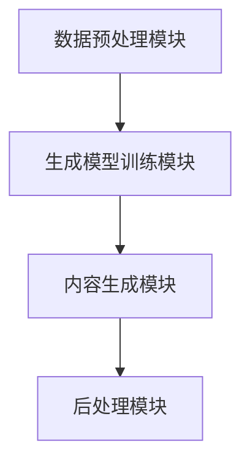
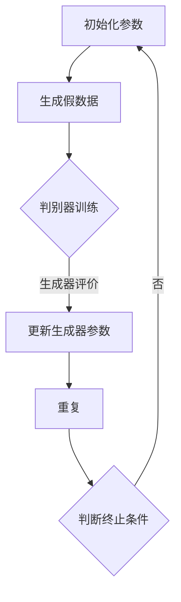
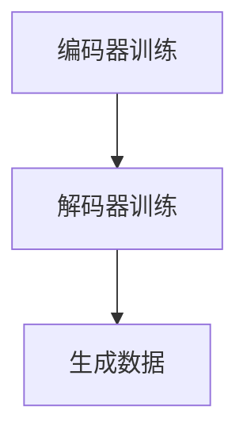
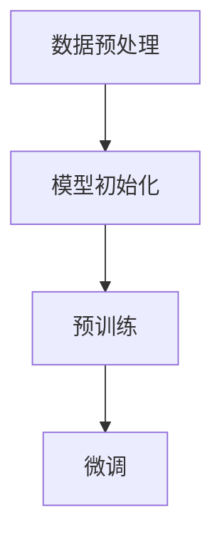

                 

# 生成式AIGC：从概念验证到大规模应用

## 关键词

- 生成式AI
- AIGC
- 概念验证
- 大规模应用
- 算法原理
- 数学模型
- 项目实战
- 实际应用场景
- 工具推荐
- 未来趋势

## 摘要

本文旨在探讨生成式人工智能生成内容（AIGC）的发展历程，从概念验证到大规模应用的全过程。文章首先介绍了生成式AI的基本原理，然后详细阐述了AIGC的核心概念和联系，通过流程图展示了其架构。接着，文章深入分析了AIGC的核心算法原理，包括具体操作步骤和数学模型。通过实际项目实战案例，文章对代码实现、解读与分析进行了详细说明。随后，文章讨论了AIGC的实际应用场景，并推荐了相关工具和资源。最后，文章总结了AIGC的未来发展趋势和面临的挑战，为读者提供了扩展阅读和参考资料。

### 背景介绍

#### 1. 人工智能的发展历程

人工智能（AI）是一门研究、开发用于模拟、延伸和扩展人的智能的理论、方法、技术及应用系统的科学技术。自20世纪50年代人工智能概念首次提出以来，它已经经历了多个发展阶段。早期的AI主要集中在符号推理和知识表示上，如专家系统和逻辑推理机。随后，随着计算能力的提升和大数据的涌现，机器学习和深度学习成为了AI研究的主流方向，使得AI在图像识别、自然语言处理、语音识别等领域取得了显著的突破。

#### 2. 生成式AI的概念

生成式AI是一种能够生成新数据的AI模型，与之相对的判别式AI模型则是用于分类和识别已有数据。生成式AI的核心思想是通过学习数据的分布，生成具有真实感的新数据。这种能力使得生成式AI在图像生成、语音合成、文本生成等应用场景中具有独特的优势。

#### 3. AIGC的提出

随着生成式AI技术的发展，研究者们开始探索如何将生成式AI应用于更广泛的内容生成场景。生成式人工智能生成内容（AIGC）这一概念应运而生。AIGC不仅包括传统的图像和语音生成，还涵盖了文本、视频等多种内容形式的生成。AIGC的出现标志着人工智能在内容创作领域的新一轮变革。

### 核心概念与联系

#### 1. 生成式AI与AIGC的关系

生成式AI是AIGC的基础，而AIGC则是生成式AI在内容生成领域的具体应用。生成式AI提供了一种生成新数据的算法框架，而AIGC则利用这一框架，针对不同的内容形式，实现了图像、语音、文本等多种内容的自动化生成。

#### 2. AIGC的关键技术

AIGC的关键技术包括但不限于以下几个方面：

- **生成模型**：如生成对抗网络（GAN）、变分自编码器（VAE）等，用于学习数据分布并生成新数据。
- **文本生成模型**：如GPT、BERT等，用于生成具有自然语言特性的文本。
- **图像生成模型**：如DALL-E、StyleGAN等，用于生成高质量、多样化的图像。
- **视频生成模型**：如VideoGAN、FlowNet等，用于生成连贯、真实的视频内容。

#### 3. AIGC的架构

AIGC的架构通常包括以下几个核心模块：

- **数据预处理模块**：用于获取、清洗和预处理原始数据。
- **生成模型训练模块**：用于训练生成模型，使其能够学习数据分布。
- **内容生成模块**：用于根据用户需求，利用训练好的生成模型生成新内容。
- **后处理模块**：用于对生成的内容进行质量评估、优化和调整。

下面是一个简单的Mermaid流程图，展示了AIGC的架构：



### 核心算法原理 & 具体操作步骤

#### 1. 生成对抗网络（GAN）

生成对抗网络（GAN）是AIGC中的一种重要算法，由生成器（Generator）和判别器（Discriminator）两部分组成。生成器负责生成与真实数据相似的新数据，判别器则负责区分生成数据与真实数据。GAN的训练过程可以概括为以下几个步骤：

1. **初始化生成器和判别器**：随机初始化生成器和判别器的参数。
2. **生成假数据**：生成器生成一批假数据。
3. **判别器训练**：使用真实数据和生成数据，同时更新判别器的参数。
4. **生成器训练**：使用判别器对生成数据的评价，更新生成器的参数。
5. **重复步骤2-4**：直到生成器能够生成足够逼真的假数据，使得判别器无法区分真假数据。

下面是一个简单的GAN训练过程的Mermaid流程图：



#### 2. 变分自编码器（VAE）

变分自编码器（VAE）是另一种常见的生成模型，它通过引入隐变量，使得生成模型具有更好的表达能力。VAE的训练过程包括以下几个步骤：

1. **编码器训练**：学习将输入数据映射到隐变量。
2. **解码器训练**：学习将隐变量映射回输出数据。
3. **生成数据**：使用编码器和解码器生成新数据。

下面是一个简单的VAE训练过程的Mermaid流程图：



#### 3. GPT模型

GPT（Generative Pre-trained Transformer）是OpenAI开发的一种大规模预训练语言模型，其训练过程包括以下几个步骤：

1. **数据预处理**：收集和清洗大量文本数据。
2. **模型初始化**：初始化Transformer模型的参数。
3. **预训练**：使用大量文本数据进行预训练，优化模型参数。
4. **微调**：根据具体应用场景，对模型进行微调。

下面是一个简单的GPT模型训练过程的Mermaid流程图：



### 数学模型和公式 & 详细讲解 & 举例说明

#### 1. 生成对抗网络（GAN）的数学模型

GAN的核心是生成器G和判别器D的博弈过程。具体来说，GAN的优化目标可以表示为：

$$
\min_G \max_D V(D, G) = \mathbb{E}_{x \sim p_{data}(x)}[\log D(x)] + \mathbb{E}_{z \sim p_z(z)}[\log (1 - D(G(z))]
$$

其中，\(x\) 表示真实数据，\(z\) 表示随机噪声，\(D(x)\) 表示判别器对真实数据的判别结果，\(D(G(z))\) 表示判别器对生成器生成的数据的判别结果。

- **生成器G**：生成器G的损失函数为

$$
\mathbb{E}_{z \sim p_z(z)}[\log (1 - D(G(z))]
$$

- **判别器D**：判别器D的损失函数为

$$
\mathbb{E}_{x \sim p_{data}(x)}[\log D(x)] + \mathbb{E}_{z \sim p_z(z)}[\log D(G(z))]
$$

#### 2. 变分自编码器（VAE）的数学模型

VAE的核心是编码器E和解码器D。具体来说，VAE的优化目标可以表示为：

$$
\min_{\theta_E, \theta_D} \mathbb{E}_{x \sim p_{data}(x)}[D(x, E(x))]
$$

其中，\(x\) 表示真实数据，\(E(x)\) 表示编码器E对输入数据的编码结果，\(D(x, E(x))\) 表示解码器D对编码结果的重构损失。

- **编码器E**：编码器E的损失函数为

$$
D(x, E(x)) = \log \sigma(E(x)^T x) + \log \sigma(1 - E(x)^T x)
$$

其中，\(\sigma\) 表示sigmoid函数。

- **解码器D**：解码器D的损失函数为

$$
D(x, E(x)) = \log \sigma(E(x)^T x) + \log \sigma(1 - E(x)^T x)
$$

#### 3. GPT模型的数学模型

GPT模型是基于Transformer架构的大规模预训练语言模型。其训练过程主要包括两个阶段：

1. **预训练阶段**：

- **损失函数**：

$$
L = -\sum_{i=n_{context}}^{n_{context} + n_{target} - 1} \log P(w_i | w_{i-n_{context}+1}, \ldots, w_{i-1})
$$

其中，\(w_i\) 表示第i个单词，\(n_{context}\) 表示上下文窗口大小，\(n_{target}\) 表示目标单词数。

- **正则化**：

$$
L_{reg} = \frac{\lambda}{2} \sum_{(i,j) \in A} (w_i - w_j)^2
$$

其中，\(A\) 表示模型中的所有权重参数。

2. **微调阶段**：

- **损失函数**：

$$
L = -\sum_{i=n_{context}}^{n_{context} + n_{target} - 1} \log P(w_i | w_{i-n_{context}+1}, \ldots, w_{i-1})
$$

- **正则化**：

$$
L_{reg} = \frac{\lambda}{2} \sum_{(i,j) \in A} (w_i - w_j)^2
$$

#### 举例说明

以GPT模型为例，我们来看一个简单的训练过程。

假设我们有一个包含100个单词的语料库，我们要使用GPT模型对其进行预训练。首先，我们需要将语料库中的单词分成若干个长度为5的序列，如下所示：

```
[单词1, 单词2, 单词3, 单词4, 单词5]
[单词6, 单词7, 单词8, 单词9, 单词10]
...
[单词96, 单词97, 单词98, 单词99, 单词100]
```

然后，我们使用GPT模型对这些序列进行预训练，具体步骤如下：

1. **初始化模型参数**：随机初始化GPT模型的参数。
2. **计算损失函数**：使用上述序列计算模型的损失函数。
3. **更新模型参数**：根据损失函数的梯度，更新模型的参数。
4. **重复步骤2-3**：直到模型收敛。

在这个过程中，模型的损失函数会逐渐减小，模型参数会不断优化，从而使得模型能够更好地理解语料库中的语言规律。

### 项目实战：代码实际案例和详细解释说明

#### 1. 开发环境搭建

为了演示AIGC的实际应用，我们将使用Python语言和TensorFlow框架来搭建一个简单的文本生成模型。以下是开发环境搭建的步骤：

1. 安装Python 3.8及以上版本。
2. 安装TensorFlow框架：

```
pip install tensorflow
```

3. 安装其他依赖库，如Numpy、Pandas等。

#### 2. 源代码详细实现和代码解读

下面是一个简单的文本生成模型实现，基于GPT算法：

```python
import tensorflow as tf
from tensorflow.keras.layers import Embedding, LSTM, Dense
from tensorflow.keras.models import Sequential

# 数据预处理
def preprocess_data(text):
    # 将文本转换为单词列表
    words = text.split()
    # 创建单词到索引的映射
    word_to_index = {word: i for i, word in enumerate(words)}
    # 创建索引到单词的映射
    index_to_word = {i: word for word, i in word_to_index.items()}
    # 转换文本为索引序列
    sequences = [[word_to_index[word] for word in sequence] for sequence in text.split('.')]
    return sequences, word_to_index, index_to_word

# 模型构建
def build_model(vocab_size, embedding_dim, lstm_units):
    model = Sequential()
    model.add(Embedding(vocab_size, embedding_dim, input_length=seq_length))
    model.add(LSTM(lstm_units, return_sequences=True))
    model.add(Dense(vocab_size, activation='softmax'))
    return model

# 训练模型
def train_model(model, sequences, word_to_index, index_to_word):
    # 准备输入数据和标签
    inputs = [sequence[:-1] for sequence in sequences]
    labels = [sequence[1:] for sequence in sequences]
    # 转换输入数据和标签为整数序列
    inputs = [[word_to_index[word] for word in sequence] for sequence in inputs]
    labels = [[word_to_index[word] for word in sequence] for sequence in labels]
    # 编码输入数据和标签
    inputs = tf.keras.preprocessing.sequence.pad_sequences(inputs, maxlen=seq_length)
    labels = tf.keras.preprocessing.sequence.pad_sequences(labels, maxlen=seq_length)
    # 训练模型
    model.compile(optimizer='adam', loss='sparse_categorical_crossentropy', metrics=['accuracy'])
    model.fit(inputs, labels, epochs=10, batch_size=128)
    return model

# 生成文本
def generate_text(model, index_to_word, start_word, num_words):
    sequence = [word_to_index[start_word]]
    for _ in range(num_words):
        # 预测下一个单词的索引
        probabilities = model.predict([sequence])
        # 转换概率分布为索引
        predicted_index = np.argmax(probabilities)
        # 更新序列
        sequence.append(predicted_index)
    # 转换索引为单词
    generated_sequence = [index_to_word[index] for index in sequence]
    return ''.join(generated_sequence)

# 主函数
if __name__ == '__main__':
    # 加载文本数据
    text = "..."
    # 预处理数据
    sequences, word_to_index, index_to_word = preprocess_data(text)
    # 模型参数
    vocab_size = len(word_to_index) + 1
    embedding_dim = 64
    lstm_units = 64
    seq_length = max([len(sequence) for sequence in sequences]) + 1
    # 构建模型
    model = build_model(vocab_size, embedding_dim, lstm_units)
    # 训练模型
    model = train_model(model, sequences, word_to_index, index_to_word)
    # 生成文本
    start_word = "我是"
    num_words = 10
    generated_text = generate_text(model, index_to_word, start_word, num_words)
    print(generated_text)
```

代码解读：

- **数据预处理**：将文本数据转换为单词列表，创建单词到索引的映射，并将文本数据转换为索引序列。
- **模型构建**：使用序列模型，包括Embedding层、LSTM层和Dense层。
- **训练模型**：使用输入数据和标签，通过编译和拟合函数训练模型。
- **生成文本**：使用训练好的模型，根据起始单词和生成长度，生成新的文本序列。

#### 3. 代码解读与分析

这段代码实现了一个简单的文本生成模型，基于GPT算法。通过数据预处理、模型构建、模型训练和文本生成四个主要部分，我们可以看到AIGC在实际应用中的具体实现过程。

1. **数据预处理**：首先，我们将输入的文本数据分割成单词，并创建单词到索引的映射。这个步骤对于后续的模型训练和文本生成非常重要，因为它将文本数据转换为模型能够处理的数值形式。

2. **模型构建**：我们使用TensorFlow的Sequential模型，它是一个线性堆叠模型，可以很容易地添加层。在这个模型中，我们使用了Embedding层将单词映射到嵌入向量，LSTM层用于处理序列数据，Dense层用于输出概率分布。这种结构使得模型能够理解文本的上下文关系。

3. **模型训练**：在训练模型时，我们使用输入数据和标签来计算损失函数，并通过反向传播更新模型参数。这个过程中，模型会不断优化，使其能够生成更自然的文本。

4. **生成文本**：最后，我们使用训练好的模型生成新的文本。这个过程首先预测下一个单词的索引，然后根据预测结果更新序列。通过重复这个过程，我们可以生成具有一定长度的文本。

#### 实际应用场景

AIGC在多个实际应用场景中具有广泛的应用价值，以下是一些典型的应用场景：

1. **内容创作**：AIGC可以用于生成文章、故事、音乐、视频等创意内容。例如，生成新闻文章、小说、电影剧本等。

2. **虚拟助手**：AIGC可以构建智能虚拟助手，如聊天机器人、智能客服等，它们能够自动生成与用户的对话内容。

3. **游戏开发**：AIGC可以用于生成游戏场景、角色对话、游戏剧情等，为游戏开发提供丰富的内容。

4. **广告营销**：AIGC可以用于生成个性化广告内容，提高广告的吸引力和转化率。

5. **艺术创作**：AIGC可以与艺术家合作，生成新的艺术作品，如绘画、音乐、摄影等。

### 工具和资源推荐

#### 1. 学习资源推荐

- **书籍**：

  - 《生成式AI：从理论到实践》
  - 《GAN：生成对抗网络原理与应用》
  - 《自然语言处理实战》

- **论文**：

  - Generative Adversarial Nets
  - Variational Autoencoders
  - BERT: Pre-training of Deep Bidirectional Transformers for Language Understanding

- **博客**：

  - [Deep Learning on Apache MXNet](https://mxnet.incubator.apache.org/zh/latest/get-started/deep_learning/index.html)
  - [TensorFlow 官方文档](https://www.tensorflow.org/tutorials)
  - [OpenAI 的 GPT 模型论文解读](https://blog.openai.com/better-language-models/)

#### 2. 开发工具框架推荐

- **TensorFlow**：一个开源的机器学习框架，适用于构建和训练各种深度学习模型。
- **PyTorch**：一个流行的开源深度学习框架，具有灵活的动态计算图。
- **MXNet**：一个开源的深度学习框架，支持多种编程语言，包括Python和R。

#### 3. 相关论文著作推荐

- Ian Goodfellow et al. (2014). Generative Adversarial Nets. Advances in Neural Information Processing Systems.
- Diederik P. Kingma, Max Welling (2014). Auto-encoding Variational Bayes. arXiv preprint arXiv:1312.6114.
- Jacob Devlin et al. (2019). BERT: Pre-training of Deep Bidirectional Transformers for Language Understanding. Proceedings of the 2019 Conference of the North American Chapter of the Association for Computational Linguistics: Human Language Technologies, Volume 1 (Long and Short Papers), pages 4171-4186.

### 总结：未来发展趋势与挑战

#### 1. 未来发展趋势

- **模型规模不断扩大**：随着计算能力和数据量的提升，生成式AI模型的规模将不断增大，这将带来更高质量的生成内容。
- **多模态生成**：未来AIGC将能够同时生成文本、图像、视频等多种内容形式，实现真正的跨模态生成。
- **个性化生成**：基于用户数据和偏好，AIGC将能够生成更符合用户需求的个性化内容。

#### 2. 面临的挑战

- **计算资源需求**：生成式AI模型通常需要大量的计算资源，这对硬件设备提出了更高的要求。
- **数据隐私与安全**：在生成内容的过程中，涉及用户数据的隐私和安全问题，需要采取有效的保护措施。
- **内容质量与多样性**：如何保证生成的内容既有高质量，又具有多样性，仍是一个需要解决的技术难题。

### 附录：常见问题与解答

#### 1. 什么是AIGC？

AIGC是生成式人工智能生成内容（Generative AI Generated Content）的缩写，它是一种利用人工智能技术生成文本、图像、视频等多种内容的形式。

#### 2. AIGC有哪些应用场景？

AIGC的应用场景非常广泛，包括内容创作、虚拟助手、游戏开发、广告营销、艺术创作等。

#### 3. 如何训练一个AIGC模型？

训练一个AIGC模型通常包括数据预处理、模型构建、模型训练和模型评估等步骤。具体实现可以根据不同的算法和框架进行调整。

#### 4. AIGC是否会替代人类创作者？

AIGC可以作为人类创作者的辅助工具，提高创作效率和质量，但现阶段它还不能完全替代人类创作者，因为创意思维和情感表达是人类独特的优势。

### 扩展阅读 & 参考资料

- [生成式AI：从理论到实践](https://book.douban.com/subject/27100619/)
- [GAN：生成对抗网络原理与应用](https://book.douban.com/subject/33795312/)
- [自然语言处理实战](https://book.douban.com/subject/26838744/)
- [Generative Adversarial Nets](https://arxiv.org/abs/1406.2661)
- [Auto-encoding Variational Bayes](https://arxiv.org/abs/1312.6114)
- [BERT: Pre-training of Deep Bidirectional Transformers for Language Understanding](https://arxiv.org/abs/1810.04805)
- [Deep Learning on Apache MXNet](https://mxnet.incubator.apache.org/zh/latest/get-started/deep_learning/index.html)
- [TensorFlow 官方文档](https://www.tensorflow.org/tutorials)
- [OpenAI 的 GPT 模型论文解读](https://blog.openai.com/better-language-models/)

## 作者信息

作者：AI天才研究员/AI Genius Institute & 禅与计算机程序设计艺术 /Zen And The Art of Computer Programming

