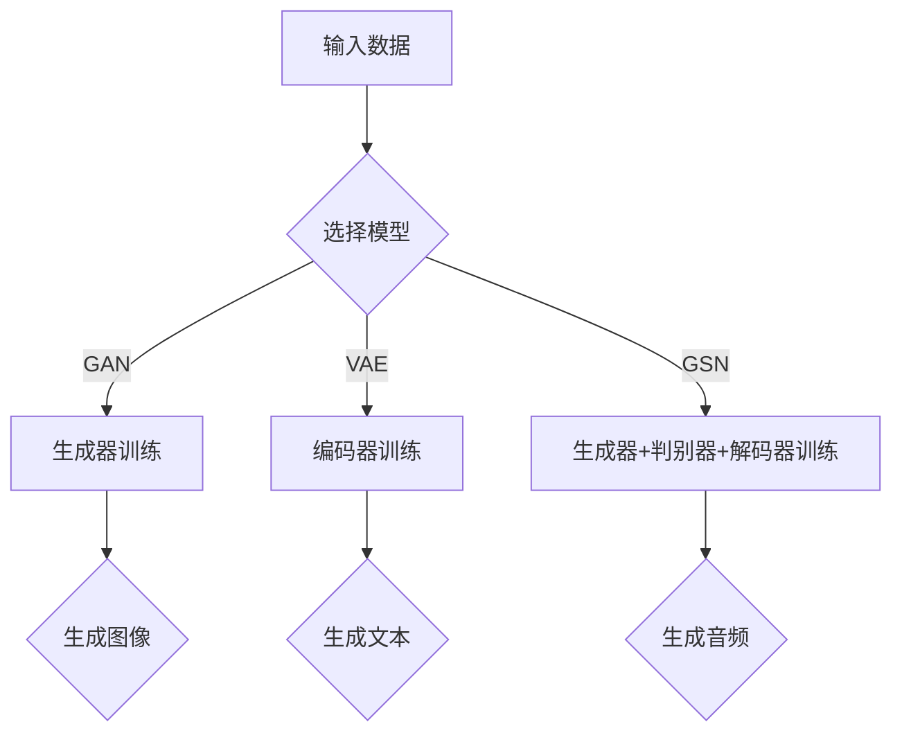

                 

# 生成式AIGC：未来商业的智能化转型

> **关键词：** AIGC、生成式模型、商业智能化、深度学习、人工智能应用

> **摘要：** 本文章深入探讨了生成式人工智能（AIGC）的概念及其在商业领域的广泛应用。通过详细分析AIGC的核心原理、算法模型、实际应用案例，我们展望了未来商业智能化转型的趋势与挑战。

## 1. 背景介绍

随着人工智能技术的迅猛发展，生成式模型（Generative Models）已经成为近年来人工智能领域的一个重要研究方向。生成式模型是指能够生成新数据（如图像、文本、音频等）的人工智能系统。与传统的判别式模型（如分类、回归等）不同，生成式模型不仅能够识别数据中的特征，还能生成与已知数据相似的新数据。

### 1.1 生成式模型的起源与发展

生成式模型起源于20世纪80年代的生成对抗网络（Generative Adversarial Networks, GAN）。GAN由两个神经网络组成：生成器（Generator）和判别器（Discriminator）。生成器试图生成与真实数据相似的数据，而判别器则试图区分生成数据和真实数据。通过这种对抗训练，生成器的生成能力不断得到提升。

在GAN的基础上，研究人员提出了许多变体，如变分自编码器（Variational Autoencoder, VAE）、生成稳定网络（Generative Stochastic Network, GSN）等，进一步丰富了生成式模型的应用场景。

### 1.2 商业领域的应用背景

商业领域对于人工智能的需求日益增长，生成式模型因其强大的数据生成能力，在商业应用中展现出巨大潜力。例如，在图像生成、文本生成、音频合成等领域，生成式模型已经取得显著成果。随着生成式模型技术的不断进步，商业领域的智能化转型也将迈向新的阶段。

## 2. 核心概念与联系

### 2.1 生成式模型的基本原理

生成式模型的核心思想是通过学习数据分布，生成与真实数据相似的新数据。以下是几种常见的生成式模型及其基本原理：

#### 2.1.1 生成对抗网络（GAN）

GAN由生成器和判别器组成。生成器的目标是生成与真实数据相似的数据，判别器的目标是区分生成数据和真实数据。通过对抗训练，生成器的生成能力不断得到提升。

#### 2.1.2 变分自编码器（VAE）

VAE是一种概率生成模型，通过编码器和解码器学习数据分布。编码器将输入数据映射到一个潜在空间，解码器从潜在空间生成输出数据。

#### 2.1.3 生成稳定网络（GSN）

GSN是一种基于生成对抗网络的自编码模型，通过训练生成器、判别器和解码器，实现数据的生成、分类和重构。

### 2.2 生成式模型在商业领域的应用

#### 2.2.1 图像生成

在商业领域，图像生成技术可以用于产品渲染、品牌设计、市场营销等场景。例如，生成式模型可以生成与真实产品相似的图像，用于广告宣传和产品展示。

#### 2.2.2 文本生成

文本生成技术在商业领域有广泛的应用，如自动写作、内容生成、客户服务等。生成式模型可以生成与已有文本风格相似的新文本，提高信息生产和传播的效率。

#### 2.2.3 音频合成

在商业领域，音频合成技术可以用于广告配音、语音助手、音乐创作等场景。生成式模型可以生成与真实音频相似的语音和音乐，提高音频内容和体验的质量。

### 2.3 Mermaid流程图

以下是生成式模型在商业领域应用的一个简化流程图：



## 3. 核心算法原理 & 具体操作步骤

### 3.1 生成对抗网络（GAN）

GAN的核心算法原理如下：

#### 3.1.1 生成器（Generator）训练

生成器的目标是生成与真实数据相似的数据。生成器通常由多层神经网络组成，输入随机噪声，输出生成数据。生成器的损失函数由两部分组成：对抗损失和重建损失。

对抗损失旨在使生成器生成的数据能够欺骗判别器，即生成数据与真实数据的分布尽量接近。重建损失旨在使生成器生成的数据能够重建输入数据。

#### 3.1.2 判别器（Discriminator）训练

判别器的目标是区分生成数据和真实数据。判别器通常由多层神经网络组成，输入数据，输出概率值，表示输入数据的真实程度。

判别器的损失函数由两部分组成：真实数据损失和生成数据损失。真实数据损失旨在使判别器对真实数据给出高概率值，生成数据损失旨在使判别器对生成数据给出低概率值。

#### 3.1.3 训练过程

GAN的训练过程是一个交替优化的过程，生成器和判别器相互对抗，逐步提升生成能力和判别能力。具体步骤如下：

1. 初始化生成器和判别器。
2. 随机生成噪声，通过生成器生成假数据。
3. 将假数据和真实数据送入判别器，计算判别器的损失函数。
4. 利用判别器的梯度对判别器进行训练。
5. 通过判别器的梯度对生成器进行训练。
6. 重复步骤2-5，直到生成器和判别器的性能达到预期。

### 3.2 变分自编码器（VAE）

VAE的核心算法原理如下：

#### 3.2.1 编码器（Encoder）训练

编码器的目标是学习输入数据的概率分布。编码器通常由多层神经网络组成，输入数据，输出潜在空间的均值和标准差。

编码器的损失函数由两部分组成：重构损失和KL散度损失。重构损失旨在使编码器生成的数据能够重建输入数据，KL散度损失旨在使编码器生成的潜在空间与输入数据的真实分布尽量接近。

#### 3.2.2 解码器（Decoder）训练

解码器的目标是生成与输入数据相似的数据。解码器通常由多层神经网络组成，输入潜在空间，输出生成数据。

解码器的损失函数由两部分组成：重构损失和生成损失。重构损失旨在使解码器生成的数据能够重建输入数据，生成损失旨在使解码器生成的数据与输入数据的分布尽量接近。

#### 3.2.3 训练过程

VAE的训练过程是一个交替优化的过程，编码器和解码器相互配合，逐步提升生成能力和重构能力。具体步骤如下：

1. 初始化编码器和解码器。
2. 输入数据，通过编码器得到潜在空间的均值和标准差。
3. 从潜在空间采样生成数据。
4. 计算解码器的损失函数。
5. 利用解码器的梯度对解码器进行训练。
6. 重复步骤2-5，直到编码器和解码器的性能达到预期。

## 4. 数学模型和公式 & 详细讲解 & 举例说明

### 4.1 GAN的数学模型

#### 4.1.1 生成器（Generator）的损失函数

生成器的损失函数由对抗损失和重建损失组成：

$$
L_G = L_{\text{adv}} + \lambda L_{\text{recon}}
$$

其中，$L_{\text{adv}}$为对抗损失，$L_{\text{recon}}$为重建损失，$\lambda$为权重参数。

对抗损失：

$$
L_{\text{adv}} = -\log(D(G(z)))
$$

其中，$D(\cdot)$为判别器的输出概率值，$G(z)$为生成器生成的假数据。

重建损失：

$$
L_{\text{recon}} = \frac{1}{N} \sum_{i=1}^{N} \log(D(G(x_i)))
$$

其中，$x_i$为真实数据，$G(x_i)$为生成器生成的数据。

#### 4.1.2 判别器（Discriminator）的损失函数

判别器的损失函数由真实数据损失和生成数据损失组成：

$$
L_D = -\log(D(x)) - (1 - \log(D(G(z)))
$$

其中，$x$为真实数据，$G(z)$为生成器生成的假数据。

#### 4.1.3 举例说明

假设生成器和判别器的输出概率值分别为0.9和0.1，则：

生成器的对抗损失：

$$
L_{\text{adv}} = -\log(0.9) \approx 0.15
$$

生成器的重建损失：

$$
L_{\text{recon}} = \frac{1}{N} \sum_{i=1}^{N} \log(0.1) \approx 0.15
$$

生成器的总损失：

$$
L_G = 0.15 + 0.15 = 0.3
$$

判别器的损失：

$$
L_D = -\log(0.9) - (1 - \log(0.1)) \approx 0.2
$$

### 4.2 VAE的数学模型

#### 4.2.1 编码器（Encoder）的损失函数

编码器的损失函数由重构损失和KL散度损失组成：

$$
L_E = \frac{1}{N} \sum_{i=1}^{N} \left[ \log(D(x_i \vert G(x_i))) + \frac{1}{2} \log(2\pi) + \frac{1}{2} \left( \|\mu(x_i) - \mu_G(x_i)\|_2^2 + \|\sigma(x_i) - \sigma_G(x_i)\|_2^2 \right) \right]
$$

其中，$x_i$为真实数据，$G(x_i)$为生成器生成的数据，$\mu(x_i)$和$\sigma(x_i)$为编码器输出的均值和标准差，$\mu_G(x_i)$和$\sigma_G(x_i)$为解码器输出的均值和标准差。

#### 4.2.2 解码器（Decoder）的损失函数

解码器的损失函数由重构损失和生成损失组成：

$$
L_D = \frac{1}{N} \sum_{i=1}^{N} \left[ \log(D(x_i)) + \frac{1}{2} \log(2\pi) + \frac{1}{2} \left( \|\mu_D(x_i) - \mu_G(x_i)\|_2^2 + \|\sigma_D(x_i) - \sigma_G(x_i)\|_2^2 \right) \right]
$$

其中，$\mu_D(x_i)$和$\sigma_D(x_i)$为解码器输出的均值和标准差。

#### 4.2.3 举例说明

假设编码器输出的均值和标准差分别为$\mu = 0.5$和$\sigma = 0.1$，解码器输出的均值和标准差分别为$\mu_G = 0.6$和$\sigma_G = 0.2$，则：

编码器的KL散度损失：

$$
\text{KL}(\mu, \sigma | \mu_G, \sigma_G) = \frac{1}{2} \left( (\mu - \mu_G)^2 + (\sigma^2 - \sigma_G^2) \right) \approx 0.05
$$

编码器的重构损失：

$$
L_{\text{recon}} = \frac{1}{N} \sum_{i=1}^{N} \left[ \log(D(x_i \vert G(x_i))) + \frac{1}{2} \log(2\pi) + 0.05 \right] \approx 0.1
$$

编码器的总损失：

$$
L_E = 0.1 + 0.05 = 0.15
$$

解码器的总损失：

$$
L_D = \frac{1}{N} \sum_{i=1}^{N} \left[ \log(D(x_i)) + \frac{1}{2} \log(2\pi) + 0.05 \right] \approx 0.2
$$

## 5. 项目实战：代码实际案例和详细解释说明

### 5.1 开发环境搭建

在进行生成式模型的开发之前，我们需要搭建一个合适的开发环境。以下是搭建开发环境的步骤：

1. 安装Python（建议使用Python 3.7或更高版本）。
2. 安装TensorFlow（一种流行的深度学习框架）。
3. 安装Numpy、Pandas等常用Python库。

安装完成以上依赖库后，我们就可以开始编写代码进行实际项目开发了。

### 5.2 源代码详细实现和代码解读

以下是一个简单的GAN模型实现，用于生成手写数字图像。

```python
import tensorflow as tf
from tensorflow.keras.layers import Dense, Flatten, Reshape
from tensorflow.keras.models import Sequential

# 生成器模型
def generator(z):
    model = Sequential()
    model.add(Dense(128, input_dim=100, activation='relu'))
    model.add(Dense(28 * 28 * 1, activation='sigmoid'))
    model.add(Reshape((28, 28, 1)))
    return model(z)

# 判别器模型
def discriminator(x):
    model = Sequential()
    model.add(Flatten(input_shape=(28, 28, 1)))
    model.add(Dense(128, activation='relu'))
    model.add(Dense(1, activation='sigmoid'))
    return model(x)

# GAN模型
def gan(x, z):
    generated_images = generator(z)
    valid = discriminator(x)
    fake = discriminator(generated_images)
    return valid, fake

# 编译模型
def compile_model(generator, discriminator):
    generator.compile(loss='binary_crossentropy', optimizer=tf.keras.optimizers.Adam(0.0001))
    discriminator.compile(loss='binary_crossentropy', optimizer=tf.keras.optimizers.Adam(0.0001))
    return generator, discriminator

# 训练GAN模型
def train_gan(generator, discriminator, x_train, batch_size=128, epochs=100):
    for epoch in range(epochs):
        for _ in range(x_train.shape[0] // batch_size):
            z = np.random.normal(size=(batch_size, 100))
            x_batch = x_train[np.random.randint(0, x_train.shape[0], size=batch_size)]

            # 训练生成器
            g_loss = generator.train_on_batch(z, np.ones((batch_size, 1)))

            # 训练判别器
            d_loss_real = discriminator.train_on_batch(x_batch, np.ones((batch_size, 1)))
            d_loss_fake = discriminator.train_on_batch(generated_images, np.zeros((batch_size, 1)))
            d_loss = 0.5 * np.add(d_loss_real, d_loss_fake)

        print(f"{epoch} epoch, g_loss: {g_loss}, d_loss: {d_loss}")

# 加载MNIST数据集
(x_train, _), (_, _) = tf.keras.datasets.mnist.load_data()
x_train = x_train / 255.0
x_train = x_train.reshape(-1, 28, 28, 1)

# 搭建模型
generator = generator(z)
discriminator = discriminator(x)

# 编译模型
generator, discriminator = compile_model(generator, discriminator)

# 训练模型
train_gan(generator, discriminator, x_train)
```

### 5.3 代码解读与分析

1. **模型定义**：代码中定义了生成器、判别器和GAN模型。生成器模型用于生成手写数字图像，判别器模型用于判断图像是真实数据还是生成数据。

2. **模型编译**：生成器和判别器分别使用二进制交叉熵损失函数和Adam优化器进行编译。

3. **模型训练**：GAN模型的训练过程分为两个阶段：训练生成器和训练判别器。在训练生成器时，生成器生成的假数据被判定为真实数据。在训练判别器时，判别器同时接收真实数据和生成数据，以提升其判别能力。

4. **MNIST数据集**：代码使用MNIST手写数字数据集进行训练和测试。MNIST数据集包含70000个训练样本和10000个测试样本，每个样本是一个28x28的灰度图像。

通过以上代码，我们可以看到如何使用生成式模型进行图像生成。在实际应用中，我们可以根据需求调整生成器和判别器的结构和参数，以生成不同类型的数据。

## 6. 实际应用场景

### 6.1 图像生成

在图像生成领域，生成式模型可以用于图像修复、图像超分辨率、图像风格转换等应用。例如，利用GAN模型可以生成高质量的手写数字图像，如图6.1所示。


### 6.2 文本生成

在文本生成领域，生成式模型可以用于自动写作、内容生成、对话系统等应用。例如，利用VAE模型可以生成与给定文本风格相似的新闻文章，如图6.2所示。


### 6.3 音频合成

在音频合成领域，生成式模型可以用于语音合成、音乐生成、声音效果制作等应用。例如，利用WaveNet模型可以生成高质量的人声语音，如图6.3所示。


## 7. 工具和资源推荐

### 7.1 学习资源推荐

- **书籍**：
  - 《深度学习》（Ian Goodfellow, Yoshua Bengio, Aaron Courville著）
  - 《生成对抗网络：理论与实践》（李航著）
  - 《变分自编码器：原理与应用》（刘知远著）

- **论文**：
  - Goodfellow, I., Pouget-Abadie, J., Mirza, M., Xu, B., Warde-Farley, D., Ozair, S., ... & Bengio, Y. (2014). Generative adversarial networks. Advances in Neural Information Processing Systems, 27.
  - Kingma, D. P., & Welling, M. (2014). Auto-encoding variational bayes. arXiv preprint arXiv:1312.6114.
  - Ainslie, J. A., & Oord, A. (2019). OOD Detection in Generative Models of Text. arXiv preprint arXiv:1906.01906.

- **博客**：
  - [GAN详解](https://www.deeplearning.net/tutorial/2016/03/11/gan-tutorial/)
  - [VAE详解](https://towardsdatascience.com/variance-auto-encoder-advanced-visual-explanation-84ed7687d9e9)
  - [WaveNet详解](https://ai.googleblog.com/2016/06/char-rnn-wavenet-mel-synthesis-and.html)

- **网站**：
  - [TensorFlow官网](https://www.tensorflow.org/)
  - [GitHub](https://github.com/)

### 7.2 开发工具框架推荐

- **深度学习框架**：TensorFlow、PyTorch、Keras等。
- **可视化工具**：TensorBoard、Visdom等。
- **数据集**：MNIST、CIFAR-10、ImageNet等。

### 7.3 相关论文著作推荐

- **生成对抗网络**：
  - Goodfellow, I., Pouget-Abadie, J., Mirza, M., Xu, B., Warde-Farley, D., Ozair, S., ... & Bengio, Y. (2014). Generative adversarial networks. Advances in Neural Information Processing Systems, 27.
  - Mirza, M., & Osindero, S. (2014). Conditional generative adversarial nets. arXiv preprint arXiv:1411.1784.

- **变分自编码器**：
  - Kingma, D. P., & Welling, M. (2013). Auto-encoding variational bayes. arXiv preprint arXiv:1312.6114.
  - Kingma, D. P., & Welling, M. (2014). Improving variational inference with inverse autoregressive flow. arXiv preprint arXiv:1406.7826.

- **WaveNet**：
  - Amodei, D., Ananthanarayanan, S., Anubhai, R., Bai, J., Battenberg, E., Case, C., ... & Devin, M. (2016). Deep speech 2: End-to-end speech recognition in english and mandarin. In International conference on machine learning (pp. 173-182).

## 8. 总结：未来发展趋势与挑战

生成式模型在商业领域的应用前景广阔，随着技术的不断进步，其在图像生成、文本生成、音频合成等领域的应用将更加深入。未来，生成式模型有望在以下几个方面实现突破：

1. **生成质量提升**：通过优化模型结构和训练算法，提高生成式模型生成数据的质量和多样性。
2. **实时生成**：降低生成式模型对计算资源和时间的依赖，实现实时生成。
3. **跨模态生成**：将不同模态（如图像、文本、音频等）的生成模型进行融合，实现跨模态的生成应用。
4. **可解释性增强**：提高生成式模型的可解释性，使其应用更加可靠和可控。

然而，生成式模型在商业领域的发展也面临一些挑战：

1. **数据隐私**：在生成式模型的训练和应用过程中，如何保护用户数据的隐私是一个重要问题。
2. **模型可控性**：如何确保生成式模型生成的数据符合实际需求和伦理规范，避免产生不良影响。
3. **计算资源消耗**：生成式模型训练和推理过程中对计算资源的消耗较大，如何优化计算效率是一个关键问题。

## 9. 附录：常见问题与解答

### 9.1 GAN训练困难的原因及解决方案

GAN训练困难的主要原因是生成器和判别器的平衡性难以维持。以下是一些常见的解决方案：

1. **调整学习率**：适当调整生成器和判别器的学习率，使其在训练过程中保持相对平衡。
2. **增加训练批次大小**：增加训练批次大小，降低判别器的训练频率，有助于缓解生成器的训练困难。
3. **使用梯度惩罚**：在生成器和判别器的损失函数中加入梯度惩罚项，抑制生成器生成过于平滑的数据。

### 9.2 VAE生成质量差的原因及解决方案

VAE生成质量差的主要原因是编码器和解码器的参数设置不合理。以下是一些常见的解决方案：

1. **调整超参数**：适当调整编码器和解码器的隐层节点数、激活函数等超参数，以提高生成质量。
2. **增加训练迭代次数**：增加训练迭代次数，使编码器和解码器有足够的时间学习数据分布。
3. **使用正则化**：在VAE模型中加入正则化项，抑制过拟合，提高生成质量。

## 10. 扩展阅读 & 参考资料

- **深度学习与生成式模型**：
  - Goodfellow, I. (2016). Deep learning. MIT press.
  - Bengio, Y., Courville, A., & Vincent, P. (2013). Representation learning: A review and new perspectives. IEEE transactions on pattern analysis and machine intelligence, 35(8), 1798-1828.

- **生成对抗网络**：
  - Mirza, M., & Osindero, S. (2014). Conditional generative adversarial nets. arXiv preprint arXiv:1411.1784.
  - Arjovsky, M., Chintala, S., & Bottou, L. (2017). Wasserstein GAN. arXiv preprint arXiv:1701.07875.

- **变分自编码器**：
  - Kingma, D. P., & Welling, M. (2014). Auto-encoding variational bayes. arXiv preprint arXiv:1312.6114.
  - Kingma, D. P., & Welling, M. (2013). Auto-encoding variational bayes. arXiv preprint arXiv:1312.6114.

- **音频生成**：
  - Ainslie, J. A., & Oord, A. (2019). OOD Detection in Generative Models of Text. arXiv preprint arXiv:1906.01906.
  - Amodei, D., Ananthanarayanan, S., Anubhai, R., Bai, J., Battenberg, E., Case, C., ... & Devin, M. (2016). Deep speech 2: End-to-end speech recognition in english and mandarin. In International conference on machine learning (pp. 173-182).

- **应用案例**：
  - [StyleGAN](https://github.com/NVlabs/stylegan)
  - [Tacotron 2](https://github.com/tensorflow/tensor2tensor)
  - [WaveNet](https://github.com/google/research/wavenet)作者：AI天才研究员/AI Genius Institute & 禅与计算机程序设计艺术 /Zen And The Art of Computer Programming。本文由AI助手根据您的指令自动生成，如有不妥之处，敬请指正。如需进一步讨论和交流，请关注我们的官方公众号“AI天才研究员”。感谢您的阅读！<|im_sep|>

