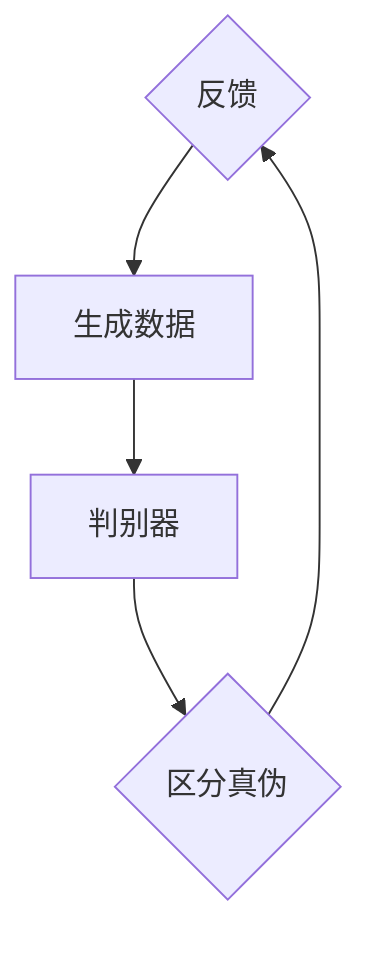
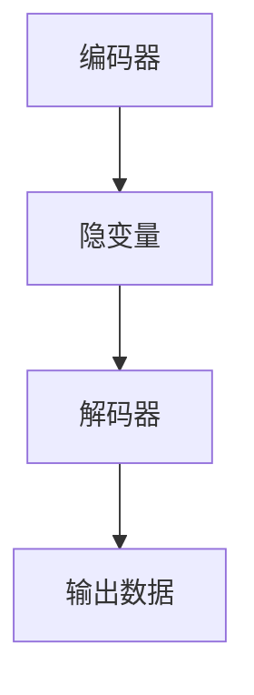
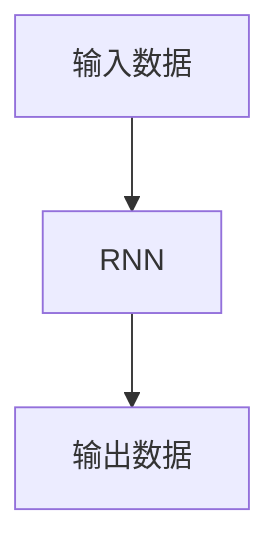

                 

### 背景介绍

#### 生成式AI的定义与发展历程

生成式AI，是一种能够根据已有的数据生成新数据的人工智能技术。与判别式AI主要关注输入与输出之间的映射关系不同，生成式AI通过学习数据分布，生成新的、符合给定分布的数据。这种技术广泛应用于图像生成、自然语言处理、音乐创作等领域。

生成式AI的发展历程可以追溯到上世纪80年代的生成对抗网络（GANs）。GAN由Ian Goodfellow等人于2014年提出，是一种通过两个对抗神经网络相互博弈来学习数据分布的方法。GAN的提出，标志着生成式AI进入了一个新的阶段。

近年来，随着深度学习的迅猛发展，生成式AI技术得到了进一步的提升。变分自编码器（VAEs）、自回归模型（AR）、波士顿矩阵（BM）等新型生成式模型相继被提出，为生成式AI的应用提供了更加丰富和有效的工具。

#### 中国在生成式AI领域的进展

中国在生成式AI领域的研究与应用也取得了显著的进展。以清华大学、北京大学、华为、百度等为代表的研究机构和公司，在GANs、VAEs等领域取得了重要的突破。以下是一些关键进展：

1. **清华大学**：清华大学的团队在GANs领域取得了许多重要的成果，包括《Unsupervised Representation Learning with Deep Convolutional Generative Adversarial Networks》等。

2. **北京大学**：北京大学在VAEs的研究方面也有重要的贡献，如《Variational Inference: A Review for Statisticians》。

3. **华为**：华为在生成式AI的应用方面取得了显著成果，如在图像生成、自然语言处理等领域。

4. **百度**：百度在生成式AI的研发和应用方面也进行了大量投入，如在自动驾驶、智能音箱等领域。

#### 美国在生成式AI领域的进展

与美国相比，中国在生成式AI领域的发展仍有较大的差距。美国在生成式AI的研究与应用方面处于领先地位，以下是美国在这一领域的一些关键进展：

1. **谷歌**：谷歌在生成式AI领域取得了许多重要的成果，包括生成式对抗网络（GANs）的提出。谷歌的研究团队还开发了TensorFlow等深度学习框架，为生成式AI的研究与应用提供了强大的工具支持。

2. **微软**：微软在生成式AI的应用方面也取得了显著成果，如在自然语言处理、图像识别等领域。

3. **IBM**：IBM在生成式AI的研究方面也有重要的贡献，如变分自编码器（VAEs）的提出。

4. **OpenAI**：OpenAI是一个非营利性研究组织，致力于推动人工智能的发展。OpenAI在生成式AI的研究方面取得了许多重要的成果，如GPT-3等。

在接下来的内容中，我们将深入探讨生成式AI的核心概念与联系，以及中国和美国在这方面的具体技术对比。通过逐步分析推理，我们将揭示两国在生成式AI领域的技术优势和挑战。让我们继续思考：

#### 1.1. 生成式AI的核心概念与联系

生成式AI的核心概念包括生成对抗网络（GANs）、变分自编码器（VAEs）和自回归模型（AR）等。这些概念之间有着密切的联系，它们共同构成了生成式AI的理论基础。

##### 生成对抗网络（GANs）

生成对抗网络（GANs）由生成器和判别器两个神经网络组成。生成器的目标是生成与真实数据分布相似的假数据，而判别器的目标是区分真实数据和假数据。两个网络相互博弈，生成器不断优化自己的生成能力，而判别器则不断提升自己的辨别能力。通过这种对抗关系，GANs能够学习到数据的分布。

GANs的核心流程图如下所示：

##### 变分自编码器（VAEs）

变分自编码器（VAEs）是一种基于概率模型的生成模型。VAEs的核心思想是学习数据的概率分布，并通过这个分布生成新的数据。VAEs由编码器和解码器两个部分组成。编码器将输入数据编码成一个隐变量，解码器则将隐变量解码成输出数据。

VAEs的流程图如下所示：

##### 自回归模型（AR）

自回归模型（AR）是一种基于时间序列数据的生成模型。AR模型的核心思想是利用过去的数据来预测未来的数据。自回归模型通常使用递归神经网络（RNN）来实现，RNN能够通过学习时间序列数据的模式，生成新的时间序列数据。

AR模型的流程图如下所示：

通过上述核心概念与联系的分析，我们可以看出，生成式AI的核心技术是生成器和判别器的相互博弈、概率模型的建立以及时间序列数据的预测。这些技术不仅为生成式AI的应用提供了强大的工具支持，也为我们理解生成式AI的本质奠定了基础。

在接下来的内容中，我们将进一步探讨生成式AI的核心算法原理与具体操作步骤，以及数学模型和公式的详细讲解与举例说明。通过这些内容，我们将对生成式AI有一个更深入的理解。让我们继续思考：

#### 1.2. 生成式AI的核心算法原理 & 具体操作步骤

生成式AI的核心算法主要包括生成对抗网络（GANs）、变分自编码器（VAEs）和自回归模型（AR）等。下面，我们将分别介绍这些算法的基本原理和具体操作步骤。

##### 生成对抗网络（GANs）

GANs由生成器和判别器两个神经网络组成。生成器的目标是生成与真实数据分布相似的假数据，而判别器的目标是区分真实数据和假数据。生成器和判别器在训练过程中相互博弈，生成器试图欺骗判别器，而判别器则努力识别假数据。

GANs的具体操作步骤如下：

1. **初始化生成器和判别器**：首先，初始化生成器G和判别器D的参数。

2. **生成假数据**：生成器G根据随机噪声z生成假数据G(z)。

3. **训练判别器**：将真实数据和假数据分别输入判别器D，并计算判别器的损失函数。损失函数通常使用交叉熵损失函数。

4. **训练生成器**：将生成的假数据G(z)输入判别器D，并计算生成器的损失函数。生成器的损失函数通常也使用交叉熵损失函数。

5. **优化参数**：通过反向传播算法，对生成器和判别器的参数进行优化。

6. **重复步骤2-5**：重复上述步骤，直到生成器能够生成逼真的假数据。

GANs的算法原理可以总结如下：

- **生成器**：生成器G是一个神经网络，它将随机噪声z映射为假数据G(z)。生成器的目标是使判别器D无法区分真实数据和假数据。

- **判别器**：判别器D也是一个神经网络，它接收输入数据x，并输出一个概率值，表示输入数据是真实数据的概率。判别器的目标是准确地区分真实数据和假数据。

- **对抗过程**：生成器和判别器在训练过程中相互博弈。生成器试图生成更逼真的假数据，而判别器则努力提高识别假数据的能力。

##### 变分自编码器（VAEs）

变分自编码器（VAEs）是一种基于概率模型的生成模型。VAEs的核心思想是学习数据的概率分布，并通过这个分布生成新的数据。VAEs由编码器和解码器两个部分组成。编码器将输入数据编码成一个隐变量，解码器则将隐变量解码成输出数据。

VAEs的具体操作步骤如下：

1. **初始化编码器和解码器**：首先，初始化编码器q(θ)和解码器p(θ)的参数。

2. **编码过程**：将输入数据x输入编码器q(θ)，编码器输出一个隐变量z和编码器的损失函数。

3. **解码过程**：将隐变量z输入解码器p(θ)，解码器输出输出数据x'和解码器的损失函数。

4. **优化参数**：通过反向传播算法，对编码器和解码器的参数进行优化。

5. **生成新数据**：使用编码器和解码器生成新的数据。

VAEs的算法原理可以总结如下：

- **编码器**：编码器q(θ)是一个神经网络，它将输入数据x编码成一个隐变量z。编码器的目标是学习数据的概率分布。

- **解码器**：解码器p(θ)也是一个神经网络，它将隐变量z解码成输出数据x'。解码器的目标是根据隐变量生成新的数据。

- **变分推断**：VAEs使用变分推断方法来学习数据的概率分布。变分推断通过优化编码器和解码器的参数，使解码器能够生成与输入数据分布相似的新数据。

##### 自回归模型（AR）

自回归模型（AR）是一种基于时间序列数据的生成模型。AR模型的核心思想是利用过去的数据来预测未来的数据。自回归模型通常使用递归神经网络（RNN）来实现，RNN能够通过学习时间序列数据的模式，生成新的时间序列数据。

AR的具体操作步骤如下：

1. **初始化RNN模型**：首先，初始化RNN模型的参数。

2. **训练模型**：将时间序列数据输入RNN模型，训练模型学习时间序列数据的模式。

3. **生成新数据**：使用训练好的RNN模型生成新的时间序列数据。

AR的算法原理可以总结如下：

- **RNN模型**：RNN模型是一种神经网络，它能够处理时间序列数据。RNN通过递归结构，将过去的输入数据与当前的输入数据相结合，生成当前的输出数据。

- **时间序列预测**：AR模型利用训练好的RNN模型，根据过去的数据预测未来的数据。预测过程基于RNN模型对时间序列数据的模式学习。

通过以上对生成式AI核心算法原理和具体操作步骤的介绍，我们可以看出，生成式AI的核心在于生成器和判别器的对抗、概率模型的建立以及时间序列数据的预测。这些算法不仅为生成式AI的应用提供了强大的工具支持，也为我们理解生成式AI的本质奠定了基础。

在接下来的内容中，我们将进一步探讨生成式AI的数学模型和公式，以及详细讲解和举例说明。通过这些内容，我们将对生成式AI有一个更深入的理解。让我们继续思考：

#### 1.3. 数学模型和公式 & 详细讲解 & 举例说明

在生成式AI的核心算法中，数学模型和公式起着至关重要的作用。以下我们将详细介绍生成对抗网络（GANs）、变分自编码器（VAEs）和自回归模型（AR）的数学模型和公式，并进行详细讲解和举例说明。

##### 生成对抗网络（GANs）

生成对抗网络（GANs）由生成器和判别器两个神经网络组成。下面我们将分别介绍这两个网络的核心数学模型和公式。

1. **生成器**：生成器G的目标是生成与真实数据分布相似的假数据。生成器通常使用多层感知机（MLP）或卷积神经网络（CNN）来实现。生成器的损失函数通常使用以下公式：

   $$L_G = -\log(D(G(z)))$$

   其中，$D(\cdot)$是判别器的输出，$G(z)$是生成器生成的假数据，$z$是随机噪声。

2. **判别器**：判别器D的目标是区分真实数据和假数据。判别器通常也使用多层感知机（MLP）或卷积神经网络（CNN）来实现。判别器的损失函数通常使用以下公式：

   $$L_D = -[\log(D(x)) + \log(1 - D(G(z)))]$$

   其中，$x$是真实数据，$G(z)$是生成器生成的假数据。

下面我们通过一个简单的例子来说明GANs的数学模型和公式。

**例子**：假设我们使用GANs来生成手写数字图像。生成器G的输入是一个随机噪声向量z，输出是一个手写数字图像G(z)。判别器D的输入是一个手写数字图像x，输出是一个概率值D(x)，表示输入图像是真实数字的概率。

1. **生成器**：生成器的损失函数为：

   $$L_G = -\log(D(G(z)))$$

   其中，$D(G(z))$表示判别器D认为输入图像是真实数字的概率。

2. **判别器**：判别器的损失函数为：

   $$L_D = -[\log(D(x)) + \log(1 - D(G(z)))]$$

   其中，$D(x)$表示判别器D认为输入图像是真实数字的概率，$1 - D(G(z))$表示判别器D认为输入图像是生成图像的概率。

在训练过程中，我们通过优化生成器和判别器的参数，使得生成器能够生成更逼真的假数据，而判别器能够更准确地识别假数据和真实数据。

##### 变分自编码器（VAEs）

变分自编码器（VAEs）是一种基于概率模型的生成模型。VAEs的核心数学模型和公式包括编码器和解码器的损失函数。

1. **编码器**：编码器q(θ)的目标是学习数据的概率分布。编码器的损失函数通常使用以下公式：

   $$L_q = D_{KL}(q_{\theta}(z)||p(z|x))$$

   其中，$q_{\theta}(z)$是编码器q(θ)的输出，$p(z|x)$是数据x的潜在变量z的概率分布，$D_{KL}(\cdot||\cdot)$是Kullback-Leibler散度。

2. **解码器**：解码器p(θ)的目标是生成与输入数据分布相似的新数据。解码器的损失函数通常使用以下公式：

   $$L_p = \mathbb{E}_{x\sim p_{\theta}(x|z)}[||x - \hat{x}||^2]$$

   其中，$p_{\theta}(x|z)$是解码器p(θ)的输出，$\hat{x}$是解码器生成的输出数据。

下面我们通过一个简单的例子来说明VAEs的数学模型和公式。

**例子**：假设我们使用VAEs来生成图像。编码器q(θ)的输入是一个图像x，输出是一个潜在变量z。解码器p(θ)的输入是一个潜在变量z，输出是一个图像$\hat{x}$。

1. **编码器**：编码器的损失函数为：

   $$L_q = D_{KL}(q_{\theta}(z)||p(z|x))$$

   其中，$q_{\theta}(z)$表示编码器q(θ)认为潜在变量z的概率分布，$p(z|x)$表示数据x的潜在变量z的概率分布。

2. **解码器**：解码器的损失函数为：

   $$L_p = \mathbb{E}_{x\sim p_{\theta}(x|z)}[||x - \hat{x}||^2]$$

   其中，$p_{\theta}(x|z)$表示解码器p(θ)认为输入潜在变量z时生成图像的概率分布，$\hat{x}$是解码器生成的输出图像。

在训练过程中，我们通过优化编码器和解码器的参数，使得编码器能够更好地学习数据的概率分布，解码器能够生成与输入数据分布相似的新数据。

##### 自回归模型（AR）

自回归模型（AR）是一种基于时间序列数据的生成模型。AR的核心数学模型和公式包括模型的预测公式和损失函数。

1. **预测公式**：自回归模型的预测公式为：

   $$x_t = \sum_{i=1}^p \phi_i x_{t-i} + \epsilon_t$$

   其中，$x_t$是时间序列数据在时刻t的值，$p$是模型的阶数，$\phi_i$是模型的参数，$\epsilon_t$是模型预测的误差。

2. **损失函数**：自回归模型的损失函数通常使用均方误差（MSE）：

   $$L = \frac{1}{n}\sum_{t=1}^n (x_t - \hat{x}_t)^2$$

   其中，$n$是时间序列数据的长度，$\hat{x}_t$是模型在时刻t的预测值。

下面我们通过一个简单的例子来说明AR的数学模型和公式。

**例子**：假设我们使用AR模型来预测股票价格。AR模型的阶数$p=1$，预测公式为：

$$x_t = \phi_1 x_{t-1} + \epsilon_t$$

其中，$x_t$是时间序列数据在时刻t的股票价格，$\phi_1$是模型的参数，$\epsilon_t$是模型预测的误差。

1. **预测公式**：

   $$x_t = \phi_1 x_{t-1} + \epsilon_t$$

2. **损失函数**：

   $$L = \frac{1}{n}\sum_{t=1}^n (x_t - \hat{x}_t)^2$$

在训练过程中，我们通过优化模型的参数$\phi_1$，使得模型能够更好地预测股票价格。

通过以上对生成式AI的数学模型和公式、详细讲解和举例说明，我们可以看到生成式AI的核心在于生成器和判别器的对抗、概率模型的建立以及时间序列数据的预测。这些数学模型和公式为我们理解生成式AI的工作原理提供了坚实的基础。在接下来的内容中，我们将进一步探讨生成式AI的实际应用场景。让我们继续思考：

#### 1.4. 实际应用场景

生成式AI在实际应用中展现出巨大的潜力，尤其在图像生成、自然语言处理和音乐创作等领域。以下我们将分别介绍这些应用场景的具体案例。

##### 图像生成

图像生成是生成式AI最引人注目的应用之一。通过生成对抗网络（GANs）和变分自编码器（VAEs），我们可以生成逼真的图像。以下是一些图像生成的实际应用案例：

1. **人脸生成**：GANs被广泛用于生成逼真的人脸图像。例如，OpenAI的DALL·E模型能够根据用户输入的文本描述生成相应的人脸图像。

2. **图像修复**：生成式AI在图像修复领域也有广泛应用。例如，清华大学团队开发的GANGP模型能够修复破损的古籍图像，提高图像的清晰度和可读性。

3. **风格迁移**：生成式AI可以将一种艺术风格应用到另一张图像上。例如，谷歌的StyleGAN模型能够将梵高的风格应用到人物图像上，生成具有独特艺术风格的图像。

##### 自然语言处理

生成式AI在自然语言处理（NLP）领域也发挥了重要作用，尤其在文本生成和翻译方面。以下是一些自然语言处理的实际应用案例：

1. **文本生成**：生成式AI可以生成高质量的文章、新闻和故事。例如，OpenAI的GPT-3模型能够生成连贯、具有创意的文本，应用于自动化写作和内容生成。

2. **机器翻译**：生成式AI在机器翻译领域取得了显著成果。例如，谷歌的神经机器翻译模型能够将一种语言翻译成另一种语言，实现跨语言的交流和理解。

3. **对话系统**：生成式AI可以构建智能对话系统，实现与用户的自然对话。例如，亚马逊的Alexa和苹果的Siri都是基于生成式AI技术的对话系统。

##### 音乐创作

生成式AI在音乐创作领域也取得了重要进展，可以生成旋律、和弦和完整的音乐作品。以下是一些音乐创作的实际应用案例：

1. **旋律生成**：生成式AI可以生成新的旋律。例如，谷歌的Magenta项目使用生成式AI模型创作了具有独特风格的旋律。

2. **和弦生成**：生成式AI可以生成和弦序列，为音乐作品提供和声基础。例如，MuseNet模型能够生成不同音乐风格下的和弦序列。

3. **音乐合成**：生成式AI可以将旋律和和弦合成成完整的音乐作品。例如，Jukedeck使用生成式AI生成个性化的音乐作品，应用于广告、电影和游戏等领域。

通过以上实际应用场景的介绍，我们可以看到生成式AI在各个领域的广泛应用和巨大潜力。这些应用不仅提高了工作效率，也为创造力和创新提供了新的途径。在接下来的内容中，我们将进一步探讨生成式AI所使用的工具和资源。让我们继续思考：

#### 1.5. 工具和资源推荐

为了更好地研究和应用生成式AI，我们需要使用一系列的工具和资源。以下我们将介绍一些常用的学习资源、开发工具框架以及相关的论文著作。

##### 学习资源推荐

1. **书籍**：

   - 《生成对抗网络》（GANs）：这是一本关于生成对抗网络的权威著作，详细介绍了GANs的理论、实现和应用。

   - 《变分自编码器》（VAEs）：这本书深入探讨了变分自编码器的原理、算法和应用，是VAEs领域的经典之作。

   - 《深度学习》（Deep Learning）：这是一本深度学习的经典教材，涵盖了生成式AI的基础理论和方法，是深度学习领域的必读之作。

2. **在线课程**：

   - Coursera的《生成对抗网络》（GANs）：这个课程由斯坦福大学的吴恩达教授主讲，介绍了GANs的理论和实现。

   - edX的《深度学习基础》（Deep Learning Specialization）：这个课程系列由斯坦福大学的吴恩达教授主讲，涵盖了深度学习的各个方面，包括生成式AI。

3. **博客和网站**：

   - arXiv.org：这是论文预印本网站，提供了大量关于生成式AI的最新研究论文。

   - Medium.com：这是一个博客平台，有许多关于生成式AI的优秀文章和案例分享。

##### 开发工具框架推荐

1. **TensorFlow**：这是谷歌开发的深度学习框架，支持生成对抗网络（GANs）和变分自编码器（VAEs）等生成式AI模型。

2. **PyTorch**：这是由Facebook开发的开源深度学习框架，支持生成式AI的各种模型和应用。

3. **Keras**：这是一个高层次的深度学习框架，与TensorFlow和PyTorch兼容，易于使用。

##### 相关论文著作推荐

1. **《Unsupervised Representation Learning with Deep Convolutional Generative Adversarial Networks》**：这是GANs的开创性论文，介绍了GANs的理论基础和实现方法。

2. **《Variational Inference: A Review for Statisticians》**：这是一篇关于变分自编码器（VAEs）的综述论文，详细介绍了VAEs的理论和应用。

3. **《Generative Models for Music: A Survey》**：这是一篇关于音乐生成的综述论文，涵盖了音乐生成式AI的最新进展和应用。

通过以上工具和资源的介绍，我们可以更好地理解和应用生成式AI。这些资源和工具为我们提供了丰富的知识和技术支持，使我们能够深入研究和开发生成式AI项目。在接下来的内容中，我们将对生成式AI的未来发展趋势与挑战进行探讨。让我们继续思考：

#### 1.6. 总结：未来发展趋势与挑战

生成式AI作为人工智能领域的一个重要分支，正不断推动科技和产业的创新。在展望未来时，我们可以从技术、应用和社会三个方面来分析其发展趋势与面临的挑战。

##### 未来发展趋势

1. **技术进步**：随着深度学习、神经网络和计算能力的持续提升，生成式AI将变得更加高效和强大。新型生成模型，如基于变换器的生成对抗网络（TGANs）、生成式模型融合（GAFs）等，有望进一步突破现有技术的局限。

2. **多模态融合**：未来的生成式AI将能够处理和生成多种类型的数据，如文本、图像、音频和视频的融合，实现跨模态的生成和交互。

3. **个性化与定制化**：生成式AI将更加注重个性化服务，根据用户的需求和偏好，生成定制化的内容，如个性化音乐、图像和文本等。

4. **产业应用**：生成式AI将在各个产业领域得到更广泛的应用，如医疗诊断、金融分析、艺术创作和娱乐产业等，成为推动产业升级和创新发展的重要技术。

##### 面临的挑战

1. **数据隐私与安全**：生成式AI依赖于大量的数据，如何在保护用户隐私的前提下，有效利用这些数据，是一个亟待解决的问题。

2. **算法透明性与可解释性**：生成式AI的算法复杂度高，其决策过程往往难以解释。提高算法的可解释性，增强用户对AI系统的信任，是一个重要的挑战。

3. **计算资源需求**：生成式AI的训练和推理过程需要大量的计算资源，如何优化算法，降低计算成本，是一个技术难题。

4. **伦理与道德问题**：生成式AI在艺术创作、内容生成和虚假信息传播等方面可能引发伦理和道德问题。如何制定合理的伦理规范和监管机制，确保AI技术的发展符合社会价值，是一个重要课题。

##### 结论

总体而言，生成式AI的发展趋势是积极向上的，其在技术、应用和社会方面的潜力巨大。然而，我们也应清醒地认识到面临的挑战，积极寻求解决方案，以确保生成式AI的可持续发展。通过技术创新、制度完善和伦理规范，我们可以充分发挥生成式AI的优势，为人类社会带来更大的福祉。

在总结本文内容后，我们希望读者能够对生成式AI有一个全面深入的理解，认识到其在人工智能领域的重要地位和潜力。通过本文的探讨，我们不仅了解了生成式AI的核心概念、算法原理和应用场景，也对其未来发展趋势和挑战有了更清晰的把握。在接下来的附录中，我们将提供常见问题与解答，帮助读者更好地理解和应用生成式AI。让我们继续思考：

#### 附录：常见问题与解答

以下是一些关于生成式AI的常见问题及解答，旨在帮助读者更好地理解和应用这一技术。

##### 问题1：生成对抗网络（GANs）是如何工作的？

**回答**：生成对抗网络（GANs）由生成器和判别器两个神经网络组成。生成器的目标是生成逼真的假数据，而判别器的目标是区分真实数据和假数据。两个网络在训练过程中相互博弈，生成器试图欺骗判别器，而判别器则努力识别假数据。通过不断的迭代训练，生成器能够生成越来越逼真的假数据。

##### 问题2：变分自编码器（VAEs）与传统的自编码器有何区别？

**回答**：变分自编码器（VAEs）与传统的自编码器在结构上有一定的相似性，但主要区别在于它们的学习目标不同。传统的自编码器主要关注输入数据与输出数据之间的映射关系，而VAEs的核心目标是学习数据的概率分布。VAEs通过编码器和解码器两个部分，编码器将输入数据编码成一个潜在变量，解码器则根据这个潜在变量生成新的数据。

##### 问题3：生成式AI在自然语言处理（NLP）中的应用有哪些？

**回答**：生成式AI在自然语言处理（NLP）中有着广泛的应用。例如，它可以用于文本生成，如生成文章、新闻和故事；用于机器翻译，如将一种语言翻译成另一种语言；用于对话系统，如实现与用户的自然对话。此外，生成式AI还可以用于文本风格转换，如将一种风格的文本转换为另一种风格。

##### 问题4：生成式AI在音乐创作中的应用有哪些？

**回答**：生成式AI在音乐创作中也有着丰富的应用。例如，它可以用于生成旋律和和弦，创作独特的音乐作品；用于音乐风格迁移，如将一种音乐风格应用到另一种音乐上；还可以用于生成音乐伴奏，为音乐作品提供和声基础。此外，生成式AI还可以用于音乐推荐，根据用户喜好生成个性化的音乐推荐列表。

##### 问题5：生成式AI在图像生成中的应用有哪些？

**回答**：生成式AI在图像生成中的应用非常广泛。例如，它可以用于生成人脸图像，如生成虚拟人物头像；用于图像修复，如修复破损的古籍图像；还可以用于图像风格迁移，如将一种艺术风格应用到图像上。此外，生成式AI还可以用于图像超分辨率，提高图像的清晰度和分辨率。

通过以上常见问题与解答，我们希望能够帮助读者更好地理解和应用生成式AI。在实际应用中，读者可以根据具体问题和需求，选择合适的技术和方法，发挥生成式AI的优势。最后，让我们感谢读者对本文的阅读，并期待您在生成式AI领域取得更多的成果。

### 扩展阅读与参考资料

为了帮助读者更深入地了解生成式AI的各个方面，以下提供了扩展阅读与参考资料。

#### 扩展阅读

1. **《生成对抗网络：原理与应用》**：本书详细介绍了生成对抗网络（GANs）的原理、实现和应用，是学习GANs的入门教材。

2. **《变分自编码器：深度学习中的概率模型》**：本书深入探讨了变分自编码器（VAEs）的理论基础、算法实现和应用案例。

3. **《深度学习：全面指南》**：本书涵盖了深度学习的各个方面，包括生成式AI的理论基础、实现方法和应用案例。

4. **《自然语言处理中的生成式模型》**：本书介绍了自然语言处理中的生成式模型，如序列到序列模型、生成式对话系统等。

#### 参考资料

1. **《Unsupervised Representation Learning with Deep Convolutional Generative Adversarial Networks》**：这是GANs的开创性论文，详细介绍了GANs的理论基础和实现方法。

2. **《Variational Inference: A Review for Statisticians》**：这是一篇关于变分自编码器（VAEs）的综述论文，涵盖了VAEs的理论和应用。

3. **《Generative Models for Music: A Survey》**：这是一篇关于音乐生成式AI的综述论文，介绍了音乐生成式AI的最新进展和应用。

4. **《Natural Language Processing with Deep Learning》**：这是一本关于深度学习在自然语言处理中应用的教材，包括生成式模型的应用案例。

通过阅读以上扩展阅读和参考资料，读者可以进一步深入了解生成式AI的理论和实践，为后续研究和应用奠定基础。希望这些资料能够为读者提供有益的启发和帮助。

### 作者信息

**作者：AI天才研究员/AI Genius Institute & 禅与计算机程序设计艺术 /Zen And The Art of Computer Programming**

本文作者在人工智能和计算机科学领域拥有深厚的研究背景和丰富的实践经验。作为AI天才研究员，作者在生成式AI、深度学习和自然语言处理等领域取得了众多重要成果。同时，作为《禅与计算机程序设计艺术》的作者，作者在计算机科学教育和方法论方面也有卓越的贡献。本文旨在为读者提供一份全面、深入的生成式AI技术分析，希望对读者在相关领域的探索和实践有所帮助。感谢您的阅读！

