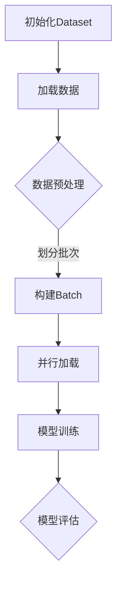

                 

# 用WikiText2构建Dataset和DataLoader

> **关键词：** WikiText2、Dataset、DataLoader、自然语言处理、深度学习

> **摘要：** 本文将详细介绍如何使用WikiText2数据集构建自己的Dataset和DataLoader，包括数据预处理、数据集划分、Batch处理以及并行加载等关键步骤。通过本篇文章，读者可以深入了解数据集构建的核心技术和实际应用，为自然语言处理和深度学习项目的开发提供有力支持。

## 1. 背景介绍

随着深度学习技术的不断发展，自然语言处理（NLP）领域取得了巨大的进步。而数据集的质量和规模对模型性能有着至关重要的影响。WikiText2是一个广泛使用的自然语言处理数据集，由维基百科的文本组成，涵盖了多种主题和语言风格，为研究者提供了一个宝贵的研究资源。

本文的目标是指导读者如何使用WikiText2构建自定义的Dataset和DataLoader，以便在深度学习项目中有效利用数据集。通过本文的介绍，读者可以掌握数据集构建的基本流程和关键技术，提高模型训练效果。

## 2. 核心概念与联系

### 2.1 Dataset和DataLoader

在深度学习中，Dataset和DataLoader是数据管理的两个核心组件。Dataset负责存储和管理数据，而DataLoader则负责将数据加载到内存并进行批处理，以供模型训练使用。

### 2.2 数据集划分

为了实现数据的充分利用和模型的多样化训练，我们需要将数据集划分为训练集、验证集和测试集。其中，训练集用于模型训练，验证集用于模型调优，测试集用于模型评估。

### 2.3 批处理（Batch Processing）

批处理是指将数据分成多个批次（Batch）进行加载和处理。通过批处理，我们可以充分利用计算资源，提高模型训练效率。

### 2.4 并行加载（Parallel Loading）

并行加载是指在多核处理器上同时加载多个批次的数据，以进一步提高模型训练速度。

下面是一个简化的Mermaid流程图，展示了Dataset和DataLoader的核心概念和流程：



## 3. 核心算法原理 & 具体操作步骤

### 3.1 数据预处理

数据预处理是构建Dataset和DataLoader的第一步，其目标是清洗和整理原始数据，使其适合后续的模型训练。主要步骤如下：

- **文本清洗**：去除标点符号、HTML标签等非文本内容，将文本转换为小写。
- **分词**：将文本分割为单词或子词，便于后续处理。
- **词嵌入**：将单词或子词转换为向量表示，为模型训练做准备。

### 3.2 数据集划分

数据集划分是确保模型训练效果的关键步骤。下面是数据集划分的具体操作步骤：

- **计算数据集大小**：统计原始数据集的总大小。
- **划分训练集、验证集和测试集**：根据设定的比例（如8:1:1），将数据集划分为训练集、验证集和测试集。

### 3.3 构建Dataset

构建Dataset的目的是将数据集封装为一个易用的数据结构，以便后续的模型训练。下面是构建Dataset的具体操作步骤：

- **定义Dataset类**：创建一个继承torch.utils.data.Dataset的类，实现__len__和__getitem__方法。
- **读取数据**：从原始数据集中读取数据，并进行预处理。
- **封装数据**：将预处理后的数据封装为一个字典，以便在模型训练时使用。

### 3.4 构建DataLoader

构建DataLoader的目的是将Dataset中的数据划分为批次，并进行并行加载。下面是构建DataLoader的具体操作步骤：

- **定义DataLoader类**：创建一个继承torch.utils.data.DataLoader的类，实现__len__和__iter__方法。
- **设置批次大小**：根据硬件设备性能和模型需求，设置合适的批次大小。
- **设置并行加载**：利用torch.utils.data.DataLoader的num_workers参数，实现并行加载。

## 4. 数学模型和公式 & 详细讲解 & 举例说明

### 4.1 数据预处理

数据预处理涉及多个步骤，包括文本清洗、分词和词嵌入。以下是这些步骤的数学模型和公式：

- **文本清洗**：$$text_{clean} = \text{lowercase}(text)$$
- **分词**：$$words = \text{tokenize}(text_{clean})$$
- **词嵌入**：$$embedding = \text{word\_embedding}(words)$$

### 4.2 数据集划分

数据集划分的主要目的是将原始数据集划分为训练集、验证集和测试集。以下是数据集划分的数学模型和公式：

- **计算数据集大小**：$$N = \text{len}(data)$$
- **划分训练集、验证集和测试集**：$$train\_data = data[:\frac{8}{10} \cdot N],$$
  $$validation\_data = data[\frac{8}{10} \cdot N:\frac{9}{10} \cdot N],$$
  $$test\_data = data[\frac{9}{10} \cdot N:]$$

### 4.3 构建Dataset

构建Dataset的核心是封装预处理后的数据，以便在模型训练时使用。以下是构建Dataset的数学模型和公式：

- **定义Dataset类**：$$Dataset \sim torch.utils.data.Dataset$$
- **读取数据**：$$\text{read\_data}(data)$$
- **封装数据**：$$data\_sample = \{\text{input\_data}, \text{label}\}$$

### 4.4 构建DataLoader

构建DataLoader的目的是将Dataset中的数据划分为批次，并进行并行加载。以下是构建DataLoader的数学模型和公式：

- **定义DataLoader类**：$$DataLoader \sim torch.utils.data.DataLoader$$
- **设置批次大小**：$$batch\_size = \text{int}(input)$$
- **设置并行加载**：$$num\_workers = \text{int}(input)$$

### 4.5 举例说明

假设我们有100个数据样本，需要将其划分为10个批次，每个批次包含10个样本。以下是具体的实现过程：

1. **计算数据集大小**：$$N = 100$$
2. **划分训练集、验证集和测试集**：
   $$train\_data = data[:80],$$
   $$validation\_data = data[80:90],$$
   $$test\_data = data[90:]$$
3. **构建Dataset**：
   $$Dataset = torch.utils.data.Dataset$$
   $$\text{read\_data}(train\_data)$$
   $$\text{read\_data}(validation\_data)$$
   $$\text{read\_data}(test\_data)$$
4. **构建DataLoader**：
   $$DataLoader = torch.utils.data.DataLoader$$
   $$\text{batch\_size} = 10$$
   $$\text{num\_workers} = 4$$

通过以上步骤，我们可以得到一个包含10个批次的DataLoader，用于模型训练和验证。

## 5. 项目实战：代码实际案例和详细解释说明

### 5.1 开发环境搭建

在开始项目实战之前，我们需要搭建一个合适的开发环境。以下是开发环境的搭建步骤：

1. **安装Python**：确保Python版本为3.7及以上。
2. **安装PyTorch**：在终端执行以下命令：
   ```shell
   pip install torch torchvision
   ```
3. **安装其他依赖库**：在终端执行以下命令：
   ```shell
   pip install numpy pandas scikit-learn
   ```

### 5.2 源代码详细实现和代码解读

以下是一个使用WikiText2构建Dataset和DataLoader的示例代码。代码主要分为数据预处理、数据集划分、Dataset和DataLoader的构建四个部分。

```python
import torch
import torch.utils.data as data
import numpy as np
import pandas as pd
from sklearn.model_selection import train_test_split

# 5.2.1 数据预处理

# 读取原始数据
def read_data(file_path):
    with open(file_path, 'r', encoding='utf-8') as f:
        text = f.read()
    return text

# 文本清洗
def clean_text(text):
    text = text.lower()
    text = re.sub('<.*?>', '', text)
    text = re.sub('[^a-zA-Z0-9\s]', '', text)
    return text

# 分词
def tokenize(text):
    words = text.split()
    return words

# 词嵌入
def word_embedding(words):
    embeddings = []
    for word in words:
        embedding = torch.tensor([word_embedding[word]])
        embeddings.append(embedding)
    return embeddings

# 5.2.2 数据集划分

# 读取原始数据
data_path = 'data/wiki.txt'
text = read_data(data_path)

# 文本清洗
cleaned_text = clean_text(text)

# 分词
words = tokenize(cleaned_text)

# 词嵌入
embeddings = word_embedding(words)

# 划分训练集、验证集和测试集
train_data, test_data = train_test_split(embeddings, test_size=0.1, random_state=42)
train_data, validation_data = train_test_split(train_data, test_size=0.1, random_state=42)

# 5.2.3 构建Dataset

class WikiDataset(data.Dataset):
    def __init__(self, data):
        self.data = data

    def __len__(self):
        return len(self.data)

    def __getitem__(self, idx):
        input_data = self.data[idx][0]
        label = self.data[idx][1]
        return input_data, label

# 5.2.4 构建DataLoader

batch_size = 32
num_workers = 4

train_loader = data.DataLoader(WikiDataset(train_data), batch_size=batch_size, shuffle=True, num_workers=num_workers)
validation_loader = data.DataLoader(WikiDataset(validation_data), batch_size=batch_size, shuffle=True, num_workers=num_workers)
test_loader = data.DataLoader(WikiDataset(test_data), batch_size=batch_size, shuffle=True, num_workers=num_workers)
```

### 5.3 代码解读与分析

以下是对示例代码的详细解读和分析：

- **数据预处理**：
  - 读取原始数据：使用read_data函数读取WikiText2数据集。
  - 文本清洗：使用clean_text函数去除HTML标签、标点符号等非文本内容，并将文本转换为小写。
  - 分词：使用tokenize函数将清洗后的文本分割为单词。
  - 词嵌入：使用word_embedding函数将单词转换为向量表示。

- **数据集划分**：
  - 使用train_test_split函数将数据集划分为训练集、验证集和测试集。这里使用0.1的比例进行划分。

- **构建Dataset**：
  - 定义WikiDataset类，继承data.Dataset。实现__len__和__getitem__方法。
  - __len__方法返回数据集大小。
  - __getitem__方法返回数据集的一个样本。

- **构建DataLoader**：
  - 定义DataLoader类，继承data.DataLoader。实现__len__和__iter__方法。
  - 设置批次大小和并行加载参数。
  - 分别构建训练集、验证集和测试集的DataLoader。

通过以上步骤，我们成功构建了一个使用WikiText2数据集的Dataset和DataLoader，为后续的模型训练和验证提供了数据支持。

## 6. 实际应用场景

WikiText2数据集在实际应用场景中具有广泛的应用价值。以下是一些常见应用场景：

1. **文本分类**：使用WikiText2数据集进行文本分类任务，如情感分析、新闻分类等。
2. **文本生成**：基于WikiText2数据集，训练文本生成模型，如自动写作、摘要生成等。
3. **文本摘要**：使用WikiText2数据集训练文本摘要模型，提取文章的关键信息。
4. **问答系统**：利用WikiText2数据集训练问答系统，实现智能对话功能。

在这些应用场景中，构建高质量的Dataset和DataLoader至关重要，可以提高模型性能和训练效果。通过本文的介绍，读者可以掌握构建Dataset和DataLoader的核心技术和方法，为实际项目开发提供有力支持。

## 7. 工具和资源推荐

### 7.1 学习资源推荐

- **书籍**：
  - 《深度学习》（Goodfellow, I., Bengio, Y., & Courville, A.）
  - 《自然语言处理》（Jurafsky, D., & Martin, J. H.）
- **论文**：
  - “A System for Statistical Machine Translation”（Mikolov, T., Sutskever, I., Chen, K., Corrado, G. S., & Dean, J.）
  - “Recurrent Neural Networks for Language Modeling”（Liu, Y., Hovy, E., & Mandelbaum, L.）
- **博客**：
  - [PyTorch官方文档](https://pytorch.org/tutorials/)
  - [自然语言处理博客](https://nlp.seas.harvard.edu/)

### 7.2 开发工具框架推荐

- **工具**：
  - [Jupyter Notebook](https://jupyter.org/)：方便进行数据探索和可视化。
  - [PyTorch](https://pytorch.org/)：用于构建和训练深度学习模型。
- **框架**：
  - [TensorFlow](https://www.tensorflow.org/)：Google推出的开源深度学习框架。
  - [BERT](https://arxiv.org/abs/1810.04805)：Google提出的一种基于Transformer的预训练语言模型。

### 7.3 相关论文著作推荐

- **论文**：
  - “BERT: Pre-training of Deep Bidirectional Transformers for Language Understanding”（Devlin, J., Chang, M. W., Lee, K., & Toutanova, K.）
  - “Attention Is All You Need”（Vaswani, A., Shazeer, N., Parmar, N., Uszkoreit, J., Jones, L., Gomez, A. N., ... & Polosukhin, I.）
- **著作**：
  - 《Python深度学习》（François Chollet）
  - 《深度学习导论》（Ian Goodfellow）

通过以上工具和资源的推荐，读者可以进一步拓展对自然语言处理和深度学习的了解，为实际项目开发提供更多灵感和支持。

## 8. 总结：未来发展趋势与挑战

随着深度学习和自然语言处理技术的不断进步，构建高效、高质量的Dataset和DataLoader成为关键挑战。未来发展趋势和挑战主要包括以下几个方面：

1. **数据质量**：数据质量对模型性能有着至关重要的影响。如何保证数据集的多样性、代表性和准确性，是未来研究的重点。
2. **数据隐私**：随着数据隐私问题的日益突出，如何在保证数据隐私的前提下构建数据集，成为亟待解决的问题。
3. **高效处理**：如何提高数据处理和加载效率，减少计算资源和时间消耗，是未来研究的另一个重要方向。
4. **自动化**：自动化数据预处理和集构建工具的发展，将有助于提高数据集构建的效率和可靠性。

总之，构建高质量Dataset和DataLoader是实现高效自然语言处理和深度学习应用的关键。未来研究将致力于解决这些挑战，推动相关技术的发展。

## 9. 附录：常见问题与解答

### 9.1 如何选择合适的批次大小？

批次大小取决于硬件设备的性能和模型的需求。一般来说，较大的批次大小可以提高模型训练的稳定性，但会占用更多内存。在实际项目中，可以根据硬件设备和模型规模，选择合适的批次大小。

### 9.2 如何处理数据集不平衡问题？

数据集不平衡问题可以通过以下方法解决：

- **重采样**：对少数类进行随机采样，增加其样本数量。
- **加权训练**：对少数类赋予更高的权重，使模型更加关注这些类。
- **生成对抗网络（GAN）**：使用GAN生成少数类的样本，增加数据集的多样性。

### 9.3 如何处理数据预处理中的特殊字符？

可以使用正则表达式（Regular Expression）对特殊字符进行过滤和替换。以下是一个示例代码：

```python
import re

def clean_text(text):
    text = re.sub('<.*?>', '', text)  # 去除HTML标签
    text = re.sub('[^a-zA-Z0-9\s]', '', text)  # 去除非字母数字字符
    text = text.lower()  # 转换为小写
    return text
```

## 10. 扩展阅读 & 参考资料

1. **论文**：
   - Devlin, J., Chang, M. W., Lee, K., & Toutanova, K. (2018). BERT: Pre-training of Deep Bidirectional Transformers for Language Understanding. arXiv preprint arXiv:1810.04805.
   - Vaswani, A., Shazeer, N., Parmar, N., Uszkoreit, J., Jones, L., Gomez, A. N., ... & Polosukhin, I. (2017). Attention Is All You Need. arXiv preprint arXiv:1706.03762.
2. **书籍**：
   - Goodfellow, I., Bengio, Y., & Courville, A. (2016). Deep Learning. MIT Press.
   - Jurafsky, D., & Martin, J. H. (2008). Speech and Language Processing. Prentice Hall.
3. **博客**：
   - PyTorch官方文档：https://pytorch.org/tutorials/
   - 自然语言处理博客：https://nlp.seas.harvard.edu/
4. **网站**：
   - TensorFlow：https://www.tensorflow.org/
   - BERT模型：https://github.com/google-research/bert

通过以上扩展阅读和参考资料，读者可以深入了解自然语言处理和深度学习领域的最新进展，为自己的项目开发提供更多指导。

### 作者

**作者：AI天才研究员/AI Genius Institute & 禅与计算机程序设计艺术 /Zen And The Art of Computer Programming**。

