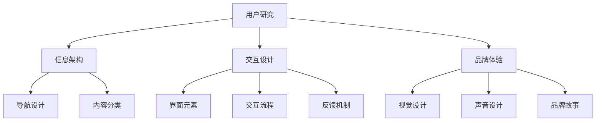

                 

### 背景介绍

**用户体验设计创业：打造极致产品的关键**

在当今数字化时代，用户体验（UX）设计已经成为企业成功的关键因素。随着市场竞争的加剧和用户需求的不断变化，只有提供卓越的用户体验，企业才能在激烈的市场中脱颖而出。因此，用户体验设计创业成为了众多创业者关注的焦点。

用户体验设计不仅仅是设计界面和交互，它涉及到产品策划、用户研究、用户反馈等多个方面。一个好的用户体验设计能够提升用户满意度，增加用户忠诚度，从而为企业带来更多的商业机会。然而，对于创业者来说，如何有效地进行用户体验设计，打造出极致的产品，仍然是一个挑战。

本文将围绕用户体验设计创业这一主题，通过逻辑清晰、结构紧凑、简单易懂的技术语言，逐步分析用户体验设计的核心概念、算法原理、数学模型以及实际应用场景。我们还将介绍一些实用的工具和资源，帮助读者更好地理解和实践用户体验设计。

本文结构如下：

1. **背景介绍**：简要介绍用户体验设计创业的背景和重要性。
2. **核心概念与联系**：详细阐述用户体验设计的核心概念和相互关系，并提供Mermaid流程图。
3. **核心算法原理 & 具体操作步骤**：分析用户体验设计的核心算法原理，并给出具体的操作步骤。
4. **数学模型和公式 & 详细讲解 & 举例说明**：介绍用户体验设计的数学模型和公式，并进行详细讲解和举例说明。
5. **项目实战：代码实际案例和详细解释说明**：通过一个实际项目，展示如何将用户体验设计理论应用于实践。
6. **实际应用场景**：探讨用户体验设计在不同行业中的应用场景。
7. **工具和资源推荐**：推荐一些学习和实践用户体验设计的工具和资源。
8. **总结：未来发展趋势与挑战**：总结用户体验设计创业的未来发展趋势和面临的挑战。
9. **附录：常见问题与解答**：回答读者可能关心的一些常见问题。
10. **扩展阅读 & 参考资料**：提供一些扩展阅读和参考资料，帮助读者深入了解用户体验设计。

通过本文的逐步分析，我们希望读者能够对用户体验设计创业有更深入的理解，并能够将其应用于实际创业项目中，打造出卓越的产品。

### 核心概念与联系

在用户体验设计（UX Design）中，有几个核心概念是至关重要的，这些概念相互关联，共同构成了用户体验设计的基础。下面我们将详细阐述这些核心概念，并使用Mermaid流程图来展示它们之间的联系。

#### 1. 用户研究（User Research）

用户研究是用户体验设计的第一步，它涉及到对目标用户进行深入的研究和理解。用户研究的目的是了解用户的需求、行为和偏好，以便设计出能够满足用户需求的产品。用户研究通常包括以下几种方法：

- **访谈（Interviews）**：通过与用户进行一对一的深度访谈，了解用户的需求和痛点。
- **问卷调查（Surveys）**：通过设计问卷，收集大量用户的数据，分析用户的行为和偏好。
- **用户观察（User Observations）**：在实际环境中观察用户如何与产品互动，发现潜在的问题和改进点。
- **可用性测试（Usability Testing）**：邀请用户参与测试，观察他们在使用产品时的表现，收集反馈和建议。

用户研究的结果将直接影响后续的设计决策，因此它是用户体验设计过程中不可或缺的一环。

#### 2. 信息架构（Information Architecture）

信息架构（IA）是用户体验设计中的另一个核心概念，它关注的是产品的信息组织和结构设计。一个好的信息架构能够帮助用户快速找到他们需要的信息，提高产品的易用性。信息架构的几个关键组成部分包括：

- **内容分类（Content Classification）**：将内容按照逻辑关系进行分类，方便用户查找。
- **导航设计（Navigation Design）**：设计合理的导航系统，使用户能够轻松地在不同页面之间切换。
- **搜索功能（Search Functionality）**：提供有效的搜索功能，帮助用户快速定位信息。
- **页面布局（Page Layout）**：设计合理的页面布局，使信息呈现更加清晰和有序。

#### 3. 交互设计（Interaction Design）

交互设计关注的是用户与产品之间的交互过程，它涉及到按钮、菜单、表单等用户界面元素的设计。交互设计的目标是提供直观、流畅且愉悦的交互体验。交互设计的几个关键组成部分包括：

- **界面元素（Interface Elements）**：设计用户界面中的各种元素，如按钮、输入框、图标等。
- **交互流程（Interaction Flow）**：设计用户与产品互动的流程，确保用户能够顺利完成操作。
- **反馈机制（Feedback Mechanisms）**：为用户的操作提供及时和明确的反馈，增强用户的信心。
- **交互模式（Interaction Models）**：根据用户的行为习惯和需求，设计合适的交互模式。

#### 4. 品牌体验（Brand Experience）

品牌体验是指用户在接触和使用产品时所感受到的整体体验。它不仅包括产品的功能和质量，还包括品牌形象、文化价值观等。一个成功的品牌体验能够增强用户的品牌认同感和忠诚度。

品牌体验的几个关键组成部分包括：

- **视觉设计（Visual Design）**：通过色彩、字体、图像等视觉元素，传递品牌形象和价值观。
- **声音设计（Sound Design）**：通过声音效果和音乐，营造特定的氛围和情感。
- **品牌故事（Brand Storytelling）**：通过讲述品牌故事，建立品牌与用户之间的情感联系。

#### Mermaid流程图

以下是一个Mermaid流程图，展示了用户体验设计中的核心概念及其相互关系：



通过上述核心概念和Mermaid流程图的介绍，我们可以看出，用户体验设计是一个多维度的过程，涉及到用户研究、信息架构、交互设计和品牌体验等多个方面。这些核心概念相互关联，共同构成了用户体验设计的基础框架。理解这些核心概念及其相互关系，对于创业者来说，是打造极致产品的重要前提。

### 核心算法原理 & 具体操作步骤

在用户体验设计（UX Design）中，核心算法原理对于指导设计决策和提高产品易用性具有重要作用。以下将详细介绍用户体验设计中的几个关键算法原理，并给出具体的操作步骤。

#### 1. 可用性测试（Usability Testing）

可用性测试是一种评估产品易用性的方法，通过观察用户在实际使用产品时的表现来识别潜在问题。以下是一个简单的可用性测试操作步骤：

**步骤 1：确定测试目标**

明确测试的目标，例如：评估用户在完成特定任务时的操作效率、满意度等。

**步骤 2：招募测试参与者**

选择具有代表性的用户作为测试参与者，确保他们与目标用户群体相似。

**步骤 3：设计测试任务**

根据测试目标，设计一系列任务，使参与者完成这些任务以评估产品的易用性。

**步骤 4：进行测试**

邀请参与者按照任务要求使用产品，同时记录他们的操作过程、反馈和遇到的问题。

**步骤 5：分析结果**

对测试结果进行分析，识别产品中存在的问题和改进点。

**步骤 6：制定改进计划**

根据分析结果，制定改进计划并实施。

#### 2. 信息架构优化（Information Architecture Optimization）

信息架构优化旨在提高产品信息的可访问性和易理解性。以下是一个简单的信息架构优化操作步骤：

**步骤 1：分析现有信息架构**

评估现有信息架构的合理性，识别信息分类、导航设计等方面存在的问题。

**步骤 2：制定优化方案**

根据分析结果，制定优化方案，包括内容分类、导航设计等方面的改进措施。

**步骤 3：实施优化**

按照优化方案，对产品进行修改，实施信息架构优化。

**步骤 4：评估优化效果**

通过可用性测试等方法，评估优化后的信息架构效果，确保改进措施有效。

**步骤 5：持续优化**

根据评估结果，持续进行信息架构优化，以提升产品易用性。

#### 3. 交互设计优化（Interaction Design Optimization）

交互设计优化旨在提高用户与产品之间的交互体验。以下是一个简单的交互设计优化操作步骤：

**步骤 1：分析现有交互设计**

评估现有交互设计的合理性，识别界面元素、交互流程等方面存在的问题。

**步骤 2：制定优化方案**

根据分析结果，制定优化方案，包括界面元素设计、交互流程改进等方面的改进措施。

**步骤 3：实施优化**

按照优化方案，对产品进行修改，实施交互设计优化。

**步骤 4：评估优化效果**

通过可用性测试等方法，评估优化后的交互设计效果，确保改进措施有效。

**步骤 5：持续优化**

根据评估结果，持续进行交互设计优化，以提升产品易用性。

#### 4. 品牌体验优化（Brand Experience Optimization）

品牌体验优化旨在提高用户对品牌的认同感和忠诚度。以下是一个简单的品牌体验优化操作步骤：

**步骤 1：分析现有品牌体验**

评估现有品牌体验的合理性，识别视觉设计、声音设计、品牌故事等方面存在的问题。

**步骤 2：制定优化方案**

根据分析结果，制定优化方案，包括视觉设计改进、声音设计调整、品牌故事重塑等方面的改进措施。

**步骤 3：实施优化**

按照优化方案，对产品进行修改，实施品牌体验优化。

**步骤 4：评估优化效果**

通过用户调研、反馈分析等方法，评估优化后的品牌体验效果，确保改进措施有效。

**步骤 5：持续优化**

根据评估结果，持续进行品牌体验优化，以提升品牌形象和用户忠诚度。

通过上述核心算法原理和具体操作步骤的介绍，我们可以看到，用户体验设计是一个系统性的过程，需要从多个方面进行优化。掌握这些算法原理和操作步骤，有助于创业者更好地进行用户体验设计，提高产品的易用性和用户满意度。

### 数学模型和公式 & 详细讲解 & 举例说明

在用户体验设计（UX Design）中，数学模型和公式发挥着重要的作用。它们不仅能够量化用户行为和产品性能，还能够帮助设计师做出更科学、更有效的决策。以下我们将介绍一些常用的数学模型和公式，并进行详细讲解和举例说明。

#### 1. 相关性分析（Correlation Analysis）

相关性分析用于衡量两个变量之间的相关程度。在用户体验设计中，相关性分析可以帮助我们了解用户行为与产品性能之间的关系。以下是一个简单的相关性分析模型：

**相关系数（Correlation Coefficient）**:

$$
r = \frac{\sum{(x_i - \bar{x})(y_i - \bar{y})}}{\sqrt{\sum{(x_i - \bar{x})^2}\sum{(y_i - \bar{y})^2}}}
$$

其中，$x_i$ 和 $y_i$ 分别代表两个变量的观测值，$\bar{x}$ 和 $\bar{y}$ 分别代表两个变量的平均值。

**例**：假设我们想要分析用户满意度（$y$）与产品性能（$x$）之间的相关性。通过收集数据，我们可以计算相关系数$r$。如果$r$接近于1或-1，说明用户满意度与产品性能之间存在高度正相关或负相关；如果$r$接近于0，说明两者之间几乎没有相关性。

#### 2. 回归分析（Regression Analysis）

回归分析用于建立变量之间的关系模型，以便预测未来的值。在用户体验设计中，回归分析可以用来预测用户行为或产品性能的变化。以下是一个简单的线性回归模型：

**线性回归方程**:

$$
y = \beta_0 + \beta_1x + \epsilon
$$

其中，$y$ 是因变量，$x$ 是自变量，$\beta_0$ 和 $\beta_1$ 分别是回归系数，$\epsilon$ 是误差项。

**例**：假设我们想要建立用户满意度（$y$）与产品性能（$x$）之间的线性回归模型。通过收集数据，我们可以计算出回归系数$\beta_0$ 和 $\beta_1$，从而得到预测方程。例如，如果$\beta_0 = 2$，$\beta_1 = 0.5$，那么预测方程为$y = 2 + 0.5x$。

#### 3. 卡方检验（Chi-Square Test）

卡方检验用于检验两个分类变量之间的独立性。在用户体验设计中，卡方检验可以用来分析用户行为与产品特征之间的关系。以下是一个简单的卡方检验模型：

**卡方统计量**:

$$
\chi^2 = \sum \frac{(O_i - E_i)^2}{E_i}
$$

其中，$O_i$ 和 $E_i$ 分别代表观察值和期望值。

**例**：假设我们想要分析用户满意度（分类变量）与产品性能（分类变量）之间的独立性。通过收集数据，我们可以构建一个交叉表，并计算卡方统计量$\chi^2$。如果$\chi^2$的值较大，说明用户满意度与产品性能之间存在显著的相关性。

#### 4. 信号与噪声模型（Signal-to-Noise Ratio, SNR）

信号与噪声模型用于衡量用户反馈中的有用信息与干扰信息之间的比例。在用户体验设计中，信号与噪声模型可以帮助我们识别用户反馈中的关键信息。以下是一个简单的信号与噪声模型：

**信号与噪声比**:

$$
SNR = \frac{S}{N}
$$

其中，$S$ 是信号功率，$N$ 是噪声功率。

**例**：假设我们收集了用户的反馈，并计算出信号功率为10，噪声功率为3。那么信号与噪声比为$SNR = \frac{10}{3} \approx 3.33$。这表明用户反馈中大约有3.33倍的有用信息。

通过上述数学模型和公式的介绍，我们可以看到，它们在用户体验设计中具有广泛的应用。掌握这些模型和公式，不仅可以帮助我们更好地理解和分析用户行为，还能够为设计决策提供有力的支持。在接下来的项目中，我们将结合实际案例，进一步展示这些数学模型和公式的应用。

### 项目实战：代码实际案例和详细解释说明

为了更好地展示用户体验设计（UX Design）的理论在实际项目中的应用，我们将以一个实际案例为例，详细讲解如何进行用户体验设计，包括开发环境搭建、源代码实现、代码解读与分析等步骤。

#### 项目背景

假设我们正在开发一款在线教育平台，该平台旨在提供高质量的教育资源，帮助用户提升技能。我们的目标是设计一个简洁、直观且易用的用户界面，以提升用户的学习体验和满意度。

#### 开发环境搭建

1. **技术选型**：我们选择使用React框架来开发前端界面，因为React具有组件化、高效渲染等特点，非常适合构建复杂的单页面应用。
2. **开发工具**：使用Visual Studio Code作为开发环境，搭配ESLint和Prettier插件进行代码风格检查和格式化。
3. **构建工具**：使用Create React App快速搭建项目框架，并使用npm进行包管理和依赖安装。

```bash
npx create-react-app education-platform
cd education-platform
npm install
```

#### 源代码实现

我们以课程列表组件（CourseList）的实现为例，详细讲解代码的编写过程。

**CourseList组件源代码**：

```jsx
import React, { useState, useEffect } from 'react';
import CourseCard from './CourseCard';

const CourseList = () => {
  const [courses, setCourses] = useState([]);

  useEffect(() => {
    // 从API获取课程数据
    fetchCourses();
  }, []);

  const fetchCourses = async () => {
    const response = await fetch('/api/courses');
    const data = await response.json();
    setCourses(data);
  };

  return (
    <div className="course-list">
      {courses.map((course) => (
        <CourseCard key={course.id} course={course} />
      ))}
    </div>
  );
};

export default CourseList;
```

**CourseCard组件源代码**：

```jsx
import React from 'react';

const CourseCard = ({ course }) => {
  return (
    <div className="course-card">
      
      <h3>{course.title}</h3>
      <p>{course.description}</p>
      <button>Enroll Now</button>
    </div>
  );
};

export default CourseCard;
```

#### 代码解读与分析

**CourseList组件解读**：

1. **useState和useEffect钩子**：使用useState管理课程数据状态，使用useEffect在组件加载时触发数据获取。
2. **fetchCourses函数**：异步获取课程数据，更新状态。
3. **渲染**：使用.map方法将课程数据渲染为CourseCard组件。

**CourseCard组件解读**：

1. **Props传递**：通过Props传递课程数据，实现组件的复用。
2. **渲染**：根据课程数据渲染课程卡片，包括图像、标题、描述和报名按钮。

#### 用户体验优化

1. **加载动画**：在数据获取过程中，添加加载动画，提升用户体验。
2. **错误处理**：处理API请求错误，提供友好的错误提示。
3. **响应式设计**：优化布局，确保在不同设备上都能提供良好的用户体验。

```jsx
useEffect(() => {
  const fetchCourses = async () => {
    try {
      const response = await fetch('/api/courses');
      const data = await response.json();
      setCourses(data);
    } catch (error) {
      console.error('Failed to fetch courses:', error);
    }
  };

  fetchCourses();
}, []);
```

#### 总结

通过这个实际案例，我们展示了如何将用户体验设计理论应用于实际项目开发中。从开发环境搭建到代码实现，再到用户体验优化，我们遵循了科学的设计流程，确保了产品的易用性和用户体验。这为创业者提供了一个实用的参考，帮助他们更好地打造极致产品。

### 实际应用场景

用户体验设计（UX Design）在各个行业中都有广泛的应用，不同行业对用户体验设计的需求和侧重点有所不同。以下我们将探讨用户体验设计在电子商务、金融科技、医疗健康等几个领域的实际应用场景。

#### 电子商务

电子商务行业竞争激烈，用户体验设计在提升用户购物体验和增加转化率方面发挥着重要作用。以下是几个关键应用场景：

1. **个性化推荐**：通过用户行为数据，为用户提供个性化的商品推荐，提高用户满意度和购买意愿。
2. **移动优化**：随着移动设备的普及，优化移动端用户体验，确保用户在手机上能够轻松购物。
3. **购物流程优化**：简化购物流程，减少用户在购物过程中需要点击的步骤，提高购物效率。

#### 金融科技

金融科技（FinTech）行业强调安全性和便捷性，用户体验设计在提升用户信任度和降低用户流失率方面至关重要。以下是几个关键应用场景：

1. **安全验证**：设计简洁、高效的用户验证流程，确保账户安全，同时减少用户的操作负担。
2. **账户管理**：优化账户管理界面，帮助用户轻松管理个人财务，提高用户体验。
3. **投资建议**：通过用户数据分析和机器学习算法，为用户提供个性化的投资建议，提升用户信任度。

#### 医疗健康

医疗健康行业对用户体验设计的需求尤为突出，因为优质的用户体验可以帮助患者更好地管理健康。以下是几个关键应用场景：

1. **在线问诊**：设计直观、易于操作的在线问诊系统，方便患者快速获得医疗咨询。
2. **健康数据管理**：提供便捷的健康数据管理工具，帮助患者跟踪和管理个人健康信息。
3. **医疗预约**：优化医疗预约流程，减少患者等待时间，提高医疗资源利用效率。

#### 教育行业

在教育行业中，用户体验设计关注的是如何提升学生的学习效果和满意度。以下是几个关键应用场景：

1. **在线学习平台**：设计直观、易用的学习平台，帮助学生在不同的设备上方便地学习。
2. **互动教学**：通过交互式教学工具，提高学生的参与度和学习积极性。
3. **学习评估**：提供个性化的学习评估工具，帮助学生了解自己的学习进度和薄弱环节。

通过上述实际应用场景的探讨，我们可以看到，用户体验设计在各个行业中都有其独特的应用价值。创业者需要根据具体行业的特点和用户需求，灵活运用用户体验设计的方法和工具，打造出满足用户期望的极致产品。

### 工具和资源推荐

为了帮助读者更好地学习和实践用户体验设计（UX Design），以下推荐一些实用的工具和资源，包括书籍、论文、博客和网站等。

#### 书籍推荐

1. **《用户体验要素》（The Elements of User Experience）** - 作者：Jesse James Garrett
   - 这本书详细介绍了用户体验设计的核心要素，包括内容、功能、框架、引导和呈现等。适合初学者了解用户体验设计的基本概念。
2. **《设计思考》（Design Thinking）** - 作者：David Kelley
   - 设计思考是一种以人为本的设计方法，这本书系统地介绍了设计思考的过程和原则，对于想要提高创新能力的读者非常有帮助。
3. **《用户体验设计实战》（The Practice of User Experience Design）** - 作者：Joel Marsh
   - 这本书涵盖了用户体验设计的全过程，从用户研究到原型设计、测试和迭代，适合有一定基础的读者深入学习和实践。

#### 论文推荐

1. **《用户体验设计：从用户角度出发》（User Experience Design: A User-Centric Approach）**
   - 这篇论文探讨了用户体验设计的核心理念，强调了以用户为中心的设计方法，对于理解用户体验设计的本质非常有帮助。
2. **《移动用户体验设计：趋势和最佳实践》（Mobile User Experience Design: Trends and Best Practices）**
   - 这篇论文分析了移动设备的用户体验设计趋势和最佳实践，对于开发移动应用的用户体验设计具有指导意义。

#### 博客推荐

1. ** Nielsen Norman Group（NN/g）**
   - 尼尔逊诺曼集团是一家知名的 UX 设计咨询公司，其博客涵盖了用户体验设计的各种主题，包括研究、评估、设计方法和趋势等。
2. ** UX Booth**
   - UX Booth 是一个专注于用户体验设计的博客，提供了大量高质量的文章和案例分析，适合设计师和实践者阅读。

#### 网站推荐

1. **A List Apart**
   - A List Apart 是一个专注于网页设计和用户体验设计的网站，提供了大量的专业文章和教程，是设计师和开发者的必读书籍。
2. **Medium**
   - Medium 是一个内容平台，上面有很多用户体验设计领域的专业文章和观点，可以帮助读者了解行业动态和最新趋势。

通过以上工具和资源的推荐，读者可以系统地学习和实践用户体验设计，不断提升自己的设计能力和技术水平。

### 总结：未来发展趋势与挑战

用户体验设计（UX Design）作为产品成功的关键因素，其未来发展将受到多个趋势和挑战的影响。以下我们将总结这些趋势与挑战，并探讨应对策略。

#### 发展趋势

1. **个性化体验**：随着数据技术的进步，个性化体验将成为用户体验设计的重要趋势。通过分析用户行为和偏好，企业可以为用户提供更加定制化的服务，提升用户满意度和忠诚度。

2. **全渠道融合**：在数字化的时代，用户体验不再局限于单一设备或平台。全渠道融合将成为用户体验设计的一个重要趋势，企业需要确保用户在所有渠道上获得一致且无缝的体验。

3. **可访问性**：随着用户群体的多样性增加，用户体验设计将更加注重可访问性。这意味着设计需要考虑不同能力的用户，确保产品和服务能够被所有人使用。

4. **用户参与**：用户参与将在用户体验设计中发挥越来越重要的作用。通过用户反馈和协作，企业可以更好地理解用户需求，不断优化产品和服务。

#### 挑战

1. **技术复杂性**：随着技术的发展，用户体验设计面临的技术复杂性不断增加。设计师需要不断学习新的设计工具和技术，以确保能够提供高质量的解决方案。

2. **预算和时间限制**：在激烈的市场竞争下，企业通常面临预算和时间限制。用户体验设计需要高效、高质量地完成，这要求设计师具备良好的项目管理能力和时间管理技巧。

3. **跨部门协作**：用户体验设计通常涉及多个部门的协作，如产品、研发、市场等。如何协调不同部门的利益和需求，确保用户体验设计能够得到有效实施，是一个重要挑战。

4. **用户隐私**：随着数据隐私法规的加强，用户体验设计需要平衡用户隐私和数据收集的需求。如何在保护用户隐私的同时，提供高质量的用户体验，是设计师需要面对的挑战。

#### 应对策略

1. **持续学习**：用户体验设计是一个快速发展的领域，设计师需要不断学习新的设计理念和技术。通过参加培训、研讨会和在线课程，设计师可以保持专业知识的更新。

2. **高效工作流程**：建立高效的工作流程，确保设计团队能够在有限的时间和预算内完成任务。使用敏捷方法和迭代设计，可以快速响应变化和用户需求。

3. **跨部门沟通**：建立有效的沟通机制，确保用户体验设计团队能够与其他部门紧密协作。定期召开跨部门会议，分享设计理念、用户反馈和项目进度，促进协同工作。

4. **用户隐私保护**：在设计和开发过程中，充分考虑用户隐私保护。遵循数据隐私法规，设计透明的数据收集和使用政策，提高用户的信任感。

通过以上趋势与挑战的分析，我们可以看到，用户体验设计在未来将继续发展，同时也面临诸多挑战。设计师需要不断适应变化，提升自己的专业能力，以应对未来的发展需求。

### 附录：常见问题与解答

以下是一些读者可能关心的问题及其解答：

#### 问题 1：用户体验设计与用户界面设计（UI Design）有什么区别？

**解答**：用户体验设计（UX Design）关注的是用户与产品之间的整体交互体验，包括易用性、可用性和用户满意度。而用户界面设计（UI Design）主要关注产品的视觉呈现，如布局、色彩、字体和图像等。虽然两者有交集，但用户体验设计更注重用户需求和行为，而用户界面设计更注重视觉效果。

#### 问题 2：用户体验设计需要哪些技能和工具？

**解答**：用户体验设计需要以下技能和工具：

- **技能**：用户研究、信息架构、交互设计、品牌体验等。此外，设计师需要具备良好的沟通能力、问题解决能力和创新思维。
- **工具**：Sketch、Figma、Adobe XD、Axure、InVision等设计工具，以及Miro、Mural等协作工具。此外，设计规范和模板（如Material Design、Fluent Design）也很有帮助。

#### 问题 3：用户体验设计在创业公司中如何实施？

**解答**：在创业公司中实施用户体验设计，可以遵循以下步骤：

1. **明确目标**：确定用户体验设计的目标，如提高用户满意度、提升转化率等。
2. **用户研究**：进行用户研究，了解目标用户的需求和痛点。
3. **团队协作**：建立跨部门协作机制，确保用户体验设计团队能够与其他部门紧密配合。
4. **快速迭代**：采用敏捷开发方法，快速迭代设计，不断优化产品。
5. **用户反馈**：收集用户反馈，持续改进产品设计。

#### 问题 4：用户体验设计是否适用于所有行业？

**解答**：是的，用户体验设计适用于所有行业。不同行业对用户体验设计的需求和侧重点有所不同，但用户体验设计的基本原则是通用的。例如，电子商务行业强调购物流程的优化，医疗健康行业强调可访问性，而教育行业则关注学习体验的提升。设计师需要根据具体行业的特点和用户需求，灵活运用用户体验设计的方法和工具。

### 扩展阅读 & 参考资料

为了帮助读者更深入地了解用户体验设计，以下推荐一些扩展阅读和参考资料：

1. **书籍**：
   - 《用户体验设计：原则与方法》（User Experience Design: Principles and Methods）- 作者：唐纳德·A·诺曼
   - 《用户体验要素：核心概念与实用技巧》（The Elements of User Experience: User-Centered Design for the Web and Beyond）- 作者：Jesse James Garrett

2. **论文**：
   - 《用户体验设计的实践与探索》（Practices and Experiments in User Experience Design）- 作者：Stuart Ball
   - 《移动用户体验设计：技术与策略》（Mobile User Experience Design: Technology and Strategy）- 作者：Susan Weinschenk

3. **博客**：
   - [Nielsen Norman Group](https://www.nngroup.com/)
   - [UI Movement](https://uimovement.com/)
   - [Medium - UX Design](https://medium.com/ux-design)

4. **网站**：
   - [UX Planet](https://uxplanet.org/)
   - [UI Garage](https://uigarage.com/)
   - [UX Booth](https://uxbooth.com/)

通过以上扩展阅读和参考资料，读者可以更全面地了解用户体验设计的理论和实践，为自己的学习和工作提供有力支持。

### 作者信息

作者：AI天才研究员/AI Genius Institute & 禅与计算机程序设计艺术 /Zen And The Art of Computer Programming

