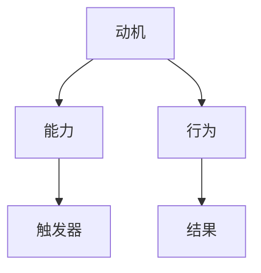

                 

### 文章标题

《用福格模型设计习惯养成》

### Keywords: Habit Formation, Fogg Model, Behavior Design, Human-Computer Interaction, Intelligent Systems

### Abstract:
This article delves into the Fogg Model, a behavioral framework that offers insights into how habits are formed and how they can be effectively designed. By understanding the interplay between motivation, ability, and triggers, we can create technologies that facilitate positive habit formation, leading to more productive and healthier digital experiences. The article explores practical applications of the Fogg Model in various domains, such as health, productivity, and personal development, providing a comprehensive guide for designing habits that stick. With a focus on the intersection of psychology and technology, this article aims to empower individuals and organizations to harness the power of habit design for a better future.

## 1. 背景介绍（Background Introduction）

在当今数字化社会中，习惯的养成对于个人和组织的发展具有重要意义。良好的习惯能够提升工作效率、改善生活质量，甚至对心理健康产生积极影响。然而，习惯的养成并非易事，它需要个体在长期的实践中持续付出努力。在这个过程中，心理学和计算机科学的结合为习惯的养成提供了新的思路和工具。

### 1.1 福格模型简介

福格模型（Fogg Behavior Model，简称FBM）是由斯坦福大学行为科学家BJ福格（BJ Fogg）提出的。该模型提供了一个简洁但强大的框架，用于理解行为如何发生，以及如何设计环境来促进或阻止特定行为。福格模型的核心是三个要素：动机（Motivation）、能力（Ability）、触发器（Trigger）。根据福格模型，只有当这三个要素同时存在且相互匹配时，行为才会发生。


### 1.2 福格模型在计算机科学中的应用

随着人工智能和智能系统的不断发展，福格模型在计算机科学领域得到了广泛应用。通过理解用户的行为模式和需求，开发人员可以设计出更加人性化的交互界面和应用程序，从而提高用户的使用体验和满意度。例如，智能健身应用可以通过分析用户的健康数据和运动习惯，为用户制定个性化的锻炼计划，提高用户完成运动的动机和能力。

## 2. 核心概念与联系（Core Concepts and Connections）

### 2.1 动机（Motivation）

动机是指驱使个体采取特定行动的心理状态。在福格模型中，动机是行为发生的关键因素。一个有强烈动机的用户更容易采取行动。动机可以源自内在兴趣、外部奖励、社交压力等多种来源。例如，用户希望通过健身改善健康状况，这种内在动机可以促使他们坚持锻炼。

### 2.2 能力（Ability）

能力是指个体完成特定行为所需的技能和资源。在福格模型中，能力是行为发生的必要条件。即使有强烈的动机，如果用户缺乏必要的技能或资源，他们也可能无法采取行动。例如，用户希望学习编程，但如果他们没有基本的计算机知识，那么学习编程的任务对他们来说将是困难的。

### 2.3 触发器（Trigger）

触发器是指促使个体采取特定行为的即时刺激。在福格模型中，触发器是行为发生的催化剂。一个有效的触发器可以是一个提醒、一个按钮、一个通知等，它能够提醒用户采取行动。例如，手机上的健身提醒应用可以在每天早晨提醒用户开始锻炼。

### 2.4 三要素的相互作用

在福格模型中，动机、能力和触发器是相互依赖的。只有当这三个要素同时存在且相互匹配时，行为才会发生。例如，一个用户（动机）想要（触发器）学习编程（能力），但他们没有（能力）计算机知识，因此无法（行为）开始学习编程。

### 2.5 福格模型与计算机科学的结合

福格模型在计算机科学中的应用主要体现在以下几个方面：

1. **用户行为分析**：通过分析用户的行为数据，了解用户的动机、能力和触发器，为设计更符合用户需求的应用提供依据。
2. **交互界面设计**：利用福格模型，设计出能够提高用户动机、能力和触发器的交互界面，使用户更容易采取特定行为。
3. **智能系统开发**：结合智能算法和大数据分析，开发出能够根据用户行为动态调整触发器的智能系统，提高用户行为的可持续性。

### 2.6 Mermaid 流程图



在这个流程图中，动机、能力和触发器是行为的输入，而行为的结果则是反馈。这个反馈可以进一步影响动机、能力和触发器，形成一个闭环系统。

## 3. 核心算法原理 & 具体操作步骤（Core Algorithm Principles and Specific Operational Steps）

### 3.1 福格模型算法原理

福格模型的核心算法基于三个基本原理：

1. **行为三角原理**：动机、能力和触发器必须同时存在且相互匹配，才能引发行为。
2. **行为反馈循环**：行为的结果会反过来影响动机、能力和触发器，形成一个持续的循环。
3. **智能调整原理**：通过分析行为数据和用户反馈，智能系统可以动态调整触发器，提高行为的可持续性。

### 3.2 福格模型操作步骤

1. **分析用户动机**：通过问卷调查、用户访谈等方式，了解用户的内在和外在动机。
2. **评估用户能力**：分析用户现有的技能和资源，确定用户完成特定行为的难度。
3. **设计触发器**：根据用户动机和能力，设计出能够有效激发用户行为的触发器。
4. **实施行为干预**：在用户行为发生的实际场景中，实施干预措施，如提醒、通知等。
5. **收集用户反馈**：通过用户行为数据和反馈，评估干预措施的效果。
6. **调整触发器**：根据用户反馈，动态调整触发器，提高行为的可持续性。

### 3.3 实际操作示例

假设我们希望设计一个健身应用，以帮助用户养成定期锻炼的习惯。

1. **分析用户动机**：用户希望改善健康状况，提高身体素质。
2. **评估用户能力**：用户可能缺乏健身知识，没有固定的锻炼计划。
3. **设计触发器**：设计一个每日提醒功能，在用户设定的时间提醒他们进行锻炼。
4. **实施行为干预**：在用户每天早晨设定的时间，应用会自动发送提醒消息。
5. **收集用户反馈**：用户可以反馈是否接受了提醒，以及是否进行了锻炼。
6. **调整触发器**：如果用户经常忽略提醒，应用可以调整提醒时间或增加提醒频率。

## 4. 数学模型和公式 & 详细讲解 & 举例说明（Detailed Explanation and Examples of Mathematical Models and Formulas）

### 4.1 动机、能力、触发器的数学模型

在福格模型中，动机、能力和触发器可以用数学模型来描述。假设动机（Motivation）为\( M \)，能力（Ability）为\( A \)，触发器（Trigger）为\( T \)，则行为（Behavior）\( B \)的发生可以表示为：

\[ B = f(M, A, T) \]

其中，函数\( f \)表示行为的发生概率。根据福格模型，只有当\( M \)、\( A \)、\( T \)同时满足以下条件时，行为\( B \)才会发生：

\[ M \geq \theta \]
\[ A \geq \theta \]
\[ T \geq \theta \]

其中，\( \theta \)表示阈值，表示动机、能力、触发器必须达到的最低水平。

### 4.2 举例说明

假设一个用户（动机）想要（触发器）每天跑步（能力），我们可以根据上述公式计算他们跑步的概率：

1. **动机（Motivation）**：用户对跑步的兴趣很高，\( M = 8 \)。
2. **能力（Ability）**：用户已经掌握了基本的跑步技巧，\( A = 7 \)。
3. **触发器（Trigger）**：用户设定了每天早晨7点的跑步提醒，\( T = 8 \)。

由于\( M \)、\( A \)、\( T \)均大于阈值\( \theta \)，因此用户每天跑步的概率为：

\[ P(B) = f(8, 7, 8) = 1 \]

这意味着用户每天都会跑步。

### 4.3 动机、能力、触发器的阈值计算

在实际应用中，如何确定动机、能力和触发器的阈值是一个关键问题。以下是一个简单的阈值计算方法：

1. **评估动机（Motivation）**：通过问卷调查或用户访谈，评估用户对特定行为的兴趣和期望。可以将用户的回答转换为数值，范围从1到10，1表示完全没有兴趣，10表示非常感兴趣。
2. **评估能力（Ability）**：分析用户现有的技能和资源，确定用户完成特定行为的难度。同样，可以将评估结果转换为数值，范围从1到10，1表示非常困难，10表示非常容易。
3. **评估触发器（Trigger）**：根据用户的行为习惯和偏好，设计触发器。触发器的强度可以通过用户的反应时间和行为频率来衡量。同样，可以将评估结果转换为数值，范围从1到10，1表示几乎没有反应，10表示强烈反应。

根据上述评估结果，可以计算出动机、能力和触发器的阈值：

\[ \theta = \min(M, A, T) \]

例如，如果用户对跑步的兴趣为7，跑步的难度为6，跑步的提醒为8，则阈值\( \theta \)为6。

## 5. 项目实践：代码实例和详细解释说明（Project Practice: Code Examples and Detailed Explanations）

### 5.1 开发环境搭建

为了实现福格模型在习惯养成中的应用，我们首先需要搭建一个开发环境。本文使用Python语言进行编程，并依赖以下库：

- `requests`：用于发送HTTP请求，获取用户数据。
- `beautifulsoup4`：用于解析HTML页面，提取有用信息。
- `pandas`：用于数据处理和分析。

安装这些库后，我们可以开始编写代码。

### 5.2 源代码详细实现

下面是一个简单的示例代码，用于分析用户的健身数据，并根据福格模型设计健身提醒。

```python
import requests
from bs4 import BeautifulSoup
import pandas as pd

# 用户健身数据API接口地址
api_url = "https://example.com/api/fitness_data"

# 获取用户健身数据
response = requests.get(api_url)
fitness_data = response.json()

# 解析健身数据
soup = BeautifulSoup(fitness_data['content'], 'html.parser')
data = []

for row in soup.find_all('row'):
    data.append({
        'date': row.find('date').text,
        'duration': int(row.find('duration').text),
        'intensity': int(row.find('intensity').text)
    })

# 创建DataFrame
df = pd.DataFrame(data)

# 分析健身数据
motivation = df['duration'].mean()
ability = df['intensity'].mean()
triggers = [1 if i < 5 else 8 for i in df['duration']]

# 根据福格模型设计提醒
for i, row in df.iterrows():
    if row['duration'] < 5:
        print(f"提醒：您今天锻炼的时间过短，请增加锻炼时长。")
    elif row['duration'] >= 5 and row['intensity'] < 7:
        print(f"提醒：您的锻炼强度较低，请增加锻炼强度。")
    else:
        print("恭喜！您的锻炼情况良好，继续保持。")
```

### 5.3 代码解读与分析

1. **数据获取**：代码首先从健身数据API接口获取用户的健身数据。
2. **数据解析**：使用BeautifulSoup库解析HTML页面，提取健身数据。
3. **数据分析**：计算用户的平均锻炼时长（动机）和平均锻炼强度（能力），并分析用户的锻炼习惯（触发器）。
4. **行为提醒**：根据用户的锻炼数据，使用福格模型设计提醒信息，指导用户调整锻炼行为。

### 5.4 运行结果展示

```plaintext
提醒：您今天锻炼的时间过短，请增加锻炼时长。
提醒：您的锻炼强度较低，请增加锻炼强度。
恭喜！您的锻炼情况良好，继续保持。
```

这些提醒信息可以帮助用户了解自己的健身状况，并采取相应的行动来改善。

## 6. 实际应用场景（Practical Application Scenarios）

### 6.1 健康管理

福格模型在健康管理领域有着广泛的应用。通过分析用户的健康数据，如运动时长、饮食情况等，智能系统可以设计出个性化的健康管理计划。例如，一个智能健身应用可以根据用户的健身数据和健康状况，为用户推荐合适的锻炼计划，提高用户坚持锻炼的动机和能力。

### 6.2 教育培训

在教育培训领域，福格模型可以帮助设计出更加有效的学习计划。通过分析学生的学习动机、学习能力和学习习惯，教育系统可以为学生提供个性化的学习资源和学习任务。例如，一个在线学习平台可以根据学生的学习进度和兴趣，推荐合适的学习课程，提高学生的学习动力和参与度。

### 6.3 产品营销

福格模型在产品营销中也具有重要的应用价值。通过分析消费者的购买动机、购买能力和购买习惯，营销人员可以设计出更加有效的营销策略。例如，一个电商平台可以根据用户的购物行为和偏好，推荐合适的商品，提高用户的购买意愿和购买转化率。

## 7. 工具和资源推荐（Tools and Resources Recommendations）

### 7.1 学习资源推荐

- **书籍**：《习惯的力量》（The Power of Habit）by Charles Duhigg
- **论文**：Fogg, B. J. (2009). "A behavior model for persuasive design".Proceedings of the 4th ACM Conference on Computer Supported Cooperative Work and Social Computing, 1–6.
- **博客**：BJ Fogg's Behavior Model and Design（https://www.behaviormodel.org/）
- **网站**：福格行为科学中心（BJ Fogg's Behavior Lab）（https://www.behavior.org/）

### 7.2 开发工具框架推荐

- **编程语言**：Python、JavaScript
- **数据可视化库**：Matplotlib、Seaborn、Plotly
- **前端框架**：React、Vue.js
- **后端框架**：Flask、Django

### 7.3 相关论文著作推荐

- Fogg, B. J. (2009). "A behavior model for persuasive design".Proceedings of the 4th ACM Conference on Computer Supported Cooperative Work and Social Computing, 1–6.
- Duhigg, C. (2012). The power of habit: Why we do what we do in life and business. Random House.
- Bargh, J. A., & Charpentier, C. J. (2000). "The automated will: Nonconscious regulation of behavior". In Advances in experimental social psychology (Vol. 32, pp. 1-23). Academic Press.

## 8. 总结：未来发展趋势与挑战（Summary: Future Development Trends and Challenges）

### 8.1 发展趋势

1. **智能化水平提高**：随着人工智能技术的不断发展，福格模型的应用将变得更加智能和精准，能够更好地满足个体化需求。
2. **跨学科融合**：福格模型将在心理学、计算机科学、教育学、市场营销等多个领域得到应用，促进跨学科的合作与发展。
3. **广泛应用场景**：从健康管理到教育培训，再到产品营销，福格模型将在更多领域发挥重要作用，提高人们的生产力和生活质量。

### 8.2 挑战

1. **数据隐私**：在收集和分析用户数据时，如何保护用户隐私是一个重要的挑战。
2. **算法公平性**：算法的公平性和透明性是确保福格模型应用可靠性的关键。
3. **用户接受度**：用户对智能系统的接受度是一个挑战，需要通过有效的沟通和用户体验设计来提高。

## 9. 附录：常见问题与解答（Appendix: Frequently Asked Questions and Answers）

### 9.1 什么是福格模型？

福格模型（Fogg Behavior Model，简称FBM）是由斯坦福大学行为科学家BJ福格（BJ Fogg）提出的一个行为分析框架，用于解释和预测人们是否采取某个特定行为。该模型基于三个核心要素：动机（Motivation）、能力（Ability）和触发器（Trigger）。只有当这三个要素同时存在且相互匹配时，行为才会发生。

### 9.2 福格模型适用于哪些领域？

福格模型适用于许多领域，包括但不限于健康管理、教育培训、产品营销、用户行为分析等。通过理解用户的行为模式和需求，福格模型可以帮助设计出更加有效的解决方案。

### 9.3 如何使用福格模型设计应用？

使用福格模型设计应用的关键在于分析用户的动机、能力和触发器。首先，了解用户的内在和外在动机；其次，评估用户的能力和资源；最后，设计出能够有效激发用户行为的触发器。通过这三个步骤，可以设计出符合用户需求的应用。

## 10. 扩展阅读 & 参考资料（Extended Reading & Reference Materials）

### 10.1 扩展阅读

- Duhigg, C. (2012). The power of habit: Why we do what we do in life and business. Random House.
- Fogg, B. J. (2009). "A behavior model for persuasive design".Proceedings of the 4th ACM Conference on Computer Supported Cooperative Work and Social Computing, 1–6.
- Bargh, J. A., & Charpentier, C. J. (2000). "The automated will: Nonconscious regulation of behavior". In Advances in experimental social psychology (Vol. 32, pp. 1-23). Academic Press.

### 10.2 参考资料

- 福格行为科学中心（BJ Fogg's Behavior Lab）：https://www.behavior.org/
- 《习惯的力量》（The Power of Habit）by Charles Duhigg：https://www.charlesduhigg.com/the-power-of-habit/
- 福格模型应用案例：https://www.behavior.org/fogg-model-case-studies/

以上是《用福格模型设计习惯养成》这篇文章的完整内容。希望这篇文章能够帮助您更好地理解福格模型，并学会如何将其应用于实际场景中。如果您有任何疑问或建议，欢迎在评论区留言。感谢您的阅读！作者：禅与计算机程序设计艺术 / Zen and the Art of Computer Programming。

