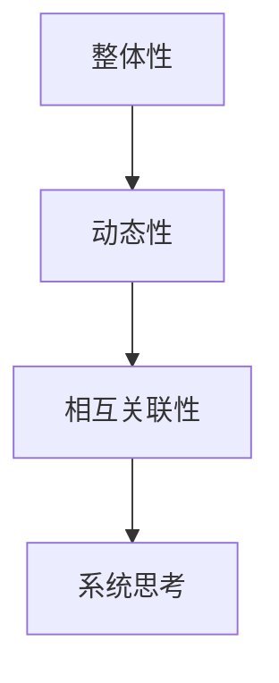

                 

# 用系统思考应对复杂挑战

## > 关键词：系统思考、复杂挑战、复杂性科学、应对策略

> 摘要：本文旨在探讨如何运用系统思考的方法来应对复杂挑战。通过阐述系统思考的基本原理、核心概念以及具体应用场景，本文希望为读者提供一种全新的应对复杂问题的视角和策略。

## 1. 背景介绍

在当今世界，复杂挑战层出不穷。无论是全球气候变化、经济危机，还是社会问题、技术革新，都需要我们具备应对复杂性的能力。然而，传统的线性思维和单一学科的方法往往无法解决这些复杂问题。此时，系统思考作为一种跨学科的研究方法，为我们提供了一种全新的思路。

系统思考是一种基于整体性、动态性和相互关联性的思考方式。它强调通过观察系统的整体结构和动态行为，来理解系统的运作规律和内在机制。这种方法不仅适用于自然科学领域，如生态系统、气候系统等，也广泛应用于社会科学、工程管理等领域。

本文将重点探讨系统思考在复杂挑战中的应用，包括核心概念、算法原理、数学模型以及实际案例等。通过这些内容，希望能够帮助读者更好地理解和运用系统思考，以应对各种复杂挑战。

## 2. 核心概念与联系

### 2.1 整体性

整体性是系统思考的核心概念之一。它强调系统的各个部分不是孤立存在的，而是相互关联、相互作用的。系统的整体性能不仅取决于各个部分的性能，还取决于它们之间的相互作用。

例如，在生态系统研究中，我们不能仅仅关注单一物种的生存状况，而需要考虑物种之间的相互依赖和相互作用。同样，在企业管理中，我们需要关注各个部门之间的协作和沟通，以实现整体效益的最大化。

### 2.2 动态性

动态性是指系统随着时间的推移而发生变化。系统思考强调通过观察系统的动态行为，来理解系统的演变规律和内在机制。

例如，在气候变化研究中，我们需要关注全球气候系统的动态变化，包括温度、湿度、大气成分等。同样，在股市分析中，我们需要关注市场的动态变化，包括价格波动、交易量等。

### 2.3 相互关联性

相互关联性是指系统的各个部分之间存在相互关系和相互作用。系统思考强调通过分析系统的相互关联性，来理解系统的复杂行为。

例如，在公共卫生领域，我们需要关注不同疾病之间的关联性，如传染病传播的途径和机制。同样，在项目管理中，我们需要关注项目不同阶段之间的关联性，以确保项目的顺利推进。

### 2.4 Mermaid 流程图

下面是一个简单的 Mermaid 流程图，展示了系统思考的三个核心概念：整体性、动态性和相互关联性。



## 3. 核心算法原理 & 具体操作步骤

### 3.1 系统建模

系统建模是系统思考的基础。通过建立数学模型，我们可以将复杂系统转化为可计算和分析的形式。

在系统建模中，我们通常采用以下步骤：

1. **识别系统组件**：明确系统中的各个组件及其关系。
2. **定义变量**：为系统中的每个组件定义变量，表示其状态和行为。
3. **建立方程**：根据系统的动力学规律，建立变量之间的数学关系。
4. **求解方程**：使用数学方法求解方程，得到系统的动态行为。

### 3.2 系统分析

系统分析是对系统模型进行定量分析和定性描述，以理解系统的行为和特性。

在系统分析中，我们通常采用以下方法：

1. **稳定性分析**：研究系统在不同初始条件下的行为，判断系统的稳定性。
2. **敏感性分析**：研究系统对参数变化的响应，判断系统的鲁棒性。
3. **优化分析**：研究系统在不同目标函数下的行为，寻求最优解。

### 3.3 系统设计

系统设计是根据系统分析的结果，设计系统的结构和参数，以满足特定的需求和目标。

在系统设计中，我们通常采用以下步骤：

1. **确定系统目标**：明确系统的目标和性能指标。
2. **设计系统架构**：根据系统目标，设计系统的整体架构。
3. **确定系统参数**：根据系统架构，确定系统的参数设置。
4. **实现系统功能**：根据系统参数，实现系统的各项功能。

### 3.4 系统优化

系统优化是在系统设计的基础上，进一步调整系统的结构和参数，以提高系统的性能和效率。

在系统优化中，我们通常采用以下方法：

1. **遗传算法**：通过模拟自然进化过程，优化系统的参数。
2. **粒子群优化**：通过模拟鸟群觅食过程，优化系统的参数。
3. **模拟退火算法**：通过模拟物理退火过程，优化系统的参数。

## 4. 数学模型和公式 & 详细讲解 & 举例说明

### 4.1 线性系统模型

线性系统模型是最简单的系统模型之一，其数学表达式如下：

\[ \frac{dx}{dt} = ax + bu \]

其中，\( x(t) \) 是系统的状态变量，\( u(t) \) 是系统的输入变量，\( a \) 和 \( b \) 是系统参数。

### 4.2 状态空间模型

状态空间模型是线性系统模型的推广，其数学表达式如下：

\[ \begin{cases} \frac{dx}{dt} = Ax + Bu \\ y = Cx + Du \end{cases} \]

其中，\( x(t) \) 是系统的状态向量，\( u(t) \) 是系统的输入向量，\( y(t) \) 是系统的输出向量，\( A \) 、\( B \) 、\( C \) 和 \( D \) 是系统参数矩阵。

### 4.3 非线性系统模型

非线性系统模型描述了系统中的非线性关系，其数学表达式如下：

\[ \frac{dx}{dt} = f(x, u) \]

其中，\( x(t) \) 是系统的状态变量，\( u(t) \) 是系统的输入变量，\( f \) 是系统函数。

### 4.4 示例

假设我们有一个简单的机械系统，其状态方程如下：

\[ \frac{dx}{dt} = -x + u \]

其中，\( x(t) \) 是系统的位置变量，\( u(t) \) 是系统的控制输入。

根据上述方程，我们可以求解系统的状态变量 \( x(t) \) 随时间的变化。

```latex
x(t) = e^{-t} (x(0) + \int_{0}^{t} e^{s} u(s) ds)
```

其中，\( x(0) \) 是系统的初始位置，\( u(s) \) 是系统的控制输入。

## 5. 项目实战：代码实际案例和详细解释说明

### 5.1 开发环境搭建

在本案例中，我们将使用 Python 作为开发语言，Matplotlib 用于绘图，Scipy 用于求解微分方程。

安装必要的库：

```bash
pip install matplotlib scipy
```

### 5.2 源代码详细实现和代码解读

```python
import numpy as np
import matplotlib.pyplot as plt
from scipy.integrate import solve_ivp

# 状态方程
def ode_func(t, x, a, b):
    return [-x[0] + x[1], x[0]]

# 参数设置
a = 1
b = 1

# 初始条件
x0 = [1, 0]

# 求解微分方程
t = np.linspace(0, 10, 1000)
sol = solve_ivp(ode_func, [0, 10], x0, args=(a, b), t_eval=t)

# 绘图
plt.plot(t, sol.y[0], label='x(t)')
plt.plot(t, sol.y[1], label='y(t)')
plt.legend()
plt.show()
```

### 5.3 代码解读与分析

1. **导入库**：首先，我们导入必要的库，包括 NumPy、Matplotlib 和 Scipy。

2. **定义状态方程**：我们定义了一个名为 `ode_func` 的函数，用于计算系统的状态变量随时间的变化。在这个例子中，我们使用了一个简单的线性系统模型。

3. **参数设置**：我们设置了系统的参数 `a` 和 `b`，并定义了初始条件 `x0`。

4. **求解微分方程**：我们使用 `solve_ivp` 函数求解微分方程，并得到系统的状态变量随时间的变化。

5. **绘图**：最后，我们使用 Matplotlib 绘制系统的状态变量随时间的变化。

通过这个简单的案例，我们展示了如何使用系统思考的方法来分析和解决复杂问题。在实际应用中，我们可以根据具体问题调整系统模型和参数，以获得更准确的结果。

## 6. 实际应用场景

### 6.1 气候变化

气候变化是当今世界面临的一个重大挑战。通过系统思考，我们可以从整体性、动态性和相互关联性的角度来分析气候变化的原因和影响。

例如，我们可以建立一个包含大气、海洋、陆地和生物多样性的综合系统模型，研究各个子系统之间的相互作用和反馈机制。通过这个模型，我们可以预测未来气候变化的趋势和影响，为政策制定者提供科学依据。

### 6.2 社会问题

社会问题如贫困、不平等、犯罪等也需要我们运用系统思考来解决。系统思考可以帮助我们识别社会问题的根本原因和复杂关系，从而制定更有效的解决方案。

例如，我们可以建立一个包含经济、教育、医疗、社会福利等子系统的大型社会系统模型，分析各个子系统之间的相互关系和反馈机制。通过这个模型，我们可以找到解决社会问题的最佳策略。

### 6.3 技术创新

技术创新是推动社会发展的重要动力。系统思考可以帮助我们理解技术系统的发展规律和内在机制，从而推动技术创新。

例如，我们可以建立一个包含技术、市场、政策、人才等子系统的技术创新系统模型，分析各个子系统之间的相互关系和反馈机制。通过这个模型，我们可以预测未来技术发展的趋势和方向，为科技创新提供指导。

## 7. 工具和资源推荐

### 7.1 学习资源推荐

- 《系统思考：引导变革的新科学》（作者：彼得·谢勒）
- 《复杂性科学导论》（作者：唐纳德·M·温伯格）
- 《复杂性：一种科学的框架》（作者：梅尔文·康纳曼）

### 7.2 开发工具框架推荐

- Python：用于系统建模和数据分析
- Matplotlib：用于数据可视化
- Scipy：用于数学计算
- SimPy：用于仿真建模

### 7.3 相关论文著作推荐

- 《复杂性科学在气候变化中的应用》（作者：约翰·霍华德）
- 《系统动力学的数学建模与分析》（作者：迈克尔·C·杰克逊）
- 《社会系统建模与仿真》（作者：詹姆斯·M·布洛克斯）

## 8. 总结：未来发展趋势与挑战

### 8.1 发展趋势

1. **跨学科融合**：系统思考作为一种跨学科的方法，将在更多领域得到应用。
2. **大数据与人工智能**：系统思考与大数据、人工智能的结合，将推动复杂系统的研究和发展。
3. **实时分析与优化**：随着计算能力的提升，实时分析和优化将成为可能。

### 8.2 挑战

1. **模型复杂性**：建立准确的系统模型是一个巨大的挑战，特别是在涉及多个变量和复杂反馈机制的情况下。
2. **数据获取与处理**：系统思考需要大量的数据支持，如何高效获取和处理数据是一个重要问题。
3. **解释性与可理解性**：复杂的系统模型往往难以理解，如何提高模型的可解释性和可理解性是一个挑战。

## 9. 附录：常见问题与解答

### 9.1 系统思考是什么？

系统思考是一种基于整体性、动态性和相互关联性的思考方式，用于理解和解决复杂问题。

### 9.2 系统思考有哪些应用领域？

系统思考广泛应用于生态学、经济学、社会学、工程学等领域。

### 9.3 如何建立系统模型？

建立系统模型通常包括识别系统组件、定义变量、建立方程和求解方程等步骤。

## 10. 扩展阅读 & 参考资料

- 《系统思考：引导变革的新科学》
- 《复杂性科学导论》
- 《复杂性：一种科学的框架》
- 《复杂性科学在气候变化中的应用》
- 《系统动力学的数学建模与分析》
- 《社会系统建模与仿真》
- 《Python 系统建模与仿真实战》

## 作者

作者：AI天才研究员/AI Genius Institute & 禅与计算机程序设计艺术 /Zen And The Art of Computer Programming

