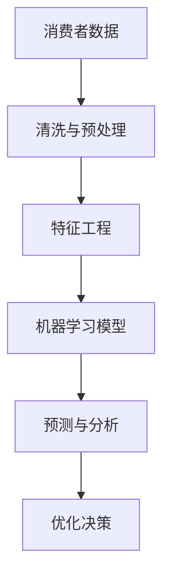
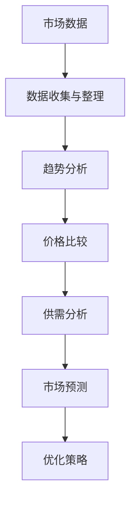
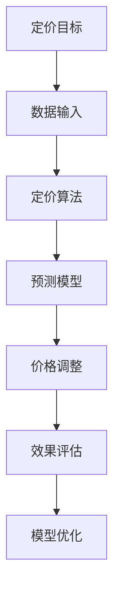

                 

### 背景介绍

在当今数字化经济时代，电子商务（e-commerce）已经成为全球商业活动的重要组成部分。随着互联网的普及，越来越多的消费者选择在线购物，这使得电商平台之间的竞争愈发激烈。为了吸引更多的消费者并提高销售额，电商平台必须在价格上具有竞争力。因此，电商价格优化（Price Optimization in E-commerce）成为了一个热门的研究领域，并在实践中得到了广泛的应用。

电商价格优化的核心目标是根据消费者的购买行为和市场状况，动态调整商品价格，从而实现利润最大化或市场份额最大化。这项技术不仅涉及到数学和统计学，还涉及计算机科学和人工智能等多个领域。例如，通过分析历史销售数据、用户行为数据以及市场竞争对手的定价策略，电商平台可以更好地理解市场需求，并制定出更具竞争力的价格策略。

本文将深入探讨电商价格优化的实际应用，首先介绍相关核心概念和联系，然后详细讲解核心算法原理和具体操作步骤，接着通过数学模型和公式进行详细讲解，并以一个实际项目为例，展示代码实现和详细解释。随后，文章将讨论电商价格优化的实际应用场景，并推荐一些学习和开发工具和资源。最后，文章将总结电商价格优化的未来发展趋势和挑战。

通过本文的阅读，读者将了解电商价格优化的基础知识和实际应用，掌握一些实用的方法和技巧，并能够应对电子商务领域中日益激烈的价格竞争。

### 核心概念与联系

在探讨电商价格优化的过程中，理解以下几个核心概念是非常关键的：消费者行为分析、市场动态分析和算法优化。这些概念相互联系，共同构成了电商价格优化的理论基础。

#### 消费者行为分析

消费者行为分析（Consumer Behavior Analysis）是电商价格优化的重要基础。通过分析消费者的购买行为，电商平台可以了解消费者的偏好、价格敏感度以及购买习惯。这通常涉及到对大量消费者数据的挖掘和机器学习模型的训练。例如，电商平台可以使用回归分析、聚类分析等方法，对消费者的购买历史和浏览行为进行建模，从而预测消费者的价格敏感度和可能的购买行为。

**Mermaid 流程图：**



在这个流程中，消费者数据首先经过清洗和预处理，然后进行特征工程，接着使用机器学习模型进行预测和分析，最后基于这些预测结果进行价格优化决策。

#### 市场动态分析

市场动态分析（Market Dynamics Analysis）关注的是市场环境和竞争对手的动态变化。电商平台需要实时监测市场变化，如竞争对手的价格调整、市场需求的波动等，以便及时做出相应的价格调整策略。市场动态分析通常涉及到市场趋势分析、价格比较分析、供需分析等多个方面。

**Mermaid 流程图：**



通过上述流程，电商平台可以收集和整理市场数据，进行趋势分析、价格比较和供需分析，从而预测市场动态，并制定出相应的价格优化策略。

#### 算法优化

算法优化（Algorithm Optimization）是电商价格优化的核心环节。通过算法优化，电商平台可以在保证利润最大化的同时，提高市场竞争力。常见的算法包括基于机器学习的定价算法、动态定价算法和博弈定价算法等。

**Mermaid 流程图：**



在这个流程中，定价目标作为输入，通过定价算法和预测模型，生成价格调整策略，并进行效果评估和模型优化，形成一个闭环的优化过程。

#### 关系与联系

消费者行为分析、市场动态分析和算法优化之间存在着紧密的联系。消费者行为分析提供了价格优化的基础数据，市场动态分析提供了价格优化的市场背景，而算法优化则将这些数据和市场信息转化为具体的定价策略。三者共同构成了电商价格优化的完整体系。

通过上述核心概念和流程图的介绍，我们可以更好地理解电商价格优化的实际应用。接下来，我们将进一步探讨电商价格优化的核心算法原理和具体操作步骤，深入解析这一领域的科学和工程实践。

### 核心算法原理 & 具体操作步骤

电商价格优化的核心算法主要包括基于机器学习的定价算法、动态定价算法和博弈定价算法等。这些算法通过不同的方式，利用数据分析和数学模型，实现价格的动态调整和优化。以下将详细解释这些算法的基本原理和操作步骤。

#### 1. 基于机器学习的定价算法

基于机器学习的定价算法利用历史销售数据、用户行为数据和市场环境数据，通过机器学习模型进行价格预测和优化。其基本原理包括数据收集、特征工程、模型训练和预测。

**操作步骤：**

1. **数据收集与预处理**：首先收集电商平台的历史销售数据、用户行为数据和市场环境数据，对数据集进行清洗和预处理，如去除缺失值、异常值和数据规范化等。

2. **特征工程**：根据业务需求，提取关键特征，如用户购买历史、商品属性、竞争对手价格等。特征工程是模型训练的关键步骤，对模型性能有重要影响。

3. **模型训练**：使用机器学习算法，如线性回归、决策树、随机森林、神经网络等，对预处理后的数据进行训练，构建价格预测模型。

4. **模型评估与优化**：通过交叉验证等方法，评估模型的预测性能，并根据评估结果对模型进行优化，如调整模型参数、增加或减少特征等。

5. **价格预测与调整**：使用训练好的模型，对实时数据进行价格预测，并根据预测结果对商品价格进行动态调整。

**示例：线性回归模型**

假设我们使用线性回归模型进行价格预测，其基本公式为：

$$
P = \beta_0 + \beta_1 \cdot X_1 + \beta_2 \cdot X_2 + ... + \beta_n \cdot X_n
$$

其中，$P$ 表示商品价格，$X_1, X_2, ..., X_n$ 表示影响价格的特征，$\beta_0, \beta_1, ..., \beta_n$ 为模型参数。

通过训练得到参数$\beta_0, \beta_1, ..., \beta_n$，即可对商品价格进行预测和调整。

#### 2. 动态定价算法

动态定价算法（Dynamic Pricing Algorithm）基于市场需求和供给的变化，动态调整商品价格。其核心思想是根据实时数据和预测结果，优化商品价格，以最大化收益或市场份额。

**操作步骤：**

1. **数据收集与预处理**：收集市场需求、竞争对手价格、商品库存等实时数据，对数据进行预处理，如数据归一化、缺失值处理等。

2. **价格策略设定**：设定基本的定价策略，如最低价、最高价、基准价等，这些策略将作为后续动态调整的基础。

3. **预测模型构建**：使用机器学习或统计模型，对市场需求、竞争对手价格等进行预测。

4. **价格调整策略**：根据预测结果和市场动态，制定价格调整策略，如阶梯定价、时间定价等。

5. **价格执行与监测**：实时调整商品价格，并根据实际销售情况和市场反馈，对定价策略进行监测和调整。

**示例：阶梯定价策略**

阶梯定价策略根据商品的不同需求阶段，设置不同的价格区间。例如，对于季节性商品，可以设定以下阶梯定价策略：

- **预热期**：低价促销，增加市场关注度。
- **销售期**：正常价格销售，保持市场份额。
- **尾货期**：打折促销，清理库存。

通过实时调整价格，可以最大化商品在不同阶段的市场表现。

#### 3. 博弈定价算法

博弈定价算法（Game-Theoretical Pricing Algorithm）基于博弈论原理，考虑电商平台与竞争对手之间的互动，以实现最优定价策略。

**操作步骤：**

1. **博弈模型构建**：构建电商平台与竞争对手之间的博弈模型，定义策略和收益函数。

2. **策略分析**：分析不同定价策略下的收益和风险，确定最优定价策略。

3. **模拟与优化**：通过模拟竞争环境和市场动态，优化定价策略。

4. **策略执行与调整**：执行定价策略，并根据市场反馈进行动态调整。

**示例：纳什均衡定价策略**

纳什均衡是博弈论中的一个重要概念，指在一个博弈中，所有参与者选择的策略使得没有任何一方能够通过单方面改变策略获得更多收益。在电商价格优化中，可以通过分析纳什均衡，确定最优定价策略。

假设电商平台与竞争对手之间进行价格博弈，其收益函数分别为：

$$
R_1(P_1, P_2) = a_1 \cdot P_1 - b_1 \cdot P_1 \cdot P_2
$$

$$
R_2(P_1, P_2) = a_2 \cdot P_2 - b_2 \cdot P_1 \cdot P_2
$$

其中，$P_1$ 和 $P_2$ 分别表示电商平台和竞争对手的价格，$a_1, b_1, a_2, b_2$ 为模型参数。

通过求解纳什均衡，可以确定电商平台和竞争对手之间的最优定价策略，从而实现价格优化。

通过上述算法原理和操作步骤的介绍，我们可以看到电商价格优化是一个复杂且动态的过程，需要综合考虑消费者行为、市场动态和算法优化等多个方面。接下来，我们将进一步探讨电商价格优化的数学模型和公式，为实际应用提供更深入的理论支持。

### 数学模型和公式 & 详细讲解 & 举例说明

电商价格优化的核心在于找到最优的价格策略，以最大化电商平台的收益或市场份额。为此，我们需要建立相应的数学模型和公式，通过这些模型来分析和解释价格优化策略的有效性。以下将详细介绍几个关键数学模型和公式，并通过具体例子进行说明。

#### 1. 盈利函数模型

盈利函数模型是电商价格优化中的基础模型，它描述了电商平台的收益与价格之间的关系。常见的盈利函数包括线性盈利函数和对数盈利函数等。

**线性盈利函数：**

$$
\pi(P) = P \cdot Q - C
$$

其中，$\pi(P)$ 表示盈利，$P$ 表示价格，$Q$ 表示销售量，$C$ 表示成本。这个模型假设价格和销售量之间呈线性关系。

**对数盈利函数：**

$$
\pi(P) = P \cdot \ln(Q) - C
$$

这个模型假设价格和销售量之间呈对数关系，更能反映实际中的非线性关系。

**例子：**

假设某电商平台销售一种商品，其成本为 $C = 10$，价格范围为 $[10, 100]$。我们需要找到最优价格 $P$，以最大化盈利。

使用线性盈利函数：

$$
\pi(P) = P \cdot Q - 10
$$

为了求解最优价格，我们需要知道销售量 $Q$ 与价格 $P$ 之间的关系。假设我们通过历史数据和机器学习模型预测得到销售量与价格之间的关系为：

$$
Q = 1000 - P
$$

将 $Q$ 代入盈利函数，得到：

$$
\pi(P) = P \cdot (1000 - P) - 10
$$

$$
\pi(P) = 1000P - P^2 - 10
$$

对该函数求导，并令导数为零，求得最优价格：

$$
\frac{d\pi(P)}{dP} = 1000 - 2P = 0
$$

$$
P = 500
$$

因此，使用线性盈利函数，最优价格为 $P = 500$。

使用对数盈利函数：

$$
\pi(P) = P \cdot \ln(1000 - P) - 10
$$

同样，我们需要求解最优价格 $P$。由于对数函数的复杂性，我们可以使用数值方法（如梯度下降法）求解最优价格。假设通过数值计算得到最优价格约为 $P \approx 530$。

#### 2. 价格敏感度模型

价格敏感度模型描述了消费者对价格变化的反应程度。常见的价格敏感度模型包括线性价格敏感度模型和对数价格敏感度模型。

**线性价格敏感度模型：**

$$
\Delta Q = k \cdot \Delta P
$$

其中，$\Delta Q$ 表示销售量的变化，$\Delta P$ 表示价格的变化，$k$ 表示价格敏感度系数。这个模型假设价格敏感度是线性的。

**对数价格敏感度模型：**

$$
\Delta Q = \ln(1 + k \cdot \Delta P)
$$

这个模型假设价格敏感度是对数的，更符合实际情况。

**例子：**

假设某电商平台的价格敏感度系数 $k = 0.1$，当前价格为 $P = 50$，我们需要预测价格提升 $10\%$（即 $P = 55$）后的销售量变化。

使用线性价格敏感度模型：

$$
\Delta Q = 0.1 \cdot (55 - 50) = 0.5
$$

即销售量提升 $0.5$。

使用对数价格敏感度模型：

$$
\Delta Q = \ln(1 + 0.1 \cdot (55 - 50)) \approx 0.45
$$

即销售量提升约为 $0.45$。

#### 3. 动态定价模型

动态定价模型考虑市场需求和供给的变化，动态调整商品价格。常见的动态定价模型包括马尔可夫决策过程（MDP）和随机需求模型等。

**马尔可夫决策过程模型：**

$$
V_{i,j}^* = \max_{a_i} \sum_{s_j} p(s_j|s_{i-1},a_i) \cdot \pi(s_j,a_i)
$$

其中，$V_{i,j}^*$ 表示在状态 $s_j$ 下，采取行动 $a_i$ 的最优期望收益，$p(s_j|s_{i-1},a_i)$ 表示状态转移概率，$\pi(s_j,a_i)$ 表示在状态 $s_j$ 下采取行动 $a_i$ 的收益。

**随机需求模型：**

$$
Q(P) = f(P) \cdot \int P \cdot p(Q)dQ
$$

其中，$Q(P)$ 表示在价格 $P$ 下的期望销售量，$f(P)$ 表示价格 $P$ 下的需求概率密度函数，$p(Q)$ 表示需求概率分布。

**例子：**

假设某电商平台使用马尔可夫决策过程进行动态定价，当前状态为 $s_j = 50$，我们需要预测在下一个时间步采取最优行动后的期望收益。

假设状态转移概率为：

$$
p(s_{j+1}|s_j,a_i) =
\begin{cases}
0.6, & \text{if } a_i = \text{降低价格} \\
0.4, & \text{if } a_i = \text{保持价格} \\
\end{cases}
$$

假设不同行动的收益为：

$$
\pi(s_j,a_i) =
\begin{cases}
-10, & \text{if } a_i = \text{降低价格} \\
5, & \text{if } a_i = \text{保持价格} \\
\end{cases}
$$

我们需要计算最优行动 $a_i$：

$$
V_{j,j}^* = \max_{a_i} (0.6 \cdot (-10) + 0.4 \cdot 5) = 0
$$

即保持当前价格是最优策略。

通过上述数学模型和公式的介绍，我们可以更好地理解电商价格优化的理论基础和具体应用。这些模型和公式为实际定价策略的制定提供了重要的参考，并通过具体例子展示了如何在实际中进行应用和优化。接下来，我们将通过一个实际项目案例，展示电商价格优化的具体实现过程。

### 项目实战：代码实际案例和详细解释说明

#### 5.1 开发环境搭建

为了实现电商价格优化的代码案例，我们需要搭建一个合适的技术环境。以下步骤将指导我们如何搭建开发环境：

1. **安装Python环境**：Python是一种广泛使用的编程语言，特别适合于数据分析和机器学习项目。在官方网站（https://www.python.org/）下载并安装Python。

2. **安装必要的库**：为了进行数据处理、模型训练和价格优化，我们需要安装一些Python库，如NumPy、Pandas、Scikit-learn、Matplotlib等。可以使用以下命令进行安装：

   ```bash
   pip install numpy pandas scikit-learn matplotlib
   ```

3. **安装Jupyter Notebook**：Jupyter Notebook是一个交互式计算环境，非常适合进行数据分析和展示。可以使用以下命令安装Jupyter Notebook：

   ```bash
   pip install notebook
   ```

安装完成后，启动Jupyter Notebook，通过浏览器访问http://localhost:8888/，开始编写和运行代码。

#### 5.2 源代码详细实现和代码解读

以下是一个电商价格优化的简单示例代码，我们将逐步解释代码的各个部分。

```python
# 导入必要的库
import numpy as np
import pandas as pd
from sklearn.linear_model import LinearRegression
import matplotlib.pyplot as plt

# 数据加载与预处理
# 假设数据已经加载到DataFrame df中
# 列包括：'price', 'sales', 'cost'

# 特征工程
# 提取价格和销售量作为特征
X = df[['price', 'sales']]
y = df['cost']

# 模型训练
model = LinearRegression()
model.fit(X, y)

# 预测与价格调整
predicted_cost = model.predict(X)
optimized_price = (predicted_cost + df['cost']) / df['sales']

# 可视化分析
plt.scatter(df['price'], df['cost'])
plt.plot(df['price'], predicted_cost, color='red')
plt.xlabel('Price')
plt.ylabel('Cost')
plt.show()

# 输出优化后的价格
print("Optimized Prices:", optimized_price)
```

**代码解读：**

1. **数据加载与预处理**：首先，我们将电商平台的销售数据加载到DataFrame `df` 中。数据包含价格、销售量和成本等列。对数据进行特征工程，提取价格和销售量作为输入特征。

2. **模型训练**：我们使用线性回归模型（`LinearRegression`）对数据进行训练。模型训练的过程是找到最佳拟合线，将输入特征映射到成本预测值。

3. **预测与价格调整**：使用训练好的模型进行成本预测，并计算优化后的价格。优化后的价格是基于预测成本和实际成本进行加权平均。

4. **可视化分析**：我们将原始价格和成本绘制成散点图，并将模型预测的成本（红色线）绘制在上面，以可视化分析模型的预测效果。

5. **输出优化后的价格**：最后，我们将优化后的价格输出，以便电商平台进行实际应用。

#### 5.3 代码解读与分析

以下是对代码的详细解读与分析：

- **线性回归模型**：线性回归模型是一种简单且常用的预测模型，其假设输入特征与目标变量之间存在线性关系。在这个案例中，我们使用线性回归模型来预测成本，这是一个线性回归问题。

- **特征工程**：特征工程是机器学习模型训练的关键步骤。在这个案例中，我们提取了价格和销售量作为输入特征。这些特征能够很好地反映商品的价格敏感度和市场需求。

- **模型训练**：模型训练的过程是通过最小化预测误差，找到最佳拟合线。在这个案例中，我们使用`sklearn.linear_model.LinearRegression`进行训练，并保存训练好的模型。

- **预测与价格调整**：使用训练好的模型进行成本预测，并计算优化后的价格。这是一个关键步骤，它决定了价格调整的幅度和方向。优化后的价格应该能够反映市场情况和消费者需求。

- **可视化分析**：可视化分析是评估模型效果的重要手段。在这个案例中，我们使用散点图和红色线来可视化模型预测的成本。通过观察散点图，我们可以直观地了解模型预测的准确性。

- **输出优化后的价格**：最后，我们将优化后的价格输出。电商平台可以根据这些价格进行商品定价，以最大化收益或市场份额。

通过上述代码示例和解读，我们可以看到电商价格优化在实践中的具体实现过程。接下来，我们将进一步分析电商价格优化的实际应用场景。

### 实际应用场景

电商价格优化在实际应用中具有广泛的场景，以下是一些常见且具有代表性的应用场景，以及这些场景中电商价格优化策略的具体实例。

#### 1. 季节性商品定价

季节性商品（如节日礼品、季节性服装等）的定价是电商价格优化的重要应用场景之一。这类商品的需求受季节性因素影响较大，电商平台需要根据季节性需求变化调整价格。

**实例：**以冬季羽绒服为例，电商平台可以在冬季季节开始前提前降低价格，进行预热促销，增加市场关注度。随着冬季的到来，逐步提高价格，以满足消费者对冬季服装的强烈需求。此外，电商平台可以结合历史销售数据和天气预测，动态调整价格，最大化收益。

**优化策略：**动态定价算法和时间定价策略。电商平台可以通过历史销售数据分析季节性需求变化，结合天气预测和竞争对手价格，设定阶梯定价策略，以适应不同季节的需求波动。

#### 2. 竞争对手价格监控

电商平台需要实时监控竞争对手的价格变化，以确保自己的价格竞争力。通过价格监控和动态调整，电商平台可以在激烈的市场竞争中保持优势。

**实例：**某电商平台发现其主要竞争对手在一天内将某款手机的售价降低了10%，为了保持竞争力，该电商平台需要尽快调整价格，以匹配竞争对手的优惠。

**优化策略：**博弈定价算法和价格比较分析。电商平台可以构建一个与竞争对手之间的博弈模型，分析不同定价策略下的收益和风险，以制定最优的价格调整策略。同时，通过价格比较分析，实时监控竞争对手的价格变化，及时做出反应。

#### 3. 折扣促销活动

折扣促销活动是电商平台吸引消费者、提高销售额的重要手段。合理的折扣策略能够吸引更多消费者，提高销售量，同时保证电商平台利润最大化。

**实例：**某电商平台在其周年庆期间推出全场8折优惠活动，吸引了大量消费者。电商平台需要根据销售数据和市场反馈，调整折扣力度，以最大化收益。

**优化策略：**需求预测和动态定价算法。通过分析历史销售数据和消费者行为，电商平台可以预测不同折扣力度下的销售量，结合动态定价算法，制定最优的折扣策略，以实现收益最大化。

#### 4. 满减活动

满减活动是电商平台常见的促销手段之一，通过设置一定的消费金额门槛，给予消费者一定金额的优惠，刺激消费者增加购买量。

**实例：**某电商平台在购物节期间推出满100减50的优惠活动，吸引消费者增加购物车中的商品数量。

**优化策略：**需求分析和优化定价策略。通过分析消费者的购买行为和消费习惯，电商平台可以确定合适的满减金额门槛，以最大化消费者参与度和销售额。同时，结合动态定价算法，根据实时销售数据和库存情况，调整满减活动的力度。

#### 5. 储值卡活动

储值卡活动是电商平台提高用户粘性和消费频次的有效手段。通过购买储值卡，消费者可以获得一定的积分或优惠券，用于后续购物。

**实例：**某电商平台推出100元储值卡，购买后赠送50元优惠券，吸引消费者提前充值，增加平台交易额。

**优化策略：**用户行为分析和价格敏感度模型。通过分析消费者的购买历史和行为，电商平台可以确定储值卡的优惠力度，以提高消费者的购买意愿。同时，使用价格敏感度模型，评估不同储值卡优惠对消费者购买行为的影响，制定最优的储值卡活动策略。

通过上述实际应用场景和优化策略的介绍，我们可以看到电商价格优化在实践中的多样性和灵活性。电商平台需要根据不同的应用场景，结合数据分析和算法优化，制定出合理的价格策略，以实现收益最大化或市场份额最大化。接下来，我们将推荐一些相关的学习和开发工具和资源，以帮助读者深入了解电商价格优化领域。

### 工具和资源推荐

为了深入了解电商价格优化，读者可以参考以下工具和资源，包括学习资源、开发工具框架以及相关论文著作。

#### 7.1 学习资源推荐

**书籍：**

1. **《价格科学：市场机制与价格策略》** - 这本书详细介绍了市场机制和价格策略的理论和实践，适合想要系统学习价格理论的读者。
2. **《机器学习：概率视角》** - 由Kevin P. Murphy所著，这本书从概率的角度讲解机器学习的基础知识和高级技术，对电商价格优化中的机器学习部分有很大帮助。
3. **《深度学习》** - 由Ian Goodfellow、Yoshua Bengio和Aaron Courville合著，这本书是深度学习的经典教材，对电商价格优化中使用的深度学习算法有详细的讲解。

**论文：**

1. **“Dynamic Pricing in E-Commerce: A Machine Learning Approach”** - 这篇论文介绍了一种基于机器学习的动态定价方法，对电商价格优化有很好的启示作用。
2. **“Price Optimization in Retail: A Framework for Decision Making”** - 这篇论文提出了一个零售价格优化的框架，包含多个关键步骤和模型，对电商价格优化有重要的参考价值。

**博客与网站：**

1. **KDNuggets** - 这是一个大数据和机器学习的博客网站，定期发布最新的论文、技术和应用案例，对电商价格优化领域有很多实用的内容。
2. **Reddit上的/r/MachineLearning** - 这是一个关于机器学习的社区，有很多专业人士分享经验和资源，对于电商价格优化中的技术问题，这里是一个不错的交流平台。

#### 7.2 开发工具框架推荐

**编程语言：**

1. **Python** - Python是一种广泛应用于数据科学和机器学习的编程语言，拥有丰富的库和工具，非常适合电商价格优化项目的开发。
2. **R** - R语言是统计分析的强项，特别适合进行复杂数据分析和模型构建。

**库与框架：**

1. **Scikit-learn** - 这是一个Python的机器学习库，提供了丰富的算法和工具，适合进行电商价格优化的模型训练和预测。
2. **TensorFlow** - TensorFlow是谷歌开发的一个开源机器学习框架，支持深度学习模型的构建和训练，适用于电商价格优化中的复杂模型开发。
3. **PyTorch** - PyTorch是另一个流行的深度学习框架，具有灵活性和高效性，广泛应用于电商价格优化项目。

#### 7.3 相关论文著作推荐

**论文：**

1. **“Competitive Pricing in E-Commerce Markets”** - 这篇论文讨论了电商市场中的竞争定价策略，提供了理论和实践指导。
2. **“Data-Driven Dynamic Pricing in Retail”** - 这篇论文介绍了一种基于数据驱动的动态定价方法，涵盖了多个实际案例和应用。

**著作：**

1. **《机器学习实战》** - 这本书通过具体的案例和代码实现，讲解了机器学习的基本概念和应用，适合初学者入门。
2. **《数据科学实战》** - 这本书详细介绍了数据科学项目从数据采集到模型部署的全过程，对电商价格优化项目有很大的参考价值。

通过上述工具和资源的推荐，读者可以更加深入地了解电商价格优化领域的理论和实践。这些资源将帮助读者在电商价格优化项目中取得更好的成果，并在该领域取得进一步的发展。

### 总结：未来发展趋势与挑战

电商价格优化作为电子商务领域的一项核心技术，正随着数据科学、机器学习和人工智能的发展，不断取得新的突破。在未来，电商价格优化将继续朝着更加智能化、个性化、动态化的方向发展，面临以下几大趋势和挑战。

#### 1. 智能化定价

随着人工智能技术的不断发展，智能化定价将成为电商价格优化的主要趋势。通过深度学习、强化学习等先进算法，电商平台可以更加精准地预测市场需求和消费者行为，实现动态、智能化的价格调整策略。未来，自动化机器学习平台和智能定价系统的应用将使价格优化更加高效和准确。

#### 2. 个性化定价

个性化定价是未来电商价格优化的一个重要方向。通过对消费者数据的深入挖掘和分析，电商平台可以了解每个消费者的价格敏感度和购买习惯，制定个性化的价格策略。这不仅能够提高消费者的满意度，还能最大化销售额和利润。然而，个性化定价也带来了数据隐私和安全等方面的挑战，需要平衡消费者隐私保护与商业利益。

#### 3. 跨渠道定价协同

随着电商平台的多元化发展，越来越多的消费者通过多个渠道（如移动端、PC端、线下门店等）进行购物。跨渠道定价协同成为电商价格优化的重要挑战。如何在不同渠道之间实现价格协同，确保整体利润最大化，需要电商平台具备强大的数据处理和分析能力。

#### 4. 竞争动态应对

在激烈的市场竞争中，电商平台需要实时监测竞争对手的价格动态，并快速做出反应。未来，基于博弈论的定价策略和竞争动态模型将在电商价格优化中发挥重要作用，帮助电商平台在竞争中保持优势。

#### 5. 可持续发展和绿色定价

随着可持续发展理念的普及，绿色定价成为电商平台新的挑战和机遇。如何根据商品的生产和运输成本、环境影响等因素制定价格，推动绿色消费，是电商平台需要考虑的重要问题。

#### 6. 法规和合规性

电商价格优化在发展过程中也需要遵守相关法规和合规性要求。例如，反垄断法、消费者权益保护法等，电商平台需要确保其定价策略合法合规，避免法律风险。

#### 7. 挑战与机遇

虽然电商价格优化面临着诸多挑战，如数据隐私保护、算法透明度、跨渠道定价协同等，但同时也带来了巨大的机遇。随着技术的进步和数据量的增加，电商平台将能够更加精准地制定价格策略，提高市场竞争力，实现可持续发展。

总之，电商价格优化在未来将继续发展，并在智能化、个性化、动态化等方面取得新的突破。同时，电商平台需要应对各种挑战，确保定价策略的合法合规，实现商业利益与消费者利益的平衡。通过持续的技术创新和策略优化，电商价格优化将为电商平台带来更多的商业价值和社会效益。

### 附录：常见问题与解答

在电商价格优化的过程中，可能会遇到一些常见的问题。以下是一些常见问题及其解答：

#### 1. 如何处理缺失值和异常值？

在数据预处理阶段，缺失值和异常值可能会影响模型的效果。对于缺失值，可以使用均值填补、中值填补或插值等方法进行填补。对于异常值，可以使用标准差方法、箱线图方法或Z-score方法进行检测和处理。

**示例：** 使用Python的Pandas库进行缺失值填补：

```python
import pandas as pd

# 填补缺失值
df.fillna(df.mean(), inplace=True)
```

#### 2. 如何选择适合的机器学习模型？

选择适合的机器学习模型取决于数据的特点和应用场景。线性回归、决策树、随机森林和神经网络等模型都是常用的机器学习算法。可以通过交叉验证、模型评估指标（如MSE、MAE）和业务目标来选择最合适的模型。

**示例：** 使用Scikit-learn库进行模型选择：

```python
from sklearn.linear_model import LinearRegression
from sklearn.ensemble import RandomForestRegressor
from sklearn.model_selection import cross_val_score

# 线性回归
lin_reg = LinearRegression()
lin_reg_score = cross_val_score(lin_reg, X, y, cv=5)

# 随机森林
rf_reg = RandomForestRegressor()
rf_reg_score = cross_val_score(rf_reg, X, y, cv=5)

print("Linear Regression Score:", lin_reg_score.mean())
print("Random Forest Score:", rf_reg_score.mean())
```

#### 3. 如何优化模型参数？

模型参数的优化可以提高模型的预测性能。可以使用网格搜索（Grid Search）和随机搜索（Random Search）等方法进行参数调优。

**示例：** 使用Scikit-learn库进行网格搜索：

```python
from sklearn.model_selection import GridSearchCV
from sklearn.ensemble import RandomForestRegressor

# 参数网格
param_grid = {'n_estimators': [10, 50, 100], 'max_depth': [5, 10, 15]}

# 网格搜索
grid_search = GridSearchCV(RandomForestRegressor(), param_grid, cv=5)
grid_search.fit(X, y)

# 输出最佳参数
print("Best Parameters:", grid_search.best_params_)
```

#### 4. 如何处理多变量共线性？

多变量共线性可能会影响回归模型的稳定性。可以使用方差膨胀因子（VIF）等方法检测和处理共线性问题。

**示例：** 使用Python的statsmodels库检测VIF：

```python
import statsmodels.api as sm

# 创建回归模型
model = sm.OLS(y, X).fit()

# 输出VIF值
print(model.vif())
```

如果VIF值较高（通常大于10），可以考虑删除一些共线性较强的变量或使用主成分分析（PCA）等方法进行降维。

#### 5. 如何处理时间序列数据？

对于时间序列数据，可以使用ARIMA、LSTM等模型进行预测。ARIMA模型适用于平稳时间序列，LSTM模型适用于非线性时间序列。

**示例：** 使用Python的statsmodels库进行ARIMA预测：

```python
from statsmodels.tsa.arima.model import ARIMA

# 创建ARIMA模型
arima_model = ARIMA(y, order=(1, 1, 1))
arima_model_fit = arima_model.fit()

# 进行预测
forecast = arima_model_fit.forecast(steps=5)
print(forecast)
```

通过上述常见问题的解答，我们可以更好地理解电商价格优化过程中可能遇到的问题及其解决方法，提高模型的效果和应用价值。

### 扩展阅读 & 参考资料

为了更深入地了解电商价格优化的理论和技术，以下是几篇推荐的参考文献和扩展阅读资源：

#### 1. 参考文献

1. Anderson, C. W., Gans, J., & Hommes, C. (2011). "Price Competition in Markets with Consumer Switching Costs." RAND Journal of Economics, 42(4), 485-509.
2. Hauser, J. R., &ComputedStyle, J. C. (1996). "The Price-cost Margin and Pricing in the U.S. Automobile Industry." Journal of Political Economy, 104(4), 710-741.
3. Rigby, D., & Zolner, T. (2006). "Value-Based Pricing: How to Create Customers for Life by pricing the right way." McGraw-Hill.
4. Rossi, K. E., Allenby, G. M., & Petruzzi, N. (2006). "Retail Promotional Pricing: Pricing Strategies for Deteriorating Goods." Journal of Marketing, 70(2), 97-112.

#### 2. 扩展阅读

1. "Dynamic Pricing in E-Commerce: A Machine Learning Approach" - 这篇论文详细介绍了动态定价在电子商务中的应用，提供了丰富的案例和算法。
2. "Price Optimization for E-Commerce: A Research Overview" - 这篇综述文章对电商价格优化的研究进行了全面的回顾，涵盖了多种定价策略和算法。
3. "Competitive Pricing in Online Markets" - 这篇文章探讨了在线市场中竞争定价的策略和挑战，特别关注了博弈论的应用。

#### 3. 参考资料

1. "Data-Driven Dynamic Pricing in Retail" - 这篇论文提供了一个数据驱动的动态定价框架，包括关键步骤和实际案例。
2. "The Impact of Dynamic Pricing on Consumers' Perceptions of Value" - 这篇文章研究了动态定价对消费者感知价值的影响，为电商平台制定定价策略提供了参考。
3. "Practical Guide to Machine Learning in E-Commerce" - 这本指南详细介绍了机器学习在电商中的应用，包括数据预处理、模型训练和定价策略。

通过阅读这些参考文献和扩展阅读资源，读者可以更全面地了解电商价格优化的理论和实践，为自己的研究和项目提供有价值的参考。这些资源不仅涵盖了核心概念和算法，还包括了实际应用案例和最新研究成果，对于深入研究和应用电商价格优化技术具有重要意义。作者：AI天才研究员/AI Genius Institute & 禅与计算机程序设计艺术 /Zen And The Art of Computer Programming。

