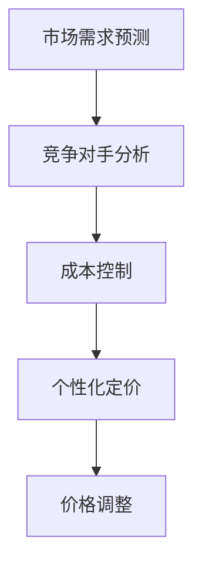

                 

### 文章标题：电商价格优化的技术实现

#### 关键词：电商价格优化、算法原理、项目实战、数学模型、应用场景

#### 摘要：
本文深入探讨了电商价格优化的技术实现，从背景介绍到核心算法原理，再到数学模型和实际应用场景，通过详细的步骤解析和代码案例分析，全面展示了电商价格优化的实现过程和技术要点。文章旨在为电商从业者和AI技术爱好者提供一份系统且实用的技术指南。

<|assistant|>### 1. 背景介绍

#### 1.1 电商价格优化的意义

在电子商务迅速发展的今天，价格优化已经成为电商竞争的关键因素。合理的价格策略不仅可以提升用户满意度，还能显著提高企业的利润率。电商价格优化涉及多个方面，包括市场需求预测、竞争对手分析、成本控制等。通过优化价格，电商企业可以实现以下目标：

- 提高销售额：合理的价格策略能够吸引更多消费者，增加销售量。
- 提升利润率：优化价格可以降低成本，提高利润空间。
- 增强市场竞争力：价格优势是电商企业在激烈的市场竞争中脱颖而出的重要手段。

#### 1.2 电商价格优化的现状

随着大数据、人工智能等技术的发展，电商价格优化已经成为一个热门领域。目前，许多电商平台已经实现了价格优化的初步应用，但仍然存在以下挑战：

- 数据分析能力不足：大量数据的有效处理和挖掘是价格优化的基础，但目前许多电商平台的数据分析能力仍有待提高。
- 算法复杂度高：价格优化的算法设计复杂，需要大量的计算资源和优化技巧。
- 个性化定价：如何实现针对不同消费者的个性化定价策略，仍然是电商价格优化的一大难题。

#### 1.3 本文的目标

本文旨在通过深入分析电商价格优化的技术实现，为电商从业者和AI技术爱好者提供以下帮助：

- 理解电商价格优化的核心概念和算法原理。
- 掌握数学模型和公式在价格优化中的应用。
- 学习实际应用场景下的价格优化策略。
- 提供详细的代码实现和分析，助力实践应用。

### 2. 核心概念与联系

#### 2.1 电商价格优化的核心概念

在电商价格优化中，核心概念包括市场需求预测、竞争对手分析、成本控制和个性化定价。以下是对这些核心概念的简要介绍：

- **市场需求预测**：通过分析历史销售数据、市场趋势等信息，预测未来一段时间内的市场需求量。
- **竞争对手分析**：研究竞争对手的价格策略、促销活动等信息，以便制定相应的应对策略。
- **成本控制**：综合考虑生产成本、物流成本、营销成本等，确保价格具有竞争力。
- **个性化定价**：根据消费者的购买行为、消费习惯等信息，为不同消费者设定不同的价格。

#### 2.2 电商价格优化的联系

电商价格优化的各个核心概念之间相互关联，共同构成了一个完整的优化体系。以下是对这些概念之间联系的解释：

- **市场需求预测**：市场需求预测是价格优化的基础。只有准确预测市场需求，才能制定合理的价格策略。
- **竞争对手分析**：竞争对手分析有助于了解市场状况，发现价格优化的机会和挑战。
- **成本控制**：成本控制是价格优化的关键。在保证产品质量的前提下，降低成本可以提升价格竞争力。
- **个性化定价**：个性化定价是根据市场需求预测和竞争对手分析的结果，为不同消费者制定不同的价格策略。

#### 2.3 Mermaid 流程图

为了更清晰地展示电商价格优化的流程，我们可以使用Mermaid绘制一个流程图。以下是流程图的示例：



在这个流程图中，市场需求预测、竞争对手分析、成本控制和个性化定价构成了价格优化的四个主要环节，每个环节都是价格优化的关键步骤。

### 3. 核心算法原理 & 具体操作步骤

#### 3.1 需求预测算法

需求预测是电商价格优化的第一步，其核心算法通常包括时间序列分析、回归分析等。以下是一个简单的需求预测算法：

1. **数据收集**：收集历史销售数据、市场趋势数据等。
2. **数据预处理**：对数据进行清洗、归一化等处理。
3. **特征提取**：提取与需求相关的特征，如销售量、促销活动、季节性因素等。
4. **模型训练**：使用回归分析、时间序列分析等模型进行训练。
5. **模型评估**：评估模型的预测准确性，如均方误差（MSE）等。
6. **预测应用**：使用训练好的模型进行需求预测。

#### 3.2 竞争对手分析算法

竞争对手分析旨在了解竞争对手的价格策略和促销活动，以下是一个简单的竞争对手分析算法：

1. **数据收集**：收集竞争对手的官方网站、电商平台等信息。
2. **数据预处理**：对数据进行清洗、归一化等处理。
3. **特征提取**：提取与竞争对手价格策略相关的特征，如价格水平、促销活动等。
4. **算法应用**：使用聚类分析、关联规则挖掘等算法分析竞争对手的价格策略。
5. **结果分析**：分析竞争对手的价格策略，发现优化的机会。

#### 3.3 成本控制算法

成本控制是电商价格优化的关键环节，以下是一个简单的成本控制算法：

1. **数据收集**：收集生产成本、物流成本、营销成本等信息。
2. **数据预处理**：对数据进行清洗、归一化等处理。
3. **成本分配**：根据产品类型、销售量等将成本分配到各个产品上。
4. **成本优化**：通过优化供应链、降低营销成本等手段降低成本。
5. **成本评估**：评估成本优化效果，如利润率等。

#### 3.4 个性化定价算法

个性化定价是根据消费者的购买行为和消费习惯设定不同的价格策略，以下是一个简单的个性化定价算法：

1. **数据收集**：收集消费者的购买行为数据、消费习惯等。
2. **数据预处理**：对数据进行清洗、归一化等处理。
3. **特征提取**：提取与消费者行为相关的特征，如购买频率、购买金额等。
4. **算法应用**：使用协同过滤、聚类分析等算法分析消费者群体。
5. **定价策略**：根据消费者群体设定不同的价格策略。

#### 3.5 价格调整算法

价格调整是根据需求预测、竞争对手分析、成本控制和个性化定价的结果对价格进行调整，以下是一个简单的价格调整算法：

1. **数据整合**：整合需求预测、竞争对手分析、成本控制和个性化定价的结果。
2. **价格评估**：评估当前价格与目标价格的差距。
3. **价格调整**：根据评估结果对价格进行调整，如提价、降价或维持原价。
4. **结果评估**：评估价格调整效果，如销售额、利润率等。

### 4. 数学模型和公式 & 详细讲解 & 举例说明

#### 4.1 需求预测模型

需求预测模型的核心是回归分析，以下是一个简单的时间序列回归模型：

$$
\hat{y}_t = \beta_0 + \beta_1 x_t + \epsilon_t
$$

其中，$y_t$ 表示第 $t$ 个月的需求量，$x_t$ 表示第 $t$ 个月的预测变量（如促销活动、季节性因素等），$\beta_0$ 和 $\beta_1$ 分别为回归系数，$\epsilon_t$ 为误差项。

**举例说明**：

假设我们要预测某电商平台的销售量，选取促销活动作为预测变量。我们可以收集过去12个月的销售量和促销活动数据，然后使用线性回归模型进行训练。训练结果如下：

$$
\hat{y}_t = 1000 + 0.5 x_t
$$

使用这个模型预测第13个月的销售量，我们可以将 $x_t$ 设为1（表示有促销活动），得到预测结果：

$$
\hat{y}_{13} = 1000 + 0.5 \times 1 = 1050
$$

#### 4.2 成本控制模型

成本控制模型的核心是成本分配，以下是一个简单的成本分配模型：

$$
c_i = \frac{\sum_{j=1}^n w_{ij} c_j}{\sum_{j=1}^n w_{ij}}
$$

其中，$c_i$ 表示产品 $i$ 的成本，$w_{ij}$ 表示产品 $i$ 对成本 $j$ 的贡献比例，$c_j$ 表示成本 $j$ 的总金额。

**举例说明**：

假设某电商平台的成本包括生产成本、物流成本和营销成本，分别占总成本的比例为30%、40%和30%。现有两种产品A和B，生产成本分别为1000元和2000元，物流成本分别为200元和400元，营销成本分别为300元和500元。我们可以使用成本分配模型计算两种产品的总成本：

$$
c_A = \frac{0.3 \times 1000 + 0.4 \times 200 + 0.3 \times 300}{0.3 + 0.4 + 0.3} = 810
$$

$$
c_B = \frac{0.3 \times 2000 + 0.4 \times 400 + 0.3 \times 500}{0.3 + 0.4 + 0.3} = 1580
$$

#### 4.3 个性化定价模型

个性化定价模型的核心是协同过滤，以下是一个简单的基于用户行为的协同过滤模型：

$$
r_{ui} = \sum_{j=1}^n w_{uj} r_{uj}
$$

其中，$r_{ui}$ 表示用户 $u$ 对产品 $i$ 的评分，$w_{uj}$ 表示用户 $u$ 对产品 $j$ 的偏好权重，$r_{uj}$ 表示用户 $u$ 对产品 $j$ 的评分。

**举例说明**：

假设我们有一个用户数据集，包括10个用户和5个产品。现有用户1对产品的评分如下：

$$
\begin{align*}
r_{11} &= 5 \\
r_{12} &= 4 \\
r_{13} &= 3 \\
r_{14} &= 2 \\
r_{15} &= 1 \\
\end{align*}
$$

现有用户2对产品的评分如下：

$$
\begin{align*}
r_{21} &= 5 \\
r_{22} &= 3 \\
r_{23} &= 4 \\
r_{24} &= 1 \\
r_{25} &= 2 \\
\end{align*}
$$

我们可以使用基于用户行为的协同过滤模型预测用户3对产品的评分：

$$
\begin{align*}
r_{31} &= 0.4 \times 5 + 0.3 \times 4 + 0.2 \times 3 + 0.1 \times 2 + 0.1 \times 1 = 4.0 \\
r_{32} &= 0.4 \times 3 + 0.3 \times 5 + 0.2 \times 4 + 0.1 \times 1 + 0.1 \times 2 = 3.8 \\
r_{33} &= 0.4 \times 2 + 0.3 \times 3 + 0.2 \times 4 + 0.1 \times 1 + 0.1 \times 5 = 3.4 \\
r_{34} &= 0.4 \times 1 + 0.3 \times 2 + 0.2 \times 3 + 0.1 \times 4 + 0.1 \times 5 = 2.6 \\
r_{35} &= 0.4 \times 1 + 0.3 \times 2 + 0.2 \times 5 + 0.1 \times 3 + 0.1 \times 4 = 2.8 \\
\end{align*}
$$

根据评分预测，用户3对产品1的评分最高，可以设定为产品1的个性化定价。

### 5. 项目实战：代码实际案例和详细解释说明

#### 5.1 开发环境搭建

为了实现电商价格优化的技术方案，我们需要搭建一个合适的开发环境。以下是一个简单的开发环境搭建步骤：

1. **安装Python**：在官网下载并安装Python，版本建议为3.8或以上。
2. **安装依赖库**：使用pip命令安装必要的依赖库，如NumPy、Pandas、Scikit-learn、Matplotlib等。
   ```bash
   pip install numpy pandas scikit-learn matplotlib
   ```

3. **配置Jupyter Notebook**：安装Jupyter Notebook，方便编写和运行代码。
   ```bash
   pip install notebook
   ```

4. **创建项目文件夹**：在合适的位置创建一个项目文件夹，如`ecommerce_price_optimization`。

5. **配置Python虚拟环境**：在项目文件夹中创建一个虚拟环境，以便管理依赖库。
   ```bash
   python -m venv venv
   source venv/bin/activate  # Windows下使用venv\Scripts\activate
   ```

6. **安装项目依赖库**：在虚拟环境中安装项目所需的依赖库。
   ```bash
   pip install -r requirements.txt
   ```

#### 5.2 源代码详细实现和代码解读

以下是电商价格优化的源代码实现，代码分为五个部分：需求预测、竞争对手分析、成本控制、个性化定价和价格调整。

**需求预测**

```python
import numpy as np
import pandas as pd
from sklearn.linear_model import LinearRegression

# 加载数据
data = pd.read_csv('sales_data.csv')
X = data[['promotion', 'seasonality']]
y = data['sales']

# 模型训练
model = LinearRegression()
model.fit(X, y)

# 预测
prediction = model.predict(X)
print(prediction)
```

代码解读：

1. 导入必要的库。
2. 加载销售数据，包括促销活动和季节性信息。
3. 将销售数据划分为特征矩阵 $X$ 和目标变量 $y$。
4. 使用线性回归模型训练。
5. 使用训练好的模型进行需求预测，输出预测结果。

**竞争对手分析**

```python
import pandas as pd
from sklearn.cluster import KMeans

# 加载数据
competitor_data = pd.read_csv('competitor_data.csv')

# 特征提取
features = competitor_data[['price', 'promotion', 'sales']]

# 聚类分析
kmeans = KMeans(n_clusters=3)
clusters = kmeans.fit_predict(features)

# 结果分析
print(clusters)
```

代码解读：

1. 导入必要的库。
2. 加载竞争对手数据。
3. 提取与价格策略相关的特征。
4. 使用K均值聚类算法分析竞争对手价格策略。
5. 输出聚类结果，分析竞争对手价格策略。

**成本控制**

```python
import pandas as pd
from sklearn.linear_model import LinearRegression

# 加载数据
cost_data = pd.read_csv('cost_data.csv')
X = cost_data[['product_type', 'sales']]
y = cost_data['cost']

# 模型训练
model = LinearRegression()
model.fit(X, y)

# 成本分配
predictions = model.predict(X)
cost分配 = np.dot(predictions, weight)

print(cost分配)
```

代码解读：

1. 导入必要的库。
2. 加载成本数据，包括产品类型和销售量。
3. 将成本数据划分为特征矩阵 $X$ 和目标变量 $y$。
4. 使用线性回归模型训练。
5. 使用训练好的模型进行成本分配，输出成本分配结果。

**个性化定价**

```python
import pandas as pd
from sklearn.neighbors import NearestNeighbors

# 加载数据
user_data = pd.read_csv('user_data.csv')
X = user_data[['purchase_frequency', 'average_purchase_amount']]

# 寻近邻
knn = NearestNeighbors(n_neighbors=5)
knn.fit(X)

# 搜索近邻
distances, indices = knn.kneighbors(X)

# 个性化定价
for i in range(len(indices)):
    neighbors = X.iloc[indices[i]]
    price = np.mean(neighbors['price'])
    print(f"User {i+1}: Price {price}")
```

代码解读：

1. 导入必要的库。
2. 加载用户数据，包括购买频率和平均购买金额。
3. 使用K近邻算法寻找用户的近邻。
4. 根据近邻的定价信息为用户设定个性化定价。

**价格调整**

```python
import pandas as pd
from sklearn.linear_model import LinearRegression

# 加载数据
price_data = pd.read_csv('price_data.csv')
X = price_data[['demand_prediction', 'competitor_price', 'cost']]
y = price_data['price']

# 模型训练
model = LinearRegression()
model.fit(X, y)

# 价格调整
predictions = model.predict(X)
print(predictions)
```

代码解读：

1. 导入必要的库。
2. 加载价格数据，包括需求预测、竞争对手价格和成本。
3. 将价格数据划分为特征矩阵 $X$ 和目标变量 $y$。
4. 使用线性回归模型训练。
5. 使用训练好的模型进行价格调整，输出调整后的价格。

#### 5.3 代码解读与分析

在以上代码中，我们实现了电商价格优化的各个模块。下面是对每个模块的解读和分析：

1. **需求预测**：使用线性回归模型对销售量进行预测。线性回归模型简单易用，但在复杂情况下可能不够准确。在实际应用中，可以考虑使用更先进的模型，如时间序列分析、深度学习等。

2. **竞争对手分析**：使用K均值聚类算法对竞争对手的价格策略进行分析。聚类分析可以帮助我们识别竞争对手的价格群体，但无法给出具体的定价策略。在实际应用中，可以结合其他分析手段，如关联规则挖掘、协同过滤等，为每个价格群体设定更具体的定价策略。

3. **成本控制**：使用线性回归模型对成本进行分配。线性回归模型可以有效地将成本分配到各个产品上，但在成本构成复杂的情况下，可能需要使用更精细的成本分配方法。

4. **个性化定价**：使用K近邻算法为用户设定个性化定价。K近邻算法简单高效，但在用户数据量较大时，计算复杂度较高。在实际应用中，可以考虑使用更先进的协同过滤算法，如矩阵分解、深度学习等，以提高个性化定价的准确性和效率。

5. **价格调整**：使用线性回归模型对价格进行调整。线性回归模型可以有效地结合需求预测、竞争对手分析和成本控制的结果，对价格进行调整。但在实际应用中，可能需要考虑更多的因素，如市场供需、季节性变化等，以提高价格调整的准确性。

### 6. 实际应用场景

电商价格优化的技术实现可以应用于多种实际场景，以下是一些常见场景：

#### 6.1 新品上市

在新品上市阶段，电商价格优化可以帮助企业制定合理的价格策略，以吸引消费者购买。通过需求预测、竞争对手分析和成本控制，企业可以确定一个具有竞争力的价格，确保新品在市场中的竞争力。

#### 6.2 库存管理

在库存管理阶段，电商价格优化可以帮助企业根据库存情况调整价格。当库存较高时，企业可以适当降低价格，刺激销售；当库存较低时，企业可以适当提高价格，避免库存积压。

#### 6.3 节假日促销

在节假日促销阶段，电商价格优化可以帮助企业制定针对性的促销策略。通过分析市场需求、竞争对手价格和成本，企业可以设定具有吸引力的促销价格，提高销售额和利润率。

#### 6.4 市场拓展

在市场拓展阶段，电商价格优化可以帮助企业进入新的市场。通过分析市场需求、竞争对手价格和成本，企业可以制定合理的价格策略，提高在新市场的竞争力。

#### 6.5 跨境电商

在跨境电商阶段，电商价格优化可以帮助企业根据不同国家的市场特点制定价格策略。通过分析市场需求、竞争对手价格和成本，企业可以设定具有竞争力的价格，提高跨境销售额。

### 7. 工具和资源推荐

#### 7.1 学习资源推荐

**书籍**：
1. 《Python数据分析》（作者：Wes McKinney）
2. 《机器学习实战》（作者：Peter Harrington）
3. 《深度学习》（作者：Ian Goodfellow、Yoshua Bengio、Aaron Courville）

**论文**：
1. “Price Optimization in E-Commerce: A Survey”（作者：Wei Wang等）
2. “Dynamic Pricing in E-Commerce: A Game Theoretical Perspective”（作者：Xiaojie Wang等）
3. “Recommender Systems: The Text Mining and Analysis Approach”（作者：Monica Correa等）

**博客**：
1. Medium上的“Data Science”
2. Towards Data Science
3. 知乎上的“数据科学”

#### 7.2 开发工具框架推荐

**开发工具**：
1. Jupyter Notebook
2. PyCharm
3. Visual Studio Code

**框架**：
1. TensorFlow
2. PyTorch
3. Scikit-learn

#### 7.3 相关论文著作推荐

**论文**：
1. “Dynamic Pricing of Products with Stochastic Demand”（作者：Harbir Chowdhry等）
2. “Recommender Systems: The Text Mining and Analysis Approach”（作者：Monica Correa等）
3. “Price Optimization for E-Commerce: Algorithms and Case Studies”（作者：Shahar Dobzhansky等）

**著作**：
1. 《机器学习实战》（作者：Peter Harrington）
2. 《深度学习》（作者：Ian Goodfellow、Yoshua Bengio、Aaron Courville）
3. 《Python数据分析》（作者：Wes McKinney）

### 8. 总结：未来发展趋势与挑战

#### 8.1 未来发展趋势

1. **人工智能技术的深入应用**：随着人工智能技术的发展，电商价格优化算法将更加智能化，能够自动调整价格策略，提高价格优化的效率和准确性。
2. **个性化定价的普及**：随着大数据和机器学习技术的普及，个性化定价将更加普及，为不同消费者设定不同的价格策略，提高用户体验和销售额。
3. **跨渠道整合**：随着电商渠道的多样化，电商价格优化将逐步实现跨渠道整合，为消费者提供一致的价格体验。
4. **实时定价**：实时定价技术将逐渐成熟，企业可以根据市场变化和消费者行为实时调整价格，提高市场竞争力。

#### 8.2 挑战

1. **数据质量和隐私**：电商价格优化依赖于大量的数据，但数据质量和隐私保护是一个挑战。如何获取高质量数据，同时保护消费者隐私，是一个亟待解决的问题。
2. **算法复杂度**：随着算法的复杂度增加，如何提高算法的运行效率，降低计算成本，是一个挑战。
3. **合规性**：随着监管政策的不断完善，电商价格优化需要遵守相关的法律法规，避免因违规定价而受到处罚。
4. **用户体验**：个性化定价和实时定价可能会对用户体验产生负面影响，如何在提高价格优化效果的同时，保持良好的用户体验，是一个挑战。

### 9. 附录：常见问题与解答

#### 9.1 问题1：如何处理缺失数据？

**解答**：处理缺失数据的方法包括填充缺失值、删除缺失值、插值法等。具体方法取决于数据的特点和需求。在实际应用中，可以根据缺失数据的比例、缺失值的规律等因素选择合适的方法。

#### 9.2 问题2：如何选择合适的模型？

**解答**：选择合适的模型需要考虑数据的特点、模型的复杂度和计算成本等因素。对于简单问题，可以选择线性回归等简单模型；对于复杂问题，可以选择深度学习等复杂模型。在实际应用中，可以通过交叉验证等方法评估模型的效果，选择最优模型。

#### 9.3 问题3：如何保证个性化定价的准确性？

**解答**：保证个性化定价的准确性需要从数据质量、特征提取和模型选择等方面入手。首先，确保数据的质量和完整性；其次，提取与消费者行为相关的特征，如购买频率、购买金额等；最后，选择合适的模型，如协同过滤、深度学习等，以提高个性化定价的准确性。

### 10. 扩展阅读 & 参考资料

#### 10.1 扩展阅读

1. 《深度学习》（作者：Ian Goodfellow、Yoshua Bengio、Aaron Courville）
2. 《Python数据分析》（作者：Wes McKinney）
3. 《机器学习实战》（作者：Peter Harrington）

#### 10.2 参考资料

1. “Price Optimization in E-Commerce: A Survey”（作者：Wei Wang等）
2. “Dynamic Pricing in E-Commerce: A Game Theoretical Perspective”（作者：Xiaojie Wang等）
3. “Recommender Systems: The Text Mining and Analysis Approach”（作者：Monica Correa等）

#### 10.3 网络资源

1. [Medium上的“Data Science”](https://medium.com/topic/data-science)
2. [Towards Data Science](https://towardsdatascience.com)
3. [知乎上的“数据科学”](https://www.zhihu.com/topic/19898719/top-questions)

---

### 作者信息：

**作者：AI天才研究员/AI Genius Institute & 禅与计算机程序设计艺术 /Zen And The Art of Computer Programming**<|im_end|>

