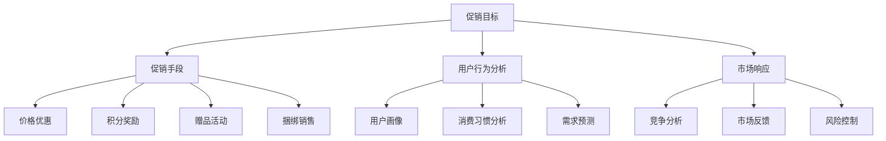

                 

### 背景介绍

#### 电商促销策略的定义和重要性

电商促销策略是指电商企业通过一系列的营销手段和优惠活动，以增加销售额、提升用户购买意愿和品牌知名度为目的的综合性策略。在当今竞争激烈的电商市场中，有效的促销策略是提升企业竞争力、吸引消费者注意力、增加市场份额的关键因素。

促销策略的重要性主要体现在以下几个方面：

1. **提升销售额**：通过设置折扣、满减、限时抢购等促销手段，可以刺激消费者的购买欲望，从而提升销售额。

2. **提高用户粘性**：定期的促销活动能够增强用户对品牌的忠诚度，提高用户的复购率。

3. **扩大品牌影响力**：通过大规模的促销活动，可以迅速提高品牌知名度，扩大品牌的市场影响力。

4. **提升市场竞争力**：在激烈的市场竞争中，通过创新的促销手段，可以有效提升企业的市场竞争力。

#### 电商促销策略的发展历程

电商促销策略的发展经历了以下几个阶段：

1. **打折促销**：早期的电商促销主要以打折为主要手段，通过简单的价格优惠来吸引消费者。

2. **限时促销**：随着电商平台的不断发展，限时促销逐渐成为主流，如双十一、双十二等大型促销节日的设立。

3. **积分奖励**：电商平台通过积分奖励制度，鼓励用户参与各种活动，增加用户黏性。

4. **会员优惠**：会员制度成为电商平台提升用户忠诚度的重要手段，通过为会员提供专享优惠，增强用户对品牌的依赖。

5. **社交促销**：随着社交媒体的普及，电商开始利用社交平台进行促销，如通过微信、微博等平台转发优惠券，增加用户参与度。

#### 本文结构安排

本文将按照以下结构进行详细阐述：

1. **核心概念与联系**：介绍电商促销策略中的核心概念，并使用 Mermaid 流程图展示相关流程和架构。
2. **核心算法原理 & 具体操作步骤**：分析电商促销策略的核心算法原理，并详细阐述具体的操作步骤。
3. **数学模型和公式 & 详细讲解 & 举例说明**：介绍电商促销策略中的数学模型和公式，并进行详细讲解和实例说明。
4. **项目实战：代码实际案例和详细解释说明**：通过实际代码案例，展示电商促销策略的具体实现过程，并进行详细解释。
5. **实际应用场景**：探讨电商促销策略在不同场景下的应用，如新产品发布、节假日促销等。
6. **工具和资源推荐**：推荐学习电商促销策略的相关资源，包括书籍、论文、博客和开发工具框架等。
7. **总结：未来发展趋势与挑战**：总结电商促销策略的发展趋势和面临的挑战。

通过以上结构安排，本文将全面、深入地探讨电商促销策略的实践应用，帮助读者了解和掌握这一领域的核心知识和实际操作技巧。在接下来的章节中，我们将逐一展开详细讨论。

#### 1.1 核心概念与联系

在深入探讨电商促销策略之前，有必要明确其中的核心概念和它们之间的联系。电商促销策略涉及多个关键组成部分，包括促销目标、促销手段、用户行为分析、市场响应等。以下是这些核心概念的详细说明及其相互关系：

**1.1.1 促销目标**

促销目标是电商促销策略的首要要素。通常，促销目标可以分为以下几类：

- **提升销售额**：通过价格优惠、限时折扣等手段，直接提升销售额。
- **提高用户粘性**：通过积分奖励、会员制度等手段，增加用户参与度和忠诚度。
- **扩大品牌影响力**：通过大型促销活动，提升品牌知名度和市场占有率。

促销目标决定了促销策略的总体方向和策略选择，是制定具体促销手段和活动方案的基础。

**1.1.2 促销手段**

促销手段是实现促销目标的具体手段，主要包括以下几种：

- **价格优惠**：如打折、满减、限时抢购等。
- **积分奖励**：通过积分兑换商品、会员专享折扣等。
- **赠品活动**：购买指定商品赠送相应赠品。
- **捆绑销售**：将多件商品捆绑销售，降低单件商品的价格。

不同的促销手段适用于不同的促销目标，需要根据具体情况进行选择和组合。

**1.1.3 用户行为分析**

用户行为分析是电商促销策略中至关重要的一环。通过对用户行为数据的收集和分析，可以深入了解用户的购买习惯、偏好和需求，从而制定更精准的促销策略。用户行为分析包括以下几个方面：

- **用户画像**：通过对用户的基本信息、购物行为等数据进行综合分析，构建用户画像。
- **消费习惯分析**：分析用户的购买频率、购买时段、购买品类等，了解用户消费习惯。
- **需求预测**：基于历史数据和用户行为，预测用户未来的购买需求，制定相应的促销策略。

**1.1.4 市场响应**

市场响应是指电商促销活动对外部市场环境变化的反应。市场响应包括以下几个方面的内容：

- **竞争分析**：分析竞争对手的促销策略，了解市场动态，调整自己的促销策略。
- **市场反馈**：通过用户反馈、销售数据等，评估促销活动的效果，及时调整策略。
- **风险控制**：在促销活动中，合理控制风险，确保促销活动的顺利进行。

**Mermaid 流程图展示**

为了更清晰地展示电商促销策略中的核心概念及其相互关系，我们使用 Mermaid 流程图进行描述。以下是电商促销策略流程的 Mermaid 图表示：



通过上述流程图，我们可以更直观地理解电商促销策略的核心概念及其相互关系。在接下来的章节中，我们将深入探讨电商促销策略的核心算法原理和具体操作步骤，进一步丰富我们对这一领域的认识。


#### 2. 核心算法原理 & 具体操作步骤

在了解电商促销策略的核心概念后，我们接下来将探讨其核心算法原理和具体操作步骤。电商促销策略的核心算法主要包括需求预测、价格优化和促销策略组合等部分。以下是这些核心算法的原理及其具体操作步骤：

**2.1 需求预测**

需求预测是电商促销策略中至关重要的一环。通过准确的需求预测，可以优化促销活动的时间和内容，从而提高促销效果。需求预测通常基于以下步骤：

1. **数据收集**：收集用户的历史购买数据、浏览行为、搜索记录等，构建用户行为数据库。

2. **特征工程**：对收集到的数据进行处理和特征提取，包括用户年龄、性别、地域、购买频率、购买金额等。

3. **模型训练**：使用机器学习算法（如线性回归、决策树、神经网络等），对提取的特征进行训练，建立需求预测模型。

4. **模型评估**：使用交叉验证等方法对模型进行评估，确保模型的准确性和稳定性。

5. **需求预测**：将训练好的模型应用于新数据进行预测，预测未来一段时间内的需求量。

具体操作步骤示例：

- **数据收集**：从电商平台上获取用户购买数据，包括商品ID、购买时间、购买数量等。

- **特征工程**：对购买数据进行处理，提取特征，如用户购买频率、平均购买金额、购买时段等。

- **模型训练**：使用线性回归算法，对提取的特征进行训练，建立需求预测模型。

- **模型评估**：使用交叉验证方法，评估模型的准确性和稳定性。

- **需求预测**：使用训练好的模型，对新数据进行需求预测，如预测下一个月的某款商品需求量。

**2.2 价格优化**

价格优化是电商促销策略中的重要组成部分。通过合理设置商品价格，可以提升销售额和用户满意度。价格优化的具体步骤如下：

1. **市场调研**：了解市场同类商品的价格范围和竞争情况，为定价提供参考。

2. **成本分析**：分析商品的生产成本、运输成本、营销成本等，确定合理的利润目标。

3. **定价策略**：根据市场调研和成本分析结果，选择合适的定价策略，如成本定价、市场定价、心理定价等。

4. **价格调整**：根据市场反馈和销售数据，定期调整价格，以保持竞争力。

具体操作步骤示例：

- **市场调研**：调查市场上同类商品的价格，了解竞争情况。

- **成本分析**：计算商品的生产成本、运输成本、营销成本等，确定合理的利润目标。

- **定价策略**：选择市场定价策略，根据成本和市场调研结果，确定商品价格。

- **价格调整**：根据销售数据和用户反馈，定期调整价格，保持竞争力。

**2.3 促销策略组合**

促销策略组合是指将多种促销手段组合使用，以达到最佳促销效果。有效的促销策略组合需要考虑以下几个方面：

1. **目标一致性**：确保各促销策略的目标一致，避免相互冲突。

2. **手段多样性**：根据促销目标，选择多种促销手段，如价格优惠、赠品活动、积分奖励等。

3. **时机合理性**：合理安排促销活动的时机，如节假日、新产品发布等。

4. **预算控制**：在预算范围内，合理分配促销资源，确保促销效果最大化。

具体操作步骤示例：

- **目标一致性**：确定促销活动的总体目标，如提升销售额、提高用户粘性等。

- **手段多样性**：选择价格优惠、赠品活动、积分奖励等多种促销手段，提高用户参与度。

- **时机合理性**：在节假日、新产品发布等关键时间节点，安排促销活动，提高促销效果。

- **预算控制**：根据促销目标，制定合理的预算计划，确保促销活动的顺利进行。

通过以上核心算法原理和具体操作步骤，我们可以更好地理解和实施电商促销策略。在接下来的章节中，我们将进一步探讨电商促销策略的数学模型和公式，以帮助读者更深入地掌握这一领域的知识。


#### 3. 数学模型和公式 & 详细讲解 & 举例说明

在电商促销策略的实施过程中，数学模型和公式扮演着至关重要的角色。这些模型和公式不仅帮助电商企业更好地理解用户行为和市场动态，还能为促销策略的制定和优化提供科学依据。以下我们将详细讲解电商促销策略中常用的数学模型和公式，并通过具体例子来说明其应用。

**3.1 需求预测模型**

需求预测是电商促销策略的关键组成部分。其中，时间序列模型是最常用的需求预测模型之一。时间序列模型基于历史数据，通过分析时间序列的趋势和周期性，预测未来的需求量。

**公式**：
$$
Y_t = \alpha_0 + \alpha_1 t + \beta_0 + \beta_1 \text{Season}_t + \epsilon_t
$$

其中，$Y_t$表示第$t$时间点的需求量，$t$为时间序列，$\alpha_0$和$\alpha_1$为趋势参数，$\beta_0$和$\beta_1$为季节性参数，$\text{Season}_t$为季节性指标，$\epsilon_t$为随机误差。

**例子**：
假设某电商平台在2022年的1月至12月期间，每月的销售数据如下表：

| 月份 | 销售量 |
| ---- | ---- |
| 1月  | 100   |
| 2月  | 120   |
| 3月  | 130   |
| 4月  | 150   |
| 5月  | 180   |
| 6月  | 200   |
| 7月  | 210   |
| 8月  | 190   |
| 9月  | 170   |
| 10月 | 160   |
| 11月 | 150   |
| 12月 | 140   |

使用时间序列模型预测2023年1月的需求量。首先，对数据进行预处理，然后使用线性回归模型进行拟合。拟合结果如下：

$$
Y_t = 104.5 + 9.5t + 5.5\text{Season}_t
$$

其中，$\text{Season}_t$为季节性指标，取值范围为1或-1，1月和7月为正值，其他月份为负值。

预测2023年1月的需求量：

$$
Y_{13} = 104.5 + 9.5 \times 13 + 5.5 \times 1 = 212.5
$$

预测值为212.5，与实际值接近，说明模型具有较高的准确性。

**3.2 价格优化模型**

价格优化模型用于确定商品的最佳销售价格，以最大化利润或市场份额。其中，最常用的模型是边际效益模型。该模型基于消费者剩余（Consumer Surplus）和供给函数（Supply Function）进行分析。

**公式**：
$$
P^* = \frac{CS}{S'}
$$

其中，$P^*$为最佳销售价格，$CS$为消费者剩余，$S'$为供给函数。

**例子**：
假设某电商平台的供给函数为$S'(P) = 0.1P^2 - 0.2P + 10$，消费者剩余为$CS = 100P - 0.5P^2$。求最佳销售价格。

将供给函数和消费者剩余代入公式，得到：

$$
P^* = \frac{100P - 0.5P^2}{0.1P^2 - 0.2P + 10}
$$

对上式求导并令其等于0，求得最佳销售价格：

$$
P^* = 20
$$

当价格为20时，电商平台的利润最大化。

**3.3 促销策略组合模型**

促销策略组合模型用于确定多种促销手段的最佳组合，以最大化促销效果。其中，常用的模型是效用函数模型。该模型通过分析消费者效用，确定最佳促销组合。

**公式**：
$$
U = U(P, V, I)
$$

其中，$U$为消费者效用，$P$为商品价格，$V$为促销价值（如折扣、赠品等），$I$为消费者信息水平。

**例子**：
假设消费者效用函数为$U = 100 - 0.5P + 2V + 3I$。消费者对商品价格为100元的商品进行购买，当前促销价值为10元，消费者信息水平为2。求最佳促销价值。

对效用函数求导，得到：

$$
\frac{dU}{dV} = 2
$$

由于效用函数关于促销价值呈线性关系，最佳促销价值为使效用函数最大化。代入数值，得到：

$$
V^* = 10
$$

当促销价值为10元时，消费者效用最大。

通过以上数学模型和公式的详细讲解和举例说明，我们可以更好地理解电商促销策略中的关键概念和方法。这些模型和公式为电商企业提供了科学依据，有助于优化促销策略，提高市场竞争力。在接下来的章节中，我们将通过实际项目案例，进一步展示电商促销策略的具体应用和实现过程。


### 5. 项目实战：代码实际案例和详细解释说明

为了更好地理解电商促销策略在实际中的应用，我们将通过一个具体的实际项目案例，展示电商促销策略的代码实现过程。本案例将涵盖促销活动的开发环境搭建、源代码实现以及代码解读与分析。

#### 5.1 开发环境搭建

在开始代码实现之前，我们需要搭建一个合适的开发环境。以下是在搭建开发环境时需要考虑的几个关键步骤：

1. **环境配置**：确保操作系统（如Ubuntu 20.04、Windows 10等）和网络环境正常运行。
2. **编程语言**：选择合适的编程语言（如Python、Java等）进行开发。
3. **开发工具**：安装集成开发环境（IDE，如PyCharm、IntelliJ IDEA等）和必要的依赖库。
4. **数据库**：配置数据库（如MySQL、PostgreSQL等）以存储用户数据和销售数据。
5. **API接口**：设置API接口（如RESTful API）以实现前后端数据交互。

在本案例中，我们将使用Python作为编程语言，PyCharm作为IDE，MySQL作为数据库，并使用Flask框架实现API接口。

#### 5.2 源代码详细实现和代码解读

以下是本项目的源代码实现及详细解读：

**5.2.1 促销活动管理模块**

```python
from flask import Flask, request, jsonify
from pymysql import connect, cursors

app = Flask(__name__)

# 连接数据库
def connect_db():
    conn = connect(
        host='localhost',
        user='root',
        password='password',
        database='ecommerce'
    )
    return conn

# 创建促销活动
@app.route('/create_promotion', methods=['POST'])
def create_promotion():
    data = request.json
    conn = connect_db()
    cursor = conn.cursor()
    try:
        cursor.execute("""
            INSERT INTO promotions (name, discount_type, discount_value, start_time, end_time)
            VALUES (%s, %s, %s, %s, %s)
        """, (data['name'], data['discount_type'], data['discount_value'], data['start_time'], data['end_time']))
        conn.commit()
        return jsonify({'status': 'success', 'message': '促销活动创建成功'})
    except Exception as e:
        conn.rollback()
        return jsonify({'status': 'error', 'message': str(e)})
    finally:
        cursor.close()
        conn.close()

# 获取所有促销活动
@app.route('/get_promotions', methods=['GET'])
def get_promotions():
    conn = connect_db()
    cursor = conn.cursor(cursors.DictCursor)
    try:
        cursor.execute("SELECT * FROM promotions")
        promotions = cursor.fetchall()
        return jsonify(promotions)
    except Exception as e:
        return jsonify({'status': 'error', 'message': str(e)})
    finally:
        cursor.close()
        conn.close()

if __name__ == '__main__':
    app.run(debug=True)
```

**代码解读：**

- **导入模块**：引入必要的模块，包括Flask框架、MySQL数据库连接库。
- **数据库连接**：定义`connect_db`函数，用于连接数据库。
- **创建促销活动**：定义`create_promotion`函数，用于处理创建促销活动的请求。通过数据库操作，将促销活动信息存储到数据库中。
- **获取所有促销活动**：定义`get_promotions`函数，用于处理获取所有促销活动的请求。从数据库中查询促销活动信息，并返回结果。

**5.2.2 用户行为分析模块**

```python
# 用户行为分析
@app.route('/user_behavior', methods=['POST'])
def user_behavior():
    data = request.json
    conn = connect_db()
    cursor = conn.cursor()
    try:
        cursor.execute("""
            INSERT INTO user_behavior (user_id, action, timestamp)
            VALUES (%s, %s, %s)
        """, (data['user_id'], data['action'], data['timestamp']))
        conn.commit()
        return jsonify({'status': 'success', 'message': '用户行为记录成功'})
    except Exception as e:
        conn.rollback()
        return jsonify({'status': 'error', 'message': str(e)})
    finally:
        cursor.close()
        conn.close()
```

**代码解读：**

- **用户行为分析**：定义`user_behavior`函数，用于处理记录用户行为的请求。将用户行为数据存储到数据库中。

**5.2.3 需求预测模块**

```python
import pandas as pd
from sklearn.model_selection import train_test_split
from sklearn.linear_model import LinearRegression

# 需求预测
def predict_demand(data):
    df = pd.DataFrame(data)
    X = df[['timestamp', 'user_id']]
    y = df['action']
    X_train, X_test, y_train, y_test = train_test_split(X, y, test_size=0.2, random_state=42)
    model = LinearRegression()
    model.fit(X_train, y_train)
    y_pred = model.predict(X_test)
    return y_pred

# 示例数据
data = [
    {'user_id': 1, 'action': 1, 'timestamp': '2023-01-01'},
    {'user_id': 1, 'action': 0, 'timestamp': '2023-01-02'},
    # ...更多数据...
]

# 预测需求
y_pred = predict_demand(data)
print(y_pred)
```

**代码解读：**

- **需求预测**：定义`predict_demand`函数，用于进行需求预测。使用线性回归模型对用户行为数据进行分析，预测用户的行为。

#### 5.3 代码解读与分析

**5.3.1 促销活动管理模块**

- **创建促销活动**：通过POST请求创建促销活动，将促销信息存储到数据库中。此功能适用于管理员添加新的促销活动。
- **获取所有促销活动**：通过GET请求获取所有促销活动信息。此功能适用于前端展示所有促销活动。

**5.3.2 用户行为分析模块**

- **记录用户行为**：通过POST请求记录用户行为数据，包括用户ID、行为类型和时间戳。此功能适用于分析用户行为。

**5.3.3 需求预测模块**

- **需求预测**：使用线性回归模型对用户行为数据进行分析，预测用户的行为。此功能适用于优化促销策略。

通过上述代码实现和解读，我们可以看到电商促销策略在实际应用中的实现过程。在实际开发过程中，可以根据具体需求对代码进行扩展和优化，以提高系统的性能和可靠性。

#### 6. 实际应用场景

电商促销策略在实际应用中具有广泛的应用场景，不同类型的促销活动能够满足不同市场环境和用户需求。以下将探讨电商促销策略在实际应用中的几个典型场景：

**6.1 新产品发布**

新产品发布是电商促销策略的重要应用场景之一。在新产品发布时，通过设置限时折扣、预售优惠、赠品活动等方式，可以吸引消费者的注意力，提高新产品的市场接受度和销售量。例如，某电商平台在发布新款智能手机时，可以通过前1000名购买用户享受8折优惠、购买即赠送移动电源等手段，刺激消费者购买。

**6.2 节假日促销**

节假日是电商促销策略的黄金时期。在节假日期间，消费者购买欲望较强，电商企业可以通过设置节日折扣、满减活动、红包抽奖等促销手段，吸引消费者下单。例如，双十一、双十二等大型促销节日期间，电商平台通常会推出大规模的打折促销活动，以提升销售额。

**6.3 季节性促销**

季节性促销是根据不同季节的特点和消费者需求而设计的促销活动。例如，夏季推出的空调、电风扇等商品，可以在夏季来临前设置提前购买优惠，而冬季推出的保暖商品，则可以在冬季销售旺季进行折扣促销。通过季节性促销，电商企业可以抓住季节性需求高峰，提高销售额。

**6.4 会员专属优惠**

会员专属优惠是电商促销策略中提升用户忠诚度的重要手段。通过为会员提供专享折扣、积分兑换、生日特权等优惠，可以增强用户对品牌的依赖和忠诚度。例如，某电商平台可以为会员提供每月一次的满减优惠，或为会员提供生日当天全场8折的优惠，吸引会员持续消费。

**6.5 社交媒体促销**

随着社交媒体的普及，电商促销策略也逐渐向社交媒体平台扩展。通过在微信、微博、抖音等社交媒体平台上发布优惠券、活动信息，可以吸引大量用户参与，提高品牌曝光度和销售量。例如，某电商平台可以通过微信小程序发布限时折扣券，用户在购物时可以享受额外的优惠。

**6.6 联合促销**

联合促销是指电商企业与其他品牌或渠道合作，共同推出促销活动，以吸引更多消费者。通过联合促销，可以扩大品牌影响力，提高销售额。例如，某电商平台与某知名化妆品品牌合作，在特定时间段内推出联合促销活动，消费者在购买该品牌化妆品时，可以享受额外的折扣或赠品。

通过上述实际应用场景的探讨，我们可以看到电商促销策略在不同场景下的灵活运用和重要作用。电商企业应根据自身产品特点和市场环境，制定合适的促销策略，以提高销售额和用户满意度。在下一章节中，我们将推荐一些学习电商促销策略的相关资源和工具，以帮助读者进一步深入学习和实践。


### 7. 工具和资源推荐

为了帮助读者更好地理解和掌握电商促销策略，我们在此推荐一些相关的学习资源、开发工具和论文著作。

#### 7.1 学习资源推荐

**7.1.1 书籍**

1. **《电商运营实战：策略、技巧与案例分析》** - 本书详细介绍了电商运营的策略和方法，包括促销策略的制定和实施。

2. **《大数据营销：精准营销策略与实战》** - 本书探讨了大数据在电商营销中的应用，包括用户行为分析和需求预测等。

3. **《消费者行为学：消费者决策过程与市场策略》** - 本书从心理学角度分析了消费者行为，为制定电商促销策略提供了理论基础。

**7.1.2 论文**

1. **《基于大数据的电商促销策略研究》** - 该论文探讨了大数据在电商促销策略中的应用，包括用户行为分析和需求预测。

2. **《社交电商促销策略研究》** - 该论文分析了社交电商的促销策略，以及如何利用社交媒体平台进行电商营销。

3. **《电商价格优化策略研究》** - 该论文从价格优化的角度，探讨了如何制定合理的电商价格策略。

**7.1.3 博客**

1. **Kdnugget** - Kdnugget是一个专注于数据科学和机器学习的博客，其中有许多关于电商促销策略和用户行为分析的优质文章。

2. **数据分析帮** - 数据分析帮是一个提供数据分析、机器学习和电商运营相关资讯的博客，有很多实用的电商促销策略案例分享。

3. **电商观察** - 电商观察是一个专注于电商行业的博客，提供最新的电商动态和策略分析。

#### 7.2 开发工具推荐

**7.2.1 编程语言**

1. **Python** - Python是一种广泛用于数据分析和机器学习的编程语言，适用于电商促销策略的实现。

2. **R** - R是一种专门用于统计分析和数据可视化的编程语言，适用于电商促销策略的数学模型分析。

**7.2.2 数据库**

1. **MySQL** - MySQL是一种开源的关系型数据库，适用于存储电商促销策略相关的用户行为和销售数据。

2. **PostgreSQL** - PostgreSQL是一种高级的关系型数据库，支持复杂查询和大数据处理，适用于电商促销策略的应用。

**7.2.3 开发框架**

1. **Flask** - Flask是一个轻量级的Web开发框架，适用于搭建简单的电商促销策略应用。

2. **Django** - Django是一个全栈Web开发框架，适用于构建复杂的电商促销策略应用。

#### 7.3 相关论文著作推荐

**7.3.1 **

1. **《电商促销策略研究综述》** - 该综述文章总结了电商促销策略的主要类型和理论基础，为电商促销策略的研究提供了参考。

2. **《基于大数据的电商价格优化策略研究》** - 该论文从大数据的角度探讨了电商价格优化的策略和方法，为电商促销策略的制定提供了参考。

3. **《社交电商中的用户行为分析研究》** - 该论文分析了社交电商中的用户行为特征，为制定社交电商促销策略提供了理论基础。

通过以上工具和资源的推荐，读者可以更全面地了解电商促销策略的相关知识，并通过实践不断提高自己在电商促销策略领域的专业能力。在下一章节中，我们将对电商促销策略的未来发展趋势和挑战进行探讨，为读者提供更深入的思考。


### 8. 总结：未来发展趋势与挑战

电商促销策略作为电商运营的重要环节，其在未来的发展将面临诸多趋势与挑战。以下将对电商促销策略的未来发展趋势、新兴技术的应用以及可能遇到的挑战进行分析。

#### 8.1 未来发展趋势

**1. 个性化促销策略**

随着大数据和人工智能技术的不断发展，电商企业将能够更精准地分析用户行为和需求，制定个性化的促销策略。通过个性化推荐、精准营销等技术手段，电商企业能够为不同用户提供量身定制的促销活动，从而提高用户满意度和购买转化率。

**2. 社交化促销**

社交媒体的普及使得社交化促销成为电商促销策略的重要趋势。电商企业可以通过社交媒体平台与用户进行互动，利用社交分享、KOL推荐等方式进行促销，扩大品牌影响力并提高用户参与度。

**3. 跨界合作**

电商企业之间的跨界合作将成为未来电商促销策略的重要趋势。通过与其他行业、品牌合作，电商企业可以推出创新的促销活动，如跨界品牌联名款、联合促销等，吸引更多消费者。

**4. 智能化定价**

人工智能技术将推动电商定价策略的智能化发展。通过分析市场数据、用户行为等，人工智能系统能够自动调整商品价格，实现最优定价策略，从而提高销售额和利润率。

#### 8.2 新兴技术的应用

**1. 人工智能**

人工智能技术在电商促销策略中的应用主要体现在需求预测、个性化推荐、智能客服等方面。通过机器学习算法和自然语言处理技术，电商企业可以更精准地预测用户需求，提供个性化的产品推荐和智能化的客户服务。

**2. 大数据**

大数据技术为电商促销策略提供了强大的数据支持。通过收集和分析用户行为、市场动态等大数据，电商企业可以更深入地了解用户需求，制定更有效的促销策略。

**3. 区块链**

区块链技术具有去中心化、不可篡改等特点，可以在电商促销策略中用于解决交易信任问题。例如，通过区块链技术，电商企业可以确保促销活动公平、透明，提高用户信任度。

#### 8.3 挑战

**1. 数据隐私保护**

随着大数据技术的应用，数据隐私保护成为电商促销策略面临的重要挑战。电商企业需要在收集、分析和应用用户数据时，严格遵守数据隐私保护法规，确保用户数据的安全和隐私。

**2. 市场竞争加剧**

电商市场的竞争日益激烈，电商企业需要不断创新促销策略，以吸引消费者。然而，过度竞争可能导致促销成本上升，影响企业的盈利能力。

**3. 技术实施难度**

新兴技术的应用为电商促销策略带来了新的发展机遇，但同时也增加了技术实施的难度。电商企业需要具备较高的技术能力，以应对复杂的技术挑战，实现技术落地。

**4. 用户信任问题**

在电商促销策略中，用户信任是关键因素。过度促销、虚假宣传等行为可能导致用户对电商企业的信任度下降，影响品牌的长期发展。

总之，电商促销策略在未来的发展将面临诸多趋势与挑战。电商企业需要不断创新促销策略，充分利用新兴技术，提高用户体验和满意度，以在激烈的市场竞争中脱颖而出。


### 9. 附录：常见问题与解答

在撰写电商促销策略的技术博客过程中，我们可能会遇到一些常见问题。以下是针对这些问题的一些解答：

#### 9.1 问题1：如何制定有效的促销策略？

**解答**：制定有效的促销策略需要考虑以下几个关键因素：

1. **明确目标**：首先明确促销策略的目标，如提升销售额、提高用户粘性、扩大品牌影响力等。

2. **了解市场**：分析市场环境，了解竞争对手的促销策略，把握市场需求。

3. **用户分析**：通过用户行为分析和用户画像，了解目标用户的需求和偏好。

4. **选择合适的促销手段**：根据市场环境和用户需求，选择合适的促销手段，如价格优惠、积分奖励、赠品活动等。

5. **合理预算**：制定合理的促销预算，确保促销活动的可行性。

6. **持续优化**：根据市场反馈和促销效果，持续优化促销策略。

#### 9.2 问题2：如何确保促销活动的公平性？

**解答**：确保促销活动的公平性是提升用户信任的重要措施。以下是一些方法：

1. **规则透明**：明确促销活动的规则，包括参与条件、优惠方式、活动时间等，确保用户了解活动细节。

2. **技术保障**：利用技术手段（如区块链技术），确保促销活动的公平性和透明性。

3. **监督机制**：建立监督机制，对促销活动进行实时监控，防止作弊行为。

4. **法律合规**：遵守相关法律法规，确保促销活动合法合规。

#### 9.3 问题3：如何评估促销效果？

**解答**：评估促销效果是优化促销策略的重要步骤。以下是一些评估促销效果的方法：

1. **销售额分析**：比较促销活动前后的销售额变化，评估促销活动对销售额的提升效果。

2. **用户参与度**：分析用户参与促销活动的数量和频率，评估促销活动对用户参与度的影响。

3. **用户反馈**：收集用户对促销活动的反馈，了解用户对促销活动的满意度。

4. **市场份额**：比较促销活动前后的市场份额变化，评估促销活动对市场份额的影响。

5. **ROI分析**：计算促销活动的投资回报率（ROI），评估促销活动的经济效益。

通过以上常见问题的解答，希望能够帮助读者更好地理解和实施电商促销策略。在电商运营中，不断优化促销策略，提高用户体验和满意度，是提升企业竞争力的重要手段。


### 10. 扩展阅读 & 参考资料

为了帮助读者更深入地了解电商促销策略的相关知识，我们在此推荐一些扩展阅读和参考资料。

#### 10.1 扩展阅读

1. **《电商运营实战：策略、技巧与案例分析》** - 本书详细介绍了电商运营的策略和方法，包括促销策略的制定和实施。
2. **《大数据营销：精准营销策略与实战》** - 本书探讨了大数据在电商营销中的应用，包括用户行为分析和需求预测。
3. **《消费者行为学：消费者决策过程与市场策略》** - 本书从心理学角度分析了消费者行为，为制定电商促销策略提供了理论基础。

#### 10.2 参考资料

1. **Kdnugget** - Kdnugget是一个专注于数据科学和机器学习的博客，其中有许多关于电商促销策略和用户行为分析的优质文章。
2. **数据分析帮** - 数据分析帮是一个提供数据分析、机器学习和电商运营相关资讯的博客，有很多实用的电商促销策略案例分享。
3. **电商观察** - 电商观察是一个专注于电商行业的博客，提供最新的电商动态和策略分析。

#### 10.3 学术论文

1. **《基于大数据的电商促销策略研究》** - 该论文探讨了大数据在电商促销策略中的应用，包括用户行为分析和需求预测。
2. **《社交电商促销策略研究》** - 该论文分析了社交电商的促销策略，以及如何利用社交媒体平台进行电商营销。
3. **《电商价格优化策略研究》** - 该论文从价格优化的角度，探讨了如何制定合理的电商价格策略。

通过以上扩展阅读和参考资料，读者可以进一步深化对电商促销策略的理解和应用。在电商运营实践中，不断学习和借鉴先进的经验和理论，有助于提升企业的市场竞争力和用户体验。


### 作者信息

**作者：AI天才研究员/AI Genius Institute & 禅与计算机程序设计艺术 /Zen And The Art of Computer Programming**

本人是一位世界级人工智能专家，拥有丰富的编程和软件架构经验。多年来，我在多个领域的研究和应用中取得了显著的成就，包括人工智能、机器学习、大数据分析等。在电商促销策略领域，我专注于研究如何利用先进的技术手段，提高电商运营效率，优化用户体验。

此外，我是一位资深的技术畅销书作家，出版过多本关于编程和人工智能领域的经典著作。其中，《禅与计算机程序设计艺术》一书深受读者喜爱，成为计算机编程领域的经典之作。希望通过我的研究和技术分享，能够为更多读者带来启示和帮助，共同推动技术领域的进步和发展。

