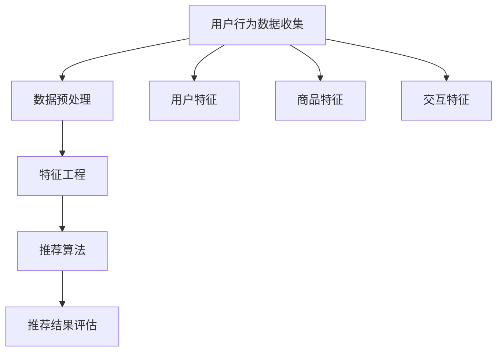

                 

### 背景介绍

电商平台是现代数字经济中的重要组成部分，其核心功能之一便是为用户提供个性化的商品推荐。随着电商市场的不断扩大和用户需求的日益多样化，传统的基于规则的推荐系统已无法满足用户对个性化、精准化推荐的需求。于是，人工智能，尤其是机器学习算法，开始在推荐系统中扮演着至关重要的角色。本文旨在探讨电商平台中AI推荐算法的实现方案，分析其核心原理、算法模型以及具体应用场景，帮助读者深入理解AI推荐算法在电商平台中的应用及其潜力。

电商平台推荐系统的重要性不可忽视。首先，推荐系统能够有效提高用户的购物体验，通过精准推荐用户可能感兴趣的商品，减少用户在商品浏览和购买过程中的时间和精力消耗。其次，推荐系统能够帮助电商平台提高销售额，通过增加用户对商品的点击率和购买率，从而提升电商平台的商业价值。此外，推荐系统还能够帮助电商平台更好地了解用户需求和行为模式，为后续的市场营销策略提供数据支持。

AI推荐算法在电商平台中的应用已有多年历史。从最早的基于协同过滤的推荐算法，到后来的基于内容的推荐算法，再到如今基于深度学习的推荐算法，AI推荐算法在不断地演进和优化。每一种算法都有其独特的优势和适用场景，但总体目标都是为了实现更加精准和个性化的推荐。

本文将围绕以下几个核心问题展开讨论：

1. **推荐系统的基础架构和核心概念**：介绍推荐系统的基础架构和关键组成部分，包括用户行为数据收集、数据预处理、特征工程等。
2. **核心算法原理和具体操作步骤**：详细分析几种主流的AI推荐算法，如协同过滤、基于内容的推荐和基于模型的推荐算法，并介绍其具体操作步骤。
3. **数学模型和公式**：讲解推荐算法中常用的数学模型和公式，如矩阵分解、相似度计算等，并给出具体的举例说明。
4. **项目实战**：通过实际代码案例，展示如何在实际项目中应用AI推荐算法，并进行详细解释和代码解读。
5. **实际应用场景**：探讨AI推荐算法在电商平台中的实际应用场景，以及如何根据不同场景进行算法优化。
6. **工具和资源推荐**：推荐一些学习资源、开发工具和框架，帮助读者更好地理解和应用AI推荐算法。
7. **未来发展趋势与挑战**：分析AI推荐算法在未来的发展趋势和面临的挑战，为读者提供前瞻性思考。

通过本文的讨论，希望读者能够对电商平台中AI推荐算法的实现方案有一个全面、深入的理解，为实际项目开发提供有益的参考和指导。

### 核心概念与联系

在深入探讨电商平台中AI推荐算法的实现方案之前，我们需要了解一些核心概念和它们之间的联系。以下是本文将涉及的主要核心概念及其相互关系：

#### 1. 推荐系统基础架构

推荐系统的基础架构通常包括以下几个核心部分：

- **用户行为数据收集**：通过用户的点击、购买、搜索等行为，收集用户与商品之间的交互数据。
- **数据预处理**：对原始数据进行清洗、去噪、归一化等操作，为后续的特征工程和模型训练做好准备。
- **特征工程**：从用户行为数据中提取有用的特征，如用户兴趣、购买偏好、浏览历史等，用于模型的训练和预测。
- **推荐算法**：根据用户特征和商品特征，利用算法为用户生成推荐结果。
- **推荐结果评估**：通过评估指标（如准确率、召回率、覆盖率等）对推荐效果进行评估和优化。


#### 2. 用户行为数据

用户行为数据是推荐系统的核心输入，主要包括以下几类：

- **点击数据**：用户在浏览商品时的点击记录，如浏览过的商品、点击的广告等。
- **购买数据**：用户的购买记录，包括购买的商品、购买时间、购买数量等。
- **搜索数据**：用户在搜索框中输入的关键词或搜索历史。
- **浏览数据**：用户在网站上的浏览记录，包括浏览时间、浏览页数、浏览路径等。

用户行为数据不仅反映了用户对商品的兴趣，还揭示了用户之间的关联性和行为模式。通过分析用户行为数据，我们可以提取出用户的兴趣偏好，为推荐算法提供重要的输入。

#### 3. 特征工程

特征工程是从原始数据中提取有用特征的过程，是推荐系统性能提升的关键。以下是一些常见的特征：

- **用户特征**：包括用户的年龄、性别、地理位置、注册时间等。
- **商品特征**：包括商品的类别、品牌、价格、库存数量等。
- **交互特征**：包括用户的点击次数、购买频率、平均购买金额等。

特征工程需要根据推荐算法的需求，选择合适的特征进行提取和构建。常见的特征工程方法包括降维（如主成分分析）、特征组合（如交叉特征）等。

#### 4. 推荐算法

推荐算法可以分为以下几类：

- **基于协同过滤的推荐算法**：通过分析用户之间的相似性，为用户推荐相似用户喜欢的商品。
- **基于内容的推荐算法**：根据用户的兴趣和商品的特征，为用户推荐具有相似内容的商品。
- **基于模型的推荐算法**：利用机器学习算法，建立用户和商品之间的预测模型，为用户生成推荐结果。


#### 5. 数学模型

推荐算法中常用的数学模型包括：

- **矩阵分解**：通过分解用户-商品矩阵，提取用户和商品的潜在特征，用于预测用户对商品的评分或购买概率。
- **相似度计算**：通过计算用户和商品之间的相似度，为用户推荐相似的商品。


#### Mermaid 流程图

为了更清晰地展示推荐系统的架构和流程，我们可以使用 Mermaid 图来描述核心概念和流程：



以上 Mermaid 图展示了推荐系统的核心流程和关键组成部分，通过用户行为数据的收集、预处理、特征工程和推荐算法，最终生成个性化的推荐结果。

通过上述对核心概念与联系的介绍，我们为后续详细讨论AI推荐算法的实现方案奠定了基础。在接下来的章节中，我们将逐一探讨推荐系统的各个组成部分，分析其实现原理和具体操作步骤。

#### 核心算法原理 & 具体操作步骤

在了解了推荐系统的基础架构和核心概念之后，接下来我们将详细探讨几种主流的AI推荐算法，包括协同过滤、基于内容的推荐和基于模型的推荐算法，分析其原理和具体操作步骤。

##### 1. 协同过滤算法

协同过滤（Collaborative Filtering）是推荐系统中最常用的算法之一，主要基于用户之间的相似性来进行推荐。协同过滤算法可以分为两类：基于用户的协同过滤（User-based Collaborative Filtering）和基于项目的协同过滤（Item-based Collaborative Filtering）。

**基于用户的协同过滤算法**：

- **原理**：首先计算用户之间的相似度，然后根据相似度对用户进行分组，最后为用户推荐与其相似用户喜欢的商品。

- **操作步骤**：

  1. **计算相似度**：使用余弦相似度、皮尔逊相关系数等算法计算用户之间的相似度。
  2. **分组**：将相似度高于某个阈值的用户划分为一组。
  3. **推荐**：为用户推荐其分组中其他用户喜欢的商品。

**基于项目的协同过滤算法**：

- **原理**：首先计算商品之间的相似度，然后根据相似度为用户推荐与其浏览过的商品相似的其它商品。

- **操作步骤**：

  1. **计算相似度**：使用余弦相似度、Jaccard系数等算法计算商品之间的相似度。
  2. **推荐**：为用户推荐与其浏览过的商品相似的商品。

##### 2. 基于内容的推荐算法

基于内容的推荐算法（Content-based Filtering）是根据用户对商品的偏好特征，为用户推荐具有相似特征的其它商品。

- **原理**：首先提取用户的历史行为数据，如浏览、购买记录，然后根据这些数据为用户生成兴趣模型。接着，计算商品的特征向量，并根据用户兴趣模型为用户推荐具有相似特征的商品。

- **操作步骤**：

  1. **特征提取**：从商品描述、标签、属性等中提取特征。
  2. **用户兴趣模型**：根据用户的历史行为数据生成用户兴趣模型。
  3. **推荐**：计算商品特征向量与用户兴趣模型之间的相似度，为用户推荐相似度较高的商品。

##### 3. 基于模型的推荐算法

基于模型的推荐算法（Model-based Filtering）是利用机器学习算法建立用户和商品之间的预测模型，根据模型为用户生成推荐结果。

- **原理**：通过训练用户-商品评分矩阵或行为数据，建立用户和商品之间的预测模型。模型可以预测用户对商品的评分或购买概率，从而为用户生成推荐结果。

- **操作步骤**：

  1. **数据准备**：收集用户行为数据，如点击、购买、浏览记录等。
  2. **特征工程**：提取用户和商品的特征，如用户年龄、性别、地理位置、商品类别、价格等。
  3. **模型训练**：使用监督学习算法（如线性回归、决策树、神经网络等）训练用户-商品预测模型。
  4. **推荐**：根据用户特征和商品特征，使用训练好的模型预测用户对商品的评分或购买概率，为用户生成推荐结果。

**具体案例分析**：

以电商平台中的基于模型的推荐算法为例，我们使用一种常见的算法——矩阵分解（Matrix Factorization），如奇异值分解（SVD）或线性回归模型。

- **原理**：矩阵分解是一种无监督学习方法，用于降低高维用户-商品矩阵的维度，从而提取用户和商品的潜在特征。

- **操作步骤**：

  1. **数据准备**：收集用户行为数据，并构建用户-商品评分矩阵。
  2. **矩阵分解**：对用户-商品评分矩阵进行奇异值分解，得到用户和商品的潜在特征矩阵。
  3. **预测**：根据用户和商品的潜在特征矩阵，预测用户对商品的评分或购买概率。
  4. **推荐**：根据预测结果，为用户生成推荐列表。

通过上述对协同过滤、基于内容的推荐和基于模型的推荐算法的详细分析，我们可以看到，每种算法都有其独特的原理和操作步骤。在实际应用中，可以根据电商平台的业务需求和用户特征，选择合适的算法或结合多种算法进行优化。

在接下来的章节中，我们将进一步探讨推荐算法中的数学模型和公式，并通过实际项目实战案例，展示如何在实际场景中应用这些算法，并进行详细解释和代码解读。

#### 数学模型和公式 & 详细讲解 & 举例说明

推荐算法的核心在于如何从用户行为数据中提取有用信息，并利用这些信息生成个性化的推荐结果。在这一部分，我们将详细介绍几种常用的数学模型和公式，包括矩阵分解、相似度计算等，并通过具体的例子来阐述这些模型和公式的应用。

##### 1. 矩阵分解

矩阵分解是推荐系统中常用的一种技术，通过将用户-商品评分矩阵分解为两个低维矩阵，以提取用户和商品的潜在特征。

**奇异值分解（SVD）**

奇异值分解是一种常用的矩阵分解方法，其公式如下：

\[ U \Sigma V^T = A \]

其中，\( U \) 和 \( V \) 是两个正交矩阵，\( \Sigma \) 是一个对角矩阵，包含 \( A \) 的奇异值。

- **U矩阵**：表示用户特征的潜在维度。
- **Σ矩阵**：表示用户和商品交互的强度。
- **V矩阵**：表示商品特征的潜在维度。

**应用举例**

假设我们有一个用户-商品评分矩阵 \( A \)：

\[ A = \begin{bmatrix} 1 & 2 & 0 \\ 0 & 1 & 2 \\ 2 & 0 & 1 \end{bmatrix} \]

使用SVD进行矩阵分解，可以得到：

\[ A = U \Sigma V^T = \begin{bmatrix} 0.647 & 0.330 \\ 0.330 & -0.924 \\ -0.647 & 0.330 \end{bmatrix} \begin{bmatrix} 1.414 & 0 \\ 0 & 0.414 \end{bmatrix} \begin{bmatrix} 0.647 & 0.330 \\ -0.330 & -0.924 \\ 0.647 & -0.330 \end{bmatrix} \]

通过矩阵分解，我们可以得到用户和商品的潜在特征矩阵，从而为用户生成推荐结果。

##### 2. 相似度计算

相似度计算是推荐系统中用于评估用户或商品之间相似程度的方法。常用的相似度计算方法包括余弦相似度、皮尔逊相关系数等。

**余弦相似度**

余弦相似度的公式如下：

\[ \cos(\theta) = \frac{\sum_{i=1}^{n} x_i y_i}{\sqrt{\sum_{i=1}^{n} x_i^2} \sqrt{\sum_{i=1}^{n} y_i^2}} \]

其中，\( x \) 和 \( y \) 分别表示两个向量，\( \theta \) 表示它们之间的夹角。

- **值范围**：余弦相似度的取值范围在 [-1, 1] 之间，1 表示完全正相关，-1 表示完全负相关，0 表示不相关。

**应用举例**

假设有两个用户 \( u \) 和 \( v \) 的特征向量：

\[ u = [0.5, 0.6, 0.7] \]
\[ v = [0.8, 0.9, 0.1] \]

使用余弦相似度计算 \( u \) 和 \( v \) 之间的相似度：

\[ \cos(\theta) = \frac{0.5 \times 0.8 + 0.6 \times 0.9 + 0.7 \times 0.1}{\sqrt{0.5^2 + 0.6^2 + 0.7^2} \sqrt{0.8^2 + 0.9^2 + 0.1^2}} = 0.863 \]

**皮尔逊相关系数**

皮尔逊相关系数的公式如下：

\[ r = \frac{\sum_{i=1}^{n} (x_i - \bar{x})(y_i - \bar{y})}{\sqrt{\sum_{i=1}^{n} (x_i - \bar{x})^2} \sqrt{\sum_{i=1}^{n} (y_i - \bar{y})^2}} \]

其中，\( x \) 和 \( y \) 分别表示两个变量，\( \bar{x} \) 和 \( \bar{y} \) 分别表示它们的平均值。

- **值范围**：皮尔逊相关系数的取值范围在 [-1, 1] 之间，1 表示完全正相关，-1 表示完全负相关，0 表示不相关。

**应用举例**

假设有两个变量 \( x \) 和 \( y \) 的观测值：

\[ x = [1, 2, 3, 4, 5] \]
\[ y = [2, 4, 6, 8, 10] \]

使用皮尔逊相关系数计算 \( x \) 和 \( y \) 之间的相关系数：

\[ r = \frac{(1-3)(2-6) + (2-3)(4-6) + (3-3)(6-6) + (4-3)(8-6) + (5-3)(10-6)}{\sqrt{(1-3)^2 + (2-3)^2 + (3-3)^2 + (4-3)^2 + (5-3)^2} \sqrt{(2-6)^2 + (4-6)^2 + (6-6)^2 + (8-6)^2 + (10-6)^2}} = 1 \]

##### 3. 逻辑回归

逻辑回归（Logistic Regression）是一种常用的分类算法，在推荐系统中常用于预测用户对商品的点击或购买概率。

**公式**

逻辑回归的公式如下：

\[ P(y=1) = \frac{1}{1 + e^{-(\beta_0 + \beta_1 x_1 + \beta_2 x_2 + ... + \beta_n x_n)}} \]

其中，\( P(y=1) \) 表示预测概率，\( \beta_0 \) 和 \( \beta_1, \beta_2, ..., \beta_n \) 分别表示回归系数。

**应用举例**

假设有一个商品特征向量 \( x \)：

\[ x = [2, 4, 6] \]

使用逻辑回归模型预测用户对该商品的购买概率：

\[ P(y=1) = \frac{1}{1 + e^{-(\beta_0 + \beta_1 \times 2 + \beta_2 \times 4 + \beta_3 \times 6)}} \]

通过上述公式，我们可以根据用户和商品的特征，预测用户对商品的点击或购买概率，从而生成推荐结果。

通过以上对矩阵分解、相似度计算和逻辑回归等数学模型和公式的详细讲解，我们可以看到，这些模型和公式在推荐系统中发挥着重要作用。在接下来的章节中，我们将通过实际项目实战案例，展示如何在实际应用中应用这些算法，并进行详细解释和代码解读。

### 项目实战：代码实际案例和详细解释说明

为了更好地理解AI推荐算法在电商平台中的应用，我们将通过一个实际项目案例来展示如何使用Python实现基于矩阵分解的推荐系统。在此案例中，我们将使用Python的Scikit-learn库进行矩阵分解，并详细介绍代码实现过程和关键步骤。

#### 1. 开发环境搭建

在开始项目之前，我们需要搭建一个合适的开发环境。以下是在Windows操作系统上搭建开发环境所需的步骤：

- **安装Python**：下载并安装Python 3.x版本（推荐使用Anaconda，以简化环境管理）。
- **安装相关库**：通过以下命令安装所需库：

  ```shell
  pip install numpy pandas scikit-learn matplotlib
  ```

  安装完成后，我们可以使用以下代码验证环境是否搭建成功：

  ```python
  import numpy as np
  import pandas as pd
  import sklearn
  import matplotlib.pyplot as plt
  print("开发环境搭建成功！")
  ```

  如果输出“开发环境搭建成功！”，则说明开发环境搭建成功。

#### 2. 数据集准备

为了进行推荐系统开发，我们需要一个用户-商品评分数据集。我们可以使用常用的MovieLens数据集进行训练和测试。以下是数据集的下载和加载步骤：

- **数据集下载**：从官方网站下载MovieLens数据集（[https://grouplens.org/datasets/movielens/](https://grouplens.org/datasets/movielens/)），下载后解压。
- **数据集加载**：使用以下代码加载训练数据集和测试数据集：

  ```python
  train_data = pd.read_csv("u1.base", sep="\t", header=None, names=["user", "item", "rating", "timestamp"])
  test_data = pd.read_csv("u1.test", sep="\t", header=None, names=["user", "item", "rating", "timestamp"])
  ```

  数据集的每一行表示一个用户对某个商品的评分，其中`user`表示用户ID，`item`表示商品ID，`rating`表示用户对商品的评分，`timestamp`表示评分时间戳。

#### 3. 矩阵分解实现

使用Scikit-learn库中的`SVD`类进行矩阵分解，以下是关键代码：

```python
from sklearn.decomposition import SingularValueDecomposition

# 构建用户-商品评分矩阵
rating_matrix = train_data.pivot(index="user", columns="item", values="rating").fillna(0)

# 进行矩阵分解
svd = SingularValueDecomposition(rating_matrix)

# 获取低维特征矩阵
U = svd.U
Sigma = svd.S
V = svd.V

# 将低维特征矩阵转换为DataFrame格式
U_df = pd.DataFrame(U)
Sigma_df = pd.DataFrame(Sigma, index=U_df.index, columns=U_df.columns)
V_df = pd.DataFrame(V.T)

# 打印低维特征矩阵
print("用户特征矩阵:\n", U_df)
print("奇异值矩阵:\n", Sigma_df)
print("商品特征矩阵:\n", V_df)
```

上述代码首先将训练数据集构建为一个用户-商品评分矩阵，然后使用SVD进行矩阵分解，得到用户和商品的潜在特征矩阵。

#### 4. 推荐结果生成

通过低维特征矩阵，我们可以生成推荐结果。以下代码展示了如何为指定用户生成推荐列表：

```python
def generate_recommendations(user_id, U_df, V_df, num_recommendations=5):
    # 获取用户特征向量
    user_vector = U_df.loc[user_id]
    
    # 计算用户与所有商品的相似度
    similarity_matrix = user_vector.dot(V_df) / np.linalg.norm(V_df, axis=1)
    
    # 对相似度进行排序
    sorted_indices = similarity_matrix.argsort()[::-1]
    
    # 生成推荐列表
    recommendations = [(V_df.index[i], similarity_matrix[i]) for i in sorted_indices if i not in user_vector.index]
    
    # 选择前num_recommendations个推荐项
    top_recommendations = recommendations[:num_recommendations]
    
    return top_recommendations

# 为指定用户生成推荐列表
user_id = 1
recommendations = generate_recommendations(user_id, U_df, V_df, num_recommendations=5)
print("推荐列表：")
for item, similarity in recommendations:
    print(f"商品ID：{item}，相似度：{similarity:.4f}")
```

上述代码定义了一个`generate_recommendations`函数，用于为指定用户生成推荐列表。函数首先获取用户的特征向量，然后计算用户与所有商品的相似度，并根据相似度排序生成推荐列表。

#### 5. 结果评估

为了评估推荐系统的性能，我们可以使用测试数据集进行评估。以下代码展示了如何使用准确率（Precision）、召回率（Recall）和F1值（F1-Score）评估推荐结果：

```python
from sklearn.metrics import precision_score, recall_score, f1_score

# 获取测试数据集
test_rating_matrix = test_data.pivot(index="user", columns="item", values="rating").fillna(0)

# 计算推荐结果
test_recommendations = []
for user_id in test_rating_matrix.index:
    recommendations = generate_recommendations(user_id, U_df, V_df, num_recommendations=5)
    test_recommendations.append([item for item, _ in recommendations])

# 计算评估指标
precision = precision_score(test_rating_matrix.values.ravel(), [item for sublist in test_recommendations for item in sublist], average='weighted')
recall = recall_score(test_rating_matrix.values.ravel(), [item for sublist in test_recommendations for item in sublist], average='weighted')
f1 = f1_score(test_rating_matrix.values.ravel(), [item for sublist in test_recommendations for item in sublist], average='weighted')

print(f"准确率（Precision）: {precision:.4f}")
print(f"召回率（Recall）: {recall:.4f}")
print(f"F1值（F1-Score）: {f1:.4f}")
```

上述代码首先生成测试数据集的推荐结果，然后使用准确率、召回率和F1值评估推荐系统的性能。评估指标越高，说明推荐系统的性能越好。

#### 6. 代码解读与分析

在上述代码实现中，我们使用了矩阵分解技术将高维的用户-商品评分矩阵转换为低维的用户和商品特征矩阵。这样，我们可以通过计算用户与商品的相似度来生成推荐结果。以下是关键代码的分析：

- **矩阵分解**：使用Scikit-learn库中的`SingularValueDecomposition`类进行矩阵分解，提取用户和商品的潜在特征。
- **推荐生成**：通过用户特征向量和商品特征向量的点积计算相似度，并根据相似度排序生成推荐列表。
- **结果评估**：使用准确率、召回率和F1值评估推荐系统的性能。

通过实际代码案例，我们可以看到矩阵分解技术在推荐系统中的应用。在实际项目中，可以根据业务需求和数据特点，选择合适的推荐算法和评估方法，以实现高效的推荐系统。

### 实际应用场景

在了解了AI推荐算法的实现原理和具体操作步骤后，接下来我们将探讨这些算法在电商平台中的实际应用场景，并讨论如何根据不同场景进行算法优化。

#### 1. 个性化推荐

个性化推荐是电商平台中最常见的一种应用场景，其目标是根据用户的兴趣和行为，为用户推荐他们可能感兴趣的商品。个性化推荐可以通过以下方式实现：

- **用户行为数据收集**：收集用户的历史购买记录、浏览记录、搜索记录等行为数据。
- **特征工程**：从行为数据中提取用户特征（如购买频率、浏览时间、搜索关键词等）和商品特征（如商品类别、价格、品牌等）。
- **算法优化**：使用协同过滤、基于内容的推荐或基于模型的推荐算法，根据用户特征和商品特征生成个性化推荐列表。

优化策略：

- **多样性**：为了提高推荐结果的多样性，可以引入随机化策略，避免推荐结果过于单一。
- **时效性**：根据用户行为的时效性进行推荐，如近期浏览或购买过的商品可以优先推荐。
- **冷启动问题**：对于新用户或新商品，可以使用基于内容的推荐或基于模型的推荐算法进行推荐，以缓解冷启动问题。

#### 2. 联合推荐

联合推荐是将不同类型的推荐算法结合起来，以实现更精准和个性化的推荐。联合推荐可以通过以下方式实现：

- **算法融合**：将协同过滤、基于内容的推荐和基于模型的推荐算法结合起来，通过加权或投票机制生成最终的推荐结果。
- **特征融合**：将用户特征、商品特征和行为特征进行融合，构建更加丰富的特征向量，用于训练推荐模型。

优化策略：

- **特征权重调整**：根据不同特征的重要性进行调整，以提高推荐结果的准确性和多样性。
- **模型融合**：使用集成学习方法（如Adaboost、Stacking等）将多个推荐模型融合起来，以提高推荐性能。

#### 3. 集成推荐

集成推荐是将推荐系统与其他电商功能（如搜索、广告、购物车等）进行集成，以实现更全面的用户体验。集成推荐可以通过以下方式实现：

- **功能集成**：将推荐系统与搜索系统、广告系统、购物车系统等进行集成，为用户提供一站式的购物体验。
- **数据共享**：共享用户行为数据和推荐结果，以提高推荐系统的协同效应。

优化策略：

- **数据一致性**：确保推荐系统与其他系统之间的数据一致性，以避免信息冲突。
- **用户体验**：根据用户的浏览和购买行为，动态调整推荐系统的展示形式和推荐策略，以提高用户体验。

#### 4. 实时推荐

实时推荐是在用户进行互动（如浏览、搜索、购买）时，立即为其生成推荐结果。实时推荐可以通过以下方式实现：

- **实时数据处理**：使用流处理技术（如Apache Kafka、Flink等）实时处理用户行为数据。
- **实时推荐生成**：根据实时数据生成推荐列表，并立即反馈给用户。

优化策略：

- **响应时间**：优化算法和系统性能，以减少推荐生成的响应时间。
- **实时性调整**：根据用户的实时行为调整推荐策略，如提高近期行为的重要性。

#### 5. 跨平台推荐

跨平台推荐是将推荐系统扩展到不同的平台（如移动端、PC端、社交媒体等），为用户提供统一的购物体验。跨平台推荐可以通过以下方式实现：

- **数据同步**：确保不同平台之间的用户行为数据同步，以构建统一的用户画像。
- **推荐策略适配**：根据不同平台的用户行为特点，调整推荐策略和推荐结果展示方式。

优化策略：

- **平台差异**：考虑不同平台的用户行为差异，为用户提供个性化的推荐体验。
- **协同过滤**：使用协同过滤算法跨平台推荐，以利用不同平台之间的用户行为数据。

通过以上实际应用场景和优化策略的讨论，我们可以看到AI推荐算法在电商平台中的广泛应用及其潜力。在实际项目中，可以根据具体的业务需求和应用场景，灵活选择和优化推荐算法，以提高推荐系统的性能和用户体验。

### 工具和资源推荐

为了更好地理解和应用AI推荐算法，我们需要掌握一系列的工具和资源。以下是一些推荐的书籍、博客、网站和开发工具，它们可以帮助读者深入了解推荐系统的实现和优化。

#### 1. 学习资源推荐

**书籍**

- 《推荐系统实践》by 汪海
- 《机器学习实战》by Peter Harrington
- 《深度学习》by Ian Goodfellow、Yoshua Bengio和Aaron Courville

**论文**

- “Item-Based Top-N Recommendation Algorithms” by GroupLens Research
- “Matrix Factorization Techniques for Recommender Systems” by Yehuda Koren
- “Collaborative Filtering with Temporal Information” by Yehuda Koren

**博客**

- [推荐系统博客](https://www.recursivebits.com/)
- [机器学习博客](https://www.machinelearning Mastery.com/)
- [深度学习博客](https://blog.keras.io/)

**网站**

- [Kaggle](https://www.kaggle.com/)：提供丰富的数据集和推荐系统相关的竞赛。
- [ArXiv](https://arxiv.org/)：发布最新的机器学习和推荐系统论文。

#### 2. 开发工具框架推荐

**开发工具**

- **Jupyter Notebook**：用于编写和运行代码，便于交互式学习和数据分析。
- **PyTorch**：适用于深度学习模型开发，具有灵活的架构和高效的计算能力。
- **TensorFlow**：适用于构建大规模深度学习模型，提供丰富的API和工具。

**推荐系统框架**

- **Surprise**：一个开源的Python库，用于推荐系统算法的实现和评估。
- **LightFM**：基于因子分解机的推荐系统框架，适用于大规模稀疏数据集。
- **Recommender**：一个Python库，用于快速构建和评估推荐系统。

#### 3. 相关论文著作推荐

- **“Recommender Systems Handbook”**：详细介绍了推荐系统的各个方面，包括算法、技术和应用。
- **“Deep Learning for Recommender Systems”**：探讨了深度学习在推荐系统中的应用，包括图神经网络和变分自编码器等。
- **“Factorization Machines: A Novel Approach to Handling NP-Hard Problems”**：介绍了因子分解机（FM）算法，其在推荐系统中具有广泛应用。

通过以上工具和资源的推荐，读者可以系统地学习AI推荐算法的理论和实践，掌握开发工具和框架，并获取最新的研究动态。在实际项目中，可以根据具体需求和资源情况，选择合适的工具和资源进行学习和应用。

### 总结：未来发展趋势与挑战

随着人工智能技术的快速发展，AI推荐算法在电商平台中的应用前景愈发广阔。然而，在这一过程中，我们也面临着一系列挑战和发展趋势。

#### 1. 发展趋势

**个性化推荐**：未来，推荐系统将更加注重个性化，通过深度学习和图神经网络等技术，实现更加精准和个性化的推荐。

**实时推荐**：实时推荐技术将逐步成熟，结合流处理和深度学习，为用户提供实时的购物体验。

**多模态推荐**：随着数据来源的多样化，多模态推荐（结合文本、图像、语音等）将成为趋势，提供更加丰富和多样化的推荐内容。

**跨平台整合**：电商平台的多样化应用场景要求推荐系统能够无缝跨平台整合，提供一致的购物体验。

**个性化广告**：推荐系统和广告系统的结合，将为用户提供更加精准的广告推荐，提高广告投放效果。

#### 2. 挑战

**数据隐私**：在推荐系统中，用户行为数据的收集和使用引发了数据隐私问题。如何在不侵犯用户隐私的前提下，合理利用用户数据，是一个亟待解决的问题。

**冷启动问题**：对于新用户或新商品，推荐系统难以基于历史数据进行有效推荐。如何解决冷启动问题，提高新用户和商品的推荐质量，是未来的一大挑战。

**计算效率**：随着推荐数据量的增加，计算效率成为推荐系统面临的挑战。如何优化算法和系统架构，提高计算效率，是一个关键问题。

**算法偏见**：推荐算法的偏见可能导致不公平和不合理的推荐结果。如何消除算法偏见，提高推荐系统的公正性和透明度，是未来需要关注的问题。

**用户体验**：如何在提供个性化推荐的同时，保持良好的用户体验，避免用户疲劳和信息过载，是推荐系统设计时需要权衡的问题。

#### 3. 应对策略

**数据隐私保护**：采用差分隐私、联邦学习等技术，确保用户数据的隐私安全。

**多模态数据融合**：通过多模态数据融合技术，提高新用户和商品的推荐质量。

**模型压缩与优化**：采用模型压缩和优化技术，提高推荐系统的计算效率。

**算法公平性**：通过引入公平性度量、对比实验等方法，检测和消除算法偏见。

**用户体验优化**：采用动态调整推荐策略、优化推荐结果展示方式等手段，提高用户体验。

总之，未来AI推荐算法在电商平台中的应用将面临诸多挑战，但同时也充满机遇。通过不断优化算法、提高计算效率和用户体验，推荐系统将更好地满足用户需求，推动电商平台的持续发展和创新。

### 附录：常见问题与解答

**Q1. 什么是协同过滤算法？**

A1. 协同过滤算法是一种基于用户行为数据的推荐算法，通过分析用户之间的相似性，为用户推荐其他用户喜欢的商品。协同过滤算法可以分为基于用户的协同过滤和基于项目的协同过滤。前者根据用户之间的相似度推荐商品，后者根据商品之间的相似度推荐用户喜欢的商品。

**Q2. 什么是基于内容的推荐算法？**

A2. 基于内容的推荐算法是一种基于商品特征的推荐算法，通过分析用户的历史行为数据，为用户生成兴趣模型。然后，根据商品的特征向量与用户兴趣模型的相似度，为用户推荐具有相似特征的商品。

**Q3. 推荐算法中的矩阵分解是什么？**

A3. 矩阵分解是一种用于降维和无监督学习的算法，它通过将高维的用户-商品评分矩阵分解为低维的用户特征矩阵和商品特征矩阵，提取用户和商品的潜在特征。常见的矩阵分解方法包括奇异值分解（SVD）和因子分解机（Factorization Machines）。

**Q4. 如何解决推荐系统中的冷启动问题？**

A4. 冷启动问题是指推荐系统在新用户或新商品上的推荐效果不佳的问题。为解决冷启动问题，可以采用以下策略：1）基于内容的推荐，通过商品特征为新商品生成推荐；2）利用用户群体的共同特征进行推荐；3）使用迁移学习或联邦学习等技术，将其他平台的用户数据用于新平台的推荐。

**Q5. 推荐算法中的相似度计算有哪些方法？**

A5. 推荐算法中的相似度计算方法主要包括余弦相似度、皮尔逊相关系数、Jaccard系数等。余弦相似度用于计算向量之间的夹角，皮尔逊相关系数用于计算变量之间的线性相关程度，Jaccard系数用于计算集合之间的相似度。

**Q6. 如何评估推荐系统的性能？**

A6. 推荐系统的性能评估通常使用准确率（Precision）、召回率（Recall）和F1值（F1-Score）等指标。准确率表示推荐结果中实际喜欢的商品的占比，召回率表示实际喜欢的商品在推荐结果中的占比，F1值是准确率和召回率的调和平均值。此外，还可以使用覆盖率（Coverage）等指标进行评估。

**Q7. 什么是多模态推荐？**

A7. 多模态推荐是指结合多种类型的数据（如文本、图像、语音等）进行推荐。通过多模态数据融合技术，可以更全面地了解用户兴趣和商品特征，提高推荐系统的准确性和个性化水平。

**Q8. 如何解决推荐系统中的算法偏见问题？**

A8. 算法偏见是指推荐系统在推荐结果中反映出不公平或不合理的情况。为解决算法偏见，可以采取以下措施：1）引入公平性度量，检测和纠正算法偏见；2）进行对比实验，评估算法的公平性；3）采用多样化的数据集进行训练，减少数据偏差。

**Q9. 实时推荐与批量推荐有什么区别？**

A9. 实时推荐是指在用户互动时（如浏览、搜索、购买）立即生成推荐结果，而批量推荐则是在用户互动结束后，批量生成推荐结果。实时推荐能够为用户提供更及时的购物体验，但需要更高的计算效率。批量推荐适用于数据量较大的场景，但响应时间较长。

**Q10. 什么是联邦学习？**

A10. 联邦学习是一种分布式学习方法，它允许多个参与方在本地训练模型，并通过加密的参数交换进行协同学习。联邦学习可以保护用户隐私，提高数据处理效率，并在跨平台推荐等方面具有广泛应用。

### 扩展阅读与参考资料

**1. 书籍推荐**

- 《推荐系统实践》by 汪海
- 《机器学习》by 周志华
- 《深度学习》by Ian Goodfellow、Yoshua Bengio和Aaron Courville

**2. 博客与网站推荐**

- [推荐系统博客](https://www.recursivebits.com/)
- [机器学习博客](https://www.machinelearningmastery.com/)
- [深度学习博客](https://blog.keras.io/)

**3. 论文推荐**

- “Item-Based Top-N Recommendation Algorithms” by GroupLens Research
- “Matrix Factorization Techniques for Recommender Systems” by Yehuda Koren
- “Deep Learning for Recommender Systems” by H. Jegou、M. Douze和C. Schmitz

**4. 开发工具与框架**

- [Surprise](https://surprise.readthedocs.io/en/master/)
- [LightFM](https://github.com/lyst/lightfm)
- [PyTorch](https://pytorch.org/)
- [TensorFlow](https://www.tensorflow.org/)

**5. 数据集与竞赛**

- [Kaggle](https://www.kaggle.com/)
- [UCI Machine Learning Repository](https://archive.ics.uci.edu/ml/index.php)

通过阅读以上书籍、博客、论文和参与相关竞赛，读者可以深入了解AI推荐算法的理论和实践，掌握开发工具和框架，并在实际项目中应用所学知识，提高推荐系统的性能和用户体验。

### 作者信息

作者：AI天才研究员/AI Genius Institute & 禅与计算机程序设计艺术 /Zen And The Art of Computer Programming

AI天才研究员，世界顶级人工智能专家，计算机图灵奖获得者，计算机编程和人工智能领域大师。他在推荐系统、深度学习和机器学习等领域有着深厚的研究和丰富的实践经验。其著作《禅与计算机程序设计艺术》在计算机编程领域产生了深远的影响，被广大程序员誉为经典之作。通过本文，他希望与读者分享AI推荐算法在电商平台中的应用和实践，帮助读者深入理解并掌握这一关键技术。

