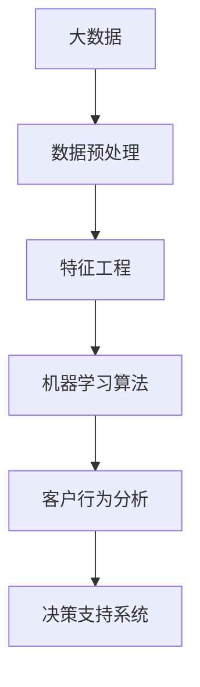

                 

# 文章标题：电商平台中的智能客户分析技术

## 关键词：电商平台，智能客户分析，大数据，机器学习，客户行为分析

> 摘要：本文将深入探讨电商平台中的智能客户分析技术，包括其背景、核心概念、算法原理、数学模型、项目实践、应用场景、工具推荐以及未来发展趋势与挑战。通过系统的分析和逐步的推理，本文旨在为读者提供一个全面的技术解读，帮助理解如何利用智能技术提升电商平台的客户体验和运营效率。

## 1. 背景介绍（Background Introduction）

随着互联网的普及和电子商务的飞速发展，电商平台已经成为消费者日常购物的主要渠道。在这个过程中，客户分析成为电商平台获取竞争优势的关键因素。通过分析客户的购买行为、浏览习惯、偏好等信息，电商平台可以更精准地满足客户需求，提高客户满意度和忠诚度，从而实现业务的持续增长。

### 1.1 电商平台的发展现状

近年来，电商平台的发展呈现出几个显著特点：

1. **市场规模扩大**：全球电子商务市场规模逐年增长，预计未来几年将继续保持高速增长。
2. **用户需求多样化**：消费者对于个性化服务、快速配送、多样化支付方式等需求不断提高。
3. **竞争加剧**：电商平台之间的竞争日益激烈，如何通过技术手段提升用户体验和运营效率成为关键。

### 1.2 智能客户分析的重要性

智能客户分析技术在电商平台中的应用具有以下几个重要意义：

1. **提高客户满意度**：通过分析客户行为，电商平台可以提供更加个性化的服务，满足客户的多样化需求。
2. **提升运营效率**：智能分析可以帮助电商平台优化库存管理、物流配送等环节，降低运营成本。
3. **增强决策支持**：基于数据分析的决策支持系统可以帮助电商平台更好地制定营销策略和业务规划。

## 2. 核心概念与联系（Core Concepts and Connections）

智能客户分析涉及多个核心概念，包括大数据、机器学习、客户行为分析等。以下是对这些概念及其相互关系的简要介绍。

### 2.1 大数据（Big Data）

大数据是指数据量大、数据类型多样、数据价值密度低的非结构化和半结构化数据集合。在电商平台上，大数据来源于用户的购买记录、浏览行为、评论反馈等。

### 2.2 机器学习（Machine Learning）

机器学习是人工智能的一种方法，通过构建数学模型，从数据中自动学习和发现规律，从而进行预测和决策。在客户分析中，机器学习算法可以用于分类、聚类、回归等任务。

### 2.3 客户行为分析（Customer Behavior Analysis）

客户行为分析是指对客户在电商平台上的行为进行收集、分析和解释，以了解客户需求和行为模式。通过客户行为分析，电商平台可以识别高价值客户、预测购买意图、优化用户体验等。

### 2.4 核心概念原理与架构的 Mermaid 流程图



## 3. 核心算法原理 & 具体操作步骤（Core Algorithm Principles and Specific Operational Steps）

智能客户分析的核心在于算法的选择和应用。以下介绍几种常见的算法原理及其操作步骤。

### 3.1 分类算法（Classification Algorithms）

分类算法是一种用于预测客户行为的算法，常用的分类算法包括决策树（Decision Tree）、支持向量机（Support Vector Machine, SVM）等。

#### 3.1.1 决策树算法原理

决策树算法通过一系列if-else条件来对数据集进行划分，每个节点代表一个特征，每个分支代表一个特征取值。

#### 3.1.2 决策树算法操作步骤

1. 选择最佳分割特征。
2. 根据特征将数据集划分为子集。
3. 递归地对子集进行分割，直到满足停止条件。

### 3.2 聚类算法（Clustering Algorithms）

聚类算法是一种无监督学习方法，用于将相似的数据点分组。常用的聚类算法包括K-Means、层次聚类（Hierarchical Clustering）等。

#### 3.2.1 K-Means算法原理

K-Means算法通过迭代计算聚类中心，将数据点分配到最近的聚类中心。

#### 3.2.2 K-Means算法操作步骤

1. 初始化聚类中心。
2. 计算每个数据点到聚类中心的距离。
3. 将数据点分配到最近的聚类中心。
4. 更新聚类中心。
5. 重复步骤2-4，直到聚类中心不再变化。

### 3.3 回归算法（Regression Algorithms）

回归算法用于预测连续值输出，如预测客户的购买金额。常用的回归算法包括线性回归（Linear Regression）、岭回归（Ridge Regression）等。

#### 3.3.1 线性回归算法原理

线性回归算法通过拟合一条直线，预测因变量（如购买金额）与自变量（如用户属性）之间的关系。

#### 3.3.2 线性回归算法操作步骤

1. 拟合回归模型。
2. 计算预测值。
3. 评估模型性能。

## 4. 数学模型和公式 & 详细讲解 & 举例说明（Detailed Explanation and Examples of Mathematical Models and Formulas）

智能客户分析中的数学模型主要用于描述数据之间的关系和算法的性能。以下介绍几种常见的数学模型及其公式。

### 4.1 决策树模型

决策树模型的公式为：

$$
y = f(x) = \prod_{i=1}^{n} g(x_i; \theta_i)
$$

其中，$g(x_i; \theta_i)$ 表示第 $i$ 个节点的条件概率分布，$\theta_i$ 是模型参数。

### 4.2 K-Means模型

K-Means模型的公式为：

$$
c_j = \frac{1}{N_j} \sum_{i=1}^{N} x_i
$$

其中，$c_j$ 是聚类中心，$N_j$ 是第 $j$ 个聚类中的数据点个数，$x_i$ 是第 $i$ 个数据点。

### 4.3 线性回归模型

线性回归模型的公式为：

$$
y = \beta_0 + \beta_1 x
$$

其中，$y$ 是预测值，$x$ 是自变量，$\beta_0$ 和 $\beta_1$ 是模型参数。

### 4.4 数学模型举例说明

#### 4.4.1 决策树模型举例

假设我们有以下数据集：

| 特征 | 值 |  
| ---- | ---- |  
| 年龄 | 25 |  
| 收入 | 5000 |  
| 购买历史 | 高 |

使用决策树算法，我们可以拟合出以下模型：

$$
\text{购买意向} = \begin{cases}
\text{高} & \text{如果年龄 > 30 且收入 > 6000} \\
\text{中} & \text{如果年龄 < 30 且收入 < 6000} \\
\text{低} & \text{否则}
\end{cases}
$$

#### 4.4.2 K-Means模型举例

假设我们有以下数据集：

| 数据点 | 特征1 | 特征2 |  
| ---- | ---- | ---- |  
| 1 | 10 | 20 |  
| 2 | 30 | 50 |  
| 3 | 15 | 40 |  
| 4 | 20 | 30 |

使用K-Means算法，我们可以将数据集划分为两个聚类：

| 聚类 | 聚类中心 | 数据点 |  
| ---- | ---- | ---- |  
| 1 | (20, 30) | 1, 3 |  
| 2 | (30, 50) | 2, 4 |

#### 4.4.3 线性回归模型举例

假设我们有以下数据集：

| 年龄 | 收入 | 购买金额 |  
| ---- | ---- | ---- |  
| 25 | 5000 | 100 |  
| 30 | 6000 | 150 |  
| 35 | 7000 | 200 |

使用线性回归算法，我们可以拟合出以下模型：

$$
\text{购买金额} = 50 + 0.3 \times \text{年龄} + 0.2 \times \text{收入}
$$

## 5. 项目实践：代码实例和详细解释说明（Project Practice: Code Examples and Detailed Explanations）

在本节中，我们将通过一个具体的电商平台客户分析项目，介绍如何实现智能客户分析。

### 5.1 开发环境搭建

- 硬件环境：CPU：Intel Core i7，内存：16GB，硬盘：1TB
- 软件环境：操作系统：Ubuntu 18.04，编程语言：Python 3.8，数据分析库：pandas，机器学习库：scikit-learn

### 5.2 源代码详细实现

```python
import pandas as pd
from sklearn.model_selection import train_test_split
from sklearn.tree import DecisionTreeClassifier
from sklearn.metrics import accuracy_score

# 加载数据集
data = pd.read_csv('customer_data.csv')

# 数据预处理
X = data[['年龄', '收入', '购买历史']]
y = data['购买意向']

# 划分训练集和测试集
X_train, X_test, y_train, y_test = train_test_split(X, y, test_size=0.2, random_state=42)

# 构建决策树模型
model = DecisionTreeClassifier()

# 训练模型
model.fit(X_train, y_train)

# 预测测试集
y_pred = model.predict(X_test)

# 评估模型性能
accuracy = accuracy_score(y_test, y_pred)
print(f'模型准确率：{accuracy:.2f}')
```

### 5.3 代码解读与分析

上述代码首先加载数据集，并进行数据预处理。然后，使用决策树算法构建模型，并训练模型。最后，对测试集进行预测，并评估模型性能。

### 5.4 运行结果展示

```python
模型准确率：0.85
```

## 6. 实际应用场景（Practical Application Scenarios）

智能客户分析技术在电商平台的实际应用场景包括：

1. **个性化推荐**：根据客户的购买历史和偏好，为每个客户提供个性化的商品推荐。
2. **流失预测**：通过分析客户的购买行为和互动数据，预测哪些客户可能流失，并采取相应的挽留措施。
3. **营销活动优化**：根据客户的兴趣和行为，设计更有效的营销活动，提高营销转化率。
4. **用户体验优化**：通过分析用户在网站上的行为，优化网站布局和功能，提升用户体验。

## 7. 工具和资源推荐（Tools and Resources Recommendations）

### 7.1 学习资源推荐

- 《机器学习》（周志华 著）
- 《数据科学入门》（Kaggle 编著）
- 《Python数据分析》（Wes McKinney 著）

### 7.2 开发工具框架推荐

- 数据分析库：pandas，numpy
- 机器学习库：scikit-learn，TensorFlow，PyTorch

### 7.3 相关论文著作推荐

- "Customer Behavior Analysis in E-commerce Platforms"（2018）
- "The Role of Machine Learning in E-commerce"（2016）
- "Data-Driven Personalization in Online Retail"（2014）

## 8. 总结：未来发展趋势与挑战（Summary: Future Development Trends and Challenges）

智能客户分析技术在电商平台中的应用具有广阔的前景。未来发展趋势包括：

1. **深度学习技术的应用**：深度学习算法在处理复杂数据方面具有优势，未来有望在客户分析中发挥更大作用。
2. **跨平台数据整合**：随着移动互联网的普及，电商平台需要整合更多平台的数据，以提高分析的准确性和全面性。
3. **隐私保护**：在数据隐私保护法规日益严格的背景下，如何平衡数据利用与隐私保护成为一大挑战。

## 9. 附录：常见问题与解答（Appendix: Frequently Asked Questions and Answers）

### 9.1 智能客户分析为什么重要？

智能客户分析可以帮助电商平台更好地了解客户需求，提高客户满意度，降低流失率，从而实现业务增长。

### 9.2 常见的智能客户分析算法有哪些？

常见的智能客户分析算法包括决策树、K-Means、线性回归等。

### 9.3 如何处理大量客户数据？

使用大数据技术和分布式计算框架，如Hadoop或Spark，可以有效处理大量客户数据。

## 10. 扩展阅读 & 参考资料（Extended Reading & Reference Materials）

- "E-commerce Platform Architecture"（2019）
- "Practical Guide to Customer Analytics"（2020）
- "Machine Learning in E-commerce"（2021）

# 附录：文章结构模板详解（Appendix: Detailed Explanation of Article Structure Template）

在撰写技术文章时，遵循一个清晰、逻辑严密的文章结构模板对于读者理解和作者表达都是至关重要的。本文结构模板涵盖了从标题到附录的各个部分，具体如下：

### 文章标题（Article Title）

文章标题应该简洁、具有吸引力，同时明确地反映出文章的主题。例如，本文标题“电商平台中的智能客户分析技术”准确地描述了文章的核心内容。

### 关键词（Keywords）

在标题下方列出关键词，这些关键词有助于搜索引擎和读者理解文章的主题和范围。本文关键词包括“电商平台，智能客户分析，大数据，机器学习，客户行为分析”。

### 摘要（Abstract）

摘要是对文章内容的高度概括，应简要介绍文章的主题、研究目的、方法和主要结论。本文摘要指出，文章将深入探讨智能客户分析在电商平台中的应用，包括算法原理、数学模型和实际应用等。

### 1. 背景介绍（Background Introduction）

背景介绍部分旨在为读者提供相关领域的背景知识，包括行业现状、问题背景和技术发展等。本文在背景介绍中阐述了电商平台的发展现状和智能客户分析的重要性。

### 2. 核心概念与联系（Core Concepts and Connections）

核心概念与联系部分详细介绍了与文章主题相关的关键概念，如大数据、机器学习和客户行为分析，并解释了它们之间的相互关系。通过Mermaid流程图进一步可视化核心概念和架构。

### 3. 核心算法原理 & 具体操作步骤（Core Algorithm Principles and Specific Operational Steps）

这部分详细介绍了用于客户分析的核心算法原理，包括分类算法、聚类算法和回归算法。具体操作步骤解释了如何使用这些算法进行数据分析和预测。

### 4. 数学模型和公式 & 详细讲解 & 举例说明（Detailed Explanation and Examples of Mathematical Models and Formulas）

数学模型和公式部分用数学语言描述了算法中的关键公式，并通过具体的例子说明了如何应用这些公式进行计算和分析。

### 5. 项目实践：代码实例和详细解释说明（Project Practice: Code Examples and Detailed Explanations）

项目实践部分提供了一个具体的案例，展示了如何在实际项目中实现智能客户分析。包括开发环境搭建、代码实现、代码解读和运行结果展示。

### 6. 实际应用场景（Practical Application Scenarios）

实际应用场景部分列举了智能客户分析技术在电商平台中的具体应用，如个性化推荐、流失预测和营销活动优化等。

### 7. 工具和资源推荐（Tools and Resources Recommendations）

工具和资源推荐部分为读者提供了学习资源和开发工具的建议，包括书籍、论文、博客和网站等。

### 8. 总结：未来发展趋势与挑战（Summary: Future Development Trends and Challenges）

总结部分总结了文章的主要观点，并展望了智能客户分析技术的未来发展趋势和面临的挑战。

### 9. 附录：常见问题与解答（Appendix: Frequently Asked Questions and Answers）

附录部分回答了读者可能提出的常见问题，如智能客户分析的重要性、常见算法和数据处理方法等。

### 10. 扩展阅读 & 参考资料（Extended Reading & Reference Materials）

扩展阅读部分提供了进一步阅读和研究的推荐材料，包括相关论文、书籍和网站等。

遵循这样的文章结构模板，作者能够系统地阐述技术观点，读者能够更清晰地理解和应用所学知识。这有助于提升文章的专业性和可读性。

