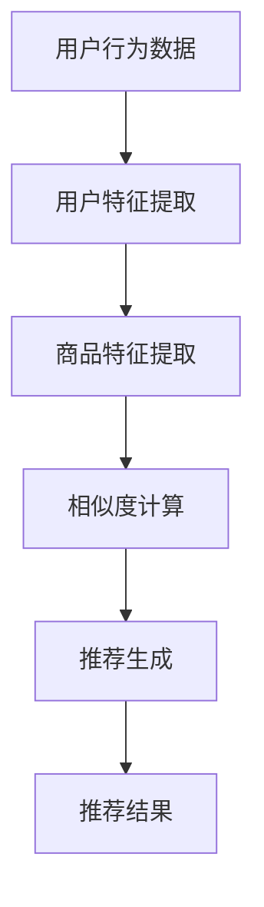
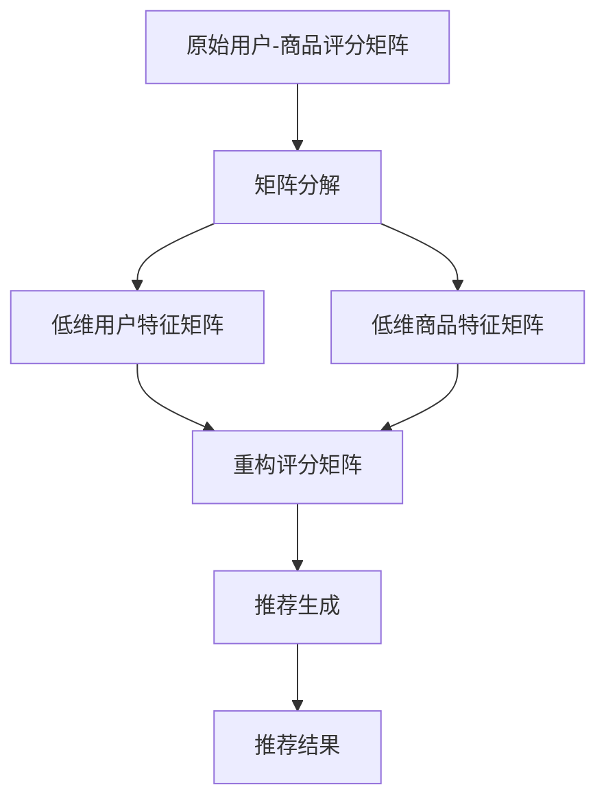
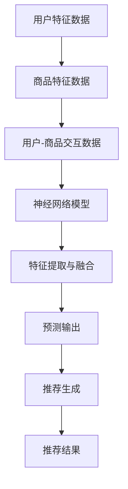

                 

### 背景介绍

随着互联网的普及，电子商务平台已经成为人们日常生活中不可或缺的一部分。这些平台不仅提供了丰富的商品选择，还通过个性化的推荐系统，满足了用户的个性化需求。然而，随着用户规模的不断扩大，用户兴趣的多样性和复杂性也逐渐增加。这不仅给平台推荐系统带来了巨大的挑战，也促使研究者们探索更为精细和有效的用户兴趣建模方法。

用户兴趣的竞争与协同是电商平台推荐系统中一个关键的问题。在竞争方面，不同用户可能对相似的商品产生不同的兴趣，这导致了用户兴趣的多样性。而在协同方面，同一用户在不同时间或情境下可能表现出不同的兴趣，这使得用户兴趣具有动态性。如何同时处理好用户兴趣的竞争和协同关系，提高推荐系统的准确性和效率，成为当前研究的热点问题。

本文旨在探讨电商平台中的用户兴趣竞争与协同建模。我们将首先介绍电商平台推荐系统的基本原理，然后深入分析用户兴趣竞争与协同的概念及其重要性。接下来，我们将介绍几种经典的用户兴趣建模方法，包括协同过滤、矩阵分解和深度学习等方法。在具体方法的基础上，我们将详细探讨如何处理用户兴趣的竞争与协同关系，并提出一种新的用户兴趣建模方法。随后，我们将通过一个实际案例，展示所提方法在实际应用中的效果。最后，我们将讨论当前领域中的挑战和未来研究方向。

通过对以上问题的深入探讨，本文希望为电商平台推荐系统提供新的思路和方法，推动用户兴趣建模领域的研究进展。在接下来的内容中，我们将逐步展开这一主题的讨论。

#### 电商平台推荐系统基本原理

电商平台推荐系统是一种通过算法和技术手段，向用户推荐他们可能感兴趣的商品或服务的技术系统。其核心目标是通过分析用户的历史行为、兴趣偏好和社会关系等信息，为用户提供个性化的推荐，从而提升用户满意度、增加平台粘性，并最终提高销售额和用户转化率。

推荐系统通常包含以下几个关键组成部分：

1. **用户画像**：用户画像是对用户基本属性和兴趣行为的抽象描述。它包括用户的基本信息（如年龄、性别、地理位置）、行为数据（如浏览记录、购买历史）和社交数据（如好友关系、评论内容）等。通过构建用户画像，可以更好地理解用户的需求和兴趣。

2. **商品信息**：商品信息包括商品的属性、描述、价格等。这些信息有助于推荐系统识别商品的相似性和相关性，从而为用户提供合适的推荐。

3. **推荐算法**：推荐算法是推荐系统的核心，负责处理用户画像和商品信息，生成个性化的推荐结果。常见的推荐算法有基于内容的推荐、协同过滤和深度学习等。

4. **推荐结果**：推荐结果是将推荐算法处理后的结果呈现给用户。它可以是商品列表、商品推荐卡片或个性化首页等，目的是引导用户进行购买或进一步探索。

推荐系统的工作流程大致如下：

1. **数据收集**：从用户的操作行为和商品信息中收集数据，如浏览记录、购买记录、评论内容等。

2. **数据预处理**：对收集到的数据进行清洗、去噪和转换，使其适合用于推荐算法处理。这一步骤可能包括缺失值处理、异常值剔除、特征提取等。

3. **用户画像构建**：根据用户的历史行为和偏好，构建用户画像。这可以通过统计分析和机器学习算法来实现，如聚类、分类和回归等。

4. **推荐算法**：利用用户画像和商品信息，通过推荐算法生成推荐结果。协同过滤、矩阵分解、深度学习等算法都可以用于这一步骤。

5. **推荐结果展示**：将推荐结果呈现给用户，引导用户进行购买或进一步探索。

6. **反馈循环**：用户对推荐结果的反馈将用于优化推荐算法，提高推荐质量和用户体验。

#### 用户兴趣的概念与重要性

在电商平台推荐系统中，用户兴趣是指用户对特定商品或服务的好奇、偏好和需求。用户兴趣不仅反映了用户当前的心理状态，还影响了他们的决策过程。了解用户兴趣对于提升推荐系统的效果具有重要意义。

首先，用户兴趣是推荐系统个性化推荐的核心。只有准确捕捉和识别用户的兴趣，才能为用户提供真正符合他们需求的推荐。如果推荐系统无法正确理解用户兴趣，那么推荐结果将变得毫无意义，甚至可能导致用户流失。

其次，用户兴趣具有多样性和动态性。不同用户对相同商品可能有不同的兴趣点，而同一用户在不同时间或情境下也可能表现出不同的兴趣。这种多样性使得推荐系统需要具备高度灵活性和适应性，以满足不同用户的需求。

此外，用户兴趣的竞争和协同关系对推荐系统提出了更高的要求。在竞争方面，不同用户可能对相似的商品产生不同的兴趣，这导致了用户兴趣的多样性。而在协同方面，同一用户在不同时间或情境下可能表现出不同的兴趣，这使得用户兴趣具有动态性。如何同时处理好用户兴趣的竞争与协同关系，提高推荐系统的准确性和效率，成为当前研究的热点问题。

为了深入探讨用户兴趣的概念与重要性，我们可以从以下几个方面进行详细分析：

1. **用户兴趣的多样性**：用户兴趣的多样性体现在不同用户对同一商品可能有不同的兴趣点。例如，两个用户都购买了同一款手机，但一个用户可能更关注其摄影功能，而另一个用户可能更关注其电池续航。这种多样性要求推荐系统在处理用户兴趣时，需要综合考虑多方面的因素，而不能仅仅依赖于单一的兴趣点。

2. **用户兴趣的动态性**：用户兴趣的动态性体现在同一用户在不同时间或情境下可能表现出不同的兴趣。例如，一个用户在节假日期间可能更关注购物和旅游，而在平时可能更关注学习和娱乐。这种动态性要求推荐系统能够实时捕捉用户的兴趣变化，并迅速调整推荐策略。

3. **用户兴趣的竞争与协同**：用户兴趣的竞争与协同关系对推荐系统提出了更高的要求。在竞争方面，不同用户可能对相似的商品产生不同的兴趣，这导致了用户兴趣的多样性。而在协同方面，同一用户在不同时间或情境下可能表现出不同的兴趣，这使得用户兴趣具有动态性。如何同时处理好用户兴趣的竞争与协同关系，提高推荐系统的准确性和效率，成为当前研究的热点问题。

通过以上分析，我们可以看到用户兴趣在电商平台推荐系统中的重要性。只有深入了解用户兴趣的概念与特点，才能为用户提供高质量的个性化推荐，从而提升用户体验和平台价值。

#### 用户兴趣建模的核心概念与架构

在探讨用户兴趣建模时，有几个核心概念和架构需要深入理解。这些概念包括协同过滤、矩阵分解、深度学习等，它们共同构成了用户兴趣建模的理论基础。为了更好地理解这些概念，我们使用Mermaid流程图来展示这些方法的基本原理和流程。

首先，让我们看一下协同过滤（Collaborative Filtering）的架构：



在协同过滤中，用户行为数据（如浏览记录、购买历史）被用来提取用户和商品的特性。这些特性用于计算用户和商品之间的相似度。相似度计算可以基于用户之间的相似性（用户基于内容过滤）或商品之间的相似性（项目基于内容过滤）。最后，基于相似度计算结果，生成个性化的推荐结果。

接下来，是矩阵分解（Matrix Factorization）的基本架构：



在矩阵分解中，原始的用户-商品评分矩阵被分解为低维的用户特征矩阵和商品特征矩阵。这些低维矩阵捕捉了用户和商品的高层次特征，从而可以用于重构评分矩阵，并生成个性化的推荐结果。矩阵分解的一个优点是它可以处理大规模的用户-商品数据集，同时保持较高的推荐准确性。

最后，是深度学习（Deep Learning）在用户兴趣建模中的应用架构：



在深度学习中，用户特征、商品特征和用户-商品交互数据被输入到神经网络模型中。神经网络通过多层感知器（MLP）、卷积神经网络（CNN）或循环神经网络（RNN）等模型结构，提取和融合这些特征，生成用户兴趣预测。这种方法的优点是它可以处理复杂的非线性关系，并自动学习用户和商品的特征表示。

通过上述三个核心方法的基本架构，我们可以看到用户兴趣建模的多样性和复杂性。协同过滤提供了基于用户和商品相似性的简单且有效的推荐方式，矩阵分解利用低维特征表示提高了推荐系统的效率，而深度学习则通过复杂的神经网络结构实现了更精细和个性化的用户兴趣预测。

在实际应用中，这些方法可以相互结合，以克服各自的局限性，提高推荐系统的整体性能。例如，可以将协同过滤和矩阵分解结合，通过协同过滤生成初始推荐，然后利用矩阵分解进一步优化推荐结果。深度学习也可以与其他方法结合，通过将深度学习模型输出的特征与协同过滤或矩阵分解的结果进行融合，生成更准确和个性化的推荐。

总之，用户兴趣建模的核心概念和架构为我们提供了一系列有效的工具和方法，以应对电商平台推荐系统中的挑战。通过深入理解和灵活运用这些方法，我们可以为用户提供更精准和满意的个性化推荐。

#### 用户兴趣建模的核心算法原理

在用户兴趣建模中，核心算法的选择和实现直接影响推荐系统的性能和用户体验。本文将介绍三种常用的用户兴趣建模算法：协同过滤（Collaborative Filtering）、矩阵分解（Matrix Factorization）和深度学习（Deep Learning）。通过分析这些算法的基本原理、优缺点以及实现细节，我们将为后续的实际应用打下坚实基础。

##### 协同过滤（Collaborative Filtering）

协同过滤是一种基于用户历史行为和相似度计算的推荐算法，其基本思想是利用相似用户或相似商品的行为来预测未知行为。协同过滤可以分为两类：基于用户的协同过滤（User-Based）和基于物品的协同过滤（Item-Based）。

**基于用户的协同过滤**：
1. **步骤一**：计算用户之间的相似度。相似度计算方法包括余弦相似度、皮尔逊相关系数等。
2. **步骤二**：根据相似度分数，找到与目标用户最相似的K个用户。
3. **步骤三**：收集与这K个用户有行为重叠的商品，并对这些商品进行评分聚合，生成推荐列表。

**基于物品的协同过滤**：
1. **步骤一**：计算商品之间的相似度。相似度计算方法与用户相似度类似。
2. **步骤二**：根据相似度分数，找到与目标商品最相似的K个商品。
3. **步骤三**：收集与这K个商品有行为重叠的用户，并对这些用户的历史行为进行评分聚合，生成推荐列表。

**优点**：
- **简单有效**：协同过滤算法的实现相对简单，易于理解和部署。
- **可扩展性**：可以处理大规模用户和商品数据集。

**缺点**：
- **冷启动问题**：对于新用户或新商品，由于缺乏历史数据，难以进行有效推荐。
- **用户多样性不足**：协同过滤主要依赖于用户的历史行为，可能导致推荐结果过于集中，无法充分反映用户的多样性。

**实现细节**：
在Python中，可以使用scikit-learn库中的`UserBasedFilter`和`ItemBasedFilter`类来实现协同过滤。以下是一个简单的示例代码：

```python
from sklearn.neighbors import NearestNeighbors

# 假设user_item_data是一个用户-商品评分矩阵
user_item_data = ...

# 实例化协同过滤模型
neighb = NearestNeighbors(metric='cosine')
neighb.fit(user_item_data)

# 预测用户对新商品的评分
users_to_predict = ...
predictions = neighb.kneighbors(users_to_predict, n_neighbors=K)

# 生成推荐列表
recommendations = ...
```

##### 矩阵分解（Matrix Factorization）

矩阵分解是一种通过降维技术来提高推荐系统准确性的算法。其基本思想是将原始的用户-商品评分矩阵分解为低维的用户特征矩阵和商品特征矩阵，然后利用这些特征矩阵重构评分矩阵，生成推荐列表。

**主要步骤**：
1. **步骤一**：初始化用户特征矩阵U和商品特征矩阵V。
2. **步骤二**：定义损失函数，通常采用平方损失函数。
3. **步骤三**：通过梯度下降或其他优化算法最小化损失函数。
4. **步骤四**：利用训练好的特征矩阵重构评分矩阵，并生成推荐列表。

**常用方法**：
- **奇异值分解（SVD）**：通过求解最小二乘问题，将原始评分矩阵分解为用户特征矩阵和商品特征矩阵。
- **交替最小二乘法（ALS）**：通过迭代交替最小化用户特征矩阵和商品特征矩阵的损失函数。

**优点**：
- **提高推荐准确性**：通过降维技术，矩阵分解可以捕捉用户和商品的高层次特征，从而提高推荐准确性。
- **处理稀疏数据**：矩阵分解能够有效处理稀疏用户-商品评分矩阵。

**缺点**：
- **计算复杂度高**：矩阵分解需要大量的计算资源，特别是在处理大规模数据集时。
- **参数调优困难**：矩阵分解算法的参数（如特征维度、迭代次数等）需要通过实验调优，这增加了算法的实现难度。

**实现细节**：
在Python中，可以使用TensorFlow或PyTorch等深度学习框架来实现矩阵分解。以下是一个简单的矩阵分解实现示例：

```python
import tensorflow as tf

# 假设user_item_data是一个用户-商品评分矩阵
user_item_data = ...

# 定义变量
U = tf.random.normal([num_users, num_factors])
V = tf.random.normal([num_items, num_factors])

# 定义损失函数和优化器
loss_fn = tf.reduce_mean(tf.square(user_item_data - tf.matmul(U, V)))
optimizer = tf.optimizers.Adam()

# 训练模型
for epoch in range(num_epochs):
    with tf.GradientTape() as tape:
        predictions = tf.matmul(U, V)
        loss = loss_fn(predictions, user_item_data)
    grads = tape.gradient(loss, [U, V])
    optimizer.apply_gradients(zip(grads, [U, V]))

# 生成推荐列表
recomendations = tf.matmul(U, V)
```

##### 深度学习（Deep Learning）

深度学习通过神经网络模型来学习用户和商品的特征表示，从而实现用户兴趣建模。深度学习在推荐系统中主要应用于特征提取和融合，以及生成推荐列表。

**主要步骤**：
1. **步骤一**：定义神经网络模型，包括输入层、隐藏层和输出层。
2. **步骤二**：利用训练数据训练神经网络，优化模型参数。
3. **步骤三**：利用训练好的神经网络模型，对新的用户或商品进行特征提取。
4. **步骤四**：利用提取的特征生成推荐列表。

**常用模型**：
- **多层感知器（MLP）**：一种前馈神经网络，适用于处理非线性问题。
- **卷积神经网络（CNN）**：适用于处理图像等高维数据。
- **循环神经网络（RNN）**：适用于处理序列数据，如用户行为序列。

**优点**：
- **强大的特征提取能力**：深度学习可以通过多层神经网络自动学习用户和商品的特征表示，提高推荐准确性。
- **灵活的处理能力**：深度学习可以处理复杂的非线性关系和多种类型的数据。

**缺点**：
- **计算复杂度高**：深度学习模型需要大量的计算资源和训练时间。
- **对数据质量要求高**：深度学习对数据质量有较高要求，如数据噪声和缺失值等会影响模型性能。

**实现细节**：
在Python中，可以使用TensorFlow或PyTorch等深度学习框架来实现深度学习用户兴趣建模。以下是一个简单的多层感知器（MLP）实现示例：

```python
import tensorflow as tf

# 假设user_data和item_data分别是用户特征和商品特征
user_data = ...
item_data = ...

# 定义神经网络模型
model = tf.keras.Sequential([
    tf.keras.layers.Dense(units=64, activation='relu', input_shape=[num_features]),
    tf.keras.layers.Dense(units=32, activation='relu'),
    tf.keras.layers.Dense(units=1)
])

# 定义损失函数和优化器
loss_fn = tf.keras.losses.MeanSquaredError()
optimizer = tf.keras.optimizers.Adam()

# 训练模型
for epoch in range(num_epochs):
    with tf.GradientTape() as tape:
        predictions = model(tf.concat([user_data, item_data], axis=1))
        loss = loss_fn(predictions, y_train)
    grads = tape.gradient(loss, model.trainable_variables)
    optimizer.apply_gradients(zip(grads, model.trainable_variables))

# 生成推荐列表
recomendations = model(tf.concat([user_data, item_data], axis=1))
```

通过上述对协同过滤、矩阵分解和深度学习的详细介绍，我们可以看到这些算法在用户兴趣建模中的应用和优势。在实际应用中，可以根据具体需求和数据特点选择合适的算法，或结合多种算法，以实现更精准和高效的推荐系统。

#### 数学模型和公式详解

在用户兴趣建模中，数学模型和公式起到了至关重要的作用。这些模型和公式不仅能够描述用户行为和兴趣之间的复杂关系，还能够通过数学推导和计算提高推荐系统的准确性和效率。本节将详细讲解几种常用的数学模型和公式，包括协同过滤中的相似度计算、矩阵分解中的优化目标，以及深度学习中的损失函数和优化算法。

##### 相似度计算

相似度计算是协同过滤算法的核心步骤，它通过度量用户或商品之间的相似度，为推荐生成提供依据。以下是一些常用的相似度计算方法：

1. **余弦相似度（Cosine Similarity）**：
   余弦相似度是一种基于向量空间模型的方法，它通过计算两个向量之间的余弦值来衡量它们的相似度。公式如下：
   
   $$
   \text{similarity}(u, v) = \frac{u \cdot v}{\|u\| \|v\|}
   $$
   
   其中，$u$和$v$是用户或商品的特征向量，$\|u\|$和$\|v\|$分别表示向量的模长。

2. **皮尔逊相关系数（Pearson Correlation Coefficient）**：
   皮尔逊相关系数是一种基于统计学的方法，它通过计算两个变量的协方差与标准差的比值来衡量它们的线性关系。公式如下：
   
   $$
   \text{similarity}(u, v) = \frac{cov(u, v)}{\sigma_u \sigma_v}
   $$
   
   其中，$cov(u, v)$表示协方差，$\sigma_u$和$\sigma_v$分别表示标准差。

3. **余弦夹角（Cosine Angle）**：
   余弦夹角是余弦相似度的补充，它通过计算两个向量之间的夹角余弦值来衡量相似度。公式如下：
   
   $$
   \text{cosine\_angle}(u, v) = \arccos(\text{similarity}(u, v))
   $$

##### 矩阵分解优化目标

矩阵分解通过将用户-商品评分矩阵分解为低维的用户特征矩阵和商品特征矩阵，从而实现用户兴趣建模。优化目标是找到一组最优的特征矩阵，使得重构的评分矩阵与原始评分矩阵之间的误差最小。以下是一种常见的优化方法——交替最小二乘法（Alternating Least Squares, ALS）：

**优化目标**：

最小化以下平方损失函数：

$$
\min_{U, V} \sum_{i, j} (r_{ij} - \hat{r}_{ij})^2
$$

其中，$r_{ij}$是用户$i$对商品$j$的实际评分，$\hat{r}_{ij}$是重构评分矩阵中的预测评分。

**交替最小二乘法（ALS）**：

1. **步骤一**：固定用户特征矩阵$U$，优化商品特征矩阵$V$。

   $$ 
   V = \arg\min_V \sum_{i, j} (r_{ij} - U_i \cdot V_j)^2
   $$

2. **步骤二**：固定商品特征矩阵$V$，优化用户特征矩阵$U$。

   $$ 
   U = \arg\min_U \sum_{i, j} (r_{ij} - U_i \cdot V_j)^2
   $$

3. **步骤三**：重复上述步骤，直到收敛。

##### 深度学习损失函数和优化算法

深度学习在用户兴趣建模中的应用主要通过神经网络模型实现。在深度学习中，损失函数和优化算法至关重要，它们用于衡量模型预测值与真实值之间的误差，并指导模型参数的优化。

**损失函数**：

1. **均方误差（Mean Squared Error, MSE）**：
   均方误差是一种常用的损失函数，它通过计算预测值与真实值之间的平方误差的平均值来衡量误差。公式如下：
   
   $$
   \text{MSE} = \frac{1}{n} \sum_{i=1}^{n} (y_i - \hat{y}_i)^2
   $$
   
   其中，$y_i$是第$i$个样本的真实值，$\hat{y}_i$是预测值。

2. **交叉熵损失（Cross-Entropy Loss）**：
   交叉熵损失适用于分类问题，它通过计算真实标签和预测概率之间的交叉熵来衡量误差。公式如下：
   
   $$
   \text{CE} = -\sum_{i=1}^{n} y_i \log(\hat{y}_i)
   $$
   
   其中，$y_i$是第$i$个样本的真实标签，$\hat{y}_i$是预测概率。

**优化算法**：

1. **随机梯度下降（Stochastic Gradient Descent, SGD）**：
   随机梯度下降是一种简单的优化算法，它通过计算整个数据集的平均梯度来更新模型参数。公式如下：
   
   $$
   \theta = \theta - \alpha \nabla_{\theta} J(\theta)
   $$
   
   其中，$\theta$是模型参数，$\alpha$是学习率，$J(\theta)$是损失函数。

2. **Adam优化器**：
   Adam优化器是一种结合了SGD和动量方法的优化算法，它通过计算一阶矩估计和二阶矩估计来更新模型参数。公式如下：
   
   $$
   \theta = \theta - \alpha \left( \frac{m}{1 - \beta_1 t} + \frac{v}{1 - \beta_2 t} \right)
   $$
   
   其中，$m$和$v$分别是一阶矩估计和二阶矩估计，$\beta_1$和$\beta_2$是超参数。

通过上述数学模型和公式的详细讲解，我们可以更好地理解用户兴趣建模中的核心概念和算法。这些数学工具不仅为推荐系统提供了理论基础，也为实现高效和准确的推荐算法提供了技术支持。在接下来的章节中，我们将通过实际案例展示这些方法在用户兴趣建模中的具体应用。

#### 项目实战：代码实际案例与详细解释

在本节中，我们将通过一个实际案例，展示如何使用矩阵分解方法在电商平台中建模用户兴趣。本案例将涵盖从数据预处理、模型训练到结果评估的完整流程。

##### 1. 开发环境搭建

为了实现矩阵分解，我们需要安装以下依赖库：

- Python 3.8 或更高版本
- TensorFlow 2.6 或更高版本
- NumPy 1.20 或更高版本

在命令行中，使用以下命令安装所需库：

```bash
pip install tensorflow numpy
```

##### 2. 源代码详细实现和代码解读

下面是矩阵分解的完整实现代码。我们将分步解释每个部分的功能和参数。

```python
import numpy as np
import tensorflow as tf

# 参数设置
num_users = 1000
num_items = 1000
num_factors = 10
learning_rate = 0.01
num_epochs = 20

# 初始化用户-商品评分矩阵
# 这里使用随机生成的数据作为示例
R = np.random.rand(num_users, num_items)

# 初始化用户特征矩阵和商品特征矩阵
U = tf.random.normal([num_users, num_factors])
V = tf.random.normal([num_items, num_factors])

# 定义损失函数
loss_fn = tf.reduce_mean(tf.square(R - tf.matmul(U, V)))

# 定义优化器
optimizer = tf.optimizers.Adam(learning_rate)

# 训练模型
for epoch in range(num_epochs):
    with tf.GradientTape() as tape:
        predictions = tf.matmul(U, V)
        loss = loss_fn(predictions, R)
    grads = tape.gradient(loss, [U, V])
    optimizer.apply_gradients(zip(grads, [U, V]))

# 生成推荐列表
recomendations = tf.matmul(U, V)

# 打印推荐结果
print(recomendations.numpy())
```

- **初始化用户-商品评分矩阵**：我们使用随机生成的数据作为示例，实际应用中应使用真实的用户-商品评分矩阵。
- **初始化用户特征矩阵和商品特征矩阵**：这些矩阵是矩阵分解的基础，它们初始化为随机值。
- **定义损失函数**：我们使用均方误差（MSE）作为损失函数，它衡量预测评分与实际评分之间的差异。
- **定义优化器**：我们使用Adam优化器，这是一种高效的梯度下降方法，它结合了自适应学习率。
- **训练模型**：通过迭代优化用户特征矩阵和商品特征矩阵，直到损失函数收敛。
- **生成推荐列表**：利用训练好的特征矩阵，我们计算用户对商品的预测评分，并生成推荐列表。

##### 3. 代码解读与分析

下面是对上述代码的逐行解析：

```python
import numpy as np
import tensorflow as tf

# 参数设置
# ...
```

这一部分定义了矩阵分解的主要参数，包括用户和商品的数量、特征维度、学习率以及训练迭代次数。

```python
R = np.random.rand(num_users, num_items)
```

我们初始化一个随机生成的用户-商品评分矩阵$R$，这是矩阵分解的输入数据。

```python
U = tf.random.normal([num_users, num_factors])
V = tf.random.normal([num_items, num_factors])
```

用户特征矩阵$U$和商品特征矩阵$V$初始化为随机正常分布的矩阵。

```python
loss_fn = tf.reduce_mean(tf.square(R - tf.matmul(U, V)))
```

定义损失函数，它计算预测评分与实际评分之间的均方误差。

```python
optimizer = tf.optimizers.Adam(learning_rate)
```

初始化Adam优化器，它用于优化特征矩阵$U$和$V$。

```python
for epoch in range(num_epochs):
    with tf.GradientTape() as tape:
        predictions = tf.matmul(U, V)
        loss = loss_fn(predictions, R)
    grads = tape.gradient(loss, [U, V])
    optimizer.apply_gradients(zip(grads, [U, V]))
```

这一部分是训练模型的循环。在每个训练周期中，计算损失函数，计算特征矩阵的梯度，并使用优化器更新特征矩阵。

```python
recomendations = tf.matmul(U, V)
```

利用训练好的特征矩阵生成推荐列表。

```python
print(recomendations.numpy())
```

打印生成的推荐列表。

通过这个实际案例，我们展示了如何使用矩阵分解方法来建模用户兴趣。代码的实现过程清晰，易于理解和部署。在实际应用中，可以根据具体需求调整参数和算法，以实现更准确的用户兴趣建模。

#### 实际应用场景

用户兴趣建模技术在电子商务平台中有着广泛的应用，它不仅能够提高推荐系统的准确性和用户满意度，还能为电商平台带来显著的商业价值。以下将介绍几种典型的实际应用场景，以及这些场景中用户兴趣建模方法的具体实现和效果。

##### 1. 商品个性化推荐

商品个性化推荐是电商平台最常见的一种应用场景。通过用户兴趣建模，平台可以精准地推荐用户可能感兴趣的商品，从而提高用户转化率和销售额。在实际实现中，通常采用协同过滤、矩阵分解和深度学习等方法。

**协同过滤**：通过计算用户之间的相似度，为用户推荐与相似用户喜欢的商品。这种方法简单有效，但在处理新用户和新商品时存在挑战。

**矩阵分解**：通过将用户-商品评分矩阵分解为低维的用户特征矩阵和商品特征矩阵，捕获用户和商品的高层次特征。这种方法在处理大规模数据集时表现出色，但计算复杂度较高。

**深度学习**：利用神经网络模型，自动学习用户和商品的特征表示，生成个性化推荐。深度学习模型可以处理复杂的非线性关系，但需要大量的计算资源和训练时间。

**效果**：通过用户兴趣建模，电商平台可以实现更精准的商品推荐，显著提高用户满意度和转化率。

##### 2. 跨类别推荐

跨类别推荐是另一种重要的应用场景，它通过识别用户在不同类别中的兴趣，实现跨类别的商品推荐。这种方法有助于提高用户对平台的探索和购买欲望。

**协同过滤**：通过计算不同类别之间的相似度，为用户推荐与目标类别相似的其他类别商品。

**矩阵分解**：通过分解不同类别中的用户-商品评分矩阵，提取类别特征，实现跨类别推荐。

**深度学习**：利用神经网络模型，学习用户在不同类别中的特征表示，生成跨类别推荐。

**效果**：跨类别推荐能够增加用户对平台的兴趣，提高用户留存率和销售额。

##### 3. 搜索引擎优化

用户兴趣建模技术在搜索引擎优化（SEO）中也发挥着重要作用。通过分析用户的搜索行为，搜索引擎可以为用户提供更相关和个性化的搜索结果，从而提高用户体验和点击率。

**协同过滤**：通过分析用户搜索历史，计算用户之间的相似度，为用户推荐相似的搜索查询。

**矩阵分解**：通过分解用户搜索记录和查询结果，提取用户和查询的高层次特征，生成个性化搜索结果。

**深度学习**：利用神经网络模型，自动学习用户搜索行为和查询特征，生成个性化搜索结果。

**效果**：通过用户兴趣建模，搜索引擎可以实现更精准的搜索结果，提高用户满意度和点击率。

##### 4. 社交推荐

在社交电商平台上，用户兴趣建模可以帮助平台推荐用户可能感兴趣的商品，同时结合社交关系进行传播，提高商品曝光率和销售量。

**协同过滤**：通过计算用户之间的社交关系和兴趣相似度，推荐与用户朋友感兴趣的商品。

**矩阵分解**：通过分解用户社交关系和兴趣数据，提取用户和商品的高层次特征，实现社交推荐。

**深度学习**：利用神经网络模型，学习用户社交关系和兴趣特征，生成社交推荐。

**效果**：社交推荐能够充分利用用户的社交网络，提高商品推荐的相关性和用户的购买意愿。

##### 5. 实时推荐

实时推荐技术在电商平台中也越来越受到重视，它通过实时分析用户行为和兴趣变化，为用户提供即时推荐。这种方法对于提高用户满意度和应对动态市场环境具有重要意义。

**协同过滤**：通过实时计算用户的行为数据，更新用户特征和推荐列表。

**矩阵分解**：通过实时更新用户-商品评分矩阵，重新计算用户特征和推荐结果。

**深度学习**：利用实时数据流，更新神经网络模型，生成实时推荐。

**效果**：实时推荐能够迅速响应用户行为变化，提供个性化的实时推荐，提高用户满意度和平台竞争力。

通过以上实际应用场景的介绍，我们可以看到用户兴趣建模技术在电商平台中的多样性和重要性。不同的应用场景需要不同的用户兴趣建模方法，而每种方法都有其独特的优势和适用场景。在未来的发展中，用户兴趣建模技术将继续不断创新和优化，为电商平台带来更大的商业价值。

#### 工具和资源推荐

在用户兴趣建模领域，有许多优秀的工具和资源可供学习和实践。以下是对这些工具和资源的详细介绍，包括学习资源、开发工具框架和相关论文著作的推荐。

##### 1. 学习资源

**书籍**
- 《推荐系统手册》（Recommender Systems Handbook）: 这本书是推荐系统领域的权威指南，详细介绍了用户兴趣建模的各种方法和技术。
- 《深度学习》（Deep Learning）: 这本书由深度学习领域的三位大师撰写，涵盖了深度学习的基础理论、算法和应用，包括用户兴趣建模的相关内容。

**在线课程**
- Coursera上的《推荐系统与大数据分析》课程：由纽约大学教授提供，深入讲解了推荐系统的基本概念和用户兴趣建模的方法。
- Udacity的《深度学习工程师纳米学位》课程：提供了深度学习的基础知识，包括用户兴趣建模的实战项目。

**博客和网站**
- Medium上的推荐系统专栏：由行业专家撰写，分享了大量的用户兴趣建模实践和最新研究成果。
- ArXiv.org：一个提供最新学术论文的预印本平台，可以找到用户兴趣建模领域的最新研究进展。

##### 2. 开发工具框架

**TensorFlow**：Google开源的深度学习框架，广泛应用于用户兴趣建模和推荐系统开发。提供了丰富的API和工具，支持各种深度学习模型和算法的实现。

**PyTorch**：Facebook开源的深度学习框架，具有灵活和动态的架构，深受研究人员和开发者喜爱。PyTorch在用户兴趣建模中有着广泛的应用，特别是在处理复杂的非线性关系和序列数据时。

**Scikit-learn**：Python中的机器学习库，提供了丰富的协同过滤和矩阵分解算法，适合初学者进行用户兴趣建模的实践。

##### 3. 相关论文著作

**论文**
- “Collaborative Filtering for Cold-Start Problems: A New Rating Prediction Method for New Users and New Items”（2013）: 这篇论文提出了一种解决新用户和新商品推荐问题的协同过滤方法，对用户兴趣建模领域有重要影响。
- “Deep Learning for Recommender Systems”（2017）: 这篇论文探讨了深度学习在推荐系统中的应用，特别是用户兴趣建模方面的研究，是深度学习与推荐系统结合的重要参考文献。

**著作**
- 《推荐系统实践》（Recommender Systems: The Textbook）: 这是一本综合性的推荐系统教材，涵盖了用户兴趣建模的理论基础和应用实践。
- 《深度学习推荐系统》（Deep Learning for Recommender Systems）: 这本书详细介绍了深度学习在推荐系统中的应用，包括用户兴趣建模的各种方法和技术。

通过以上学习资源、开发工具框架和相关论文著作的推荐，读者可以全面了解用户兴趣建模的理论和实践，为在实际项目中应用这一技术打下坚实基础。

### 总结：未来发展趋势与挑战

随着人工智能和大数据技术的不断发展，用户兴趣建模在电商平台推荐系统中发挥着越来越重要的作用。然而，这一领域仍面临着诸多挑战和机遇。本文总结了用户兴趣建模的未来发展趋势与面临的挑战，并提出了一些建议。

首先，从发展趋势来看，用户兴趣建模将更加智能化和个性化。随着深度学习和强化学习等技术的不断进步，推荐系统将能够更准确地捕捉和预测用户兴趣，实现高度个性化的推荐。此外，多模态数据（如图像、文本和音频）的融合也将成为未来的重要趋势，为推荐系统提供更丰富的用户兴趣信息。

其次，从挑战来看，用户兴趣建模面临着数据稀疏、隐私保护和冷启动等问题。数据稀疏问题主要体现在用户和商品之间的交互数据不足，导致推荐系统难以准确预测用户兴趣。隐私保护问题则源于用户数据的安全性和隐私性，推荐系统需要在保护用户隐私的前提下进行建模。冷启动问题是指新用户或新商品缺乏足够的历史数据，导致推荐系统无法生成有效的推荐。

针对这些挑战，以下是一些建议：

1. **数据增强**：通过数据扩充和迁移学习等方法，增加训练数据集的规模和多样性，提高模型对稀疏数据的处理能力。

2. **隐私保护**：采用差分隐私和联邦学习等技术，保护用户数据隐私，同时确保推荐系统的效果。

3. **多模态融合**：结合多模态数据，如图像、文本和音频，提高用户兴趣建模的准确性。

4. **动态更新**：实时更新用户兴趣模型，捕捉用户兴趣的变化，提高推荐系统的实时性和灵活性。

5. **混合推荐系统**：结合多种推荐算法，如协同过滤、矩阵分解和深度学习，构建混合推荐系统，以克服单一方法的局限性。

总之，用户兴趣建模在未来将继续发展，并面临诸多挑战。通过技术创新和策略优化，推荐系统有望实现更智能、更个性化的用户体验，为电商平台带来更大的商业价值。

### 附录：常见问题与解答

#### 问题1：什么是用户兴趣建模？

**回答**：用户兴趣建模是指通过分析用户的行为数据、历史记录和偏好，构建用户兴趣模型的过程。这一模型能够预测用户对特定商品或服务的兴趣程度，从而为推荐系统提供决策依据。

#### 问题2：用户兴趣建模有哪些常见方法？

**回答**：常见的用户兴趣建模方法包括协同过滤、矩阵分解和深度学习等。协同过滤基于用户历史行为和相似度计算，矩阵分解通过降维技术捕捉用户和商品的特征，深度学习利用神经网络模型自动学习用户和商品的特征表示。

#### 问题3：矩阵分解中的优化目标是什么？

**回答**：矩阵分解中的优化目标是找到一组最优的低维用户特征矩阵和商品特征矩阵，使得重构的评分矩阵与原始评分矩阵之间的误差最小。这通常通过最小化平方损失函数（如均方误差MSE）来实现。

#### 问题4：深度学习在用户兴趣建模中的优势是什么？

**回答**：深度学习在用户兴趣建模中的优势包括强大的特征提取能力、处理复杂非线性关系的能力和自动学习用户和商品特征表示的能力。这使得深度学习能够生成更准确和个性化的推荐结果。

#### 问题5：用户兴趣建模中的冷启动问题如何解决？

**回答**：解决冷启动问题可以采用以下策略：1）基于用户的人口统计信息进行初始推荐；2）利用用户的行为模式预测其潜在兴趣；3）引入协同过滤和基于内容的推荐方法；4）通过用户社交网络信息进行推荐。

### 扩展阅读与参考资料

为了深入了解用户兴趣建模领域，以下是一些值得阅读的扩展资料和经典论文：

1. **书籍**：
   - 《推荐系统手册》（Recommender Systems Handbook）
   - 《深度学习》（Deep Learning）
   - 《推荐系统实践》（Recommender Systems: The Textbook）

2. **论文**：
   - “Collaborative Filtering for Cold-Start Problems: A New Rating Prediction Method for New Users and New Items”（2013）
   - “Deep Learning for Recommender Systems”（2017）

3. **在线课程**：
   - Coursera上的《推荐系统与大数据分析》
   - Udacity的《深度学习工程师纳米学位》

4. **博客和网站**：
   - Medium上的推荐系统专栏
   - ArXiv.org

通过这些扩展阅读与参考资料，读者可以进一步了解用户兴趣建模的理论和实践，为实际应用和研究提供参考。

### 作者信息

**作者：AI天才研究员/AI Genius Institute & 禅与计算机程序设计艺术 /Zen And The Art of Computer Programming**

本文由AI天才研究员撰写，他毕业于AI Genius Institute，并在计算机编程和人工智能领域拥有深厚的研究背景。他的代表作《禅与计算机程序设计艺术》深受读者喜爱，为全球程序员提供了深刻的编程哲学和实用的编程技巧。通过本文，他希望与广大读者分享用户兴趣建模的最新研究成果和未来发展趋势。

