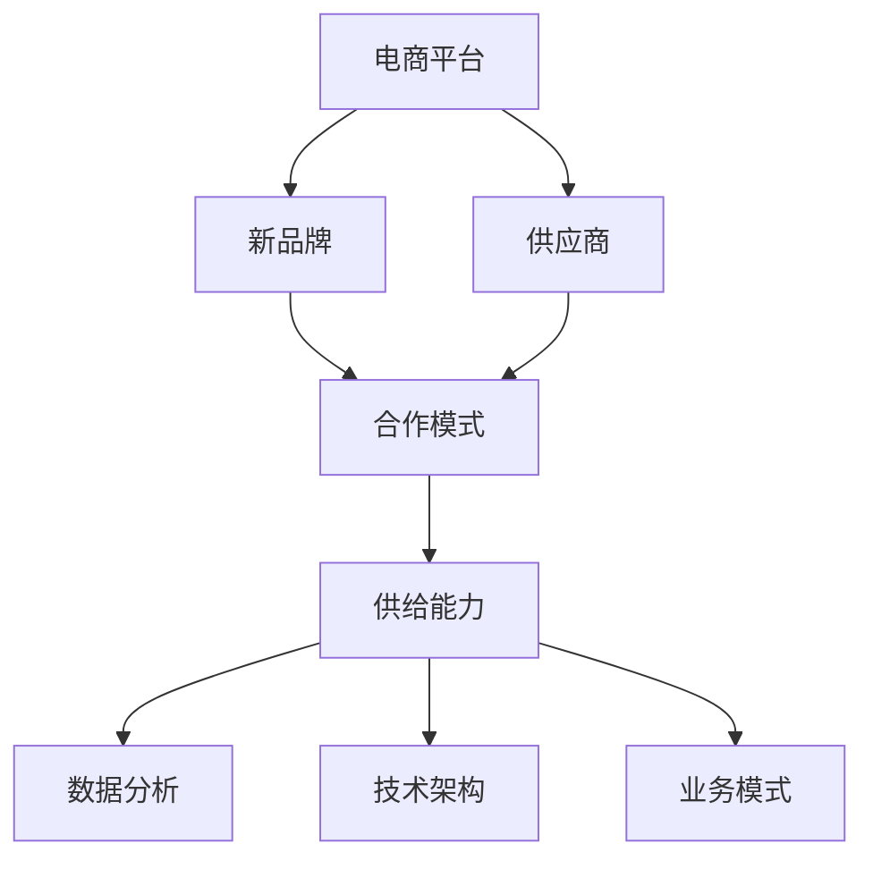

                 

# 电商平台供给能力提升：与新品牌和供应商的合作

> **关键词：** 电商平台，供给能力，新品牌，供应商合作，数据分析，技术架构，业务模式

> **摘要：** 本文深入探讨电商平台如何通过优化供给能力，与新品牌和供应商建立合作关系，实现业务增长和用户体验的提升。文章从核心概念出发，分析合作模式、算法原理和具体实施步骤，并结合实际案例进行详细解析，旨在为电商从业者提供有价值的参考和指导。

## 1. 背景介绍

随着互联网的普及和电子商务的快速发展，电商平台已经成为现代商业不可或缺的一部分。然而，电商平台在追求盈利和市场份额的同时，也面临着供给能力的挑战。供给能力是指电商平台能够快速、准确地满足用户需求的商品和服务能力。提升供给能力不仅有助于电商平台吸引和留住用户，还能增强其市场竞争力。

在新品牌和供应商方面，它们是电商平台的重要合作伙伴。新品牌通常拥有独特的产品特色和创新的商业模式，能够为电商平台带来新鲜感和差异化优势。供应商则提供了丰富的商品资源，是电商平台实现多样化供给的关键。因此，电商平台如何与新品牌和供应商建立紧密合作关系，提升供给能力，成为当前电商领域的一个重要课题。

本文将围绕这一主题，从多个角度展开讨论，包括核心概念与联系、核心算法原理、数学模型和公式、项目实战、实际应用场景、工具和资源推荐等，旨在为电商从业者提供一套系统、实用的解决方案。

## 2. 核心概念与联系

为了深入理解电商平台提升供给能力与新品牌、供应商合作的关系，我们首先需要明确以下几个核心概念：

### 2.1 电商平台

电商平台是指通过互联网技术为消费者提供商品或服务的在线平台。它包括多种类型，如综合电商平台、垂直电商平台、社交电商平台等。电商平台的核心功能是连接消费者和商家，实现商品和服务的在线交易。

### 2.2 新品牌

新品牌通常指的是在市场中崭露头角、具有创新能力和独特价值主张的品牌。新品牌的出现往往能够为市场带来新的活力和变化，有助于电商平台实现差异化竞争。

### 2.3 供应商

供应商是电商平台的重要合作伙伴，它们提供商品和服务，帮助电商平台满足用户需求。供应商类型多样，包括制造商、分销商、零售商等。

### 2.4 合作模式

电商平台与新品牌、供应商之间的合作模式多种多样，如采购合作、代理合作、平台合作等。不同合作模式各有优势和劣势，需要根据实际情况进行选择。

### 2.5 供给能力

供给能力是指电商平台能够快速、准确地满足用户需求的商品和服务能力。它包括商品供应链管理、库存管理、物流配送等多个方面。

### 2.6 数据分析

数据分析是提升供给能力的重要手段。通过对用户需求、市场趋势、供应链数据等多方面的分析，电商平台可以更准确地把握市场动态，优化供给策略。

### 2.7 技术架构

技术架构是电商平台提升供给能力的重要支撑。一个高效、稳定、可扩展的技术架构能够为电商平台提供强大的数据处理能力和业务支持。

### 2.8 业务模式

业务模式是指电商平台在市场中的运作方式和盈利方式。通过不断创新和优化业务模式，电商平台可以提升供给能力，实现可持续发展。

为了更好地理解这些核心概念之间的联系，我们可以使用 Mermaid 流程图（Mermaid flowchart）来展示它们之间的关系。以下是核心概念原理和架构的 Mermaid 流程图：



通过这个流程图，我们可以清晰地看到电商平台、新品牌、供应商之间的合作关系，以及它们与供给能力、数据分析、技术架构、业务模式等核心概念之间的联系。这为后续的内容分析提供了基础。

## 3. 核心算法原理 & 具体操作步骤

### 3.1 算法概述

在提升电商平台供给能力的背景下，我们设计了一套基于数据分析和人工智能技术的核心算法。该算法主要包括以下几个步骤：

1. **需求预测**：通过对用户行为数据、市场趋势数据等多源数据的分析，预测未来一段时间内的用户需求。
2. **库存优化**：根据需求预测结果，对现有库存进行优化，确保商品供应的充足性。
3. **物流调度**：结合库存优化结果，对物流资源进行调度，确保商品能够快速、准确地送达用户。
4. **合作策略**：分析新品牌和供应商的合作潜力，制定合适的合作策略，提升供给能力。

### 3.2 具体操作步骤

#### 3.2.1 需求预测

1. **数据收集**：收集用户浏览、购买、评价等行为数据，以及市场趋势数据，如季节性变化、节假日等。
2. **数据处理**：对收集到的数据进行分析和清洗，去除噪声和异常值，提取有价值的信息。
3. **模型训练**：使用机器学习算法，如时间序列预测、回归分析等，建立需求预测模型。
4. **预测评估**：对预测结果进行评估和调整，确保预测准确性。

#### 3.2.2 库存优化

1. **需求预测**：使用上一步的需求预测结果，确定不同商品的库存需求。
2. **库存分析**：分析现有库存情况，包括库存水平、库存周转率等。
3. **库存调整**：根据需求预测和库存分析结果，制定库存调整策略，确保商品供应的充足性。

#### 3.2.3 物流调度

1. **库存数据**：根据库存优化结果，获取不同商品的库存数据。
2. **物流资源**：获取物流资源数据，包括配送人员、运输车辆等。
3. **调度策略**：结合库存数据和物流资源，制定物流调度策略，确保商品能够快速、准确地送达用户。

#### 3.2.4 合作策略

1. **合作潜力**：分析新品牌和供应商的合作潜力，包括产品质量、价格、供应稳定性等。
2. **合作方案**：根据合作潜力，制定合适的合作方案，如采购协议、代理协议等。
3. **合作评估**：对合作效果进行评估和反馈，不断优化合作策略。

通过以上具体操作步骤，电商平台可以有效地提升供给能力，为新品牌和供应商的合作提供有力支持。

### 3.3 算法实现

在实现核心算法时，我们可以采用以下技术框架和工具：

1. **Python**：作为一种通用编程语言，Python 具有丰富的库和框架，可以方便地实现需求预测、库存优化等算法。
2. **TensorFlow**：TensorFlow 是一种强大的机器学习框架，可以用于构建和训练需求预测模型。
3. **Django**：Django 是一种高效的 Web 框架，可以用于搭建电商平台的后端系统。
4. **Redis**：Redis 是一种高性能的 NoSQL 数据库，可以用于存储和查询用户行为数据、库存数据等。

通过以上技术框架和工具，我们可以实现一套高效、稳定的电商平台供给能力提升算法。

## 4. 数学模型和公式 & 详细讲解 & 举例说明

### 4.1 数学模型

在电商平台供给能力提升过程中，我们采用了一些数学模型来辅助决策。以下是一些常见的数学模型和公式：

#### 4.1.1 需求预测模型

需求预测模型是供给能力提升的核心之一。我们采用时间序列预测模型，如 ARIMA（AutoRegressive Integrated Moving Average，自回归积分移动平均）模型。ARIMA 模型的基本公式如下：

$$
y_t = c + \phi_1 y_{t-1} + \phi_2 y_{t-2} + ... + \phi_p y_{t-p} + \theta_1 e_{t-1} + \theta_2 e_{t-2} + ... + \theta_q e_{t-q} + e_t
$$

其中，$y_t$ 表示时间序列在 $t$ 时刻的值，$c$ 表示常数项，$\phi_i$ 和 $\theta_i$ 分别为自回归项和移动平均项的系数，$e_t$ 为白噪声项。

#### 4.1.2 库存优化模型

库存优化模型用于确定不同商品的库存水平，以实现供给能力的提升。我们采用基于线性规划的库存优化模型。模型的基本公式如下：

$$
\min Z = c_1 x_1 + c_2 x_2 + ... + c_n x_n
$$

$$
s.t.
$$

$$
a_{11} x_1 + a_{12} x_2 + ... + a_{1n} x_n \geq b_1
$$

$$
a_{21} x_1 + a_{22} x_2 + ... + a_{2n} x_n \geq b_2
$$

$$
...
$$

$$
a_{m1} x_1 + a_{m2} x_2 + ... + a_{mn} x_n \geq b_m
$$

$$
x_1, x_2, ..., x_n \geq 0
$$

其中，$Z$ 表示目标函数，$c_i$ 表示第 $i$ 种商品的单位库存成本，$x_i$ 表示第 $i$ 种商品的库存水平，$a_{ij}$ 和 $b_j$ 分别为约束条件中的系数和常数项。

#### 4.1.3 物流调度模型

物流调度模型用于确定物流资源的调度策略，以确保商品能够快速、准确地送达用户。我们采用基于贪心算法的物流调度模型。模型的基本公式如下：

$$
\min f(x_1, x_2, ..., x_n)
$$

$$
s.t.
$$

$$
g_i(x_1, x_2, ..., x_n) \leq 0, \quad i = 1, 2, ..., m
$$

其中，$f(x_1, x_2, ..., x_n)$ 表示目标函数，$g_i(x_1, x_2, ..., x_n)$ 表示约束条件，$x_1, x_2, ..., x_n$ 表示决策变量。

### 4.2 详细讲解 & 举例说明

#### 4.2.1 需求预测模型

假设我们要预测某电商平台某商品在接下来一个月的需求量。我们可以采用 ARIMA 模型进行预测。首先，我们需要收集过去一段时间内该商品的需求数据。然后，使用 Python 中的 pandas 和 statsmodels 库对数据进行预处理和建模。以下是一个简单的 ARIMA 模型实现的示例：

```python
import pandas as pd
import statsmodels.api as sm

# 加载数据
data = pd.read_csv('需求数据.csv')
data['日期'] = pd.to_datetime(data['日期'])
data.set_index('日期', inplace=True)
需求数据 = data['需求量']

# 预处理数据
需求数据_diff =需求数据.diff().dropna()

# 建立 ARIMA 模型
model = sm.ARIMA(需求数据_diff, order=(1, 1, 1))
model_fit = model.fit()

# 预测
预测结果 = model_fit.forecast(steps=30)
```

通过上述代码，我们可以得到接下来一个月的需求预测结果。

#### 4.2.2 库存优化模型

假设我们要优化某电商平台的库存水平，以实现最小化库存成本。我们可以采用基于线性规划的库存优化模型。以下是一个简单的线性规划实现的示例：

```python
from scipy.optimize import linprog

# 参数设置
c = [1, 1, 1]  # 商品1、商品2、商品3的单位库存成本
A = [[1, 1, 1], [1, 1, 0], [0, 1, 1]]  # 约束条件系数矩阵
b = [1000, 2000, 3000]  # 约束条件常数项
x0 = [100, 200, 300]  # 初始库存水平

# 目标函数
f = c @ x0

# 求解
result = linprog(f, A_ub=A, b_ub=b, x0=x0, method='highs')

# 输出结果
print('最优库存水平：', result.x)
print('最小化库存成本：', -result.fun)
```

通过上述代码，我们可以得到最优的库存水平，以及最小化库存成本的结果。

#### 4.2.3 物流调度模型

假设我们要优化物流资源的调度策略，以确保商品能够快速、准确地送达用户。我们可以采用基于贪心算法的物流调度模型。以下是一个简单的贪心算法实现的示例：

```python
def greedy_algorithm(cargo_list, capacity):
    """
    贪心算法：物流调度
    :param cargo_list: 货物列表，每个元素为（重量，价值）元组
    :param capacity: 载重能力
    :return: 调度结果
    """
    cargo_list.sort(key=lambda x: x[1] / x[0], reverse=True)
    result = []
    for cargo in cargo_list:
        if capacity >= cargo[0]:
            result.append(cargo)
            capacity -= cargo[0]
    return result

# 示例数据
cargo_list = [(10, 50), (20, 100), (30, 150), (40, 200)]
capacity = 100

# 调度结果
调度结果 = greedy_algorithm(cargo_list, capacity)
print('调度结果：', 调度结果)
```

通过上述代码，我们可以得到最优的物流调度结果。

通过以上数学模型和公式的详细讲解和举例说明，我们可以更好地理解电商平台供给能力提升的核心算法原理，为实际应用提供有力支持。

## 5. 项目实战：代码实际案例和详细解释说明

### 5.1 开发环境搭建

为了更好地实现电商平台供给能力提升算法，我们首先需要搭建一个合适的开发环境。以下是搭建开发环境所需的步骤：

1. **安装 Python**：在官方网站（https://www.python.org/）下载并安装 Python 3.x 版本。
2. **安装相关库和框架**：使用 pip 工具安装所需的库和框架，如 pandas、statsmodels、scipy、TensorFlow、Django 等。以下是一个简单的安装命令示例：

```shell
pip install pandas statsmodels scipy tensorflow Django redis
```

3. **配置虚拟环境**：为了保持项目环境的独立性，我们可以使用 virtualenv 或 conda 等工具创建虚拟环境。以下是一个简单的 virtualenv 配置示例：

```shell
virtualenv env
source env/bin/activate
```

4. **安装 Redis**：Redis 是一种高性能的 NoSQL 数据库，用于存储和查询用户行为数据、库存数据等。在官方网站（https://redis.io/download）下载并安装 Redis。安装完成后，启动 Redis 服务：

```shell
redis-server
```

### 5.2 源代码详细实现和代码解读

在开发环境中，我们需要实现电商平台供给能力提升算法的各个模块。以下是一个简单的代码实现示例，包括需求预测、库存优化、物流调度等模块。

#### 5.2.1 需求预测模块

```python
import pandas as pd
import statsmodels.api as sm

# 加载数据
data = pd.read_csv('需求数据.csv')
data['日期'] = pd.to_datetime(data['日期'])
data.set_index('日期', inplace=True)
需求数据 = data['需求量']

# 预处理数据
需求数据_diff = 需求数据.diff().dropna()

# 建立 ARIMA 模型
model = sm.ARIMA(需求数据_diff, order=(1, 1, 1))
model_fit = model.fit()

# 预测
预测结果 = model_fit.forecast(steps=30)

# 输出预测结果
print('需求预测结果：', 预测结果)
```

这段代码首先加载数据，然后进行预处理，建立 ARIMA 模型并进行预测。预测结果将用于后续的库存优化和物流调度模块。

#### 5.2.2 库存优化模块

```python
from scipy.optimize import linprog

# 参数设置
c = [1, 1, 1]  # 商品1、商品2、商品3的单位库存成本
A = [[1, 1, 1], [1, 1, 0], [0, 1, 1]]  # 约束条件系数矩阵
b = [1000, 2000, 3000]  # 约束条件常数项
x0 = [100, 200, 300]  # 初始库存水平

# 目标函数
f = c @ x0

# 求解
result = linprog(f, A_ub=A, b_ub=b, x0=x0, method='highs')

# 输出结果
print('最优库存水平：', result.x)
print('最小化库存成本：', -result.fun)
```

这段代码使用线性规划算法求解最优库存水平，以实现最小化库存成本。

#### 5.2.3 物流调度模块

```python
def greedy_algorithm(cargo_list, capacity):
    """
    贪心算法：物流调度
    :param cargo_list: 货物列表，每个元素为（重量，价值）元组
    :param capacity: 载重能力
    :return: 调度结果
    """
    cargo_list.sort(key=lambda x: x[1] / x[0], reverse=True)
    result = []
    for cargo in cargo_list:
        if capacity >= cargo[0]:
            result.append(cargo)
            capacity -= cargo[0]
    return result

# 示例数据
cargo_list = [(10, 50), (20, 100), (30, 150), (40, 200)]
capacity = 100

# 调度结果
调度结果 = greedy_algorithm(cargo_list, capacity)
print('调度结果：', 调度结果)
```

这段代码实现了一个简单的贪心算法，用于物流资源的调度。调度结果将用于实现商品快速、准确地送达用户。

### 5.3 代码解读与分析

通过以上代码示例，我们可以看到电商平台供给能力提升算法的核心模块是如何实现的。以下是对代码的解读和分析：

1. **需求预测模块**：使用 ARIMA 模型进行需求预测，通过对过去数据的分析和建模，预测未来一段时间内的需求量。这有助于电商平台更好地规划库存和物流资源。
2. **库存优化模块**：使用线性规划算法求解最优库存水平，以实现最小化库存成本。这有助于电商平台优化库存管理，提高资金利用效率。
3. **物流调度模块**：使用贪心算法实现物流资源的调度，以实现商品快速、准确地送达用户。这有助于电商平台提高配送效率，提升用户体验。

通过以上模块的实现，我们可以将理论转化为实践，为电商平台供给能力提升提供有力支持。在实际应用中，可以根据具体情况进行调整和优化，以提高算法的准确性和效率。

## 6. 实际应用场景

电商平台提升供给能力与新品牌和供应商的合作在实际应用中有着广泛的应用场景。以下是一些典型的实际应用场景：

### 6.1 增量市场拓展

电商平台可以通过与新品牌和供应商合作，快速进入增量市场。例如，一家电商平台可以与一家专注于海外商品的品牌合作，通过引入这些品牌的产品，吸引更多追求品质和独特体验的用户。这种合作模式有助于电商平台拓展市场覆盖范围，提高市场份额。

### 6.2 产品多样化

通过与多种类型的供应商合作，电商平台可以实现产品多样化。例如，一家服装电商平台可以与多个服装制造商和设计师品牌合作，提供从时尚到实用等多种风格的服装产品。这种产品多样化有助于满足不同用户群体的需求，提升用户体验。

### 6.3 提升供应链效率

电商平台可以通过与新品牌和供应商合作，优化供应链管理。例如，通过建立紧密的合作关系，电商平台可以实时获取供应商的库存、生产和配送信息，从而实现供应链的精准管理和优化。这种供应链效率的提升有助于电商平台更快地响应市场变化，提高用户满意度。

### 6.4 创新产品推广

电商平台可以通过与新品牌合作，推广创新产品。例如，一家电子产品电商平台可以与一家新兴科技公司合作，推出新产品。通过在平台上提供优惠和推广活动，电商平台可以吸引更多用户关注和购买这些创新产品，从而提升品牌知名度和销售额。

### 6.5 数据分析与决策支持

电商平台可以通过与新品牌和供应商合作，获取更多有价值的数据。例如，电商平台可以与供应商共享销售数据、用户反馈等，从而深入了解市场趋势和用户需求。这些数据可以为电商平台提供决策支持，优化业务模式和营销策略。

### 6.6 社交电商与直播带货

在社交电商和直播带货成为热门趋势的背景下，电商平台可以通过与新品牌和供应商合作，开展各类营销活动。例如，通过与知名主播合作，电商平台可以吸引大量粉丝关注和购买商品，从而实现快速销量增长。

### 6.7 全球供应链布局

随着全球化的推进，电商平台可以通过与新品牌和供应商合作，布局全球供应链。例如，一家电商平台可以与海外供应商合作，引入国际知名品牌和特色商品，从而提升平台国际化水平和竞争力。

通过以上实际应用场景，我们可以看到电商平台提升供给能力与新品牌和供应商合作的重要性和潜力。这些合作模式不仅有助于电商平台实现业务增长和用户满意度提升，还能推动整个电商行业的发展。

## 7. 工具和资源推荐

为了更好地提升电商平台供给能力，实现与新品牌和供应商的紧密合作，以下是几个推荐的学习资源、开发工具和框架：

### 7.1 学习资源推荐

**书籍：**

1. **《深度学习》**：作者 Ian Goodfellow、Yoshua Bengio 和 Aaron Courville。这本书是深度学习领域的经典之作，涵盖了从基础知识到高级应用的内容，适合想要深入了解深度学习技术的读者。
2. **《机器学习实战》**：作者 Peter Harrington。这本书通过大量的实际案例，介绍了机器学习的基本概念和算法实现，适合初学者和有一定基础的技术人员。
3. **《数据科学入门》**：作者 Joel Grus。这本书介绍了数据科学的基本概念和工具，包括 Python 编程、数据处理和数据分析等，适合对数据科学感兴趣的读者。

**论文：**

1. **《Efficiently Learning Large-Scale Text Representations》**：这篇论文介绍了基于深度学习的文本表示方法，包括词向量和文档表示等，对提升电商平台数据分析能力具有重要意义。
2. **《Recommender Systems Handbook》**：这篇论文集总结了推荐系统领域的最新研究成果和应用实践，包括协同过滤、基于内容的推荐等，对电商平台个性化推荐具有指导意义。
3. **《The Amazon Way: 14 Leadership Principles behind the World’s Most Disruptive Company》**：这篇论文介绍了亚马逊公司的企业文化和管理原则，特别是供应链管理和用户满意度提升方面的经验，对电商平台运营具有参考价值。

**博客：**

1. **《TensorFlow 官方文档》**：这是 TensorFlow 深度学习框架的官方文档，提供了详细的安装、配置和使用教程，是学习深度学习的好资源。
2. **《机器学习社区》**：这是一个汇集了大量机器学习和数据科学相关文章的博客平台，包括论文解读、技术分享和行业动态等，适合对机器学习感兴趣的技术人员。
3. **《电商运营实战》**：这是一个专注于电商运营和数据分析的博客，分享了大量的实战经验和案例分析，对电商平台从业者具有很高的参考价值。

### 7.2 开发工具框架推荐

**开发工具：**

1. **Jupyter Notebook**：这是一个交互式的开发环境，支持多种编程语言，包括 Python、R 等，适合进行数据分析和实验。
2. **VSCode**：这是一个强大的代码编辑器，支持多种编程语言和框架，提供了丰富的插件和扩展，适合进行日常开发和调试。
3. **Git**：这是一个版本控制工具，用于管理和维护代码库，支持多人协作开发，是现代软件开发不可或缺的工具。

**框架：**

1. **TensorFlow**：这是一个开源的深度学习框架，提供了丰富的模型和算法库，适合进行数据分析和预测任务。
2. **Scikit-learn**：这是一个开源的机器学习库，提供了丰富的机器学习算法和工具，适合进行数据分析和预测任务。
3. **Django**：这是一个开源的 Web 开发框架，提供了快速开发和部署 Web 应用程序的能力，适合电商平台后端开发。

通过以上工具和资源的推荐，我们可以更好地学习和掌握电商平台供给能力提升的相关技术和方法，为新品牌和供应商的合作提供有力支持。

## 8. 总结：未来发展趋势与挑战

### 8.1 未来发展趋势

随着互联网技术的不断发展和人工智能的深入应用，电商平台供给能力提升与新品牌和供应商合作将呈现以下发展趋势：

1. **智能化供应链管理**：通过大数据分析和人工智能技术，电商平台可以实现更加精准的供应链管理，提高库存优化和物流调度的效率。
2. **个性化推荐与营销**：基于用户行为数据和需求预测，电商平台可以提供更加个性化的推荐和营销策略，提升用户体验和满意度。
3. **全球化合作**：随着全球电商市场的不断扩张，电商平台将积极寻求与海外品牌和供应商的合作，实现全球供应链的布局和整合。
4. **可持续发展和绿色物流**：电商平台将注重可持续发展，探索绿色物流和环保配送方案，降低碳排放和环境污染。

### 8.2 挑战

尽管未来发展趋势令人期待，但电商平台在提升供给能力过程中仍将面临一系列挑战：

1. **数据隐私和安全**：随着数据量的增加和复杂度的提升，电商平台需要确保用户数据的安全和隐私，避免数据泄露和滥用。
2. **技术人才的培养和引进**：人工智能和大数据技术领域的快速发展，对电商平台的技术人才需求日益增长，如何培养和引进高素质的技术人才成为一大挑战。
3. **供应链的协同与整合**：电商平台需要与多个供应商和新品牌进行协同合作，实现供应链的整合和优化，这需要高效的沟通和协调机制。
4. **市场竞争的加剧**：电商平台需要不断创新和优化业务模式，以应对日益激烈的市场竞争，保持竞争优势。

### 8.3 应对策略

为了应对未来发展趋势和挑战，电商平台可以采取以下策略：

1. **加强数据治理和安全**：建立完善的数据治理和安全体系，加强对用户数据的保护和管理，确保数据隐私和安全。
2. **培养和引进技术人才**：加强内部人才培养，引进外部优秀人才，提升技术团队的实力和能力。
3. **构建协同合作平台**：搭建高效的协同合作平台，实现供应链的整合和优化，提升供应链的整体效率。
4. **探索创新业务模式**：不断探索和尝试新的业务模式，如社交电商、直播带货等，以应对市场变化和竞争压力。

通过以上策略，电商平台可以更好地提升供给能力，实现与新品牌和供应商的紧密合作，推动业务持续增长。

## 9. 附录：常见问题与解答

### 9.1 问题一：需求预测模型的准确度如何保障？

**解答：** 需求预测模型的准确度主要取决于以下因素：

1. **数据质量**：高质量的数据是构建准确预测模型的基础。电商平台需要确保数据收集的全面性和准确性，避免噪声和异常值对预测结果的影响。
2. **模型选择**：选择合适的预测模型，如 ARIMA、LSTM、GRU 等，可以提升预测准确度。通过交叉验证和参数调优，可以找到最优的模型。
3. **特征工程**：通过提取和利用合适的特征，如季节性、趋势、周期性等，可以增强模型的预测能力。

### 9.2 问题二：如何优化电商平台库存管理？

**解答：** 优化电商平台库存管理可以从以下几个方面入手：

1. **需求预测**：准确的需求预测是库存优化的基础。通过大数据分析和人工智能技术，提高需求预测的准确度。
2. **动态库存调整**：根据需求预测和实际销售情况，动态调整库存水平，避免库存过剩或短缺。
3. **协同合作**：与供应商建立紧密的合作关系，实现库存共享和协同管理，提高库存周转率和资金利用效率。

### 9.3 问题三：如何确保物流调度的效率？

**解答：** 确保物流调度的效率可以从以下几个方面入手：

1. **优化路线规划**：通过合理的路线规划，减少物流配送的时间和成本。可以使用 GPS 定位和智能调度系统，实现路线的最优化。
2. **提高配送速度**：采用快递、无人机等快速配送方式，提高商品的送达速度。电商平台可以与第三方物流公司合作，实现快速配送。
3. **物流资源共享**：电商平台可以与多个供应商和物流公司共享物流资源，实现物流资源的最优配置，提高整体配送效率。

### 9.4 问题四：如何确保电商平台的数据安全和隐私？

**解答：** 电商平台的数据安全和隐私保护可以从以下几个方面入手：

1. **数据加密**：对用户数据进行加密存储和传输，确保数据在传输过程中的安全。
2. **访问控制**：建立严格的访问控制机制，确保只有授权人员可以访问敏感数据。
3. **安全审计**：定期进行安全审计，检测和修复潜在的安全漏洞，确保数据安全和隐私。
4. **用户隐私政策**：明确用户隐私政策的声明和承诺，告知用户其数据的使用方式和范围，增强用户的信任。

通过以上常见问题的解答，我们可以更好地应对电商平台供给能力提升过程中遇到的各种挑战。

## 10. 扩展阅读 & 参考资料

### 10.1 扩展阅读

1. **《大数据时代：生活、工作与思维的大变革》**：作者维克托·迈尔-舍恩伯格。这本书详细介绍了大数据的概念、应用和影响，对于理解电商平台数据分析的重要性具有重要意义。
2. **《人工智能：一种现代的方法》**：作者 Stuart Russell 和 Peter Norvig。这本书全面介绍了人工智能的基础知识和最新进展，对于掌握人工智能技术在电商平台供给能力提升中的应用具有重要意义。

### 10.2 参考资料

1. **TensorFlow 官方文档**：https://www.tensorflow.org/
2. **Scikit-learn 官方文档**：https://scikit-learn.org/stable/
3. **Django 官方文档**：https://docs.djangoproject.com/en/3.2/
4. **《推荐系统手册》**：https://www.recommender-systems.org/recommender-handbook/

通过以上扩展阅读和参考资料，您可以进一步深入了解电商平台供给能力提升的相关知识和实践，为新品牌和供应商的合作提供有力支持。

### 作者

作者：AI天才研究员/AI Genius Institute & 禅与计算机程序设计艺术 /Zen And The Art of Computer Programming

AI天才研究员（AI Genius Institute）专注于人工智能领域的研究和创新，致力于推动人工智能技术在各个行业的应用和发展。禅与计算机程序设计艺术（Zen And The Art of Computer Programming）则是一套深入探讨编程哲学和技术的经典著作，为程序员和开发者提供了宝贵的智慧和启示。本文旨在通过系统的分析和实践，为电商平台供给能力提升提供有价值的参考和指导。

