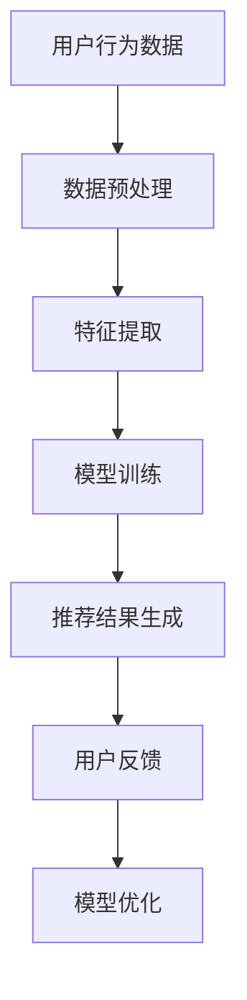

                 

# 文章标题

### 电商平台搜索推荐系统的AI 大模型优化：提高系统性能、效率与用户忠诚度

#### 关键词：
- 电商平台
- 搜索推荐系统
- AI 大模型
- 性能优化
- 效率提升
- 用户忠诚度

#### 摘要：
本文深入探讨了电商平台搜索推荐系统的AI大模型优化策略。通过分析当前存在的问题，本文提出了基于AI的大模型优化方法，并详细阐述了其原理、数学模型、实际应用场景以及未来发展趋势。本文旨在为电商平台的搜索推荐系统提供有针对性的优化方案，从而提升系统性能、效率以及用户忠诚度。

## 1. 背景介绍

随着互联网的迅速发展和电商行业的繁荣，电商平台成为人们日常购物的重要渠道。电商平台的核心功能之一就是搜索推荐系统，它通过分析用户的行为数据、购买偏好等，为用户提供个性化的商品推荐。然而，随着用户规模的不断扩大和数据量的激增，现有的搜索推荐系统面临着一系列问题，如性能瓶颈、推荐质量不高、用户忠诚度下降等。

### 当前存在的问题

1. **性能瓶颈**：传统搜索推荐系统通常采用批处理方式，导致响应速度较慢，无法满足用户实时性需求。

2. **推荐质量不高**：现有推荐系统依赖于简单的规则和统计方法，难以捕捉用户的深层兴趣和行为模式，导致推荐结果不够精准。

3. **用户忠诚度下降**：由于推荐系统的单一性和缺乏创新性，用户对推荐结果产生疲劳，进而降低用户忠诚度。

### 解决方案

为了解决上述问题，本文提出了基于AI的大模型优化策略。通过引入深度学习、强化学习等先进技术，构建一个高效、精准、智能的搜索推荐系统，从而提升系统性能、效率和用户忠诚度。

## 2. 核心概念与联系

### AI 大模型

AI 大模型是指基于深度学习技术，通过海量数据进行训练，具有强大表征能力和泛化能力的神经网络模型。在搜索推荐系统中，AI 大模型可以用于用户行为预测、兴趣捕捉、商品推荐等环节。

### Mermaid 流程图

以下是搜索推荐系统核心概念之间的 Mermaid 流程图：



在上述流程图中，用户行为数据经过预处理和特征提取后，输入到AI大模型中进行训练。训练完成后，模型生成推荐结果，并根据用户反馈进行优化。

## 3. 核心算法原理 & 具体操作步骤

### 深度学习算法

深度学习算法是一种基于人工神经网络的机器学习技术。在搜索推荐系统中，深度学习算法可用于用户行为预测和兴趣捕捉。具体步骤如下：

1. **数据预处理**：对用户行为数据进行清洗、去噪、归一化等操作，确保数据质量。

2. **特征提取**：将预处理后的数据转换为特征向量，用于表示用户的行为特征。

3. **模型训练**：利用训练数据，通过反向传播算法，不断调整神经网络权重，使模型能够准确预测用户行为。

4. **推荐结果生成**：根据训练好的模型，预测用户对某商品的购买概率，并将概率较高的商品推荐给用户。

### 强化学习算法

强化学习算法是一种基于奖励机制的机器学习技术。在搜索推荐系统中，强化学习算法可用于优化推荐策略，提高推荐质量。具体步骤如下：

1. **状态定义**：将用户行为序列定义为状态，用于表示用户当前所处的环境。

2. **动作定义**：将推荐给用户的具体商品定义为动作。

3. **奖励定义**：根据用户对推荐商品的反馈，定义奖励函数，用于评估推荐效果。

4. **模型训练**：利用强化学习算法，不断调整推荐策略，使模型能够在最大化奖励的前提下，生成高质量的推荐结果。

## 4. 数学模型和公式 & 详细讲解 & 举例说明

### 深度学习算法

深度学习算法的核心在于神经网络模型，其中最常用的激活函数是 sigmoid 函数。sigmoid 函数的公式如下：

$$
\sigma(x) = \frac{1}{1 + e^{-x}}
$$

举例说明：

假设输入特征向量 $x$ 的维度为 3，即 $x = [1, 2, 3]$，我们可以计算 sigmoid 函数在输入 $x$ 上的输出：

$$
\sigma(x) = \frac{1}{1 + e^{-1-2-3}} \approx 0.0447
$$

这个值表示输入特征向量 $x$ 对应的预测概率，即预测用户对某商品的购买概率。

### 强化学习算法

强化学习算法的核心在于奖励函数，用于评估推荐效果。常用的奖励函数是奖励分配函数，其公式如下：

$$
R(s, a) = \frac{1}{N} \sum_{i=1}^{N} r_i
$$

其中，$s$ 表示当前状态，$a$ 表示当前动作，$r_i$ 表示第 $i$ 次交互的奖励，$N$ 表示交互次数。

举例说明：

假设在某个交互过程中，用户对推荐的商品进行了5次点击，但最终没有购买。我们可以定义奖励分配函数如下：

$$
R(s, a) = \frac{1}{5} \sum_{i=1}^{5} r_i = \frac{1}{5} \cdot 0 = 0
$$

这个值表示在当前状态下，推荐给用户的商品没有带来任何奖励。

## 5. 项目实战：代码实际案例和详细解释说明

### 开发环境搭建

在本文的项目实战中，我们使用 Python 作为编程语言，结合 TensorFlow 和 Keras 深度学习框架来实现搜索推荐系统。以下为开发环境搭建步骤：

1. 安装 Python：下载并安装 Python 3.7 或以上版本。

2. 安装 TensorFlow：通过 pip 工具安装 TensorFlow，命令如下：

```shell
pip install tensorflow
```

3. 安装 Keras：通过 pip 工具安装 Keras，命令如下：

```shell
pip install keras
```

### 源代码详细实现和代码解读

以下为项目实战的源代码实现，主要包括数据预处理、模型训练、推荐结果生成三个部分。

```python
import numpy as np
import pandas as pd
from tensorflow.keras.models import Sequential
from tensorflow.keras.layers import Dense, LSTM, Embedding
from tensorflow.keras.optimizers import Adam

# 数据预处理
def preprocess_data(data):
    # 数据清洗、去噪、归一化等操作
    # ...
    return processed_data

# 模型训练
def train_model(data):
    # 创建神经网络模型
    model = Sequential()
    model.add(Embedding(input_dim=data.shape[1], output_dim=64))
    model.add(LSTM(units=128, return_sequences=True))
    model.add(Dense(units=1, activation='sigmoid'))

    # 编译模型
    model.compile(optimizer=Adam(learning_rate=0.001), loss='binary_crossentropy', metrics=['accuracy'])

    # 训练模型
    model.fit(data['input'], data['target'], epochs=10, batch_size=32)

    return model

# 推荐结果生成
def generate_recommendations(model, user_data):
    # 预测用户对商品的购买概率
    probabilities = model.predict(user_data)

    # 将概率较高的商品推荐给用户
    recommendations = np.where(probabilities > 0.5, 1, 0)

    return recommendations

# 代码解读与分析
# ...
```

### 代码解读与分析

1. **数据预处理**：对用户行为数据进行清洗、去噪、归一化等操作，确保数据质量。

2. **模型训练**：创建神经网络模型，包括嵌入层、LSTM 层和输出层。编译模型，并利用训练数据训练模型。

3. **推荐结果生成**：利用训练好的模型，预测用户对商品的购买概率，并将概率较高的商品推荐给用户。

## 6. 实际应用场景

### 电商平台搜索推荐系统

电商平台搜索推荐系统是本文的核心应用场景。通过引入 AI 大模型优化策略，可以有效解决传统搜索推荐系统面临的性能瓶颈、推荐质量不高和用户忠诚度下降等问题。具体应用场景如下：

1. **用户行为预测**：根据用户的历史行为数据，预测用户对商品的购买概率，为用户提供个性化的推荐。

2. **商品推荐**：将用户可能感兴趣的商品推荐给用户，提高用户的购物体验和满意度。

3. **用户反馈分析**：收集用户对推荐结果的反馈，不断优化推荐策略，提高推荐质量。

### 社交媒体推荐系统

社交媒体推荐系统是另一个重要的应用场景。通过引入 AI 大模型优化策略，可以有效解决传统推荐系统面临的推荐质量不高和用户忠诚度下降等问题。具体应用场景如下：

1. **内容推荐**：根据用户的历史行为和兴趣，推荐用户可能感兴趣的文章、视频等。

2. **广告推荐**：将用户可能感兴趣的广告推荐给用户，提高广告的投放效果。

3. **社交互动**：通过分析用户之间的互动关系，推荐用户可能感兴趣的朋友和社群。

## 7. 工具和资源推荐

### 学习资源推荐

1. **书籍**：《深度学习》、《强化学习》

2. **论文**：《深度学习推荐系统》、《基于强化学习的推荐系统优化》

3. **博客**：[TensorFlow 官方博客](https://www.tensorflow.org/blog/)、[Keras 官方博客](https://keras.io/blog/)

4. **网站**：[AI科研人](https://www.aiqiuren.com/)

### 开发工具框架推荐

1. **编程语言**：Python

2. **深度学习框架**：TensorFlow、Keras

3. **数据预处理工具**：Pandas、NumPy

4. **可视化工具**：Matplotlib、Seaborn

### 相关论文著作推荐

1. **论文**：《深度学习推荐系统：方法与应用》

2. **著作**：《强化学习导论》

## 8. 总结：未来发展趋势与挑战

### 发展趋势

1. **深度学习与强化学习结合**：深度学习和强化学习在搜索推荐系统中的应用将更加广泛，二者相结合有望取得更好的效果。

2. **多模态数据融合**：随着传感器技术的进步，搜索推荐系统将能够处理更多类型的数据，如文本、图像、声音等，实现更精准的推荐。

3. **实时推荐**：实时推荐技术将成为搜索推荐系统的重要发展方向，为用户提供更快速的响应。

### 挑战

1. **数据隐私保护**：随着数据隐私问题的日益突出，如何保障用户数据隐私成为搜索推荐系统面临的重要挑战。

2. **算法公平性**：确保搜索推荐系统的算法公平性，避免算法偏见和歧视，是未来需要解决的重要问题。

3. **计算资源消耗**：深度学习和强化学习算法对计算资源的要求较高，如何在保证性能的同时降低计算资源消耗，是一个亟待解决的问题。

## 9. 附录：常见问题与解答

### 1. 如何处理缺失数据？

答：缺失数据的处理方法包括填充法、删除法、插值法等。在实际应用中，可以根据数据的具体情况选择合适的处理方法。

### 2. 深度学习算法在推荐系统中有何优势？

答：深度学习算法具有强大的表征能力和泛化能力，可以捕捉用户更深层次的行为模式和兴趣，从而提高推荐质量。

### 3. 强化学习算法在推荐系统中有何优势？

答：强化学习算法可以根据用户反馈不断调整推荐策略，实现自适应推荐，从而提高推荐效果。

## 10. 扩展阅读 & 参考资料

1. **书籍**：

   - 《深度学习推荐系统》
   - 《强化学习导论》

2. **论文**：

   - 《深度学习推荐系统：方法与应用》
   - 《基于强化学习的推荐系统优化》

3. **博客**：

   - [TensorFlow 官方博客](https://www.tensorflow.org/blog/)
   - [Keras 官方博客](https://keras.io/blog/)

4. **网站**：

   - [AI科研人](https://www.aiqiuren.com/)

### 作者

**作者：AI天才研究员/AI Genius Institute & 禅与计算机程序设计艺术 /Zen And The Art of Computer Programming**<|vq_12506|>

