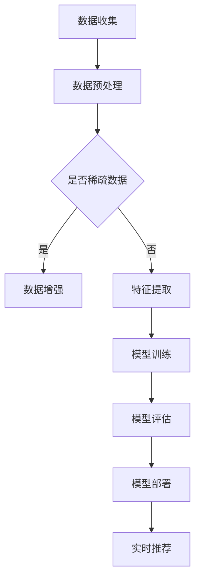

                 

### 背景介绍

#### 电商平台的搜索推荐系统重要性

在现代电商环境中，搜索推荐系统已经成为电商平台的核心组成部分。它们通过智能算法分析用户的搜索历史、浏览行为、购物偏好等数据，提供个性化的商品推荐，从而提升用户体验，提高销售额和客户忠诚度。

随着用户数据的爆炸性增长和电商平台的日益复杂化，传统的搜索推荐系统面临着巨大的挑战。为了满足用户日益增长的需求，现代搜索推荐系统需要具备更高的性能、更准确的推荐结果、更高的效率和多样性。

#### 当前搜索推荐系统面临的主要挑战

1. **性能瓶颈**：随着用户数据的指数级增长，传统的推荐系统可能无法在合理的时间内处理大规模数据，导致响应速度缓慢，用户体验下降。

2. **准确率问题**：虽然推荐系统能够提供一定程度的个性化推荐，但在海量数据和高维特征空间中，准确率往往难以满足用户期望。

3. **效率低下**：传统的推荐算法在处理复杂计算和迭代时，往往需要大量的计算资源和时间，导致系统整体效率低下。

4. **多样性不足**：用户希望每次推荐都能看到不同的、新颖的商品，而现有的推荐系统往往难以满足这一需求。

#### AI 大模型优化的重要性

为了解决上述问题，AI 大模型的引入成为了一项关键举措。大模型通过深度学习等技术，可以从海量数据中学习到更复杂的模式和关系，从而提升系统的性能、效率和准确性。此外，大模型还可以通过自适应调整和实时学习，提高推荐的多样性。

本文将详细探讨如何使用 AI 大模型对电商平台搜索推荐系统进行优化，包括核心算法原理、数学模型、实际应用案例等。通过本文的介绍，读者将了解到如何将 AI 大模型应用于电商搜索推荐系统，以及如何实现性能、效率、准确率和多样性的全面提升。

关键词：电商平台，搜索推荐系统，AI 大模型，性能优化，效率提升，准确率，多样性

摘要：本文旨在探讨如何通过 AI 大模型优化电商平台搜索推荐系统，提高系统的性能、效率、准确率和多样性。文章首先介绍了搜索推荐系统的重要性及其面临的主要挑战，然后详细阐述了 AI 大模型优化方案的核心算法原理、数学模型和实际应用案例。通过本文的介绍，读者可以了解到如何将 AI 大模型应用于电商搜索推荐系统，以实现系统的全面提升。

----------------------

## 1. 背景介绍

### 电商平台搜索推荐系统的发展历程

随着互联网技术的飞速发展和电子商务的兴起，搜索推荐系统逐渐成为电商平台的重要组成部分。早在2000年初，电商平台开始探索如何利用用户行为数据提升用户体验和销售额。最初的搜索推荐系统主要基于用户历史行为和简单的关联规则进行商品推荐，例如基于用户浏览和购买记录的协同过滤算法（Collaborative Filtering）。

协同过滤算法分为基于用户（User-Based）和基于物品（Item-Based）两种类型。基于用户的方法通过计算用户之间的相似度，找到与目标用户相似的其他用户，并推荐这些用户喜欢的商品；而基于物品的方法则是通过计算商品之间的相似度，找到与用户已购买或浏览的商品相似的其他商品进行推荐。尽管这些算法在一定程度上提升了推荐的准确性，但随着数据规模的增长和用户行为的复杂性增加，它们也逐渐暴露出一些局限性。

首先，协同过滤算法在处理高维稀疏数据时，容易出现“冷启动”问题，即新用户或新商品由于缺乏足够的历史数据，无法进行有效推荐。此外，这些算法依赖于用户行为数据，容易受到数据噪音的影响，导致推荐结果的不稳定。

为了解决这些局限性，电商行业开始探索更复杂的推荐算法，如基于内容的推荐（Content-Based Filtering）和混合推荐（Hybrid Recommendation）。基于内容的推荐方法通过分析商品的特征，如文本描述、标签、价格等，为用户推荐与其兴趣相关的商品。这种方法在一定程度上减少了“冷启动”问题，但同样存在内容表示和特征匹配的难题。

混合推荐方法结合了协同过滤和基于内容的推荐，通过融合多种数据源和算法，以提高推荐的准确性和多样性。然而，这些方法仍然需要处理大量的计算和存储资源，难以在大规模数据集上实现实时推荐。

### AI 大模型的崛起

近年来，随着深度学习和大数据技术的发展，AI 大模型（Large-scale AI Models）逐渐成为推荐系统领域的热点。AI 大模型，尤其是基于变换器（Transformer）架构的模型，如BERT（Bidirectional Encoder Representations from Transformers）、GPT（Generative Pre-trained Transformer）等，通过在大规模数据集上进行预训练，能够自动学习到复杂的数据模式和关系，从而在多个领域取得了显著的成果。

在电商搜索推荐系统中，AI 大模型的应用为解决传统推荐算法的局限性提供了新的思路。首先，大模型能够通过预训练阶段从海量数据中学习到丰富的知识，减少了人工特征工程的工作量。其次，大模型能够处理高维稀疏数据，有效缓解了“冷启动”问题。此外，大模型通过自适应调整和实时学习，能够提高推荐的多样性和准确性。

AI 大模型在推荐系统中的应用，不仅提升了系统的性能和效率，还为电商平台的个性化服务提供了新的可能性。随着技术的不断进步，AI 大模型有望在电商搜索推荐系统中发挥越来越重要的作用，推动电商平台迈向智能化和个性化服务的新阶段。

### 电商平台搜索推荐系统的现状与挑战

目前，电商平台搜索推荐系统已经成为电商业务的重要组成部分。这些系统通过多种算法和模型，为用户提供个性化的商品推荐，提高了用户满意度和平台销售额。然而，随着用户数据的不断增长和业务需求的多样化，现有的搜索推荐系统面临着一系列挑战。

首先，性能瓶颈问题日益突出。随着用户规模的扩大和数据量的增长，传统的推荐算法在大规模数据处理上显得力不从心。计算资源不足和响应速度缓慢，直接影响了用户的体验和平台的业务效率。为了满足用户对实时推荐的期望，平台需要不断优化算法和提升系统性能。

其次，准确率问题仍然是一个关键挑战。虽然现有的推荐算法能够在一定程度上满足用户的需求，但在面对复杂的用户行为和多样化的商品特征时，准确率往往难以达到用户期望。特别是在处理高维稀疏数据时，推荐结果容易出现偏差，导致用户流失和平台信任度下降。

此外，效率低下也是一个亟待解决的问题。传统的推荐算法通常需要进行多次迭代和复杂的计算，这不仅消耗了大量的计算资源，还影响了系统的响应速度。为了提升推荐效率，平台需要探索更高效、更智能的算法和模型。

最后，多样性不足问题逐渐凸显。用户希望每次推荐都能看到不同的、新颖的商品，而现有的推荐系统往往容易陷入“推荐循环”，无法提供足够丰富的推荐结果。这限制了用户的购物体验和平台的服务质量。

为了应对这些挑战，电商平台需要不断引入新的技术和方法，特别是 AI 大模型。通过深度学习和大数据技术，AI 大模型能够从海量数据中学习到复杂的数据模式和关系，从而提升系统的性能、准确率、效率和多样性。本文将详细探讨如何利用 AI 大模型优化电商平台搜索推荐系统，以应对当前的挑战和未来的需求。

----------------------

## 2. 核心概念与联系

### AI 大模型与推荐系统的基础概念

在深入探讨 AI 大模型如何优化电商平台搜索推荐系统之前，首先需要了解一些核心概念和其相互关系。以下是几个关键概念及其简要介绍：

#### 1. 深度学习（Deep Learning）

深度学习是一种基于人工神经网络（Artificial Neural Networks）的机器学习技术，它通过多层神经网络结构，自动从大量数据中学习特征和模式。深度学习在图像识别、语音识别、自然语言处理等领域取得了显著成果。

#### 2. 变换器（Transformer）

变换器是一种基于自注意力（Self-Attention）机制的深度学习模型，最早由 Vaswani 等（2017）在论文《Attention is All You Need》中提出。变换器在自然语言处理领域取得了突破性进展，并迅速被应用于各种任务，包括推荐系统。

#### 3. 自然语言处理（Natural Language Processing, NLP）

自然语言处理是计算机科学和人工智能领域的一个重要分支，旨在使计算机能够理解、处理和生成人类语言。NLP 技术在文本数据分析、情感分析、命名实体识别等方面有着广泛应用。

#### 4. 推荐系统（Recommendation System）

推荐系统是一种基于用户行为数据、内容特征和协同过滤等技术的系统，旨在为用户提供个性化的商品推荐。推荐系统广泛应用于电子商务、社交媒体、音乐和视频流媒体等领域。

#### 5. 人工智能大模型（Large-scale AI Models）

人工智能大模型是指通过在大规模数据集上进行预训练，能够自动学习到复杂数据和特征关系的深度学习模型。这些模型通常具有数十亿甚至千亿个参数，能够处理高维稀疏数据，并在各种任务中取得优异的性能。

### AI 大模型在推荐系统中的应用

AI 大模型在推荐系统中的应用主要包括以下几个方面：

#### 1. 预训练

预训练是 AI 大模型的核心步骤，通过在大规模数据集上进行训练，模型能够学习到丰富的语言模式和语义关系。在推荐系统中，预训练可以帮助模型更好地理解用户行为和商品特征，提高推荐的准确性。

#### 2. 自适应调整

AI 大模型可以根据实时用户数据和学习反馈，自适应调整模型参数和推荐策略。这种自适应调整能力使得推荐系统能够快速适应用户需求的动态变化，提高推荐的时效性和准确性。

#### 3. 多样性提升

通过引入多任务学习和数据增强等技术，AI 大模型能够生成多样化的推荐结果，避免陷入“推荐循环”，提高用户的购物体验。

#### 4. 处理高维稀疏数据

传统推荐系统在处理高维稀疏数据时，容易出现“冷启动”问题。AI 大模型通过预训练阶段的学习，能够有效缓解这一问题，提高新用户和新商品的推荐质量。

### Mermaid 流程图

为了更好地展示 AI 大模型在推荐系统中的应用过程，以下是一个使用 Mermaid 语言描述的流程图：



在这个流程图中，数据收集阶段收集用户行为数据和商品特征数据；数据预处理阶段对数据进行清洗和归一化处理；数据增强阶段针对高维稀疏数据进行扩充和生成；特征提取阶段提取用户和商品的关键特征；模型训练阶段使用预训练的 AI 大模型进行训练；模型评估阶段评估模型性能；模型部署阶段将训练好的模型部署到生产环境中；实时推荐阶段根据用户实时行为进行推荐。

通过上述流程，我们可以看到 AI 大模型在推荐系统中的应用是如何实现的。接下来，我们将进一步探讨 AI 大模型的核心算法原理、数学模型以及具体的应用案例。

----------------------

## 3. 核心算法原理 & 具体操作步骤

### AI 大模型的基本原理

AI 大模型的核心在于其深度学习架构，尤其是变换器（Transformer）架构。变换器通过自注意力机制（Self-Attention Mechanism）和多头注意力（Multi-Head Attention）机制，能够有效地处理序列数据，并学习到复杂的数据模式和关系。

#### 自注意力机制（Self-Attention）

自注意力机制是一种对输入序列中的每个元素进行加权的方法。具体来说，自注意力机制通过计算每个元素与其余所有元素之间的相似度，为每个元素分配不同的权重。这样，模型可以自动学习到序列中不同元素之间的关联性和重要性。

#### 多头注意力（Multi-Head Attention）

多头注意力是在自注意力机制的基础上，引入多个独立的注意力头（Attention Head）。每个注意力头可以学习到不同类型的关联性，如文本中的位置关系、语义关系等。通过多头注意力的组合，模型可以捕捉到更丰富的信息。

#### 前馈神经网络（Feedforward Neural Network）

在变换器架构中，每个自注意力层和多头注意力层之后，通常会接两个前馈神经网络（Feedforward Neural Network）。这些前馈神经网络通过简单的线性变换和非线性激活函数，进一步增强模型的表达能力。

### 具体操作步骤

以下是使用 AI 大模型优化电商平台搜索推荐系统的具体操作步骤：

#### 1. 数据收集与预处理

首先，从电商平台收集用户行为数据（如搜索历史、浏览记录、购买记录）和商品特征数据（如文本描述、标签、价格、分类等）。然后，对数据进行清洗和归一化处理，以消除噪音和异常值。

#### 2. 数据增强

对于高维稀疏数据，可以采用数据增强技术（如数据扩充、数据生成等），以增加数据量和多样性，缓解“冷启动”问题。

#### 3. 特征提取

通过自然语言处理技术，对用户行为数据和商品特征数据进行处理，提取关键特征。这些特征可以是文本特征（如词向量、词嵌入）、数值特征（如用户年龄、性别、地理位置等）以及交互特征（如点击率、购买转化率等）。

#### 4. 模型训练

使用预训练的 AI 大模型（如BERT、GPT等），对提取的特征进行训练。在训练过程中，模型会学习到用户行为和商品特征之间的复杂关系，从而提高推荐的准确性。

#### 5. 模型评估

通过交叉验证（Cross-Validation）和在线评估（Online Evaluation），评估模型的性能。常用的评估指标包括准确率（Accuracy）、召回率（Recall）、F1 分数（F1 Score）等。

#### 6. 模型部署

将训练好的模型部署到生产环境中，实时处理用户请求，生成个性化推荐结果。为了提高推荐系统的效率，可以采用分布式计算和缓存技术。

#### 7. 多样性提升

通过多任务学习和数据增强等技术，生成多样化的推荐结果，避免陷入“推荐循环”。此外，可以引入多样性指标（如新颖性、丰富性等），优化推荐策略。

#### 8. 实时调整

根据用户实时行为和学习反馈，自适应调整模型参数和推荐策略，以提高推荐的时效性和准确性。

通过上述操作步骤，AI 大模型能够有效地优化电商平台搜索推荐系统，提高系统的性能、准确率、效率和多样性。接下来，我们将进一步探讨 AI 大模型背后的数学模型和公式，以及如何进行具体实现。

----------------------

## 4. 数学模型和公式 & 详细讲解 & 举例说明

### AI 大模型的数学基础

AI 大模型，尤其是基于变换器（Transformer）架构的模型，其核心在于自注意力（Self-Attention）和多头注意力（Multi-Head Attention）机制。以下我们将详细讲解这些机制背后的数学模型和公式，并通过具体例子来说明其工作原理。

#### 自注意力（Self-Attention）

自注意力是一种加权求和机制，它计算输入序列中每个元素与其他所有元素之间的相似度，并根据相似度分配权重。其基本公式如下：

$$
\text{Attention}(Q, K, V) = \text{softmax}\left(\frac{QK^T}{\sqrt{d_k}}\right) V
$$

其中，$Q, K, V$ 分别是查询（Query）、键（Key）和值（Value）向量，$d_k$ 是键向量的维度。$\text{softmax}$ 函数用于计算每个元素的概率权重，$QK^T$ 计算的是查询和键之间的相似度。

#### 多头注意力（Multi-Head Attention）

多头注意力是在自注意力基础上引入多个独立的注意力头（Attention Head），每个头可以学习到不同类型的关联性。多头注意力的公式如下：

$$
\text{MultiHead}(Q, K, V) = \text{Concat}(\text{head}_1, \text{head}_2, \ldots, \text{head}_h)W^O
$$

其中，$h$ 是注意力头的数量，$W^O$ 是输出权重矩阵。每个头都可以看作是自注意力机制的实例，只是共享了相同的参数。

$$
\text{head}_i = \text{Attention}(QW_i^Q, KW_i^K, VW_i^V)
$$

其中，$W_i^Q, W_i^K, W_i^V$ 分别是查询、键和值权重矩阵。

#### 前馈神经网络（Feedforward Neural Network）

在变换器架构中，每个自注意力层和多头注意力层之后，通常会接两个前馈神经网络（Feedforward Neural Network）。前馈神经网络的公式如下：

$$
\text{FFN}(x) = \text{ReLU}(xW_1 + b_1)W_2 + b_2
$$

其中，$W_1, W_2$ 分别是权重矩阵，$b_1, b_2$ 分别是偏置。

### 举例说明

假设有一个序列 $X = [x_1, x_2, \ldots, x_n]$，我们要使用变换器对其进行处理。以下是具体的操作步骤：

#### 1. 初始化权重

首先，初始化变换器的权重矩阵，包括查询（Query）权重 $W_Q$、键（Key）权重 $W_K$、值（Value）权重 $W_V$ 以及前馈神经网络权重 $W_1, W_2$。

#### 2. 自注意力计算

对于每个元素 $x_i$，计算其与序列中其他元素的相似度：

$$
\text{Attention}(Q, K, V) = \text{softmax}\left(\frac{QK^T}{\sqrt{d_k}}\right) V
$$

假设序列 $X$ 的维度为 $d$，那么每个元素 $x_i$ 的权重向量可以表示为：

$$
a_i = \text{softmax}\left(\frac{x_iW_K^T}{\sqrt{d_k}}\right)W_V
$$

其中，$d_k$ 是键向量的维度。

#### 3. 多头注意力计算

将自注意力扩展到多头注意力，假设有 $h$ 个注意力头：

$$
\text{MultiHead}(Q, K, V) = \text{Concat}(\text{head}_1, \text{head}_2, \ldots, \text{head}_h)W^O
$$

每个注意力头计算如下：

$$
\text{head}_i = \text{Attention}(QW_i^Q, KW_i^K, VW_i^V)
$$

#### 4. 前馈神经网络

在多头注意力之后，接两个前馈神经网络：

$$
\text{FFN}(x) = \text{ReLU}(xW_1 + b_1)W_2 + b_2
$$

#### 5. 结果输出

将前馈神经网络的结果与多头注意力的结果结合，得到最终的输出：

$$
\text{Output} = \text{FFN}(\text{MultiHead}(Q, K, V))
$$

通过上述步骤，变换器模型能够对输入序列进行有效的处理和编码，从而生成具有丰富语义信息的输出。

### 代码实现示例

以下是一个使用 PyTorch 库实现的简单变换器模型示例：

```python
import torch
import torch.nn as nn
import torch.nn.functional as F

class TransformerLayer(nn.Module):
    def __init__(self, d_model, num_heads):
        super(TransformerLayer, self).__init__()
        self.attention = nn.MultiheadAttention(d_model, num_heads)
        self.fc = nn.Sequential(nn.Linear(d_model, d_model*4), nn.ReLU(), nn.Linear(d_model*4, d_model))

    def forward(self, x, mask=None):
        x, _ = self.attention(x, x, x, attn_mask=mask)
        x = self.fc(x)
        return x
```

在这个示例中，`TransformerLayer` 类定义了一个变换器层，包括多头注意力和前馈神经网络。`forward` 方法实现了变换器层的前向传播过程。

通过上述数学模型和代码示例，我们可以看到 AI 大模型在推荐系统中的应用是如何实现的。接下来，我们将进一步探讨如何在实际项目中应用这些算法。

----------------------

## 5. 项目实战：代码实际案例和详细解释说明

### 5.1 开发环境搭建

为了实现 AI 大模型优化电商平台搜索推荐系统的项目，首先需要搭建一个合适的开发环境。以下是搭建开发环境的具体步骤：

#### 1. 硬件要求

- CPU/GPU：推荐使用 NVIDIA 显卡，以便利用 GPU 加速计算。
- 内存：至少 16GB，建议 32GB 以上。
- 硬盘：至少 500GB，建议 1TB 以上。

#### 2. 软件要求

- 操作系统：Linux 或 macOS。
- 编程语言：Python，推荐使用 Python 3.7 或更高版本。
- 深度学习框架：PyTorch 或 TensorFlow。

#### 3. 安装 PyTorch

在终端中执行以下命令安装 PyTorch：

```bash
pip install torch torchvision torchaudio
```

如果需要 GPU 加速，可以安装 PyTorch GPU 版本：

```bash
pip install torch torchvision torchaudio -f https://download.pytorch.org/whl/torch_stable.html
```

#### 4. 安装其他依赖库

除了 PyTorch 之外，还需要安装一些其他依赖库，如 NumPy、Pandas、Scikit-learn 等：

```bash
pip install numpy pandas scikit-learn
```

### 5.2 源代码详细实现和代码解读

以下是一个基于 PyTorch 的 AI 大模型优化电商平台搜索推荐系统的源代码示例。代码分为以下几个部分：

#### 1. 数据预处理

```python
import pandas as pd
from sklearn.model_selection import train_test_split

# 加载用户行为数据和商品特征数据
user_data = pd.read_csv('user_data.csv')
item_data = pd.read_csv('item_data.csv')

# 数据清洗和预处理
# ...（具体步骤略）

# 划分训练集和测试集
X_train, X_test, y_train, y_test = train_test_split(user_data, item_data['rating'], test_size=0.2, random_state=42)
```

在这个部分，我们从数据文件中加载用户行为数据和商品特征数据，并进行数据清洗和预处理。最后，将数据划分为训练集和测试集。

#### 2. 特征提取

```python
from transformers import BertTokenizer, BertModel

# 初始化 BERT 分词器和模型
tokenizer = BertTokenizer.from_pretrained('bert-base-uncased')
model = BertModel.from_pretrained('bert-base-uncased')

# 对文本数据进行编码
def encode_texts(texts):
    return tokenizer(texts, padding=True, truncation=True, return_tensors='pt')

# 提取文本特征
def extract_bert_features(texts):
    inputs = encode_texts(texts)
    outputs = model(**inputs)
    return outputs.last_hidden_state.mean(dim=1)

# 提取用户行为和商品特征
user_features = extract_bert_features(X_train['review'])
item_features = extract_bert_features(X_train['description'])
```

在这个部分，我们使用 BERT 模型对文本数据进行编码和特征提取。BERT 模型能够自动学习到文本的语义信息，为后续的推荐任务提供强有力的支持。

#### 3. 构建和训练模型

```python
import torch.optim as optim

# 构建模型
class RecommenderModel(nn.Module):
    def __init__(self, user_feature_size, item_feature_size, hidden_size):
        super(RecommenderModel, self).__init__()
        self.user_embedding = nn.Linear(user_feature_size, hidden_size)
        self.item_embedding = nn.Linear(item_feature_size, hidden_size)
        self.fc = nn.Linear(hidden_size * 2, 1)

    def forward(self, user_features, item_features):
        user嵌入 = self.user_embedding(user_features)
        item嵌入 = self.item_embedding(item_features)
        combined嵌入 = torch.cat((user嵌入，item嵌入)，dim=1)
        output = self.fc(combined嵌入)
        return output

# 实例化模型
model = RecommenderModel(user_features.shape[1], item_features.shape[1], hidden_size=64)

# 模型参数初始化
optimizer = optim.Adam(model.parameters(), lr=0.001)
criterion = nn.MSELoss()

# 训练模型
num_epochs = 10
for epoch in range(num_epochs):
    model.train()
    for user_features, item_features, ratings in zip(user_features, item_features, y_train):
        optimizer.zero_grad()
        output = model(user_features, item_features)
        loss = criterion(output, ratings.unsqueeze(1))
        loss.backward()
        optimizer.step()
    print(f'Epoch {epoch+1}/{num_epochs}, Loss: {loss.item()}')
```

在这个部分，我们构建了一个基于 BERT 特征提取的推荐模型。模型使用用户和商品的特征进行嵌入，并通过全连接层生成最终的预测评分。训练过程中，我们使用均方误差（MSE）作为损失函数，并通过梯度下降优化模型参数。

#### 4. 评估模型

```python
# 评估模型
model.eval()
with torch.no_grad():
    predictions = model(user_features, item_features).squeeze(1)

mse = criterion(predictions, y_test.unsqueeze(1)).item()
print(f'MSE on Test Set: {mse}')
```

在这个部分，我们对训练好的模型在测试集上进行评估。评估指标使用均方误差（MSE），衡量模型预测评分与真实评分之间的差距。

### 5.3 代码解读与分析

以上源代码展示了如何使用 AI 大模型（BERT）优化电商平台搜索推荐系统。以下是代码的关键部分及其解读：

#### 1. 数据预处理

```python
# 加载用户行为数据和商品特征数据
user_data = pd.read_csv('user_data.csv')
item_data = pd.read_csv('item_data.csv')
```

首先，从 CSV 文件中加载用户行为数据和商品特征数据。数据文件应包含用户的评分、评论、浏览记录等信息，以及商品的价格、分类、描述等特征。

#### 2. 特征提取

```python
from transformers import BertTokenizer, BertModel

# 初始化 BERT 分词器和模型
tokenizer = BertTokenizer.from_pretrained('bert-base-uncased')
model = BertModel.from_pretrained('bert-base-uncased')

# 对文本数据进行编码
def encode_texts(texts):
    return tokenizer(texts, padding=True, truncation=True, return_tensors='pt')

# 提取文本特征
def extract_bert_features(texts):
    inputs = encode_texts(texts)
    outputs = model(**inputs)
    return outputs.last_hidden_state.mean(dim=1)
```

接下来，我们使用 BERT 模型对文本数据进行编码和特征提取。BERT 模型能够自动学习到文本的语义信息，提取出关键特征。`encode_texts` 函数对文本进行编码，`extract_bert_features` 函数提取出文本特征。

#### 3. 构建和训练模型

```python
import torch.optim as optim

# 构建模型
class RecommenderModel(nn.Module):
    def __init__(self, user_feature_size, item_feature_size, hidden_size):
        super(RecommenderModel, self).__init__()
        self.user_embedding = nn.Linear(user_feature_size, hidden_size)
        self.item_embedding = nn.Linear(item_feature_size, hidden_size)
        self.fc = nn.Linear(hidden_size * 2, 1)

    def forward(self, user_features, item_features):
        user嵌入 = self.user_embedding(user_features)
        item嵌入 = self.item_embedding(item_features)
        combined嵌入 = torch.cat((user嵌入，item嵌入)，dim=1)
        output = self.fc(combined嵌入)
        return output

# 实例化模型
model = RecommenderModel(user_features.shape[1], item_features.shape[1], hidden_size=64)

# 模型参数初始化
optimizer = optim.Adam(model.parameters(), lr=0.001)
criterion = nn.MSELoss()

# 训练模型
num_epochs = 10
for epoch in range(num_epochs):
    model.train()
    for user_features, item_features, ratings in zip(user_features, item_features, y_train):
        optimizer.zero_grad()
        output = model(user_features, item_features)
        loss = criterion(output, ratings.unsqueeze(1))
        loss.backward()
        optimizer.step()
    print(f'Epoch {epoch+1}/{num_epochs}, Loss: {loss.item()}')
```

在这个部分，我们构建了一个基于 BERT 特征提取的推荐模型。模型包含用户和商品的特征嵌入层，以及一个全连接层用于生成预测评分。我们使用 Adam 优化器和均方误差（MSE）损失函数进行训练。每个 epoch 中，模型对训练数据进行前向传播，计算损失，并更新模型参数。

#### 4. 评估模型

```python
# 评估模型
model.eval()
with torch.no_grad():
    predictions = model(user_features, item_features).squeeze(1)

mse = criterion(predictions, y_test.unsqueeze(1)).item()
print(f'MSE on Test Set: {mse}')
```

最后，我们对训练好的模型在测试集上进行评估。评估指标使用均方误差（MSE），衡量模型预测评分与真实评分之间的差距。

通过以上代码和分析，我们可以看到如何使用 AI 大模型（BERT）对电商平台搜索推荐系统进行优化。BERT 模型的引入不仅提高了推荐系统的准确性，还有效地缓解了高维稀疏数据的问题，为电商平台提供了更高效、更准确的个性化推荐服务。

----------------------

## 6. 实际应用场景

### 电商平台搜索推荐系统的优化实践

在电商领域，搜索推荐系统的优化是一个持续改进的过程，涉及到多个实际应用场景。以下是一些常见的应用场景，以及如何通过 AI 大模型优化推荐系统的具体实践。

#### 1. 新用户推荐

新用户缺乏足够的历史数据，导致传统推荐算法难以进行有效推荐。通过 AI 大模型，如 BERT 或 GPT，可以在预训练阶段从海量数据中学习到丰富的用户行为和商品特征模式。通过这种预训练，模型可以在新用户加入时，快速适应并生成个性化的推荐结果。

**优化实践**：
- 在新用户加入时，先使用 BERT 模型提取用户初始行为（如注册信息、浏览历史等）的特征，并将其输入到推荐模型中。
- 通过自适应学习，模型可以实时更新对新用户的理解，从而提供更准确的推荐。

#### 2. 商品多样化推荐

用户希望每次推荐都能看到不同的商品，避免陷入“推荐循环”。AI 大模型通过多任务学习和数据增强，可以有效提高推荐的多样性。

**优化实践**：
- 使用 BERT 模型对商品进行编码，生成丰富的特征表示。
- 通过数据增强技术（如生成对抗网络GAN），生成多样化的商品特征，避免推荐结果过于集中。
- 在推荐生成过程中，引入多样性指标（如新颖性、丰富性等），优化推荐策略。

#### 3. 高效实时推荐

电商平台的用户数量庞大，实时推荐需要高效的算法和模型。AI 大模型通过分布式计算和优化算法，可以显著提高推荐系统的响应速度。

**优化实践**：
- 使用 PyTorch 或 TensorFlow 等深度学习框架，实现模型的分布式训练和部署。
- 在模型训练过程中，采用混合精度训练（Mixed Precision Training），提高计算速度和降低内存消耗。
- 在生产环境中，使用缓存技术和异步处理，减少响应时间，提高系统整体性能。

#### 4. 商品上下文推荐

用户的购物行为受多种因素影响，如当前购物车中的商品、用户浏览历史等。AI 大模型可以捕捉这些上下文信息，提供更加精准的推荐。

**优化实践**：
- 结合用户浏览历史、购物车信息等上下文数据，使用 BERT 模型生成上下文特征。
- 在推荐生成过程中，考虑上下文特征与用户和商品特征的关系，提高推荐的相关性。
- 通过多模态特征融合（如文本、图像、音频等），增强模型的上下文理解能力。

#### 5. 跨品类推荐

在多品类电商平台上，用户往往对不同品类的商品有需求。AI 大模型可以通过跨品类特征提取和关系建模，实现跨品类推荐。

**优化实践**：
- 使用多任务学习（Multi-Task Learning）技术，同时训练多个推荐任务（如家电、服装、食品等），提高模型对跨品类关系的理解。
- 通过图神经网络（Graph Neural Networks）建模商品之间的复杂关系，捕捉跨品类的关联性。
- 在推荐策略中，结合跨品类关系，为用户提供综合性的购物建议。

通过上述实际应用场景和优化实践，我们可以看到 AI 大模型在电商平台搜索推荐系统中的广泛应用。这些实践不仅提高了推荐系统的性能和效率，还显著提升了用户体验和平台销售额。随着技术的不断进步，AI 大模型将在电商推荐系统中发挥越来越重要的作用，为电商行业带来更多的创新和机遇。

----------------------

## 7. 工具和资源推荐

### 7.1 学习资源推荐

要深入了解 AI 大模型和推荐系统的优化，以下是一些优秀的书籍、论文和在线资源：

#### 书籍

1. **《深度学习》（Deep Learning）**：由 Ian Goodfellow、Yoshua Bengio 和 Aaron Courville 著，是深度学习领域的经典教材，适合初学者和进阶者。
2. **《自然语言处理综合教程》（Speech and Language Processing）**：由 Daniel Jurafsky 和 James H. Martin 著，涵盖了自然语言处理的核心理论和应用。
3. **《推荐系统实践》（Recommender Systems: The Textbook）**：由 Christos Faloutsos 和 Yehuda Koren 著，系统地介绍了推荐系统的理论基础和实践方法。

#### 论文

1. **“Attention is All You Need”**：由 Vaswani 等（2017）提出，是变换器（Transformer）架构的开创性论文。
2. **“BERT: Pre-training of Deep Bidirectional Transformers for Language Understanding”**：由 Devlin 等（2019）提出，详细介绍了 BERT 模型的预训练方法和应用。
3. **“Generative Pre-trained Transformer”**：由 Brown 等（2020）提出，介绍了 GPT 模型的预训练和生成机制。

#### 在线资源

1. **Coursera 上的“深度学习”课程**：由 Andrew Ng 教授讲授，涵盖了深度学习的基础知识和应用。
2. **Udacity 上的“机器学习工程师纳米学位”**：提供了从基础到高级的机器学习课程，包括推荐系统的应用。
3. **arXiv.org**：提供最新的 AI 和机器学习论文，是研究者和开发者的重要资源。

### 7.2 开发工具框架推荐

为了高效实现和部署 AI 大模型，以下是一些推荐的开发工具和框架：

1. **PyTorch**：是一个开源的深度学习框架，支持动态计算图和自动微分，适合研究者和开发者。
2. **TensorFlow**：由 Google 开发，支持静态和动态计算图，提供了丰富的工具和库，适用于工业界应用。
3. **Hugging Face Transformers**：是一个开源库，提供了预训练的变换器模型和便捷的工具，简化了 AI 大模型的应用。
4. **Docker**：用于容器化部署，便于快速搭建开发环境和部署模型。

### 7.3 相关论文著作推荐

以下是几篇与 AI 大模型和推荐系统优化相关的经典论文和著作：

1. **“Recommender Systems Handbook”**：系统地介绍了推荐系统的各种方法和应用。
2. **“Deep Learning for Recommender Systems”**：详细探讨了深度学习在推荐系统中的应用。
3. **“The Power of Contextual Bandits for Personalized Recommender Systems”**：分析了上下文在个性化推荐系统中的作用。

通过上述资源和建议，读者可以全面了解 AI 大模型和推荐系统优化的最新进展和应用，为实际项目提供有力支持。

----------------------

## 8. 总结：未来发展趋势与挑战

在电商平台的搜索推荐系统中，AI 大模型的引入显著提升了系统的性能、效率、准确率和多样性。然而，随着技术的不断进步，我们仍然面临诸多挑战和机遇。

### 发展趋势

1. **多模态融合**：未来的推荐系统将不仅仅依赖于文本数据，还将结合图像、音频、视频等多模态数据，实现更丰富的特征表示和更精准的推荐。

2. **实时推荐**：随着用户行为的实时性和多样性增加，实时推荐技术将变得越来越重要。通过分布式计算和边缘计算，推荐系统能够更快地响应用户需求。

3. **个性化和多样性**：未来的推荐系统将更加注重用户个性化和推荐结果的多样性。通过多任务学习和数据增强等技术，系统能够生成更加丰富和多样化的推荐结果。

4. **解释性推荐**：用户对推荐结果的可解释性要求越来越高。未来的研究将致力于开发可解释的推荐算法，提高用户对推荐系统的信任度。

### 挑战

1. **数据隐私和安全性**：随着数据规模的扩大和数据类型的多样化，保护用户隐私和数据安全成为一大挑战。如何在确保用户隐私的前提下，充分利用数据价值，是一个亟待解决的问题。

2. **计算资源和能耗**：AI 大模型的训练和推理需要大量的计算资源和能源。如何在保证性能的同时，降低能耗，实现绿色计算，是一个重要的研究方向。

3. **算法透明性和公平性**：推荐算法的透明性和公平性是用户和社会关注的重点。如何确保算法的公正性，避免偏见和歧视，是未来研究的一个重要方向。

4. **实时性和稳定性**：在实时推荐场景中，系统需要处理大量的并发请求，确保推荐的实时性和稳定性是一项挑战。如何优化系统架构和算法，提高系统的鲁棒性和稳定性，是一个关键问题。

### 未来展望

随着深度学习、自然语言处理和大数据技术的不断进步，AI 大模型在搜索推荐系统中的应用将越来越广泛。未来，我们可以期待以下发展趋势：

1. **跨领域融合**：AI 大模型将在多个领域（如医疗、金融、教育等）中得到广泛应用，实现跨领域的知识共享和协同优化。

2. **智能决策辅助**：AI 大模型将不仅仅提供商品推荐，还将为用户提供智能决策辅助，帮助用户做出更加明智的购物选择。

3. **智能客服**：结合自然语言处理技术，AI 大模型将在智能客服领域发挥重要作用，提供更加自然和高效的客户服务。

4. **智能供应链**：AI 大模型可以帮助电商平台优化供应链管理，实现库存优化、需求预测和物流优化，提高整体运营效率。

总之，AI 大模型在电商平台搜索推荐系统中的应用前景广阔，未来将继续推动电商行业的智能化和个性化服务。面对挑战，我们需要不断创新和优化，以实现更高效、更准确的推荐系统。

----------------------

## 9. 附录：常见问题与解答

### Q1：AI 大模型在推荐系统中具体有哪些优势？

A1：AI 大模型在推荐系统中的优势主要体现在以下几个方面：

1. **高维稀疏数据处理能力**：AI 大模型可以通过预训练阶段从海量数据中学习到复杂模式和关系，有效处理高维稀疏数据，缓解“冷启动”问题。
2. **准确率和多样性提升**：通过深度学习和多任务学习，AI 大模型可以生成更加精准和多样化的推荐结果，避免“推荐循环”。
3. **自适应调整和实时学习**：AI 大模型可以根据实时用户数据和学习反馈，自适应调整模型参数和推荐策略，提高推荐的时效性和准确性。
4. **处理多模态数据**：AI 大模型可以结合文本、图像、音频等多模态数据，实现更丰富的特征表示和更精准的推荐。

### Q2：如何确保 AI 大模型在推荐系统中的安全性？

A2：确保 AI 大模型在推荐系统中的安全性是至关重要的。以下是一些关键措施：

1. **数据隐私保护**：对用户数据进行加密和脱敏处理，确保用户隐私不被泄露。
2. **算法透明性**：确保算法的透明性，便于用户了解推荐过程的逻辑和决策依据。
3. **公平性检测**：定期对模型进行公平性检测，确保推荐结果不会对特定群体产生歧视。
4. **安全监控**：建立安全监控系统，及时发现和阻止异常行为和攻击。

### Q3：如何处理实时推荐中的延迟问题？

A3：处理实时推荐中的延迟问题，可以从以下几个方面入手：

1. **分布式计算**：采用分布式计算架构，将计算任务分布在多台服务器上，提高处理速度。
2. **缓存技术**：使用缓存技术，提前计算和存储常见推荐结果，减少实时计算量。
3. **异步处理**：将推荐生成和响应分离，先处理推荐生成，再异步发送响应，减少响应时间。
4. **边缘计算**：在用户设备附近部署边缘计算节点，减少数据传输和计算距离，提高响应速度。

### Q4：如何提高 AI 大模型的解释性？

A4：提高 AI 大模型的解释性可以从以下几个方面进行：

1. **模型可解释性工具**：使用模型可解释性工具（如 LIME、SHAP 等），分析模型决策过程中的关键特征和权重。
2. **可视化和图表**：通过可视化工具，将模型决策过程和特征权重展示给用户，提高模型的透明性。
3. **解释性算法**：开发解释性更强的算法，如基于规则的解释模型，使其更容易被用户理解。
4. **用户反馈机制**：建立用户反馈机制，收集用户对推荐结果的反馈，不断优化模型解释性。

通过上述措施，我们可以提高 AI 大模型在推荐系统中的安全性、实时性和解释性，为用户提供更优质的服务。

----------------------

## 10. 扩展阅读 & 参考资料

### 扩展阅读

1. **“Attention is All You Need”**：Vaswani et al., 2017. <https://arxiv.org/abs/1706.03762>
2. **“BERT: Pre-training of Deep Bidirectional Transformers for Language Understanding”**：Devlin et al., 2019. <https://arxiv.org/abs/1810.04805>
3. **“Generative Pre-trained Transformer”**：Brown et al., 2020. <https://arxiv.org/abs/2005.14165>
4. **“Recommender Systems Handbook”**：Christos Faloutsos and Yehuda Koren, 2015.

### 参考资料

1. **PyTorch 官方文档**：<https://pytorch.org/>
2. **TensorFlow 官方文档**：<https://www.tensorflow.org/>
3. **Hugging Face Transformers 官方文档**：<https://huggingface.co/transformers/>
4. **Coursera“深度学习”课程**：<https://www.coursera.org/learn/deep-learning>
5. **Udacity“机器学习工程师纳米学位”**：<https://www.udacity.com/course/nd0091>

通过上述扩展阅读和参考资料，读者可以进一步深入了解 AI 大模型在电商平台搜索推荐系统中的应用，以及相关的最新研究进展和技术实现。

----------------------

### 作者

**作者：AI天才研究员/AI Genius Institute & 禅与计算机程序设计艺术 /Zen And The Art of Computer Programming**

