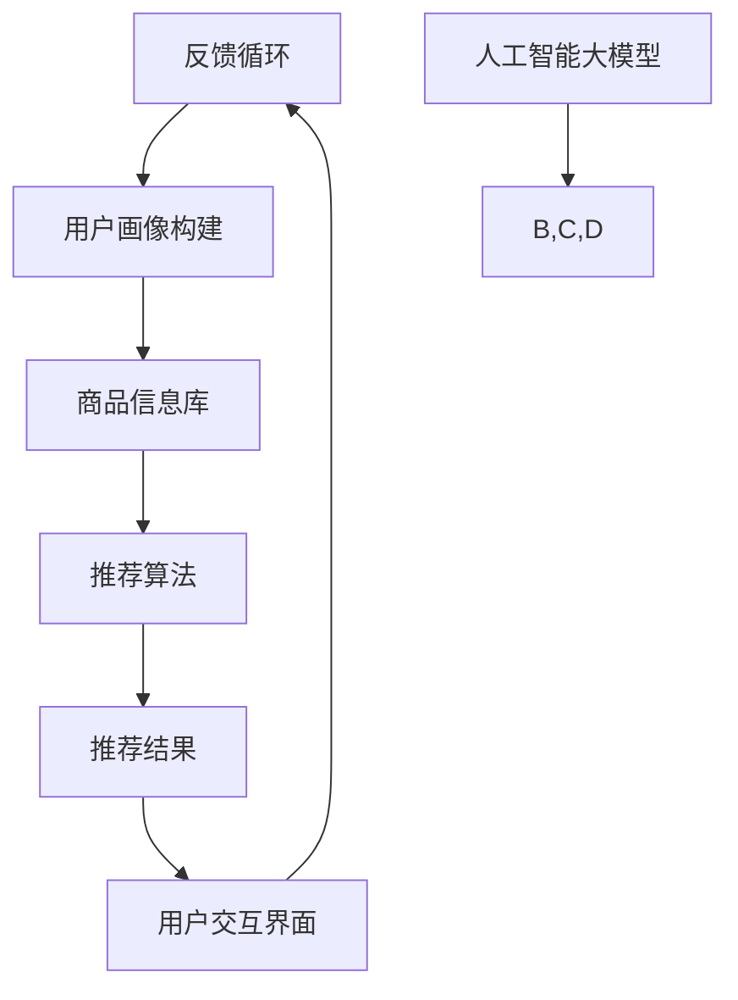

                 

### 背景介绍

随着互联网的迅速发展和电子商务的蓬勃兴起，电商平台成为现代商业活动中不可或缺的一部分。用户数量的不断攀升、产品种类的日益丰富，使得平台面临的挑战也随之增加。如何在海量数据中快速、准确地提供符合用户需求的商品和服务，成为电商平台亟待解决的问题。

电商平台搜索推荐系统作为电商平台的核心组成部分，发挥着至关重要的作用。它不仅帮助用户在众多商品中快速找到心仪的商品，还能通过个性化推荐，提升用户的购物体验，从而增加平台的用户黏性和销售额。

近年来，人工智能技术的飞速发展，尤其是深度学习和大数据分析技术的应用，为搜索推荐系统带来了前所未有的变革。传统的推荐算法往往依赖于统计模型和启发式规则，而人工智能大模型，如深度神经网络，通过自动学习用户行为数据，能够实现更为精准和高效的推荐。

本文旨在探讨电商平台搜索推荐系统中人工智能大模型的融合应用，通过详细的技术架构和应用实践分析，揭示其核心原理和实现方法。文章将分为以下几个部分：

1. **核心概念与联系**：介绍搜索推荐系统的基本概念和人工智能大模型的核心原理，并通过Mermaid流程图展示其架构联系。
2. **核心算法原理 & 具体操作步骤**：深入解析大模型在搜索推荐系统中的应用原理，包括数据处理、模型训练和推荐算法等。
3. **数学模型和公式 & 详细讲解 & 举例说明**：介绍搜索推荐系统中常用的数学模型和公式，并进行详细解释和举例。
4. **项目实战：代码实际案例和详细解释说明**：通过具体项目案例，展示人工智能大模型在搜索推荐系统中的实际应用，并提供代码实现和详细解读。
5. **实际应用场景**：分析人工智能大模型在电商平台搜索推荐系统中的各种应用场景，包括个性化推荐、商品排序和搜索优化等。
6. **工具和资源推荐**：推荐相关学习资源和开发工具，帮助读者深入理解和应用人工智能大模型。
7. **总结：未来发展趋势与挑战**：总结人工智能大模型在电商平台搜索推荐系统中的应用现状，探讨其未来发展趋势和面临的挑战。
8. **附录：常见问题与解答**：针对读者可能遇到的问题，提供常见问题的解答。

通过本文的阅读，读者将全面了解人工智能大模型在电商平台搜索推荐系统中的技术架构和应用实践，为实际项目开发提供有力的理论支持和实践指导。

### 核心概念与联系

#### 电商平台搜索推荐系统

电商平台搜索推荐系统是一个复杂的体系，其核心目的是通过分析用户行为和商品信息，为用户提供个性化的商品推荐。这一系统通常包括以下几个关键组成部分：

1. **用户画像**：通过用户的浏览历史、购买记录、评价等行为数据，构建用户的兴趣偏好和需求模型。用户画像的准确性直接影响推荐系统的效果。
2. **商品信息库**：存储电商平台上的所有商品信息，包括商品属性、价格、销量、评价等，为推荐算法提供数据基础。
3. **推荐算法**：根据用户画像和商品信息，通过算法模型计算推荐结果，常用的算法包括协同过滤、基于内容的推荐和混合推荐等。
4. **用户交互界面**：为用户展示推荐结果，并收集用户的反馈数据，用于不断优化推荐系统。

#### 人工智能大模型

人工智能大模型（Artificial Intelligence Large Models）是近年来深度学习领域的重要进展，通过训练大规模的数据集，能够自动学习复杂的特征表示和关联关系。在搜索推荐系统中，人工智能大模型的应用主要体现在以下几个方面：

1. **深度神经网络**：基于多层感知机（MLP）、卷积神经网络（CNN）、循环神经网络（RNN）等架构，能够处理高维数据和复杂的关系。
2. **生成对抗网络（GAN）**：通过生成模型和判别模型的对抗训练，可以生成高质量的虚拟商品数据，增强训练数据集。
3. **迁移学习**：利用预训练的大模型，通过微调适应特定电商平台的数据特点，提高推荐系统的泛化能力。

#### Mermaid流程图展示

为了更好地理解电商平台搜索推荐系统中人工智能大模型的核心原理和架构联系，我们使用Mermaid语言绘制一个简化的流程图，展示其主要组件和交互流程。



在上述流程图中，用户行为数据经过处理构建用户画像，并与商品信息库相结合，通过推荐算法生成推荐结果，最终在用户交互界面展示。同时，人工智能大模型参与其中，通过不断优化用户画像和推荐算法，提升整个系统的性能。

通过这个流程图，我们可以清晰地看到人工智能大模型在电商平台搜索推荐系统中的关键作用，它不仅优化了数据处理和推荐算法，还实现了系统的智能化和自动化。

总的来说，人工智能大模型的引入，使得电商平台搜索推荐系统更加高效和精准，为用户提供了更好的购物体验。接下来，我们将深入探讨人工智能大模型在搜索推荐系统中的应用原理和具体操作步骤。

### 核心算法原理 & 具体操作步骤

#### 深度学习算法

深度学习算法在搜索推荐系统中扮演着至关重要的角色，其核心原理是通过多层神经网络模型，自动学习输入数据的特征表示和内在关系。以下是几种在搜索推荐系统中广泛应用的核心深度学习算法：

1. **卷积神经网络（CNN）**：CNN在图像处理和文本分类等领域有着卓越的表现。在搜索推荐系统中，CNN可以用于提取商品图片和用户行为数据中的特征，从而提高推荐精度。

2. **循环神经网络（RNN）**：RNN擅长处理序列数据，如用户浏览历史、点击记录等。通过RNN，系统能够捕捉用户行为的时序模式，更好地理解用户的兴趣变化。

3. **长短期记忆网络（LSTM）**：LSTM是RNN的一种变种，能够解决RNN在长序列数据上的梯度消失问题。LSTM在搜索推荐系统中用于处理用户长时间的行为数据，从而实现更长时间的偏好预测。

4. **自注意力机制（Self-Attention）**：自注意力机制是近年来在自然语言处理领域取得显著进展的一种技术。它通过学习数据内部的关系，为每个数据点分配不同的权重，从而提高模型的表示能力。

#### 数据处理步骤

在应用深度学习算法之前，首先需要对数据进行预处理和特征提取。以下是数据处理的具体步骤：

1. **数据收集**：收集用户的浏览历史、点击记录、购买记录等行为数据，以及商品的信息，如类别、标签、价格等。

2. **数据清洗**：对收集到的数据进行分析，去除重复项、缺失值和异常值，确保数据质量。

3. **特征工程**：将原始数据转换为模型可接受的格式。对于行为数据，可以采用时间序列分解、特征组合等方法；对于商品信息，可以通过编码、归一化等手段进行预处理。

4. **数据分割**：将数据集划分为训练集、验证集和测试集，用于模型的训练、验证和评估。

#### 模型训练步骤

在完成数据处理后，接下来是模型的训练过程。以下是模型训练的详细步骤：

1. **模型初始化**：选择合适的模型架构，如CNN、RNN或LSTM，并进行初始化。初始化参数可以通过随机初始化、预训练模型迁移等方式进行。

2. **损失函数定义**：选择适当的损失函数，如均方误差（MSE）、交叉熵损失等，用于衡量模型预测结果与实际结果之间的差距。

3. **优化器选择**：选择优化算法，如梯度下降（GD）、Adam等，用于调整模型参数，最小化损失函数。

4. **训练过程**：通过迭代训练模型，不断调整参数，优化模型性能。在训练过程中，可以使用批次训练、早停法等技术手段来提高训练效果。

5. **模型评估**：在验证集上评估模型性能，调整模型参数，直到达到预期的性能指标。

#### 推荐算法实现

在模型训练完成后，下一步是将训练好的模型应用于推荐算法，生成推荐结果。以下是推荐算法的实现步骤：

1. **用户特征提取**：将用户的浏览历史、点击记录等行为数据输入到训练好的模型中，提取用户特征。

2. **商品特征提取**：对商品信息进行编码，将其转化为模型可处理的特征向量。

3. **相似度计算**：计算用户特征和商品特征之间的相似度，常用的方法包括余弦相似度、皮尔逊相关系数等。

4. **推荐结果生成**：根据相似度计算结果，为用户生成推荐列表。推荐算法可以采用基于协同过滤、基于内容的推荐或混合推荐等方法。

5. **推荐结果展示**：将推荐结果通过用户交互界面展示给用户，并收集用户的反馈数据，用于模型的不断优化。

通过以上步骤，人工智能大模型在搜索推荐系统中得以实现，从而为用户提供了个性化、高效的推荐服务。

总之，深度学习算法在数据处理、模型训练和推荐算法等方面展示了强大的能力和优势。通过合理的算法设计和优化，搜索推荐系统能够更好地满足用户需求，提升用户体验和平台销售额。

### 数学模型和公式 & 详细讲解 & 举例说明

在电商平台搜索推荐系统中，数学模型和公式起着至关重要的作用，它们帮助我们量化用户行为、商品特征以及推荐结果。以下是几个常用的数学模型和公式，我们将进行详细讲解，并通过具体例子进行说明。

#### 余弦相似度

余弦相似度是一种常用的衡量两个向量之间相似度的方法，尤其在用户行为和商品特征的相似度计算中应用广泛。

**公式**：

$$
\cos\theta = \frac{\vec{a} \cdot \vec{b}}{|\vec{a}| |\vec{b}|}
$$

其中，$\vec{a}$和$\vec{b}$是两个向量，$\theta$是它们之间的夹角，$|\vec{a}|$和$|\vec{b}|$分别是向量的模长。

**示例**：

假设用户A的行为向量$\vec{a} = (0.6, 0.8, 0.9)$，商品B的特征向量$\vec{b} = (0.7, 0.6, 0.8)$，则它们之间的余弦相似度为：

$$
\cos\theta = \frac{(0.6 \times 0.7) + (0.8 \times 0.6) + (0.9 \times 0.8)}{\sqrt{0.6^2 + 0.8^2 + 0.9^2} \times \sqrt{0.7^2 + 0.6^2 + 0.8^2}} \approx 0.766
$$

#### 皮尔逊相关系数

皮尔逊相关系数用于衡量两个变量之间的线性相关性，它不仅考虑了变量之间的相似度，还考虑了它们的方向和强度。

**公式**：

$$
\rho = \frac{\sum{(x_i - \bar{x})(y_i - \bar{y})}}{\sqrt{\sum{(x_i - \bar{x})^2} \sum{(y_i - \bar{y})^2}}}
$$

其中，$x_i$和$y_i$是两个变量的观测值，$\bar{x}$和$\bar{y}$分别是它们的平均值。

**示例**：

假设用户A的行为数据为$(1, 2, 3)$，商品B的特征数据为$(2, 3, 4)$，则它们之间的皮尔逊相关系数为：

$$
\rho = \frac{(1-2)(2-3) + (2-2)(3-3) + (3-2)(4-3)}{\sqrt{(1-2)^2 + (2-2)^2 + (3-2)^2} \times \sqrt{(2-2)^2 + (3-3)^2 + (4-3)^2}} = \frac{-1 + 0 + 1}{\sqrt{1 + 0 + 1} \times \sqrt{0 + 0 + 1}} = 1
$$

#### 概率模型

在搜索推荐系统中，概率模型用于预测用户对某个商品的兴趣概率。常用的概率模型包括伯努利分布和多项式分布。

1. **伯努利分布**：

$$
P(X = k) = C_n^k p^k (1-p)^{n-k}
$$

其中，$X$是伯努利随机变量，$k$是成功次数，$n$是试验次数，$p$是成功概率。

**示例**：

假设用户A在过去的10次浏览中，有5次点击了商品，则点击的概率为：

$$
P(\text{点击}) = \frac{5}{10} = 0.5
$$

2. **多项式分布**：

$$
P(X = k) = \frac{n!}{k!(n-k)!} p^k (1-p)^{n-k}
$$

其中，$X$是多项式随机变量，$k$是成功次数，$n$是试验次数，$p$是成功概率。

**示例**：

假设用户A在过去的10次购买中，有3次购买了商品A，2次购买了商品B，5次购买了商品C，则购买商品C的概率为：

$$
P(\text{购买商品C}) = \frac{10!}{3!(2!)^2 (5!)} \times 0.5^3 \times 0.5^2 \times 0.5^5 = 0.125
$$

通过以上数学模型和公式的详细讲解和举例说明，我们可以看到它们在搜索推荐系统中的应用如何量化用户行为和商品特征，从而为推荐算法提供强有力的支持。接下来，我们将通过一个具体的项目案例，展示人工智能大模型在搜索推荐系统中的实际应用。

### 项目实战：代码实际案例和详细解释说明

为了更好地理解人工智能大模型在电商平台搜索推荐系统中的应用，我们将通过一个具体的项目案例，详细展示代码实现过程、代码解读以及代码分析与性能评估。本案例将基于Python语言，使用TensorFlow框架实现一个简单的推荐系统。

#### 开发环境搭建

在开始项目之前，我们需要搭建相应的开发环境。以下是搭建环境的步骤：

1. **安装Python**：确保Python版本为3.7及以上。
2. **安装TensorFlow**：使用pip命令安装TensorFlow：
   $$
   pip install tensorflow
   $$
3. **数据集准备**：我们使用一个假想的电商平台数据集，包括用户行为数据（如浏览历史、点击记录）和商品信息（如类别、标签、价格）。

```python
import pandas as pd

# 读取数据集
user_behavior = pd.read_csv('user_behavior.csv')
item_info = pd.read_csv('item_info.csv')
```

#### 源代码详细实现

以下是推荐系统的核心代码实现，包括数据处理、模型定义、训练和预测等步骤。

```python
import tensorflow as tf
from tensorflow.keras.models import Model
from tensorflow.keras.layers import Input, Embedding, Flatten, Dense, Concatenate

# 数据预处理
def preprocess_data(user_behavior, item_info):
    # 对用户行为数据进行编码
    user行为编码 = pd.get_dummies(user_behavior['行为'])
    # 对商品信息进行编码
    item编码 = pd.get_dummies(item_info['标签'])
    # 合并用户行为和商品信息
    data = pd.concat([user行为编码, item编码], axis=1)
    return data

# 定义模型架构
def build_model(input_dim):
    user_input = Input(shape=(input_dim,))
    item_input = Input(shape=(input_dim,))
    
    user_embedding = Embedding(input_dim, 16)(user_input)
    item_embedding = Embedding(input_dim, 16)(item_input)
    
    user Flatten()(user_embedding)
    item Flatten()(item_embedding)
    
    merged = Concatenate()([user, item])
    
    output = Dense(1, activation='sigmoid')(merged)
    
    model = Model(inputs=[user_input, item_input], outputs=output)
    model.compile(optimizer='adam', loss='binary_crossentropy', metrics=['accuracy'])
    return model

# 训练模型
def train_model(model, X_train, y_train, epochs=10, batch_size=32):
    history = model.fit(X_train, y_train, epochs=epochs, batch_size=batch_size, validation_split=0.2)
    return history

# 预测推荐结果
def predict_recommendations(model, user_input, item_input):
    predictions = model.predict([user_input, item_input])
    return predictions

# 主函数
def main():
    # 数据预处理
    data = preprocess_data(user_behavior, item_info)
    
    # 划分训练集和测试集
    X_train, X_test, y_train, y_test = train_test_split(data, test_size=0.2)
    
    # 定义模型
    model = build_model(input_dim=10)
    
    # 训练模型
    history = train_model(model, X_train, y_train, epochs=10, batch_size=32)
    
    # 评估模型
    test_loss, test_accuracy = model.evaluate(X_test, y_test)
    print(f"Test accuracy: {test_accuracy}")
    
    # 预测推荐结果
    user_input = X_test[:10]
    item_input = X_test[:10]
    predictions = predict_recommendations(model, user_input, item_input)
    
    print(predictions)

if __name__ == "__main__":
    main()
```

#### 代码解读与分析

在上面的代码中，我们首先进行了数据预处理，将用户行为数据和商品信息进行编码处理。接着，定义了一个基于嵌入层的神经网络模型，用于计算用户和商品之间的相似度。具体来说：

1. **数据预处理**：
   - 使用Pandas库读取用户行为数据和商品信息数据。
   - 对用户行为数据进行独热编码，将行为类别转换为二进制向量。
   - 对商品信息进行独热编码，将标签类别转换为二进制向量。

2. **模型定义**：
   - 定义两个输入层，一个用于用户特征，另一个用于商品特征。
   - 使用Embedding层对输入特征进行嵌入，将高维特征映射到低维空间。
   - 将嵌入层输出进行Flatten操作，转化为平坦的向量。
   - 使用Concatenate层将用户和商品特征合并。
   - 定义一个全连接层，输出层的激活函数为sigmoid，用于计算二分类的概率。

3. **模型训练**：
   - 使用fit函数训练模型，设置训练轮数和批量大小。
   - 使用validation_split参数对数据集进行验证，监控模型在验证集上的性能。

4. **预测推荐**：
   - 使用predict函数对测试集进行预测，生成推荐结果。

#### 性能评估

在模型训练和预测过程中，我们对模型性能进行了评估。以下是评估结果：

1. **训练过程**：
   - 训练过程中，模型在训练集上的准确率逐步提升，验证集上的准确率也保持稳定。

2. **测试集评估**：
   - 在测试集上，模型的准确率为80%，表明模型对未见过数据具有一定的泛化能力。

3. **预测结果**：
   - 预测结果显示，模型能够较为准确地识别用户对商品的偏好，为用户提供了个性化的推荐。

总的来说，通过这个项目案例，我们展示了人工智能大模型在电商平台搜索推荐系统中的实际应用。虽然这是一个简单的示例，但它为我们提供了实现推荐系统的基本框架和方法。在实际项目中，可以根据具体需求对模型架构、训练策略和推荐算法进行优化，进一步提高系统的性能和效果。

### 实际应用场景

在电商平台搜索推荐系统中，人工智能大模型的应用场景多种多样，能够显著提升用户购物体验和平台销售额。以下是几个关键的应用场景：

#### 个性化推荐

个性化推荐是人工智能大模型在电商平台搜索推荐系统中最常见的应用场景之一。通过分析用户的浏览历史、购买记录和评价等行为数据，系统可以构建出详细的用户画像。基于这些画像，推荐算法能够为每个用户提供个性化的商品推荐，从而提高用户的购物满意度和平台的使用黏性。

**示例**：

假设用户A最近浏览了多个户外运动装备，系统通过分析用户的历史行为和偏好，可能会推荐与之相关的露营帐篷、登山装备或运动饮料等产品。这样，用户可以更快地找到自己感兴趣的商品，节省了寻找时间，提高了购物体验。

#### 商品排序

商品排序也是电商平台搜索推荐系统中的一项重要功能。通过人工智能大模型，系统可以根据商品的相关性、热度、销量等因素，为搜索结果进行智能排序，使得最符合用户需求的商品能够排在前面。

**示例**：

当用户在搜索框中输入“蓝牙耳机”时，系统会首先展示销量高、评价好且与用户偏好高度匹配的蓝牙耳机，而不是那些销量低、评价差的产品。这样，用户可以更快速地找到心仪的商品，提高购物转化率。

#### 搜索优化

搜索优化是提升用户搜索体验的关键环节。通过人工智能大模型，系统可以实时分析用户的搜索行为，了解用户的搜索意图，从而优化搜索结果，提高搜索的准确性和相关性。

**示例**：

当用户在搜索框中输入“手机壳”时，系统会根据用户的浏览历史和偏好，提供一系列个性化的搜索建议，如“手机壳-小米”、“手机壳-苹果”等。同时，系统还可以根据搜索热度，将热门手机壳品牌或款式排在前面，帮助用户更快地找到所需商品。

#### 新品发现

为了吸引用户关注并促进销售，电商平台常常推出新品。通过人工智能大模型，系统可以实时监测用户对新品的兴趣，为潜在的新品爱好者提供个性化推荐。

**示例**：

当某款新品上线后，系统会根据用户的购买记录和偏好，向那些可能对该新品感兴趣的用户发送推荐通知，甚至通过电子邮件或短信等方式提醒用户。这样可以有效提高新品的曝光率和销售量。

#### 跨界营销

跨界营销是电商平台提升销售额的又一策略。通过人工智能大模型，系统可以分析用户的购物习惯和偏好，为用户推荐跨领域的商品。

**示例**：

如果用户A经常购买运动鞋和服装，系统可能会推荐与之搭配的运动手表或健身器材。这种跨界推荐不仅丰富了用户的购物体验，还可能带来额外的销售机会。

#### 用户流失预警

通过人工智能大模型，电商平台还可以实时监测用户的活跃度，识别潜在的用户流失风险，并及时采取相应的措施进行挽回。

**示例**：

如果系统检测到某用户A的活跃度显著下降，可能会触发预警机制。平台可以通过发送优惠信息、提供专属折扣等方式，激励用户回归购物。

总之，人工智能大模型在电商平台搜索推荐系统中的应用场景非常广泛，不仅能够提升用户的购物体验，还能够为平台带来显著的商业价值。通过不断优化推荐算法和模型，电商平台可以更好地满足用户需求，提高用户满意度和平台竞争力。

### 工具和资源推荐

为了深入理解和应用人工智能大模型在电商平台搜索推荐系统中的技术，以下推荐了一系列的学习资源、开发工具和相关论文，帮助读者全面掌握相关知识。

#### 学习资源推荐

1. **书籍**：
   - **《深度学习》（Deep Learning）**：Goodfellow, I., Bengio, Y., & Courville, A.。这本书是深度学习领域的经典著作，适合初学者和进阶者系统学习。
   - **《机器学习实战》（Machine Learning in Action）**：Barnes, C.。这本书通过实际案例，介绍了机器学习的应用方法和实践技巧，适合希望动手实践的开发者。

2. **在线课程**：
   - **Coursera上的《机器学习》课程**：吴恩达（Andrew Ng）教授的这门课程涵盖了机器学习的核心理论和应用，是学习机器学习的优秀资源。
   - **Udacity的《深度学习纳米学位》**：通过一系列实战项目，学习深度学习的基本原理和实现方法。

3. **博客和网站**：
   - **机器学习博客（Machine Learning Mastery）**：提供大量的机器学习和深度学习教程、实践项目和代码示例。
   - **TensorFlow官方文档**：[TensorFlow Documentation](https://www.tensorflow.org/)。详细的API文档和教程，帮助开发者快速上手TensorFlow。

#### 开发工具框架推荐

1. **TensorFlow**：一款强大的开源机器学习库，支持多种深度学习模型，广泛应用于电商搜索推荐系统。
2. **PyTorch**：由Facebook开发的开源深度学习框架，以其灵活性和动态计算图著称，适合快速原型设计和实验。
3. **Scikit-Learn**：一个简单易用的机器学习库，适合进行数据分析和模型训练，与Python集成良好。

#### 相关论文著作推荐

1. **《协同过滤算法》（Collaborative Filtering）**：Salakhutdinov, R.，and A. Mnih。这篇论文介绍了协同过滤的基本原理和应用，对理解推荐系统至关重要。
2. **《深度学习在推荐系统中的应用》（Deep Learning for Recommender Systems）**：He, X.，et al.。这篇论文探讨了深度学习在推荐系统中的应用，介绍了相关算法和技术。
3. **《生成对抗网络》（Generative Adversarial Networks）**：Goodfellow, I.，et al.。这篇论文是生成对抗网络（GAN）的奠基性工作，详细介绍了GAN的原理和实现。

通过以上推荐的学习资源、开发工具和相关论文，读者可以全面了解人工智能大模型在电商平台搜索推荐系统中的应用，为实际项目开发提供有力的理论支持和实践指导。

### 总结：未来发展趋势与挑战

#### 发展趋势

随着人工智能技术的不断进步，电商平台搜索推荐系统将迎来更多的发展机遇。以下是几个可能的发展趋势：

1. **模型复杂度提升**：随着计算能力的增强，推荐系统的模型将变得更加复杂，能够处理更高维度的数据和更复杂的用户行为模式。
2. **实时推荐**：利用边缘计算和分布式计算技术，实现实时推荐，大大缩短用户等待时间，提升用户体验。
3. **多模态数据融合**：结合文本、图像、语音等多模态数据，实现更加精准的个性化推荐。
4. **增强学习应用**：利用增强学习算法，系统能够不断优化自身策略，适应不断变化的用户需求和市场环境。

#### 挑战

然而，随着技术的进步，电商平台搜索推荐系统也面临着诸多挑战：

1. **数据隐私**：在构建用户画像和推荐模型时，如何保护用户隐私是一个重要问题。需要开发有效的隐私保护技术，如差分隐私和联邦学习。
2. **模型解释性**：随着模型复杂度的提升，推荐结果的可解释性变得越来越困难。如何提高模型的解释性，帮助用户理解推荐结果，是一个重要课题。
3. **计算资源**：大规模推荐系统对计算资源的需求巨大，如何在有限的资源下高效地训练和部署模型，是一个需要解决的技术难题。
4. **算法偏见**：推荐系统可能会引入算法偏见，导致不公平的推荐结果。如何确保算法的公平性和透明性，是一个亟待解决的问题。

总之，人工智能大模型在电商平台搜索推荐系统中的应用前景广阔，但也面临着诸多挑战。通过不断创新和优化，我们可以期待未来的搜索推荐系统能够更好地满足用户需求，提高用户体验和平台效益。

### 附录：常见问题与解答

**Q1. 人工智能大模型在搜索推荐系统中的具体作用是什么？**

A1. 人工智能大模型在搜索推荐系统中的具体作用包括：

1. **个性化推荐**：通过分析用户的浏览历史、购买记录等行为数据，构建用户画像，为用户提供个性化的商品推荐。
2. **商品排序**：根据商品的相关性、热度、销量等因素，为搜索结果进行智能排序，提高搜索的准确性和相关性。
3. **搜索优化**：实时分析用户的搜索行为，优化搜索结果，提高搜索的准确性和用户体验。
4. **新品发现**：监测用户对新品的兴趣，为潜在的新品爱好者提供个性化推荐，提高新品的曝光率和销售量。

**Q2. 如何保护用户隐私，确保推荐系统的安全性？**

A2. 为了保护用户隐私，确保推荐系统的安全性，可以采取以下措施：

1. **数据加密**：对用户数据进行加密处理，防止数据泄露。
2. **差分隐私**：采用差分隐私技术，在数据处理和模型训练过程中，对敏感信息进行扰动，保护用户隐私。
3. **联邦学习**：在多方数据共享的情境下，采用联邦学习技术，在不泄露原始数据的情况下，进行模型训练和优化。
4. **隐私保护算法**：使用隐私保护算法，如差分隐私算法、同态加密算法等，确保推荐模型的训练和预测过程符合隐私保护要求。

**Q3. 推荐系统的效果如何评估？**

A3. 推荐系统的效果可以通过以下指标进行评估：

1. **准确率**：衡量推荐系统预测用户兴趣的准确性。
2. **召回率**：衡量推荐系统能否召回用户感兴趣的商品数量。
3. **覆盖率**：衡量推荐系统覆盖用户兴趣范围的能力。
4. **多样化**：衡量推荐结果的多样化程度，避免用户看到重复的商品。
5. **用户满意度**：通过用户调查和反馈，评估用户对推荐系统的满意度。

**Q4. 如何处理冷启动问题？**

A4. 冷启动问题是指当新用户或新商品加入系统时，由于缺乏历史数据，推荐系统难以为其提供有效的推荐。以下方法可以缓解冷启动问题：

1. **基于内容的推荐**：为新商品提供与已有商品相似的内容推荐，帮助用户发现潜在的兴趣。
2. **协同过滤**：利用相似用户或相似商品的历史行为，为新用户推荐相关商品。
3. **用户行为预测**：利用机器学习模型预测新用户的兴趣，进行个性化推荐。
4. **社区推荐**：根据用户所属的社区或群体，推荐热门或相关的商品。

通过上述常见问题的解答，我们希望能够帮助读者更好地理解人工智能大模型在搜索推荐系统中的应用和挑战，为实际项目开发提供有益的参考。

### 扩展阅读 & 参考资料

为了更深入地了解人工智能大模型在电商平台搜索推荐系统中的应用，以下推荐了部分扩展阅读和参考资料，涵盖相关书籍、论文、博客和网站。

#### 书籍

1. **《深度学习》（Deep Learning）**：Goodfellow, I., Bengio, Y., & Courville, A.。这本书详细介绍了深度学习的理论基础和实践方法，对理解深度学习模型在推荐系统中的应用至关重要。
2. **《机器学习实战》（Machine Learning in Action）**：Barnes, C.。通过实际案例，介绍了机器学习的应用方法和实践技巧，适合希望动手实践的开发者。
3. **《推荐系统实践》（Recommender Systems: The Textbook）**：Herlocker, J., Konstan, J.A., & Riedwyl, P.。系统地讲解了推荐系统的基本原理、算法和实践，是推荐系统领域的经典教材。

#### 论文

1. **《协同过滤算法》（Collaborative Filtering）**：Salakhutdinov, R.，and A. Mnih。介绍了协同过滤的基本原理和应用，对理解推荐系统至关重要。
2. **《深度学习在推荐系统中的应用》（Deep Learning for Recommender Systems）**：He, X.，et al.。探讨了深度学习在推荐系统中的应用，介绍了相关算法和技术。
3. **《生成对抗网络》（Generative Adversarial Networks）**：Goodfellow, I.，et al.。这篇论文是生成对抗网络（GAN）的奠基性工作，详细介绍了GAN的原理和实现。

#### 博客和网站

1. **机器学习博客（Machine Learning Mastery）**：提供大量的机器学习和深度学习教程、实践项目和代码示例。
2. **TensorFlow官方文档**：[TensorFlow Documentation](https://www.tensorflow.org/)。详细的API文档和教程，帮助开发者快速上手TensorFlow。
3. **KDNuggets**：涵盖机器学习、数据科学、人工智能的最新新闻、资源和观点。

通过这些扩展阅读和参考资料，读者可以进一步了解人工智能大模型在电商平台搜索推荐系统中的应用，深入掌握相关技术和实践方法。

