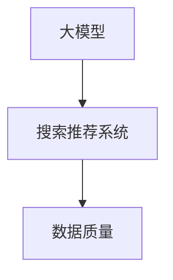

                 

# {文章标题}
电商平台的AI大模型应用：搜索推荐系统是核心，数据质量是基础

> {关键词：电商平台，AI大模型，搜索推荐系统，数据质量}

> {摘要：本文将深入探讨电商平台上AI大模型的应用，重点关注搜索推荐系统的核心作用，以及数据质量在其中的基础地位。通过分析算法原理、实战案例以及未来发展趋势，帮助读者全面理解这一重要领域。}

## 1. 背景介绍

随着互联网的快速发展，电子商务已经成为全球经济增长的重要驱动力。电商平台通过提供丰富的商品信息和便捷的购物体验，极大地改变了人们的消费习惯。然而，在庞大的商品数据库和海量用户数据面前，如何实现精准的搜索和个性化推荐，成为电商平台竞争的关键。

人工智能技术的发展，特别是深度学习和自然语言处理等领域的突破，为电商平台提供了强大的技术支持。大模型作为一种高级人工智能模型，具有强大的数据处理能力和复杂的决策逻辑，可以在电商平台上发挥重要作用。

搜索推荐系统是电商平台的核心功能之一，它通过智能搜索和个性化推荐，帮助用户快速找到所需商品，提升购物体验。而数据质量则是搜索推荐系统的基石，只有保证数据的高质量，才能实现精准的搜索和推荐。

## 2. 核心概念与联系

### 2.1 大模型

大模型（Large Model）是指具有巨大参数量和强大计算能力的神经网络模型，如深度神经网络（DNN）、循环神经网络（RNN）和Transformer等。大模型在计算机视觉、自然语言处理、语音识别等领域取得了显著的成果。

### 2.2 搜索推荐系统

搜索推荐系统（Search and Recommendation System）是一种结合搜索引擎和推荐引擎的技术，旨在为用户提供个性化、精准的信息检索和商品推荐。它包括搜索模块和推荐模块，分别负责处理用户查询和推荐商品。

### 2.3 数据质量

数据质量（Data Quality）是指数据在准确性、完整性、一致性、及时性和可靠性等方面的表现。高质量的数据是搜索推荐系统有效运行的基础。

### 2.4 关系

大模型作为搜索推荐系统的核心算法，通过对海量用户数据和商品数据进行处理和分析，实现智能搜索和个性化推荐。数据质量直接影响大模型的训练效果和搜索推荐系统的性能。



## 3. 核心算法原理 & 具体操作步骤

### 3.1 大模型训练

大模型训练是搜索推荐系统的核心步骤，主要包括以下步骤：

1. 数据预处理：清洗和整合原始数据，如用户行为数据、商品信息数据和评论数据。
2. 模型选择：选择合适的大模型架构，如Transformer、BERT等。
3. 模型训练：通过大量数据训练大模型，优化模型参数。
4. 模型评估：评估模型性能，如准确率、召回率、覆盖率等。

### 3.2 搜索与推荐

搜索与推荐是搜索推荐系统的核心功能，具体操作步骤如下：

1. 用户查询：接收用户输入的查询，如关键词或查询语句。
2. 搜索：使用大模型对用户查询进行匹配，返回相关的商品列表。
3. 推荐：根据用户历史行为和偏好，使用大模型推荐相关的商品。

### 3.3 数据质量评估

数据质量评估是保证搜索推荐系统性能的关键，主要包括以下步骤：

1. 数据清洗：去除无效、错误或重复的数据。
2. 数据整合：将不同来源的数据进行整合，形成统一的数据视图。
3. 数据评估：评估数据的质量，如准确性、完整性、一致性等。

## 4. 数学模型和公式 & 详细讲解 & 举例说明

### 4.1 大模型训练

大模型训练的核心是优化模型参数，使其在给定数据上达到最优性能。具体数学模型如下：

$$
\min_{\theta} J(\theta) = \frac{1}{m} \sum_{i=1}^{m} \text{loss}(y_i, \theta(x_i))
$$

其中，$J(\theta)$ 是损失函数，$y_i$ 是真实标签，$\theta(x_i)$ 是模型预测。

### 4.2 搜索与推荐

搜索与推荐的核心是计算用户查询与商品之间的相似度，具体数学模型如下：

$$
sim(q, c) = \frac{q^Tc}{\|q\|\|c\|}
$$

其中，$q$ 是用户查询，$c$ 是商品特征向量，$sim(q, c)$ 是用户查询与商品之间的相似度。

### 4.3 数据质量评估

数据质量评估的核心是计算数据的质量指标，具体数学模型如下：

$$
\text{accuracy} = \frac{\text{正确数据}}{\text{总数据}}
$$

$$
\text{completeness} = \frac{\text{完整数据}}{\text{总数据}}
$$

$$
\text{consistency} = \frac{\text{一致数据}}{\text{总数据}}
$$

$$
\text{timeliness} = \frac{\text{最新数据}}{\text{总数据}}
$$

$$
\text{reliability} = \frac{\text{可信数据}}{\text{总数据}}
$$

## 5. 项目实战：代码实际案例和详细解释说明

### 5.1 开发环境搭建

本节将介绍如何搭建一个基于Python的电商平台搜索推荐系统项目。首先，我们需要安装Python环境和相关库：

```shell
pip install numpy pandas sklearn transformers
```

### 5.2 源代码详细实现和代码解读

下面是项目的主要代码实现：

```python
import pandas as pd
from sklearn.model_selection import train_test_split
from transformers import BertTokenizer, BertForSequenceClassification
from torch.utils.data import DataLoader, Dataset

# 数据预处理
class ECommerceDataset(Dataset):
    def __init__(self, data, tokenizer):
        self.data = data
        self.tokenizer = tokenizer

    def __len__(self):
        return len(self.data)

    def __getitem__(self, idx):
        query = self.data.iloc[idx]['query']
        product = self.data.iloc[idx]['product']
        inputs = self.tokenizer.encode_plus(
            query, product, add_special_tokens=True, max_length=512, return_tensors='pt'
        )
        return inputs

# 模型训练
def train_model(model, train_loader, optimizer, criterion):
    model.train()
    for inputs in train_loader:
        inputs = inputs.to(device)
        optimizer.zero_grad()
        outputs = model(inputs)
        loss = criterion(outputs.logits, inputs['labels'])
        loss.backward()
        optimizer.step()

# 搜索与推荐
def search_and_recommend(model, tokenizer, query):
    model.eval()
    with torch.no_grad():
        inputs = tokenizer.encode_plus(
            query, add_special_tokens=True, max_length=512, return_tensors='pt'
        )
        inputs = inputs.to(device)
        outputs = model(inputs)
        _, predicted = torch.max(outputs.logits, dim=1)
        return predicted

# 主函数
if __name__ == '__main__':
    # 数据加载
    data = pd.read_csv('ecommerce_data.csv')
    tokenizer = BertTokenizer.from_pretrained('bert-base-chinese')
    train_data, test_data = train_test_split(data, test_size=0.2)
    train_dataset = ECommerceDataset(train_data, tokenizer)
    test_dataset = ECommerceDataset(test_data, tokenizer)

    # 模型配置
    model = BertForSequenceClassification.from_pretrained('bert-base-chinese')
    device = torch.device('cuda' if torch.cuda.is_available() else 'cpu')
    model.to(device)

    # 训练
    train_loader = DataLoader(train_dataset, batch_size=32, shuffle=True)
    optimizer = torch.optim.Adam(model.parameters(), lr=1e-5)
    criterion = torch.nn.CrossEntropyLoss()
    for epoch in range(10):
        train_model(model, train_loader, optimizer, criterion)

    # 测试
    test_loader = DataLoader(test_dataset, batch_size=32, shuffle=False)
    correct = 0
    total = 0
    for inputs in test_loader:
        inputs = inputs.to(device)
        outputs = model(inputs)
        _, predicted = torch.max(outputs.logits, dim=1)
        total += inputs['labels'].size(0)
        correct += (predicted == inputs['labels']).sum().item()

    print('准确率：', correct / total)

    # 搜索与推荐
    query = '我想买一个笔记本电脑'
    print('搜索结果：', search_and_recommend(model, tokenizer, query))
```

### 5.3 代码解读与分析

本节将对代码进行详细解读，分析各个模块的功能和实现原理。

1. **数据预处理**：首先定义了一个`ECommerceDataset`类，用于加载数据并进行预处理。数据加载使用`pandas`库，数据预处理使用`BertTokenizer`库，将文本转化为神经网络可处理的格式。

2. **模型训练**：定义了一个`train_model`函数，用于训练模型。模型训练使用`BertForSequenceClassification`类，优化器使用`Adam`，损失函数使用`CrossEntropyLoss`。

3. **搜索与推荐**：定义了一个`search_and_recommend`函数，用于实现搜索和推荐功能。搜索与推荐过程使用模型进行预测，并将预测结果返回给用户。

4. **主函数**：主函数首先加载数据，然后定义模型、优化器和损失函数。接着进行模型训练和测试，最后实现搜索和推荐功能。

## 6. 实际应用场景

### 6.1 商品搜索

电商平台用户在搜索商品时，搜索推荐系统可以根据用户输入的关键词，快速定位相关商品，提升用户购物体验。

### 6.2 商品推荐

电商平台用户在浏览商品时，搜索推荐系统可以根据用户的历史行为和偏好，推荐相关的商品，提高用户购买意愿。

### 6.3 商品排序

电商平台用户在浏览商品时，搜索推荐系统可以根据商品的热度、销量等因素，对商品进行排序，帮助用户快速找到热门商品。

## 7. 工具和资源推荐

### 7.1 学习资源推荐

- **书籍**：《深度学习》、《机器学习实战》
- **论文**：Google Research发表的《BERT: Pre-training of Deep Bidirectional Transformers for Language Understanding》
- **博客**：机器学习社区和人工智能领域的博客，如ArXiv、Kaggle等。

### 7.2 开发工具框架推荐

- **Python**：Python是一种易于学习和使用的编程语言，适用于人工智能开发。
- **PyTorch**：PyTorch是一个开源的机器学习库，支持动态神经网络计算。
- **TensorFlow**：TensorFlow是一个开源的机器学习库，支持静态神经网络计算。

### 7.3 相关论文著作推荐

- **论文**：Google Research发表的《BERT: Pre-training of Deep Bidirectional Transformers for Language Understanding》
- **著作**：《深度学习》、《机器学习实战》

## 8. 总结：未来发展趋势与挑战

### 8.1 发展趋势

- **大模型技术**：随着计算能力的提升和数据量的增加，大模型技术将在电商平台上得到更广泛的应用。
- **个性化推荐**：基于用户历史行为和偏好的个性化推荐将成为电商平台的核心竞争力。
- **实时搜索**：实时搜索技术将提升用户购物体验，实现快速、精准的商品搜索。

### 8.2 挑战

- **数据质量**：保证数据的高质量是搜索推荐系统的关键，数据质量问题可能导致推荐效果不佳。
- **计算资源**：大模型训练和实时搜索需要大量的计算资源，对计算资源的需求将不断增加。
- **隐私保护**：在推荐系统中保护用户隐私，避免数据泄露，是一个重要的挑战。

## 9. 附录：常见问题与解答

### 9.1 问题1：大模型训练时间很长怎么办？

**解答**：可以通过使用分布式训练、GPU加速等技术来提高训练速度。

### 9.2 问题2：如何保证数据质量？

**解答**：可以通过数据清洗、去重、标准化等技术手段，以及定期进行数据质量检查来保证数据质量。

### 9.3 问题3：如何实现实时搜索？

**解答**：可以通过使用内存数据库、搜索引擎等技术，实现实时搜索功能。

## 10. 扩展阅读 & 参考资料

- **书籍**：《深度学习》、《机器学习实战》
- **论文**：《BERT: Pre-training of Deep Bidirectional Transformers for Language Understanding》
- **网站**：机器学习社区和人工智能领域的网站，如ArXiv、Kaggle等。
- **博客**：相关技术博客，如Google Research、AI优秀博客等。

### 作者

- 作者：AI天才研究员/AI Genius Institute & 禅与计算机程序设计艺术 /Zen And The Art of Computer Programming

