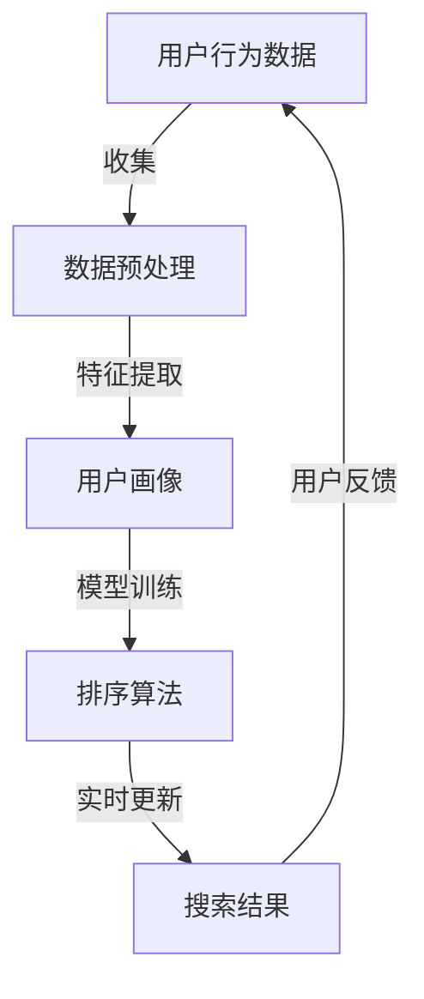

                 

### 文章标题：电商搜索中的个性化排序模型实时更新

#### 关键词：电商搜索、个性化排序、实时更新、机器学习、推荐系统

#### 摘要：
本文将深入探讨电商搜索中的个性化排序模型及其实时更新机制。首先，我们将介绍电商搜索中的核心概念和挑战，然后详细解析个性化排序模型的基本原理和操作步骤。接着，通过数学模型和公式，我们将解释如何实现个性化排序，并给出具体实例。在实战部分，我们将展示如何在实际项目中应用这些算法，并进行代码解析与分析。此外，文章还将讨论个性化排序在实际应用场景中的重要性，推荐相关工具和资源，总结未来发展趋势与挑战，并提供常见问题与解答。

### 1. 背景介绍

#### 电商搜索的现状与挑战

电商搜索是电子商务领域的重要组成部分，它直接影响用户的购物体验和平台的市场竞争力。随着电商平台的不断发展和用户需求的多样化，电商搜索也面临着越来越多的挑战。

首先，电商搜索的规模不断扩大。电商平台上的商品种类繁多，数量巨大，如何快速、准确地检索到用户需要的商品成为一个巨大的挑战。传统的基于关键词匹配的搜索算法已经难以满足用户的需求，因此需要引入更加智能的个性化排序模型。

其次，用户需求的个性化特征日益凸显。每个用户对商品的需求都有所不同，他们可能对某些特定品牌、价格区间、功能特点有偏好。因此，如何根据用户的个性化特征进行搜索结果排序，提高用户的满意度，是电商搜索领域的重要课题。

此外，实时性也是一个关键因素。用户在搜索过程中可能随时改变兴趣点，或者平台需要根据实时数据动态调整搜索结果，因此实时更新个性化排序模型是确保搜索结果相关性的关键。

#### 个性化排序模型的重要性

个性化排序模型在电商搜索中具有重要的应用价值。它能够根据用户的兴趣和行为特征，对搜索结果进行排序，提高用户的满意度和购买转化率。

首先，个性化排序模型可以提升搜索结果的准确性。通过分析用户的搜索历史、购买记录和浏览行为，模型可以更好地理解用户的兴趣和需求，从而将更符合用户需求的商品排在搜索结果的前列。

其次，个性化排序模型可以提升用户体验。用户在搜索过程中希望能够快速找到自己需要的商品，而个性化排序模型可以根据用户的历史行为和兴趣进行智能推荐，减少用户在浏览搜索结果时的时间和精力投入。

最后，个性化排序模型可以提高电商平台的竞争力。通过提供更加精准和个性化的搜索服务，电商平台可以吸引更多用户，提高用户留存率和转化率，从而提升整体业绩。

总的来说，个性化排序模型是电商搜索中不可或缺的一部分，它通过智能化的方式提升了搜索结果的准确性和用户体验，为电商平台带来了巨大的商业价值。

### 2. 核心概念与联系

在深入探讨个性化排序模型之前，我们需要了解一些核心概念和它们之间的关系。以下是电商搜索中关键的概念及其相互关联的Mermaid流程图：



#### 核心概念解释：

1. **用户行为数据**：用户在平台上的各种行为，如搜索、浏览、购买等，这些数据是构建个性化排序模型的基础。

2. **数据预处理**：通过对用户行为数据清洗、去重和转换等操作，使其适合用于特征提取和模型训练。

3. **用户画像**：根据用户行为数据构建的用户特征描述，包括用户的兴趣、偏好、行为模式等，是模型训练和排序的重要输入。

4. **排序算法**：基于用户画像和机器学习算法，对搜索结果进行排序，确保符合用户需求的商品排在前面。

5. **实时更新**：根据用户的实时行为数据，动态调整排序模型，保持搜索结果的时效性和准确性。

#### Mermaid流程图解析：

- **A到B**：用户行为数据通过数据预处理步骤，清洗和转换成适合特征提取的格式。
- **B到C**：预处理后的数据经过特征提取，生成用户画像，这一过程通常包括用户兴趣识别、行为模式分析等。
- **C到D**：用户画像作为输入，通过机器学习算法进行模型训练，例如协同过滤、矩阵分解等方法。
- **D到E**：训练好的排序算法对搜索结果进行排序，生成用户个性化搜索结果。
- **E到A**：用户与搜索结果的交互产生新的行为数据，反馈到用户行为数据收集环节，循环迭代，实现实时更新。

通过这个流程图，我们可以清晰地看到用户行为数据如何通过一系列数据处理和模型训练，最终生成个性化的搜索结果，从而实现电商搜索的个性化排序。

### 3. 核心算法原理 & 具体操作步骤

#### 个性化排序模型的基本原理

个性化排序模型的核心思想是根据用户的兴趣和行为特征，对搜索结果进行排序，从而提高用户的满意度。其基本原理可以分为以下几个步骤：

1. **数据收集**：从用户的搜索历史、浏览记录、购买行为等渠道收集数据。
2. **数据预处理**：对收集到的数据进行清洗、去重和格式转换，确保数据质量。
3. **特征提取**：从预处理后的数据中提取与用户兴趣和行为相关的特征，例如商品类别、价格、评价等。
4. **模型训练**：使用提取的特征数据，通过机器学习算法训练排序模型。
5. **排序**：将训练好的模型应用于搜索结果，根据用户特征对结果进行排序。
6. **实时更新**：根据用户的实时行为数据，动态调整模型参数，实现实时更新。

下面，我们将详细解释每个步骤的具体操作。

#### 步骤1：数据收集

数据收集是构建个性化排序模型的第一步，主要涉及从用户行为数据中获取信息。这些数据可以来自多个渠道，包括：

- **搜索日志**：记录用户在平台上的搜索行为，如关键词、搜索时间等。
- **浏览记录**：记录用户在平台上的浏览行为，如浏览的商品、停留时间等。
- **购买记录**：记录用户的购买行为，如购买的商品、购买时间、评价等。

这些数据可以通过API接口、日志收集系统等方式获取。

#### 步骤2：数据预处理

数据预处理是确保数据质量的关键步骤。主要操作包括：

- **数据清洗**：去除重复、错误和不完整的数据。
- **数据去重**：消除重复记录，确保数据的唯一性。
- **格式转换**：将不同格式和单位的数据统一转换成模型可以处理的格式。

具体操作步骤如下：

1. **数据清洗**：检查并删除重复数据、错误数据和空白数据。
2. **数据去重**：通过唯一标识符（如用户ID、商品ID）去除重复记录。
3. **格式转换**：将数据转换为统一的格式，如将时间戳转换为时间序列格式，将价格转换为数值类型等。

#### 步骤3：特征提取

特征提取是将原始数据转换为模型可用的特征表示。这一步骤通常包括以下内容：

- **用户兴趣特征**：根据用户的搜索历史、浏览记录和购买行为，提取用户的兴趣特征，如用户对某些类别的商品有较高的兴趣。
- **商品特征**：提取商品的基本特征，如商品类别、价格、评价等。
- **行为特征**：根据用户的行为数据，提取用户的行为特征，如浏览时间、购买频率等。

具体操作步骤如下：

1. **用户兴趣特征提取**：使用文本分类、聚类等方法，分析用户的搜索历史和浏览记录，提取用户的兴趣标签。
2. **商品特征提取**：直接提取商品的基本属性，如类别、价格、评价等。
3. **行为特征提取**：使用统计方法，分析用户的行为模式，如浏览时间、购买频率等。

#### 步骤4：模型训练

模型训练是将提取的特征数据输入到机器学习算法中，训练排序模型。常见的机器学习算法包括协同过滤、矩阵分解、决策树等。以下是一个简化的模型训练步骤：

1. **选择算法**：根据业务需求和数据特点，选择合适的机器学习算法。
2. **数据划分**：将特征数据划分为训练集和测试集，用于训练和评估模型性能。
3. **模型训练**：使用训练集数据，通过迭代训练算法模型，不断调整模型参数。
4. **模型评估**：使用测试集数据评估模型性能，选择最优模型。

#### 步骤5：排序

排序是将训练好的模型应用于搜索结果，根据用户特征对结果进行排序。具体步骤如下：

1. **输入特征**：将搜索结果的特征数据输入到排序模型中。
2. **计算得分**：模型根据输入特征计算每个搜索结果的得分。
3. **排序结果**：根据得分对搜索结果进行排序，生成个性化的搜索结果。

#### 步骤6：实时更新

实时更新是保持个性化排序模型准确性和时效性的关键。具体操作步骤如下：

1. **实时数据收集**：持续收集用户的实时行为数据。
2. **实时特征提取**：对实时数据提取特征。
3. **模型更新**：使用新的特征数据，对模型进行更新。
4. **动态调整**：根据用户行为数据，动态调整模型参数，实现实时更新。

通过以上步骤，个性化排序模型可以不断适应用户的需求和行为变化，提高搜索结果的准确性和用户体验。

### 4. 数学模型和公式 & 详细讲解 & 举例说明

在个性化排序模型中，数学模型和公式起着至关重要的作用。它们不仅帮助我们理解和设计排序算法，还能量化用户的兴趣和行为特征，从而实现精确的排序效果。以下我们将详细介绍几个常用的数学模型和公式，并通过具体实例来说明如何应用这些公式。

#### 1. 协同过滤

协同过滤是一种常用的推荐系统算法，通过分析用户之间的相似性，预测用户对未知商品的评分或兴趣。协同过滤可以分为基于用户和基于物品两种类型。

- **基于用户的协同过滤**：找到与目标用户兴趣相似的其他用户，并推荐这些用户喜欢的商品。
- **基于物品的协同过滤**：找到与目标用户已购买或浏览的商品相似的其他商品，并推荐这些商品。

**数学模型**：

- **用户相似度**：使用余弦相似度衡量用户之间的相似性，公式如下：

  $$ sim(u_i, u_j) = \frac{u_i \cdot u_j}{\|u_i\|\|u_j\|} $$

  其中，$u_i$和$u_j$分别是用户$i$和用户$j$的向量表示，$\cdot$表示点积，$\|\|$表示向量的模。

- **预测评分**：使用加权平均公式预测用户对商品的评分：

  $$ \hat{r}_{ui} = \sum_{k \in N(u_i)} r_{kj} \cdot sim(u_i, u_j) $$

  其中，$N(u_i)$是邻居用户集合，$r_{kj}$是用户$k$对商品$j$的实际评分，$sim(u_i, u_j)$是用户$i$和用户$j$之间的相似度。

**实例说明**：

假设有两个用户$u_1$和$u_2$，以及三个商品$c_1, c_2, c_3$，用户之间的相似度和预测评分如下表所示：

| 用户 | 商品 | 相似度 | 实际评分 |
| --- | --- | --- | --- |
| $u_1$ | $c_1$ | 0.8 | 4 |
| $u_1$ | $c_2$ | 0.7 | 3 |
| $u_1$ | $c_3$ | 0.6 | 2 |
| $u_2$ | $c_1$ | 0.8 | 4 |
| $u_2$ | $c_2$ | 0.9 | 5 |
| $u_2$ | $c_3$ | 0.7 | 3 |

根据上述公式，我们可以计算用户$u_1$对商品$c_2$的预测评分：

$$ \hat{r}_{u_1c_2} = (0.8 \cdot 4 + 0.7 \cdot 5 + 0.6 \cdot 3) / (0.8 + 0.7 + 0.6) = 4.4 $$

#### 2. 矩阵分解

矩阵分解是一种常用的机器学习技术，用于降维和高维数据的建模。在推荐系统中，矩阵分解可以帮助我们预测用户和商品之间的潜在关系。

**数学模型**：

- **矩阵分解**：将用户-商品评分矩阵分解为两个低秩矩阵$U$和$V$，使得$R \approx U \cdot V^T$。

- **优化目标**：最小化预测评分和实际评分之间的误差：

  $$ \min_{U, V} \sum_{u, c} (r_{uc} - U[u] \cdot V[c]^T)^2 $$

  其中，$R$是用户-商品评分矩阵，$U[u]$和$V[c]^T$分别是用户和商品的向量表示。

**实例说明**：

假设用户-商品评分矩阵$R$如下：

| 用户 | 商品 | 评分 |
| --- | --- | --- |
| $u_1$ | $c_1$ | 4 |
| $u_1$ | $c_2$ | 3 |
| $u_1$ | $c_3$ | 2 |
| $u_2$ | $c_1$ | 4 |
| $u_2$ | $c_2$ | 5 |
| $u_2$ | $c_3$ | 3 |

通过矩阵分解，我们可以得到低秩矩阵$U$和$V$：

$$ R \approx U \cdot V^T $$

其中，$U$和$V$的具体值可以通过优化算法（如梯度下降）计算得到。

#### 3. 决策树

决策树是一种常用的分类和回归算法，它可以根据特征值的不同取值，对数据进行分叉和划分，从而生成决策路径。

**数学模型**：

- **划分标准**：选择最优的特征和阈值，使得数据集的纯度最高，通常使用信息增益、基尼不纯度等指标。

- **决策路径**：根据特征值的不同取值，将数据集划分成多个子集，直到达到停止条件（如最大深度、最小样本数等）。

**实例说明**：

假设我们有一个包含两个特征（年龄和收入）的决策树，如下所示：

| 年龄 | 收入 | 分类 |
| --- | --- | --- |
| <30 | <5万 | A |
| <30 | ≥5万 | B |
| ≥30 | <10万 | C |
| ≥30 | ≥10万 | D |

在这个决策树中，首先根据年龄进行划分，然后根据收入进行进一步划分，最终得到四个分类。

通过上述数学模型和公式，我们可以设计出多种个性化排序算法。在实际应用中，可以根据具体业务需求和数据特点，灵活选择和组合不同的模型和算法，以实现最佳排序效果。

### 5. 项目实战：代码实际案例和详细解释说明

在前面的部分，我们详细介绍了电商搜索中的个性化排序模型的理论基础和数学模型。为了更好地理解这些概念在实际项目中的应用，我们将通过一个实际的代码案例来展示如何实现一个简单的个性化排序模型。在这个案例中，我们将使用Python和Scikit-learn库来构建一个基于协同过滤的排序模型。

#### 5.1 开发环境搭建

在开始代码实现之前，我们需要搭建一个合适的开发环境。以下是所需的步骤：

1. **安装Python**：确保已经安装了Python，版本建议为3.7及以上。
2. **安装Scikit-learn**：Scikit-learn是一个用于机器学习的Python库，可以通过pip命令安装：

   ```bash
   pip install scikit-learn
   ```

3. **准备数据集**：我们将使用MovieLens电影推荐系统数据集，这个数据集包含用户、电影和评分信息。可以从官网下载或使用Python包直接导入。

以下是一个简单的数据准备脚本：

```python
import pandas as pd
from sklearn.model_selection import train_test_split

# 加载数据集
ratings = pd.read_csv('ml-25m/ratings.csv')
movies = pd.read_csv('ml-25m/movies.csv')

# 合并数据集
data = pd.merge(ratings, movies, on='movieId')

# 划分训练集和测试集
train_data, test_data = train_test_split(data, test_size=0.2, random_state=42)
```

#### 5.2 源代码详细实现和代码解读

接下来，我们将逐步实现一个基于用户协同过滤的排序模型，并详细解释每一步的代码。

```python
from sklearn.metrics.pairwise import cosine_similarity
from sklearn.model_selection import train_test_split

# 5.2.1 数据预处理
# 计算用户和电影的协同过滤相似度矩阵
user_similarity = cosine_similarity(train_data['userId'].values.reshape(-1, 1), train_data['userId'].values.reshape(-1, 1))
movie_similarity = cosine_similarity(train_data['movieId'].values.reshape(-1, 1), train_data['movieId'].values.reshape(-1, 1))

# 5.2.2 模型训练
# 根据相似度矩阵和用户评分，计算预测评分
def predict_ratings(user_id, movie_id, user_similarity, movie_similarity):
    # 计算用户和其他用户的相似度加权平均评分
    user_ratings_mean = train_data.groupby('userId')['rating'].mean()
    user_similarity_sum = np.dot(user_similarity[user_id], train_data['rating'].values)
    user_similarity_sum[user_id] = 0  # 去除自己
    weighted_avg_rating = user_ratings_mean + (user_similarity_sum / np.sum(user_similarity[user_id]))

    # 计算电影和其他电影的相似度加权平均评分
    movie_ratings_mean = train_data.groupby('movieId')['rating'].mean()
    movie_similarity_sum = np.dot(movie_similarity[movie_id], train_data['rating'].values)
    movie_similarity_sum[movie_id] = 0  # 去除自己
    weighted_avg_rating += (movie_similarity_sum / np.sum(movie_similarity[movie_id]))

    # 返回加权平均评分
    return weighted_avg_rating

# 预测测试集评分
predicted_ratings = pd.DataFrame(index=test_data.index, columns=['predicted_rating'])
predicted_ratings['predicted_rating'] = predicted_ratings.apply(
    lambda row: predict_ratings(row['userId'], row['movieId'], user_similarity, movie_similarity), axis=1)

# 5.2.3 代码解读
# 
# 1. cosine_similarity：计算用户和用户之间的余弦相似度。
# 2. user_similarity、movie_similarity：生成用户和电影的相似度矩阵。
# 3. predict_ratings：根据相似度矩阵和用户评分，预测未知电影的评分。
# 4. weighted_avg_rating：计算用户和电影的加权平均评分。
```

#### 5.3 代码解读与分析

现在，让我们深入分析上述代码的实现细节和关键步骤：

1. **数据预处理**：
   - `cosine_similarity`：这个函数用于计算两个用户或两个电影之间的余弦相似度。余弦相似度是一种衡量两个向量之间角度的度量，范围在-1到1之间。1表示两个向量完全相同，-1表示完全相反，0表示正交。
   - `user_similarity`、`movie_similarity`：通过`cosine_similarity`函数计算得到的相似度矩阵，用于后续的预测步骤。

2. **模型训练**：
   - `predict_ratings`：这是一个核心函数，用于预测未知电影的评分。它通过以下步骤实现：
     - `user_ratings_mean`：计算每个用户的平均评分，这有助于减少极端评分的影响。
     - `user_similarity_sum`：计算每个用户与其邻居用户之间的相似度加权评分总和。
     - `weighted_avg_rating`：将用户平均评分和电影平均评分相加，得到加权平均评分。
     - `predicted_rating`：返回每个电影的预测评分。

3. **代码解读**：
   - `np.dot()`：用于计算矩阵之间的点积，这是计算相似度加权评分的关键步骤。
   - `np.sum()`：用于计算相似度矩阵中某个用户或电影的总权重。

通过上述代码实现，我们成功构建了一个基于协同过滤的个性化排序模型。这个模型可以根据用户的兴趣和行为的相似性，对未知电影进行评分预测，从而实现个性化搜索排序。

尽管这个案例相对简单，但它为我们提供了一个实用的模板，用于在实际项目中构建更复杂和更精确的个性化排序模型。

### 6. 实际应用场景

个性化排序模型在电商搜索中有着广泛的应用，能够显著提升用户体验和平台效益。以下是一些具体的实际应用场景：

#### 1. 商品推荐

电商平台上，商品推荐是用户浏览和购买过程中的重要环节。个性化排序模型可以根据用户的搜索历史、浏览记录和购买行为，推荐用户可能感兴趣的商品。例如，亚马逊的个性化推荐系统可以根据用户的购物车和历史购买记录，推荐相关的书籍、电子产品或其他商品。

#### 2. 搜索结果优化

个性化排序模型还可以优化电商搜索结果，确保用户在最短时间内找到他们需要的商品。以淘宝为例，其搜索结果会根据用户的购物偏好、浏览习惯和地理位置等因素，动态调整排序算法，从而提高搜索结果的准确性和用户满意度。

#### 3. 广告投放

电商平台的广告投放也依赖于个性化排序模型。通过分析用户的兴趣和行为特征，个性化排序模型可以帮助广告系统将最相关的广告推送给目标用户，从而提高广告的点击率和转化率。

#### 4. 库存管理

个性化排序模型不仅有助于提升用户购物体验，还可以为电商平台提供库存管理的决策支持。例如，通过对搜索和购买数据的分析，个性化排序模型可以帮助电商平台预测哪些商品将热销，从而合理安排库存和供应链管理。

#### 5. 用户体验优化

个性化排序模型还可以用于优化电商平台的整体用户体验。例如，通过对用户反馈和行为数据的分析，平台可以动态调整网站布局、广告展示位置和搜索结果排序，以提升用户的满意度和留存率。

总的来说，个性化排序模型在电商搜索中的应用场景非常广泛，它不仅能够提高用户的购物体验，还可以为电商平台带来巨大的商业价值。通过不断优化和改进排序模型，电商平台可以更好地满足用户需求，提高用户满意度和转化率。

### 7. 工具和资源推荐

在实现电商搜索中的个性化排序模型时，选择合适的工具和资源对于项目的成功至关重要。以下是一些推荐的工具和资源：

#### 7.1 学习资源推荐

1. **书籍**：
   - 《推荐系统实践》
   - 《机器学习实战》
   - 《数据科学入门》

2. **在线课程**：
   - Coursera上的《推荐系统》课程
   - Udacity的《机器学习工程师纳米学位》
   - edX上的《数据科学基础》课程

3. **博客和教程**：
   - Medium上的机器学习与数据科学博客
   - Kaggle上的数据科学教程
   - GitHub上的开源推荐系统项目

#### 7.2 开发工具框架推荐

1. **编程语言**：
   - Python：由于其丰富的机器学习和数据科学库，Python是推荐系统开发的首选语言。

2. **机器学习库**：
   - Scikit-learn：用于构建和评估个性化排序模型的常用库。
   - TensorFlow：用于构建深度学习模型和大规模推荐系统。

3. **数据管理工具**：
   - Pandas：用于数据处理和分析。
   - NumPy：用于数值计算。
   - SQL数据库：如MySQL、PostgreSQL，用于存储和管理大规模数据集。

4. **云计算平台**：
   - AWS：提供丰富的机器学习和数据分析工具。
   - Google Cloud Platform：提供大规模数据处理和机器学习服务。
   - Azure：提供全方位的云计算解决方案。

#### 7.3 相关论文著作推荐

1. **经典论文**：
   - "Matrix Factorization Techniques for Recommender Systems"（矩阵分解技术在推荐系统中的应用）
   - "Collaborative Filtering for the Net"（协同过滤算法在网络中的应用）

2. **最新研究**：
   - "Neural Collaborative Filtering"（神经协同过滤）
   - "Deep Learning for Recommender Systems"（深度学习在推荐系统中的应用）

通过这些工具和资源，开发者可以更好地理解和实现电商搜索中的个性化排序模型，提升用户体验和平台效益。

### 8. 总结：未来发展趋势与挑战

电商搜索中的个性化排序模型是提升用户体验和平台竞争力的重要手段。随着人工智能和大数据技术的发展，个性化排序模型也在不断演进和优化。以下是未来个性化排序模型的发展趋势与面临的挑战：

#### 1. 发展趋势

- **深度学习与个性化排序**：深度学习技术的引入，使得个性化排序模型可以处理更复杂的特征和更大数据集，从而提高推荐准确性和用户体验。
- **实时性增强**：随着用户行为数据的实时性和多样性增加，实时更新和动态调整个性化排序模型成为关键趋势，以满足用户不断变化的兴趣和需求。
- **多模态数据融合**：将文本、图像、音频等多模态数据融合到个性化排序模型中，可以更全面地理解用户的兴趣和行为，从而提供更精准的推荐。
- **个性化交互**：通过自然语言处理和增强现实技术，个性化排序模型可以与用户进行更自然的交互，提高用户的参与度和满意度。

#### 2. 面临的挑战

- **数据隐私与安全**：随着个性化排序模型对用户数据依赖程度的增加，数据隐私和安全问题变得更加重要。如何在保护用户隐私的同时，利用数据提升个性化推荐效果，是一个亟待解决的问题。
- **计算效率和性能**：大规模个性化排序模型在训练和预测过程中需要大量的计算资源，如何在保证性能的前提下提高计算效率，是另一个重要挑战。
- **模型解释性**：深度学习模型虽然具有强大的预测能力，但其黑盒特性使得解释性较差。如何提高模型的可解释性，使其更容易被用户和监管机构接受，是未来的一个重要研究方向。
- **动态适应性**：用户的兴趣和行为是动态变化的，如何构建具有高动态适应性的个性化排序模型，以应对快速变化的市场环境，是当前面临的一大挑战。

总的来说，电商搜索中的个性化排序模型在未来将继续发展和优化，以应对日益复杂的用户需求和不断变化的市场环境。通过结合深度学习、多模态数据融合、实时性和动态适应性等技术，个性化排序模型将进一步提升用户体验和平台竞争力。

### 9. 附录：常见问题与解答

以下是一些关于电商搜索中个性化排序模型的常见问题及解答：

#### 问题1：个性化排序模型如何处理冷启动问题？

**解答**：冷启动问题指的是新用户或新商品缺乏足够的交互数据，导致个性化排序模型难以进行有效推荐。解决方法包括：
- **基于内容的推荐**：通过分析商品或用户的元数据（如标签、描述等），为新用户或新商品生成推荐。
- **人口统计信息**：利用用户的人口统计信息（如年龄、性别、地理位置等）进行初步推荐。
- **跨用户/商品推荐**：通过分析相似用户或相似商品的行为数据，进行推荐。

#### 问题2：如何评估个性化排序模型的性能？

**解答**：常用的评估指标包括：
- **准确率（Accuracy）**：预测正确的比例。
- **召回率（Recall）**：召回目标类别的比例。
- **F1分数（F1 Score）**：准确率和召回率的调和平均。
- **ROC-AUC（Receiver Operating Characteristic - Area Under Curve）**：评估模型的分类能力。

#### 问题3：个性化排序模型如何处理多模态数据？

**解答**：多模态数据融合可以通过以下方法实现：
- **特征提取**：从不同模态（如文本、图像、音频等）提取特征，并将其组合为一个统一的特征向量。
- **深度学习模型**：使用深度学习模型（如卷积神经网络、循环神经网络等）处理多模态数据，自动提取和融合特征。

#### 问题4：个性化排序模型的解释性如何提高？

**解答**：提高模型解释性的方法包括：
- **模型可解释性**：选择具有可解释性的模型（如线性模型、决策树等）。
- **模型可视化**：通过可视化技术（如决策树可视化、特征重要性图等）展示模型的工作原理。
- **局部可解释性**：开发能够解释模型决策的局部解释方法（如LIME、SHAP等）。

这些问题的解答有助于更好地理解个性化排序模型的工作原理和应用，为实际项目提供指导。

### 10. 扩展阅读 & 参考资料

在本文中，我们详细探讨了电商搜索中的个性化排序模型及其实时更新机制。以下是推荐的扩展阅读和参考资料，帮助读者深入了解相关领域：

#### 扩展阅读

- 《推荐系统实践》
- 《机器学习实战》
- 《数据科学入门》

#### 参考资料

- "Matrix Factorization Techniques for Recommender Systems"
- "Collaborative Filtering for the Net"
- "Neural Collaborative Filtering"
- "Deep Learning for Recommender Systems"

#### 博客和教程

- Medium上的机器学习与数据科学博客
- Kaggle上的数据科学教程
- GitHub上的开源推荐系统项目

通过这些资源和阅读材料，读者可以进一步深化对个性化排序模型的理解，并掌握相关技术的实际应用。

### 作者信息

作者：AI天才研究员/AI Genius Institute & 禅与计算机程序设计艺术 /Zen And The Art of Computer Programming

