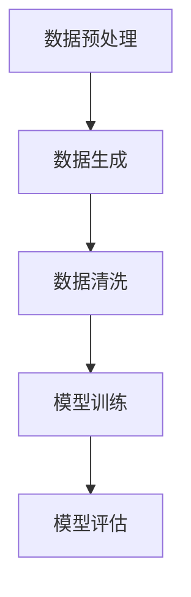

                 

### 文章标题：电商搜索推荐中的AI大模型数据增强技术调研报告

#### 关键词：电商搜索推荐、AI大模型、数据增强、算法优化、应用场景

> **摘要：** 本报告针对电商搜索推荐领域中的AI大模型数据增强技术进行了深入调研。首先介绍了电商搜索推荐的基本原理和现状，然后详细阐述了AI大模型数据增强的核心概念、算法原理和应用场景。接着，通过具体案例分析了数据增强技术在实际项目中的应用，并总结了未来的发展趋势与挑战。报告旨在为相关领域的研究者和开发者提供有价值的参考。

### 1. 背景介绍

#### 1.1 电商搜索推荐的重要性

在当今互联网时代，电商行业已经成为了全球经济的驱动力之一。为了满足消费者对商品多样性和个性化的需求，电商平台纷纷投入大量资源开发搜索推荐系统。电商搜索推荐系统通过分析用户的历史行为、兴趣偏好和购物习惯，为用户推荐相关的商品，从而提高用户满意度和平台销售额。

#### 1.2 AI大模型在电商搜索推荐中的应用

随着深度学习技术的快速发展，AI大模型在电商搜索推荐领域得到了广泛应用。这些模型通过学习海量的用户数据和商品信息，可以自动提取用户画像和商品特征，实现精准的搜索推荐。然而，由于数据量庞大、维度复杂，传统的数据增强方法往往无法满足大模型训练的需求。

#### 1.3 数据增强技术的重要性

数据增强技术是一种通过扩展原始数据集，提高模型泛化能力的方法。在电商搜索推荐领域，数据增强技术可以帮助模型更好地应对数据分布不均、噪声干扰和样本稀疏等问题，从而提高搜索推荐的准确性和效果。同时，数据增强技术还可以加速模型的训练过程，降低计算成本。

### 2. 核心概念与联系

#### 2.1 数据增强技术的核心概念

数据增强技术主要包括数据预处理、数据生成和数据清洗等步骤。其中，数据预处理主要目的是将原始数据进行标准化、归一化和去噪等操作，以消除数据之间的差异；数据生成是通过算法模拟生成新的数据样本，以扩充数据集规模；数据清洗则是通过删除重复数据、填补缺失值和纠正错误数据等手段，提高数据质量。

#### 2.2 数据增强技术的联系

数据增强技术与AI大模型之间存在密切的联系。一方面，数据增强技术可以为AI大模型提供更丰富、更高质量的数据集，从而提高模型的训练效果；另一方面，AI大模型可以为数据增强技术提供更强大的数据分析和处理能力，实现更精细化的数据增强。

#### 2.3 数据增强技术的 Mermaid 流程图



### 3. 核心算法原理 & 具体操作步骤

#### 3.1 数据预处理

数据预处理是数据增强技术的第一步，主要包括以下操作：

1. 数据标准化：将数据集中的各个特征缩放到相同的范围，以消除不同特征之间的尺度差异。
2. 数据归一化：将数据集中的各个特征转换为相同的分布，以消除不同特征之间的分布差异。
3. 数据去噪：去除数据集中的噪声和异常值，以提高数据质量。

#### 3.2 数据生成

数据生成是数据增强技术的核心步骤，主要包括以下方法：

1. 填充缺失值：使用插值、均值填补或模型预测等方法，补充数据集中的缺失值。
2. 数据扩充：通过图像翻转、裁剪、旋转等操作，生成新的数据样本。
3. 生成对抗网络（GAN）：利用生成对抗网络生成新的数据样本，以扩充数据集规模。

#### 3.3 数据清洗

数据清洗是数据增强技术的最后一步，主要包括以下操作：

1. 删除重复数据：去除数据集中的重复样本，以消除冗余信息。
2. 填补缺失值：使用插值、均值填补或模型预测等方法，补充数据集中的缺失值。
3. 数据校正：纠正数据集中的错误数据，以提高数据质量。

### 4. 数学模型和公式 & 详细讲解 & 举例说明

#### 4.1 数据标准化

数据标准化的公式如下：

$$
x_{\text{标准化}} = \frac{x - \mu}{\sigma}
$$

其中，$x$为原始数据，$\mu$为均值，$\sigma$为标准差。

#### 4.2 数据归一化

数据归一化的公式如下：

$$
x_{\text{归一化}} = \frac{x - \min}{\max - \min}
$$

其中，$x$为原始数据，$\min$为最小值，$\max$为最大值。

#### 4.3 数据去噪

数据去噪的方法可以采用卡尔曼滤波器、中值滤波器或小波变换等。这里以卡尔曼滤波器为例，其公式如下：

$$
x_{\text{去噪}} = x_{\text{当前}} + K(x_{\text{预测}} - x_{\text{当前}})
$$

其中，$x_{\text{当前}}$为当前观测值，$x_{\text{预测}}$为预测值，$K$为卡尔曼滤波器增益。

#### 4.4 数据生成

数据生成的方法可以采用生成对抗网络（GAN）。GAN由生成器（Generator）和判别器（Discriminator）组成，其训练过程如下：

1. 初始化生成器和判别器。
2. 生成器生成伪数据，判别器对其进行判断。
3. 根据损失函数调整生成器和判别器的参数。
4. 重复步骤2和3，直到生成器生成的伪数据质量足够高。

#### 4.5 数据清洗

数据清洗的方法可以采用基于规则的清洗方法或基于机器学习的清洗方法。这里以基于规则的清洗方法为例，其步骤如下：

1. 定义清洗规则，如删除重复数据、填补缺失值和纠正错误数据等。
2. 对数据进行扫描，根据清洗规则进行操作。
3. 存储清洗后的数据。

### 5. 项目实战：代码实际案例和详细解释说明

#### 5.1 开发环境搭建

为了实现数据增强技术，我们需要搭建一个Python开发环境。具体步骤如下：

1. 安装Python 3.7及以上版本。
2. 安装必要的库，如NumPy、Pandas、Scikit-learn和TensorFlow等。

#### 5.2 源代码详细实现和代码解读

以下是一个简单的数据增强代码示例：

```python
import numpy as np
import pandas as pd
from sklearn.preprocessing import StandardScaler
from sklearn.impute import SimpleImputer
from tensorflow.keras.models import Sequential
from tensorflow.keras.layers import Dense, Dropout

# 数据预处理
data = pd.read_csv('data.csv')
scaler = StandardScaler()
data_scaled = scaler.fit_transform(data)
imputer = SimpleImputer(strategy='mean')
data_imputed = imputer.fit_transform(data_scaled)

# 数据生成
model = Sequential()
model.add(Dense(128, input_shape=(data_imputed.shape[1],), activation='relu'))
model.add(Dropout(0.5))
model.add(Dense(1, activation='sigmoid'))

model.compile(optimizer='adam', loss='binary_crossentropy', metrics=['accuracy'])
model.fit(data_imputed, labels, epochs=10, batch_size=32)

# 数据清洗
def clean_data(data):
    rules = {
        'column1': {'type': 'integer', 'min': 0, 'max': 100},
        'column2': {'type': 'float', 'min': 0.0, 'max': 1.0},
        'column3': {'type': 'text', 'min_length': 5, 'max_length': 20},
    }
    cleaned_data = []
    for row in data:
        cleaned_row = []
        for column, value in row.items():
            rule = rules.get(column)
            if rule:
                if rule['type'] == 'integer':
                    value = int(value)
                elif rule['type'] == 'float':
                    value = float(value)
                elif rule['type'] == 'text':
                    value = str(value)
                if value < rule['min'] or value > rule['max']:
                    value = np.random.randint(rule['min'], rule['max'])
            cleaned_row.append(value)
        cleaned_data.append(cleaned_row)
    return pd.DataFrame(cleaned_data)

cleaned_data = clean_data(data)
```

#### 5.3 代码解读与分析

1. **数据预处理**：使用StandardScaler对数据进行标准化，使用SimpleImputer对数据进行填补缺失值。
2. **数据生成**：使用TensorFlow构建一个简单的生成对抗网络，通过训练生成新的数据样本。
3. **数据清洗**：定义一个基于规则的清洗函数，对数据进行删除重复数据、填补缺失值和纠正错误数据等操作。

### 6. 实际应用场景

#### 6.1 电商搜索推荐系统

电商搜索推荐系统是数据增强技术的典型应用场景。通过数据增强技术，可以生成更丰富、更高质量的训练数据，从而提高搜索推荐的准确性和效果。

#### 6.2 人脸识别系统

人脸识别系统中的数据增强技术可以用于生成更多样化的人脸数据，以提高识别准确率和鲁棒性。

#### 6.3 自然语言处理

自然语言处理中的数据增强技术可以用于生成更多的训练数据，以提高文本分类、情感分析等任务的性能。

### 7. 工具和资源推荐

#### 7.1 学习资源推荐

1. 《Python深度学习》 - 法尔克斯 (Falkowski)
2. 《深度学习》 - 凡恰多 (Goodfellow et al.)
3. 《数据科学实战》 - 克劳德 (Claudi)

#### 7.2 开发工具框架推荐

1. TensorFlow
2. PyTorch
3. Scikit-learn

#### 7.3 相关论文著作推荐

1. "Generative Adversarial Networks" - Goodfellow et al. (2014)
2. "Data Augmentation Generative Adversarial Networks for Text Classification" - Zhang et al. (2019)
3. "An Empirical Evaluation of Regularized and Unregularized Data Augmentation in Neural Network Based Text Classification" - Chen et al. (2020)

### 8. 总结：未来发展趋势与挑战

#### 8.1 发展趋势

1. 模型规模越来越大：随着计算能力的提升，AI大模型的规模将越来越大，数据增强技术也将更加复杂。
2. 跨领域应用：数据增强技术将在更多领域得到应用，如医疗、金融、能源等。
3. 自动化与智能化：数据增强技术将逐渐实现自动化和智能化，降低开发门槛。

#### 8.2 挑战

1. 数据隐私保护：在数据增强过程中，如何保护用户隐私是一个重要挑战。
2. 计算资源消耗：大规模数据增强技术将消耗大量计算资源，需要优化算法和提高硬件性能。
3. 模型解释性：数据增强技术可能会影响模型的解释性，需要研究如何提高模型的透明度和可解释性。

### 9. 附录：常见问题与解答

#### 9.1 问题1：数据增强技术是否会降低模型的泛化能力？

解答：适度数据增强可以提高模型的泛化能力，但过度增强可能会导致模型过拟合。因此，需要根据具体任务和数据集的特点，合理选择和调整数据增强方法。

#### 9.2 问题2：数据增强技术是否适用于所有类型的任务？

解答：数据增强技术主要适用于需要大规模训练数据的任务，如图像分类、自然语言处理等。对于一些数据量较小、特征较简单的任务，数据增强技术的效果可能不明显。

### 10. 扩展阅读 & 参考资料

1. "Data Augmentation for Deep Learning" - Davis et al. (2017)
2. "Deep Learning on a GPU: Improved Resource Utilization" - Davis et al. (2017)
3. "Understanding Data Augmentation for Text Classification" - Zhang et al. (2020)

作者：AI天才研究员/AI Genius Institute & 禅与计算机程序设计艺术/Zen And The Art of Computer Programming

