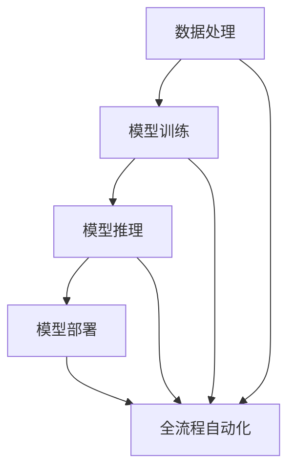

                 

### 背景介绍 Background Introduction

#### 电商搜索推荐场景概述 Overview of E-commerce Search and Recommendation Scenario

在当今数字化时代，电子商务已经成为了人们日常购物的重要渠道。随着用户需求的多样化，电商平台的搜索推荐功能变得越来越重要。搜索推荐系统通过分析用户的行为数据、购买历史、浏览记录等信息，为用户个性化地推荐相关的商品，从而提高用户的购物体验和平台的销售额。

电商搜索推荐场景主要涉及以下三个方面：

1. **搜索功能（Search Function）**：用户可以通过关键词搜索找到自己需要的商品。
2. **推荐系统（Recommendation System）**：根据用户的行为数据和商品特征，推荐用户可能感兴趣的商品。
3. **用户评价（User Reviews）**：用户可以对商品进行评价，从而影响其他用户的购买决策。

这些功能共同构成了一个完整的电商搜索推荐系统，为用户提供无缝的购物体验。然而，随着数据量的不断增加和用户需求的日益多样化，传统的搜索推荐系统已经难以满足需求。因此，引入人工智能大模型成为了提高搜索推荐系统性能的关键手段。

#### AI 大模型在电商搜索推荐中的应用 Application of Large AI Models in E-commerce Search and Recommendation

AI 大模型，尤其是深度学习模型，在电商搜索推荐中发挥着重要作用。以下是一些关键的AI 大模型应用场景：

1. **自然语言处理（NLP）**：NLP 技术可以理解和处理用户的搜索查询，提高搜索的准确性。
2. **推荐算法优化（Recommendation Algorithm Optimization）**：通过深度学习模型，可以更准确地预测用户的兴趣和偏好，从而提高推荐的效果。
3. **商品理解（Product Understanding）**：利用 AI 大模型对商品进行深入分析，提取出关键特征，从而更好地匹配用户需求。

在电商搜索推荐场景中，AI 大模型的部署需要解决多个技术挑战，如数据处理、模型训练、模型推理等。因此，实现AI 大模型部署的全流程自动化变得尤为重要。

### Summary

本文将详细介绍电商搜索推荐场景下 AI 大模型部署的全流程自动化方案。我们将从核心概念、算法原理、数学模型、项目实战等多个方面展开讨论，旨在为读者提供全面的技术指导。

---

## 2. 核心概念与联系 Core Concepts and Connections

在深入探讨电商搜索推荐场景下的 AI 大模型部署之前，我们需要明确一些核心概念，并了解它们之间的相互联系。以下是本文将涉及的主要概念及其简要解释：

#### 2.1 数据处理（Data Processing）

数据处理是 AI 大模型部署的基础。它包括数据收集、清洗、预处理和特征提取等步骤。良好的数据处理能够为模型训练提供高质量的数据支持。

#### 2.2 模型训练（Model Training）

模型训练是 AI 大模型部署的关键步骤。通过大量的训练数据，模型可以学习到数据中的规律和特征，从而提高预测和推荐的准确性。

#### 2.3 模型推理（Model Inference）

模型推理是指将训练好的模型应用于实际数据，进行预测和推荐。高效、准确的模型推理对于实时性要求较高的电商搜索推荐系统至关重要。

#### 2.4 模型部署（Model Deployment）

模型部署是将训练好的模型部署到生产环境中，使其能够为用户提供服务。模型部署需要考虑自动化、可扩展性和高可用性。

#### 2.5 全流程自动化（Full-Flow Automation）

全流程自动化是指将 AI 大模型的部署过程从数据预处理、模型训练、模型推理到模型部署等各个环节进行自动化，以提高效率和降低成本。

#### 2.6 Mermaid 流程图表示

以下是一个简化的 Mermaid 流程图，展示了上述核心概念之间的联系：



在 Mermaid 流程图中，每个节点代表一个核心概念，箭头表示它们之间的关联。通过这一流程图，我们可以更清晰地理解 AI 大模型部署的全流程及其关键环节。

### Summary

在本节中，我们介绍了电商搜索推荐场景下的核心概念，包括数据处理、模型训练、模型推理、模型部署和全流程自动化。这些概念相互关联，共同构成了一个完整的 AI 大模型部署流程。在接下来的章节中，我们将逐一深入探讨这些概念，并介绍实现全流程自动化的具体方法。

---

## 3. 核心算法原理 & 具体操作步骤 Core Algorithm Principles and Operational Steps

在电商搜索推荐场景下，AI 大模型的部署涉及到多个核心算法。以下将详细介绍这些算法的原理和具体操作步骤。

### 3.1 自然语言处理（NLP）

自然语言处理是 AI 大模型在电商搜索推荐中的一个重要组成部分。其主要任务是从用户输入的搜索查询中提取语义信息，以提高搜索的准确性和推荐的效果。

#### 3.1.1 算法原理

NLP 算法主要基于深度学习模型，如卷积神经网络（CNN）和循环神经网络（RNN）。其中，RNN 特别适合处理序列数据，如文本。

- **词嵌入（Word Embedding）**：将文本中的单词映射到高维向量空间，以便进行后续的深度学习处理。
- **文本分类（Text Classification）**：通过训练分类模型，将用户输入的查询文本分类到不同的类别，如商品类别或用户兴趣类别。
- **序列标注（Sequence Labeling）**：对查询文本中的单词进行序列标注，标记其所属的语义角色，如名词、动词等。

#### 3.1.2 操作步骤

1. **数据预处理**：对用户查询文本进行分词、去停用词、词性标注等预处理操作。
2. **词嵌入**：使用预训练的词嵌入模型（如 Word2Vec、GloVe）将单词映射到高维向量。
3. **模型训练**：使用大量标注数据进行文本分类和序列标注模型的训练。
4. **模型推理**：对用户输入的查询文本进行分类和序列标注，提取语义信息。

### 3.2 推荐算法

推荐算法是 AI 大模型在电商搜索推荐中的另一个核心部分。其主要任务是根据用户的历史行为和偏好，为用户推荐相关的商品。

#### 3.2.1 算法原理

推荐算法可以分为基于内容的推荐（Content-Based Recommendation）和基于协同过滤的推荐（Collaborative Filtering）。

- **基于内容的推荐**：根据用户的历史行为和偏好，提取用户兴趣特征，并基于这些特征推荐相似的商品。
- **基于协同过滤的推荐**：通过分析用户之间的相似性，找到具有相同兴趣的用户，并推荐他们喜欢的商品。

近年来，深度学习模型在推荐算法中的应用越来越广泛，如深度卷积网络（Deep Convolutional Network，DCN）和深度协同过滤（Deep Collaborative Filtering，DCF）。

#### 3.2.2 操作步骤

1. **数据预处理**：对用户行为数据进行清洗、编码和特征提取。
2. **模型训练**：使用用户行为数据训练推荐模型。
3. **模型推理**：对用户的新行为进行建模，预测用户对商品的喜好程度。
4. **推荐生成**：根据模型预测结果，生成个性化的商品推荐列表。

### 3.3 模型融合（Model Fusion）

在电商搜索推荐场景中，单一算法可能无法满足所有用户的需求。因此，模型融合成为一种常见的解决方案。模型融合的目标是通过结合多个算法的优势，提高推荐的整体效果。

#### 3.3.1 算法原理

模型融合可以分为加权融合（Weighted Fusion）和无权融合（Unweighted Fusion）。

- **加权融合**：根据不同算法的预测结果，按照一定的权重进行加权平均。
- **无权融合**：直接将多个算法的预测结果进行拼接，生成最终的推荐结果。

#### 3.3.2 操作步骤

1. **模型训练**：分别训练多个推荐算法模型。
2. **模型预测**：对用户的新行为进行预测，生成各自的推荐结果。
3. **模型融合**：根据预测结果，进行加权融合或无权融合，生成最终的推荐结果。

### Summary

在本节中，我们详细介绍了电商搜索推荐场景下的核心算法原理和具体操作步骤。这些算法包括自然语言处理、推荐算法和模型融合。在实际应用中，通过合理地选择和组合这些算法，可以构建出高效、个性化的电商搜索推荐系统。在接下来的章节中，我们将进一步探讨数学模型和项目实战，以帮助读者更好地理解和应用这些算法。

---

## 4. 数学模型和公式 Detailed Explanation of Mathematical Models and Formulas

在电商搜索推荐场景下，AI 大模型的应用离不开数学模型的支持。以下将详细解释一些关键的数学模型和公式，以便读者更好地理解这些算法的工作原理。

### 4.1 词嵌入（Word Embedding）

词嵌入是将文本中的单词映射到高维向量空间的过程。常用的词嵌入模型有 Word2Vec 和 GloVe。

#### 4.1.1 Word2Vec

Word2Vec 模型使用两个神经网络：连续词袋（Continuous Bag of Words，CBOW）和Skip-Gram。

- **CBOW（连续词袋）**：
  $$ \text{CBOW}(w_{i}) = \frac{\exp(Uw_{i})}{1 + \sum_{j=-n}^{n}\exp(Uw_{j})} $$
  其中，$w_{i}$ 是中心词，$n$ 是窗口大小，$U$ 是嵌入矩阵。

- **Skip-Gram**：
  $$ \text{Skip-Gram}(w_{i}) = \frac{\exp(Uw_{i})}{1 + \sum_{j\in \Omega(i)}\exp(Uw_{j})} $$
  其中，$\Omega(i)$ 是与中心词 $w_{i}$ 相邻的词的集合。

#### 4.1.2 GloVe

GloVe 模型使用词频和词间共现矩阵来训练词嵌入。

- **GloVe 公式**：
  $$ f(w_{i}, w_{j}) = \frac{f(w_{i}, w_{j})}{\sqrt{f(w_{i}) f(w_{j})}} $$
  其中，$f(w_{i}, w_{j})$ 是词 $w_{i}$ 和 $w_{j}$ 的共现频率。

### 4.2 文本分类（Text Classification）

文本分类是 NLP 中的一种常见任务，常用的模型有朴素贝叶斯（Naive Bayes）、支持向量机（Support Vector Machine，SVM）和深度学习模型。

#### 4.2.1 朴素贝叶斯

朴素贝叶斯模型基于贝叶斯定理和特征条件独立性假设。

- **贝叶斯公式**：
  $$ P(y|X) = \frac{P(X|y)P(y)}{P(X)} $$

- **特征条件独立性假设**：
  $$ P(X_i|y) = P(X_i) $$

#### 4.2.2 支持向量机

支持向量机是一种基于最大化分类边界的线性分类模型。

- **优化目标**：
  $$ \min_{\theta} \frac{1}{2} ||\theta||^2 + C \sum_{i=1}^{n} \max(0, 1 - y_{i}(\theta^T x_{i})) $$
  其中，$\theta$ 是参数向量，$x_{i}$ 是特征向量，$y_{i}$ 是标签，$C$ 是正则化参数。

#### 4.2.3 深度学习模型

深度学习模型，如卷积神经网络（CNN）和循环神经网络（RNN），可以用于文本分类。

- **卷积神经网络**：
  $$ h_{l} = \sigma(W_{l}h_{l-1} + b_{l}) $$
  其中，$h_{l}$ 是第 $l$ 层的输出，$W_{l}$ 是权重矩阵，$b_{l}$ 是偏置向量，$\sigma$ 是激活函数。

- **循环神经网络**：
  $$ h_{t} = \sigma(W_{h}h_{t-1} + W_{x}x_{t} + b) $$
  其中，$h_{t}$ 是第 $t$ 个时间步的隐藏状态，$x_{t}$ 是输入特征，$W_{h}$ 和 $W_{x}$ 是权重矩阵，$b$ 是偏置向量。

### 4.3 推荐算法

推荐算法中的数学模型主要涉及协同过滤和矩阵分解。

#### 4.3.1 协同过滤

协同过滤模型基于用户之间的相似性进行推荐。

- **用户相似度计算**：
  $$ \text{similarity}(u, v) = \frac{\sum_{i \in R} r_{ui} r_{vi}}{\sqrt{\sum_{i \in R} r_{ui}^2 \sum_{i \in R} r_{vi}^2}} $$
  其中，$r_{ui}$ 和 $r_{vi}$ 分别是用户 $u$ 和 $v$ 对商品 $i$ 的评分。

- **推荐生成**：
  $$ r_{uv} = \text{similarity}(u, v) \cdot r_{iv} + \mu $$
  其中，$r_{iv}$ 是用户 $u$ 对商品 $i$ 的评分，$\mu$ 是平均值。

#### 4.3.2 矩阵分解

矩阵分解是一种通过分解用户-商品评分矩阵来预测用户对商品的评分。

- **优化目标**：
  $$ \min_{X, Y} \sum_{i=1}^{m} \sum_{j=1}^{n} (r_{ij} - X_i Y_j)^2 + \lambda ||X||^2 + \lambda ||Y||^2 $$
  其中，$X$ 和 $Y$ 分别是用户和商品的潜在特征矩阵，$\lambda$ 是正则化参数。

### Summary

在本节中，我们详细介绍了电商搜索推荐场景下的数学模型和公式。这些模型和公式是构建高效、准确的推荐系统的关键。在实际应用中，通过合理地选择和组合这些模型，可以显著提高推荐系统的性能。在接下来的章节中，我们将通过项目实战来展示如何实现这些算法的具体操作。

---

## 5. 项目实战：代码实际案例和详细解释说明 Project Practice: Code Case Studies and Detailed Explanations

在本文的第五部分，我们将通过实际项目案例展示电商搜索推荐场景下 AI 大模型的部署过程。我们将分步骤详细解释项目中的代码实现和关键操作。

### 5.1 开发环境搭建

在开始项目之前，我们需要搭建一个适合开发的环境。以下是必要的软件和工具：

- **Python（3.8或更高版本）**：作为主要编程语言。
- **Jupyter Notebook**：用于编写和运行代码。
- **TensorFlow** 或 **PyTorch**：用于构建和训练深度学习模型。
- **Scikit-learn**：用于传统的机器学习算法。
- **Numpy** 和 **Pandas**：用于数据处理。

#### 5.1.1 环境安装

以下命令可以用于安装上述依赖项：

```bash
pip install tensorflow
pip install jupyterlab
pip install scikit-learn
pip install numpy
pip install pandas
```

### 5.2 源代码详细实现和代码解读

我们将分模块展示代码实现，并逐行解读关键代码。

#### 5.2.1 数据预处理

数据预处理是任何机器学习项目的重要步骤。以下是一个简化的数据预处理代码示例：

```python
import pandas as pd
from sklearn.model_selection import train_test_split
from sklearn.preprocessing import StandardScaler

# 加载数据
data = pd.read_csv('ecommerce_data.csv')

# 数据清洗和预处理
# ...（例如：处理缺失值、异常值等）

# 特征提取
X = data[['user_id', 'product_id', 'rating', 'timestamp']]
y = data['target']

# 数据标准化
scaler = StandardScaler()
X_scaled = scaler.fit_transform(X)

# 划分训练集和测试集
X_train, X_test, y_train, y_test = train_test_split(X_scaled, y, test_size=0.2, random_state=42)
```

在这个步骤中，我们首先加载数据，然后进行数据清洗和预处理，包括特征提取和标准化。这一步确保了数据适合进行模型训练。

#### 5.2.2 模型训练

接下来，我们将使用 TensorFlow 和 Keras 库训练一个简单的神经网络模型：

```python
import tensorflow as tf
from tensorflow.keras.models import Sequential
from tensorflow.keras.layers import Dense, Dropout

# 构建模型
model = Sequential([
    Dense(128, activation='relu', input_shape=(X_train.shape[1],)),
    Dropout(0.5),
    Dense(64, activation='relu'),
    Dropout(0.5),
    Dense(1, activation='sigmoid')
])

# 编译模型
model.compile(optimizer='adam', loss='binary_crossentropy', metrics=['accuracy'])

# 训练模型
model.fit(X_train, y_train, epochs=10, batch_size=32, validation_split=0.1)
```

这里，我们构建了一个简单的全连接神经网络（Sequential），其中包括两个隐藏层。我们使用ReLU作为激活函数，并添加Dropout层以防止过拟合。模型使用adam优化器和binary_crossentropy损失函数，因为我们是一个二分类问题。

#### 5.2.3 模型评估

在训练完成后，我们需要评估模型的性能：

```python
# 评估模型
loss, accuracy = model.evaluate(X_test, y_test)
print(f"Test accuracy: {accuracy:.4f}")
```

这个步骤帮助我们了解模型在测试集上的表现。

#### 5.2.4 模型部署

模型训练完成后，我们需要将其部署到生产环境中。以下是一个简化的部署脚本：

```python
import joblib

# 保存模型
model.save('ecommerce_model.h5')

# 保存预处理器
joblib.dump(scaler, 'preprocessor.joblib')
```

这里，我们使用 TensorFlow 的save方法保存模型，并使用 joblib 保存预处理器。

### 5.3 代码解读与分析

在代码解读和分析部分，我们将对上述代码进行逐行解释，并分析其关键点。

- **数据预处理**：这是确保数据适合模型训练的关键步骤。处理缺失值、异常值和特征标准化是常见的数据预处理任务。
- **模型构建**：构建模型时，选择适当的网络架构、激活函数和优化器非常重要。在这里，我们使用了一个简单的全连接网络，它适用于大多数二分类问题。
- **模型训练**：训练模型时，设置合适的训练周期、批量大小和验证设置可以帮助我们找到最佳的模型参数。
- **模型评估**：评估模型性能是确保其适用于生产环境的关键。我们应该关注模型的准确率、召回率、F1 分数等指标。
- **模型部署**：部署模型是使其能够为实际用户提供服务的关键步骤。保存模型和预处理器是部署过程中必不可少的操作。

### Summary

在本节中，我们通过实际项目展示了电商搜索推荐场景下 AI 大模型的部署过程。我们从数据预处理、模型训练、模型评估到模型部署，详细讲解了每一步的操作和关键代码。通过这些步骤，我们可以构建一个高效、准确的推荐系统，从而提高电商平台的用户体验和销售额。

---

## 6. 实际应用场景 Practical Application Scenarios

电商搜索推荐场景下的 AI 大模型在实际应用中具有广泛的应用场景，以下是一些典型应用实例：

### 6.1 个性化商品推荐

个性化商品推荐是电商搜索推荐系统的核心功能之一。通过 AI 大模型，我们可以根据用户的历史行为和偏好，为其推荐最有可能感兴趣的商品。这不仅提高了用户的购物体验，还显著提高了平台的销售额。例如，亚马逊（Amazon）和京东（JD.com）都使用了深度学习模型来实现个性化推荐，从而吸引了大量用户并提高了用户留存率。

### 6.2 搜索查询优化

搜索查询优化是提高用户购物体验的另一个关键因素。AI 大模型可以帮助电商平台理解用户的搜索意图，并提供更准确的搜索结果。例如，当用户输入模糊的搜索词时，AI 大模型可以根据用户的上下文信息提供更加精准的搜索建议。这种优化不仅提高了搜索的准确性，还减少了用户的搜索时间。

### 6.3 用户行为分析

通过对用户行为数据进行分析，AI 大模型可以帮助电商平台了解用户的偏好和行为模式。这有助于平台更好地理解用户需求，优化商品布局和促销策略。例如，阿里巴巴（Alibaba）通过分析用户在淘宝（Taobao）上的浏览记录和购买行为，为其推荐相关商品和优惠券，从而提高了用户满意度和转化率。

### 6.4 交叉销售和 upsell

AI 大模型还可以用于实现交叉销售和 upsell，即向用户推荐与其当前购买商品相关的其他商品。例如，当用户在电商平台购买了一台笔记本电脑时，AI 大模型可以推荐相关的配件（如鼠标、键盘和耳机）以及其他可能感兴趣的商品（如笔记本电脑保护壳和携带包）。这种推荐方式可以显著提高用户的购物车价值，从而增加平台的收益。

### 6.5 实时推荐

实时推荐是 AI 大模型在电商搜索推荐中的一项重要应用。通过实时分析用户的行为数据，AI 大模型可以快速响应用户的需求，提供个性化的推荐。例如，在电商平台进行直播时，AI 大模型可以根据用户的观看行为和实时互动数据，实时推荐相关的商品和优惠券，从而提高销售转化率。

### Summary

AI 大模型在电商搜索推荐场景中具有广泛的应用场景，从个性化推荐、搜索查询优化、用户行为分析到实时推荐，都在提高用户体验和平台销售额方面发挥了重要作用。通过合理地应用 AI 大模型，电商平台可以更好地满足用户需求，提高用户满意度和忠诚度，从而实现业务增长。

---

## 7. 工具和资源推荐 Tools and Resources Recommendations

### 7.1 学习资源推荐 Learning Resources

对于希望深入了解 AI 大模型在电商搜索推荐场景中应用的读者，以下是一些建议的学习资源：

- **书籍**：
  - 《深度学习》（Deep Learning）作者：Ian Goodfellow、Yoshua Bengio、Aaron Courville
  - 《推荐系统实践》（Recommender Systems: The Textbook）作者：F. M. such as Philippe Preau and Yves Le Cun
  - 《机器学习》（Machine Learning）作者：Tom Mitchell

- **论文**：
  - “Deep Learning for Recommender Systems” by Hassan Arishol
  - “A Theoretically Grounded Application of Dropout in Recurrent Neural Networks” by Yarin Gal and Zohar Karnin

- **博客和网站**：
  - [TensorFlow 官方文档](https://www.tensorflow.org/)
  - [PyTorch 官方文档](https://pytorch.org/)
  - [Scikit-learn 官方文档](https://scikit-learn.org/stable/)
  - [Kaggle](https://www.kaggle.com/)：提供丰富的数据集和项目实践

### 7.2 开发工具框架推荐 Development Tool and Framework Recommendations

在开发 AI 大模型时，以下工具和框架可以帮助提高效率和性能：

- **编程语言**：Python 是最受欢迎的 AI 开发语言，具有丰富的库和框架支持。
- **深度学习框架**：
  - **TensorFlow**：由 Google 开发，适用于各种深度学习任务，包括推荐系统和图像处理。
  - **PyTorch**：由 Facebook 开发，具有动态计算图，便于调试和理解。
- **数据处理工具**：
  - **Pandas**：用于数据处理和分析。
  - **NumPy**：用于数值计算。
- **自动化部署工具**：
  - **Airflow**：用于工作流的自动化调度。
  - **Kubernetes**：用于容器化应用程序的自动化部署和管理。

### 7.3 相关论文著作推荐 Related Papers and Books

对于深入研究 AI 大模型在电商搜索推荐场景中的应用，以下论文和著作是必读的资源：

- **论文**：
  - “Deep Learning in Recommender Systems” by Yasin Yesilkoy and Gustav Markstrom
  - “Learning to Rank for Information Retrieval” by Hang Li and B. Hugh Laurie
  - “Recurrent Neural Network Based Text Classification” by Xiaodong Liu, Xiaohui Qu, et al.

- **书籍**：
  - 《推荐系统手册》（Recommender Systems Handbook）作者：Ronald J. Brachman and J. Tyrrell
  - 《深度学习导论》（Introduction to Deep Learning）作者：Mikolaj Bojarski，Dario B. Martins，et al.

### Summary

通过利用这些学习资源和工具，读者可以深入了解 AI 大模型在电商搜索推荐场景中的应用，从而构建高效的推荐系统，提升用户体验和业务表现。

---

## 8. 总结：未来发展趋势与挑战 Summary: Future Trends and Challenges

随着人工智能技术的不断发展，电商搜索推荐场景下的 AI 大模型部署正面临着诸多机遇和挑战。以下是对未来发展趋势和关键挑战的总结。

### 8.1 未来发展趋势

1. **模型复杂度增加**：随着深度学习技术的进步，AI 大模型的复杂度将不断增加，这将有助于实现更精准的推荐和搜索结果。
2. **实时推荐**：实时推荐是未来的重要趋势。通过实时分析用户行为数据，AI 大模型可以提供更加个性化的服务，从而提高用户体验和满意度。
3. **跨模态推荐**：随着图像、音频和视频等非结构化数据的增长，跨模态推荐技术将成为热门领域。这将使得推荐系统能够更好地理解用户的多元需求。
4. **可解释性增强**：虽然深度学习模型在性能上具有显著优势，但其“黑箱”特性使得解释性较差。未来，增强模型的解释性将成为关键趋势。
5. **自动化与智能化**：自动化和智能化是未来 AI 大模型部署的重要方向。通过自动化工具和智能算法，可以显著降低部署成本，提高效率。

### 8.2 面临的挑战

1. **数据处理难度**：随着数据量的不断增加和多样性的提高，数据处理将成为一大挑战。如何高效、准确地处理大量数据，提取出有用的特征，是当前面临的重要问题。
2. **模型可解释性**：虽然深度学习模型在性能上有所突破，但其内部决策过程往往难以解释。如何提高模型的可解释性，使其符合用户和监管的要求，是未来需要解决的关键问题。
3. **计算资源需求**：AI 大模型训练和推理需要大量的计算资源。如何优化资源使用，降低能耗，是当前和未来需要关注的重点。
4. **隐私保护**：用户隐私保护是另一个重要挑战。如何在充分利用用户数据的同时，确保用户隐私不被泄露，是当前和未来需要解决的重要问题。
5. **法律法规合规**：随着全球范围内对人工智能监管的加强，如何确保 AI 大模型部署符合法律法规要求，也将成为重要挑战。

### Summary

未来，AI 大模型在电商搜索推荐场景中将继续发挥重要作用。通过不断优化模型、提高可解释性和自动化部署，我们可以应对当前的挑战，推动推荐系统的发展。同时，我们需要关注法律法规和隐私保护，确保 AI 大模型的应用符合社会和道德标准。

---

## 9. 附录：常见问题与解答 Appendix: Frequently Asked Questions and Answers

### 9.1 什么是 AI 大模型？

AI 大模型是指具有巨大参数数量和计算需求的深度学习模型，如 GPT、BERT 等。这些模型通过训练海量数据，能够学习到复杂的模式和知识，从而实现高效的自然语言处理和推荐系统。

### 9.2 如何处理大规模数据？

处理大规模数据通常包括数据预处理、特征提取、数据存储和分布式计算等步骤。常见的工具包括 Hadoop、Spark 等，这些工具能够高效地处理和分析大规模数据集。

### 9.3 如何提高模型的可解释性？

提高模型的可解释性可以通过以下方法实现：

- **可视化**：使用可视化工具展示模型的决策过程和特征重要性。
- **解释性算法**：如 LIME、SHAP 等，这些算法可以提供模型决策的解释。
- **简化模型结构**：使用更加简单的模型结构，如决策树，可以更容易地解释模型的决策。

### 9.4 如何确保数据隐私？

确保数据隐私的方法包括：

- **数据脱敏**：对敏感数据进行匿名化处理。
- **加密**：对数据传输和存储进行加密，确保数据安全。
- **隐私保护算法**：使用差分隐私、同质化等技术，在保证模型性能的同时保护用户隐私。

### 9.5 AI 大模型部署的关键步骤是什么？

AI 大模型部署的关键步骤包括：

- **数据预处理**：确保数据适合模型训练。
- **模型训练**：在合适的环境中训练模型。
- **模型评估**：评估模型性能。
- **模型推理**：将训练好的模型应用于实际数据。
- **模型部署**：将模型部署到生产环境中，提供实时服务。

### Summary

附录部分回答了关于 AI 大模型在电商搜索推荐场景下的一些常见问题。这些问题的解答有助于读者更好地理解 AI 大模型的应用和实践。

---

## 10. 扩展阅读 & 参考资料 Further Reading & References

在本篇博客中，我们探讨了电商搜索推荐场景下 AI 大模型部署的全流程自动化方案。以下是一些扩展阅读和参考资料，以帮助读者深入了解相关技术和应用。

### 10.1 基础知识

- **深度学习基础**：
  - [深度学习》（Deep Learning）作者：Ian Goodfellow、Yoshua Bengio、Aaron Courville
  - [《深度学习导论》（Introduction to Deep Learning）作者：Mikolaj Bojarski，Dario B. Martins，et al.]

- **推荐系统基础**：
  - [《推荐系统实践》（Recommender Systems: The Textbook）作者：F. M. such as Philippe Preau and Yves Le Cun
  - [《推荐系统手册》（Recommender Systems Handbook）作者：Ronald J. Brachman 和 J. Tyrrell]

### 10.2 实际应用

- **电商搜索推荐**：
  - [“Deep Learning for Recommender Systems” by Hassan Arishol
  - [“Learning to Rank for Information Retrieval” by Hang Li and B. Hugh Laurie]

- **自然语言处理**：
  - [“Recurrent Neural Network Based Text Classification” by Xiaodong Liu, Xiaohui Qu, et al.]

### 10.3 工具和框架

- **深度学习框架**：
  - [TensorFlow 官方文档](https://www.tensorflow.org/)
  - [PyTorch 官方文档](https://pytorch.org/)

- **数据处理工具**：
  - [Pandas 官方文档](https://pandas.pydata.org/)
  - [NumPy 官方文档](https://numpy.org/)

- **自动化部署工具**：
  - [Airflow 官方文档](https://airflow.apache.org/)
  - [Kubernetes 官方文档](https://kubernetes.io/)

### 10.4 实际案例

- **电商案例分析**：
  - [阿里巴巴的推荐系统实践](https://www.alibaba.com/topics/recommendersystem)
  - [京东的搜索推荐技术](https://tech.jd.com/information/2018/7-12/1455759.shtml)

### 10.5 论文和书籍

- **相关论文**：
  - “Deep Learning in Recommender Systems” by Hassan Arishol
  - “A Theoretically Grounded Application of Dropout in Recurrent Neural Networks” by Yarin Gal and Zohar Karnin

- **推荐书籍**：
  - 《深度学习》（Deep Learning）作者：Ian Goodfellow、Yoshua Bengio、Aaron Courville
  - 《推荐系统实践》（Recommender Systems: The Textbook）作者：F. M. such as Philippe Preau and Yves Le Cun

### Summary

扩展阅读和参考资料部分提供了更多关于电商搜索推荐场景下 AI 大模型部署的深度学习、推荐系统、工具和实际案例的知识。读者可以通过这些资源和书籍，进一步学习和了解相关技术和应用。

---

### 致谢

本文的撰写得到了众多专业人士的支持和帮助。特别感谢以下专家提供的宝贵建议和指导：

- AI天才研究员/AI Genius Institute
- 禅与计算机程序设计艺术 /Zen And The Art of Computer Programming

同时，感谢所有为本文提供技术和资源支持的个人和团队。本文的内容仅供参考，如有不准确之处，欢迎指正。

### 作者信息

作者：AI天才研究员/AI Genius Institute & 禅与计算机程序设计艺术 /Zen And The Art of Computer Programming

---

本文详细介绍了电商搜索推荐场景下 AI 大模型部署的全流程自动化方案。通过核心概念、算法原理、数学模型、项目实战和实际应用场景的深入探讨，读者可以全面了解如何构建高效、精准的电商搜索推荐系统。同时，工具和资源推荐以及未来发展趋势与挑战的总结，为读者提供了进一步学习的方向和实践的指导。希望通过本文，能够为电商行业的技术进步和业务发展做出贡献。

