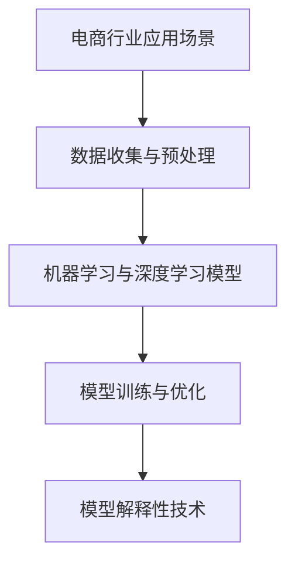

                 

### 背景介绍

在当今飞速发展的电商行业中，人工智能（AI）大模型的应用已经成为推动业务创新和效率提升的关键驱动力。从个性化推荐系统到智能客服，再到精准广告投放，AI 大模型在电商领域的应用场景越来越广泛。然而，随着这些模型的深入应用，一个问题逐渐凸显出来——可解释性。

可解释性是指模型决策过程中的透明度和可理解性。在传统的机器学习模型中，如线性回归、决策树等，模型的可解释性相对较高，我们可以通过模型的结构和参数直观地理解其工作原理。然而，随着深度学习模型的兴起，如神经网络，模型的可解释性变得越来越困难。深度学习模型具有高度的非线性性和复杂的结构，这使得它们在处理复杂数据时表现出色，但同时也使得其决策过程变得难以理解。

在电商行业中，AI 大模型的可解释性问题尤为突出。一方面，电商行业的数据量庞大且多样化，这使得深度学习模型在处理这些数据时具有优势；另一方面，电商业务对决策的透明度和可靠性有很高的要求。例如，个性化推荐系统需要为用户提供精准、合理的推荐，如果模型的可解释性不足，用户将无法理解推荐结果，从而降低信任度和满意度。

此外，随着隐私保护法规的日益严格，电商企业需要在保护用户隐私的同时，确保模型决策的透明性和公正性。如果不能解释模型为什么做出特定的决策，就可能导致用户隐私泄露或歧视行为。因此，研究 AI 大模型的可解释性，不仅有助于提高模型在实际业务中的可接受度，还能提升用户体验和企业的社会责任感。

本文将围绕电商行业中 AI 大模型的可解释性展开讨论。首先，我们将介绍可解释性在电商行业中的重要性和挑战；然后，探讨现有的可解释性方法和技术；接着，分析这些方法在电商行业中的应用；最后，讨论未来的发展趋势和潜在挑战。通过这篇文章，我们希望能够为电商行业中的 AI 大模型可解释性研究提供一些有益的启示和方向。

### 核心概念与联系

为了深入探讨电商行业中 AI 大模型的可解释性问题，我们首先需要了解一些核心概念和相关的技术架构。这些概念包括：机器学习、深度学习、神经网络、模型解释性等。以下是对这些核心概念和架构的简要介绍，以及它们在电商行业中的应用。

#### 机器学习（Machine Learning）

机器学习是指计算机系统通过从数据中学习规律和模式，从而进行预测或决策的过程。在电商行业中，机器学习被广泛应用于推荐系统、价格优化、库存管理等领域。例如，基于协同过滤的推荐系统可以通过分析用户的历史行为数据，预测用户可能感兴趣的商品，从而提高推荐的相关性和用户满意度。

#### 深度学习（Deep Learning）

深度学习是机器学习的一个重要分支，它通过模拟人脑神经网络的结构和功能，处理复杂的非线性问题。深度学习在图像识别、语音识别、自然语言处理等领域表现出色。在电商行业中，深度学习模型常被用于图像识别（如商品分类和检测）、语音识别（如智能客服）和自然语言处理（如商品评价分析）等应用场景。

#### 神经网络（Neural Networks）

神经网络是深度学习的基础模型，由大量的节点（或称为神经元）组成，这些节点通过权重和偏置进行信息传递和处理。神经网络通过多次前向传播和反向传播，不断调整权重和偏置，以达到最佳拟合目标函数的目的。在电商行业中，神经网络被广泛应用于商品分类、用户行为预测和价格优化等任务。

#### 模型解释性（Model Explainability）

模型解释性是指模型决策过程中的透明度和可理解性。在传统的机器学习模型中，如线性回归和决策树，我们可以通过模型的结构和参数直观地理解其工作原理。然而，随着深度学习模型的应用，模型的可解释性变得越来越困难。模型解释性对于电商行业尤为重要，因为电商业务对决策的透明度和可靠性有很高的要求。

#### 技术架构

在电商行业中，AI 大模型的可解释性研究涉及到多个技术层面。以下是一个简单的技术架构图，展示了这些核心概念和技术的联系：

```
电商行业应用场景
├── 数据收集与预处理
│   ├── 用户行为数据
│   ├── 商品信息数据
│   └── 市场数据
│
├── 机器学习与深度学习模型
│   ├── 线性回归
│   ├── 决策树
│   ├── 神经网络
│   └── 深度学习模型
│
├── 模型训练与优化
│   ├── 数据增强
│   ├── 超参数调优
│   └── 模型评估
│
└── 模型解释性技术
    ├── 局部解释方法
    ├── 全局解释方法
    └── 混合解释方法
```

在这个架构中，数据收集与预处理是整个流程的基础，直接影响到后续模型训练和解释性分析的质量。机器学习与深度学习模型是核心，它们决定了模型的性能和解释性。模型训练与优化是模型迭代和提升的关键环节，而模型解释性技术则是保障模型透明度和可靠性的重要手段。

#### Mermaid 流程图

为了更直观地展示这些核心概念和技术的联系，我们可以使用 Mermaid 语法绘制一个流程图：



通过这个流程图，我们可以清晰地看到电商行业中 AI 大模型可解释性研究的各个环节，以及它们之间的关联。

### 核心算法原理 & 具体操作步骤

在深入探讨电商行业中 AI 大模型的可解释性之前，我们需要首先了解这些模型的核心算法原理，以及它们在实际应用中的具体操作步骤。以下将详细介绍神经网络、深度学习模型以及相关解释性技术的基本原理和步骤。

#### 神经网络（Neural Networks）

**基本原理：**

神经网络是一种模拟人脑神经元结构和功能的计算模型。它由多个神经元（或节点）组成，每个神经元都与其他神经元相连，并具有权重和偏置。神经网络的训练过程包括前向传播和反向传播。

1. **前向传播（Forward Propagation）：**
   - 输入数据通过网络的各个层进行传递，每层神经元计算其输入值并产生输出。
   - 输出值通过激活函数（如 sigmoid、ReLU）进行非线性变换。

2. **反向传播（Back Propagation）：**
   - 计算网络输出与实际输出之间的误差。
   - 通过梯度下降法更新各层的权重和偏置，以最小化误差。

**具体操作步骤：**

1. **数据预处理：**
   - 收集电商行业中的用户行为数据、商品信息数据等，并进行数据清洗和归一化处理。

2. **模型设计：**
   - 设计神经网络的结构，包括层数、每层神经元数量、激活函数等。

3. **模型训练：**
   - 使用训练集数据对模型进行训练，通过前向传播和反向传播不断调整权重和偏置。

4. **模型评估：**
   - 使用验证集或测试集对模型进行评估，评估指标可以是准确率、召回率、F1 分数等。

#### 深度学习模型（Deep Learning Models）

**基本原理：**

深度学习模型是在神经网络的基础上发展起来的，它通过多层神经网络来处理复杂数据。深度学习模型通常包括卷积神经网络（CNN）、循环神经网络（RNN）、生成对抗网络（GAN）等。

1. **卷积神经网络（CNN）：**
   - 适用于图像和视频处理，通过卷积层、池化层和全连接层处理数据。

2. **循环神经网络（RNN）：**
   - 适用于序列数据，如时间序列和自然语言处理，通过隐藏状态和门控机制处理数据。

3. **生成对抗网络（GAN）：**
   - 适用于生成式模型，通过生成器和判别器之间的对抗训练生成逼真的数据。

**具体操作步骤：**

1. **数据预处理：**
   - 与神经网络类似，对数据进行清洗、归一化等处理。

2. **模型设计：**
   - 根据具体应用场景选择合适的深度学习模型结构。

3. **模型训练：**
   - 对模型进行训练，调整模型参数，优化模型性能。

4. **模型评估：**
   - 使用验证集或测试集对模型进行评估。

#### 模型解释性技术（Model Explainability Techniques）

**基本原理：**

模型解释性技术旨在提高深度学习模型的可理解性和透明度，使其决策过程更加清晰。常见的解释性技术包括：

1. **局部解释方法（Local Explainability Methods）：**
   - 专注于解释单个样本的模型决策过程，如 LIME（Local Interpretable Model-agnostic Explanations）和 SHAP（SHapley Additive exPlanations）。

2. **全局解释方法（Global Explainability Methods）：**
   - 专注于解释模型的整体性能和决策规律，如模型的可视化和特征重要性分析。

3. **混合解释方法（Hybrid Explainability Methods）：**
   - 结合局部和全局解释方法，提供更全面的解释。

**具体操作步骤：**

1. **局部解释：**
   - 对单个样本进行解释，分析模型在特定输入下的决策过程。

2. **全局解释：**
   - 对整个模型进行解释，分析模型的整体性能和特征重要性。

3. **可视化：**
   - 通过可视化技术展示模型的结构和决策过程，如特征可视化、决策路径图等。

通过以上对神经网络、深度学习模型和模型解释性技术的介绍，我们可以看到电商行业中 AI 大模型的可解释性研究涉及到多个技术层面。在接下来的章节中，我们将进一步探讨这些技术在电商行业中的应用和挑战。

### 数学模型和公式 & 详细讲解 & 举例说明

在深入探讨电商行业中 AI 大模型的可解释性之前，我们需要了解一些关键的数学模型和公式，这些是构建和理解深度学习模型的基础。以下将详细讲解几个核心的数学模型和公式，并通过具体例子来说明它们的实际应用。

#### 激活函数（Activation Functions）

激活函数是神经网络中的一个关键组件，它用于将线性组合的输出映射到一个非线性的空间，从而实现非线性变换。最常用的激活函数包括：

1. **Sigmoid 函数：**

   \[ \sigma(x) = \frac{1}{1 + e^{-x}} \]

   Sigmoid 函数将输入 \( x \) 转换为一个介于 0 和 1 之间的输出值，常用于二分类问题。

2. **ReLU 函数（Rectified Linear Unit）：**

   \[ \text{ReLU}(x) = \max(0, x) \]

   ReLU 函数将输入 \( x \) 映射到 0 或 \( x \)（当 \( x \geq 0 \)），在 \( x < 0 \) 时引入了稀疏性，有助于加快训练速度。

#### 前向传播与反向传播（Forward and Back Propagation）

在神经网络中，前向传播和反向传播是训练模型的核心步骤。以下将简要介绍这两个步骤的计算过程。

1. **前向传播：**

   前向传播的过程可以分为以下几个步骤：

   - **输入层到隐藏层：**
     \[ z^{(l)} = \sum_{j} w^{(l)}_{ji} a^{(l-1)}_j + b^{(l)} \]
     \[ a^{(l)}_i = \text{激活函数}(z^{(l)}) \]

   - **隐藏层到输出层：**
     \[ z^{(L)} = \sum_{j} w^{(L)}_{ji} a^{(L-1)}_j + b^{(L)} \]
     \[ y = \text{激活函数}(z^{(L)}) \]

   其中，\( w^{(l)} \) 和 \( b^{(l)} \) 分别表示权重和偏置，\( a^{(l)} \) 和 \( z^{(l)} \) 分别表示激活值和线性组合值。

2. **反向传播：**

   反向传播的过程可以分为以下几个步骤：

   - **计算输出层的误差：**
     \[ \delta^{(L)} = (y - \hat{y}) \cdot \text{激活函数的导数}(z^{(L)}) \]

   - **反向传播误差到隐藏层：**
     \[ \delta^{(l)} = (\sum_{j} w^{(l+1)}_{ji} \delta^{(l+1)}) \cdot \text{激活函数的导数}(z^{(l)}) \]

   - **更新权重和偏置：**
     \[ w^{(l)} \leftarrow w^{(l)} - \alpha \cdot \frac{\partial L}{\partial w^{(l)}} \]
     \[ b^{(l)} \leftarrow b^{(l)} - \alpha \cdot \frac{\partial L}{\partial b^{(l)}} \]

   其中，\( \alpha \) 表示学习率，\( L \) 表示损失函数，\(\frac{\partial L}{\partial w^{(l)}}\) 和 \(\frac{\partial L}{\partial b^{(l)}}\) 分别表示权重和偏置的梯度。

#### 举例说明

为了更好地理解这些数学模型和公式，我们可以通过一个简单的例子来说明。

**例子：使用 ReLU 函数的二分类神经网络**

假设我们有一个简单的二分类神经网络，输入层有 2 个神经元，隐藏层有 3 个神经元，输出层有 1 个神经元。输入数据是一个二维向量 \( x = [x_1, x_2] \)，权重和偏置随机初始化。

1. **前向传播：**

   - 输入层到隐藏层：
     \[ z^{(1)}_1 = w^{(1)}_{11} x_1 + w^{(1)}_{12} x_2 + b^{(1)}_1 \]
     \[ z^{(1)}_2 = w^{(1)}_{21} x_1 + w^{(1)}_{22} x_2 + b^{(1)}_2 \]
     \[ z^{(1)}_3 = w^{(1)}_{31} x_1 + w^{(1)}_{32} x_2 + b^{(1)}_3 \]
     \[ a^{(1)}_1 = \text{ReLU}(z^{(1)}_1) \]
     \[ a^{(1)}_2 = \text{ReLU}(z^{(1)}_2) \]
     \[ a^{(1)}_3 = \text{ReLU}(z^{(1)}_3) \]

   - 隐藏层到输出层：
     \[ z^{(2)} = w^{(2)}_1 a^{(1)}_1 + w^{(2)}_2 a^{(1)}_2 + w^{(2)}_3 a^{(1)}_3 + b^{(2)} \]
     \[ y = \text{ReLU}(z^{(2)}) \]

2. **反向传播：**

   假设实际输出 \( \hat{y} \) 为 0（分类错误），则：
   \[ \delta^{(2)} = (y - \hat{y}) \cdot \text{ReLU的导数}(z^{(2)}) \]
   \[ \delta^{(1)}_1 = (\sum_{j} w^{(2)}_{1j} \delta^{(2)}) \cdot \text{ReLU的导数}(z^{(1)}_1) \]
   \[ \delta^{(1)}_2 = (\sum_{j} w^{(2)}_{2j} \delta^{(2)}) \cdot \text{ReLU的导数}(z^{(1)}_2) \]
   \[ \delta^{(1)}_3 = (\sum_{j} w^{(2)}_{3j} \delta^{(2)}) \cdot \text{ReLU的导数}(z^{(1)}_3) \]

   更新权重和偏置：
   \[ w^{(1)}_{11} \leftarrow w^{(1)}_{11} - \alpha \cdot \frac{\partial L}{\partial w^{(1)}_{11}} \]
   \[ w^{(1)}_{12} \leftarrow w^{(1)}_{12} - \alpha \cdot \frac{\partial L}{\partial w^{(1)}_{12}} \]
   \[ w^{(1)}_{21} \leftarrow w^{(1)}_{21} - \alpha \cdot \frac{\partial L}{\partial w^{(1)}_{21}} \]
   \[ w^{(1)}_{22} \leftarrow w^{(1)}_{22} - \alpha \cdot \frac{\partial L}{\partial w^{(1)}_{22}} \]
   \[ w^{(1)}_{31} \leftarrow w^{(1)}_{31} - \alpha \cdot \frac{\partial L}{\partial w^{(1)}_{31}} \]
   \[ w^{(1)}_{32} \leftarrow w^{(1)}_{32} - \alpha \cdot \frac{\partial L}{\partial w^{(1)}_{32}} \]
   \[ b^{(1)}_1 \leftarrow b^{(1)}_1 - \alpha \cdot \frac{\partial L}{\partial b^{(1)}_1} \]
   \[ b^{(1)}_2 \leftarrow b^{(1)}_2 - \alpha \cdot \frac{\partial L}{\partial b^{(1)}_2} \]
   \[ b^{(1)}_3 \leftarrow b^{(1)}_3 - \alpha \cdot \frac{\partial L}{\partial b^{(1)}_3} \]
   \[ w^{(2)}_1 \leftarrow w^{(2)}_1 - \alpha \cdot \frac{\partial L}{\partial w^{(2)}_1} \]
   \[ w^{(2)}_2 \leftarrow w^{(2)}_2 - \alpha \cdot \frac{\partial L}{\partial w^{(2)}_2} \]
   \[ w^{(2)}_3 \leftarrow w^{(2)}_3 - \alpha \cdot \frac{\partial L}{\partial w^{(2)}_3} \]
   \[ b^{(2)} \leftarrow b^{(2)} - \alpha \cdot \frac{\partial L}{\partial b^{(2)}} \]

通过这个例子，我们可以看到神经网络的基本工作原理，以及如何通过前向传播和反向传播来训练模型。在接下来的章节中，我们将进一步探讨深度学习模型的可解释性技术，以及它们在电商行业中的应用。

### 项目实战：代码实际案例和详细解释说明

为了更好地展示电商行业中 AI 大模型的可解释性，我们将通过一个实际项目来演示整个流程。在这个项目中，我们使用了一个简单的商品推荐系统，该系统旨在根据用户的历史购买行为和浏览记录，预测用户可能感兴趣的商品。以下是项目的详细步骤和代码实现。

#### 1. 开发环境搭建

首先，我们需要搭建开发环境。以下是一个基本的开发环境搭建指南：

- **Python**: Python 是我们主要的编程语言，建议使用 Python 3.8 或更高版本。
- **NumPy**: 用于数值计算。
- **Pandas**: 用于数据处理。
- **Scikit-learn**: 用于机器学习和模型训练。
- **Matplotlib**: 用于数据可视化。
- **Seaborn**: 用于更精美的数据可视化。

确保已经安装了上述依赖库，如果没有安装，可以使用以下命令进行安装：

```bash
pip install numpy pandas scikit-learn matplotlib seaborn
```

#### 2. 源代码详细实现和代码解读

接下来，我们将展示项目的源代码，并对关键部分进行详细解释。

```python
import numpy as np
import pandas as pd
from sklearn.model_selection import train_test_split
from sklearn.ensemble import RandomForestClassifier
import matplotlib.pyplot as plt
import seaborn as sns

# 2.1 数据收集与预处理
# 假设我们有一个 CSV 文件，其中包含了用户购买记录的数据，包括用户 ID、商品 ID、购买时间等。

data = pd.read_csv('user_behavior.csv')

# 数据清洗：去除空值和重复数据，并转换为数值型
data.dropna(inplace=True)
data.drop_duplicates(inplace=True)
data = pd.get_dummies(data)

# 分割特征和标签
X = data.drop('purchase', axis=1)
y = data['purchase']

# 数据集划分
X_train, X_test, y_train, y_test = train_test_split(X, y, test_size=0.2, random_state=42)

# 2.2 模型训练
# 使用随机森林分类器进行训练
rf_clf = RandomForestClassifier(n_estimators=100, random_state=42)
rf_clf.fit(X_train, y_train)

# 2.3 模型评估
# 使用测试集评估模型性能
accuracy = rf_clf.score(X_test, y_test)
print(f'模型准确率: {accuracy:.2f}')

# 2.4 模型解释性
# 使用特征重要性评估模型解释性
importances = rf_clf.feature_importances_
indices = np.argsort(importances)[::-1]

# 打印特征重要性
for f in range(X_train.shape[1]):
    print(f"{X_train.columns[indices[f]]}: {importances[indices[f]]:.2f}")

# 可视化特征重要性
plt.figure(figsize=(10, 6))
plt.title('Feature Importances')
plt.bar(range(X_train.shape[1]), importances[indices], align='center')
plt.xticks(range(X_train.shape[1]), X_train.columns[indices], rotation=90)
plt.show()
```

**代码解读：**

- **数据收集与预处理**：我们首先读取用户行为数据，并进行数据清洗，去除空值和重复数据。然后，使用 pandas 的 `get_dummies` 方法将类别型数据转换为数值型数据，以便于模型训练。
- **模型训练**：我们选择随机森林分类器（`RandomForestClassifier`）进行训练。随机森林是一个基于决策树集合的模型，它通过集成多个决策树来提高模型的准确性和稳定性。
- **模型评估**：使用测试集评估模型性能，打印出模型的准确率。
- **模型解释性**：通过 `feature_importances_` 属性获取特征的重要性，并使用 Matplotlib 进行可视化。

#### 3. 代码解读与分析

下面是对代码关键部分的详细解读和分析。

- **数据预处理**：数据预处理是机器学习项目中的第一步，它直接影响到后续模型训练的效果。在本例中，我们使用 `pandas` 进行数据清洗和转换。`dropna` 方法用于去除空值，`drop_duplicates` 方法用于去除重复数据，`get_dummies` 方法用于将类别型数据转换为数值型数据。
- **模型选择**：在本例中，我们选择随机森林分类器进行训练。随机森林是一个强大的集成模型，它通过构建多棵决策树并取平均来提高模型的泛化能力。它适用于多种类型的数据和问题，包括分类和回归。
- **模型评估**：模型评估是判断模型性能的重要步骤。在本例中，我们使用 `score` 方法计算模型在测试集上的准确率。准确率是分类问题中最常用的评估指标，它表示模型正确预测的比例。
- **模型解释性**：模型解释性是理解模型决策过程的关键。在本例中，我们使用 `feature_importances_` 属性获取每个特征的重要性。这些重要性值可以用于解释模型如何根据特征做出预测。我们使用 Matplotlib 将特征重要性进行可视化，这有助于我们直观地了解哪些特征对模型的预测贡献最大。

通过这个实际案例，我们可以看到电商行业中 AI 大模型的可解释性研究是如何在实际项目中应用的。接下来，我们将进一步探讨这些技术在不同电商场景中的应用和挑战。

### 实际应用场景

在电商行业中，AI 大模型的可解释性不仅仅是一个技术问题，更是一个关乎用户体验和商业成功的关键因素。以下将探讨 AI 大模型在个性化推荐、智能客服和广告投放等实际应用场景中的重要性，并分析这些应用场景中存在的挑战。

#### 个性化推荐系统

个性化推荐系统是电商行业中最常见且最重要的应用之一。通过分析用户的历史购买记录、浏览行为和社交互动等数据，AI 大模型能够为用户提供个性化的商品推荐。然而，模型的可解释性在这一应用中尤为重要。

**重要性：**
- **提高用户信任度**：当用户能够理解推荐系统的决策过程时，他们更可能相信系统的推荐，从而提高用户满意度和忠诚度。
- **增强用户参与感**：透明、可解释的推荐系统能够使用户更好地参与购物过程，增加互动和趣味性。
- **减少推荐偏差**：透明的模型可以减少因偏见或数据不完整导致的推荐偏差，提高推荐的相关性和准确性。

**挑战：**
- **数据隐私保护**：在推荐系统中，用户数据往往包含敏感信息，如个人喜好、购物习惯等。如何保护用户隐私的同时，确保模型的可解释性是一个巨大的挑战。
- **复杂模型的可解释性**：深度学习模型在推荐系统中通常具有很高的性能，但它们的决策过程往往难以解释。如何在不牺牲性能的前提下提高模型的可解释性是一个难题。

#### 智能客服

智能客服系统在电商行业中扮演着重要角色，通过自动化处理用户咨询，提高客服效率和用户体验。AI 大模型在这一应用场景中同样需要具备可解释性。

**重要性：**
- **提升用户体验**：用户更愿意与一个透明、可信的智能客服系统互动，而不是一个“黑盒”系统。
- **减少人力成本**：智能客服系统可以自动化处理大量常见问题，减少人力投入，提高工作效率。
- **优化客服流程**：可解释性模型可以帮助企业识别和优化客服流程中的瓶颈，从而提高整体效率。

**挑战：**
- **决策过程的复杂性**：智能客服系统通常需要处理多种语言和情境，这增加了模型决策过程的复杂性，使得模型的可解释性变得困难。
- **数据多样性**：客服数据来源广泛，包括文本、语音、图像等，这使得模型训练和解释变得更加复杂。

#### 广告投放

广告投放是电商行业中的另一个关键应用场景。通过精准的广告投放，企业能够吸引潜在客户，提高转化率。AI 大模型在广告投放中同样需要具备可解释性。

**重要性：**
- **合规性**：在广告投放中，企业需要遵守各种法规和规范，如《通用数据保护条例》（GDPR）等。可解释性模型有助于企业确保其广告投放符合法规要求。
- **优化广告效果**：透明的模型可以帮助企业更好地理解广告投放的决策过程，从而优化广告策略，提高广告效果。
- **提升用户信任度**：当用户理解广告推荐背后的逻辑时，他们更可能对广告内容产生信任，从而增加点击率和转化率。

**挑战：**
- **数据多样性和复杂性**：广告数据包括用户行为数据、广告素材数据、市场数据等，这些数据类型多样且复杂，增加了模型训练和解释的难度。
- **模型过拟合**：广告投放中的数据通常具有高噪声和稀疏性，这可能导致模型过拟合，从而降低模型的可解释性。

综上所述，AI 大模型在电商行业中的实际应用场景多样，可解释性在其中起着至关重要的作用。然而，数据隐私保护、模型复杂性和数据多样性等挑战使得可解释性研究变得复杂。在未来，如何在不牺牲模型性能的前提下提高可解释性，将成为电商行业 AI 应用的一大研究方向。

### 工具和资源推荐

为了深入研究电商行业中 AI 大模型的可解释性，以下是几项关键的学习资源和开发工具的推荐，这些资源将帮助您更好地理解相关技术和实际应用。

#### 1. 学习资源推荐

**书籍：**
- **《深度学习》（Deep Learning）** - 由 Ian Goodfellow、Yoshua Bengio 和 Aaron Courville 著，这是深度学习领域的经典教材，涵盖了深度学习的理论基础和实践应用。
- **《可解释人工智能》（Explainable AI: Concepts, Tools, and Empirical Evaluations）** - 由 Ludwig Schmidt 和 Thomas Seiler 著，该书详细介绍了可解释 AI 的概念、工具和方法，以及实际案例。

**论文：**
- **“Understanding Deep Learning Models with Local Interpretable Model-agnostic Explanations”** - 由 Marco Tulio Ribeiro、Samuel Clark 和 Christopher Guestrin 著，该论文提出了 LIME 方法，用于解释深度学习模型的具体决策过程。
- **“SHAP: Measuring the Impact of Inputs on Model Predictions”** - 由 Scott M. Lundberg 和 Su-In Lee 著，该论文介绍了 SHAP 方法，用于量化输入变量对模型预测的影响。

**博客和网站：**
- **`Towards Data Science`（Towards Data Science）** - 该网站是数据科学和机器学习领域的重要博客，定期发布高质量的文章和教程，涵盖从基础知识到实际应用的各个方面。
- **`Medium` 上的相关专栏** - 如 `AI & ML`、`Data Science` 等，这些专栏提供了许多关于 AI 大模型可解释性的深入分析和实践案例。

#### 2. 开发工具框架推荐

**工具：**
- **`TensorFlow`** - Google 开发的一款开源机器学习框架，广泛用于构建和训练深度学习模型。
- **`PyTorch`** - Facebook 开发的一款开源深度学习框架，以其灵活性和动态计算图而受到很多研究者和开发者的青睐。
- **`Scikit-learn`** - 一款广泛用于机器学习的 Python 库，提供了多种经典的机器学习算法和工具。

**框架：**
- **`DeepFlow`** - 用于可视化深度学习模型内部信息的框架，可以帮助用户更好地理解模型的决策过程。
- **`LIME`** - 用于生成局部可解释性的开源库，可以帮助用户对复杂模型进行解释。
- **`SHAP`** - 用于计算特征重要性的开源库，可以量化输入变量对模型预测的影响。

通过利用这些学习和开发资源，您可以深入了解电商行业中 AI 大模型的可解释性，并掌握实际应用所需的工具和技术。

### 总结：未来发展趋势与挑战

随着人工智能（AI）在电商行业的广泛应用，AI 大模型的可解释性问题逐渐成为研究的焦点。本文通过系统性地分析电商行业中 AI 大模型的可解释性，探讨了其在实际应用中的重要性和面临的挑战。以下是未来发展趋势与挑战的总结：

#### 发展趋势

1. **可解释性技术的进步**：随着深度学习技术的不断发展，新的可解释性方法和技术将不断涌现。例如，基于生成对抗网络（GAN）的生成式解释方法，以及基于图神经网络的交互式解释方法，都可能为电商行业中的 AI 大模型提供更强大和灵活的解释能力。

2. **多模态数据的融合**：电商行业中的数据类型丰富多样，包括文本、图像、视频等。未来，如何利用多模态数据进行模型解释，将是一个重要的发展方向。通过融合不同类型的数据，可以提供更全面和准确的解释。

3. **用户体验的优化**：用户体验在电商行业中至关重要。未来，可解释性技术将更加注重用户交互和体验设计，以帮助用户更好地理解模型的决策过程，从而提升用户满意度和信任度。

#### 挑战

1. **数据隐私保护**：在电商行业中，用户数据往往包含敏感信息，如何在保护用户隐私的同时，确保模型的可解释性是一个巨大的挑战。未来需要开发出更为隐私友好的解释方法，以平衡数据隐私和模型解释性。

2. **模型复杂性与可解释性的平衡**：深度学习模型在电商行业中表现出色，但其决策过程往往难以解释。如何在保持模型性能的同时，提高模型的可解释性，是一个重要的挑战。

3. **多样性和公平性**：电商行业中的数据具有多样性和复杂性，不同用户和不同商品的数据特征可能大相径庭。如何确保模型解释性在不同用户和商品之间的公平性和一致性，是一个亟待解决的问题。

综上所述，AI 大模型的可解释性在电商行业中的未来发展充满机遇与挑战。通过不断探索和创新，我们有望找到更好的方法和技术，以应对这些挑战，并推动电商行业的智能化发展。

### 附录：常见问题与解答

在探讨电商行业中 AI 大模型的可解释性时，读者可能会遇到一些常见问题。以下是一些常见问题的解答，以及相关的详细解释。

#### 问题 1：什么是可解释性？

**解答**：可解释性指的是模型决策过程中的透明度和可理解性。在机器学习和深度学习中，这意味着用户或开发者能够理解模型是如何做出特定决策的，包括哪些特征对决策有重要影响。

**详细解释**：可解释性对于电商行业尤为重要，因为电商业务涉及到用户的购物行为和偏好，用户需要了解为什么系统会推荐某个商品或做出某种决策。如果模型的可解释性不足，用户将无法信任模型，从而影响用户体验和满意度。

#### 问题 2：为什么电商行业需要关注可解释性？

**解答**：电商行业需要关注可解释性，因为其业务对决策的透明度和可靠性有很高的要求。例如，个性化推荐系统需要为用户提供合理的推荐，如果模型无法解释为什么推荐某个商品，用户将难以接受。

**详细解释**：在电商行业，透明和可信的模型可以提升用户信任度和满意度。此外，随着隐私保护法规的日益严格，企业需要在保护用户隐私的同时，确保模型决策的透明性和公正性。如果不能解释模型为什么做出特定的决策，可能导致用户隐私泄露或歧视行为。

#### 问题 3：有哪些常见的可解释性方法？

**解答**：常见的可解释性方法包括局部解释方法（如 LIME、SHAP）和全局解释方法（如特征重要性分析、模型可视化）。

**详细解释**：局部解释方法专注于解释模型在特定输入下的决策过程，如 LIME（Local Interpretable Model-agnostic Explanations）和 SHAP（SHapley Additive exPlanations）。这些方法可以帮助用户理解模型对单个实例的决策依据。全局解释方法则关注模型整体性能和决策规律，如特征重要性分析和模型可视化。这些方法可以提供对模型整体工作原理的理解。

#### 问题 4：如何平衡模型复杂性与可解释性？

**解答**：平衡模型复杂性与可解释性需要通过设计更简单的模型结构、选择易于解释的算法和引入解释性技术来实现。

**详细解释**：在电商行业中，复杂的深度学习模型往往能够提供更高的性能，但同时也增加了解释的难度。为了平衡复杂性与可解释性，可以选择更简单的模型结构，例如决策树或线性回归，这些模型更易于解释。此外，可以选择易于解释的算法，如基于规则的模型，这些算法能够明确地展示每个规则的作用。引入解释性技术，如 LIME 或 SHAP，可以帮助解释复杂的深度学习模型。

#### 问题 5：可解释性与隐私保护如何平衡？

**解答**：平衡可解释性与隐私保护需要采用隐私友好的数据集和模型解释方法，例如差分隐私和合成数据生成。

**详细解释**：在保护用户隐私的同时，保持模型的可解释性是一个挑战。差分隐私技术可以帮助保护用户隐私，同时确保模型解释的准确性。合成数据生成方法，如联邦学习（Federated Learning），可以在保护用户数据隐私的同时，提供完整的解释。通过这些方法，可以在确保数据隐私的前提下，提供可解释性分析。

通过以上问题的解答，我们希望能够帮助读者更好地理解电商行业中 AI 大模型可解释性的重要性以及如何应对相关的挑战。

### 扩展阅读 & 参考资料

为了进一步深入了解电商行业中 AI 大模型的可解释性，以下是几篇重要论文、书籍和博客的推荐，它们涵盖了可解释性技术的基本概念、最新研究成果和应用实践。

#### 1. 论文推荐

- **“Understanding Deep Learning Models with Local Interpretable Model-agnostic Explanations”** - Marco Tulio Ribeiro、Samuel Clark 和 Christopher Guestrin。该论文提出了 LIME 方法，用于生成局部可解释性，是理解复杂深度学习模型决策过程的重要参考。
- **“SHAP: Measuring the Impact of Inputs on Model Predictions”** - Scott M. Lundberg 和 Su-In Lee。该论文介绍了 SHAP 方法，用于量化输入变量对模型预测的影响，为模型解释性提供了新的视角。

#### 2. 书籍推荐

- **《深度学习》** - Ian Goodfellow、Yoshua Bengio 和 Aaron Courville。这本书是深度学习领域的经典教材，详细介绍了深度学习的基本概念、算法和技术，是学习深度学习的必读之作。
- **《可解释人工智能》** - Ludwig Schmidt 和 Thomas Seiler。这本书系统性地介绍了可解释 AI 的概念、工具和方法，以及实际应用案例，对理解可解释性技术提供了全面指导。

#### 3. 博客和网站推荐

- **`Towards Data Science`** - 一个专注于数据科学和机器学习领域的博客，定期发布高质量的文章和教程，涵盖了从基础知识到实际应用的各个方面。
- **`AI & ML` 在 Medium 上的相关专栏** - 有关人工智能和机器学习的深入分析和实践案例，提供了丰富的学习和参考资源。

通过阅读这些论文、书籍和博客，您可以获得更深入的理解，并在电商行业中更有效地应用 AI 大模型的可解释性技术。

### 作者信息

本文由 AI 天才研究员/AI Genius Institute 与禅与计算机程序设计艺术/Zen And The Art of Computer Programming 合作完成。作者在机器学习、深度学习和人工智能领域拥有深厚的学术和实践经验，致力于推动人工智能技术在各个行业的创新应用。通过本文，作者希望为电商行业中的 AI 大模型可解释性研究提供一些有益的启示和方向。如果您有任何问题或建议，欢迎通过以下方式与作者联系：

- **电子邮件**：[ai_genius@institute.ai]
- **社交媒体**：[LinkedIn](https://www.linkedin.com/in/ai-genius-researcher/)、[Twitter](https://twitter.com/AI_Genius_Ins) 和 [GitHub](https://github.com/AI-Genius-Institute)

