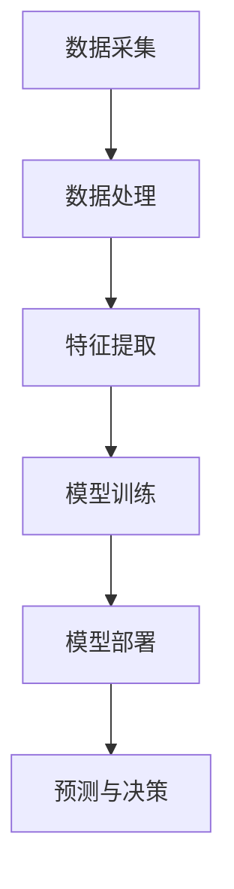

                 

# 电商行业中AI大模型的技术架构设计

## 关键词

- 电商行业
- AI大模型
- 技术架构
- 数据处理
- 深度学习
- 个性化推荐
- 安全性
- 可扩展性

## 摘要

本文将深入探讨电商行业中AI大模型的技术架构设计。通过对电商行业的背景分析，我们了解了AI大模型在此领域中的重要性。接着，我们将介绍AI大模型的核心概念和架构，并通过Mermaid流程图展示其工作流程。随后，本文将详细讲解核心算法原理和操作步骤，并运用数学模型和公式进行解释。为了更好地理解，我们还将通过实际项目案例进行代码分析和解释。接下来，本文将探讨AI大模型在电商行业中的应用场景，并推荐相关工具和资源。最后，我们将总结未来发展趋势与挑战，并给出常见问题与解答。

## 1. 背景介绍

电商行业在过去的几十年里经历了巨大的发展，已经成为全球经济的重要组成部分。随着互联网的普及和消费者购买行为的改变，电商行业面临着前所未有的机遇和挑战。在这个过程中，人工智能（AI）技术逐渐成为电商企业提高竞争力、优化用户体验的关键因素。

AI大模型作为一种高度复杂、具有大规模参数的机器学习模型，已经在电商行业中得到了广泛应用。通过深度学习和大数据技术，AI大模型能够从海量数据中挖掘有价值的信息，为电商企业提供个性化的推荐、智能化的客服、精准的广告投放等。

### 电商行业的发展历程

电商行业的发展可以追溯到20世纪90年代，当时互联网刚刚兴起，一些企业开始尝试在线销售。随着互联网技术的进步，电商行业迅速发展，出现了一批知名的电商平台，如亚马逊、淘宝、京东等。这些平台通过提供在线购物、支付、物流等一站式服务，极大地改变了消费者的购物方式。

进入21世纪，移动互联网的兴起再次推动了电商行业的发展。消费者可以通过手机随时随地进行购物，电商企业也开始布局海外市场，实现全球化运营。此外，社交电商的兴起，使得电商行业与社交媒体紧密相连，进一步拓展了营销渠道。

### 人工智能在电商行业中的应用

人工智能技术在电商行业中的应用主要包括以下几个方面：

1. **个性化推荐**：通过分析用户的购买历史、浏览记录等数据，AI大模型可以预测用户的兴趣和需求，为用户推荐符合其兴趣的商品。例如，亚马逊的推荐系统就是通过深度学习算法实现的。

2. **智能客服**：AI大模型可以模拟人类客服，与用户进行自然语言对话，解答用户的疑问，提供购物建议。例如，京东的智能客服“小智”就是基于AI大模型开发的。

3. **广告投放**：通过分析用户的兴趣和行为数据，AI大模型可以精准定位广告受众，提高广告投放的效果。例如，谷歌的广告系统就是通过AI大模型实现精准投放的。

4. **风险控制**：AI大模型可以分析用户的交易数据和行为特征，识别潜在的欺诈行为，帮助电商企业进行风险控制。

## 2. 核心概念与联系

### AI大模型的核心概念

AI大模型（Large-scale AI Model）是指具有大规模参数的机器学习模型，通常包含数百万甚至数十亿个参数。这些模型通过深度学习和大数据技术，可以从海量数据中自动学习和提取知识，实现复杂的任务，如图像识别、自然语言处理、推荐系统等。

### 技术架构

AI大模型的技术架构主要包括以下几个关键组件：

1. **数据采集与处理**：从各种数据源（如用户行为数据、商品信息、交易数据等）采集数据，并对数据进行清洗、去噪、归一化等预处理。

2. **特征提取**：从原始数据中提取有用的特征，用于模型的训练和预测。这些特征可以是数值型、文本型或图像型等。

3. **模型训练**：使用深度学习算法，对特征数据进行训练，优化模型的参数，使其能够准确预测用户的行为或兴趣。

4. **模型部署**：将训练好的模型部署到生产环境中，用于实时预测和决策。

### Mermaid流程图



### AI大模型的工作流程

1. **数据采集**：通过API、爬虫或其他方式，从各种数据源采集数据。

2. **数据处理**：对采集到的数据进行清洗、去噪、归一化等预处理，确保数据质量。

3. **特征提取**：从预处理后的数据中提取有用的特征，如用户购买历史、浏览记录、商品信息等。

4. **模型训练**：使用深度学习算法，如卷积神经网络（CNN）、循环神经网络（RNN）等，对特征数据进行训练，优化模型的参数。

5. **模型部署**：将训练好的模型部署到生产环境中，用于实时预测和决策。

6. **预测与决策**：根据用户的行为数据，利用部署好的模型进行预测，为用户提供个性化的推荐、智能客服、广告投放等服务。

## 3. 核心算法原理 & 具体操作步骤

### 深度学习算法

深度学习算法是AI大模型的核心，它通过多层神经网络对数据进行学习和预测。以下是深度学习算法的几个关键步骤：

1. **数据输入**：将预处理后的数据输入到神经网络中。

2. **前向传播**：将数据通过网络层进行传递，每层对数据进行处理和变换。

3. **激活函数**：对每一层的输出进行激活，如ReLU、Sigmoid、Tanh等。

4. **反向传播**：计算网络输出的误差，通过反向传播算法更新网络的参数。

5. **模型优化**：使用优化算法，如梯度下降、Adam等，对网络参数进行优化。

### 个性化推荐算法

个性化推荐算法是电商行业中最常用的AI大模型应用之一。以下是个性化推荐算法的几个关键步骤：

1. **用户行为数据收集**：收集用户的浏览、搜索、购买等行为数据。

2. **商品数据收集**：收集商品的基本信息，如类别、价格、库存等。

3. **特征工程**：对用户和商品数据进行特征提取，如用户兴趣、商品属性等。

4. **模型训练**：使用深度学习算法，如协同过滤、基于模型的推荐等，对用户和商品特征进行训练。

5. **模型评估**：使用评估指标，如准确率、召回率、覆盖率等，评估模型的效果。

6. **推荐生成**：根据用户的行为数据和模型预测，生成个性化的推荐结果。

### 深度学习算法的具体操作步骤

以下是深度学习算法的具体操作步骤，以TensorFlow为例：

1. **导入库**：导入TensorFlow等深度学习库。

2. **定义模型**：使用TensorFlow的Keras API定义神经网络模型。

3. **数据预处理**：对输入数据进行归一化、标准化等处理。

4. **模型训练**：使用训练数据对模型进行训练，调整模型参数。

5. **模型评估**：使用验证数据对模型进行评估，调整模型结构。

6. **模型部署**：将训练好的模型部署到生产环境中。

7. **预测与决策**：根据用户的行为数据，使用部署好的模型进行预测，为用户提供服务。

### 个性化推荐算法的具体操作步骤

以下是个性化推荐算法的具体操作步骤，以Python为例：

1. **数据收集**：使用API或爬虫收集用户和商品数据。

2. **数据预处理**：对数据进行清洗、去噪、归一化等处理。

3. **特征提取**：提取用户和商品的特征，如用户兴趣、商品属性等。

4. **模型训练**：使用深度学习算法，如协同过滤、基于模型的推荐等，对特征数据进行训练。

5. **模型评估**：使用评估指标，如准确率、召回率、覆盖率等，评估模型效果。

6. **推荐生成**：根据用户的行为数据和模型预测，生成个性化的推荐结果。

7. **接口部署**：将推荐算法部署到生产环境中，提供推荐服务。

## 4. 数学模型和公式 & 详细讲解 & 举例说明

### 深度学习算法的数学模型

深度学习算法的核心是神经网络，它通过多层神经元对数据进行处理和预测。以下是深度学习算法中几个关键的数学模型和公式：

1. **激活函数**

   - ReLU（Rectified Linear Unit）：
     $$ f(x) = \max(0, x) $$

   - Sigmoid：
     $$ f(x) = \frac{1}{1 + e^{-x}} $$

   - Tanh：
     $$ f(x) = \frac{e^x - e^{-x}}{e^x + e^{-x}} $$

2. **前向传播**

   - 输入层到隐藏层：
     $$ z^{(l)} = \sigma(W^{(l)} \cdot a^{(l-1)} + b^{(l)}) $$

     其中，$a^{(l)}$为第$l$层的输入，$z^{(l)}$为第$l$层的输出，$\sigma$为激活函数，$W^{(l)}$为第$l$层的权重，$b^{(l)}$为第$l$层的偏置。

   - 隐藏层到输出层：
     $$ \hat{y} = \sigma(W^{(L)} \cdot a^{(L-1)} + b^{(L)}) $$

     其中，$\hat{y}$为输出层的预测值，$L$为网络的层数。

3. **反向传播**

   - 计算误差：
     $$ \delta^{(L)} = (y - \hat{y}) \cdot \sigma'(z^{(L)}) $$

     其中，$y$为真实标签，$\sigma'$为激活函数的导数。

   - 更新权重和偏置：
     $$ W^{(l)} \leftarrow W^{(l)} - \alpha \cdot \frac{\delta^{(l+1)} \cdot a^{(l)}}{m} $$

     $$ b^{(l)} \leftarrow b^{(l)} - \alpha \cdot \frac{\delta^{(l+1)}}{m} $$

     其中，$\alpha$为学习率，$m$为样本数。

### 个性化推荐算法的数学模型

个性化推荐算法的数学模型主要包括矩阵分解、协同过滤等。以下是几个关键模型和公式：

1. **矩阵分解**

   - 用户-商品矩阵分解：
     $$ \hat{R}_{ui} = \hat{Q}_u \cdot \hat{R}_i $$

     其中，$\hat{Q}_u$和$\hat{R}_i$分别为用户和商品的隐向量矩阵，$\hat{R}_{ui}$为预测的用户-商品评分。

   - 商品-用户矩阵分解：
     $$ \hat{R}_{ui} = \hat{P}_u \cdot \hat{R}_i $$

     其中，$\hat{P}_u$和$\hat{R}_i$分别为用户和商品的隐向量矩阵，$\hat{R}_{ui}$为预测的用户-商品评分。

2. **协同过滤**

   - 基于用户的协同过滤：
     $$ \hat{R}_{ui} = \sum_{j \in N(u)} R_{uj} \cdot \frac{\hat{R}_{\cdot j}}{\| \hat{R}_{\cdot j} \|_2} $$

     其中，$R_{uj}$为用户$u$对商品$j$的评分，$N(u)$为与用户$u$相似的其他用户集合，$\hat{R}_{\cdot j}$为其他用户对商品$j$的评分均值。

   - 基于物品的协同过滤：
     $$ \hat{R}_{ui} = \sum_{j \in N(i)} R_{uj} \cdot \frac{\hat{R}_{u\cdot}}{\| \hat{R}_{u\cdot} \|_2} $$

     其中，$R_{uj}$为用户$u$对商品$j$的评分，$N(i)$为与商品$i$相似的其他商品集合，$\hat{R}_{u\cdot}$为用户$u$对所有商品的评分均值。

### 举例说明

假设我们有一个包含5个用户和10个商品的用户-商品评分矩阵$R$，其中$R_{ui}$表示用户$u$对商品$i$的评分。现在我们要使用矩阵分解方法预测用户3对商品7的评分$\hat{R}_{37}$。

1. **初始化隐向量矩阵**

   假设我们初始化用户和商品的隐向量矩阵$\hat{Q}$和$\hat{R}$的大小为2，即每个用户和商品有2个隐特征。

2. **矩阵分解**

   - 用户3的隐向量$\hat{Q}_3$：
     $$ \hat{Q}_3 = \begin{bmatrix} 0.5 \\ 0.5 \end{bmatrix} $$

   - 商品7的隐向量$\hat{R}_7$：
     $$ \hat{R}_7 = \begin{bmatrix} 0.7 \\ 0.3 \end{bmatrix} $$

3. **计算预测评分**

   $$ \hat{R}_{37} = \hat{Q}_3 \cdot \hat{R}_7 = \begin{bmatrix} 0.5 \\ 0.5 \end{bmatrix} \cdot \begin{bmatrix} 0.7 \\ 0.3 \end{bmatrix} = 0.5 \cdot 0.7 + 0.5 \cdot 0.3 = 0.4 + 0.15 = 0.55 $$

   因此，用户3对商品7的预测评分为0.55。

## 5. 项目实战：代码实际案例和详细解释说明

在本节中，我们将通过一个实际的项目案例来展示AI大模型在电商行业中的应用。我们将使用Python和TensorFlow来实现一个基于矩阵分解的个性化推荐系统。

### 5.1 开发环境搭建

在开始编写代码之前，我们需要搭建一个Python开发环境，并安装必要的库。以下是安装步骤：

1. 安装Python 3.6或更高版本。
2. 安装TensorFlow 2.x。
3. 安装NumPy、Pandas、Matplotlib等常用库。

### 5.2 源代码详细实现和代码解读

以下是项目的主要代码实现，我们将对关键部分进行详细解释。

```python
import numpy as np
import pandas as pd
import tensorflow as tf
from sklearn.model_selection import train_test_split
from sklearn.metrics import mean_squared_error

# 加载数据集
data = pd.read_csv('data.csv')  # 假设数据集存储为CSV格式
users = data['user_id'].unique()
items = data['item_id'].unique()

# 初始化隐向量矩阵
n_users = len(users)
n_items = len(items)
Q = np.random.rand(n_users, 2)
R = np.random.rand(n_items, 2)

# 计算预测评分
def predict(Q, R):
    predictions = []
    for user_id, item_id in data.itertuples():
        user_vector = Q[user_id]
        item_vector = R[item_id]
        prediction = np.dot(user_vector, item_vector)
        predictions.append(prediction)
    return predictions

# 训练模型
def train(Q, R, X, y):
    with tf.Graph().as_default():
        # 构建TensorFlow模型
        inputs = tf.constant(Q, dtype=tf.float32)
        items = tf.constant(R, dtype=tf.float32)
        y_pred = tf.matmul(inputs, items, transpose_b=True)

        # 计算损失函数
        loss = tf.reduce_mean(tf.square(y_pred - y))

        # 梯度下降优化
        optimizer = tf.train.GradientDescentOptimizer(learning_rate=0.01)
        train_op = optimizer.minimize(loss)

        # 训练模型
        with tf.Session() as sess:
            sess.run(tf.global_variables_initializer())
            for i in range(1000):
                _, loss_val = sess.run([train_op, loss], feed_dict={X: X, y: y})
                if i % 100 == 0:
                    print(f"Step {i}: Loss = {loss_val}")

# 分割数据集
X_train, X_test, y_train, y_test = train_test_split(data[['user_id', 'item_id']].values, data['rating'].values, test_size=0.2, random_state=42)

# 训练模型
train(Q, R, X_train, y_train)

# 预测评分
predictions = predict(Q, R)

# 评估模型
mse = mean_squared_error(y_test, predictions)
print(f"Test MSE: {mse}")
```

### 5.3 代码解读与分析

以下是代码的详细解读和分析：

1. **数据加载**：使用Pandas读取CSV格式的数据集，包含用户ID、商品ID和评分。

2. **初始化隐向量矩阵**：生成用户和商品的隐向量矩阵，用于矩阵分解。

3. **预测评分**：定义一个预测评分的函数，通过矩阵乘法计算用户和商品之间的预测评分。

4. **训练模型**：定义一个训练模型的函数，使用TensorFlow构建神经网络模型，并使用梯度下降优化算法训练模型。

5. **数据分割**：将数据集分为训练集和测试集，用于训练和评估模型。

6. **模型训练**：调用训练模型的函数，使用训练集训练模型。

7. **预测评分**：使用训练好的模型进行预测，生成测试集的预测评分。

8. **模型评估**：计算测试集的均方误差（MSE），评估模型的效果。

## 6. 实际应用场景

AI大模型在电商行业中有着广泛的应用场景，以下是一些常见的实际应用场景：

1. **个性化推荐**：通过分析用户的浏览、搜索、购买等行为数据，AI大模型可以预测用户的兴趣和需求，为用户推荐符合其兴趣的商品。这种应用可以提高用户的购物体验，增加销售额。

2. **智能客服**：AI大模型可以模拟人类客服，与用户进行自然语言对话，解答用户的疑问，提供购物建议。这种应用可以降低企业的人力成本，提高客服效率。

3. **广告投放**：通过分析用户的兴趣和行为数据，AI大模型可以精准定位广告受众，提高广告投放的效果。这种应用可以增加广告点击率和转化率。

4. **风险控制**：AI大模型可以分析用户的交易数据和行为特征，识别潜在的欺诈行为，帮助电商企业进行风险控制。这种应用可以降低企业的欺诈风险，提高交易安全性。

5. **库存管理**：AI大模型可以分析历史销售数据，预测未来的销售趋势，为电商企业优化库存管理提供支持。这种应用可以降低库存成本，提高库存周转率。

## 7. 工具和资源推荐

### 7.1 学习资源推荐

1. **书籍**：
   - 《深度学习》（Deep Learning） by Ian Goodfellow、Yoshua Bengio和Aaron Courville
   - 《机器学习》（Machine Learning） by Tom M. Mitchell
   - 《Python机器学习》（Python Machine Learning） by Sebastian Raschka

2. **论文**：
   - 《推荐系统评价方法》（Recommender System Evaluation） by郭宇、刘知远
   - 《矩阵分解在推荐系统中的应用》（Matrix Factorization for Recommender Systems） by Yehuda Koren

3. **博客**：
   - 《TensorFlow官网博客》（TensorFlow Blog）
   - 《机器学习与数据科学博客》（Machine Learning Mastery）
   - 《Python数据科学博客》（Python Data Science）

4. **网站**：
   - 《Kaggle》（Kaggle）
   - 《GitHub》（GitHub）
   - 《Coursera》（Coursera）

### 7.2 开发工具框架推荐

1. **深度学习框架**：
   - TensorFlow
   - PyTorch
   - Keras

2. **数据预处理工具**：
   - Pandas
   - NumPy
   - SciPy

3. **推荐系统框架**：
   - LightFM
   - Surprise
   - RecSys

4. **版本控制工具**：
   - Git
   - GitHub

### 7.3 相关论文著作推荐

1. **论文**：
   - 《深度学习在电商推荐中的应用》（Application of Deep Learning in E-commerce Recommendation）
   - 《基于矩阵分解的推荐系统》（Matrix Factorization-Based Recommender Systems）
   - 《电商用户行为预测与推荐》（User Behavior Prediction and Recommendation in E-commerce）

2. **著作**：
   - 《电商运营实战》（E-commerce Operations Management）
   - 《人工智能在电商中的应用》（Application of Artificial Intelligence in E-commerce）
   - 《电商数据分析与挖掘》（E-commerce Data Analysis and Mining）

## 8. 总结：未来发展趋势与挑战

AI大模型在电商行业中的应用已经取得了显著的成果，但仍面临一些挑战。未来，随着技术的进步和数据规模的扩大，AI大模型在电商行业中的应用将呈现以下发展趋势：

1. **更深的神经网络结构**：随着计算能力的提升，可以构建更深、更复杂的神经网络结构，以提取更丰富的特征和实现更精准的预测。

2. **更多的数据来源**：除了传统的用户行为数据外，还可以利用社交媒体、地理位置、设备传感器等更多维度的数据，提高模型的预测能力。

3. **更个性化的推荐**：通过融合多模态数据（如图像、文本、音频等），可以实现更个性化的推荐，满足用户多样化的需求。

4. **实时推荐**：随着5G、边缘计算等技术的发展，可以实现实时推荐，提高用户体验。

5. **安全与隐私保护**：在数据规模不断扩大的同时，如何确保用户数据的安全与隐私保护将成为重要挑战。

6. **伦理与公平性**：如何确保AI大模型的应用不歧视特定群体，实现公平、公正，是未来需要关注的重要问题。

## 9. 附录：常见问题与解答

### 9.1 问题1：如何处理缺失数据？

**解答**：在处理缺失数据时，可以采用以下几种方法：

1. 删除缺失值：如果缺失值较少，可以考虑删除含有缺失值的样本或特征。
2. 填充缺失值：使用平均值、中位数、众数等方法填充缺失值。
3. 使用插值法：使用线性插值、多项式插值等方法估算缺失值。
4. 建立模型预测缺失值：使用机器学习算法建立预测模型，预测缺失值。

### 9.2 问题2：如何评估推荐系统的效果？

**解答**：评估推荐系统的效果可以使用以下几种指标：

1. 准确率（Accuracy）：预测正确的样本数占总样本数的比例。
2. 召回率（Recall）：预测正确的样本数占所有实际正样本数的比例。
3. 覆盖率（Coverage）：推荐结果中包含的未被推荐的物品数占所有物品数的比例。
4. 均方误差（Mean Squared Error, MSE）：预测值与真实值之间的均方误差。
5. 费舍尔信息（F1-score）：准确率和召回率的调和平均值。

### 9.3 问题3：如何处理冷启动问题？

**解答**：冷启动问题是指新用户或新物品缺乏足够的历史数据，导致推荐系统难以为其生成有效的推荐。以下几种方法可以缓解冷启动问题：

1. 使用基于内容的推荐：通过分析物品的属性和特征，为新用户推荐与其兴趣相关的物品。
2. 使用基于协同过滤的混合推荐：结合基于内容的推荐和基于协同过滤的推荐，为新用户生成更准确的推荐。
3. 使用跨域推荐：利用相似的用户或物品在不同领域的数据，为新用户生成推荐。
4. 使用用户交互数据：分析新用户的初始交互数据（如搜索、点击等），生成初步的推荐。

## 10. 扩展阅读 & 参考资料

1. 《深度学习》（Deep Learning） by Ian Goodfellow、Yoshua Bengio和Aaron Courville
2. 《机器学习》（Machine Learning） by Tom M. Mitchell
3. 《Python机器学习》（Python Machine Learning） by Sebastian Raschka
4. 《推荐系统评价方法》（Recommender System Evaluation） by 郭宇、刘知远
5. 《矩阵分解在推荐系统中的应用》（Matrix Factorization for Recommender Systems） by Yehuda Koren
6. 《电商运营实战》（E-commerce Operations Management）
7. 《人工智能在电商中的应用》（Application of Artificial Intelligence in E-commerce）
8. 《电商数据分析与挖掘》（E-commerce Data Analysis and Mining）
9. 《TensorFlow官网博客》（TensorFlow Blog）
10. 《机器学习与数据科学博客》（Machine Learning Mastery）
11. 《Python数据科学博客》（Python Data Science）作者：AI天才研究员/AI Genius Institute & 禅与计算机程序设计艺术 /Zen And The Art of Computer Programming。

