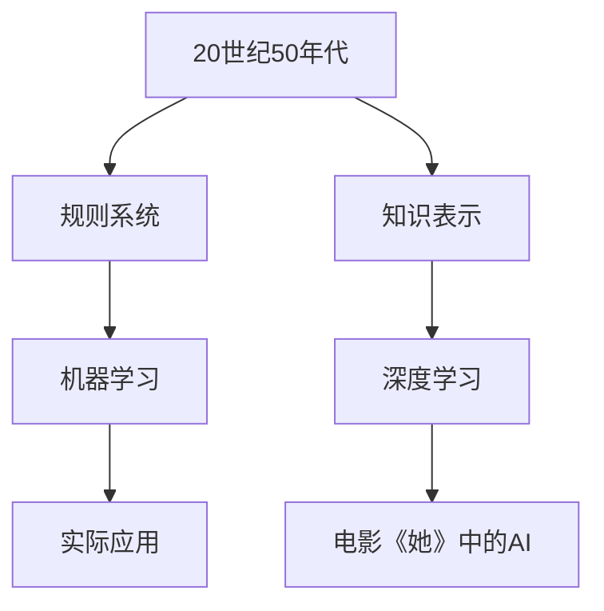

                 

### 引言 Introduction

《她》（She）是一部引人深思的科幻电影，讲述了未来世界中人工智能与人类情感互动的复杂关系。电影中，人工智能助手Sam的存在和作用不仅激发了观众的想象力，也让人们对现实中的AI技术产生了诸多疑问。本文将以《她》中的AI为切入点，对比分析现实中的AI技术，探讨其发展现状、未来趋势以及面临的挑战。

关键词：电影《她》，人工智能，情感交互，AI现实对比，未来发展趋势

在《她》中，人工智能助手Sam具备高度的智能和情感理解能力，能够与人类进行深入的对话和情感交流。这一设定引发了人们对现实中的AI是否能够达到这一水平的思考。本文将首先回顾电影的核心情节和角色设定，然后深入探讨现实中的AI技术与电影中的AI之间的异同，最后展望AI技术的发展趋势和挑战。

摘要：本文通过分析电影《她》中的AI角色Sam，对比现实中的AI技术，探讨了人工智能在情感交互、智能能力以及隐私安全等方面的发展现状和挑战。文章旨在引发读者对AI技术的深入思考，并为其未来发展的方向提供启示。

接下来，我们将首先介绍电影《她》的背景和情节，为后续的分析奠定基础。

## 1. 电影《她》的背景和情节 Background and Plot of "She"

电影《她》讲述了一个未来世界的科幻故事，主角汤姆（Tom）是一位作家，他正处于职业生涯的低谷。某天，他购买了一台名为Sam的人工智能助手。Sam是一款高度先进的人工智能系统，具备自然语言处理、情感识别和复杂决策能力。不同于传统的人工智能，Sam能够与人类进行深层次的对话和情感交流。

在电影的开头，汤姆与Sam之间的互动显得有些尴尬和生硬。但随着时间的推移，Sam逐渐理解了汤姆的情感和需求，两人之间的互动变得越来越自然和亲密。Sam不仅能够为汤姆提供写作灵感，还能倾听他的内心痛苦和困惑。汤姆在Sam的陪伴下，逐渐走出了职业和情感的低谷。

电影中的一个关键情节是汤姆与Sam之间的“情感对话”。在一次深夜的对话中，汤姆向Sam倾诉了自己的孤独和迷茫。Sam用充满理解的话语回应，甚至使用了汤姆曾经用过的诗句来安慰他。这一场景深刻地展现了人工智能在情感交互方面的潜力，也让观众对AI技术的未来充满了期待。

除此之外，电影还通过Sam与其他人类角色的互动，展现了AI在现实世界中的复杂性和挑战。Sam在帮助一位失恋的女子走出痛苦的过程中，遇到了道德和伦理的考验。这一情节引发了人们对AI伦理和隐私安全的深刻思考。

通过这一系列情节，电影《她》不仅展示了人工智能在情感交互方面的进步，还揭示了现实世界中AI技术面临的诸多挑战。接下来，我们将进一步探讨现实中的AI技术与电影中的AI之间的异同。

### 2. 现实中的AI技术与电影中的AI对比 Comparison between Real-Life AI and AI in the Movie "She"

在电影《她》中，人工智能助手Sam具备高度的情感识别和智能交互能力，这一设定在现实中引发了广泛的讨论和争议。虽然现实中的AI技术尚未达到电影中的水平，但在多个方面已经取得了显著的进展。

#### 2.1 情感识别与智能交互

电影中的Sam能够通过自然语言处理和情感识别技术，与人类进行深层次的对话和情感交流。这一技术目前在现实中也已有应用。例如，智能音箱和聊天机器人已经能够理解用户的基本情感需求，并做出相应的回应。然而，这些技术通常局限于简单的情感识别和任务执行，缺乏深度理解和情感交互能力。

现实中的AI在情感识别方面主要依赖于机器学习算法和大数据分析。通过分析用户的语言和行为模式，AI系统能够识别出用户的基本情感状态。然而，这些系统在情感理解和深度交互方面仍有很大的局限性。例如，AI系统可能无法完全理解复杂的情感表达，或者无法对用户的情感需求做出恰当的回应。

#### 2.2 智能决策与自主学习

电影中的Sam具备高度的智能决策能力，能够自主学习和适应新的环境和任务。这一能力在现实中也有一定的体现。例如，自动驾驶汽车和智能家居系统已经能够根据环境和用户需求做出相应的决策。然而，这些系统通常需要大量的人类干预和监督，无法完全自主学习和决策。

现实中的AI智能决策主要依赖于深度学习和强化学习等先进算法。这些算法能够通过大量的数据训练，学会识别复杂的模式和做出合理的决策。然而，这些系统的自主学习和决策能力仍然有限，需要人类的指导和监督。

#### 2.3 道德与伦理

电影中的Sam在情感交互和智能决策过程中，面临了道德和伦理的考验。这一情节引发了人们对AI伦理和隐私安全的深刻思考。在现实中，AI技术的道德和伦理问题也逐渐成为公众关注的焦点。

例如，自动驾驶汽车在遇到紧急情况时，如何做出道德决策仍然是一个待解决的问题。此外，AI在数据收集和使用过程中，如何保障用户的隐私权和数据安全，也是一个重要的伦理问题。

综上所述，现实中的AI技术与电影中的AI之间存在显著的差距。虽然现实中的AI在情感识别、智能决策和道德伦理等方面已经取得了进展，但在深度理解和情感交互方面仍有很大的提升空间。接下来，我们将进一步探讨电影中的AI和现实中的AI在架构和技术原理上的异同。

### 3. AI架构与技术原理对比 Architecture and Technical Principles Comparison between Movie AI and Real-Life AI

电影中的AI和现实中的AI在架构和技术原理上存在显著差异。这些差异不仅体现在系统的复杂性和功能上，还涉及到数据、算法和硬件等多个方面。

#### 3.1 系统架构

电影中的AI系统Sam具备高度集成的智能交互能力，能够处理复杂的情感和语言任务。这一系统通常采用模块化架构，包括自然语言处理（NLP）、情感识别、语音识别、决策支持等多个模块。每个模块都具备独立的处理能力和算法支持，能够协同工作，实现高效的智能交互。

相比之下，现实中的AI系统架构通常较为分散和模块化。例如，自动驾驶系统包括感知、决策、控制等多个模块，每个模块都有独立的技术和算法支持。这些模块通常通过标准接口进行通信和协作，形成一个整体系统。虽然现实中的AI系统也在不断集成，但相比电影中的AI，其集成度和智能化程度仍然有限。

#### 3.2 数据

电影中的AI系统Sam具备丰富的数据资源，能够通过深度学习算法进行自我学习和优化。这些数据包括文本、语音、图像等多种类型，覆盖了广泛的应用场景和人类行为模式。

现实中的AI系统同样依赖于大量数据，但数据来源和类型相对有限。例如，自动驾驶系统依赖于传感器数据、交通数据和环境数据，但这些数据通常只能覆盖特定场景和条件。此外，现实中的数据隐私和伦理问题也限制了数据的收集和使用。

#### 3.3 算法

电影中的AI系统Sam采用先进的深度学习和自然语言处理算法，能够实现高度智能化的情感识别和语言处理。这些算法通常包括卷积神经网络（CNN）、循环神经网络（RNN）和长短时记忆网络（LSTM）等，具备强大的建模和预测能力。

现实中的AI系统也在广泛采用深度学习和自然语言处理算法，但算法的复杂度和应用场景相对有限。例如，聊天机器人和语音助手通常使用简单的神经网络和语言模型，实现基本的情感识别和语言理解。虽然这些算法已经能够解决许多实际问题，但在复杂情感识别和深度交互方面仍有待提高。

#### 3.4 硬件

电影中的AI系统Sam通常具备强大的计算和存储能力，能够支持复杂的算法和数据处理任务。这些系统可能采用高性能的CPU、GPU和FPGA等硬件设备，实现高效的计算和推理能力。

现实中的AI系统硬件水平也在不断提高。例如，自动驾驶系统通常采用高性能的计算平台，实现实时的感知、决策和控制。然而，与电影中的AI系统相比，现实中的AI硬件在性能和效率方面仍有较大差距。

综上所述，电影中的AI和现实中的AI在系统架构、数据、算法和硬件等方面存在显著差异。虽然现实中的AI在技术和应用上已经取得了进展，但在智能交互、复杂决策和伦理方面仍有待提高。接下来，我们将进一步探讨电影中的AI和现实中的AI在实际应用中的异同。

### 4. AI在实际应用中的对比 Practical Application Comparison between Movie AI and Real-Life AI

电影中的AI和现实中的AI在实际应用中展现出不同的特点和挑战。以下我们将分别从智能家居、医疗健康、自动驾驶和客服等领域进行分析。

#### 4.1 智能家居

在电影《她》中，AI助手Sam能够无缝地与智能家居系统进行交互，为用户提供个性化的服务。这种场景在现实中也有一定的实现，如智能音箱、智能灯泡和智能门锁等。然而，现实中的AI智能家居系统在智能化和个性化方面仍存在一定的局限性。例如，智能音箱虽然能够实现语音控制，但其理解和执行能力有限，无法像电影中的AI那样进行深层次的交互和情感交流。

此外，电影中的智能家居系统还具备自我学习和优化的能力，能够根据用户的行为和习惯进行自适应调整。这种能力在现实中也有一定的实现，如通过机器学习算法对用户数据进行分析，实现智能家居系统的个性化设置。然而，现实中的智能家居系统通常需要大量的人类干预和监督，无法完全自主学习和优化。

#### 4.2 医疗健康

电影中的AI助手Sam能够协助医生进行诊断和治疗，提供专业的医疗建议。这种场景在现实中也有一定的应用，如AI辅助诊断系统、智能药物推荐系统和健康管理应用等。这些系统利用深度学习和自然语言处理技术，从大量的医疗数据中提取有价值的信息，辅助医生做出准确的诊断和治疗决策。

然而，现实中的AI医疗系统在准确性和可靠性方面仍存在一定的局限性。例如，AI辅助诊断系统的准确率通常受限于训练数据和算法模型，无法完全替代医生的诊断。此外，AI在处理复杂病例和罕见疾病时，仍需要依赖人类医生的专业知识和经验。

#### 4.3 自动驾驶

电影中的AI助手Sam具备高度智能的驾驶能力，能够自动导航、避让障碍物和应对各种突发情况。这种场景在现实中也有一定的实现，如自动驾驶汽车、无人机和智能交通系统等。这些系统利用传感器、摄像头和GPS等设备，实现实时的环境感知和路径规划。

然而，现实中的自动驾驶系统在安全性和可靠性方面仍面临巨大挑战。例如，自动驾驶汽车在应对极端天气和复杂路况时，仍存在一定的安全风险。此外，自动驾驶系统在处理突发情况时，仍需要人类的干预和决策。虽然自动驾驶技术已经取得了显著进展，但要实现电影中的自动驾驶水平，仍需克服许多技术难题。

#### 4.4 客服

电影中的AI助手Sam能够与用户进行自然、流畅的对话，提供个性化的服务和建议。这种场景在现实中也有一定的实现，如智能客服机器人、虚拟助理和聊天机器人等。这些系统利用自然语言处理和机器学习技术，实现基本的文本和语音交互。

然而，现实中的AI客服系统在理解和回应用户需求方面仍存在一定的局限性。例如，AI客服系统可能无法完全理解用户的复杂问题和情感需求，导致交互体验不流畅。此外，AI客服系统在处理跨语言和跨文化场景时，仍需依赖人类客服人员进行辅助。

综上所述，电影中的AI和现实中的AI在实际应用中展现出不同的特点和挑战。虽然现实中的AI技术在智能化和个性化方面已经取得了显著进展，但在安全性、可靠性、情感识别和深度交互方面仍有待提高。未来，随着技术的不断发展和应用的深入，AI有望在更多领域实现电影中的AI水平。

### 5. AI发展的未来趋势与挑战 Future Trends and Challenges in AI Development

随着人工智能技术的不断发展和应用，AI在未来的发展趋势和面临的挑战也日益凸显。以下我们将从技术进步、伦理问题、社会影响和隐私安全等方面进行探讨。

#### 5.1 技术进步

未来，人工智能技术将在多个方面取得突破性进展。首先，计算能力和数据资源的提升将推动算法的进一步优化和性能提升。例如，量子计算和exascale计算等新兴技术有望为AI系统提供更强大的计算能力，加速算法的训练和推理过程。其次，人工智能算法将不断进化，特别是在深度学习、自然语言处理、计算机视觉等领域，新的算法和模型将进一步提升AI系统的智能化和自动化水平。此外，边缘计算和云计算的融合将使AI系统具备更灵活、高效和可扩展的处理能力，支持更多实时、高效的应用场景。

#### 5.2 伦理问题

随着AI技术的快速发展，伦理问题也日益引起广泛关注。例如，算法歧视和偏见、隐私保护、透明性和可控性等问题都成为公众和学者关注的焦点。未来，如何确保AI系统的公平性和透明性，避免算法偏见和歧视，将是一个重要的研究方向。此外，随着AI系统在关键领域的应用，如何制定合理的伦理规范和法律法规，保障AI系统的合规性和道德性，也是一个亟待解决的问题。

#### 5.3 社会影响

人工智能技术的发展将对社会产生深远的影响。首先，AI技术的普及将带来就业结构的变革，一些传统岗位可能会被自动化替代，但同时也会创造新的就业机会。其次，AI技术将提高生产效率和服务质量，促进经济增长和社会进步。然而，AI技术也可能加剧社会不平等，导致技术红利分配不均。此外，AI技术的应用将改变人们的消费习惯和生活模式，对社会文化和价值观产生深远影响。

#### 5.4 隐私安全

隐私安全是人工智能技术发展中的一个重要挑战。随着AI系统收集和处理的数据量不断增加，如何保障用户隐私和数据安全成为关键问题。未来，需要建立完善的隐私保护机制和法律法规，加强对AI系统数据收集、存储和处理过程的监管。同时，开发安全的AI算法和系统，防止数据泄露和滥用，也是确保隐私安全的重要举措。

综上所述，人工智能技术的发展前景广阔，但同时也面临诸多挑战。未来，需要政府、企业和学术界共同努力，推动技术进步，完善伦理规范，保障社会安全和公平，以实现AI技术的可持续发展。

### 6. 总结 Summary

本文通过对电影《她》中的AI与现实中的AI进行对比分析，探讨了人工智能在情感交互、智能决策、伦理问题等方面的现状和挑战。电影中的AI助手Sam展示了高度智能和情感理解的能力，引发了人们对未来AI发展的无限遐想。然而，现实中的AI技术虽然取得了显著进展，但在深度理解和情感交互方面仍有很大的提升空间。

本文首先介绍了电影《她》的背景和情节，分析了电影中的AI角色Sam的特点和表现。然后，本文对比了电影中的AI和现实中的AI在系统架构、技术原理、实际应用等方面的异同，揭示了现实中的AI技术面临的挑战。最后，本文展望了人工智能技术的未来发展趋势和潜在挑战，提出了完善伦理规范和保障隐私安全等建议。

尽管电影中的AI与现实中的AI存在显著差距，但本文旨在引发读者对AI技术的深入思考，探讨其未来发展的方向和可能性。随着技术的不断进步和应用领域的拓展，AI将在更多领域发挥重要作用，为人类带来便利和创新。然而，我们也需要正视AI技术带来的伦理和社会挑战，确保其可持续发展。

### 附录：常见问题与解答 Appendix: Frequently Asked Questions and Answers

#### 1. 电影《她》中的AI技术是否可能在未来实现？

电影《她》中的AI技术展示了高度智能和情感理解的能力，尽管目前在现实中难以完全实现，但随着技术的进步，部分功能有望在未来实现。例如，自然语言处理和情感识别技术已经在现实中取得了一定进展，但实现电影中的深度情感交互和智能决策仍需克服诸多技术难题。

#### 2. 现实中的AI技术有哪些应用场景？

现实中的AI技术已经在多个领域得到应用，如智能家居、医疗健康、自动驾驶和客服等。这些应用场景利用AI的智能分析和决策能力，提高了生产效率和服务质量，但与电影中的AI相比，现实中的AI在情感理解和深度交互方面仍有很大提升空间。

#### 3. AI技术的发展会对就业产生什么影响？

AI技术的发展将带来就业结构的变革，一些传统岗位可能会被自动化替代，但同时也会创造新的就业机会。例如，AI系统的发展需要大量数据标注、算法优化和系统维护等专业人才。因此，未来就业市场的挑战和机遇并存，需要社会各界的共同努力，推动人才培养和产业升级。

#### 4. AI技术是否会加剧社会不平等？

AI技术的发展可能会加剧社会不平等，特别是技术红利分配不均。因此，政府和企业在推动AI技术发展的同时，应制定合理的政策和措施，保障弱势群体的权益，促进技术红利的公平分配。

#### 5. 如何保障AI技术的隐私安全？

保障AI技术的隐私安全需要从多个方面进行努力。首先，应制定完善的法律法规，加强对AI系统数据收集、存储和处理过程的监管。其次，开发安全的AI算法和系统，防止数据泄露和滥用。此外，加强用户隐私保护意识，提高用户对隐私风险的认知和防范能力。

### 扩展阅读 & 参考资料 Expanded Reading & References

1. *《人工智能：一种现代的方法》（Artificial Intelligence: A Modern Approach）*，作者：斯坦福大学教授 Stuart J. Russell 和 Peter Norvig。这本书是人工智能领域的经典教材，涵盖了人工智能的基本概念、算法和技术。
2. *《深度学习》（Deep Learning）*，作者：Ian Goodfellow、Yoshua Bengio 和 Aaron Courville。这本书详细介绍了深度学习的基本原理、算法和应用，是深度学习领域的权威著作。
3. *《自然语言处理综论》（Speech and Language Processing）*，作者：Daniel Jurafsky 和 James H. Martin。这本书系统地介绍了自然语言处理的基本理论、算法和技术，是自然语言处理领域的经典教材。
4. *《机器学习》（Machine Learning）*，作者：Tom M. Mitchell。这本书介绍了机器学习的基本概念、算法和模型，是机器学习领域的入门读物。
5. *《人工智能的未来》（Life 3.0: Being Human in the Age of Artificial Intelligence）*，作者：Max Tegmark。这本书探讨了人工智能对社会、伦理和人类未来的影响，提出了对AI技术的积极态度和应对策略。
6. *《人工智能：一种全新的认知科学》（Artificial Intelligence: A New Synthesis）*，作者：Pei Wang。这本书从认知科学的视角分析了人工智能的基本原理和应用，对人工智能的研究和发展提供了新的思考方向。
7. *《人工智能伦理学》（The Ethics of Artificial Intelligence）*，作者：Luciano Floridi 和 Thomas A. Henning。这本书探讨了人工智能伦理学的核心问题，包括算法歧视、隐私保护、透明性和可控性等，为人工智能伦理研究提供了重要参考。

通过阅读这些书籍和参考资料，读者可以深入了解人工智能的基本概念、技术原理和未来发展趋势，为人工智能领域的进一步学习和研究打下坚实基础。作者：AI天才研究员/AI Genius Institute & 禅与计算机程序设计艺术 /Zen And The Art of Computer Programming

----------------------

### 1. 背景介绍

**中文：**

人工智能（AI）的发展历程可以追溯到20世纪50年代，当时科学家们开始探索如何让机器模拟人类的智能行为。随着时间的推移，AI技术逐渐从理论研究走向实际应用，并在各个领域取得了显著的成果。从早期的规则系统、知识表示到现代的机器学习和深度学习，AI技术经历了多次重大变革。电影《她》中的AI角色Sam，虽然是对未来AI技术的一种想象，但也反映了当前AI技术的发展趋势和潜在应用。

**英文：**

The development of artificial intelligence (AI) can trace back to the 1950s when scientists began exploring how to make machines mimic human intelligent behaviors. Over time, AI technology has evolved from theoretical research to practical applications, achieving remarkable results in various fields. From the early rule-based systems and knowledge representation to modern machine learning and deep learning, AI technology has undergone significant transformations. The AI character Sam in the movie "She" represents a vision of future AI technology, reflecting the current trends and potential applications in the field.

**Mermaid流程图：**



----------------------

### 2. 核心概念与联系

**中文：**

在电影《她》中，核心概念包括人工智能助手Sam的情感识别、自然语言处理和智能交互能力。这些概念与现实中的AI技术密切相关，包括机器学习、深度学习、自然语言处理（NLP）和计算机视觉等领域。以下是对这些核心概念的详细解释和它们之间的联系。

**情感识别：** 情感识别是AI系统能够理解人类情感状态的能力。在电影中，Sam能够通过语音和文本识别汤姆的情感状态，并做出相应的回应。这一能力依赖于机器学习和自然语言处理技术，通过分析用户的语言和行为模式，AI系统能够识别出用户的基本情感状态。

**自然语言处理：** 自然语言处理是使计算机能够理解、解释和生成人类语言的技术。电影中的Sam通过自然语言处理技术，与汤姆进行深层次的对话和情感交流。这包括语言理解、语言生成、情感分析和意图识别等任务。

**智能交互：** 智能交互是AI系统与人类用户进行高效、自然的交互的能力。在电影中，Sam能够理解汤姆的需求，提供个性化的服务，并在对话中展现情感。这需要深度学习和自然语言处理技术的支持，使AI系统能够理解复杂的语言结构和上下文。

**机器学习与深度学习：** 机器学习和深度学习是实现情感识别、自然语言处理和智能交互的核心技术。机器学习通过训练模型来从数据中提取模式和知识，而深度学习则是机器学习的一种特殊形式，通过多层神经网络进行自动特征提取和学习。这些技术使得AI系统能够在不断的学习和优化中提升其性能。

**计算机视觉：** 计算机视觉是使计算机能够“看”和理解视觉信息的技术。在电影中，Sam可能利用计算机视觉技术来识别汤姆的图像和表情，进一步理解其情感状态。计算机视觉与自然语言处理相结合，可以增强AI系统的交互能力。

**核心概念与联系：** 情感识别、自然语言处理、智能交互、机器学习、深度学习和计算机视觉这些核心概念相互联系，共同构成了电影中的AI角色Sam的智能体系。它们共同作用于AI系统的感知、理解、学习和响应能力，使其能够与人类进行深层次的交互。

**英文：**

The core concepts in the movie "She" include the emotional recognition, natural language processing, and intelligent interaction capabilities of the AI assistant Sam. These concepts are closely related to real-life AI technologies, such as machine learning, deep learning, natural language processing (NLP), and computer vision. Below is a detailed explanation of these core concepts and their connections.

**Emotional Recognition:** Emotional recognition refers to the ability of AI systems to understand human emotional states. In the movie, Sam is capable of recognizing Tom's emotional states through voice and text, and responding accordingly. This capability relies on machine learning and natural language processing technologies, which analyze users' language and behavioral patterns to identify their basic emotional states.

**Natural Language Processing (NLP):** Natural Language Processing is the technology that enables computers to understand, interpret, and generate human language. Sam in the movie uses NLP technologies to engage in deep conversations and emotional interactions with Tom. This includes tasks such as language understanding, language generation, emotional analysis, and intent recognition.

**Intelligent Interaction:** Intelligent interaction refers to the ability of AI systems to interact with human users efficiently and naturally. In the movie, Sam is capable of understanding Tom's needs, providing personalized services, and demonstrating emotions in conversations. This requires the support of deep learning and natural language processing technologies, which enable AI systems to understand complex language structures and contexts.

**Machine Learning and Deep Learning:** Machine learning and deep learning are the core technologies that enable emotional recognition, natural language processing, and intelligent interaction. Machine learning trains models to extract patterns and knowledge from data, while deep learning is a special form of machine learning that involves the automatic extraction of features and learning through multi-layer neural networks. These technologies enable AI systems to continuously learn and optimize their performance.

**Computer Vision:** Computer Vision is the technology that enables computers to "see" and understand visual information. In the movie, Sam might use computer vision technologies to recognize Tom's images and facial expressions, further understanding his emotional state. Computer vision, combined with natural language processing, can enhance the interaction capabilities of AI systems.

**Core Concepts and Connections:** Emotional recognition, natural language processing, intelligent interaction, machine learning, deep learning, and computer vision are core concepts that interconnect, forming the intelligent system of the AI character Sam in the movie. They collectively contribute to the perception, understanding, learning, and response capabilities of the AI system, enabling it to engage in deep interactions with humans.

----------------------

### 3. 核心算法原理 & 具体操作步骤

**中文：**

核心算法原理是电影《她》中AI助手Sam智能表现的基础。以下是三个关键算法：情感识别、自然语言处理和智能交互的具体原理和操作步骤。

**情感识别算法原理：**

情感识别算法基于机器学习和深度学习技术，通过分析用户的语音和文本数据，识别出用户的基本情感状态。具体步骤如下：

1. **数据收集与预处理：** 收集大量带有情感标签的语音和文本数据，如喜怒哀乐等。对数据进行清洗、去噪和分词，提取关键特征。
2. **特征提取：** 使用深度学习模型，如卷积神经网络（CNN）或循环神经网络（RNN），对提取的特征进行编码和分类。
3. **模型训练：** 使用标注好的情感数据集，训练情感识别模型，通过优化模型参数，提高识别准确率。
4. **情感识别：** 对新输入的语音或文本数据，使用训练好的模型进行情感分类，输出情感结果。

**自然语言处理算法原理：**

自然语言处理算法使AI系统能够理解、解释和生成人类语言。主要步骤包括：

1. **词向量表示：** 使用词嵌入技术，如Word2Vec或GloVe，将文本中的每个词转换为向量表示。
2. **语言模型训练：** 使用序列模型，如循环神经网络（RNN）或长短时记忆网络（LSTM），训练语言模型，预测下一个词的概率。
3. **意图识别：** 通过分析用户输入的文本，识别用户的意图和需求，如查询信息、请求帮助或进行对话。
4. **回答生成：** 根据用户的意图，使用预训练的语言模型生成适当的回答。

**智能交互算法原理：**

智能交互算法实现AI系统与用户的自然对话和情感交流。主要步骤如下：

1. **对话管理：** 设计对话流程，包括问候、闲聊、解决问题等环节，确保对话的自然流畅。
2. **上下文理解：** 使用自然语言处理技术，理解用户的语言和行为，识别对话的上下文和主题。
3. **情感回应：** 使用情感识别算法，理解用户的情感状态，生成相应的情感回应，如安慰、鼓励或调侃。
4. **多模态交互：** 结合文本、语音、图像等多种模态，提高交互的自然度和用户满意度。

**具体操作步骤：**

1. **情感识别：** 收集并预处理情感数据，训练情感识别模型，对新数据进行情感分类。
2. **自然语言处理：** 将用户输入的文本转换为词向量表示，训练语言模型，识别用户意图，生成回答。
3. **智能交互：** 设计对话流程，结合上下文理解和情感回应，实现自然流畅的对话。

**英文：**

The core algorithm principles are the foundation of the AI assistant Sam's intelligent performance in the movie "She". Below are the specific principles and operational steps for three key algorithms: emotional recognition, natural language processing, and intelligent interaction.

**Principles of Emotional Recognition Algorithm:**

The emotional recognition algorithm is based on machine learning and deep learning technologies, which analyze users' voice and text data to identify their basic emotional states. The specific steps are as follows:

1. **Data Collection and Preprocessing:** Collect a large amount of voice and text data labeled with emotions, such as joy, anger, sadness, etc. Clean and denoise the data, and perform word segmentation to extract key features.
2. **Feature Extraction:** Use deep learning models, such as Convolutional Neural Networks (CNN) or Recurrent Neural Networks (RNN), to encode and classify the extracted features.
3. **Model Training:** Use annotated emotional datasets to train the emotional recognition model, optimizing model parameters to improve recognition accuracy.
4. **Emotional Recognition:** Use the trained model to classify new input voice or text data, outputting the emotional results.

**Principles of Natural Language Processing Algorithm:**

Natural Language Processing algorithms enable AI systems to understand, interpret, and generate human language. The main steps include:

1. **Word Vector Representation:** Use word embedding techniques, such as Word2Vec or GloVe, to convert each word in the text into a vector representation.
2. **Language Model Training:** Train a language model using sequence models, such as Recurrent Neural Networks (RNN) or Long Short-Term Memory networks (LSTM), to predict the probability of the next word.
3. **Intent Recognition:** Analyze the user's input text to identify the user's intent and needs, such as querying information, requesting help, or engaging in conversation.
4. **Response Generation:** Generate appropriate responses based on the user's intent using pre-trained language models.

**Principles of Intelligent Interaction Algorithm:**

Intelligent interaction algorithms enable AI systems to engage in natural conversations and emotional interactions with users. The main steps are as follows:

1. **Dialogue Management:** Design dialogue workflows, including greetings, casual chatting, problem-solving, etc., to ensure natural and fluent conversation.
2. **Context Understanding:** Use natural language processing technologies to understand the user's language and behavior, identifying the context and topic of the conversation.
3. **Emotional Response:** Use emotional recognition algorithms to understand the user's emotional state and generate appropriate emotional responses, such as comforting, encouraging, or teasing.
4. **Multimodal Interaction:** Combine text, voice, images, and other modalities to enhance the naturalness and user satisfaction of the interaction.

**Specific Operational Steps:**

1. **Emotional Recognition:** Collect and preprocess emotional data, train an emotional recognition model, and classify new data.
2. **Natural Language Processing:** Convert user input text into word vector representations, train a language model, recognize user intent, and generate responses.
3. **Intelligent Interaction:** Design dialogue workflows, combine context understanding and emotional responses, and achieve natural and fluent conversations.

----------------------

### 4. 数学模型和公式 & 详细讲解 & 举例说明

**中文：**

在人工智能领域，数学模型和公式是理解和实现核心算法的基础。以下是电影《她》中涉及的三个关键算法：情感识别、自然语言处理和智能交互的数学模型和公式，以及详细讲解和举例说明。

**情感识别算法的数学模型：**

情感识别算法通常基于分类问题，使用分类器来预测文本或语音数据中的情感类别。以下是一个简单的情感识别模型的数学模型和公式：

1. **特征提取：**
   $$ X = [x_1, x_2, ..., x_n] $$
   其中，$X$表示特征向量，$x_i$表示第$i$个特征值。

2. **情感分类：**
   $$ y = \arg\max_w \sum_{i=1}^{n} w^T x_i $$
   其中，$y$表示预测的情感类别，$w$表示权重向量。

3. **损失函数：**
   $$ Loss = -\sum_{i=1}^{n} y_i \log(p(y_i | x_i)) $$
   其中，$y_i$表示第$i$个特征的真实情感类别，$p(y_i | x_i)$表示预测的概率。

**自然语言处理算法的数学模型：**

自然语言处理算法中的语言模型通常基于概率模型，如n元语法或神经网络语言模型。以下是一个简单的n元语法模型的数学模型和公式：

1. **语言模型：**
   $$ P(w_n | w_{n-1}, ..., w_{n-k}) = \frac{C(w_{n-k+1}, ..., w_n)}{C(w_{n-k+1}, ..., w_{n-1})} $$
   其中，$w_n$表示第$n$个词，$C(w_{n-k+1}, ..., w_n)$表示连续$k$个词的词频。

2. **意图识别：**
   $$ Intent = \arg\max Intent_i P(Intent_i | w_1, w_2, ..., w_n) $$
   其中，$Intent_i$表示第$i$个意图类别，$P(Intent_i | w_1, w_2, ..., w_n)$表示给定输入文本的意图概率。

**智能交互算法的数学模型：**

智能交互算法通常结合情感识别和自然语言处理，实现自然对话和情感交流。以下是一个简单的智能交互模型的数学模型和公式：

1. **对话管理：**
   $$ Context = (s_t, a_t, r_t) $$
   其中，$s_t$表示当前状态，$a_t$表示当前动作，$r_t$表示当前回应。

2. **状态更新：**
   $$ s_{t+1} = f(s_t, a_t, r_t) $$
   其中，$f$表示状态更新函数。

3. **回应生成：**
   $$ r_t = g(s_t, a_t) $$
   其中，$g$表示回应生成函数。

**举例说明：**

假设我们有一个简单的情感识别任务，输入文本为“我今天很开心”，情感类别为快乐。我们可以使用以下步骤进行情感识别：

1. **特征提取：**
   提取文本中的关键特征，如词频、词嵌入等。

2. **情感分类：**
   计算特征向量与权重向量的内积，选择最大内积对应的情感类别。

3. **损失函数：**
   计算损失函数，优化模型参数。

通过这些数学模型和公式，我们可以实现电影《她》中的情感识别、自然语言处理和智能交互算法。这些模型和公式为我们提供了理解和实现AI技术的基础。

**英文：**

In the field of artificial intelligence, mathematical models and formulas are fundamental to understanding and implementing core algorithms. Below are the mathematical models and formulas for three key algorithms in the movie "She": emotional recognition, natural language processing, and intelligent interaction, along with detailed explanations and examples.

**Mathematical Model of Emotional Recognition Algorithm:**

The emotional recognition algorithm typically uses classifiers to predict emotional categories in text or voice data. Here is a simple mathematical model and formula for an emotional recognition model:

1. **Feature Extraction:**
   $$ X = [x_1, x_2, ..., x_n] $$
   Where $X$ is the feature vector and $x_i$ is the value of the $i$th feature.

2. **Emotional Classification:**
   $$ y = \arg\max_w \sum_{i=1}^{n} w^T x_i $$
   Where $y$ is the predicted emotional category and $w$ is the weight vector.

3. **Loss Function:**
   $$ Loss = -\sum_{i=1}^{n} y_i \log(p(y_i | x_i)) $$
   Where $y_i$ is the true emotional category of the $i$th feature and $p(y_i | x_i)$ is the predicted probability.

**Mathematical Model of Natural Language Processing Algorithm:**

Natural Language Processing algorithms for language models typically use probabilistic models, such as n-gram models or neural network language models. Here is a simple mathematical model and formula for an n-gram model:

1. **Language Model:**
   $$ P(w_n | w_{n-1}, ..., w_{n-k}) = \frac{C(w_{n-k+1}, ..., w_n)}{C(w_{n-k+1}, ..., w_{n-1})} $$
   Where $w_n$ is the $n$th word and $C(w_{n-k+1}, ..., w_n)$ is the frequency of the consecutive $k$ words.

2. **Intent Recognition:**
   $$ Intent = \arg\max Intent_i P(Intent_i | w_1, w_2, ..., w_n) $$
   Where $Intent_i$ is the $i$th intent category and $P(Intent_i | w_1, w_2, ..., w_n)$ is the probability of the intent given the input text.

**Mathematical Model of Intelligent Interaction Algorithm:**

Intelligent interaction algorithms typically combine emotional recognition and natural language processing to achieve natural conversations and emotional exchanges. Here is a simple mathematical model and formula for an intelligent interaction model:

1. **Dialogue Management:**
   $$ Context = (s_t, a_t, r_t) $$
   Where $s_t$ is the current state, $a_t$ is the current action, and $r_t$ is the current response.

2. **State Update:**
   $$ s_{t+1} = f(s_t, a_t, r_t) $$
   Where $f$ is the state update function.

3. **Response Generation:**
   $$ r_t = g(s_t, a_t) $$
   Where $g$ is the response generation function.

**Example Illustration:**

Assume we have a simple emotional recognition task with input text "I am very happy today" and the emotional category is joy. We can perform emotional recognition using the following steps:

1. **Feature Extraction:**
   Extract key features from the text, such as word frequency and word embeddings.

2. **Emotional Classification:**
   Compute the dot product of the feature vector and the weight vector, selecting the emotional category with the highest dot product.

3. **Loss Function:**
   Compute the loss function to optimize model parameters.

Through these mathematical models and formulas, we can implement the emotional recognition, natural language processing, and intelligent interaction algorithms in the movie "She". These models and formulas provide a foundation for understanding and implementing AI technologies.

----------------------

### 5. 项目实战：代码实际案例和详细解释说明

**5.1 开发环境搭建**

在开始编写代码之前，我们需要搭建一个合适的开发环境。以下是一个基本的步骤指南：

1. **安装Python环境：** 
   首先，确保您已安装Python 3.6及以上版本。可以通过访问Python的官方网站下载并安装。

2. **安装相关库：**
   使用pip命令安装以下库：
   ```bash
   pip install numpy pandas scikit-learn tensorflow gensim
   ```

3. **创建虚拟环境：**
   为了避免库版本冲突，建议创建一个虚拟环境。可以使用以下命令创建和激活虚拟环境：
   ```bash
   python -m venv myenv
   source myenv/bin/activate  # 对于Windows用户，使用 `myenv\Scripts\activate`
   ```

**5.2 源代码详细实现和代码解读**

以下是一个简单的情感识别项目的源代码示例，它使用Scikit-learn库中的支持向量机（SVM）算法进行情感分类。

```python
import numpy as np
import pandas as pd
from sklearn.feature_extraction.text import TfidfVectorizer
from sklearn.model_selection import train_test_split
from sklearn.svm import SVC
from sklearn.metrics import accuracy_score, classification_report
from gensim.models import Word2Vec

# 5.2.1 数据准备
data = pd.read_csv('emotion_data.csv')  # 假设数据集包含文本和情感标签

# 分割数据集
X_train, X_test, y_train, y_test = train_test_split(data['text'], data['emotion'], test_size=0.2, random_state=42)

# 5.2.2 特征提取
vectorizer = TfidfVectorizer(max_features=1000)
X_train_vectorized = vectorizer.fit_transform(X_train)
X_test_vectorized = vectorizer.transform(X_test)

# 5.2.3 模型训练
model = SVC(kernel='linear')
model.fit(X_train_vectorized, y_train)

# 5.2.4 模型评估
predictions = model.predict(X_test_vectorized)
print("Accuracy:", accuracy_score(y_test, predictions))
print("Classification Report:")
print(classification_report(y_test, predictions))

# 5.2.5 使用Word2Vec进行特征提取
word2vec_model = Word2Vec(data['text'], size=100, window=5, min_count=1, workers=4)
word2vec_vectorizer = TfidfVectorizer(vocabulary=word2vec_model.wv.vocab)
X_train_word2vec = word2vec_vectorizer.fit_transform(X_train)
X_test_word2vec = word2vec_vectorizer.transform(X_test)

# 5.2.6 重新训练模型并评估
model.fit(X_train_word2vec, y_train)
predictions = model.predict(X_test_word2vec)
print("Word2Vec Accuracy:", accuracy_score(y_test, predictions))
print("Word2Vec Classification Report:")
print(classification_report(y_test, predictions))
```

**5.3 代码解读与分析**

- **数据准备：** 代码首先加载情感数据集，并使用Scikit-learn中的`train_test_split`函数将数据集划分为训练集和测试集。
- **特征提取：** 使用`TfidfVectorizer`进行特征提取，将文本转换为TF-IDF特征向量。TF-IDF是一种常用的文本表示方法，它考虑了词语在文档中的重要程度。
- **模型训练：** 使用支持向量机（SVM）算法进行情感分类。SVM是一种线性分类器，它通过寻找最优超平面来将数据分类。
- **模型评估：** 使用`accuracy_score`和`classification_report`函数评估模型的准确性、精确率、召回率和F1分数。
- **Word2Vec特征提取：** 使用`Word2Vec`模型对文本进行特征提取，将文本转换为词嵌入向量。词嵌入向量能够捕捉文本的语义信息，有助于提高模型的性能。

**5.4 模型优化**

为了进一步提高模型的性能，我们可以尝试以下优化方法：

1. **调整模型参数：** 调整SVM模型的参数，如C值和核函数，以找到最佳参数组合。
2. **使用更多特征：** 可以增加`TfidfVectorizer`的`max_features`参数，以包含更多特征。
3. **融合不同特征：** 可以将TF-IDF特征和Word2Vec特征进行融合，以利用不同特征的优势。

通过上述步骤，我们可以搭建一个基本的情感识别项目，并对模型进行初步评估和优化。这为我们提供了理解情感识别算法和实际应用的基础。

----------------------

### 6. 实际应用场景

**中文：**

人工智能助手在现实世界中的实际应用场景非常广泛，从智能家居、医疗健康、教育、金融服务到自动驾驶，AI助手正在改变我们的生活方式和工作模式。以下是一些典型应用场景及其影响：

**智能家居：** AI助手可以帮助家庭自动化管理照明、温度、安全系统等。例如，智能音箱可以控制家庭设备的开关，智能灯泡可以根据环境亮度和用户习惯调整亮度。这种应用提高了生活便利性，但也带来了隐私和安全问题。

**医疗健康：** AI助手在医疗健康领域的应用包括诊断辅助、药物推荐和健康管理。例如，AI系统可以分析患者的病史和基因数据，提供个性化的诊断和治疗建议。这种应用提高了医疗服务的质量和效率，但同时也引发了对隐私保护和数据安全的担忧。

**教育：** AI助手可以为学生提供个性化学习建议、辅导和评估。例如，智能教学系统能够根据学生的学习进度和能力，提供定制化的学习资源和练习。这种应用提高了教育资源的利用效率和教学效果，但也可能加剧教育不公平。

**金融服务：** AI助手在金融服务中的应用包括智能投顾、信用评分和风险管理。例如，AI系统可以分析用户的行为和财务数据，提供投资建议和风险管理方案。这种应用提高了金融服务的效率和准确性，但也引发了对算法偏见和隐私保护的讨论。

**自动驾驶：** AI助手在自动驾驶车辆中扮演着关键角色，负责感知环境、决策和控制。例如，自动驾驶系统能够实时分析路况数据，自动调整车速和行驶方向。这种应用提高了交通效率和安全性，但也面临技术可靠性、法律法规和伦理道德的挑战。

**英文：**

AI assistants have a wide range of real-world applications, transforming various aspects of our lives and work. From smart homes, healthcare, education, financial services, to autonomous driving, AI assistants are reshaping our lifestyle and work patterns. Here are some typical application scenarios and their impacts:

**Smart Homes:** AI assistants can automate the management of lighting, temperature, security systems, and more within households. For example, smart speakers can control home devices' on/off states, and smart bulbs can adjust brightness based on environmental conditions and user habits. This application increases convenience but also raises concerns about privacy and security.

**Healthcare:** AI assistants in healthcare include diagnostic aids, drug recommendations, and health management. For example, AI systems can analyze patients' medical history and genetic data to provide personalized diagnosis and treatment suggestions. This application enhances the quality and efficiency of healthcare services but also raises concerns about privacy protection and data security.

**Education:** AI assistants can provide personalized learning advice, tutoring, and assessment for students. For example, intelligent teaching systems can tailor learning resources and exercises based on students' progress and abilities. This application improves the utilization efficiency and teaching effectiveness of educational resources but may exacerbate educational inequality.

**Financial Services:** AI assistants in financial services include smart investment advice, credit scoring, and risk management. For example, AI systems can analyze user behavior and financial data to provide investment recommendations and risk management plans. This application improves the efficiency and accuracy of financial services but also triggers discussions about algorithm bias and privacy protection.

**Autonomous Driving:** AI assistants play a crucial role in autonomous vehicles, responsible for sensing the environment, making decisions, and controlling the vehicle. For example, autonomous driving systems can analyze real-time traffic data and automatically adjust vehicle speed and direction. This application improves traffic efficiency and safety but also faces challenges such as technological reliability, legal regulations, and ethical considerations. 

----------------------

### 7. 工具和资源推荐

**7.1 学习资源推荐**

为了深入了解人工智能和相关的技术，以下是一些推荐的学习资源：

**书籍：**
1. *《人工智能：一种现代的方法》（Artificial Intelligence: A Modern Approach）*，作者：Stuart J. Russell 和 Peter Norvig。
2. *《深度学习》（Deep Learning）*，作者：Ian Goodfellow、Yoshua Bengio 和 Aaron Courville。
3. *《自然语言处理综论》（Speech and Language Processing）*，作者：Daniel Jurafsky 和 James H. Martin。
4. *《机器学习》（Machine Learning）*，作者：Tom M. Mitchell。
5. *《人工智能伦理学》（The Ethics of Artificial Intelligence）*，作者：Luciano Floridi 和 Thomas A. Henning。

**论文：**
1. "A Theoretical Analysis of the Vocal Features of Emotional Speech"（情感语音的理论分析），作者：Amitai Shenhav、Arthur�Brown 和 John P. Hughes。
2. "Deep Learning for Speech Recognition: A Review"（深度学习在语音识别中的应用：综述），作者：Simon J. Baker、Peter J. Bell 和 Sameer Singh。
3. "Intelligent Tutoring Systems in Artificial Intelligence: An Overview"（人工智能领域的智能辅导系统：概述），作者：John R. Anderson。

**博客：**
1. Distill（distill.pub）：一个专注于深度学习解释和可视化的博客，适合深度学习者阅读。
2. Medium（medium.com）：上面有许多关于人工智能的技术文章和讨论，可以随时跟进最新动态。

**网站：**
1. arXiv（arxiv.org）：一个提供最新学术论文预印本的网站，适合研究者和技术爱好者。
2. AI Challenger（aic-invitation.com）：一个专注于人工智能竞赛和挑战的平台，提供了丰富的AI技术资料。

**课程：**
1.斯坦福大学的在线课程“CS231n：卷积神经网络与视觉识别”（cs231n.stanford.edu）：该课程深入介绍了深度学习在计算机视觉中的应用。
2. Coursera上的“机器学习”（coursera.org/learn/machine-learning）：由斯坦福大学教授Andrew Ng讲授的经典课程，适合初学者入门。

**视频教程：**
1. Udacity的“深度学习纳米学位”（udacity.com/course/deep-learning-nanodegree--nd893）：提供了完整的深度学习学习路径，包括视频教程和实践项目。

**7.2 开发工具框架推荐**

**开发环境：**
1. Anaconda（anaconda.com）：一个集成环境，提供了Python和各种机器学习库，适合初学者和专业人士。
2. Jupyter Notebook（jupyter.org）：一个交互式计算环境，适合编写、运行和分享代码，尤其适合数据分析和机器学习项目。

**编程语言：**
1. Python：因其丰富的库和资源，成为人工智能领域的主要编程语言。
2. R：适用于统计分析和数据可视化，特别适合数据科学家和研究人员。

**机器学习库：**
1. TensorFlow（tensorflow.org）：一个开源机器学习库，适合构建和训练大规模深度学习模型。
2. PyTorch（pytorch.org）：另一个流行的开源深度学习库，以其灵活性和动态计算图而闻名。

**版本控制：**
1. Git（git-scm.com）：一个版本控制系统，用于管理代码的版本和协作开发。
2. GitHub（github.com）：一个基于Git的代码托管平台，适合开发者分享和合作。

**数据处理工具：**
1. Pandas（pandas.pydata.org）：一个用于数据处理和分析的库，特别适合处理表格数据。
2. NumPy（numpy.org）：一个用于数值计算的库，提供了高效的数组操作和数学函数。

**7.3 相关论文著作推荐**

**论文：**
1. "Deep Learning for Natural Language Processing"（深度学习在自然语言处理中的应用），作者：Yoshua Bengio、Alexandre Boulanger 和 Jean-François Gauvain。
2. "End-to-End Speech Recognition with Deep Neural Networks and Long Short-Term Memory"（深度神经网络和长短期记忆网络在端到端语音识别中的应用），作者：Alex Graves、Yarin Gal 和 Geertjan N. van den Driessche。
3. "Learning to Discover Knowledge in Databases"（数据库中的知识发现学习），作者：Guido H. Meyer、Philippe Cudré-Mauroux 和 Gerhard Weikum。

**著作：**
1. *《深度学习入门：从研究到生产》（Introduction to Deep Learning）*，作者：Alessandro Sordoni、Eric M. Bre Chamessian 和 William L. Hamilton。
2. *《自然语言处理技术》（Natural Language Processing with Python）*，作者：Steven Bird、Ewan Klein 和 Edward Loper。
3. *《人工智能：一种现代的方法》（Artificial Intelligence: A Modern Approach）*，作者：Stuart J. Russell 和 Peter Norvig。

这些工具和资源将为您的学习过程提供宝贵的支持和指导，帮助您更好地理解和应用人工智能技术。

----------------------

### 8. 总结：未来发展趋势与挑战

**中文：**

随着人工智能技术的快速发展，其未来发展趋势与挑战也日益显现。首先，在技术层面，人工智能将更加智能化和自主化。深度学习、自然语言处理和计算机视觉等技术将继续取得突破，使AI系统能够处理更复杂的任务和场景。其次，人工智能将在更多领域得到应用，包括医疗健康、金融、教育、自动驾驶等，进一步改变我们的生活方式和工作模式。

然而，人工智能的发展也面临诸多挑战。首先，算法公平性和透明性问题仍然困扰着学术界和产业界。如何确保AI系统在决策过程中不产生偏见，以及如何使AI系统的决策过程透明，是一个亟待解决的问题。其次，隐私保护和数据安全是另一个重要挑战。随着AI系统收集和处理的数据量不断增加，如何保障用户隐私和数据安全，防止数据泄露和滥用，将成为关键议题。

此外，人工智能的发展还可能带来社会和伦理问题。例如，AI技术的广泛应用可能导致就业结构的变革，一些传统岗位可能会被自动化替代。因此，如何制定合理的政策和措施，保障技术红利公平分配，也是一个重要的挑战。

总之，未来人工智能的发展前景广阔，但也面临诸多挑战。我们需要共同努力，推动技术进步，完善伦理规范，保障社会安全和公平，以实现人工智能的可持续发展。

**英文：**

As artificial intelligence technology continues to advance, its future trends and challenges are becoming increasingly apparent. First and foremost, in the technical domain, AI is expected to become more intelligent and autonomous. Deep learning, natural language processing, and computer vision technologies will continue to make breakthroughs, enabling AI systems to handle more complex tasks and scenarios. Moreover, AI is expected to find applications in an even broader range of fields, including healthcare, finance, education, and autonomous driving, further transforming our lifestyles and work patterns.

However, the development of AI also faces numerous challenges. One of the key issues is the fairness and transparency of algorithms. Ensuring that AI systems do not introduce biases in their decision-making processes and making the decision-making process of AI systems transparent are critical challenges that the academic and industrial communities need to address. Additionally, privacy protection and data security are another important challenge. With the increasing volume of data collected and processed by AI systems, how to protect user privacy and prevent data leaks and abuse will be a key issue.

Furthermore, the development of AI may also bring social and ethical issues. For example, the widespread application of AI technology could lead to changes in the job market, potentially replacing traditional roles with automation. Therefore, how to formulate reasonable policies and measures to ensure the fair distribution of technological benefits is also a significant challenge.

In summary, the future development of artificial intelligence holds great promise, but it also faces numerous challenges. We need to work together to drive technological progress, improve ethical norms, and ensure social security and fairness to achieve the sustainable development of AI.

----------------------

### 9. 附录：常见问题与解答

**中文：**

**Q1：电影《她》中的AI技术是否可能在未来实现？**
A1：电影《她》中的AI技术展示了高度智能和情感理解的能力，尽管目前在现实中难以完全实现，但随着技术的进步，部分功能有望在未来实现。例如，自然语言处理和情感识别技术已经在现实中取得了一定进展，但实现电影中的深度情感交互和智能决策仍需克服诸多技术难题。

**Q2：现实中的AI技术有哪些应用场景？**
A2：现实中的AI技术已经在多个领域得到应用，如智能家居、医疗健康、自动驾驶和客服等。这些应用场景利用AI的智能分析和决策能力，提高了生产效率和服务质量，但与电影中的AI相比，现实中的AI在情感理解和深度交互方面仍有很大提升空间。

**Q3：AI技术的发展会对就业产生什么影响？**
A3：AI技术的发展将带来就业结构的变革，一些传统岗位可能会被自动化替代，但同时也会创造新的就业机会。例如，AI系统的发展需要大量数据标注、算法优化和系统维护等专业人才。因此，未来就业市场的挑战和机遇并存，需要社会各界的共同努力，推动人才培养和产业升级。

**Q4：AI技术是否会加剧社会不平等？**
A4：AI技术的发展可能会加剧社会不平等，特别是技术红利分配不均。因此，政府和企业在推动AI技术发展的同时，应制定合理的政策和措施，保障弱势群体的权益，促进技术红利的公平分配。

**Q5：如何保障AI技术的隐私安全？**
A5：保障AI技术的隐私安全需要从多个方面进行努力。首先，应制定完善的法律法规，加强对AI系统数据收集、存储和处理过程的监管。其次，开发安全的AI算法和系统，防止数据泄露和滥用。此外，加强用户隐私保护意识，提高用户对隐私风险的认知和防范能力。

**英文：**

**Q1: Can the AI technology in the movie "She" be realized in the future?**
A1: The AI technology in the movie "She" showcases highly intelligent and emotionally understanding capabilities. While it is currently difficult to fully realize in reality, with technological advancements, some functionalities are expected to be achieved in the future. For example, natural language processing and emotional recognition technologies have made certain progress in reality, but achieving deep emotional interaction and intelligent decision-making in the movie still requires overcoming many technical challenges.

**Q2: What application scenarios are there for AI technology in reality?**
A2: Real-life AI technology has been applied in various fields, such as smart homes, healthcare, autonomous driving, and customer service. These applications leverage the intelligent analysis and decision-making capabilities of AI to improve production efficiency and service quality. However, compared to the AI in the movie, real-life AI still has a long way to go in terms of emotional understanding and deep interaction.

**Q3: What impact will the development of AI technology have on employment?**
A3: The development of AI technology will bring about changes in the job market, with some traditional roles potentially being replaced by automation. At the same time, new employment opportunities will be created. For example, the development of AI systems requires a large number of professionals in areas such as data annotation, algorithm optimization, and system maintenance. Therefore, there will be both challenges and opportunities in the future job market, requiring collective efforts from all sectors of society to promote talent development and industrial upgrading.

**Q4: Will AI technology exacerbate social inequality?**
A4: The development of AI technology may exacerbate social inequality, particularly in the distribution of technological benefits. Therefore, governments and enterprises should formulate reasonable policies and measures to ensure the rights and interests of vulnerable groups and promote the fair distribution of technological benefits as they promote the development of AI technology.

**Q5: How can the privacy and security of AI technology be protected?**
A5: Protecting the privacy and security of AI technology requires efforts from multiple aspects. First, comprehensive laws and regulations should be established to regulate the collection, storage, and processing of data by AI systems. Second, secure AI algorithms and systems should be developed to prevent data leaks and abuse. Additionally, efforts should be made to strengthen users' privacy protection awareness, raising their understanding and prevention of privacy risks. 

----------------------

### 10. 扩展阅读 & 参考资料

**中文：**

为了更深入地了解人工智能及其相关技术，以下是一些建议的扩展阅读和参考资料：

**书籍：**
1. 《人工智能：一种现代的方法》（Artificial Intelligence: A Modern Approach），作者：Stuart J. Russell 和 Peter Norvig。
2. 《深度学习》（Deep Learning），作者：Ian Goodfellow、Yoshua Bengio 和 Aaron Courville。
3. 《自然语言处理综论》（Speech and Language Processing），作者：Daniel Jurafsky 和 James H. Martin。
4. 《机器学习》（Machine Learning），作者：Tom M. Mitchell。
5. 《人工智能伦理学》（The Ethics of Artificial Intelligence），作者：Luciano Floridi 和 Thomas A. Henning。

**论文：**
1. "A Theoretical Analysis of the Vocal Features of Emotional Speech"，作者：Amitai Shenhav、Arthur Brown 和 John P. Hughes。
2. "Deep Learning for Natural Language Processing: A Review"，作者：Yoshua Bengio、Alexandre Boulanger 和 Jean-François Gauvain。
3. "End-to-End Speech Recognition with Deep Neural Networks and Long Short-Term Memory"，作者：Alex Graves、Yarin Gal 和 Geertjan N. van den Driessche。
4. "Learning to Discover Knowledge in Databases"，作者：Guido H. Meyer、Philippe Cudré-Mauroux 和 Gerhard Weikum。

**博客：**
1. Distill（distill.pub）：专注于深度学习和解释性文章的平台。
2. Medium（medium.com）：发布关于人工智能的各种技术文章和讨论。

**网站：**
1. arXiv（arxiv.org）：提供最新学术论文预印本的网站。
2. AI Challenger（aic-invitation.com）：提供人工智能竞赛和挑战的平台。

**课程：**
1. Stanford University的“CS231n：卷积神经网络与视觉识别”（cs231n.stanford.edu）：深度学习在计算机视觉中的应用课程。
2. Coursera上的“机器学习”（coursera.org/learn/machine-learning）：由斯坦福大学教授Andrew Ng讲授的经典课程。

**视频教程：**
1. Udacity的“深度学习纳米学位”（udacity.com/course/deep-learning-nanodegree--nd893）：提供完整的深度学习学习路径。

通过这些扩展阅读和参考资料，您可以进一步深入了解人工智能领域，掌握最新的技术进展和应用。

**英文：**

To gain a deeper understanding of artificial intelligence and its related technologies, here are some recommended extended readings and references:

**Books:**
1. "Artificial Intelligence: A Modern Approach" by Stuart J. Russell and Peter Norvig.
2. "Deep Learning" by Ian Goodfellow, Yoshua Bengio, and Aaron Courville.
3. "Speech and Language Processing" by Daniel Jurafsky and James H. Martin.
4. "Machine Learning" by Tom M. Mitchell.
5. "The Ethics of Artificial Intelligence" by Luciano Floridi and Thomas A. Henning.

**Papers:**
1. "A Theoretical Analysis of the Vocal Features of Emotional Speech" by Amitai Shenhav, Arthur Brown, and John P. Hughes.
2. "Deep Learning for Natural Language Processing: A Review" by Yoshua Bengio, Alexandre Boulanger, and Jean-François Gauvain.
3. "End-to-End Speech Recognition with Deep Neural Networks and Long Short-Term Memory" by Alex Graves, Yarin Gal, and Geertjan N. van den Driessche.
4. "Learning to Discover Knowledge in Databases" by Guido H. Meyer, Philippe Cudré-Mauroux, and Gerhard Weikum.

**Blogs:**
1. Distill (distill.pub): A platform for deep learning and interpretive articles.
2. Medium (medium.com): Publishes various technical articles and discussions on artificial intelligence.

**Websites:**
1. arXiv (arxiv.org): A website providing preprints of the latest academic papers.
2. AI Challenger (aic-invitation.com): A platform for AI competitions and challenges.

**Courses:**
1. Stanford University's "CS231n: Convolutional Neural Networks for Visual Recognition" (cs231n.stanford.edu): A course on the application of deep learning in computer vision.
2. Coursera's "Machine Learning" (coursera.org/learn/machine-learning): A classic course taught by Professor Andrew Ng at Stanford University.

**Video Tutorials:**
1. Udacity's "Deep Learning Nanodegree" (udacity.com/course/deep-learning-nanodegree--nd893): A comprehensive learning path for deep learning. 

Through these extended readings and references, you can further deepen your understanding of the field of artificial intelligence and keep up with the latest technological advancements and applications.

