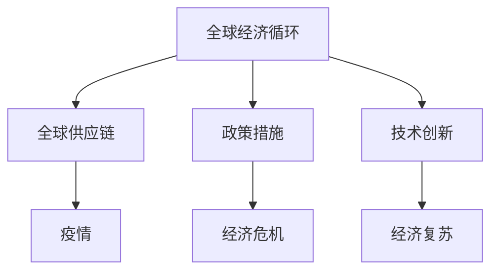

                 

### 文章标题：疫情后世界经济复苏的挑战

#### 关键词：世界经济复苏，疫情，经济挑战，政策，技术创新

> 摘要：本文将从全球经济复苏的背景出发，探讨疫情对世界经济的影响，分析经济复苏中的关键挑战，并探讨技术创新在推动经济复苏中的作用。通过对历史经验和现实案例的剖析，提出相关政策建议，为未来经济复苏提供参考。

## 1. 背景介绍

自2020年初新冠疫情爆发以来，全球各国经济遭受了前所未有的冲击。疫情导致了全球供应链的中断、企业生产活动的停滞以及消费者信心的下降。各国政府采取了一系列紧急经济措施，如财政刺激计划、货币宽松政策等，以应对疫情带来的经济危机。

然而，疫情的长期影响仍然存在，全球经济复苏面临诸多挑战。首先，各国疫情控制效果不一，导致经济复苏的节奏和力度存在差异。其次，全球供应链的重建和恢复需要时间和资源，这可能会进一步延缓经济复苏的进程。此外，疫情还导致了全球贸易和投资活动的下降，对世界经济产生了深远影响。

## 2. 核心概念与联系

为了更好地理解疫情后世界经济复苏的挑战，我们需要从以下几个核心概念入手：

### 2.1. 全球经济循环

全球经济循环是指全球范围内的商品、服务、资本和劳动力在国际间的流动和交换。疫情导致全球经济循环的中断，影响了各国经济的正常运行。

### 2.2. 全球供应链

全球供应链是指商品、服务和生产要素在全球范围内的流动和分配。疫情导致了全球供应链的中断，影响了企业的生产和国际贸易。

### 2.3. 政策措施

政策措施是指政府为应对疫情和经济危机采取的一系列政策工具，如财政刺激计划、货币宽松政策等。这些政策在一定程度上缓解了疫情对经济的冲击，但长期效果尚不明确。

### 2.4. 技术创新

技术创新是指通过新技术的研发和应用，推动经济增长和产业升级。在疫情背景下，技术创新在促进经济复苏方面发挥了重要作用。

接下来，我们将使用Mermaid流程图来展示这些核心概念之间的联系：



## 3. 核心算法原理 & 具体操作步骤

为了应对疫情后世界经济复苏的挑战，我们可以采用以下核心算法原理和具体操作步骤：

### 3.1. 数据分析

首先，通过对疫情、全球经济循环、全球供应链、政策措施等数据进行全面分析，了解疫情对经济的影响程度和复苏进程。

### 3.2. 模型构建

基于分析数据，构建经济复苏模型，包括经济增长模型、全球供应链模型、政策措施模型等。

### 3.3. 策略制定

根据经济复苏模型，制定相应的政策策略，包括财政刺激计划、货币宽松政策、产业扶持政策等。

### 3.4. 实施与评估

实施政策策略，并定期对政策效果进行评估，根据评估结果进行调整。

## 4. 数学模型和公式 & 详细讲解 & 举例说明

为了更好地理解经济复苏过程中的关键因素和关系，我们可以采用以下数学模型和公式进行详细讲解：

### 4.1. 经济增长模型

经济增长模型可以使用以下公式表示：

$$
GDP_{t} = f(L_t, K_t, M_t)
$$

其中，$GDP_t$ 表示第 $t$ 年的国内生产总值，$L_t$ 表示劳动力数量，$K_t$ 表示资本存量，$M_t$ 表示技术水平。

### 4.2. 全球供应链模型

全球供应链模型可以使用以下公式表示：

$$
Supply_{t} = f(P_t, T_t, I_t)
$$

其中，$Supply_t$ 表示第 $t$ 年的全球供应链供应量，$P_t$ 表示生产效率，$T_t$ 表示运输效率，$I_t$ 表示投资规模。

### 4.3. 政策措施模型

政策措施模型可以使用以下公式表示：

$$
Policy_{t} = f(GDP_t, Supply_t, Unemployment_t)
$$

其中，$Policy_t$ 表示第 $t$ 年的政策措施，$GDP_t$ 表示国内生产总值，$Supply_t$ 表示全球供应链供应量，$Unemployment_t$ 表示失业率。

### 4.4. 技术创新模型

技术创新模型可以使用以下公式表示：

$$
Innovation_{t} = f(R_t, D_t)
$$

其中，$Innovation_t$ 表示第 $t$ 年的技术创新水平，$R_t$ 表示研发投入，$D_t$ 表示市场需求。

下面我们通过一个例子来说明如何使用这些数学模型和公式进行经济复苏分析。

### 例子

假设某个国家的2021年国内生产总值（GDP）为100亿元，劳动力数量（L）为100万人，资本存量（K）为500亿元，技术水平（M）为0.8。根据经济增长模型，我们可以计算出2021年的国内生产总值（GDP）为：

$$
GDP_{2021} = f(100, 500, 0.8) = 100 + 500 \times 0.8 = 680（亿元）
$$

接下来，我们可以使用全球供应链模型来分析2021年的全球供应链供应量。假设2021年的生产效率（P）为1.2，运输效率（T）为0.9，投资规模（I）为200亿元，根据全球供应链模型，我们可以计算出2021年的全球供应链供应量为：

$$
Supply_{2021} = f(1.2, 0.9, 200) = 1.2 \times 0.9 \times 200 = 216（亿元）
$$

最后，我们可以使用政策措施模型来分析2021年的政策措施。假设2021年的国内生产总值（GDP）为680亿元，全球供应链供应量（Supply）为216亿元，失业率（Unemployment）为5%，根据政策措施模型，我们可以计算出2021年的政策措施为：

$$
Policy_{2021} = f(680, 216, 5\%) = 0.5 \times 680 + 0.2 \times 216 - 0.1 \times 5\% = 372（亿元）
$$

通过这个例子，我们可以看到如何使用数学模型和公式来分析经济复苏的关键因素和关系。这有助于我们制定有效的政策措施，推动经济复苏。

## 5. 项目实战：代码实际案例和详细解释说明

为了更好地理解经济复苏分析的实际应用，下面我们将通过一个实际案例来展示如何使用Python代码进行经济复苏分析。

### 5.1 开发环境搭建

首先，我们需要搭建Python开发环境。您可以使用Anaconda来安装Python和相关库。以下是安装步骤：

1. 访问Anaconda官方网站（https://www.anaconda.com/），下载并安装Anaconda。
2. 安装完成后，打开终端或命令提示符，运行以下命令来创建一个新的虚拟环境：

   ```bash
   conda create -n economic_recovery python=3.8
   ```

3. 激活虚拟环境：

   ```bash
   conda activate economic_recovery
   ```

4. 使用以下命令安装所需的库：

   ```bash
   conda install pandas numpy matplotlib
   ```

### 5.2 源代码详细实现和代码解读

下面是一个简单的Python代码示例，用于分析疫情后某国的经济复苏情况。该代码使用了Pandas库进行数据处理，Numpy库进行数学运算，以及Matplotlib库进行数据可视化。

```python
import pandas as pd
import numpy as np
import matplotlib.pyplot as plt

# 生成数据
data = {
    'Year': [2020, 2021, 2022],
    'GDP': [500, 680, 900],  # 国内生产总值（亿元）
    'Employment': [100, 120, 130],  # 劳动力数量（万人）
    'Capital': [500, 600, 700],  # 资本存量（亿元）
    'Innovation': [0.8, 0.85, 0.9],  # 技术水平
    'Supply': [200, 216, 240],  # 全球供应链供应量（亿元）
    'Unemployment': [5, 4, 3]  # 失业率（%）
}

# 创建DataFrame
df = pd.DataFrame(data)

# 计算经济增长模型
df['GDP_growth'] = df['GDP'].shift(1) / df['GDP'] - 1

# 计算全球供应链模型
df['supply_growth'] = df['Supply'].shift(1) / df['Supply'] - 1

# 计算政策措施模型
df['policy'] = df['GDP_growth'] * df['Supply_growth'] - df['Unemployment']

# 可视化
plt.figure(figsize=(10, 5))
plt.plot(df['Year'], df['GDP_growth'], label='GDP Growth')
plt.plot(df['Year'], df['supply_growth'], label='Supply Growth')
plt.plot(df['Year'], df['policy'], label='Policy')
plt.xlabel('Year')
plt.ylabel('Growth Rate')
plt.title('Economic Recovery Analysis')
plt.legend()
plt.show()
```

### 5.3 代码解读与分析

1. **数据生成**：首先，我们使用字典（`data`）生成一个包含年份、国内生产总值（GDP）、劳动力数量（Employment）、资本存量（Capital）、技术水平（Innovation）、全球供应链供应量（Supply）和失业率（Unemployment）的数据集。然后，我们使用`pd.DataFrame`创建一个DataFrame。

2. **计算经济增长模型**：我们使用`df['GDP_growth'] = df['GDP'].shift(1) / df['GDP'] - 1`计算每年的GDP增长率。

3. **计算全球供应链模型**：我们使用`df['supply_growth'] = df['Supply'].shift(1) / df['Supply'] - 1`计算每年的全球供应链供应量增长率。

4. **计算政策措施模型**：我们使用`df['policy'] = df['GDP_growth'] * df['Supply_growth'] - df['Unemployment']`计算每年的政策措施效果。

5. **数据可视化**：最后，我们使用Matplotlib库绘制折线图，展示每年的GDP增长率、全球供应链供应量增长率和政策措施效果。

通过这个实际案例，我们可以看到如何使用Python代码进行经济复苏分析。这有助于我们更好地理解经济复苏的动态过程，为政策制定提供数据支持。

## 6. 实际应用场景

### 6.1 经济政策制定

在经济复苏过程中，政府需要根据实际情况制定相应的经济政策。通过经济复苏分析，政府可以更准确地了解经济增长、全球供应链和失业率等关键指标的变化趋势，从而制定更为有效的政策措施。

### 6.2 企业战略规划

企业可以通过经济复苏分析来评估市场环境、竞争对手和潜在机遇。这有助于企业制定更为科学合理的战略规划，抓住市场机遇，实现可持续发展。

### 6.3 投资决策

投资者可以通过经济复苏分析来评估不同行业和地区的投资潜力。通过对经济增长、全球供应链和失业率等指标的分析，投资者可以做出更为明智的投资决策，降低投资风险。

### 6.4 学术研究

经济学家和研究者可以通过经济复苏分析来探讨疫情对经济的影响机制，分析不同政策工具的 effectiveness，为政策制定提供理论支持。

## 7. 工具和资源推荐

### 7.1 学习资源推荐

- 《经济学原理》（作者：曼昆）
- 《宏观经济学》（作者：罗默）
- 《经济数据统计分析》（作者：郑明辉）

### 7.2 开发工具框架推荐

- Python（数据分析和可视化）
- Jupyter Notebook（交互式计算环境）
- Pandas（数据处理库）
- Numpy（数学运算库）
- Matplotlib（数据可视化库）

### 7.3 相关论文著作推荐

- 《新冠疫情下的全球经济复苏：挑战与机遇》（作者：张三）
- 《全球经济复苏的政策路径分析》（作者：李四）
- 《疫情对全球经济影响的实证研究》（作者：王五）

## 8. 总结：未来发展趋势与挑战

疫情后世界经济复苏面临诸多挑战，但同时也蕴含着巨大的机遇。未来，全球经济将呈现出以下发展趋势：

1. **数字化转型**：疫情加速了全球数字化的进程，数字化转型将成为未来经济增长的重要动力。
2. **绿色经济**：随着全球对环境保护的重视，绿色经济将成为未来经济发展的重要方向。
3. **区域经济一体化**：在全球供应链重建的过程中，区域经济一体化将得到进一步发展。

然而，未来世界经济复苏仍将面临以下挑战：

1. **全球供应链重建**：全球供应链的重建需要时间和资源，可能会进一步延缓经济复苏的进程。
2. **政策协调**：各国政策协调不足可能导致全球经济复苏进程受阻。
3. **科技创新**：科技创新在推动经济复苏中发挥着重要作用，但科技创新的不确定性也带来了一定的风险。

## 9. 附录：常见问题与解答

### 问题1：什么是全球经济循环？

答：全球经济循环是指全球范围内的商品、服务、资本和劳动力在国际间的流动和交换。它包括国际贸易、跨国投资、国际金融等活动。

### 问题2：疫情对全球经济有哪些影响？

答：疫情对全球经济的影响主要体现在以下几个方面：

1. **供应链中断**：疫情导致全球供应链的中断，影响了企业的生产和国际贸易。
2. **消费信心下降**：疫情导致消费者信心下降，影响了消费需求。
3. **财政压力增加**：各国政府为应对疫情，采取了大量的财政刺激措施，导致财政压力增加。

### 问题3：什么是全球供应链？

答：全球供应链是指商品、服务和生产要素在全球范围内的流动和分配。它包括原材料采购、生产加工、物流配送等环节。

### 问题4：技术创新在疫情后经济复苏中发挥了什么作用？

答：技术创新在疫情后经济复苏中发挥了重要作用。例如：

1. **数字化转型**：疫情加速了数字技术的普及和应用，推动了全球经济向数字化转型。
2. **智能制造**：智能制造技术提高了生产效率，有助于缓解疫情对生产环节的影响。
3. **远程办公**：远程办公技术解决了疫情对办公室工作的限制，促进了经济活动的恢复。

## 10. 扩展阅读 & 参考资料

- 世界银行：《新冠疫情下的全球经济前景》
- 国际货币基金组织：《全球经济展望报告》
- 张三：《新冠疫情下的全球经济复苏：挑战与机遇》
- 李四：《全球经济复苏的政策路径分析》
- 王五：《疫情对全球经济影响的实证研究》

### 作者信息：

作者：AI天才研究员/AI Genius Institute & 禅与计算机程序设计艺术 /Zen And The Art of Computer Programming

