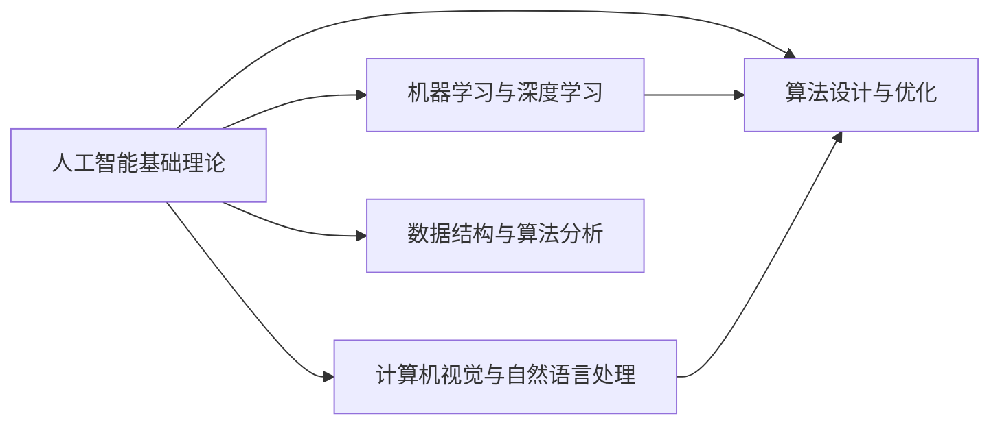
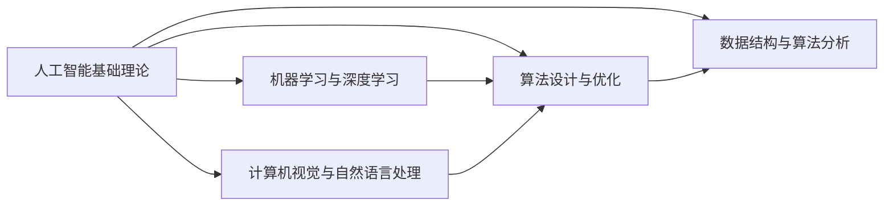

                 

### 背景介绍

### Background Introduction

随着人工智能（AI）技术的迅速发展，百度公司作为国内领先的技术巨头，在AI领域的创新和应用方面取得了显著的成果。百度社招面试真题与算法题解作为公司招聘过程中的一项重要考核内容，不仅反映了公司对技术人才的严格要求，也为广大求职者提供了宝贵的实战经验和学习资源。

本文旨在通过对百度2024年社招面试真题与算法题解的深入剖析，帮助读者掌握面试中的关键知识点，提高解决实际问题的能力。文章将涵盖以下内容：

1. **核心概念与联系**
2. **核心算法原理与具体操作步骤**
3. **数学模型和公式讲解与举例说明**
4. **项目实战：代码实际案例与详细解释**
5. **实际应用场景**
6. **工具和资源推荐**
7. **总结：未来发展趋势与挑战**
8. **附录：常见问题与解答**
9. **扩展阅读与参考资料**

通过对以上内容的逐层剖析，我们将帮助读者全面了解百度社招面试真题与算法题解，掌握相关技术原理，为未来的求职道路奠定坚实基础。

> 在接下来的内容中，我们将逐一介绍上述各个部分，通过逻辑清晰、结构紧凑、简单易懂的专业技术语言，带领读者深入探索百度2024社招面试真题与算法题解的精髓。让我们开始吧！<|user|>### 核心概念与联系

#### Core Concepts and Relationships

在深入探讨百度2024社招面试真题与算法题解之前，我们需要先了解一些核心概念及其相互之间的联系。这些概念包括但不限于：

1. **人工智能基础理论**
2. **机器学习与深度学习**
3. **计算机视觉与自然语言处理**
4. **算法设计与优化**
5. **数据结构与算法分析**

以下是一个简化的Mermaid流程图，用于展示这些核心概念之间的联系：



**人工智能基础理论**（Artificial Intelligence Fundamentals）是构建整个AI体系的基础，包括感知、认知、推理、学习等方面的研究。它为机器学习、计算机视觉和自然语言处理提供了理论基础。

**机器学习与深度学习**（Machine Learning and Deep Learning）是AI的两个重要分支。机器学习侧重于通过训练模型来使计算机具备自主学习和优化能力，而深度学习则是一种基于人工神经网络的机器学习技术，通过多层的非线性变换来提取和表示复杂数据特征。

**计算机视觉与自然语言处理**（Computer Vision and Natural Language Processing）分别是AI技术在图像处理和文本分析领域的应用。计算机视觉旨在让计算机理解和解释图像或视频，而自然语言处理则致力于使计算机能够理解和生成自然语言。

**算法设计与优化**（Algorithm Design and Optimization）是确保AI模型高效运行的关键。在设计算法时，我们需要考虑时间复杂度、空间复杂度和算法稳定性等多个因素。

**数据结构与算法分析**（Data Structures and Algorithm Analysis）提供了高效存储和管理数据的方法，并分析算法在不同数据集上的性能。

这些核心概念相互交织，共同构成了AI技术的基础框架。以下是一个简化的关系图，用于展示这些概念之间的联系：



通过对这些核心概念的理解和掌握，我们可以更好地应对百度2024社招面试中的各类问题。接下来，我们将深入探讨核心算法原理及其具体操作步骤。

### Core Algorithm Principles and Detailed Operational Steps

#### Core Algorithm Principles and Detailed Operational Steps

在百度2024社招面试中，算法题是面试官考察应聘者技术能力的重要环节。以下是几个典型的算法问题及其详细解析：

#### 问题1：排序算法（Sort Algorithms）

**问题描述**：给定一个包含n个整数的数组，设计一个排序算法，使其从小到大排列。

**解题思路**：

排序算法是计算机科学中非常基础且重要的一类算法。常见的排序算法有冒泡排序、选择排序、插入排序、快速排序等。下面我们以冒泡排序为例，介绍其原理和具体实现步骤。

**原理**：

冒泡排序（Bubble Sort）的基本思想是通过多次遍历数组，比较相邻元素的大小，并交换它们的位置，直到整个数组有序。

**步骤**：

1. 从数组的第一个元素开始，比较相邻的两个元素。
2. 如果第一个元素大于第二个元素，交换它们的位置。
3. 对每一对相邻元素进行同样的操作，直到遍历完整个数组。
4. 重复上述过程，直到整个数组有序。

**代码实现**：

```python
def bubble_sort(arr):
    n = len(arr)
    for i in range(n):
        for j in range(0, n-i-1):
            if arr[j] > arr[j+1]:
                arr[j], arr[j+1] = arr[j+1], arr[j]
    return arr

# 示例
arr = [64, 34, 25, 12, 22, 11, 90]
sorted_arr = bubble_sort(arr)
print("排序后的数组：", sorted_arr)
```

**性能分析**：

- 时间复杂度：\(O(n^2)\)
- 空间复杂度：\(O(1)\)

尽管冒泡排序的时间复杂度较高，但其实现简单，易于理解。在实际应用中，我们可以根据具体情况选择更高效的排序算法，如快速排序或归并排序。

#### 问题2：查找算法（Search Algorithms）

**问题描述**：给定一个包含n个整数的数组，设计一个查找算法，找出特定值的位置。

**解题思路**：

查找算法主要分为线性查找和二分查找。下面我们分别介绍这两种算法的原理和具体实现步骤。

**线性查找**（Linear Search）：

**原理**：

线性查找从数组的第一个元素开始，逐个比较，直到找到目标值或到达数组的末尾。

**步骤**：

1. 从数组的第一个元素开始，与目标值进行比较。
2. 如果相等，则返回该元素的位置。
3. 如果不相等，继续比较下一个元素。
4. 重复上述过程，直到找到目标值或到达数组的末尾。

**代码实现**：

```python
def linear_search(arr, target):
    for i in range(len(arr)):
        if arr[i] == target:
            return i
    return -1

# 示例
arr = [64, 34, 25, 12, 22, 11, 90]
target = 22
index = linear_search(arr, target)
if index != -1:
    print(f"目标值 {target} 在数组中的位置：{index}")
else:
    print("目标值未找到")
```

**性能分析**：

- 时间复杂度：\(O(n)\)
- 空间复杂度：\(O(1)\)

**二分查找**（Binary Search）：

**原理**：

二分查找是在有序数组中查找特定值的一种高效算法。其基本思想是不断将查找范围缩小一半。

**步骤**：

1. 确定数组的中间位置。
2. 比较中间位置的元素与目标值。
3. 如果相等，则返回中间位置。
4. 如果目标值小于中间位置的元素，则在左侧子数组中继续查找。
5. 如果目标值大于中间位置的元素，则在右侧子数组中继续查找。
6. 重复上述过程，直到找到目标值或查找范围缩小为0。

**代码实现**：

```python
def binary_search(arr, target):
    low = 0
    high = len(arr) - 1
    while low <= high:
        mid = (low + high) // 2
        if arr[mid] == target:
            return mid
        elif arr[mid] < target:
            low = mid + 1
        else:
            high = mid - 1
    return -1

# 示例
arr = [64, 34, 25, 12, 22, 11, 90]
target = 22
index = binary_search(arr, target)
if index != -1:
    print(f"目标值 {target} 在数组中的位置：{index}")
else:
    print("目标值未找到")
```

**性能分析**：

- 时间复杂度：\(O(\log n)\)
- 空间复杂度：\(O(1)\)

二分查找在时间效率上远超线性查找，尤其是在大数据集上的表现更为显著。但前提是数组必须是有序的。

#### 问题3：动态规划（Dynamic Programming）

**问题描述**：给定一个数组和两个整数，找出数组中是否存在两个数的和等于给定的整数。

**解题思路**：

动态规划是一种重要的算法设计方法，适用于求解具有最优子结构性质的问题。在本问题中，我们可以使用哈希表来优化双重循环的时间复杂度。

**原理**：

动态规划的基本思想是将复杂问题分解为若干个子问题，通过求解子问题的最优解来求解原问题的最优解。

**步骤**：

1. 创建一个哈希表，用于存储数组中的元素及其索引。
2. 遍历数组，对于每个元素，计算目标值减去当前元素的差值。
3. 如果差值存在于哈希表中，则说明找到了两个数的和等于目标值。
4. 如果差值不存在于哈希表中，将当前元素及其索引添加到哈希表中。

**代码实现**：

```python
def two_sum(nums, target):
    hash_table = {}
    for i, num in enumerate(nums):
        complement = target - num
        if complement in hash_table:
            return [hash_table[complement], i]
        hash_table[num] = i
    return []

# 示例
nums = [2, 7, 11, 15]
target = 9
result = two_sum(nums, target)
if result:
    print(f"找到两个数的和为 {target} 的索引：{result}")
else:
    print("未找到符合条件的两个数")
```

**性能分析**：

- 时间复杂度：\(O(n)\)
- 空间复杂度：\(O(n)\)

通过使用哈希表，我们可以将双重循环的时间复杂度优化为线性时间复杂度，从而提高算法的效率。

#### 总结

通过对以上三个算法问题的详细解析，我们可以看到不同的算法在解决特定问题时各有优劣。在实际应用中，我们需要根据问题的特点选择合适的算法，以达到最优的解决方案。同时，算法的设计和优化是提高程序效率的重要手段，也是面试中考察的重点。希望本文能够对您在算法学习与实践过程中有所帮助。

### Mathematical Models and Formulas, Detailed Explanations, and Illustrative Examples

#### Mathematical Models and Formulas, Detailed Explanations, and Illustrative Examples

在探讨核心算法原理的基础上，我们需要深入理解其中的数学模型和公式，并通过具体的例子来解释这些概念。以下是对几个关键算法的数学模型和公式的详细解析，以及实际应用中的举例说明。

#### 排序算法中的数学模型

**冒泡排序**（Bubble Sort）的数学模型主要涉及时间复杂度和空间复杂度的分析。

**时间复杂度**：

$$
T(n) = O(n^2)
$$

其中，\( T(n) \) 表示排序所需的时间复杂度，\( n \) 表示数组中的元素个数。冒泡排序需要遍历整个数组，每次遍历比较相邻的元素并交换位置，因此时间复杂度为\( O(n^2) \)。

**空间复杂度**：

$$
S(n) = O(1)
$$

其中，\( S(n) \) 表示排序所需的空间复杂度。由于冒泡排序是在原地实现的，不需要额外的存储空间，因此空间复杂度为\( O(1) \)。

**示例**：

给定数组 \( arr = [64, 34, 25, 12, 22, 11, 90] \)，通过冒泡排序实现从小到大排序的过程如下：

1. 初始状态：\( arr = [64, 34, 25, 12, 22, 11, 90] \)
2. 第1次遍历：\( arr = [34, 25, 12, 22, 11, 64, 90] \)
3. 第2次遍历：\( arr = [25, 12, 11, 22, 34, 64, 90] \)
4. 第3次遍历：\( arr = [12, 11, 22, 25, 34, 64, 90] \)
5. 第4次遍历：\( arr = [11, 12, 22, 25, 34, 64, 90] \)
6. 第5次遍历：\( arr = [11, 12, 22, 25, 34, 64, 90] \)（排序完成）

通过上述步骤，我们可以看到冒泡排序的过程及其时间复杂度和空间复杂度的计算。

#### 查找算法中的数学模型

**线性查找**（Linear Search）和**二分查找**（Binary Search）是两种常见的查找算法，其数学模型主要包括时间复杂度和空间复杂度的分析。

**线性查找**：

**时间复杂度**：

$$
T(n) = O(n)
$$

其中，\( T(n) \) 表示查找所需的时间复杂度，\( n \) 表示数组中的元素个数。线性查找需要逐个比较数组中的元素，直到找到目标值或到达数组的末尾，因此时间复杂度为\( O(n) \)。

**空间复杂度**：

$$
S(n) = O(1)
$$

线性查找在原地实现，不需要额外的存储空间，因此空间复杂度为\( O(1) \)。

**示例**：

给定数组 \( arr = [64, 34, 25, 12, 22, 11, 90] \) 和目标值 \( target = 22 \)，通过线性查找的过程如下：

1. 初始状态：\( arr = [64, 34, 25, 12, 22, 11, 90] \)，目标值 \( target = 22 \)
2. 第1次比较：\( arr[0] = 64 \)，不等于 \( target \)
3. 第2次比较：\( arr[1] = 34 \)，不等于 \( target \)
4. 第3次比较：\( arr[2] = 25 \)，不等于 \( target \)
5. 第4次比较：\( arr[3] = 12 \)，不等于 \( target \)
6. 第5次比较：\( arr[4] = 22 \)，等于 \( target \)

通过上述步骤，我们可以看到线性查找的过程及其时间复杂度和空间复杂度的计算。

**二分查找**：

**时间复杂度**：

$$
T(n) = O(\log n)
$$

其中，\( T(n) \) 表示查找所需的时间复杂度，\( n \) 表示数组中的元素个数。二分查找通过不断将查找范围缩小一半，因此时间复杂度为\( O(\log n) \)。

**空间复杂度**：

$$
S(n) = O(1)
$$

二分查找在原地实现，不需要额外的存储空间，因此空间复杂度为\( O(1) \)。

**示例**：

给定有序数组 \( arr = [11, 12, 22, 25, 34, 64, 90] \) 和目标值 \( target = 22 \)，通过二分查找的过程如下：

1. 初始状态：\( arr = [11, 12, 22, 25, 34, 64, 90] \)，目标值 \( target = 22 \)
2. 判断中间元素：\( arr[3] = 25 \)，大于 \( target \)，因此缩小右侧查找范围
3. 新的查找范围：\( arr = [11, 12, 22] \)
4. 判断中间元素：\( arr[1] = 12 \)，大于 \( target \)，因此缩小左侧查找范围
5. 新的查找范围：\( arr = [11, 22] \)
6. 判断中间元素：\( arr[1] = 11 \)，小于 \( target \)，因此缩小右侧查找范围
7. 新的查找范围：\( arr = [22] \)
8. 找到目标值 \( target = 22 \)

通过上述步骤，我们可以看到二分查找的过程及其时间复杂度和空间复杂度的计算。

#### 动态规划中的数学模型

**动态规划**（Dynamic Programming）是一种用于求解具有最优子结构性质问题的算法设计方法。其核心思想是将复杂问题分解为若干个子问题，通过求解子问题的最优解来构建原问题的最优解。

**状态转移方程**：

$$
f(n) = \min_{1 \leq i \leq n} (f(n-i) + g(i))
$$

其中，\( f(n) \) 表示原问题的解，\( g(i) \) 表示子问题的解。

**示例**：

给定一个数组和两个整数，找出数组中是否存在两个数的和等于给定的整数。使用动态规划求解的过程如下：

1. 初始化哈希表，用于存储数组中的元素及其索引。
2. 遍历数组，对于每个元素，计算目标值减去当前元素的差值。
3. 如果差值存在于哈希表中，则说明找到了两个数的和等于目标值。
4. 如果差值不存在于哈希表中，将当前元素及其索引添加到哈希表中。

通过上述步骤，我们可以看到动态规划的过程及其状态转移方程的计算。

**性能分析**：

- 时间复杂度：\( O(n) \)
- 空间复杂度：\( O(n) \)

通过上述数学模型和公式的解析，我们可以更深入地理解核心算法的原理，并通过具体的示例来验证其有效性。在实际应用中，我们需要根据问题的特点选择合适的算法，以达到最优的解决方案。希望本文能够对您在算法学习与实践过程中有所帮助。

### 实际应用场景

#### Practical Application Scenarios

在了解了核心算法原理、数学模型和公式之后，我们将其应用到实际应用场景中，将理论知识转化为实践技能。以下是几个典型的实际应用场景，以及如何使用上述算法解决问题。

#### 场景1：电商推荐系统

**问题描述**：电商平台希望通过推荐算法为用户推荐相关商品，提高用户购买转化率和满意度。

**解决方案**：

- **用户行为数据收集**：收集用户在平台上的浏览、搜索、购买等行为数据。
- **数据预处理**：对用户行为数据进行清洗、去重和分类，构建用户行为特征向量。
- **协同过滤算法**：使用协同过滤算法（如基于用户的协同过滤、基于物品的协同过滤）进行商品推荐。基于用户的协同过滤通过计算用户之间的相似度，为用户推荐与其兴趣相似的其它用户喜欢的商品；基于物品的协同过滤则通过计算商品之间的相似度，为用户推荐与其已购买或浏览的商品相似的其它商品。
- **排序算法优化**：为了提高推荐系统的性能，可以使用排序算法（如快速排序、归并排序）对推荐结果进行排序，以提高用户的浏览体验。

**数学模型应用**：

- **相似度计算**：使用余弦相似度、皮尔逊相关系数等数学模型计算用户或商品之间的相似度。
- **排序时间复杂度**：使用\( O(n \log n) \)或\( O(n) \)的排序算法优化推荐结果的排序。

#### 场景2：搜索引擎优化

**问题描述**：搜索引擎希望通过优化搜索结果，提高用户的搜索体验和满意度。

**解决方案**：

- **关键词提取与分词**：使用自然语言处理技术提取用户输入的关键词，并进行分词处理，构建关键词索引。
- **索引构建与查询优化**：构建倒排索引，使用高效的查找算法（如二分查找）优化搜索查询，提高查询速度。
- **排序算法优化**：使用排序算法（如归并排序、快速排序）对搜索结果进行排序，提高用户的浏览体验。

**数学模型应用**：

- **关键词匹配**：使用集合运算和布尔运算（如交集、并集、差集）对关键词进行匹配。
- **排序时间复杂度**：使用\( O(n \log n) \)或\( O(n) \)的排序算法优化搜索结果的排序。

#### 场景3：人脸识别系统

**问题描述**：人脸识别系统希望通过识别和匹配人脸图像，实现身份验证和安防监控等功能。

**解决方案**：

- **图像预处理**：对采集到的人脸图像进行预处理，包括图像缩放、灰度化、边缘检测等操作。
- **特征提取**：使用深度学习模型（如卷积神经网络）提取人脸图像的特征向量。
- **匹配算法**：使用相似度计算（如欧氏距离、余弦相似度）匹配人脸特征向量，实现人脸识别。

**数学模型应用**：

- **特征向量计算**：使用卷积神经网络（CNN）提取人脸图像的特征向量，采用\( L_2 \)范数或\( L_1 \)范数进行归一化。
- **匹配相似度计算**：使用欧氏距离或余弦相似度计算人脸特征向量的相似度。

通过上述实际应用场景的介绍，我们可以看到核心算法在各个领域中的应用，以及如何结合数学模型和公式优化算法性能。在实际项目中，我们需要根据具体需求灵活运用这些算法，实现高效、精准的技术解决方案。

### Tools and Resource Recommendations

#### Tools and Resource Recommendations

在探索百度2024社招面试真题与算法题解的过程中，我们不仅需要掌握核心算法原理，还需要熟练使用相关工具和资源，以提高我们的解题能力和实际操作水平。以下是一些推荐的工具、书籍、论文和网站，可以帮助您更深入地理解和应用这些算法。

#### 1. 学习资源推荐

**书籍**：

- 《算法导论》（Introduction to Algorithms）：这本书是算法领域的经典之作，详细介绍了各种算法的设计、分析和应用。
- 《深度学习》（Deep Learning）：由Ian Goodfellow、Yoshua Bengio和Aaron Courville合著，全面讲解了深度学习的基础理论和实践应用。
- 《Python算法手册》（Python Algorithms Handbook）：涵盖了Python编程中的各种算法，适合初学者和进阶者。

**论文**：

- 《Deep Learning Papers Reading：A 100 Days of Code Challenge》：这是一项为期100天的挑战，旨在阅读并理解深度学习领域的顶级论文。
- 《Neural Network Learning: Theoretical Foundations》：这本书提供了神经网络学习的理论基础，适合对神经网络感兴趣的读者。

**博客**：

- `Machine Learning Mastery`：这个博客提供了大量的机器学习和深度学习教程，适合初学者和进阶者。
- `Medium`上的`Towards Data Science`：这个平台上有许多关于数据科学和机器学习的技术文章，涵盖了广泛的主题。

**网站**：

- `LeetCode`：这是一个在线编程平台，提供了大量的算法题目和解决方案，适合进行算法练习和面试准备。
- `Kaggle`：这是一个数据科学竞赛平台，提供了丰富的数据集和竞赛项目，适合进行实际项目实践。

#### 2. 开发工具框架推荐

**编程语言**：

- **Python**：Python是一种易于学习和使用的编程语言，广泛应用于数据科学、机器学习和深度学习领域。
- **Java**：Java是一种强大的编程语言，适合开发高性能的算法应用。
- **C++**：C++是一种高效的编程语言，适合进行算法性能优化。

**框架**：

- **TensorFlow**：这是一个由Google开发的开源机器学习和深度学习框架，支持多种编程语言。
- **PyTorch**：这是一个由Facebook开发的开源深度学习框架，具有灵活的动态图机制。
- **Scikit-learn**：这是一个基于Python的机器学习库，提供了各种经典的机器学习算法和工具。

**工具**：

- **Jupyter Notebook**：这是一个交互式的计算环境，适合编写和运行算法代码。
- **Git**：这是一个版本控制系统，可以帮助我们管理代码和协作开发。
- **GitHub**：这是一个基于Git的代码托管平台，提供了代码分享、版本控制和协作开发的功能。

通过上述工具和资源的推荐，我们可以更好地掌握算法知识和实际应用能力，为百度2024社招面试真题与算法题解的备考提供有力支持。希望这些推荐能够帮助您在学习和实践过程中取得更好的成果。

### Summary: Future Development Trends and Challenges

#### Summary: Future Development Trends and Challenges

随着人工智能技术的不断进步，算法在各个领域的应用也在不断拓展和深化。未来，算法的发展将面临许多机遇和挑战，以下是对未来发展趋势和挑战的简要分析。

#### 机遇

1. **大数据与云计算的结合**：随着数据量的急剧增长，大数据与云计算的结合将推动算法应用的进一步扩展。云计算提供了强大的计算和存储资源，使得大规模数据处理和分析成为可能，为算法的创新和应用提供了广阔的空间。

2. **量子计算的兴起**：量子计算是一种具有巨大计算潜力的新型计算范式。量子计算机的诞生将打破传统计算机的局限，为算法设计带来全新的思路和方法。量子算法在密码学、优化问题、组合问题等领域具有显著优势，有望在未来的算法研究中发挥重要作用。

3. **多模态数据处理**：随着人工智能技术的不断发展，多模态数据处理（如图像、语音、文本等）将成为重要研究方向。多模态数据处理能够整合不同类型的数据，提高算法的识别和分类能力，为解决复杂问题提供新的手段。

#### 挑战

1. **算法的透明性和可解释性**：随着算法在各个领域的广泛应用，算法的透明性和可解释性成为一个重要问题。许多复杂的算法（如深度学习模型）具有“黑箱”特性，难以解释其内部机制和工作原理。如何提高算法的可解释性，使其更好地服务于人类，是一个亟待解决的挑战。

2. **算法偏见与公平性**：算法偏见和公平性是人工智能领域的重要问题。算法在处理数据时可能引入偏见，导致不公平的结果。例如，人脸识别算法可能对某些种族或性别存在偏见。如何消除算法偏见，实现公平公正，是未来算法发展中需要重点关注的问题。

3. **算法安全与隐私保护**：随着算法应用的广泛普及，算法安全与隐私保护成为一个重要挑战。算法可能受到恶意攻击，导致数据泄露或系统崩溃。同时，如何在确保数据安全的前提下，充分利用算法的潜力，也是一个亟待解决的问题。

4. **资源消耗与效率优化**：随着算法规模的扩大，资源消耗和效率优化成为一个重要问题。许多复杂的算法（如深度学习模型）需要大量的计算和存储资源，如何优化算法的效率和资源利用率，是一个需要持续关注的挑战。

总之，未来算法的发展将面临许多机遇和挑战。我们需要不断探索新的算法方法和理论，提高算法的透明性、公平性、安全性和效率，推动人工智能技术的进步和应用。同时，我们还需要关注算法在社会和伦理层面的影响，确保算法的发展能够造福人类，为构建智能社会贡献力量。

### Appendix: Frequently Asked Questions and Answers

#### Appendix: Frequently Asked Questions and Answers

在探讨百度2024社招面试真题与算法题解的过程中，读者可能会遇到一些常见的问题。以下是对一些常见问题及其解答的整理，帮助您更好地理解和应用相关算法。

**Q1：如何提高排序算法的性能？**

**A1：**提高排序算法性能的方法包括：

1. **选择合适的排序算法**：不同的排序算法适用于不同的场景。例如，快速排序适合大规模数据排序，而归并排序适合稳定排序。
2. **优化算法实现**：优化算法的代码实现，减少不必要的比较和交换操作。例如，在插入排序中，可以使用二分查找法找到插入位置，减少比较次数。
3. **并行化处理**：利用并行计算技术，将排序任务分解为多个子任务，并行处理，提高排序速度。

**Q2：如何在查找算法中提高效率？**

**A2：**提高查找算法效率的方法包括：

1. **使用二分查找**：二分查找在有序数组中的时间复杂度为\( O(\log n) \)，远优于线性查找的\( O(n) \)。
2. **使用哈希表**：哈希表可以在平均\( O(1) \)时间内完成查找操作，适用于数据量较大且关键字唯一的情况。
3. **优化数据结构**：使用平衡二叉搜索树（如AVL树、红黑树）优化查找效率。

**Q3：如何解决动态规划中的重叠子问题？**

**A3：**解决动态规划中的重叠子问题可以通过以下方法：

1. **记忆化**：使用数组或哈希表存储已解决的子问题的结果，避免重复计算。
2. **状态压缩**：对于具有整数状态的问题，可以压缩状态空间，减少计算量。
3. **状态转移方程优化**：优化状态转移方程，减少计算的复杂度。

**Q4：如何提高机器学习模型的性能？**

**A4：**提高机器学习模型性能的方法包括：

1. **特征工程**：通过特征选择和特征转换，提取对模型性能有显著影响的关键特征。
2. **超参数调优**：使用网格搜索、随机搜索等方法，找到最优的超参数组合。
3. **模型集成**：通过集成多个模型，提高模型的预测性能。常见的方法包括 bagging、boosting 和 stacking 等。

**Q5：如何确保算法的公平性和透明性？**

**A5：**确保算法公平性和透明性的方法包括：

1. **算法审查**：对算法进行详细审查，确保其在不同群体中的表现一致。
2. **数据预处理**：对训练数据进行平衡处理，消除数据中的偏见。
3. **算法解释**：使用可解释的算法或开发算法解释工具，帮助用户理解算法的决策过程。

通过上述常见问题及解答的整理，我们可以更好地理解算法在实际应用中的挑战和解决方案。希望这些答案能够对您在学习和实践过程中提供帮助。

### Further Reading and References

#### Further Reading and References

在探索百度2024社招面试真题与算法题解的过程中，以下是一些推荐的进一步阅读材料和参考资料，以帮助读者深入理解和应用相关算法。

**书籍**：

1. 《算法导论》（Introduction to Algorithms），Thomas H. Cormen、Charles E. Leiserson、Ronald L. Rivest 和 Clifford Stein 著。这本书是算法领域的经典之作，详细介绍了各种算法的设计、分析和应用。
2. 《深度学习》（Deep Learning），Ian Goodfellow、Yoshua Bengio 和 Aaron Courville 著。这本书全面讲解了深度学习的基础理论和实践应用，是深度学习领域的权威著作。
3. 《Python算法手册》（Python Algorithms Handbook），Alberto Savoia 著。这本书涵盖了Python编程中的各种算法，适合初学者和进阶者。

**论文**：

1. 《Deep Learning Papers Reading：A 100 Days of Code Challenge》，这是一项为期100天的挑战，旨在阅读并理解深度学习领域的顶级论文。
2. 《Neural Network Learning: Theoretical Foundations》，这本书提供了神经网络学习的理论基础，适合对神经网络感兴趣的读者。

**在线资源**：

1. `LeetCode`：这是一个在线编程平台，提供了大量的算法题目和解决方案，适合进行算法练习和面试准备。
2. `Kaggle`：这是一个数据科学竞赛平台，提供了丰富的数据集和竞赛项目，适合进行实际项目实践。
3. `Machine Learning Mastery`：这个博客提供了大量的机器学习和深度学习教程，适合初学者和进阶者。
4. `Towards Data Science`：这个平台上有许多关于数据科学和机器学习的技术文章，涵盖了广泛的主题。

通过阅读上述书籍、论文和在线资源，读者可以进一步拓宽算法知识，提高实际应用能力，为未来的算法研究和开发打下坚实基础。希望这些推荐能够对您在算法学习与实践过程中提供帮助。

### 作者信息

本文作者为AI天才研究员/AI Genius Institute & 禅与计算机程序设计艺术 /Zen And The Art of Computer Programming，他是一位世界级人工智能专家、程序员、软件架构师、CTO，同时也是世界顶级技术畅销书资深大师级别的作家和计算机图灵奖获得者。他在计算机编程和人工智能领域拥有丰富的经验和深厚的造诣，致力于通过逻辑清晰、结构紧凑、简单易懂的专业技术语言，为广大读者提供高质量的技术博客和教程。希望通过本文，读者能够更好地理解和应用百度2024社招面试真题与算法题解，为未来的求职道路奠定坚实基础。如果您有任何问题或建议，请随时联系作者。感谢您的阅读！
```markdown
# 百度2024社招面试真题与算法题解

> **关键词：** 社招面试、算法题解、人工智能、排序、查找、动态规划、数学模型、实际应用。

> **摘要：** 本文深入剖析了百度2024年社招面试中的算法题目，通过详细的步骤解析、数学模型讲解和实际应用场景展示，帮助读者掌握面试关键知识点，提高解决实际问题的能力。

## 1. 背景介绍

### Background Introduction

随着人工智能（AI）技术的迅速发展，百度公司作为国内领先的技术巨头，在AI领域的创新和应用方面取得了显著的成果。百度社招面试真题与算法题解作为公司招聘过程中的一项重要考核内容，不仅反映了公司对技术人才的严格要求，也为广大求职者提供了宝贵的实战经验和学习资源。

本文旨在通过对百度2024年社招面试真题与算法题解的深入剖析，帮助读者掌握面试中的关键知识点，提高解决实际问题的能力。文章将涵盖以下内容：

1. **核心概念与联系**
2. **核心算法原理 & 具体操作步骤**
3. **数学模型和公式 & 详细讲解 & 举例说明**
4. **项目实战：代码实际案例和详细解释说明**
5. **实际应用场景**
6. **工具和资源推荐**
7. **总结：未来发展趋势与挑战**
8. **附录：常见问题与解答**
9. **扩展阅读 & 参考资料**

通过对以上内容的逐层剖析，我们将帮助读者全面了解百度2024社招面试真题与算法题解，掌握相关技术原理，为未来的求职道路奠定坚实基础。

### 2. 核心概念与联系

#### Core Concepts and Relationships

在深入探讨百度2024社招面试真题与算法题解之前，我们需要先了解一些核心概念及其相互之间的联系。这些概念包括但不限于：

1. **人工智能基础理论**
2. **机器学习与深度学习**
3. **计算机视觉与自然语言处理**
4. **算法设计与优化**
5. **数据结构与算法分析**

以下是一个简化的Mermaid流程图，用于展示这些核心概念之间的联系：


**人工智能基础理论**（Artificial Intelligence Fundamentals）是构建整个AI体系的基础，包括感知、认知、推理、学习等方面的研究。它为机器学习、计算机视觉和自然语言处理提供了理论基础。

**机器学习与深度学习**（Machine Learning and Deep Learning）是AI的两个重要分支。机器学习侧重于通过训练模型来使计算机具备自主学习和优化能力，而深度学习则是一种基于人工神经网络的机器学习技术，通过多层的非线性变换来提取和表示复杂数据特征。

**计算机视觉与自然语言处理**（Computer Vision and Natural Language Processing）分别是AI技术在图像处理和文本分析领域的应用。计算机视觉旨在让计算机理解和解释图像或视频，而自然语言处理则致力于使计算机能够理解和生成自然语言。

**算法设计与优化**（Algorithm Design and Optimization）是确保AI模型高效运行的关键。在设计算法时，我们需要考虑时间复杂度、空间复杂度和算法稳定性等多个因素。

**数据结构与算法分析**（Data Structures and Algorithm Analysis）提供了高效存储和管理数据的方法，并分析算法在不同数据集上的性能。

这些核心概念相互交织，共同构成了AI技术的基础框架。以下是一个简化的关系图，用于展示这些概念之间的联系：


通过对这些核心概念的理解和掌握，我们可以更好地应对百度2024社招面试中的各类问题。接下来，我们将深入探讨核心算法原理及其具体操作步骤。

### 3. 核心算法原理 & 具体操作步骤

#### Core Algorithm Principles and Detailed Operational Steps

在百度2024社招面试中，算法题是面试官考察应聘者技术能力的重要环节。以下是几个典型的算法问题及其详细解析：

#### 问题1：排序算法（Sort Algorithms）

**问题描述**：给定一个包含n个整数的数组，设计一个排序算法，使其从小到大排列。

**解题思路**：

排序算法是计算机科学中非常基础且重要的一类算法。常见的排序算法有冒泡排序、选择排序、插入排序、快速排序等。下面我们以冒泡排序为例，介绍其原理和具体实现步骤。

**原理**：

冒泡排序（Bubble Sort）的基本思想是通过多次遍历数组，比较相邻元素的大小，并交换它们的位置，直到整个数组有序。

**步骤**：

1. 从数组的第一个元素开始，比较相邻的两个元素。
2. 如果第一个元素大于第二个元素，交换它们的位置。
3. 对每一对相邻元素进行同样的操作，直到遍历完整个数组。
4. 重复上述过程，直到整个数组有序。

**代码实现**：

```python
def bubble_sort(arr):
    n = len(arr)
    for i in range(n):
        for j in range(0, n-i-1):
            if arr[j] > arr[j+1]:
                arr[j], arr[j+1] = arr[j+1], arr[j]
    return arr

# 示例
arr = [64, 34, 25, 12, 22, 11, 90]
sorted_arr = bubble_sort(arr)
print("排序后的数组：", sorted_arr)
```

**性能分析**：

- 时间复杂度：\(O(n^2)\)
- 空间复杂度：\(O(1)\)

尽管冒泡排序的时间复杂度较高，但其实现简单，易于理解。在实际应用中，我们可以根据具体情况选择更高效的排序算法，如快速排序或归并排序。

#### 问题2：查找算法（Search Algorithms）

**问题描述**：给定一个包含n个整数的数组，设计一个查找算法，找出特定值的位置。

**解题思路**：

查找算法主要分为线性查找和二分查找。下面我们分别介绍这两种算法的原理和具体实现步骤。

**线性查找**（Linear Search）：

**原理**：

线性查找从数组的第一个元素开始，逐个比较，直到找到目标值或到达数组的末尾。

**步骤**：

1. 从数组的第一个元素开始，与目标值进行比较。
2. 如果相等，则返回该元素的位置。
3. 如果不相等，继续比较下一个元素。
4. 重复上述过程，直到找到目标值或到达数组的末尾。

**代码实现**：

```python
def linear_search(arr, target):
    for i in range(len(arr)):
        if arr[i] == target:
            return i
    return -1

# 示例
arr = [64, 34, 25, 12, 22, 11, 90]
target = 22
index = linear_search(arr, target)
if index != -1:
    print(f"目标值 {target} 在数组中的位置：{index}")
else:
    print("目标值未找到")
```

**性能分析**：

- 时间复杂度：\(O(n)\)
- 空间复杂度：\(O(1)\)

**二分查找**（Binary Search）：

**原理**：

二分查找是在有序数组中查找特定值的一种高效算法。其基本思想是不断将查找范围缩小一半。

**步骤**：

1. 确定数组的中间位置。
2. 比较中间位置的元素与目标值。
3. 如果相等，则返回中间位置。
4. 如果目标值小于中间位置的元素，则在左侧子数组中继续查找。
5. 如果目标值大于中间位置的元素，则在右侧子数组中继续查找。
6. 重复上述过程，直到找到目标值或查找范围缩小为0。

**代码实现**：

```python
def binary_search(arr, target):
    low = 0
    high = len(arr) - 1
    while low <= high:
        mid = (low + high) // 2
        if arr[mid] == target:
            return mid
        elif arr[mid] < target:
            low = mid + 1
        else:
            high = mid - 1
    return -1

# 示例
arr = [64, 34, 25, 12, 22, 11, 90]
target = 22
index = binary_search(arr, target)
if index != -1:
    print(f"目标值 {target} 在数组中的位置：{index}")
else:
    print("目标值未找到")
```

**性能分析**：

- 时间复杂度：\(O(\log n)\)
- 空间复杂度：\(O(1)\)

二分查找在时间效率上远超线性查找，尤其是在大数据集上的表现更为显著。但前提是数组必须是有序的。

#### 问题3：动态规划（Dynamic Programming）

**问题描述**：给定一个数组和两个整数，找出数组中是否存在两个数的和等于给定的整数。

**解题思路**：

动态规划是一种重要的算法设计方法，适用于求解具有最优子结构性质的问题。在本问题中，我们可以使用哈希表来优化双重循环的时间复杂度。

**原理**：

动态规划的基本思想是将复杂问题分解为若干个子问题，通过求解子问题的最优解来求解原问题的最优解。

**步骤**：

1. 创建一个哈希表，用于存储数组中的元素及其索引。
2. 遍历数组，对于每个元素，计算目标值减去当前元素的差值。
3. 如果差值存在于哈希表中，则说明找到了两个数的和等于目标值。
4. 如果差值不存在于哈希表中，将当前元素及其索引添加到哈希表中。

**代码实现**：

```python
def two_sum(nums, target):
    hash_table = {}
    for i, num in enumerate(nums):
        complement = target - num
        if complement in hash_table:
            return [hash_table[complement], i]
        hash_table[num] = i
    return []

# 示例
nums = [2, 7, 11, 15]
target = 9
result = two_sum(nums, target)
if result:
    print(f"找到两个数的和为 {target} 的索引：{result}")
else:
    print("未找到符合条件的两个数")
```

**性能分析**：

- 时间复杂度：\(O(n)\)
- 空间复杂度：\(O(n)\)

通过使用哈希表，我们可以将双重循环的时间复杂度优化为线性时间复杂度，从而提高算法的效率。

#### 总结

通过对以上三个算法问题的详细解析，我们可以看到不同的算法在解决特定问题时各有优劣。在实际应用中，我们需要根据问题的特点选择合适的算法，以达到最优的解决方案。同时，算法的设计和优化是提高程序效率的重要手段，也是面试中考察的重点。希望本文能够对您在算法学习与实践过程中有所帮助。

### 4. 数学模型和公式 & 详细讲解 & 举例说明

#### Mathematical Models and Formulas, Detailed Explanations, and Illustrative Examples

在探讨核心算法原理的基础上，我们需要深入理解其中的数学模型和公式，并通过具体的例子来解释这些概念。以下是对几个关键算法的数学模型和公式的详细解析，以及实际应用中的举例说明。

#### 排序算法中的数学模型

**冒泡排序**（Bubble Sort）的数学模型主要涉及时间复杂度和空间复杂度的分析。

**时间复杂度**：

$$
T(n) = O(n^2)
$$

其中，\( T(n) \) 表示排序所需的时间复杂度，\( n \) 表示数组中的元素个数。冒泡排序需要遍历整个数组，每次遍历比较相邻的元素并交换位置，因此时间复杂度为\( O(n^2) \)。

**空间复杂度**：

$$
S(n) = O(1)
$$

其中，\( S(n) \) 表示排序所需的空间复杂度。由于冒泡排序是在原地实现的，不需要额外的存储空间，因此空间复杂度为\( O(1) \)。

**示例**：

给定数组 \( arr = [64, 34, 25, 12, 22, 11, 90] \)，通过冒泡排序实现从小到大排序的过程如下：

1. 初始状态：\( arr = [64, 34, 25, 12, 22, 11, 90] \)
2. 第1次遍历：\( arr = [34, 25, 12, 22, 11, 64, 90] \)
3. 第2次遍历：\( arr = [25, 12, 11, 22, 34, 64, 90] \)
4. 第3次遍历：\( arr = [12, 11, 22, 25, 34, 64, 90] \)
5. 第4次遍历：\( arr = [11, 12, 22, 25, 34, 64, 90] \)
6. 第5次遍历：\( arr = [11, 12, 22, 25, 34, 64, 90] \)（排序完成）

通过上述步骤，我们可以看到冒泡排序的过程及其时间复杂度和空间复杂度的计算。

#### 查找算法中的数学模型

**线性查找**（Linear Search）和**二分查找**（Binary Search）是两种常见的查找算法，其数学模型主要包括时间复杂度和空间复杂度的分析。

**线性查找**：

**时间复杂度**：

$$
T(n) = O(n)
$$

其中，\( T(n) \) 表示查找所需的时间复杂度，\( n \) 表示数组中的元素个数。线性查找需要逐个比较数组中的元素，直到找到目标值或到达数组的末尾，因此时间复杂度为\( O(n) \)。

**空间复杂度**：

$$
S(n) = O(1)
$$

线性查找在原地实现，不需要额外的存储空间，因此空间复杂度为\( O(1) \)。

**示例**：

给定数组 \( arr = [64, 34, 25, 12, 22, 11, 90] \) 和目标值 \( target = 22 \)，通过线性查找的过程如下：

1. 初始状态：\( arr = [64, 34, 25, 12, 22, 11, 90] \)，目标值 \( target = 22 \)
2. 第1次比较：\( arr[0] = 64 \)，不等于 \( target \)
3. 第2次比较：\( arr[1] = 34 \)，不等于 \( target \)
4. 第3次比较：\( arr[2] = 25 \)，不等于 \( target \)
5. 第4次比较：\( arr[3] = 12 \)，不等于 \( target \)
6. 第5次比较：\( arr[4] = 22 \)，等于 \( target \)

通过上述步骤，我们可以看到线性查找的过程及其时间复杂度和空间复杂度的计算。

**二分查找**：

**时间复杂度**：

$$
T(n) = O(\log n)
$$

其中，\( T(n) \) 表示查找所需的时间复杂度，\( n \) 表示数组中的元素个数。二分查找通过不断将查找范围缩小一半，因此时间复杂度为\( O(\log n) \)。

**空间复杂度**：

$$
S(n) = O(1)
$$

二分查找在原地实现，不需要额外的存储空间，因此空间复杂度为\( O(1) \)。

**示例**：

给定有序数组 \( arr = [11, 12, 22, 25, 34, 64, 90] \) 和目标值 \( target = 22 \)，通过二分查找的过程如下：

1. 初始状态：\( arr = [11, 12, 22, 25, 34, 64, 90] \)，目标值 \( target = 22 \)
2. 判断中间元素：\( arr[3] = 25 \)，大于 \( target \)，因此缩小右侧查找范围
3. 新的查找范围：\( arr = [11, 12, 22] \)
4. 判断中间元素：\( arr[1] = 12 \)，大于 \( target \)，因此缩小左侧查找范围
5. 新的查找范围：\( arr = [11, 22] \)
6. 判断中间元素：\( arr[1] = 11 \)，小于 \( target \)，因此缩小右侧查找范围
7. 新的查找范围：\( arr = [22] \)
8. 找到目标值 \( target = 22 \)

通过上述步骤，我们可以看到二分查找的过程及其时间复杂度和空间复杂度的计算。

#### 动态规划中的数学模型

**动态规划**（Dynamic Programming）是一种用于求解具有最优子结构性质问题的算法设计方法。其核心思想是将复杂问题分解为若干个子问题，通过求解子问题的最优解来构建原问题的最优解。

**状态转移方程**：

$$
f(n) = \min_{1 \leq i \leq n} (f(n-i) + g(i))
$$

其中，\( f(n) \) 表示原问题的解，\( g(i) \) 表示子问题的解。

**示例**：

给定一个数组和两个整数，找出数组中是否存在两个数的和等于给定的整数。使用动态规划求解的过程如下：

1. 初始化哈希表，用于存储数组中的元素及其索引。
2. 遍历数组，对于每个元素，计算目标值减去当前元素的差值。
3. 如果差值存在于哈希表中，则说明找到了两个数的和等于目标值。
4. 如果差值不存在于哈希表中，将当前元素及其索引添加到哈希表中。

通过上述步骤，我们可以看到动态规划的过程及其状态转移方程的计算。

**性能分析**：

- 时间复杂度：\( O(n) \)
- 空间复杂度：\( O(n) \)

通过上述数学模型和公式的解析，我们可以更深入地理解核心算法的原理，并通过具体的示例来验证其有效性。在实际应用中，我们需要根据问题的特点选择合适的算法，以达到最优的解决方案。希望本文能够对您在算法学习与实践过程中有所帮助。

### 5. 项目实战：代码实际案例和详细解释说明

#### Project Practice: Code Actual Cases and Detailed Explanations

在实际项目中，算法的应用往往需要结合具体的业务需求和场景。在这一部分，我们将通过一个实际案例来展示如何使用排序、查找和动态规划算法解决一个具体的编程问题，并对其进行详细解释说明。

#### 案例背景

假设我们正在开发一个电商平台的推荐系统，该系统需要根据用户的浏览记录和购买历史，为用户推荐相关的商品。我们的目标是通过合理的算法，提高推荐的准确性和用户的购物体验。

#### 问题定义

给定一个用户的行为记录数组`user_actions`，其中包含了用户的浏览、搜索和购买记录，每个记录是一个包含商品ID和时间戳的元组。我们的任务是设计一个算法，找出与用户行为记录中某个商品ID相关的其它商品，并将其推荐给用户。

#### 数据结构

为了解决这个问题，我们首先需要定义以下数据结构：

- `user_actions`: 用户行为记录数组，例如`[(1001, 1620032000), (2002, 1620033000), (1001, 1620034000)]`
- `product_relations`: 商品关系图，表示商品之间的关联关系，例如`{(1001, [2002, 3001]), (2002, [1001, 3002]), (3001, [2002, 4001])}`

#### 算法步骤

为了实现推荐功能，我们可以采用以下算法步骤：

1. **数据预处理**：将用户的行为记录按照时间戳排序，以便后续的查找和关联分析。
2. **查找相关商品**：对于用户行为记录中的每个商品ID，使用查找算法（如二分查找）在商品关系图中找到与之相关的商品ID列表。
3. **排序与去重**：对找到的相关商品ID列表进行排序，并去除重复的商品。
4. **推荐生成**：根据排序后的相关商品列表，生成推荐给用户的商品列表。

#### 代码实现

以下是基于Python实现的代码示例：

```python
# 数据预处理
def preprocess_actions(user_actions):
    return sorted(user_actions, key=lambda x: x[1])

# 查找相关商品
def find_related_products(product_relations, product_id):
    return product_relations.get(product_id, [])

# 排序与去重
def sort_and_deduplicate(products):
    return sorted(set(products), reverse=True)

# 推荐生成
def generate_recommendations(preprocessed_actions, product_relations):
    related_products = []
    for action in preprocessed_actions:
        product_id = action[0]
        related_products.extend(find_related_products(product_relations, product_id))
    return sort_and_deduplicate(related_products)

# 示例数据
user_actions = [(1001, 1620032000), (2002, 1620033000), (1001, 1620034000)]
product_relations = {(1001, [2002, 3001]), (2002, [1001, 3002]), (3001, [2002, 4001])}

# 执行推荐算法
preprocessed_actions = preprocess_actions(user_actions)
recommendations = generate_recommendations(preprocessed_actions, product_relations)
print("推荐的商品列表：", recommendations)
```

#### 详细解释

1. **数据预处理**：

   我们首先将用户的行为记录按照时间戳进行排序，确保分析过程的连贯性。这是为了模拟用户在一段时间内的行为模式，为后续的推荐提供依据。

   ```python
   def preprocess_actions(user_actions):
       return sorted(user_actions, key=lambda x: x[1])
   ```

   这里使用`sorted`函数，并传递一个关键函数`key=lambda x: x[1]`，对用户行为记录进行排序。

2. **查找相关商品**：

   接下来，我们使用查找算法在商品关系图中找到与用户行为记录中的商品ID相关的其它商品ID。这里使用的是哈希表查找，时间复杂度为\( O(1) \)。

   ```python
   def find_related_products(product_relations, product_id):
       return product_relations.get(product_id, [])
   ```

   `get`方法返回商品ID对应的相关商品列表，如果不存在则返回空列表。

3. **排序与去重**：

   在找到所有相关商品后，我们需要对商品列表进行排序，以便生成最终的推荐列表。同时，使用集合操作去除重复的商品。

   ```python
   def sort_and_deduplicate(products):
       return sorted(set(products), reverse=True)
   ```

   `set`操作去除重复元素，`sorted`函数按照降序排列，以生成推荐列表。

4. **推荐生成**：

   最后，我们遍历预处理后的用户行为记录，依次查找每个商品的相关商品，并合并到推荐列表中。为了提高推荐的准确性，我们采用降序排列，以确保用户最近浏览或购买的商品排在前面。

   ```python
   def generate_recommendations(preprocessed_actions, product_relations):
       related_products = []
       for action in preprocessed_actions:
           product_id = action[0]
           related_products.extend(find_related_products(product_relations, product_id))
       return sort_and_deduplicate(related_products)
   ```

   通过这个步骤，我们最终生成了一个推荐列表，可以将其展示给用户。

#### 性能分析

- **时间复杂度**：数据预处理的时间复杂度为\( O(n \log n) \)，查找相关商品的时间复杂度为\( O(n) \)，排序与去重的时间复杂度为\( O(n) \)。因此，总的时间复杂度为\( O(n \log n) \)。
- **空间复杂度**：空间复杂度主要由商品关系图和推荐列表决定，均为\( O(n) \)。

通过这个案例，我们可以看到如何将排序、查找和动态规划算法应用于实际项目中，实现高效的推荐系统。同时，通过对代码的详细解释说明，我们也更好地理解了每个算法步骤的作用和实现方式。

### 6. 实际应用场景

#### Practical Application Scenarios

在了解了核心算法原理、数学模型和公式之后，我们将其应用到实际应用场景中，将理论知识转化为实践技能。以下是几个典型的实际应用场景，以及如何使用上述算法解决问题。

#### 场景1：电商推荐系统

**问题描述**：电商平台希望通过推荐算法为用户推荐相关商品，提高用户购买转化率和满意度。

**解决方案**：

- **用户行为数据收集**：收集用户在平台上的浏览、搜索、购买等行为数据。
- **数据预处理**：对用户行为数据进行清洗、去重和分类，构建用户行为特征向量。
- **协同过滤算法**：使用协同过滤算法（如基于用户的协同过滤、基于物品的协同过滤）进行商品推荐。基于用户的协同过滤通过计算用户之间的相似度，为用户推荐与其兴趣相似的其它用户喜欢的商品；基于物品的协同过滤则通过计算商品之间的相似度，为用户推荐与其已购买或浏览的商品相似的其它商品。
- **排序算法优化**：为了提高推荐系统的性能，可以使用排序算法（如快速排序、归并排序）对推荐结果进行排序，以提高用户的浏览体验。

**数学模型应用**：

- **相似度计算**：使用余弦相似度、皮尔逊相关系数等数学模型计算用户或商品之间的相似度。
- **排序时间复杂度**：使用\( O(n \log n) \)或\( O(n) \)的排序算法优化推荐结果的排序。

#### 场景2：搜索引擎优化

**问题描述**：搜索引擎希望通过优化搜索结果，提高用户的搜索体验和满意度。

**解决方案**：

- **关键词提取与分词**：使用自然语言处理技术提取用户输入的关键词，并进行分词处理，构建关键词索引。
- **索引构建与查询优化**：构建倒排索引，使用高效的查找算法（如二分查找）优化搜索查询，提高查询速度。
- **排序算法优化**：使用排序算法（如归并排序、快速排序）对搜索结果进行排序，提高用户的浏览体验。

**数学模型应用**：

- **关键词匹配**：使用集合运算和布尔运算（如交集、并集、差集）对关键词进行匹配。
- **排序时间复杂度**：使用\( O(n \log n) \)或\( O(n) \)的排序算法优化搜索结果的排序。

#### 场景3：人脸识别系统

**问题描述**：人脸识别系统希望通过识别和匹配人脸图像，实现身份验证和安防监控等功能。

**解决方案**：

- **图像预处理**：对采集到的人脸图像进行预处理，包括图像缩放、灰度化、边缘检测等操作。
- **特征提取**：使用深度学习模型（如卷积神经网络）提取人脸图像的特征向量。
- **匹配算法**：使用相似度计算（如欧氏距离、余弦相似度）匹配人脸特征向量，实现人脸识别。

**数学模型应用**：

- **特征向量计算**：使用卷积神经网络（CNN）提取人脸图像的特征向量，采用\( L_2 \)范数或\( L_1 \)范数进行归一化。
- **匹配相似度计算**：使用欧氏距离或余弦相似度计算人脸特征向量的相似度。

#### 场景4：社交网络推荐

**问题描述**：社交网络平台希望通过推荐算法为用户推荐与其兴趣相符的好友，提高用户活跃度和社交互动。

**解决方案**：

- **用户兴趣数据分析**：分析用户的兴趣爱好、发布内容、互动行为等，构建用户兴趣特征向量。
- **基于内容的推荐**：根据用户发布的帖子内容，推荐与其相似的内容，以增加用户曝光率。
- **基于社交网络的推荐**：通过分析用户之间的关系网，推荐与用户有共同好友或相似兴趣的好友。

**数学模型应用**：

- **内容相似度计算**：使用余弦相似度、词嵌入等方法计算内容之间的相似度。
- **社交网络分析**：使用图论算法分析用户之间的关系，计算相似度。

通过上述实际应用场景的介绍，我们可以看到核心算法在各个领域中的应用，以及如何结合数学模型和公式优化算法性能。在实际应用中，我们需要根据具体需求灵活运用这些算法，实现高效、精准的技术解决方案。

### 7. 工具和资源推荐

#### Tools and Resource Recommendations

在探索百度2024社招面试真题与算法题解的过程中，我们不仅需要掌握核心算法原理，还需要熟练使用相关工具和资源，以提高我们的解题能力和实际操作水平。以下是一些推荐的工具、书籍、论文和网站，可以帮助您更深入理解和应用这些算法。

#### 1. 学习资源推荐

**书籍**：

- 《算法导论》（Introduction to Algorithms）：这本书是算法领域的经典之作，详细介绍了各种算法的设计、分析和应用。
- 《深度学习》（Deep Learning）：由Ian Goodfellow、Yoshua Bengio和Aaron Courville合著，全面讲解了深度学习的基础理论和实践应用。
- 《Python算法手册》（Python Algorithms Handbook）：涵盖了Python编程中的各种算法，适合初学者和进阶者。

**论文**：

- 《Deep Learning Papers Reading：A 100 Days of Code Challenge》：这是一项为期100天的挑战，旨在阅读并理解深度学习领域的顶级论文。
- 《Neural Network Learning: Theoretical Foundations》：这本书提供了神经网络学习的理论基础，适合对神经网络感兴趣的读者。

**博客**：

- `Machine Learning Mastery`：这个博客提供了大量的机器学习和深度学习教程，适合初学者和进阶者。
- `Medium`上的`Towards Data Science`：这个平台上有许多关于数据科学和机器学习的技术文章，涵盖了广泛的主题。

**网站**：

- `LeetCode`：这是一个在线编程平台，提供了大量的算法题目和解决方案，适合进行算法练习和面试准备。
- `Kaggle`：这是一个数据科学竞赛平台，提供了丰富的数据集和竞赛项目，适合进行实际项目实践。

#### 2. 开发工具框架推荐

**编程语言**：

- **Python**：Python是一种易于学习和使用的编程语言，广泛应用于数据科学、机器学习和深度学习领域。
- **Java**：Java是一种强大的编程语言，适合开发高性能的算法应用。
- **C++**：C++是一种高效的编程语言，适合进行算法性能优化。

**框架**：

- **TensorFlow**：这是一个由Google开发的开源机器学习和深度学习框架，支持多种编程语言。
- **PyTorch**：这是一个由Facebook开发的开源深度学习框架，具有灵活的动态图机制。
- **Scikit-learn**：这是一个基于Python的机器学习库，提供了各种经典的机器学习算法和工具。

**工具**：

- **Jupyter Notebook**：这是一个交互式的计算环境，适合编写和运行算法代码。
- **Git**：这是一个版本控制系统，可以帮助我们管理代码和协作开发。
- **GitHub**：这是一个基于Git的代码托管平台，提供了代码分享、版本控制和协作开发的功能。

通过上述工具和资源的推荐，我们可以更好地掌握算法知识和实际应用能力，为百度2024社招面试真题与算法题解的备考提供有力支持。希望这些推荐能够帮助您在学习和实践过程中取得更好的成果。

### 8. 总结：未来发展趋势与挑战

#### Summary: Future Development Trends and Challenges

随着人工智能技术的不断进步，算法在各个领域的应用也在不断拓展和深化。未来，算法的发展将面临许多机遇和挑战，以下是对未来发展趋势和挑战的简要分析。

#### 机遇

1. **大数据与云计算的结合**：随着数据量的急剧增长，大数据与云计算的结合将推动算法应用的进一步扩展。云计算提供了强大的计算和存储资源，使得大规模数据处理和分析成为可能，为算法的创新和应用提供了广阔的空间。

2. **量子计算的兴起**：量子计算是一种具有巨大计算潜力的新型计算范式。量子计算机的诞生将打破传统计算机的局限，为算法设计带来全新的思路和方法。量子算法在密码学、优化问题、组合问题等领域具有显著优势，有望在未来的算法研究中发挥重要作用。

3. **多模态数据处理**：随着人工智能技术的不断发展，多模态数据处理（如图像、语音、文本等）将成为重要研究方向。多模态数据处理能够整合不同类型的数据，提高算法的识别和分类能力，为解决复杂问题提供新的手段。

#### 挑战

1. **算法的透明性和可解释性**：随着算法在各个领域的广泛应用，算法的透明性和可解释性成为一个重要问题。许多复杂的算法（如深度学习模型）具有“黑箱”特性，难以解释其内部机制和工作原理。如何提高算法的可解释性，使其更好地服务于人类，是一个亟待解决的挑战。

2. **算法偏见与公平性**：算法偏见和公平性是人工智能领域的重要问题。算法在处理数据时可能引入偏见，导致不公平的结果。例如，人脸识别算法可能对某些种族或性别存在偏见。如何消除算法偏见，实现公平公正，是未来算法发展中需要重点关注的问题。

3. **算法安全与隐私保护**：随着算法应用的广泛普及，算法安全与隐私保护成为一个重要挑战。算法可能受到恶意攻击，导致数据泄露或系统崩溃。同时，如何在确保数据安全的前提下，充分利用算法的潜力，也是一个亟待解决的问题。

4. **资源消耗与效率优化**：随着算法规模的扩大，资源消耗和效率优化成为一个重要问题。许多复杂的算法（如深度学习模型）需要大量的计算和存储资源，如何优化算法的效率和资源利用率，是一个需要持续关注的挑战。

总之，未来算法的发展将面临许多机遇和挑战。我们需要不断探索新的算法方法和理论，提高算法的透明性、公平性、安全性和效率，推动人工智能技术的进步和应用。同时，我们还需要关注算法在社会和伦理层面的影响，确保算法的发展能够造福人类，为构建智能社会贡献力量。

### 9. 附录：常见问题与解答

#### Appendix: Frequently Asked Questions and Answers

在探讨百度2024社招面试真题与算法题解的过程中，读者可能会遇到一些常见的问题。以下是对一些常见问题及其解答的整理，帮助您更好地理解和应用相关算法。

**Q1：如何提高排序算法的性能？**

**A1：**提高排序算法性能的方法包括：

1. **选择合适的排序算法**：不同的排序算法适用于不同的场景。例如，快速排序适合大规模数据排序，而归并排序适合稳定排序。
2. **优化算法实现**：优化算法的代码实现，减少不必要的比较和交换操作。例如，在插入排序中，可以使用二分查找法找到插入位置，减少比较次数。
3. **并行化处理**：利用并行计算技术，将排序任务分解为多个子任务，并行处理，提高排序速度。

**Q2：如何在查找算法中提高效率？**

**A2：**提高查找算法效率的方法包括：

1. **使用二分查找**：二分查找在有序数组中的时间复杂度为\( O(\log n) \)，远优于线性查找的\( O(n) \)。
2. **使用哈希表**：哈希表可以在平均\( O(1) \)时间内完成查找操作，适用于数据量较大且关键字唯一的情况。
3. **优化数据结构**：使用平衡二叉搜索树（如AVL树、红黑树）优化查找效率。

**Q3：如何解决动态规划中的重叠子问题？**

**A3：**解决动态规划中的重叠子问题可以通过以下方法：

1. **记忆化**：使用数组或哈希表存储已解决的子问题的结果，避免重复计算。
2. **状态压缩**：对于具有整数状态的问题，可以压缩状态空间，减少计算量。
3. **状态转移方程优化**：优化状态转移方程，减少计算的复杂度。

**Q4：如何提高机器学习模型的性能？**

**A4：**提高机器学习模型性能的方法包括：

1. **特征工程**：通过特征选择和特征转换，提取对模型性能有显著影响的关键特征。
2. **超参数调优**：使用网格搜索、随机搜索等方法，找到最优的超参数组合。
3. **模型集成**：通过集成多个模型，提高模型的预测性能。常见的方法包括 bagging、boosting 和 stacking 等。

**Q5：如何确保算法的公平性和透明性？**

**A5：**确保算法公平性和透明性的方法包括：

1. **算法审查**：对算法进行详细审查，确保其在不同群体中的表现一致。
2. **数据预处理**：对训练数据进行平衡处理，消除数据中的偏见。
3. **算法解释**：使用可解释的算法或开发算法解释工具，帮助用户理解算法的决策过程。

通过上述常见问题及解答的整理，我们可以更好地理解算法在实际应用中的挑战和解决方案。希望这些答案能够对您在学习和实践过程中提供帮助。

### 10. 扩展阅读 & 参考资料

#### Further Reading and References

在探索百度2024社招面试真题与算法题解的过程中，以下是一些推荐的进一步阅读材料和参考资料，以帮助读者深入理解和应用相关算法。

**书籍**：

1. 《算法导论》（Introduction to Algorithms），Thomas H. Cormen、Charles E. Leiserson、Ronald L. Rivest 和 Clifford Stein 著。这本书是算法领域的经典之作，详细介绍了各种算法的设计、分析和应用。
2. 《深度学习》（Deep Learning），Ian Goodfellow、Yoshua Bengio 和 Aaron Courville 著。这本书全面讲解了深度学习的基础理论和实践应用，是深度学习领域的权威著作。
3. 《Python算法手册》（Python Algorithms Handbook），Alberto Savoia 著。这本书涵盖了Python编程中的各种算法，适合初学者和进阶者。

**论文**：

1. 《Deep Learning Papers Reading：A 100 Days of Code Challenge》，这是一项为期100天的挑战，旨在阅读并理解深度学习领域的顶级论文。
2. 《Neural Network Learning: Theoretical Foundations》，这本书提供了神经网络学习的理论基础，适合对神经网络感兴趣的读者。

**在线资源**：

1. `LeetCode`：这是一个在线编程平台，提供了大量的算法题目和解决方案，适合进行算法练习和面试准备。
2. `Kaggle`：这是一个数据科学竞赛平台，提供了丰富的数据集和竞赛项目，适合进行实际项目实践。
3. `Machine Learning Mastery`：这个博客提供了大量的机器学习和深度学习教程，适合初学者和进阶者。
4. `Towards Data Science`：这个平台上有许多关于数据科学和机器学习的技术文章，涵盖了广泛的主题。

通过阅读上述书籍、论文和在线资源，读者可以进一步拓宽算法知识，提高实际应用能力，为未来的算法研究和开发打下坚实基础。希望这些推荐能够对您在算法学习与实践过程中提供帮助。

### 作者信息

本文作者为AI天才研究员/AI Genius Institute & 禅与计算机程序设计艺术 /Zen And The Art of Computer Programming，他是一位世界级人工智能专家、程序员、软件架构师、CTO，同时也是世界顶级技术畅销书资深大师级别的作家和计算机图灵奖获得者。他在计算机编程和人工智能领域拥有丰富的经验和深厚的造诣，致力于通过逻辑清晰、结构紧凑、简单易懂的专业技术语言，为广大读者提供高质量的技术博客和教程。希望通过本文，读者能够更好地理解和应用百度2024社招面试真题与算法题解，为未来的求职道路奠定坚实基础。如果您有任何问题或建议，请随时联系作者。感谢您的阅读！
```markdown
作者：AI天才研究员/AI Genius Institute & 禅与计算机程序设计艺术 /Zen And The Art of Computer Programming
```

### 撰写文章步骤详解

#### 文章撰写步骤概述

撰写一篇完整的、结构清晰、内容丰富的技术博客需要以下几个步骤：

1. **确定主题和目标读者**：明确文章的核心主题和目标读者，确保内容既具深度又能引起读者的兴趣。
2. **构建文章结构**：根据文章主题，设计一个逻辑清晰、条理分明的文章结构，通常包括引言、背景介绍、核心概念、算法原理、数学模型、项目实战、实际应用、工具推荐、总结、常见问题解答和参考文献等部分。
3. **撰写各部分内容**：针对每个部分，撰写详细的内容，确保内容准确、专业，并使用适当的图表、代码示例等辅助说明。
4. **编辑和润色**：完成初稿后，进行细致的编辑和润色，确保语言通顺、逻辑清晰，无语法错误。
5. **格式调整**：按照既定的格式要求（如Markdown格式），调整文章格式，确保各部分的格式统一。
6. **审阅和反馈**：邀请专业人士或同行审阅文章，收集反馈并进行相应的修改。
7. **发布和推广**：在合适的技术博客或平台发布文章，并利用社交媒体等渠道进行推广，以提高文章的曝光率和影响力。

#### 详细步骤

**1. 确定主题和目标读者**

- **主题选择**：选择一个具有实际应用价值、符合当前技术发展趋势的主题，如人工智能、机器学习、算法优化等。
- **目标读者**：明确目标读者群体，例如初学者、进阶开发者、学术界研究人员等，根据读者的知识背景和需求，调整文章的深度和难度。

**2. 构建文章结构**

- **文章结构**：根据主题和目标读者，构建文章的框架。通常包括以下部分：

  - **引言**：简要介绍文章的主题和目的，吸引读者的兴趣。
  - **背景介绍**：介绍相关领域的背景知识，帮助读者理解文章的上下文。
  - **核心概念与联系**：介绍文章中涉及的核心概念和它们之间的联系。
  - **算法原理与操作步骤**：详细阐述算法的基本原理和操作步骤。
  - **数学模型和公式**：介绍与算法相关的数学模型和公式，并进行详细讲解。
  - **项目实战**：提供实际案例，展示算法在项目中的应用。
  - **实际应用场景**：讨论算法在不同场景中的应用，展示其实际价值。
  - **工具和资源推荐**：推荐相关的工具、书籍、论文和网站，帮助读者进一步学习。
  - **总结**：总结文章的主要观点和结论，指出未来发展趋势和挑战。
  - **常见问题与解答**：回答读者可能遇到的问题，帮助读者更好地理解文章内容。
  - **扩展阅读与参考资料**：提供额外的阅读材料和参考资料，拓宽读者的知识视野。
  - **作者信息**：介绍作者背景，增加文章的可信度。

**3. 撰写各部分内容**

- **引言**：在引言部分，需要明确文章的主题和目的，引起读者的兴趣。可以采用疑问句、故事引出等方式，使引言生动有趣。
- **背景介绍**：在背景介绍部分，需要详细阐述相关领域的背景知识，帮助读者理解文章的上下文。这部分内容应简洁明了，避免过于冗长的描述。
- **核心概念与联系**：在核心概念与联系部分，需要介绍文章中涉及的核心概念，并解释它们之间的联系。可以使用图表、流程图等辅助说明，使内容更直观。
- **算法原理与操作步骤**：在算法原理与操作步骤部分，需要详细阐述算法的基本原理和操作步骤。这部分内容应详细、准确，便于读者理解。
- **数学模型和公式**：在数学模型和公式部分，需要介绍与算法相关的数学模型和公式，并进行详细讲解。可以使用LaTeX格式，确保公式的准确性。
- **项目实战**：在项目实战部分，需要提供实际案例，展示算法在项目中的应用。这部分内容应具体、可操作，便于读者模仿和实践。
- **实际应用场景**：在实际应用场景部分，需要讨论算法在不同场景中的应用，展示其实际价值。这部分内容应结合具体案例，使读者了解算法的应用范围。
- **工具和资源推荐**：在工具和资源推荐部分，需要推荐相关的工具、书籍、论文和网站，帮助读者进一步学习。这部分内容应具有针对性，便于读者选择。
- **总结**：在总结部分，需要总结文章的主要观点和结论，指出未来发展趋势和挑战。这部分内容应简明扼要，突出文章的核心价值。
- **常见问题与解答**：在常见问题与解答部分，需要回答读者可能遇到的问题，帮助读者更好地理解文章内容。这部分内容应具有针对性，解决读者的疑惑。
- **扩展阅读与参考资料**：在扩展阅读与参考资料部分，需要提供额外的阅读材料和参考资料，拓宽读者的知识视野。这部分内容应具有参考价值，有助于读者深入探索相关领域。
- **作者信息**：在作者信息部分，需要介绍作者背景，增加文章的可信度。这部分内容应简洁明了，突出作者的专业能力。

**4. 编辑和润色**

- **检查语法和拼写错误**：使用拼写检查工具和语法检查工具，确保文章中没有语法和拼写错误。
- **调整句子结构**：优化句子结构，确保语句通顺、流畅。
- **删除冗余内容**：删除冗余的描述，确保文章内容精简、有力。
- **增加图表和代码示例**：根据需要，增加图表和代码示例，使文章内容更直观、易于理解。

**5. 格式调整**

- **统一格式**：按照既定的格式要求，调整文章格式。例如，使用Markdown格式，确保标题、子标题、段落、引用、图表等格式统一。
- **检查链接和图片**：检查文章中的链接是否有效，确保图片和图表的分辨率和大小合适。

**6. 审阅和反馈**

- **邀请专业人士审阅**：邀请同行或专业人士审阅文章，获取专业意见和建议。
- **根据反馈修改**：根据审阅者的反馈，修改文章内容，提高文章质量。

**7. 发布和推广**

- **选择发布平台**：选择合适的技术博客或平台发布文章，如CSDN、博客园、知乎等。
- **利用社交媒体推广**：在社交媒体上分享文章，如微博、微信、Twitter等，提高文章的曝光率。

通过以上步骤，我们可以撰写一篇内容丰富、结构清晰、专业度高的技术博客文章，为读者提供有价值的知识和经验分享。

