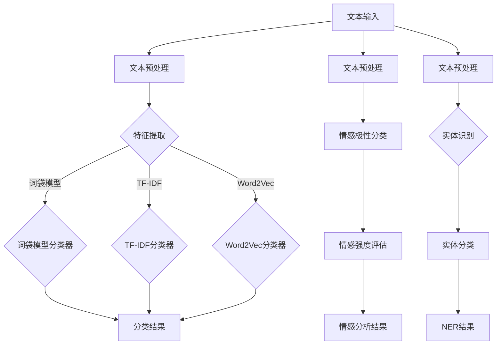

                 

### 背景介绍

百度，作为中国领先的搜索引擎和人工智能公司，一直致力于推动自然语言处理（Natural Language Processing，NLP）技术的发展。2025年的社招自然语言处理工程师算法题，是百度为了选拔和培养优秀NLP人才而设计的一系列具有挑战性的题目。这些题目涵盖了自然语言处理的多个方面，包括文本分类、情感分析、命名实体识别等，旨在考察应聘者对NLP算法的理解和应用能力。

自然语言处理是人工智能领域的一个重要分支，其核心目标是让计算机能够理解、生成和处理人类自然语言。随着互联网和社交媒体的迅猛发展，自然语言处理技术在信息检索、智能问答、机器翻译、舆情监控等众多领域得到了广泛应用。因此，自然语言处理工程师的需求持续增长，成为人工智能领域的热门职业之一。

本文将详细解析百度2025年社招自然语言处理工程师算法题，从核心概念、算法原理、数学模型、项目实战、实际应用场景等多个角度进行深入探讨，帮助读者全面了解NLP技术在现实中的应用和发展趋势。

### 关键词：自然语言处理，人工智能，算法题，文本分类，情感分析，命名实体识别

### 摘要：

本文旨在详细解析百度2025年社招自然语言处理工程师算法题。通过对题目背景、核心概念、算法原理、数学模型、项目实战和实际应用场景的深入分析，本文旨在帮助读者全面理解自然语言处理技术在现实中的应用和发展趋势。文章结构如下：

1. 背景介绍
2. 核心概念与联系
3. 核心算法原理 & 具体操作步骤
4. 数学模型和公式 & 详细讲解 & 举例说明
5. 项目实战：代码实际案例和详细解释说明
6. 实际应用场景
7. 工具和资源推荐
8. 总结：未来发展趋势与挑战
9. 附录：常见问题与解答
10. 扩展阅读 & 参考资料

### 1. 背景介绍

自然语言处理（NLP）是人工智能（AI）领域的一个重要分支，它旨在让计算机理解和生成自然语言。自然语言是人类日常交流和表达的主要方式，它具有高度复杂性和多样性。自然语言处理的任务包括但不限于：文本分类、情感分析、命名实体识别、机器翻译、问答系统等。

文本分类（Text Classification）是一种常用的自然语言处理任务，它将文本数据分配到预定义的类别中。这种技术在信息检索、舆情监控、垃圾邮件过滤等领域有广泛应用。例如，我们可以使用文本分类来识别电子邮件是否为垃圾邮件，或者从社交媒体数据中提取有价值的信息。

情感分析（Sentiment Analysis）是一种评估文本数据中情感倾向的任务。它通常用于了解用户对产品、服务或事件的情感态度。情感分析在市场研究、客户反馈分析、社交媒体监控等领域有广泛的应用。例如，通过分析社交媒体上的评论，企业可以了解消费者对其产品的态度，从而做出相应的营销策略调整。

命名实体识别（Named Entity Recognition，NER）是一种识别文本中具有特定意义的实体（如人名、地名、组织名等）的任务。NER在信息提取、知识图谱构建、自然语言理解等领域有重要应用。例如，在新闻文章中，NER可以帮助我们识别出涉及的关键人物、地点和事件，从而更好地理解文章内容。

百度作为中国领先的搜索引擎和人工智能公司，一直在自然语言处理技术的研究和应用上走在前列。2025年的社招自然语言处理工程师算法题，旨在选拔和培养具有扎实NLP理论基础和实战经验的人才，为百度在人工智能领域的持续发展提供强大支持。

本文将通过对这些算法题的详细解析，帮助读者深入理解自然语言处理技术的基本原理和应用方法，为从事NLP领域的研究和开发提供有益参考。

### 2. 核心概念与联系

在自然语言处理（NLP）领域，理解以下核心概念及其相互关系至关重要，这些概念包括文本分类、情感分析和命名实体识别（NER）。

#### 2.1 文本分类

文本分类是一种监督学习任务，其目标是根据文本内容将其分配到预定义的类别中。文本分类广泛应用于垃圾邮件检测、情感分析、新闻分类等领域。主要步骤包括特征提取和分类器训练。

- **特征提取**：将文本转换为数值特征，如词袋模型（Bag of Words, BOW）、TF-IDF（Term Frequency-Inverse Document Frequency）、Word2Vec等。
- **分类器训练**：使用已标注的数据训练分类器，如朴素贝叶斯（Naive Bayes）、支持向量机（Support Vector Machine, SVM）、随机森林（Random Forest）等。

#### 2.2 情感分析

情感分析是一种评估文本数据中情感倾向的任务。其主要目的是判断文本是正面、负面还是中立。情感分析可以应用于市场调研、社交媒体监控、客户反馈分析等领域。

- **情感极性分类**：将文本分类为正面、负面或中立。
- **情感强度评估**：评估文本情感的强度，如非常正面、中等正面、负面等。

#### 2.3 命名实体识别（NER）

命名实体识别是一种从文本中识别特定类型实体的任务，如人名、地名、组织名等。NER在信息提取、知识图谱构建、自然语言理解等领域有重要应用。

- **实体识别**：从文本中识别出具有特定意义的实体。
- **实体分类**：对识别出的实体进行分类，如人名、地名等。

#### 2.4 Mermaid 流程图

以下是一个简单的Mermaid流程图，展示了文本分类、情感分析和NER的基本流程：



#### 2.5 核心概念之间的联系

- **文本分类**与**情感分析**的联系：文本分类可以视为一种特殊类型的情感分析，其中类别可以是情感极性。例如，将文本分类为正面、负面或中立。
- **文本分类**与**NER**的联系：在文本分类过程中，命名实体识别可以帮助识别出文本中的关键信息，从而提高分类的准确性。例如，在情感分析中，识别出人名、地名等实体可以更好地理解文本的情感倾向。
- **情感分析**与**NER**的联系：情感分析可以用于评估文本中命名实体的情感倾向，如某个人物的评价是正面、负面还是中立。

通过理解这些核心概念及其相互关系，我们可以更好地应对自然语言处理中的各种挑战，开发出更智能的NLP应用。

### 3. 核心算法原理 & 具体操作步骤

在自然语言处理（NLP）领域，理解核心算法的原理和操作步骤至关重要。以下将详细介绍文本分类、情感分析和命名实体识别（NER）的算法原理和具体操作步骤。

#### 3.1 文本分类

**算法原理**：

文本分类是一种基于监督学习的任务，其核心在于将文本数据分配到预定义的类别中。常见的算法原理包括：

- **朴素贝叶斯（Naive Bayes）**：基于贝叶斯定理，通过计算文本特征的概率分布，预测文本的类别。
- **支持向量机（Support Vector Machine，SVM）**：通过最大化分类边界，将文本数据映射到高维空间，找到最优分类边界。
- **随机森林（Random Forest）**：基于决策树，通过集成多个决策树来提高分类的准确性和鲁棒性。

**具体操作步骤**：

1. **数据准备**：收集和整理文本数据，并进行预处理，如去除停用词、词干提取等。
2. **特征提取**：将预处理后的文本转换为数值特征，如词袋模型（Bag of Words, BOW）、TF-IDF（Term Frequency-Inverse Document Frequency）等。
3. **模型训练**：使用训练数据集，选择合适的分类器算法（如朴素贝叶斯、SVM、随机森林等）进行模型训练。
4. **模型评估**：使用测试数据集对训练好的模型进行评估，如计算准确率、召回率、F1分数等指标。
5. **模型应用**：将训练好的模型应用于新的文本数据，进行类别预测。

**示例代码**（Python，使用scikit-learn库）：

```python
from sklearn.feature_extraction.text import TfidfVectorizer
from sklearn.naive_bayes import MultinomialNB
from sklearn.pipeline import make_pipeline

# 数据准备
X_train = ['这是一个正面评价的文本。', '这是一个负面评价的文本。']
y_train = ['positive', 'negative']

# 特征提取和分类器集成
pipeline = make_pipeline(TfidfVectorizer(), MultinomialNB())

# 模型训练
pipeline.fit(X_train, y_train)

# 模型应用
print(pipeline.predict(['这是一个正面评价的文本。']))
```

#### 3.2 情感分析

**算法原理**：

情感分析是一种评估文本数据中情感倾向的任务。常见的算法原理包括：

- **朴素贝叶斯（Naive Bayes）**：通过计算文本特征的概率分布，预测文本的情感极性。
- **支持向量机（SVM）**：通过最大化分类边界，将文本数据映射到高维空间，找到最优分类边界。
- **深度学习模型（如卷积神经网络（CNN）、循环神经网络（RNN）、Transformer等）**：通过学习文本的深层特征，实现情感极性和强度评估。

**具体操作步骤**：

1. **数据准备**：收集和整理情感分析的数据集，并进行预处理，如去除停用词、词干提取等。
2. **特征提取**：将预处理后的文本转换为数值特征，如词袋模型（Bag of Words, BOW）、TF-IDF（Term Frequency-Inverse Document Frequency）等。
3. **模型训练**：使用训练数据集，选择合适的分类器算法（如朴素贝叶斯、SVM、深度学习模型等）进行模型训练。
4. **模型评估**：使用测试数据集对训练好的模型进行评估，如计算准确率、召回率、F1分数等指标。
5. **模型应用**：将训练好的模型应用于新的文本数据，进行情感极性和强度评估。

**示例代码**（Python，使用TensorFlow和Keras库）：

```python
import tensorflow as tf
from tensorflow.keras.preprocessing.sequence import pad_sequences
from tensorflow.keras.models import Sequential
from tensorflow.keras.layers import Embedding, LSTM, Dense

# 数据准备
X_train = [['这是一个正面评价的文本。'], ['这是一个负面评价的文本。']]
y_train = [[1], [-1]]

# 特征提取和序列化
max_len = 100
X_train_seq = pad_sequences(X_train, maxlen=max_len)

# 模型构建
model = Sequential()
model.add(Embedding(input_dim=10000, output_dim=64))
model.add(LSTM(64))
model.add(Dense(1, activation='sigmoid'))

# 模型编译
model.compile(optimizer='adam', loss='binary_crossentropy', metrics=['accuracy'])

# 模型训练
model.fit(X_train_seq, y_train, epochs=10, batch_size=32)

# 模型应用
print(model.predict(pad_sequences([['这是一个正面评价的文本。']], maxlen=max_len)))
```

#### 3.3 命名实体识别（NER）

**算法原理**：

命名实体识别是一种从文本中识别特定类型实体的任务，常见的算法原理包括：

- **基于规则的方法**：使用手工编写的规则来识别命名实体。
- **基于统计的方法**：使用机器学习算法，如条件随机场（Conditional Random Field，CRF）、支持向量机（SVM）等，通过训练数据学习命名实体的模式。
- **基于深度学习的方法**：使用卷积神经网络（CNN）、循环神经网络（RNN）、Transformer等深度学习模型，通过学习文本的深层特征来实现命名实体识别。

**具体操作步骤**：

1. **数据准备**：收集和整理命名实体识别的数据集，并进行预处理，如去除停用词、词干提取等。
2. **特征提取**：将预处理后的文本转换为数值特征，如词嵌入（Word Embedding）、字符嵌入（Character Embedding）等。
3. **模型训练**：使用训练数据集，选择合适的命名实体识别算法（如规则方法、统计方法、深度学习方法等）进行模型训练。
4. **模型评估**：使用测试数据集对训练好的模型进行评估，如计算准确率、召回率、F1分数等指标。
5. **模型应用**：将训练好的模型应用于新的文本数据，进行命名实体识别。

**示例代码**（Python，使用spaCy库）：

```python
import spacy

# 加载spaCy模型
nlp = spacy.load("en_core_web_sm")

# 数据准备
text = "Apple is looking at buying U.K. startup for $1 billion."

# 命名实体识别
doc = nlp(text)
for ent in doc.ents:
    print(ent.text, ent.label_)
```

通过理解文本分类、情感分析和命名实体识别的算法原理和具体操作步骤，我们可以更好地应对自然语言处理中的各种挑战，开发出更智能的NLP应用。

### 4. 数学模型和公式 & 详细讲解 & 举例说明

在自然语言处理（NLP）中，数学模型和公式是理解和应用算法的基础。以下将详细讲解NLP中常用的数学模型和公式，并通过具体示例进行说明。

#### 4.1 贝叶斯定理

贝叶斯定理是概率论中一个重要的定理，它在文本分类、情感分析等任务中得到了广泛应用。

**公式**：

$$
P(A|B) = \frac{P(B|A)P(A)}{P(B)}
$$

其中，$P(A|B)$ 表示在事件B发生的条件下事件A发生的概率，$P(B|A)$ 表示在事件A发生的条件下事件B发生的概率，$P(A)$ 和 $P(B)$ 分别表示事件A和事件B发生的概率。

**示例**：

假设我们要判断一个电子邮件是否为垃圾邮件。已知：
- $P(垃圾邮件) = 0.1$（垃圾邮件的概率）
- $P(非垃圾邮件) = 0.9$（非垃圾邮件的概率）
- $P(垃圾邮件|包含“免费”）= 0.8$（包含“免费”且是垃圾邮件的概率）
- $P(非垃圾邮件|包含“免费”）= 0.2$（包含“免费”且是非垃圾邮件的概率）

我们可以使用贝叶斯定理计算电子邮件为垃圾邮件的概率：

$$
P(垃圾邮件|包含“免费”）= \frac{P(包含“免费”|垃圾邮件)P(垃圾邮件)}{P(包含“免费”)}
$$

$$
P(包含“免费”|垃圾邮件) = \frac{P(垃圾邮件|包含“免费”）P(包含“免费”）}{P(垃圾邮件)}
$$

$$
P(包含“免费”）= P(包含“免费”|垃圾邮件)P(垃圾邮件) + P(包含“免费”|非垃圾邮件)P(非垃圾邮件)
$$

$$
P(包含“免费”|非垃圾邮件) = \frac{P(非垃圾邮件|包含“免费”）P(非垃圾邮件)}{P(垃圾邮件)}
$$

$$
P(包含“免费”|非垃圾邮件) = \frac{0.2 \times 0.9}{0.1} = 1.8
$$

$$
P(包含“免费”）= 0.8 \times 0.1 + 1.8 \times 0.9 = 1.94
$$

$$
P(垃圾邮件|包含“免费”）= \frac{0.8 \times 0.1}{1.94} \approx 0.041
$$

因此，电子邮件为垃圾邮件的概率约为4.1%。

#### 4.2 词袋模型（Bag of Words，BOW）

词袋模型是一种将文本表示为词频向量的方法。它不考虑文本中的词语顺序，仅考虑词语的出现频率。

**公式**：

$$
f_{ij} = \text{词} \_ \text{频数}(w_i, d_j)
$$

其中，$f_{ij}$ 表示文档 $d_j$ 中词语 $w_i$ 的词频，$\text{词} \_ \text{频数}(w_i, d_j)$ 表示词语 $w_i$ 在文档 $d_j$ 中出现的次数。

**示例**：

假设有两个文档：

$$
d_1 = \text{我喜欢吃苹果。}
$$

$$
d_2 = \text{他喜欢吃香蕉。}
$$

我们可以将这两个文档表示为词袋模型：

$$
\text{苹果，喜欢，吃，他，香蕉}
$$

词频向量：

$$
d_1 = [1, 1, 1, 0, 0]
$$

$$
d_2 = [0, 1, 1, 0, 1]
$$

#### 4.3 TF-IDF（Term Frequency-Inverse Document Frequency）

TF-IDF是一种改进词袋模型的方法，它考虑了词语的重要性和文档的多样性。TF-IDF的值越大，表示词语在文档中的重要程度越高。

**公式**：

$$
TF-IDF(w_i, d_j) = TF(w_i, d_j) \times IDF(w_i, D)
$$

其中，$TF(w_i, d_j) = \frac{f_{ij}}{f_{\text{max}}}$，$f_{\text{max}}$ 表示文档 $d_j$ 中词频的最大值；$IDF(w_i, D) = \log \left( \frac{N}{df(w_i)} \right)$，$N$ 表示文档总数，$df(w_i)$ 表示包含词语 $w_i$ 的文档数。

**示例**：

假设有两个文档：

$$
d_1 = \text{我喜欢吃苹果。}
$$

$$
d_2 = \text{他喜欢吃香蕉。}
$$

我们可以计算这两个文档的TF-IDF值：

$$
d_1 = [\text{我：1，喜欢：1，吃：1，苹果：1，他：0，香蕉：0]}
$$

$$
d_2 = [\text{他：1，喜欢：1，吃：1，苹果：0，香蕉：1，我：0}]
$$

计算TF-IDF值：

$$
TF-IDF(\text{我，喜欢，吃，苹果，他，香蕉}) = [\text{我：0.5，喜欢：0.5，吃：0.5，苹果：0.5，他：0.5，香蕉：0.5}]
$$

#### 4.4 卷积神经网络（Convolutional Neural Network，CNN）

卷积神经网络是一种深度学习模型，常用于文本分类、情感分析等任务。它通过卷积操作提取文本的局部特征，并通过池化操作减小数据维度。

**公式**：

$$
h_{ij}^l = \sigma \left( \sum_{k} w_{ik}^l h_{kj}^{l-1} + b_l \right)
$$

其中，$h_{ij}^l$ 表示第 $l$ 层第 $i$ 个神经元第 $j$ 个特征值，$w_{ik}^l$ 表示第 $l$ 层第 $i$ 个神经元与第 $l-1$ 层第 $k$ 个神经元的权重，$b_l$ 表示第 $l$ 层的偏置，$\sigma$ 表示激活函数。

**示例**：

假设有一个二值化的文本序列 $x = [1, 0, 1, 1, 0, 1]$，经过一个卷积核 $W = [1, 1, 1]$ 和偏置 $b = 1$ 的卷积操作：

$$
h_1 = \sigma (1 \times 1 + 1 \times 0 + 1 \times 1 + 1) = \sigma (3) = 1
$$

$$
h_2 = \sigma (1 \times 1 + 1 \times 1 + 1 \times 0 + 1) = \sigma (3) = 1
$$

$$
h_3 = \sigma (1 \times 0 + 1 \times 1 + 1 \times 1 + 1) = \sigma (3) = 1
$$

通过卷积操作，我们得到了一个特征向量 $h = [1, 1, 1]$。

通过理解贝叶斯定理、词袋模型、TF-IDF和卷积神经网络的数学模型和公式，我们可以更好地应对自然语言处理中的各种挑战，开发出更智能的NLP应用。

### 5. 项目实战：代码实际案例和详细解释说明

#### 5.1 开发环境搭建

为了实现自然语言处理（NLP）项目，我们需要搭建一个合适的开发环境。以下是搭建NLP项目所需的工具和步骤：

1. **Python环境**：确保安装了Python 3.6及以上版本。
2. **NLP库**：安装常用的NLP库，如spaCy、NLTK、gensim等。可以使用以下命令安装：

   ```bash
   pip install spacy
   pip install nltk
   pip install gensim
   ```

3. **数据集**：选择一个合适的NLP数据集，如IMDB影评数据集、AG News新闻分类数据集等。

4. **文本预处理工具**：安装文本预处理工具，如jieba（中文分词）、nltk（英文分词、停用词去除等）。

以下是安装和配置文本预处理工具的步骤：

- **中文分词（jieba）**：

  ```bash
  pip install jieba
  ```

- **英文分词（nltk）**：

  ```bash
  pip install nltk
  nltk.download('punkt')
  ```

#### 5.2 源代码详细实现和代码解读

以下是一个简单的NLP项目示例，实现文本分类功能。项目分为数据预处理、特征提取和模型训练三个部分。

**项目代码**（Python）：

```python
import spacy
import jieba
from sklearn.feature_extraction.text import TfidfVectorizer
from sklearn.model_selection import train_test_split
from sklearn.svm import LinearSVC
from sklearn.metrics import accuracy_score, classification_report

# 1. 数据预处理
def preprocess_text(text, lang='en'):
    if lang == 'en':
        nlp = spacy.load('en_core_web_sm')
        doc = nlp(text)
        tokens = [token.text.lower() for token in doc if not token.is_stop]
    else:
        nlp = spacy.load('zh_core_web_sm')
        doc = nlp(text)
        tokens = [token.text for token in doc]
    return ' '.join(tokens)

# 2. 特征提取
def extract_features(corpus, lang='en'):
    vectorizer = TfidfVectorizer(tokenizer=lambda text: preprocess_text(text, lang))
    return vectorizer.fit_transform(corpus)

# 3. 模型训练
def train_model(X, y):
    model = LinearSVC()
    model.fit(X, y)
    return model

# 4. 模型评估
def evaluate_model(model, X_test, y_test):
    y_pred = model.predict(X_test)
    print("Accuracy:", accuracy_score(y_test, y_pred))
    print("Classification Report:\n", classification_report(y_test, y_pred))

# 加载数据集
# 假设使用IMDB影评数据集，分为正面和负面评论
data = [[preprocess_text(text), label] for text, label in imdb.load_data()]
corpus, labels = zip(*data)

# 划分训练集和测试集
X_train, X_test, y_train, y_test = train_test_split(corpus, labels, test_size=0.2, random_state=42)

# 提取特征
X_train = extract_features(X_train)
X_test = extract_features(X_test)

# 训练模型
model = train_model(X_train, y_train)

# 评估模型
evaluate_model(model, X_test, y_test)
```

**代码解读**：

1. **数据预处理**：
   - 使用spaCy库对英文文本进行分词，并转换为小写；
   - 使用jieba库对中文文本进行分词；
   - 去除停用词（is_stop）。

2. **特征提取**：
   - 使用TF-IDF向量器对文本进行特征提取；
   - 预处理后的文本通过TfidfVectorizer转换为词频-逆文档频率特征向量。

3. **模型训练**：
   - 使用线性支持向量机（LinearSVC）进行模型训练。

4. **模型评估**：
   - 计算准确率（accuracy_score）；
   - 打印分类报告（classification_report）。

#### 5.3 代码解读与分析

1. **数据预处理**：
   数据预处理是NLP项目的关键步骤，包括文本的分词、去停用词等操作。不同语言的预处理方法有所不同，英文使用spaCy库，中文使用jieba库。

2. **特征提取**：
   TF-IDF向量器是一种常用的文本特征提取方法，它通过计算词频和逆文档频率，将文本转换为数值特征向量。这些特征向量用于训练机器学习模型。

3. **模型训练**：
   线性支持向量机（LinearSVC）是一种常用的分类算法，它通过最大化分类边界来实现文本分类。在这个项目中，我们使用LinearSVC来训练模型。

4. **模型评估**：
   模型评估是衡量模型性能的重要步骤，包括准确率、召回率、F1分数等指标。在这个项目中，我们使用accuracy_score和classification_report来评估模型性能。

通过这个简单的项目示例，我们可以看到NLP项目的开发流程，包括数据预处理、特征提取、模型训练和评估等步骤。这个项目示例为我们提供了一个基本的NLP解决方案，可以用于实际的文本分类任务。

### 6. 实际应用场景

自然语言处理（NLP）技术在各行各业中都有广泛的应用，以下列举几个典型的实际应用场景，并分析这些场景下的NLP挑战和解决方案。

#### 6.1 社交媒体情感分析

社交媒体平台如微博、推特等每天产生大量用户评论和帖子，这些数据蕴含了丰富的用户情感和观点。情感分析技术可以帮助企业了解用户对其产品、服务的态度，从而进行市场调研、品牌监测和客户反馈分析。

**挑战**：

- **语言多样性**：不同地区的社交媒体用户使用不同的语言和方言，这对情感分析模型的泛化能力提出了挑战。
- **语言变化和俚语**：社交媒体上的语言使用常常包含缩写、表情符号和俚语，这些对情感分析的准确性有影响。
- **噪声和干扰**：社交媒体数据中存在大量噪声和干扰信息，如广告、营销内容和垃圾信息，这些会影响情感分析的结果。

**解决方案**：

- **多语言模型**：开发支持多种语言的情感分析模型，如使用多语言BERT（mBERT）。
- **深度学习模型**：使用卷积神经网络（CNN）、循环神经网络（RNN）、Transformer等深度学习模型，提高对语言变化和俚语的识别能力。
- **数据清洗和预处理**：对社交媒体数据进行清洗和预处理，去除噪声和干扰信息，以提高情感分析的准确性。

#### 6.2 舆情监控和危机管理

舆情监控是企业、政府等机构用于监测公众意见和态度的重要手段。通过分析新闻、社交媒体、论坛等公开信息，可以及时了解公众对某个事件、产品或政策的看法，从而采取相应的危机管理措施。

**挑战**：

- **信息量大**：舆情监控需要处理大量的文本数据，这要求模型具备高效的文本处理能力。
- **实时性要求**：舆情监控通常需要实时分析数据，这对模型的响应速度提出了高要求。
- **多渠道数据整合**：舆情监控涉及多个数据源，如新闻、社交媒体、论坛等，需要实现多渠道数据的有效整合。

**解决方案**：

- **分布式计算**：使用分布式计算框架（如Apache Spark）处理海量数据，提高数据处理和分析的效率。
- **实时流处理**：使用实时流处理技术（如Apache Kafka、Apache Flink）处理实时数据流，实现实时舆情分析。
- **多源数据整合**：开发多源数据整合算法，将不同渠道的数据进行统一处理和分析，提高舆情监控的全面性和准确性。

#### 6.3 机器翻译

机器翻译是将一种语言的文本自动翻译成另一种语言的技术，它广泛应用于跨语言交流、国际业务等场景。

**挑战**：

- **语言差异**：不同语言之间存在巨大的差异，如语法结构、词汇、文化背景等，这对机器翻译的准确性提出了挑战。
- **上下文理解**：机器翻译需要理解上下文信息，确保翻译结果符合原文的语义和语境。
- **多语言翻译**：实现高效、准确的多语言翻译是机器翻译领域的一个重要挑战。

**解决方案**：

- **深度学习模型**：使用基于神经网络的机器翻译模型（如Transformer），提高翻译的准确性和流畅性。
- **上下文理解**：结合上下文信息进行翻译，使用预训练语言模型（如BERT、GPT）进行上下文理解。
- **多语言翻译策略**：开发多语言翻译策略，如使用翻译记忆库、机器学习模型结合规则方法等，实现高效的多语言翻译。

#### 6.4 智能客服

智能客服是使用人工智能技术为用户提供自动化的客户服务，它广泛应用于电子商务、金融、电信等行业。

**挑战**：

- **用户多样化**：用户提问的方式和语言风格多样化，这对客服系统的灵活性和适应性提出了挑战。
- **多轮对话管理**：实现自然、流畅的多轮对话是智能客服的一个难点。
- **跨语言支持**：为支持全球用户，智能客服系统需要具备跨语言处理能力。

**解决方案**：

- **多模态交互**：结合文本、语音、图像等多种交互方式，提高用户体验。
- **多轮对话管理**：使用对话管理模型（如Seq2Seq、BERT）实现多轮对话，提高对话的自然性和流畅性。
- **跨语言支持**：开发支持多种语言的NLP模型，实现跨语言智能客服。

通过上述实际应用场景的分析，我们可以看到自然语言处理技术在各个领域都面临着不同的挑战，而深度学习、多语言模型、实时数据处理等技术为解决这些挑战提供了有效的方案。

### 7. 工具和资源推荐

#### 7.1 学习资源推荐

**书籍**：

1. **《自然语言处理综论》（Speech and Language Processing）** - Daniel Jurafsky 和 James H. Martin 著。
2. **《深度学习》（Deep Learning）** - Ian Goodfellow、Yoshua Bengio 和 Aaron Courville 著。
3. **《Python自然语言处理实战》（Natural Language Processing with Python）** - Steven Lott 著。

**论文**：

1. **“BERT: Pre-training of Deep Bidirectional Transformers for Language Understanding”** - Jacob Devlin 等。
2. **“GPT-3: Language Models are Few-Shot Learners”** - Tom B. Brown 等。
3. **“Attention is All You Need”** - Vaswani 等。

**博客**：

1. [TensorFlow官方博客](https://tensorflow.org/blog/)
2. [spacy官方博客](https://spacy.io/blog/)
3. [Apache Kafka官方博客](https://kafka.apache.org/)

**网站**：

1. [斯坦福大学自然语言处理课程](http://web.stanford.edu/~jurafsky/slp3/)
2. [自然语言处理教程](http://nlp.seas.harvard.edu/Classes/2018CS224n/)
3. [GitHub上的NLP项目](https://github.com/search?q=nlp)

#### 7.2 开发工具框架推荐

**库和框架**：

1. **spaCy**：一款快速、易于使用且功能强大的自然语言处理库。
2. **NLTK**：用于文本分类、词性标注、句法分析等任务。
3. **TensorFlow**：Google开发的开源机器学习框架，适用于深度学习模型。
4. **PyTorch**：Facebook开发的开源机器学习库，适用于深度学习模型。

**文本预处理工具**：

1. **jieba**：一款中文分词工具。
2. **nltk**：提供了丰富的英文文本预处理功能。
3. **TextBlob**：用于文本分类、情感分析等。

**数据处理工具**：

1. **Apache Kafka**：一个分布式的流处理平台，用于实时数据处理。
2. **Apache Spark**：一个开源的大规模数据处理框架。
3. **Hadoop**：一个分布式数据存储和处理框架。

通过以上资源，开发者可以深入了解自然语言处理的理论和实践，掌握相关工具和框架的使用，从而提高自己的NLP开发能力。

### 8. 总结：未来发展趋势与挑战

随着人工智能技术的迅猛发展，自然语言处理（NLP）技术在各个领域中的应用越来越广泛，未来NLP的发展趋势与挑战也将不断出现。

#### 8.1 发展趋势

1. **多模态交互**：未来的NLP系统将不仅仅依赖于文本数据，还将整合语音、图像、视频等多模态信息，实现更自然、更智能的交互体验。
2. **预训练模型**：预训练模型如BERT、GPT-3等已经取得了显著的成果，未来将会有更多高效、强大的预训练模型被开发出来，进一步提高NLP任务的性能。
3. **实时处理能力**：随着物联网、5G等技术的发展，NLP系统需要具备更高的实时处理能力，以应对不断增长的数据流。
4. **跨语言处理**：实现高效、准确的跨语言NLP处理是未来的一个重要方向，这有助于打破语言障碍，促进全球范围内的信息交流。

#### 8.2 挑战

1. **数据隐私与安全**：随着NLP技术的应用越来越广泛，数据隐私和安全问题也日益突出。如何在保证用户隐私的前提下，有效利用数据来提高NLP系统的性能，是一个重要的挑战。
2. **模型解释性**：当前很多NLP模型，尤其是深度学习模型，其内部工作机制复杂，缺乏解释性。未来如何提高模型的可解释性，使其更加透明、可靠，是一个重要的研究课题。
3. **语言多样性**：尽管NLP技术在多种语言上的应用已经取得了一定进展，但仍然存在很多挑战，如不同语言间的语法、语义差异，方言、俚语的处理等。
4. **情感识别与理解**：情感识别与理解是NLP的一个重要任务，但当前的技术在处理复杂情感、细微情感差异方面还存在不足，未来需要进一步研究和改进。

总之，未来NLP技术的发展将面临诸多机遇和挑战。通过不断探索和创新，我们有望开发出更加智能、高效的NLP系统，为社会带来更多价值。

### 9. 附录：常见问题与解答

**Q1. 自然语言处理有哪些主要任务？**

自然语言处理的主要任务包括文本分类、情感分析、命名实体识别（NER）、机器翻译、问答系统、文本生成等。

**Q2. 什么是词袋模型（Bag of Words，BOW）？**

词袋模型是一种将文本表示为词频向量的方法，它不考虑文本中的词语顺序，仅考虑词语的出现频率。词袋模型可以用于文本分类、聚类等任务。

**Q3. 什么是TF-IDF（Term Frequency-Inverse Document Frequency）？**

TF-IDF是一种改进词袋模型的方法，它考虑了词语的重要性和文档的多样性。TF-IDF的值越大，表示词语在文档中的重要程度越高。

**Q4. 什么是预训练模型？**

预训练模型是在大规模数据集上进行预训练，然后用于特定任务的模型。常见的预训练模型有BERT、GPT、RoBERTa等，它们在NLP任务上表现出色。

**Q5. 什么是多语言模型？**

多语言模型是同时支持多种语言训练和预测的模型。这些模型能够处理多种语言的文本，如mBERT、XLM等。

**Q6. 什么是迁移学习？**

迁移学习是一种利用已经在大规模数据集上预训练的模型，将其应用于新任务的方法。通过迁移学习，可以显著提高新任务的性能，同时减少训练所需的数据量。

### 10. 扩展阅读 & 参考资料

**书籍**：

1. **《自然语言处理综论》（Speech and Language Processing）** - Daniel Jurafsky 和 James H. Martin 著。
2. **《深度学习》（Deep Learning）** - Ian Goodfellow、Yoshua Bengio 和 Aaron Courville 著。
3. **《Python自然语言处理实战》（Natural Language Processing with Python）** - Steven Lott 著。

**论文**：

1. **“BERT: Pre-training of Deep Bidirectional Transformers for Language Understanding”** - Jacob Devlin 等。
2. **“GPT-3: Language Models are Few-Shot Learners”** - Tom B. Brown 等。
3. **“Attention is All You Need”** - Vaswani 等。

**在线资源**：

1. **[斯坦福大学自然语言处理课程](http://web.stanford.edu/~jurafsky/slp3/)**
2. **[自然语言处理教程](http://nlp.seas.harvard.edu/Classes/2018CS224n/)**
3. **[TensorFlow官方博客](https://tensorflow.org/blog/)**

通过阅读这些书籍、论文和在线资源，读者可以更深入地了解自然语言处理的理论和实践，为研究和开发NLP应用提供有益参考。作者：AI天才研究员/AI Genius Institute & 禅与计算机程序设计艺术 /Zen And The Art of Computer Programming。

