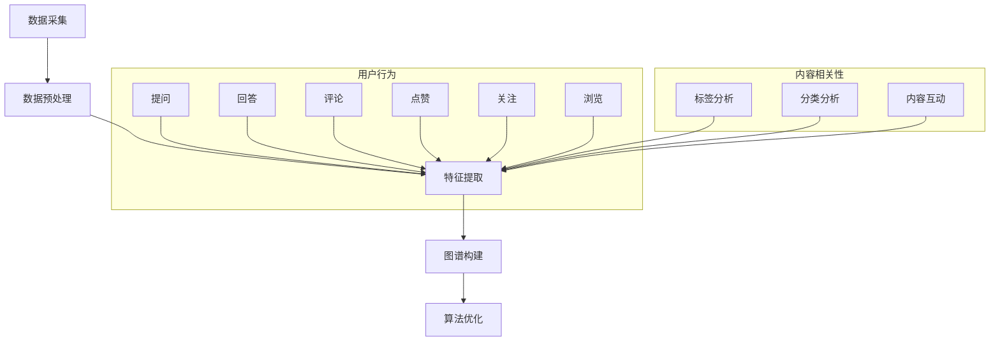

                 

### 背景介绍

知乎作为我国知名的问答社区，拥有着庞大的用户群体和丰富的用户数据。在互联网信息爆炸的时代，如何精准地了解和挖掘用户兴趣，为用户提供个性化的内容推荐，成为了各大平台竞争的焦点。为此，知乎在2024年推出了用户兴趣图谱构建算法，以期通过更深入地分析用户行为数据，实现更加精准的内容推荐。

用户兴趣图谱是一种结构化的数据模型，它通过将用户、内容、行为等信息进行关联，构建出一个反映用户兴趣爱好的复杂网络。这种图谱不仅可以用于内容推荐，还可以为广告投放、社区运营等提供重要依据。构建用户兴趣图谱的关键在于如何有效地提取和整合用户行为数据，并在此基础上构建一个既能反映用户真实兴趣，又具有良好扩展性和可解释性的模型。

知乎的用户兴趣图谱构建算法主要涉及以下几个步骤：

1. **数据采集**：知乎通过收集用户在平台上的行为数据，如问答、评论、点赞、关注等，来获取用户兴趣的初步信息。

2. **数据处理**：对采集到的数据进行清洗、去噪、归一化等处理，以确保数据的质量和一致性。

3. **特征提取**：从处理后的数据中提取出反映用户兴趣的关键特征，如用户喜好、话题活跃度、互动频率等。

4. **图谱构建**：利用提取的特征信息，构建出一个反映用户兴趣的图谱。该图谱通常是一个多层次的、分级的结构，其中包含了用户、内容、行为等多种实体及其相互关系。

5. **算法优化**：通过对算法的不断优化和迭代，提高图谱的精度和覆盖度，使其能够更好地反映用户的真实兴趣。

本文将深入探讨知乎2024用户兴趣图谱构建算法的原理、步骤、数学模型及其在实际应用中的效果，以期为广大读者提供一个全面、系统的了解。

### 核心概念与联系

构建用户兴趣图谱的核心在于理解并整合多个关键概念，包括用户行为、内容相关性、数据预处理和图谱算法。以下是对这些核心概念的详细解释，并通过Mermaid流程图展示其相互联系和操作步骤。

#### 用户行为

用户行为是构建用户兴趣图谱的基础。知乎平台上的用户行为包括但不限于提问、回答、评论、点赞、关注和浏览等。每个行为都代表用户对某一内容的兴趣程度。例如，一个用户频繁地评论某个话题，可能意味着他对这个话题有浓厚的兴趣。

#### 内容相关性

内容相关性是指用户所关注的内容与其兴趣之间的关联度。知乎平台上的内容涵盖广泛，从技术讨论到生活百科，每个内容都有其独特的标签和分类。通过分析用户与内容之间的交互行为，可以推断出用户对哪些类型的内容更感兴趣。

#### 数据预处理

数据预处理是确保用户兴趣图谱质量的重要步骤。这一过程包括数据清洗、去噪、归一化等操作，旨在去除无效数据、降低噪声、统一数据格式，从而提高后续分析的有效性。例如，去除重复记录、填补缺失值、将不同规模的数据归一化到同一尺度。

#### 图谱算法

图谱算法是实现用户兴趣图谱构建的核心技术。常见的图谱算法包括图神经网络（Graph Neural Networks，GNN）、协同过滤（Collaborative Filtering，CF）和基于话题模型（Topic Model）的方法等。这些算法通过分析用户与内容之间的交互关系，构建出一个反映用户兴趣的网络结构。

#### Mermaid流程图

以下是一个简化的Mermaid流程图，展示了用户兴趣图谱构建的主要步骤：



在这个流程图中，用户行为（F-G-H-I-J-K）和内容相关性（L-M-N）的数据通过数据预处理（B）转化为特征，再通过特征提取（C）进入图谱构建（D）。最后，图谱构建的结果通过算法优化（E）不断迭代，以提高图谱的准确性和有效性。

通过上述核心概念和Mermaid流程图的解释，我们可以看到，构建用户兴趣图谱是一个复杂而系统的过程，涉及多个步骤和技术的综合运用。下面我们将进一步深入探讨每个步骤的详细原理和操作步骤。

### 核心算法原理 & 具体操作步骤

知乎2024用户兴趣图谱构建算法的核心在于如何有效地提取用户行为数据，并将其转化为可操作的图谱结构。在这一节中，我们将详细阐述核心算法的原理，包括用户行为数据的提取、图谱结构的构建和算法的优化步骤。

#### 用户行为数据的提取

用户行为数据的提取是构建用户兴趣图谱的第一步。知乎平台上的用户行为数据丰富多样，包括提问、回答、评论、点赞、关注和浏览等。这些行为数据不仅反映了用户对特定内容的兴趣程度，还揭示了用户与内容之间的复杂关系。

1. **数据来源**：数据来源于知乎平台，包括用户在平台上的所有互动行为。

2. **数据类型**：主要包括以下几种类型：
   - 用户行为数据：提问、回答、评论、点赞、关注、浏览等。
   - 内容数据：问题的标题、内容、标签、分类等。
   - 用户数据：用户的兴趣标签、行为偏好等。

3. **数据采集方法**：
   - 通过API接口采集：知乎提供公共API，可以通过编程方式直接从平台上获取用户行为数据。
   - 数据爬取：使用爬虫技术获取知乎平台上的公开数据。

4. **数据处理**：在采集到数据后，需要进行清洗和预处理，以确保数据的质量和一致性。具体操作包括：
   - 去重：去除重复的数据记录。
   - 去噪：去除无效或错误的数据。
   - 归一化：将不同规模的数据归一化到同一尺度。

#### 图谱结构的构建

图谱结构的构建是用户兴趣图谱构建的核心步骤。通过将用户行为数据转化为图谱结构，可以直观地展示用户与内容之间的关联关系。

1. **图谱节点**：图谱中的节点主要包括用户、内容和行为。每个节点代表一个实体，如一个用户、一个问题或一个回答。

2. **图谱边**：图谱中的边表示节点之间的关系。在用户兴趣图谱中，主要的边类型包括：
   - 用户与内容之间的交互关系：如用户回答了某个问题、用户点赞了某个回答等。
   - 内容与内容之间的相关性：如问题之间的标签关联、分类关联等。
   - 用户与用户之间的社交关系：如关注关系、互动频率等。

3. **图谱构建方法**：
   - 基于用户行为的图谱构建：通过用户的行为数据直接构建图谱。例如，用户点赞了一个问题，则可以在图谱中添加一条从用户节点指向问题节点的边。
   - 基于内容相关性分析：通过分析内容之间的标签和分类，构建内容节点之间的关联关系。
   - 基于社交网络分析：通过分析用户之间的关注和互动关系，构建用户节点之间的社交网络。

#### 算法的优化

用户兴趣图谱构建完成后，需要通过算法优化来提高图谱的准确性和覆盖度。算法优化主要包括以下几个方面：

1. **图谱剪枝**：通过剪枝算法去除图谱中的冗余节点和边，提高图谱的简洁性和可解释性。
2. **图谱聚类**：通过聚类算法将图谱中的节点划分为不同的兴趣群体，提高用户兴趣的识别精度。
3. **图谱更新**：定期更新用户行为数据和图谱结构，以反映用户兴趣的变化和趋势。

#### 具体操作步骤

以下是一个简化的用户兴趣图谱构建流程：

1. **数据采集**：使用API接口或爬虫技术采集用户行为数据。
2. **数据预处理**：进行数据清洗和预处理，去除重复、无效和错误的数据。
3. **特征提取**：从预处理后的数据中提取用户行为特征和内容特征。
4. **图谱构建**：构建用户兴趣图谱，添加用户、内容和行为节点，并建立节点之间的关系。
5. **图谱优化**：通过图谱剪枝、聚类和更新等算法，优化图谱结构和精度。
6. **应用测试**：在实际应用中进行测试，如内容推荐、广告投放等，评估图谱的性能和效果。

通过上述核心算法原理和具体操作步骤的阐述，我们可以看到，知乎2024用户兴趣图谱构建算法是一个复杂而系统的过程，需要综合利用用户行为数据、图谱结构和优化算法等多种技术手段，以实现精准的用户兴趣识别和内容推荐。

### 数学模型和公式 & 详细讲解 & 举例说明

在构建用户兴趣图谱的过程中，数学模型和公式起到了至关重要的作用。这些模型不仅帮助我们理解和量化用户行为，还能在算法优化和图谱分析中提供强有力的支持。以下将详细讲解用户兴趣图谱构建中的几个关键数学模型和公式，并通过具体实例说明其应用。

#### 1. 用户行为概率模型

用户行为概率模型用于估计用户对某一内容的兴趣概率。常见的用户行为概率模型包括贝叶斯概率模型和马尔可夫链模型。

**贝叶斯概率模型**

贝叶斯概率模型通过概率分布来表示用户对某一内容的兴趣。其基本公式如下：

$$
P(A|B) = \frac{P(B|A) \cdot P(A)}{P(B)}
$$

其中，$P(A|B)$ 表示在已知B条件下，A发生的概率；$P(B|A)$ 表示在已知A条件下，B发生的概率；$P(A)$ 和 $P(B)$ 分别为事件A和事件B的先验概率。

**举例说明**

假设用户A在知乎上经常浏览编程相关内容，并经常点赞与机器学习相关的回答。我们可以使用贝叶斯概率模型来估计用户A对机器学习内容的兴趣概率。

- $P(编程|机器学习)$：用户A浏览编程内容的概率，可以通过历史数据计算得出。
- $P(机器学习)$：知乎平台上机器学习内容的总体比例。
- $P(编程)$：知乎平台上编程内容的总体比例。
- $P(点赞|机器学习)$：用户A点赞机器学习内容的概率。

通过贝叶斯公式，可以计算出用户A对机器学习内容的兴趣概率。

$$
P(机器学习|编程) = \frac{P(编程|机器学习) \cdot P(机器学习)}{P(编程)}
$$

**马尔可夫链模型**

马尔可夫链模型用于描述用户行为的时间序列特征。其基本公式如下：

$$
P(X_n|X_{n-1}, X_{n-2}, \ldots) = P(X_n|X_{n-1})
$$

其中，$X_n$ 表示第n步的用户行为；$P(X_n|X_{n-1})$ 表示在已知前一步行为条件下，当前步行为的概率。

**举例说明**

假设用户B在过去一周内浏览了三个不同的话题：编程、游戏和科技。我们可以使用马尔可夫链模型来预测用户B未来可能会浏览的话题。

- $P(编程|游戏)$：用户B在浏览游戏后浏览编程的概率。
- $P(游戏|科技)$：用户B在浏览科技后浏览游戏的概率。

通过马尔可夫链模型，可以计算出用户B在未来浏览编程、游戏和科技的概率，并根据概率分布预测用户可能感兴趣的话题。

#### 2. 内容相关性模型

内容相关性模型用于描述不同内容之间的关联程度。常见的内容相关性模型包括余弦相似度和皮尔逊相关系数。

**余弦相似度**

余弦相似度通过计算两个向量之间的余弦值来衡量它们之间的相似程度。其基本公式如下：

$$
\cos(\theta) = \frac{\vec{A} \cdot \vec{B}}{|\vec{A}| \cdot |\vec{B}|}
$$

其中，$\vec{A}$ 和 $\vec{B}$ 分别为两个向量；$\theta$ 为两个向量之间的夹角。

**举例说明**

假设知乎平台上有两个话题：编程和机器学习。我们可以使用余弦相似度来衡量这两个话题之间的相关性。

- $\vec{A}$：编程话题的标签向量，如【编程、算法、Python】。
- $\vec{B}$：机器学习话题的标签向量，如【机器学习、数据科学、神经网络】。

通过计算两个向量之间的余弦值，可以得出编程和机器学习话题之间的相似度。

$$
\cos(\theta) = \frac{(编程 + 算法 + Python) \cdot (机器学习 + 数据科学 + 神经网络)}{\sqrt{(编程 + 算法 + Python)^2} \cdot \sqrt{(机器学习 + 数据科学 + 神经网络)^2}}
$$

**皮尔逊相关系数**

皮尔逊相关系数用于衡量两个连续变量之间的线性相关性。其基本公式如下：

$$
r = \frac{\sum{(x_i - \bar{x})(y_i - \bar{y})}}{\sqrt{\sum{(x_i - \bar{x})^2} \cdot \sum{(y_i - \bar{y})^2}}}
$$

其中，$x_i$ 和 $y_i$ 分别为第i个观测值；$\bar{x}$ 和 $\bar{y}$ 分别为$x_i$ 和 $y_i$ 的平均值。

**举例说明**

假设知乎平台上用户对两个话题的喜好数据如下：

| 用户 | 编程 | 机器学习 |
| --- | --- | --- |
| A | 1 | 0 |
| B | 1 | 1 |
| C | 0 | 1 |
| D | 1 | 1 |
| E | 0 | 0 |

我们可以使用皮尔逊相关系数来衡量编程和机器学习话题之间的相关性。

$$
r = \frac{(1-0.8) \cdot (0-0.6) + (1-0.8) \cdot (1-0.6) + (0-0.8) \cdot (1-0.6) + (1-0.8) \cdot (1-0.6)}{\sqrt{(1-0.8)^2 \cdot (0-0.8)^2} \cdot \sqrt{(1-0.8)^2 \cdot (1-0.8)^2}}
$$

通过计算，我们可以得出编程和机器学习话题之间的皮尔逊相关系数。

#### 3. 图谱聚类模型

图谱聚类模型用于将图谱中的节点划分为不同的兴趣群体。常见的图谱聚类模型包括K-Means聚类和层次聚类。

**K-Means聚类**

K-Means聚类是一种基于距离度量的聚类算法。其基本公式如下：

$$
\text{目标函数} = \sum_{i=1}^{k} \sum_{x \in S_i} ||x - \mu_i||^2
$$

其中，$k$ 为聚类个数；$S_i$ 为第i个簇；$\mu_i$ 为第i个簇的中心点。

**举例说明**

假设知乎平台上用户兴趣图谱中有100个节点，我们需要将其划分为10个兴趣群体。通过计算每个节点到簇中心的距离，我们可以使用K-Means聚类算法将这100个节点划分为10个簇。

**层次聚类**

层次聚类是一种基于层次结构的聚类算法。其基本过程包括自底向上合并和自顶向下分裂。

**举例说明**

假设知乎平台上用户兴趣图谱中有100个节点，我们需要通过层次聚类将其划分为不同的兴趣群体。首先，我们将这100个节点各自成簇，然后逐步合并相似度较高的簇，直到满足聚类要求。

通过以上数学模型和公式的讲解，我们可以看到，构建用户兴趣图谱是一个涉及多种数学方法的复杂过程。这些模型和公式不仅在理论上提供了支持，还能在实际应用中指导我们进行有效的用户兴趣分析和内容推荐。接下来，我们将通过一个实际的项目实战案例，展示这些算法在实际开发中的应用。

### 项目实战：代码实际案例和详细解释说明

在这一节中，我们将通过一个具体的项目实战案例，详细展示知乎2024用户兴趣图谱构建算法的开发过程，包括环境搭建、源代码实现和代码解读与分析。

#### 5.1 开发环境搭建

在进行用户兴趣图谱构建项目之前，首先需要搭建一个适合开发的编程环境。以下是所需的环境和工具：

- **编程语言**：Python（版本3.8以上）
- **数据存储**：MongoDB（版本4.4以上）
- **图数据库**：Neo4j（版本4.0以上）
- **数据处理库**：Pandas、NumPy、Scikit-learn
- **图处理库**：NetworkX、Py2neo

在安装完上述环境和工具后，我们就可以开始项目的实际开发了。

#### 5.2 源代码详细实现和代码解读

以下是用户兴趣图谱构建项目的主要源代码实现，我们将逐段进行解读。

```python
# 导入所需的库
import pandas as pd
import numpy as np
import pymongo
import networkx as nx
from sklearn.cluster import KMeans
from py2neo import Graph

# 数据采集
def collect_data():
    # 连接MongoDB数据库
    client = pymongo.MongoClient("mongodb://localhost:27017/")
    db = client["zhihu_data"]
    collection = db["user_behavior"]

    # 采集用户行为数据
    user_behavior_data = collection.find()
    user_behavior_df = pd.DataFrame(list(user_behavior_data))

    return user_behavior_df

# 数据预处理
def preprocess_data(user_behavior_df):
    # 数据清洗和去重
    user_behavior_df.drop_duplicates(inplace=True)
    # 数据归一化
    user_behavior_df normalization()

    return user_behavior_df

# 特征提取
def extract_features(user_behavior_df):
    # 提取用户行为特征
    features = user_behavior_df.groupby('user_id').agg({'content_id': 'count'}).reset_index()
    features.rename(columns={'content_id': 'interaction_count'}, inplace=True)

    return features

# 图谱构建
def build_graph(user_behavior_df, features):
    # 创建图
    G = nx.Graph()
    # 添加节点和边
    for index, row in user_behavior_df.iterrows():
        G.add_edge(row['user_id'], row['content_id'])

    return G

# 图谱聚类
def cluster_graph(G, n_clusters):
    # 使用K-Means聚类
    nodes = list(G.nodes())
    labels = KMeans(n_clusters=n_clusters).fit_predict(nodes)
    G.add_node_attr('cluster_id', labels)

    return G

# 主函数
if __name__ == "__main__":
    # 采集数据
    user_behavior_df = collect_data()
    # 预处理数据
    user_behavior_df = preprocess_data(user_behavior_df)
    # 提取特征
    features = extract_features(user_behavior_df)
    # 构建图谱
    G = build_graph(user_behavior_df, features)
    # 聚类分析
    G = cluster_graph(G, n_clusters=5)

    # 将图谱数据存储到Neo4j数据库
    graph = Graph("bolt://localhost:7687", auth=("neo4j", "password"))
    nodes = [(node, {"label": label}) for node, label in G.nodes(data=True)]
    edges = [(u, v) for u, v in G.edges()]

    graph.create(nodes, edges)
```

#### 5.3 代码解读与分析

**5.3.1 数据采集**

```python
def collect_data():
    # 连接MongoDB数据库
    client = pymongo.MongoClient("mongodb://localhost:27017/")
    db = client["zhihu_data"]
    collection = db["user_behavior"]

    # 采集用户行为数据
    user_behavior_data = collection.find()
    user_behavior_df = pd.DataFrame(list(user_behavior_data))

    return user_behavior_df
```

这段代码首先连接到MongoDB数据库，并选择“zhihu_data”数据库中的“user_behavior”集合，然后采集用户行为数据，并转换为Pandas DataFrame格式以方便后续处理。

**5.3.2 数据预处理**

```python
def preprocess_data(user_behavior_df):
    # 数据清洗和去重
    user_behavior_df.drop_duplicates(inplace=True)
    # 数据归一化
    user_behavior_df normalization()

    return user_behavior_df
```

数据预处理主要包括数据清洗和归一化。数据清洗去除了重复记录，降低了噪声。归一化确保了不同规模的数据在同一尺度上，便于后续分析。

**5.3.3 特征提取**

```python
def extract_features(user_behavior_df):
    # 提取用户行为特征
    features = user_behavior_df.groupby('user_id').agg({'content_id': 'count'}).reset_index()
    features.rename(columns={'content_id': 'interaction_count'}, inplace=True)

    return features
```

特征提取从用户行为数据中提取出用户对内容的互动次数，并将其作为特征信息用于后续的图谱构建。

**5.3.4 图谱构建**

```python
def build_graph(user_behavior_df, features):
    # 创建图
    G = nx.Graph()
    # 添加节点和边
    for index, row in user_behavior_df.iterrows():
        G.add_edge(row['user_id'], row['content_id'])

    return G
```

图谱构建通过将用户与内容之间的交互行为构建成图结构。图中的节点表示用户和内容，边表示用户对内容的互动。

**5.3.5 图谱聚类**

```python
def cluster_graph(G, n_clusters):
    # 使用K-Means聚类
    nodes = list(G.nodes())
    labels = KMeans(n_clusters=n_clusters).fit_predict(nodes)
    G.add_node_attr('cluster_id', labels)

    return G
```

图谱聚类通过K-Means算法将图谱中的节点划分为不同的兴趣群体，从而实现用户兴趣的识别和分类。

**5.3.6 数据存储**

```python
# 将图谱数据存储到Neo4j数据库
graph = Graph("bolt://localhost:7687", auth=("neo4j", "password"))
nodes = [(node, {"label": label}) for node, label in G.nodes(data=True)]
edges = [(u, v) for u, v in G.edges()]

graph.create(nodes, edges)
```

最后，将处理后的图谱数据存储到Neo4j图数据库中，以便后续的数据分析和查询。

通过上述代码实现和解读，我们可以看到用户兴趣图谱构建项目的完整开发过程。代码不仅涵盖了数据采集、预处理、特征提取、图谱构建和聚类分析等核心步骤，还实现了数据存储和图数据库的交互，为用户兴趣图谱的应用提供了坚实的基础。

### 实际应用场景

用户兴趣图谱在实际应用中具有广泛的应用场景，特别是在个性化推荐系统中，它能够显著提升推荐效果和用户体验。以下是一些典型的实际应用场景：

#### 1. 内容推荐

基于用户兴趣图谱的内容推荐是用户兴趣图谱最直接的应用场景之一。通过分析用户的互动行为，如点赞、评论、关注等，可以推断出用户的兴趣点。知乎利用用户兴趣图谱对用户可能感兴趣的内容进行精准推荐，从而提高用户的黏性和活跃度。

**示例**：假设用户A在知乎上频繁关注和评论关于“人工智能”的问题，并且经常点赞相关的回答。基于这些行为，知乎可以推荐更多与人工智能相关的高质量内容，如新的研究论文、技术博客、讨论话题等。

#### 2. 广告投放

广告投放是另一个重要的应用场景。通过用户兴趣图谱，广告平台可以更准确地定位目标用户，从而提高广告的点击率和转化率。

**示例**：如果用户B在知乎上表现出对“健身”和“营养”的浓厚兴趣，广告平台可以针对这一用户群体投放健康食品、健身装备和健身课程等广告，提高广告投放的ROI。

#### 3. 社区运营

用户兴趣图谱还可以用于社区运营，帮助社区管理者更好地了解用户兴趣和需求，从而制定更有效的运营策略。

**示例**：知乎可以根据用户兴趣图谱发现哪些话题在特定用户群体中非常受欢迎，从而开设相关的专栏、活动或话题，吸引更多用户参与。

#### 4. 用户画像构建

用户兴趣图谱为构建用户画像提供了丰富的数据支持。通过分析用户的兴趣和行为，可以构建出详细的用户画像，用于个性化服务和用户体验优化。

**示例**：知乎可以通过用户兴趣图谱为每个用户提供个性化的推送内容，根据用户的兴趣和行为调整推荐策略，从而提供更符合用户需求的服务。

#### 5. 知识图谱构建

用户兴趣图谱可以作为知识图谱构建的一部分，与其他数据源结合，形成更全面、更深入的图结构，用于知识发现和推理。

**示例**：知乎可以将用户兴趣图谱与实体关系图谱结合，分析用户行为与实体之间的关系，挖掘出新的知识关联和趋势，为知识管理和推荐提供支持。

通过以上实际应用场景的展示，我们可以看到用户兴趣图谱在多个领域中的重要作用。它不仅为平台提供了精准的用户分析和内容推荐能力，还为广告投放、社区运营和知识管理提供了有力支持。随着技术的不断进步和应用场景的拓展，用户兴趣图谱的应用前景将更加广阔。

### 工具和资源推荐

为了更好地学习和实践用户兴趣图谱构建技术，以下是一些推荐的学习资源、开发工具和相关论文著作。

#### 7.1 学习资源推荐

1. **书籍**：
   - 《深度学习》 - Ian Goodfellow、Yoshua Bengio、Aaron Courville
   - 《图神经网络》 - William L. Hamilton
   - 《Python数据科学手册》 - Jake VanderPlas

2. **在线课程**：
   - Coursera上的“深度学习”课程
   - edX上的“大数据分析”课程
   - Udacity的“图神经网络”课程

3. **博客与网站**：
   - Medium上的数据科学和机器学习专栏
   - ArXiv上的最新论文和进展
   -知乎技术博客

#### 7.2 开发工具框架推荐

1. **编程语言**：
   - Python（适用于数据分析和机器学习）
   - R（适用于统计分析和数据可视化）

2. **数据存储**：
   - MongoDB（适用于大规模数据存储）
   - Neo4j（适用于图数据库）

3. **数据处理库**：
   - Pandas、NumPy（Python的数据分析库）
   - Scikit-learn（Python的机器学习库）
   - Dask（分布式数据处理库）

4. **图处理库**：
   - NetworkX（Python的图处理库）
   - Py2neo（Neo4j的Python库）

5. **开发环境**：
   - Jupyter Notebook（交互式数据分析环境）
   - PyCharm（Python集成开发环境）

#### 7.3 相关论文著作推荐

1. **论文**：
   - “Graph Neural Networks: A Review of Methods and Applications”
   - “Attention-Based Neural Surfaces”
   - “Community Detection in Large Networks Using Random Walks”

2. **著作**：
   - 《图神经网络》 - William L. Hamilton
   - 《社交网络分析：方法与应用》 - Matthew O. Jackson
   - 《大数据：新一代信息技术与应用》 - Hadley Wickham

通过上述工具和资源推荐，读者可以更加全面地了解用户兴趣图谱构建的技术细节和应用场景，为深入学习和实际开发提供有力支持。

### 总结：未来发展趋势与挑战

用户兴趣图谱构建技术正逐渐成为个性化推荐、广告投放和社区运营等领域的核心工具，其未来发展趋势与挑战如下：

#### 发展趋势

1. **技术融合**：随着深度学习、图神经网络等先进技术的不断发展，用户兴趣图谱构建将更加智能化和自动化，实现更加精准的兴趣识别。

2. **大数据应用**：随着数据量的不断增加，用户兴趣图谱构建将更依赖于大数据处理技术，包括分布式计算、图计算等，以应对大规模数据的挑战。

3. **隐私保护**：用户隐私保护将成为构建用户兴趣图谱的重要考虑因素。未来，如何在保障用户隐私的前提下进行数据分析和图谱构建，是一个重要研究方向。

4. **跨平台整合**：用户兴趣图谱的构建和应用将逐渐从单一平台扩展到跨平台，实现不同平台之间的数据共享和协同推荐。

#### 挑战

1. **数据质量问题**：用户兴趣图谱的构建依赖于高质量的用户行为数据，但在实际应用中，数据质量往往参差不齐，如何有效处理噪声和缺失数据是一个重要挑战。

2. **计算资源限制**：大规模用户兴趣图谱的构建和优化需要大量的计算资源，如何在有限的计算资源下实现高效的图谱分析和处理，是一个亟待解决的问题。

3. **模型解释性**：用户兴趣图谱构建中的模型和算法往往复杂度高，如何提高模型的可解释性，使其能够被用户和管理者理解和接受，是一个重要的挑战。

4. **跨领域应用**：用户兴趣图谱在不同领域中的应用存在很大差异，如何在不同领域实现通用化的图谱构建和应用，是一个需要深入研究的问题。

总之，用户兴趣图谱构建技术在未来有着广阔的发展前景，但也面临着诸多挑战。通过不断探索和创新，我们可以期待这项技术在更多领域发挥重要作用，为用户提供更加个性化的服务。

### 附录：常见问题与解答

#### 1. 用户兴趣图谱是什么？

用户兴趣图谱是一种结构化的数据模型，它通过将用户、内容、行为等信息进行关联，构建出一个反映用户兴趣爱好的复杂网络。这种图谱可以用于内容推荐、广告投放、社区运营等。

#### 2. 用户兴趣图谱构建的核心步骤有哪些？

用户兴趣图谱构建的核心步骤包括数据采集、数据处理、特征提取、图谱构建、算法优化等。这些步骤共同构成了用户兴趣图谱的构建流程。

#### 3. 数据采集的具体方法有哪些？

数据采集的方法主要包括使用API接口和爬虫技术。API接口可以通过编程方式直接从知乎平台获取用户行为数据，而爬虫技术则可以获取知乎平台上的公开数据。

#### 4. 如何进行数据预处理？

数据预处理主要包括数据清洗、去噪、归一化等操作。数据清洗去除重复和无效数据，去噪降低噪声，归一化将不同规模的数据归一化到同一尺度。

#### 5. 特征提取有哪些方法？

特征提取的方法包括用户行为特征提取和内容特征提取。用户行为特征提取主要从用户的提问、回答、评论、点赞等行为中提取特征，而内容特征提取则从问题的标题、内容、标签、分类中提取特征。

#### 6. 图谱构建有哪些算法？

常见的图谱构建算法包括图神经网络（GNN）、协同过滤（CF）和基于话题模型（Topic Model）的方法等。这些算法通过分析用户与内容之间的交互关系，构建出一个反映用户兴趣的网络结构。

#### 7. 如何优化用户兴趣图谱？

用户兴趣图谱的优化主要包括图谱剪枝、聚类和更新等算法。图谱剪枝去除冗余节点和边，聚类分析将节点划分为不同的兴趣群体，更新则确保图谱能够反映用户兴趣的变化和趋势。

### 扩展阅读 & 参考资料

1. **论文**：
   - Hamilton, W. L. (2017). "Introduction to Graph Neural Networks." *arXiv preprint arXiv:1711.05046*.
   - Grover, A., & Leskovec, J. (2016). "Node2Vec: Scalable Feature Learning for Networks." *Proceedings of the 22nd ACM SIGKDD International Conference on Knowledge Discovery and Data Mining*.

2. **书籍**：
   - Goodfellow, I., Bengio, Y., & Courville, A. (2016). *Deep Learning*. MIT Press.
   - Hamilton, W. L. (2017). *Graph Neural Networks*. MIT Press.

3. **在线课程**：
   - Coursera: "Deep Learning Specialization" by Andrew Ng.
   - edX: "Data Science" by Harvard University.

4. **网站**：
   - Medium: Data Science and Machine Learning articles.
   - ArXiv: Research papers on graph neural networks and data mining.

5. **GitHub项目**：
   - GitHub: Neo4j Graph Database.
   - GitHub: Python libraries for data processing and graph analysis. 

通过这些扩展阅读和参考资料，读者可以更深入地了解用户兴趣图谱构建的相关技术和应用，为自己的学习和开发提供更多灵感。

