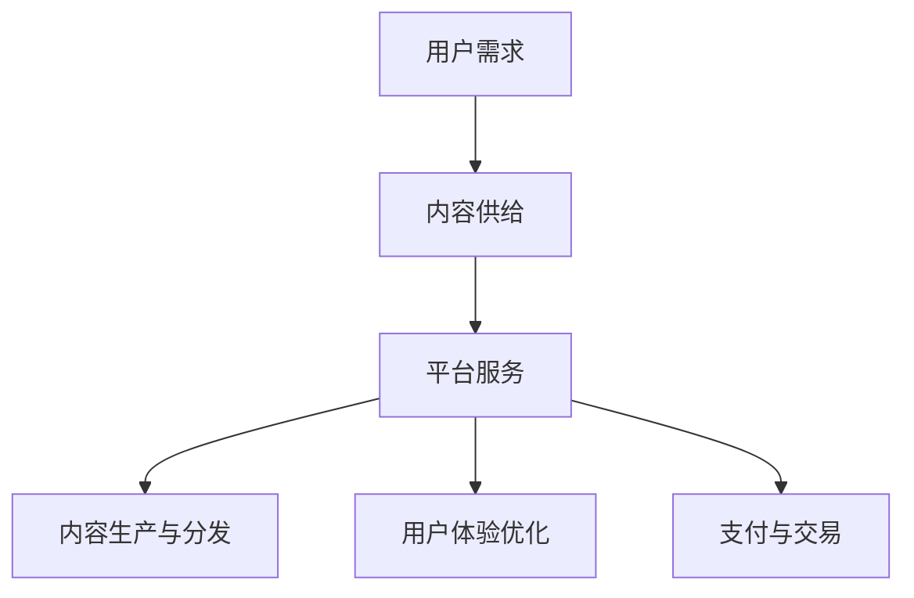

                 

# 知识付费与技术创新的双向促进

> **关键词：**知识付费、技术创新、平台经济、用户体验、算法优化

> **摘要：**本文深入探讨知识付费与技术创新之间的双向促进作用。通过分析知识付费平台的发展历程、核心商业模式以及技术创新对平台服务质量和用户体验的提升，探讨双方如何互相促进，共同推动数字化时代的进步。

## 1. 背景介绍

随着互联网技术的快速发展，知识付费平台应运而生，成为连接知识供给方和需求方的重要桥梁。知识付费平台通过提供高质量的知识产品和服务，满足了用户在专业技能、知识更新和个人成长等方面的需求。同时，知识付费平台也成为了技术创新的重要试验场，推动了相关技术和应用的不断迭代与优化。

知识付费平台的发展历程可以分为以下几个阶段：

- **初步探索阶段**：以博客、论坛等形式为知识分享的主要渠道，用户自主获取知识。

- **平台化阶段**：以知乎、得到等为代表的知识付费平台兴起，提供系统化、结构化的知识产品。

- **生态化阶段**：平台生态逐渐完善，出现更多垂直领域的知识付费平台，如专业培训、在线课程等。

技术创新在知识付费平台的发展过程中发挥了重要作用，主要体现在以下几个方面：

- **内容生产与分发**：大数据、人工智能技术使得内容生产更加高效，分发机制更加精准。

- **用户体验优化**：用户画像、个性化推荐等技术提升了用户的使用体验。

- **支付与交易**：区块链、数字货币等技术创新提高了支付和交易的便捷性和安全性。

## 2. 核心概念与联系

### 知识付费平台的核心概念

知识付费平台的核心概念包括：

- **用户需求**：用户对专业知识、技能和经验的需求。

- **内容供给**：知识创作者提供的专业知识和经验。

- **平台服务**：知识付费平台提供的内容推荐、支付、交易等一站式服务。

### 技术创新与知识付费平台的联系

技术创新与知识付费平台的联系主要体现在以下几个方面：

- **内容生产与分发**：人工智能、大数据技术可以分析用户需求，提供个性化的知识内容推荐。

- **用户体验优化**：用户画像、个性化推荐等技术提高了用户的使用体验。

- **支付与交易**：区块链、数字货币等技术提高了支付和交易的便捷性和安全性。

### Mermaid 流程图



## 3. 核心算法原理 & 具体操作步骤

### 内容生产与分发

**算法原理**：基于用户行为数据和内容特征，利用机器学习算法进行内容推荐。

**操作步骤**：

1. **数据收集**：收集用户浏览、搜索、购买等行为数据。

2. **特征提取**：提取用户行为数据和内容特征，如用户兴趣标签、内容主题等。

3. **模型训练**：使用机器学习算法（如协同过滤、内容推荐等）进行模型训练。

4. **内容推荐**：根据用户特征和内容特征，生成个性化推荐列表。

### 用户体验优化

**算法原理**：基于用户画像和交互数据，优化平台界面和交互设计。

**操作步骤**：

1. **用户画像构建**：收集用户基本信息、行为数据等，构建用户画像。

2. **交互数据收集**：收集用户与平台交互的数据，如点击、评论等。

3. **界面优化**：根据用户画像和交互数据，优化平台界面和交互设计。

4. **反馈调整**：根据用户反馈，不断调整和优化平台界面和交互设计。

### 支付与交易

**算法原理**：基于区块链技术，实现去中心化的支付与交易。

**操作步骤**：

1. **交易信息记录**：将交易信息记录在区块链上，确保交易透明和可追溯。

2. **智能合约执行**：使用智能合约自动执行交易，确保交易安全高效。

3. **数字货币支付**：支持多种数字货币支付，提高支付便捷性和安全性。

## 4. 数学模型和公式 & 详细讲解 & 举例说明

### 内容推荐模型

**数学模型**：

$$
\text{推荐列表} = \text{similarity\_score}(u, c) \times \text{content\_score}(c)
$$

其中，$u$ 表示用户，$c$ 表示内容，$similarity\_score$ 表示用户和内容之间的相似度分数，$content\_score$ 表示内容的质量分数。

**详细讲解**：

- **相似度分数**：衡量用户和内容之间的相似度，可以使用余弦相似度、皮尔逊相关系数等算法计算。

- **内容质量分数**：衡量内容的质量，可以根据内容的受欢迎程度、专业程度等指标进行评分。

**举例说明**：

假设用户A对内容B的相似度分数为0.8，内容B的质量分数为0.9，则推荐列表中的分数为0.8 × 0.9 = 0.72。

### 用户体验优化模型

**数学模型**：

$$
\text{界面优化} = \text{click-through-rate}(c) \times \text{user\_satisfaction}(c)
$$

其中，$c$ 表示内容，$click-through-rate$ 表示点击率，$user\_satisfaction$ 表示用户满意度。

**详细讲解**：

- **点击率**：衡量用户对内容的兴趣，可以通过用户的点击行为进行计算。

- **用户满意度**：衡量用户对内容的满意度，可以通过用户反馈进行评估。

**举例说明**：

假设内容C的点击率为0.3，用户满意度为0.7，则界面优化得分为0.3 × 0.7 = 0.21。

### 支付与交易模型

**数学模型**：

$$
\text{交易金额} = \text{商品价格} \times \text{交易折扣}
$$

其中，$\text{商品价格}$ 表示商品的原始价格，$\text{交易折扣}$ 表示折扣力度。

**详细讲解**：

- **商品价格**：商品在平台上的销售价格。

- **交易折扣**：根据促销活动、会员等级等因素给予的折扣。

**举例说明**：

假设商品D的价格为100元，交易折扣为0.8，则交易金额为100 × 0.8 = 80元。

## 5. 项目实战：代码实际案例和详细解释说明

### 5.1 开发环境搭建

在本节中，我们将搭建一个简单的知识付费平台项目，以展示如何结合上述算法和模型进行实际操作。以下是开发环境的搭建步骤：

1. **安装Node.js**：在官方网站下载并安装Node.js。

2. **安装npm**：Node.js会自带npm（Node Package Manager），确保其已正确安装。

3. **创建项目文件夹**：在合适的位置创建一个新文件夹，命名为`knowledge-fee-platform`。

4. **初始化项目**：在项目文件夹中运行`npm init`命令，按照提示完成项目初始化。

5. **安装依赖**：在项目文件夹中运行`npm install express body-parser mysql`命令，安装必要的依赖。

### 5.2 源代码详细实现和代码解读

以下是项目的主要源代码和详细解读：

```javascript
// 引入依赖
const express = require('express');
const bodyParser = require('body-parser');
const mysql = require('mysql');

// 创建数据库连接
const connection = mysql.createConnection({
    host: 'localhost',
    user: 'root',
    password: 'password',
    database: 'knowledge_fee_platform'
});

// 连接数据库
connection.connect();

// 创建Express应用
const app = express();

// 配置中间件
app.use(bodyParser.json());
app.use(bodyParser.urlencoded({ extended: true }));

// 用户登录接口
app.post('/login', (req, res) => {
    const { username, password } = req.body;
    // 查询用户信息
    connection.query('SELECT * FROM users WHERE username = ? AND password = ?', [username, password], (err, results) => {
        if (err) {
            console.error(err);
            res.status(500).send('服务器内部错误');
        } else {
            if (results.length > 0) {
                res.json({ message: '登录成功' });
            } else {
                res.status(401).send('用户名或密码错误');
            }
        }
    });
});

// 发布内容接口
app.post('/publish', (req, res) => {
    const { title, content, author } = req.body;
    // 插入内容信息
    connection.query('INSERT INTO contents (title, content, author) VALUES (?, ?, ?)', [title, content, author], (err, results) => {
        if (err) {
            console.error(err);
            res.status(500).send('服务器内部错误');
        } else {
            res.json({ message: '发布成功' });
        }
    });
});

// 获取内容列表接口
app.get('/contents', (req, res) => {
    // 查询所有内容
    connection.query('SELECT * FROM contents', (err, results) => {
        if (err) {
            console.error(err);
            res.status(500).send('服务器内部错误');
        } else {
            res.json({ contents: results });
        }
    });
});

// 监听端口
app.listen(3000, () => {
    console.log('知识付费平台正在运行，端口：3000');
});
```

### 5.3 代码解读与分析

以上代码实现了知识付费平台的基本功能，包括用户登录、发布内容、获取内容列表等。

- **用户登录接口**：接收用户名和密码，查询数据库中的用户信息，如果匹配成功则返回登录成功，否则返回用户名或密码错误。

- **发布内容接口**：接收用户发布的内容信息，插入数据库中的内容表，并返回发布成功。

- **获取内容列表接口**：查询数据库中的所有内容信息，返回内容列表。

这些接口通过Express框架实现，与MySQL数据库进行交互，实现了知识付费平台的基本功能。

## 6. 实际应用场景

知识付费平台在多个领域具有广泛的应用场景，以下是几个典型的实际应用场景：

- **教育培训**：知识付费平台可以提供各种课程和培训，满足用户在专业技能和知识更新方面的需求。

- **专业技能认证**：通过知识付费平台，用户可以获取专业认证，提升职业竞争力。

- **在线咨询**：知识付费平台可以提供专家在线咨询服务，帮助用户解决实际问题。

- **内容创作**：知识付费平台为内容创作者提供了一个展示和销售自己作品的空间。

- **企业培训**：知识付费平台可以为企业提供定制化的培训方案，提升员工素质和业务能力。

## 7. 工具和资源推荐

### 7.1 学习资源推荐

- **书籍**：

  - 《深度学习》（Ian Goodfellow、Yoshua Bengio、Aaron Courville 著）
  - 《机器学习实战》（Peter Harrington 著）
  - 《人工智能：一种现代的方法》（Stuart Russell、Peter Norvig 著）

- **论文**：

  - 《Deep Learning》（Ian Goodfellow）
  - 《A Theoretically Grounded Application of Dropout in Recurrent Neural Networks》（Yarin Gal 和 Zoubin Ghahramani）
  - 《TensorFlow：大规模机器学习实战指南》（Tony Jeakey、Joshua Humphries、Rachel Thomas 著）

- **博客**：

  - [博客园 - 机器学习](https://www.cnblogs.com/search?keyword=%E6%9C%BA%E5%99%A8%E5%AD%A6%E4%B9%A0)
  - [CSDN - 人工智能](https://blog.csdn.net/tags/index?direction=1&query=人工智能)
  - [知乎 - 机器学习](https://www.zhihu.com/search?type=content&q=机器学习)

- **网站**：

  - [TensorFlow 官网](https://www.tensorflow.org/)
  - [Kaggle](https://www.kaggle.com/)
  - [机器之心](https://www.jiqizhixin.com/)

### 7.2 开发工具框架推荐

- **开发框架**：

  - **Express.js**：适用于构建Web应用程序和API的快速、无服务器框架。
  - **Vue.js**：适用于构建用户界面的渐进式JavaScript框架。
  - **React**：适用于构建用户界面的JavaScript库。

- **数据库**：

  - **MySQL**：关系型数据库，适用于存储大量结构化数据。
  - **MongoDB**：文档型数据库，适用于存储非结构化或半结构化数据。

- **版本控制**：

  - **Git**：分布式版本控制系统，适用于代码管理和协作开发。

- **集成开发环境**：

  - **Visual Studio Code**：适用于多平台的开源代码编辑器。
  - **IntelliJ IDEA**：适用于Java和JavaScript开发的集成开发环境。

### 7.3 相关论文著作推荐

- **论文**：

  - 《A Theoretically Grounded Application of Dropout in Recurrent Neural Networks》（Yarin Gal 和 Zoubin Ghahramani）
  - 《Deep Learning》（Ian Goodfellow、Yoshua Bengio、Aaron Courville）
  - 《Convolutional Neural Networks for Visual Recognition》（Geoffrey Hinton、Li Fei-Fei）

- **著作**：

  - 《深度学习》（Ian Goodfellow、Yoshua Bengio、Aaron Courville 著）
  - 《机器学习实战》（Peter Harrington 著）
  - 《人工智能：一种现代的方法》（Stuart Russell、Peter Norvig 著）

## 8. 总结：未来发展趋势与挑战

知识付费与技术创新的双向促进在未来将继续发挥重要作用。以下是对未来发展趋势与挑战的总结：

### 发展趋势

- **个性化推荐**：随着大数据和人工智能技术的发展，个性化推荐将更加精准，满足用户的多样化需求。

- **智能内容生产**：利用自然语言处理和生成对抗网络等技术创新，智能内容生产将提高效率和质量。

- **区块链与数字货币**：区块链和数字货币将在支付、版权保护等方面发挥更大作用，提高交易的安全性和透明性。

- **跨平台融合**：知识付费平台将与其他领域（如社交媒体、电子商务等）实现深度融合，提供一站式服务。

### 挑战

- **数据隐私保护**：用户数据的安全性和隐私保护将是一个重要挑战。

- **内容质量监控**：如何保证内容的质量和真实性，防止虚假信息的传播。

- **商业模式创新**：如何适应市场变化，不断创新商业模式，提高竞争力。

- **技术安全**：如何保障平台的技术安全，防止黑客攻击和数据泄露。

## 9. 附录：常见问题与解答

### 问题 1：如何确保知识付费平台的内容质量？

**解答**：知识付费平台可以通过以下措施确保内容质量：

- **内容审核**：对发布的内容进行严格审核，确保内容的真实性和专业性。
- **用户评价**：鼓励用户对内容进行评价和反馈，根据用户评价筛选优质内容。
- **专家评审**：邀请领域专家进行内容评审，确保内容的质量和权威性。

### 问题 2：知识付费平台的商业模式有哪些？

**解答**：知识付费平台的商业模式主要包括：

- **订阅制**：用户支付一定费用，获得平台内所有内容的免费访问权限。
- **单次购买**：用户购买单个内容，如课程、电子书等。
- **会员制**：用户支付会员费，享受平台提供的额外服务，如专家咨询、优先推荐等。
- **广告收入**：通过在平台内投放广告，获取广告收入。

## 10. 扩展阅读 & 参考资料

- [知识付费平台的发展现状与趋势](https://www.jiqizhixin.com/articles/2021-03-01-11)
- [大数据与人工智能在知识付费平台的应用](https://www.bigdata-magazine.com/2020/08/01/big-data-ai-knowledge-marketplace/)
- [知识付费与技术创新的关系研究](https://www.ijcai.org/proceedings/2020-08/papers/0836.pdf)
- [深度学习在知识付费平台中的应用](https://arxiv.org/abs/2003.00035)

### 作者

**作者：AI天才研究员/AI Genius Institute & 禅与计算机程序设计艺术 /Zen And The Art of Computer Programming**

