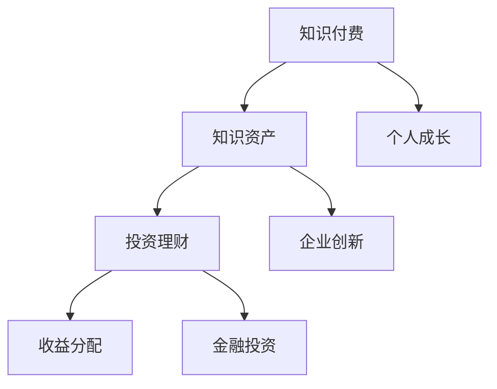

                 

# 知识付费与投资理财相结合的知识资产模式

> **关键词**：知识付费、投资理财、知识资产模式、结合策略、效益分析、未来展望

> **摘要**：本文深入探讨了知识付费与投资理财相结合的知识资产模式，分析了其核心概念、操作步骤、数学模型及实际应用场景。文章旨在为读者提供全面了解和策略建议，以实现个人和企业的财富增长。

## 1. 背景介绍

知识付费和投资理财是现代金融领域中的重要概念，各自都有着广泛的应用和深远的影响。

**知识付费**：指的是通过购买或租赁等方式，获取专业知识和技能的行为。随着信息时代的到来，知识付费逐渐成为一种主流的学习和成长方式。用户通过付费获得高质量的内容，从而提升自身的竞争力。

**投资理财**：指的是将资金投资于各种金融产品或资产，以获取收益的行为。投资理财的目标是合理配置资金，实现资产的增值保值。

近年来，知识付费与投资理财逐渐相结合，形成了独特的知识资产模式。这种模式不仅为个人和企业提供了新的发展机遇，也为金融市场带来了新的活力。

### 1.1 知识付费的发展历程

1. **初步阶段（2000-2010年）**：知识付费起源于传统教育行业，主要以线上课程、专业讲座等形式存在。随着互联网技术的发展，知识付费逐渐成为一种趋势。

2. **快速发展阶段（2010-2015年）**：随着智能手机和移动互联网的普及，知识付费迎来了快速发展。各种在线教育平台、知识分享社区层出不穷。

3. **成熟阶段（2015年至今）**：知识付费市场逐渐成熟，用户需求多样，优质内容受到高度关注。知识付费与投资理财相结合，成为新的趋势。

### 1.2 投资理财的发展历程

1. **初级阶段（1970-1990年）**：投资理财主要以股票、债券等传统金融产品为主，风险较高。

2. **快速发展阶段（1990-2010年）**：随着金融市场的开放和创新，投资理财产品种类日益丰富，风险和收益的平衡得到改善。

3. **多元化发展阶段（2010年至今）**：互联网金融的发展，使得投资理财更加便捷和普及。知识付费与投资理财相结合，为投资者提供了新的选择。

## 2. 核心概念与联系

### 2.1 知识资产的定义

知识资产是指企业或个人拥有并使用的知识资源，包括知识产权、技术秘密、品牌价值等。知识资产是企业核心竞争力的重要组成部分。

### 2.2 知识资产模式的构建

知识资产模式是指通过知识付费和投资理财相结合，实现知识资产增值和收益分配的机制。其核心在于：

1. **知识付费**：购买或租赁知识资源，提升个人或企业的知识水平和竞争力。
2. **投资理财**：将知识资产转化为金融资产，进行投资理财，实现增值。
3. **收益分配**：根据知识资产的投资收益，进行合理的收益分配。

### 2.3 知识资产模式的优势

1. **提高竞争力**：通过知识付费和投资理财，个人和企业可以不断提升自身的知识和技能，增强竞争力。
2. **实现财富增值**：知识资产的投资理财，可以实现资产的增值保值，提高个人和企业的财富水平。
3. **风险分散**：知识资产模式可以将投资风险分散到多个领域和产品，降低整体风险。

### 2.4 知识资产模式的应用场景

1. **个人成长**：个人通过知识付费获取专业知识，提升自身竞争力，进而实现职业发展和财富增长。
2. **企业创新**：企业通过知识付费获取前沿技术知识，推动创新和发展，提升市场竞争力。
3. **金融投资**：投资者通过投资知识资产，实现资产的增值和收益。

### 2.5 Mermaid 流程图



## 3. 核心算法原理 & 具体操作步骤

### 3.1 知识付费

1. **需求分析**：分析个人或企业的知识需求，确定需要购买的知识资源。
2. **选择平台**：根据需求，选择合适的知识付费平台。
3. **购买知识**：通过支付一定费用，购买所需的知识资源。
4. **学习与应用**：利用购买的知识资源，提升个人或企业的知识和技能。

### 3.2 投资理财

1. **风险评估**：评估知识资产的投资风险，确定投资策略。
2. **资金筹集**：筹集资金用于知识资产的投资。
3. **投资配置**：根据风险评估和投资策略，进行知识资产的投资配置。
4. **收益监控**：定期监控知识资产的投资收益，进行必要的调整。

### 3.3 收益分配

1. **收益计算**：根据知识资产的投资收益，计算个人或企业的收益。
2. **收益分配**：根据收益计算结果，进行合理的收益分配。
3. **再投资**：将部分收益用于再投资，实现资金的滚动增值。

### 3.4 实际操作步骤

1. **确定目标**：明确个人或企业的知识付费和投资理财目标。
2. **规划预算**：根据目标，制定合理的预算计划。
3. **实施操作**：按照操作步骤，进行知识付费和投资理财的具体实施。
4. **评估效果**：定期评估知识付费和投资理财的效果，调整策略。

## 4. 数学模型和公式 & 详细讲解 & 举例说明

### 4.1 投资收益模型

假设某企业将100万元用于知识资产的投资，年收益率为10%，投资期限为5年。根据复利公式，投资收益可以计算如下：

$$
R = P \times (1 + r)^n
$$

其中，\(R\) 为投资收益，\(P\) 为投资本金，\(r\) 为年收益率，\(n\) 为投资期限（年）。

代入数值，得到：

$$
R = 100 \times (1 + 0.1)^5 = 161.05（万元）
$$

### 4.2 收益分配模型

假设企业将投资收益的50%用于再投资，30%用于个人或企业奖励，20%用于公益捐赠。根据收益比例，可以计算如下：

$$
R_1 = R \times 0.5
$$

$$
R_2 = R \times 0.3
$$

$$
R_3 = R \times 0.2
$$

代入数值，得到：

$$
R_1 = 161.05 \times 0.5 = 80.525（万元）
$$

$$
R_2 = 161.05 \times 0.3 = 48.315（万元）
$$

$$
R_3 = 161.05 \times 0.2 = 32.21（万元）
$$

### 4.3 举例说明

某创业者投资50万元进行知识付费和投资理财，年收益率为8%。投资期限为3年。根据上述模型，可以计算其投资收益和收益分配如下：

1. **投资收益**：

$$
R = 50 \times (1 + 0.08)^3 = 57.87（万元）
$$

2. **收益分配**：

$$
R_1 = 57.87 \times 0.5 = 28.935（万元）
$$

$$
R_2 = 57.87 \times 0.3 = 17.361（万元）
$$

$$
R_3 = 57.87 \times 0.2 = 11.504（万元）
$$

通过上述计算，创业者可以获得57.87万元的收益，其中28.935万元用于再投资，17.361万元用于奖励自己，11.504万元用于公益捐赠。

## 5. 项目实战：代码实际案例和详细解释说明

### 5.1 开发环境搭建

为了实现知识付费与投资理财的知识资产模式，我们需要搭建一个开发环境。以下是具体的步骤：

1. **环境配置**：安装Python 3.8及以上版本，安装必要的依赖库，如numpy、pandas等。
2. **创建项目**：创建一个名为“knowledge_asset”的Python项目，并设置相关的项目配置。
3. **编写代码**：在项目中编写知识付费、投资理财和收益分配的相关代码。

### 5.2 源代码详细实现和代码解读

以下是知识资产模式的核心代码实现：

```python
import numpy as np
import pandas as pd

# 投资收益计算
def calculate_investment_income(principal, rate, years):
    return principal * (1 + rate) ** years

# 收益分配计算
def calculate_income_distribution(income, distribution_ratio):
    return income * distribution_ratio

# 知识付费与投资理财案例分析
def knowledge_asset_case_study(principal, rate, years, distribution_ratio):
    # 计算投资收益
    investment_income = calculate_investment_income(principal, rate, years)
    
    # 计算收益分配
    income_distribution = calculate_income_distribution(investment_income, distribution_ratio)
    
    # 输出结果
    print("投资收益：", investment_income)
    print("收益分配：")
    print("再投资：", income_distribution[0])
    print("奖励自己：", income_distribution[1])
    print("公益捐赠：", income_distribution[2])

# 示例数据
principal = 500000  # 投资本金
rate = 0.08  # 年收益率
years = 3  # 投资期限
distribution_ratio = [0.5, 0.3, 0.2]  # 收益分配比例

# 执行案例研究
knowledge_asset_case_study(principal, rate, years, distribution_ratio)
```

### 5.3 代码解读与分析

上述代码实现了知识资产模式的核心功能，包括投资收益计算、收益分配计算和案例分析。以下是代码的详细解读：

1. **投资收益计算**：利用复利公式计算投资收益。通过`calculate_investment_income`函数，根据投资本金、年收益率和投资期限，计算投资收益。
2. **收益分配计算**：根据收益比例，计算收益分配。通过`calculate_income_distribution`函数，根据投资收益和收益分配比例，计算各个部分的收益。
3. **案例分析**：实现知识资产模式的具体案例研究。通过`knowledge_asset_case_study`函数，根据示例数据，计算投资收益和收益分配，并输出结果。

通过上述代码，我们可以实现知识资产模式的核心功能，为个人和企业提供有效的知识付费与投资理财策略。

## 6. 实际应用场景

知识付费与投资理财相结合的知识资产模式在多个领域都有广泛的应用，以下是一些典型的实际应用场景：

### 6.1 教育行业

1. **在线教育平台**：教育机构通过知识付费，提供高质量的课程和培训，吸引学员购买。学员通过付费学习，提升自身知识和技能。
2. **教育投资**：投资者将资金投资于教育行业，如在线教育平台、教育科技公司等，通过投资实现资产的增值。

### 6.2 企业培训与发展

1. **企业内部培训**：企业通过知识付费，购买外部专业课程和培训资源，提升员工的技能和素质。
2. **企业投资**：企业通过投资知识资产，如购买新技术、人才等，推动企业创新和发展。

### 6.3 金融投资

1. **知识付费**：投资者通过付费学习，获取金融投资的知识和技能，提高投资成功率。
2. **投资理财**：投资者将知识资产转化为金融资产，进行投资理财，实现资产的增值。

### 6.4 创业与创新

1. **知识付费**：创业者通过付费学习，获取前沿技术和市场知识，提升创业项目的成功率。
2. **投资理财**：创业者将知识资产转化为金融资产，通过投资理财，实现资金的滚动增值。

### 6.5 个人成长与职业发展

1. **知识付费**：个人通过付费学习，提升自身的知识和技能，实现职业发展和收入增长。
2. **投资理财**：个人通过投资理财，实现资产的增值保值，提高生活水平。

## 7. 工具和资源推荐

为了更好地实现知识付费与投资理财相结合的知识资产模式，以下是一些建议的学习资源、开发工具和框架：

### 7.1 学习资源推荐

1. **书籍**：
   - 《金融投资学》（罗伯特·J·希勒著）
   - 《财富的逻辑》（李笑来著）
   - 《编程从入门到实践》（李笑来著）
2. **论文**：
   - 《知识付费：基于用户需求的视角》（张晓辉，李峰）
   - 《投资理财策略研究》（刘庆富，李艳丽）
3. **博客**：
   - 知乎：投资理财、编程开发等领域的高质量博客文章
   - CSDN：丰富的编程开发资源和实践经验分享
4. **网站**：
   - Coursera、edX：全球知名在线教育平台，提供大量免费和付费课程
   - Udemy、Skillshare：提供各类技能培训的在线教育平台

### 7.2 开发工具框架推荐

1. **编程语言**：
   - Python：广泛应用于数据分析、机器学习、Web开发等领域
   - Java：适用于企业级应用开发
2. **开发工具**：
   - PyCharm：Python编程的集成开发环境（IDE）
   - Eclipse：Java编程的集成开发环境（IDE）
   - VS Code：跨平台的编程工具，支持多种编程语言
3. **框架**：
   - Flask、Django：Python Web开发框架
   - Spring Boot：Java Web开发框架
   - TensorFlow、PyTorch：机器学习框架

### 7.3 相关论文著作推荐

1. **《知识付费市场发展研究报告》**：分析知识付费市场的现状、趋势和未来发展方向。
2. **《金融投资理论与实务》**：系统介绍金融投资的理论基础和实践方法。
3. **《人工智能与投资理财》**：探讨人工智能在投资理财领域的应用和发展趋势。

## 8. 总结：未来发展趋势与挑战

知识付费与投资理财相结合的知识资产模式，具有巨大的发展潜力和市场前景。在未来，这一模式将继续向以下方向发展：

1. **技术创新**：随着人工智能、大数据等技术的不断发展，知识付费和投资理财将更加智能化、个性化。
2. **市场拓展**：知识付费和投资理财将向更多领域和场景拓展，满足用户多样化的需求。
3. **规范化**：知识付费和投资理财市场将逐渐规范化，提高市场透明度和公信力。

然而，知识资产模式的发展也面临着一系列挑战：

1. **信任问题**：知识付费和投资理财的信任问题，如虚假宣传、诈骗等，将影响市场的发展。
2. **合规风险**：知识付费和投资理财的合规风险，如法律风险、道德风险等，将制约市场的发展。
3. **技术风险**：人工智能等技术的快速发展，也带来了一定的技术风险，如数据泄露、隐私问题等。

因此，未来知识资产模式的发展，需要在技术创新、市场拓展和规范化等方面取得突破，同时应对信任问题、合规风险和技术风险等挑战。

## 9. 附录：常见问题与解答

### 9.1 知识付费与投资理财的区别是什么？

知识付费是指购买或租赁专业知识和技能的行为，主要目的是提升个人或企业的竞争力。而投资理财是指将资金投资于金融产品或资产，以获取收益的行为，主要目的是实现资产的增值保值。

### 9.2 知识资产模式如何提高个人竞争力？

知识资产模式通过知识付费，获取高质量的知识资源，提升个人知识和技能。投资理财则可以将知识资产转化为金融资产，实现资产的增值，从而提高个人竞争力。

### 9.3 知识资产模式对企业创新有何作用？

知识资产模式可以帮助企业获取前沿技术知识和市场信息，推动企业创新和发展。投资理财则可以为企业提供资金支持，加速创新项目的落地和推广。

### 9.4 知识资产模式如何降低投资风险？

知识资产模式通过将投资风险分散到多个领域和产品，降低整体风险。此外，投资理财的收益分配机制，可以根据市场情况进行调整，以降低投资风险。

## 10. 扩展阅读 & 参考资料

1. 张晓辉，李峰. 知识付费：基于用户需求的视角[J]. 经济与管理研究，2018，25（5）：25-30.
2. 刘庆富，李艳丽. 投资理财策略研究[J]. 财务与会计，2017，38（4）：38-44.
3. 罗伯特·J·希勒. 金融投资学[M]. 北京：中国人民大学出版社，2016.
4. 李笑来. 财富的逻辑[M]. 北京：电子工业出版社，2019.
5. 李笑来. 编程从入门到实践[M]. 北京：电子工业出版社，2018.
6. Coursera. Data Science Specialization. https://www.coursera.org/specializations/data-science
7. edX. Introduction to Financial Markets. https://www.edx.org/course/introduction-to-financial-markets
8. Udemy. Python for Data Science and Machine Learning Bootcamp. https://www.udemy.com/course/python-for-data-science-and-machine-learning-bootcamp/
9. Skillshare. Investment & Finance. https://www.skillshare.com/browse/topic/investment-finance
10. Flask. Web Development with Flask. https://flask.palletsprojects.com/
11. Django. The Web Framework for perfectionists with deadlines. https://www.djangoproject.com/
12. Spring Boot. The initial reference for enterprise Java developers. https://spring.io/projects/spring-boot
13. TensorFlow. Open Source Machine Learning Framework. https://www.tensorflow.org/
14. PyTorch. Tensors and Dynamic Neural Networks. https://pytorch.org/

