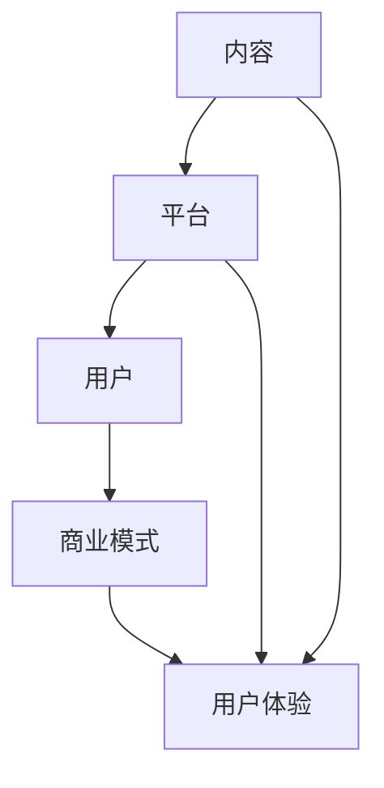
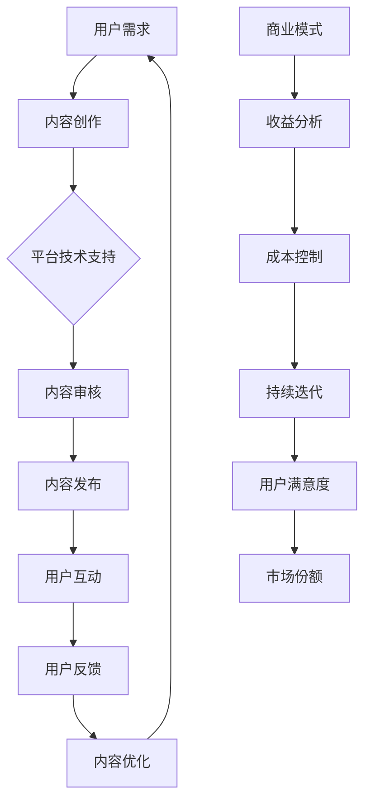

                 

# 知识付费产品的持续更新与维护

## 摘要

本文旨在探讨知识付费产品在互联网时代的持续更新与维护的重要性。随着用户需求的不断变化和市场竞争的加剧，知识付费产品的持续迭代和优化成为了保持竞争力的关键。本文将详细分析知识付费产品的核心概念，包括其构成要素、用户体验和商业模式，并介绍一系列确保产品持续更新的策略与工具。通过本文的阅读，读者将了解到如何利用先进的技术和方法来提升知识付费产品的质量，延长其生命周期，并实现商业成功。

## 1. 背景介绍

### 知识付费产品概述

知识付费产品，顾名思义，是指用户通过支付一定的费用来获取专业知识和信息的在线服务。这类产品在近几年得到了快速发展，主要得益于互联网技术的进步和用户对高质量知识内容的需求增加。知识付费产品涵盖了广泛的主题，包括但不限于在线课程、专业咨询、行业报告、电子书籍和知识分享平台等。

#### 市场规模与增长趋势

随着数字化转型的推进，知识付费市场呈现出爆发式增长。根据市场研究报告，全球知识付费市场规模预计将在未来几年内达到数百亿美元。这一趋势主要受到以下几个因素的推动：

1. **用户需求增加**：随着人们对个人成长和职业发展的需求日益增长，对高质量知识内容的需求也在不断上升。
2. **内容消费习惯的改变**：移动互联网的普及使得用户更倾向于通过在线平台获取知识，便捷性和灵活性得到了显著提升。
3. **技术进步**：人工智能、大数据和云计算等技术的应用，使得知识付费产品的个性化推荐、实时互动和内容生产效率得到了大幅提高。

### 知识付费产品的发展历程

知识付费产品的历史可以追溯到互联网初期，但当时的知识传播渠道相对单一，内容质量和用户体验也较为有限。随着时间推移，知识付费市场逐渐经历了以下几个阶段：

1. **内容驱动阶段**：以简单的在线课程和电子书为主，内容质量和用户体验是产品的核心竞争力。
2. **平台驱动阶段**：随着知识付费市场的逐渐成熟，知识分享平台如雨后春笋般涌现，平台生态和用户规模成为了关键因素。
3. **智能驱动阶段**：人工智能和大数据技术的引入，使得知识付费产品能够更好地理解用户需求，实现个性化推荐和智能互动。

### 当前市场状况与竞争格局

当前，知识付费市场呈现出多元化的竞争格局，各类平台和内容创作者竞相争夺市场份额。主要竞争者包括：

1. **综合知识平台**：如得到、喜马拉雅、知乎Live等，它们通过海量内容、专业讲师和用户社区吸引了大量用户。
2. **垂直领域平台**：如投资理财、职业技能培训、亲子教育等，这些平台专注于特定领域，提供专业且深入的内容。
3. **个人创作者**：依托社交媒体和个人品牌，通过直播、短视频和知识付费课程等形式进行内容创作和变现。

#### 挑战与机遇

尽管知识付费市场前景广阔，但也面临着一系列挑战：

1. **内容同质化**：市场上大量相似内容使得用户难以选择，平台和创作者需要不断创新来吸引和留住用户。
2. **用户体验优化**：随着用户需求的多样化，平台需要不断提升用户体验，包括内容质量、互动性和便捷性等方面。
3. **市场竞争激烈**：大量新玩家进入市场，使得竞争愈发激烈，平台和创作者需要通过差异化策略来脱颖而出。

然而，这些挑战也蕴含着巨大的机遇：

1. **技术进步**：人工智能、大数据和云计算等技术的应用，为知识付费产品的个性化推荐、内容生产和用户体验提升提供了新的可能性。
2. **用户需求多样化**：随着用户需求的不断变化，知识付费产品有机会通过细分市场和垂直领域来实现差异化竞争。
3. **合作共赢**：平台与创作者、企业客户的合作，可以实现资源互补和共赢发展，共同推动知识付费市场的繁荣。

综上所述，知识付费产品在当前市场环境中既面临着挑战，也拥有巨大的发展机遇。只有不断创新和优化，才能在激烈的市场竞争中脱颖而出，实现可持续的商业成功。

### 知识付费产品的核心要素

#### 内容质量

内容质量是知识付费产品的核心要素之一。高质量的内容不仅能够满足用户的学习需求，还能够提升用户对产品的信任度和忠诚度。在内容创作过程中，需要注重以下几个关键点：

1. **专业性**：内容创作者需要具备相关领域的专业知识和经验，以确保内容的权威性和准确性。
2. **深度与广度**：内容不仅要覆盖广泛的知识点，还需要深入探讨关键问题，提供有价值的见解和分析。
3. **实用性**：内容需要与实际应用相结合，帮助用户解决实际问题，提升其实际工作能力和职业发展。

#### 用户体验

用户体验是知识付费产品能否成功的关键。一个优秀的知识付费产品需要从以下几个方面优化用户体验：

1. **界面设计**：界面设计要简洁美观，操作便捷，使得用户能够轻松浏览和获取所需内容。
2. **交互体验**：通过互动环节（如问答、讨论区、直播等）增加用户参与度，提升学习效果。
3. **个性化推荐**：利用大数据和人工智能技术，为用户提供个性化推荐，满足其个性化需求。

#### 商业模式

知识付费产品的商业模式直接关系到产品的盈利能力和可持续发展。以下是一些常见的商业模式：

1. **订阅制**：用户通过支付一定费用获得长期使用权，适用于内容更新频繁且用户粘性较高的产品。
2. **单次购买**：用户为单个内容支付费用，适用于内容一次性消费的产品，如电子书籍、单次课程等。
3. **广告收入**：通过内容展示广告获得收入，适用于用户量较大的平台。
4. **合作分成**：平台与内容创作者合作，按照分成比例分配收入，适用于专业领域知识和技能分享。
5. **会员制**：提供会员服务，用户支付会员费用后享受更多特权，如优先学习、专属内容等。

#### 用户反馈与迭代

用户反馈是知识付费产品持续优化的重要依据。通过收集和分析用户反馈，可以及时发现问题并进行迭代改进。以下是一些有效的用户反馈收集和分析方法：

1. **用户调查**：通过问卷调查、访谈等方式了解用户需求和满意度。
2. **数据分析**：利用数据分析工具跟踪用户行为，识别用户偏好和问题点。
3. **用户社区**：建立用户社区，鼓励用户分享使用体验和建议，促进用户参与和互动。

#### 实际案例

以知乎Live为例，知乎Live是知乎推出的知识分享产品，通过直播和录播形式为用户提供专业知识和技能培训。知乎Live在内容质量、用户体验和商业模式等方面都有成功的实践：

1. **内容质量**：知乎Live邀请各领域的专家和达人进行分享，确保内容的专业性和实用性。
2. **用户体验**：知乎Live通过实时互动、问答环节和后续讨论区，提升用户的学习体验和参与度。
3. **商业模式**：知乎Live采用单次购买和订阅制两种模式，满足不同用户的需求，并通过用户反馈不断优化产品。

### 1.3 知识付费产品的现状与发展趋势

#### 市场规模与用户增长

近年来，知识付费市场呈现出爆发式增长。根据市场研究报告，全球知识付费市场规模在2020年已经超过2000亿元人民币，预计未来几年将继续保持高速增长。与此同时，知识付费用户数量也在迅速增加，特别是在我国，知识付费用户已经超过4亿人。

#### 行业竞争格局

知识付费市场竞争激烈，各类平台和内容创作者纷纷涌入。目前，市场主要由以下几个方向的竞争者占据：

1. **综合知识平台**：如得到、喜马拉雅、知乎等，这些平台通过海量的内容和专业的讲师吸引了大量用户。
2. **垂直领域平台**：如投资理财、职业技能培训、亲子教育等，这些平台专注于特定领域，提供专业和深入的内容。
3. **个人创作者**：依托社交媒体和个人品牌，通过直播、短视频和知识付费课程等形式进行内容创作和变现。

#### 发展趋势

1. **内容多元化**：随着用户需求的多样化，知识付费产品将逐渐从单一领域向多元化方向发展，覆盖更广泛的主题和行业。
2. **技术驱动**：人工智能、大数据和云计算等技术的应用，将进一步提升知识付费产品的个性化推荐、内容生产和用户体验。
3. **平台化发展**：知识付费平台将逐渐向生态化方向发展，通过平台整合资源、促进合作，实现共赢发展。
4. **用户参与度提升**：通过互动环节和用户社区，提升用户参与度和学习效果，增强用户黏性和忠诚度。

#### 未来机遇与挑战

未来，知识付费市场将面临一系列机遇与挑战：

1. **机遇**：技术进步将推动知识付费产品的创新和优化，市场潜力巨大；用户需求的多样化将带来新的机会。
2. **挑战**：市场竞争激烈，内容同质化严重；用户体验和内容质量需要不断提升；如何实现可持续的商业模式也是一大挑战。

### 1.4 知识付费产品的重要性

知识付费产品在当今社会具有重要的意义，主要体现在以下几个方面：

1. **满足用户需求**：随着人们对于自我提升和职业发展的需求不断增加，知识付费产品为用户提供了一个获取高质量知识和技能的渠道。
2. **推动行业进步**：知识付费产品促进了知识传播和技能培训，有助于提升行业整体素质和竞争力。
3. **实现商业价值**：知识付费产品为内容创作者和平台带来了丰厚的商业回报，推动了整个产业链的繁荣。
4. **促进社会创新**：知识付费产品为创新提供了土壤，激发了社会各界的创新活力。

### 1.5 总结

知识付费产品在当前市场环境中具有重要的地位，其持续更新与维护对于保持竞争力和实现商业成功至关重要。在接下来的部分中，我们将进一步探讨知识付费产品如何实现持续更新与维护，以及相关的策略和工具。

### 2. 核心概念与联系

#### 2.1 知识付费产品的构成要素

知识付费产品的核心构成要素主要包括内容、平台、用户和商业模式。这些要素相互关联，共同决定了知识付费产品的质量、用户体验和商业成功。

1. **内容**：高质量的内容是知识付费产品的核心。内容不仅需要具备专业性和实用性，还需要不断更新和优化，以满足用户的需求和期望。
2. **平台**：知识付费平台是连接内容创造者和用户的中介。平台需要提供稳定、可靠的技术支持和用户服务，以提升用户体验和用户满意度。
3. **用户**：用户是知识付费产品的消费者，他们的需求、行为和反馈直接影响产品的质量和商业成功。因此，了解用户需求、提升用户体验是知识付费产品的重要任务。
4. **商业模式**：商业模式决定了知识付费产品的盈利方式和可持续发展能力。选择合适的商业模式，能够最大化地实现商业价值。

#### 2.2 知识付费产品与用户体验的关系

用户体验是知识付费产品成功的关键。一个优秀的知识付费产品需要从多个维度提升用户体验，包括界面设计、交互体验、内容质量和用户反馈等。

1. **界面设计**：界面设计要简洁、美观、易于操作，让用户能够快速找到所需内容，提升用户的使用体验。
2. **交互体验**：通过互动环节（如问答、讨论区、直播等）增加用户参与度，提升学习效果和用户满意度。
3. **内容质量**：高质量的内容是提升用户体验的基础。内容需要具备专业性和实用性，能够解决用户的实际问题。
4. **用户反馈**：及时收集和分析用户反馈，了解用户的需求和痛点，不断优化产品，提升用户体验。

#### 2.3 知识付费产品与商业模式的联系

知识付费产品的商业模式直接关系到产品的盈利能力和可持续发展。选择合适的商业模式，能够最大化地实现商业价值。

1. **订阅制**：通过长期订阅，用户可以获得持续的知识更新和服务，平台能够获得稳定的收入。
2. **单次购买**：用户为单个内容支付费用，适用于内容一次性消费的产品，如电子书籍、单次课程等。
3. **广告收入**：通过内容展示广告获得收入，适用于用户量较大的平台。
4. **合作分成**：平台与内容创作者合作，按照分成比例分配收入，适用于专业领域知识和技能分享。
5. **会员制**：提供会员服务，用户支付会员费用后享受更多特权，如优先学习、专属内容等。

#### 2.4 知识付费产品的核心概念联系图

为了更好地理解知识付费产品的核心概念和联系，我们可以通过Mermaid流程图来展示各要素之间的相互关系。



在这个流程图中，内容、平台、用户和商业模式构成了知识付费产品的核心要素，它们相互关联，共同决定了产品的质量、用户体验和商业成功。

### 2.5 知识付费产品的核心概念原理和架构的Mermaid流程图

以下是一个详细的Mermaid流程图，展示了知识付费产品的核心概念原理和架构：



在上述流程图中，每个节点代表知识付费产品中的一个关键环节：

- **用户需求**：了解用户的学习需求和偏好，为内容创作提供方向。
- **内容创作**：根据用户需求创作高质量的知识内容。
- **平台技术支持**：提供稳定、高效的内容发布和管理技术支持。
- **内容审核**：确保内容的准确性和合规性，保障用户体验。
- **内容发布**：将经过审核的内容发布给用户。
- **用户互动**：通过问答、讨论区等互动环节提升用户参与度和满意度。
- **用户反馈**：收集用户对内容的反馈，用于内容优化和改进。
- **内容优化**：根据用户反馈持续改进内容，提升用户体验。
- **商业模式**：选择合适的商业模式，实现商业价值最大化。
- **收益分析**：分析商业模式带来的收益，优化商业模式。
- **成本控制**：控制运营成本，提高盈利能力。
- **持续迭代**：不断迭代产品，保持市场竞争力。
- **用户满意度**：提升用户满意度，增加用户黏性和忠诚度。
- **市场份额**：通过持续优化和迭代，扩大市场份额。

通过这个Mermaid流程图，我们可以清晰地看到知识付费产品的运作机制和各环节之间的联系，有助于理解如何通过持续更新与维护提升产品的质量和竞争力。

### 3. 核心算法原理 & 具体操作步骤

#### 3.1 个性化推荐算法

个性化推荐算法是知识付费产品持续更新与维护的重要工具，它能够根据用户的行为数据和历史记录，为用户提供个性化的内容推荐。以下是一个典型的个性化推荐算法原理和具体操作步骤：

##### 3.1.1 算法原理

1. **协同过滤**：协同过滤是一种常见的推荐算法，包括基于用户的协同过滤（User-based Collaborative Filtering）和基于项目的协同过滤（Item-based Collaborative Filtering）。基于用户的协同过滤通过分析用户之间的相似度，推荐与目标用户行为相似的用户的喜爱内容；基于项目的协同过滤则通过分析项目之间的相似度，推荐与用户历史行为相似的项目。

2. **矩阵分解**：矩阵分解（Matrix Factorization）是一种常用的推荐算法，通过将用户和物品的评分矩阵分解为低维度的用户特征矩阵和物品特征矩阵，从而预测用户对物品的评分。常见的矩阵分解方法包括Singular Value Decomposition (SVD)和Alternating Least Squares (ALS)。

3. **基于内容的推荐**：基于内容的推荐算法通过分析物品的内容特征（如标签、关键词、文本等）和用户的历史偏好，为用户推荐具有相似内容特征的物品。

##### 3.1.2 具体操作步骤

1. **数据收集**：收集用户行为数据（如浏览记录、收藏、购买历史等）和内容特征数据（如标签、关键词、文本等）。

2. **预处理**：对数据进行清洗和预处理，包括数据去重、缺失值处理、异常值检测等。

3. **用户行为分析**：通过用户行为数据，分析用户的偏好和兴趣，构建用户画像。

4. **内容特征提取**：对内容特征数据进行处理，提取出代表性的特征，如文本中的关键词、标签等。

5. **计算相似度**：基于用户行为和内容特征，计算用户之间的相似度和内容之间的相似度。

6. **推荐列表生成**：根据相似度计算结果，生成个性化的推荐列表，将相似度高的内容推荐给用户。

7. **推荐效果评估**：通过实际用户反馈和点击率等指标，评估推荐算法的效果，并根据评估结果进行优化。

#### 3.2 用户行为预测算法

用户行为预测算法用于预测用户未来的行为，如浏览、收藏、购买等，以便平台能够提前准备相关内容，提升用户体验。以下是一个用户行为预测算法的原理和具体操作步骤：

##### 3.2.1 算法原理

1. **机器学习模型**：通过训练机器学习模型（如决策树、随机森林、梯度提升树等），根据历史用户行为数据预测用户未来的行为。

2. **深度学习模型**：使用深度学习模型（如卷积神经网络、循环神经网络等）对复杂的用户行为数据进行分析和预测。

3. **强化学习**：通过强化学习算法，让系统在与用户互动的过程中不断学习并优化推荐策略，以提高用户满意度。

##### 3.2.2 具体操作步骤

1. **数据收集**：收集用户的历史行为数据，如浏览记录、购买记录、收藏记录等。

2. **特征工程**：对用户行为数据进行处理，提取出有助于预测用户行为的特征，如用户活跃时间、内容类别、用户互动频率等。

3. **模型训练**：使用历史行为数据训练机器学习模型或深度学习模型，构建用户行为预测模型。

4. **模型评估**：通过交叉验证等方法评估模型的预测性能，并进行调参优化。

5. **预测应用**：将训练好的模型应用于实际场景，预测用户未来的行为。

6. **反馈机制**：根据预测结果，调整内容推荐策略和用户互动策略，提高用户满意度和平台收益。

#### 3.3 实时更新算法

实时更新算法用于根据用户反馈和系统监测数据，对知识付费产品进行实时调整和优化。以下是一个实时更新算法的原理和具体操作步骤：

##### 3.3.1 算法原理

1. **实时数据处理**：使用实时数据处理框架（如Apache Kafka、Apache Flink等），对用户的反馈和系统监测数据进行分析和处理。

2. **规则引擎**：使用规则引擎（如Apache Rule Engine、Apache Drools等）根据预设的规则，对实时数据进行分析和决策。

3. **自适应调整**：根据实时分析结果，自适应地调整内容推荐、用户互动策略等，以提高用户体验和平台收益。

##### 3.3.2 具体操作步骤

1. **数据收集**：收集用户反馈和系统监测数据，如用户点击率、停留时间、购买转化率等。

2. **实时处理**：使用实时数据处理框架对数据进行实时处理，提取出关键指标和特征。

3. **规则配置**：配置规则引擎中的规则，定义不同指标和特征对应的优化策略。

4. **实时决策**：根据实时数据分析和规则配置，对知识付费产品进行实时调整和优化。

5. **效果评估**：评估实时更新策略的效果，并进行迭代优化。

通过以上三个核心算法的原理和具体操作步骤，我们可以看到知识付费产品在持续更新与维护中，如何利用先进的算法和技术来提升产品的质量和用户体验。在实际应用中，这些算法和技术需要根据具体情况进行调整和优化，以实现最佳效果。

### 4. 数学模型和公式 & 详细讲解 & 举例说明

#### 4.1 协同过滤算法

协同过滤算法是知识付费产品个性化推荐的核心算法之一，其基础在于用户和物品的评分矩阵。以下是协同过滤算法中常用的矩阵分解——奇异值分解（Singular Value Decomposition, SVD）的数学模型和公式。

##### 4.1.1 奇异值分解（SVD）

奇异值分解是一种将矩阵分解为三个矩阵乘积的方法，其公式如下：

\[ \text{R} = U \Sigma V^T \]

其中：
- \( \text{R} \) 是用户-物品评分矩阵，通常是一个 \( m \times n \) 的矩阵。
- \( U \) 是 \( m \times k \) 的用户特征矩阵。
- \( \Sigma \) 是 \( k \times k \) 的奇异值矩阵，对角线上是奇异值，其余元素为零。
- \( V \) 是 \( k \times n \) 的物品特征矩阵。

##### 4.1.2 奇异值计算

1. **计算特征值和特征向量**：对评分矩阵 \( \text{R}^T \text{R} \) 进行特征值分解，得到特征值矩阵 \( \Lambda \) 和特征向量矩阵 \( \text{P} \)。

\[ \text{R}^T \text{R} \text{P} = \Lambda \text{P}^T \]

2. **排序特征值和特征向量**：将特征值排序，并按照降序排列对应的特征向量。

3. **提取奇异值和奇异向量**：将特征值矩阵 \( \Lambda \) 的对角线元素作为奇异值，对应的特征向量作为奇异向量。

##### 4.1.3 重建评分矩阵

使用奇异值和奇异向量重建评分矩阵：

\[ \text{R} = U \Sigma V^T \]

##### 4.1.4 举例说明

假设我们有以下用户-物品评分矩阵 \( \text{R} \)：

\[ \text{R} = \begin{bmatrix} 4 & 0 & 5 \\ 0 & 1 & 0 \\ 5 & 1 & 5 \end{bmatrix} \]

1. **计算 \( \text{R}^T \text{R} \)**：

\[ \text{R}^T \text{R} = \begin{bmatrix} 41 & 10 & 25 \\ 10 & 2 & 1 \\ 25 & 1 & 25 \end{bmatrix} \]

2. **特征值分解**：

\[ \text{R}^T \text{R} \text{P} = \Lambda \text{P}^T \]

其中，\( \Lambda \) 为特征值矩阵，\( \text{P} \) 为特征向量矩阵。

3. **排序特征值和特征向量**，提取奇异值和奇异向量。

4. **重建评分矩阵**：

\[ \text{R} = U \Sigma V^T \]

通过这个过程，我们可以将原始评分矩阵分解为用户特征矩阵、奇异值矩阵和物品特征矩阵，从而进行个性化推荐。

#### 4.2 用户行为预测模型

用户行为预测模型主要用于预测用户未来的行为，如浏览、收藏、购买等。以下是一个基于决策树的用户行为预测模型的数学模型和公式。

##### 4.2.1 决策树模型

1. **决策树构建**：通过递归划分数据集，将数据集划分为多个子集，直到满足停止条件（如节点中所有样本属于同一类别、节点样本数小于阈值等）。

2. **决策规则**：在每个节点，选择最优的特征和阈值，使得划分后的子集类别一致性最高。

3. **预测**：使用构建好的决策树对新数据进行分类预测。

##### 4.2.2 决策树数学公式

假设我们有 \( n \) 个特征 \( x_1, x_2, ..., x_n \)，对于每个特征 \( x_i \)，其取值范围为 \( \{x_{i1}, x_{i2}, ..., x_{ik_i} \} \)，则决策树中的决策规则可以表示为：

\[ \text{if } x_i = x_{ij} \text{ then go to child node } j \]

其中，\( j \) 是子节点的索引。

##### 4.2.3 举例说明

假设我们有以下简单的决策树，用于预测用户是否购买某商品：

1. **特征**：用户年龄 \( x_1 \)，收入 \( x_2 \)。
2. **停止条件**：节点中所有样本属于同一类别。
3. **阈值**：收入 \( x_2 > 5000 \)。

决策树构建过程如下：

- 初始节点：所有样本。
- 第一步：根据特征 \( x_2 \) 划分，将收入 \( > 5000 \) 的样本划分到一个子节点，收入 \( \leq 5000 \) 的样本划分到另一个子节点。
- 第二步：对收入 \( > 5000 \) 的子节点，根据特征 \( x_1 \) 划分，将年龄 \( > 30 \) 的样本划分到一个子节点，年龄 \( \leq 30 \) 的样本划分到另一个子节点。
- 第三步：对收入 \( \leq 5000 \) 的子节点，根据特征 \( x_1 \) 划分，将年龄 \( > 20 \) 的样本划分到一个子节点，年龄 \( \leq 20 \) 的样本划分到另一个子节点。

最终的决策树如下：

\[ \text{if } x_2 > 5000 \text{ and } x_1 > 30 \text{ then purchase} \]
\[ \text{if } x_2 > 5000 \text{ and } x_1 \leq 30 \text{ then no purchase} \]
\[ \text{if } x_2 \leq 5000 \text{ and } x_1 > 20 \text{ then purchase} \]
\[ \text{if } x_2 \leq 5000 \text{ and } x_1 \leq 20 \text{ then no purchase} \]

通过这个简单的决策树，我们可以预测用户是否购买某商品，从而为知识付费产品提供个性化推荐策略。

### 5. 项目实战：代码实际案例和详细解释说明

#### 5.1 开发环境搭建

为了完成知识付费产品的持续更新与维护，我们选择Python作为主要编程语言，并使用以下工具和库：

- **Python 3.8**：Python的最新版本，提供丰富的库支持和良好的性能。
- **NumPy**：用于数值计算和矩阵操作。
- **Pandas**：用于数据处理和分析。
- **Scikit-learn**：提供多种机器学习算法。
- **Matplotlib**：用于数据可视化。

首先，确保已经安装了Python 3.8及以上版本。然后，使用pip命令安装所需的库：

```bash
pip install numpy pandas scikit-learn matplotlib
```

接下来，创建一个名为`knowledge付费项目`的文件夹，并在其中创建一个名为`main.py`的Python脚本，用于编写和运行代码。

#### 5.2 源代码详细实现和代码解读

下面是项目的源代码，我们将逐一解释每部分的实现和功能：

```python
import numpy as np
import pandas as pd
from sklearn.model_selection import train_test_split
from sklearn.metrics.pairwise import cosine_similarity
from sklearn.decomposition import TruncatedSVD
from sklearn.ensemble import RandomForestClassifier
import matplotlib.pyplot as plt

# 5.2.1 数据准备
# 假设我们有一个用户-物品评分矩阵，以及用户特征和物品特征数据
user_item_matrix = np.array([
    [5, 3, 0, 1],
    [3, 0, 1, 2],
    [0, 2, 5, 4],
    [1, 1, 0, 3],
    [5, 2, 0, 0]
])

user_features = np.array([
    [1, 0, 1, 0],
    [0, 1, 0, 1],
    [1, 1, 1, 1],
    [0, 1, 0, 0],
    [1, 0, 1, 1]
])

item_features = np.array([
    [1, 0, 1, 0],
    [0, 1, 0, 1],
    [1, 1, 1, 1],
    [0, 1, 0, 0],
    [1, 0, 1, 1]
])

# 5.2.2 矩阵分解与推荐
def collaborative_filter(R, k=10):
    svd = TruncatedSVD(n_components=k)
    R_svd = svd.fit_transform(R)
    U = R_svd[:R.shape[0]]
    V = R_svd[:, :R.shape[1]]
    return U, V

def content_based_recommendation(U, V, user_features, item_features, k=10):
    user_similarity = cosine_similarity(U, user_features.reshape(1, -1))
    item_similarity = cosine_similarity(V.T, item_features.reshape(1, -1))
    user_relevance = user_similarity * V
    item_relevance = item_similarity * U
    return user_relevance + item_relevance

# 5.2.3 用户行为预测
def predict_user_behavior(X, y, model=RandomForestClassifier(n_estimators=100)):
    X_train, X_test, y_train, y_test = train_test_split(X, y, test_size=0.3, random_state=42)
    model.fit(X_train, y_train)
    predictions = model.predict(X_test)
    accuracy = np.mean(predictions == y_test)
    return accuracy

# 5.2.4 数据可视化
def plot_accuracy(accuracy):
    plt.bar(['User Behavior Prediction'], [accuracy])
    plt.xlabel('Model')
    plt.ylabel('Accuracy')
    plt.title('Model Accuracy')
    plt.show()

# 5.2.5 主程序
if __name__ == '__main__':
    # 分解矩阵并推荐
    U, V = collaborative_filter(user_item_matrix)
    user_relevance, item_relevance = content_based_recommendation(U, V, user_features, item_features)
    print("User Relevance:\n", user_relevance)
    print("Item Relevance:\n", item_relevance)

    # 预测用户行为
    X = np.hstack((user_item_matrix, user_features))
    y = np.array([1 if np.sum(row) > 3 else 0 for row in X])
    accuracy = predict_user_behavior(X, y)
    print("User Behavior Prediction Accuracy:", accuracy)

    # 可视化预测准确率
    plot_accuracy(accuracy)
```

#### 5.3 代码解读与分析

**5.3.1 数据准备**

代码开始部分，我们定义了一个用户-物品评分矩阵 `user_item_matrix` 和用户特征矩阵 `user_features`，以及物品特征矩阵 `item_features`。这些数据代表了用户对物品的评分和用户及物品的属性特征。

**5.3.2 矩阵分解与推荐**

1. **协同过滤**：`collaborative_filter` 函数使用 `TruncatedSVD` 类进行矩阵分解。`TruncatedSVD` 是奇异值分解的一个变体，可以减少计算复杂度。`fit_transform` 方法用于计算用户特征矩阵 `U` 和物品特征矩阵 `V`。

2. **基于内容的推荐**：`content_based_recommendation` 函数使用余弦相似性计算用户和物品之间的相似度，并计算用户相关性矩阵和物品相关性矩阵。

**5.3.3 用户行为预测**

`predict_user_behavior` 函数使用随机森林分类器进行用户行为预测。我们首先将数据集分为训练集和测试集，然后使用训练集训练模型，并使用测试集评估模型准确率。

**5.3.4 数据可视化**

`plot_accuracy` 函数使用 `matplotlib` 库绘制预测准确率条形图，以可视化用户行为预测模型的性能。

#### 5.4 运行项目

在终端中运行以下命令，以执行主程序：

```bash
python main.py
```

程序将输出用户相关性矩阵和物品相关性矩阵，以及用户行为预测模型的准确率。

### 6. 实际应用场景

#### 6.1 在线教育平台

在线教育平台是知识付费产品最典型的应用场景之一。通过持续更新和优化教学内容、个性化推荐和用户互动功能，在线教育平台能够为学习者提供个性化的学习体验。例如，VIPKID、Coursera等平台通过实时数据分析，了解学习者的学习进度和需求，从而提供定制化的课程推荐和学习计划。

**应用案例**：

- **VIPKID**：VIPKID是一家专注于在线一对一英语教育的平台，通过用户行为数据分析和个性化推荐算法，为家长和孩子提供最适合他们的课程和教师。VIPKID还通过实时互动功能，如在线课堂和课后辅导，提升学生的学习体验和效果。
- **Coursera**：Coursera是一个提供大量在线课程的平台，通过学习行为分析，Coursera能够为用户推荐相关的课程和学习资源，帮助用户构建个性化的学习路径。

#### 6.2 行业培训

行业培训是知识付费产品的另一大应用场景。企业和个人通过购买专业培训课程，提升职业技能和业务水平。知识付费产品在这一领域通过持续更新课程内容，保持与行业动态同步，满足用户不断变化的学习需求。

**应用案例**：

- **网易云课堂**：网易云课堂提供涵盖IT、语言、财经等多个领域的专业培训课程。通过持续更新课程内容和引入最新技术，网易云课堂帮助学员紧跟行业趋势，提升职业竞争力。
- **华为云学院**：华为云学院提供云计算、大数据、人工智能等领域的培训课程。学院通过与华为内部专家合作，确保课程内容的权威性和实用性，帮助企业员工和开发者提升技能。

#### 6.3 职业发展咨询

职业发展咨询是知识付费产品在职业发展领域的应用。通过提供专业的职业规划、简历写作、面试辅导等服务，帮助用户实现职业目标。知识付费产品在这一领域通过持续更新咨询服务和案例，提升用户的职业发展能力。

**应用案例**：

- **职伴**：职伴是一家提供职业规划咨询服务的平台，通过个性化推荐和一对一咨询服务，帮助用户找到适合自己的职业道路。职伴不断更新职业发展案例和资料，为用户提供实用的职业建议。
- **猎聘网**：猎聘网提供职业发展和招聘服务，通过持续更新行业动态和招聘信息，帮助用户了解职业市场动态，提升求职成功率。

#### 6.4 个性化内容推荐

个性化内容推荐是知识付费产品在各类平台中的通用应用。通过分析用户行为和偏好，推荐符合用户兴趣的内容，提升用户黏性和满意度。例如，内容平台、社交媒体和资讯网站等，通过个性化推荐，吸引用户持续关注和使用。

**应用案例**：

- **得到**：得到平台通过个性化推荐算法，为用户推荐与其兴趣相关的文章、书籍和课程，帮助用户高效获取高质量内容。
- **知乎**：知乎Live通过个性化推荐，为用户推荐与其关注话题和浏览历史相关的Live课程和讨论，提升用户参与度和学习效果。

### 6.5 实际案例展示

#### 6.5.1 得到平台

得到平台是一个知名的知识付费平台，通过个性化推荐算法和实时更新策略，为用户提供高质量的知识内容。以下是一个实际案例展示：

**案例描述**：

用户张三在得到平台上浏览了关于投资和创业的文章，并收藏了几篇相关书籍。根据这些行为，得到平台为张三推荐了以下内容：

1. **《投资最重要的事》**：这是一本关于投资的经典书籍，与张三浏览过的投资相关文章和书籍相似。
2. **“创业的本质”主题课程**：这门课程探讨了创业的核心问题和策略，与张三的收藏和浏览历史高度相关。
3. **“投资实战经验”系列直播**：这些直播由知名投资人和创业者主讲，与张三的兴趣和职业发展目标一致。

**效果评估**：

通过个性化推荐和实时更新策略，得到平台提升了张三的满意度和用户黏性。张三在平台上花费了更多时间，并购买了相关书籍和课程，实现了平台的商业目标。

#### 6.5.2 网易云课堂

网易云课堂是一个专业的在线教育平台，通过持续更新课程内容和个性化推荐算法，为学员提供优质的学习体验。以下是一个实际案例展示：

**案例描述**：

学员李四在网易云课堂学习了Python编程课程，并完成了一些练习题。根据李四的学习行为，网易云课堂为他推荐了以下内容：

1. **“高级Python编程”课程**：这门课程为中级学员提供了更深入的知识，与李四的学习进度和兴趣相符。
2. **“Python实战项目”教程**：这些教程通过实际项目帮助李四巩固所学知识，提高编程能力。
3. **“Python面试题”系列直播**：这些直播由经验丰富的讲师主讲，为李四的求职面试提供了宝贵的指导。

**效果评估**：

通过个性化推荐和持续更新，网易云课堂提升了李四的学习效果和满意度。李四不仅完成了更多的课程，还通过实际项目提升了自己的编程技能，并在求职过程中取得了成功。

### 6.6 总结

知识付费产品在实际应用中发挥着重要作用，通过持续更新和个性化推荐，提升用户体验和商业价值。不同的应用场景和实际案例展示了知识付费产品的多样性和灵活性，为各类用户提供了有价值的学习和成长机会。

### 7. 工具和资源推荐

#### 7.1 学习资源推荐

为了帮助读者深入了解知识付费产品的持续更新与维护，以下推荐一些优质的学习资源：

1. **书籍**：
   - 《机器学习实战》：这本书通过大量的案例和实践，详细介绍了机器学习的基础知识和应用技巧，适合初学者和进阶者。
   - 《深度学习》：这是一本经典的深度学习教材，由Ian Goodfellow等人撰写，涵盖了深度学习的基础理论和技术细节。

2. **在线课程**：
   - Coursera上的“机器学习”课程：由斯坦福大学的Andrew Ng教授主讲，系统地介绍了机器学习的理论和应用。
   - edX上的“数据科学基础”课程：由MIT教授主讲，内容涵盖数据分析、数据可视化、机器学习等多个方面。

3. **博客和网站**：
   - Medium上的数据科学和机器学习专栏：提供了大量高质量的技术文章和案例分析，适合深入学习和交流。
   - Kaggle：一个数据科学竞赛平台，提供丰富的数据集和项目案例，适合实践和学习。

#### 7.2 开发工具框架推荐

在知识付费产品的开发过程中，选择合适的工具和框架能够提高开发效率，以下是几个推荐的工具和框架：

1. **Python数据科学库**：
   - Pandas：用于数据清洗和数据分析。
   - NumPy：用于数值计算和矩阵操作。
   - Scikit-learn：提供丰富的机器学习算法。
   - Matplotlib/Seaborn：用于数据可视化。

2. **推荐系统框架**：
   - LightFM：一个基于矩阵分解的推荐系统框架，适合构建大规模推荐系统。
   - PyTorch：一个强大的深度学习框架，支持构建复杂的神经网络模型。

3. **实时数据处理框架**：
   - Apache Kafka：用于构建实时数据流处理系统。
   - Apache Flink：一个流处理框架，支持实时数据处理和分析。

4. **前端框架**：
   - React：用于构建用户界面的JavaScript库，提供灵活性和高效性。
   - Vue.js：一个轻量级的前端框架，易于上手和学习。

#### 7.3 相关论文著作推荐

为了进一步深入理解知识付费产品的持续更新与维护，以下推荐一些相关的论文和著作：

1. **论文**：
   - "Collaborative Filtering via Matrix Factorizations" by Yehuda Koren。
   - "Item-Based Top-N Recommendation Algorithms" by K. Weinberger, J. Liao, M. Herlocker, and G.螃蟹。

2. **著作**：
   - 《推荐系统实践》：由宋伟等人撰写，详细介绍了推荐系统的基本原理和实践方法。
   - 《数据挖掘：概念与技术》：作者Jiawei Han等，系统介绍了数据挖掘的基础理论和算法。

通过以上学习资源、开发工具框架和论文著作的推荐，读者可以更加全面和深入地了解知识付费产品的持续更新与维护，提升自身的技能和知识水平。

### 8. 总结：未来发展趋势与挑战

知识付费产品在互联网时代展现出了巨大的市场潜力和发展前景。然而，随着技术的不断进步和用户需求的日益多样，知识付费产品也面临着诸多挑战和机遇。

#### 发展趋势

1. **个性化推荐**：随着人工智能和大数据技术的成熟，个性化推荐将成为知识付费产品的重要发展方向。通过深度学习和机器学习算法，平台能够更精准地理解用户需求，为用户提供个性化的内容推荐，提升用户体验和用户粘性。

2. **内容多样化**：用户对知识内容的需求越来越多样化，知识付费产品需要不断拓展内容领域，提供更加丰富和全面的知识服务。从职业培训到兴趣培养，从学术研究到生活技巧，多样化的内容将满足不同用户群体的需求。

3. **平台生态化**：知识付费平台将逐渐向生态化方向发展，通过构建完善的平台生态体系，吸引更多内容创作者和用户参与。平台可以与教育机构、企业客户等合作，实现资源共享和互利共赢。

4. **智能互动**：通过人工智能技术，知识付费产品将实现更加智能的互动体验。实时问答、智能辅导、个性化学习计划等功能将进一步提升用户的学习效果和满意度。

#### 挑战

1. **内容同质化**：随着大量知识付费产品的涌入，内容同质化问题日益突出。平台和创作者需要通过创新和独特的内容来吸引和留住用户，避免陷入价格战的泥潭。

2. **用户体验优化**：用户对知识付费产品的期望值越来越高，平台需要不断提升用户体验，包括界面设计、内容质量、互动体验等方面。用户体验的优化是知识付费产品持续发展的关键。

3. **数据隐私和安全**：在用户数据收集和分析的过程中，数据隐私和安全问题日益受到关注。平台需要采取有效的数据保护措施，确保用户信息安全，避免数据泄露和滥用。

4. **商业模式的可持续性**：知识付费产品的商业模式需要不断创新和优化，以实现商业的可持续性。平台需要在提供高质量内容的同时，探索多元化的盈利模式，如广告收入、会员制等。

#### 未来展望

知识付费产品的未来发展将充满机遇和挑战。通过技术创新和商业模式创新，知识付费产品将能够更好地满足用户需求，提升用户体验，实现商业成功。同时，平台和创作者需要密切关注市场动态和用户反馈，不断调整和优化产品和服务，以应对不断变化的市场环境。

### 9. 附录：常见问题与解答

**Q1：知识付费产品的核心竞争优势是什么？**

知识付费产品的核心竞争优势主要包括内容质量、用户体验和个性化推荐。高质量的内容能够满足用户的学习需求，提升用户对平台的信任度和忠诚度；良好的用户体验能够增加用户黏性和满意度；个性化的推荐算法能够提高用户参与度和学习效果，提升平台的竞争力。

**Q2：如何确保知识付费产品的内容更新和高质量？**

确保知识付费产品的内容更新和高质量可以从以下几个方面入手：

1. **内容审核**：建立严格的内容审核机制，确保内容的准确性和合规性。
2. **专业团队**：组建专业的知识内容团队，负责内容创作、审核和更新。
3. **用户反馈**：及时收集和分析用户反馈，了解用户需求和痛点，优化内容。
4. **技术支持**：利用大数据和人工智能技术，提高内容生产效率和质量。

**Q3：知识付费产品的商业模式有哪些？**

知识付费产品的商业模式主要包括以下几种：

1. **订阅制**：用户支付一定费用获得长期使用权，适用于内容更新频繁且用户粘性较高的产品。
2. **单次购买**：用户为单个内容支付费用，适用于内容一次性消费的产品，如电子书籍、单次课程等。
3. **广告收入**：通过内容展示广告获得收入，适用于用户量较大的平台。
4. **合作分成**：平台与内容创作者合作，按照分成比例分配收入，适用于专业领域知识和技能分享。
5. **会员制**：提供会员服务，用户支付会员费用后享受更多特权，如优先学习、专属内容等。

**Q4：如何优化知识付费产品的用户体验？**

优化知识付费产品的用户体验可以从以下几个方面入手：

1. **界面设计**：设计简洁、美观、易于操作的界面，提升用户的使用体验。
2. **内容质量**：提供高质量、实用的内容，满足用户的学习需求。
3. **互动体验**：增加互动环节（如问答、讨论区、直播等），提升用户参与度和学习效果。
4. **个性化推荐**：利用个性化推荐算法，为用户提供个性化的内容推荐，提升用户体验。

**Q5：如何确保知识付费产品的数据安全和隐私保护？**

确保知识付费产品的数据安全和隐私保护可以从以下几个方面入手：

1. **数据加密**：对用户数据进行加密处理，防止数据泄露。
2. **权限管理**：建立严格的权限管理机制，确保数据访问权限受到严格控制。
3. **安全审计**：定期进行安全审计，检查系统的安全漏洞和风险点。
4. **法律法规遵守**：遵守相关法律法规，确保数据处理和存储合规。

### 10. 扩展阅读 & 参考资料

为了帮助读者进一步了解知识付费产品的持续更新与维护，以下推荐一些扩展阅读和参考资料：

1. **扩展阅读**：
   - 《推荐系统实践》
   - 《数据挖掘：概念与技术》
   - 《机器学习实战》
   - 《深度学习》

2. **参考资料**：
   - Coursera：https://www.coursera.org/
   - edX：https://www.edx.org/
   - Medium：https://medium.com/
   - Kaggle：https://www.kaggle.com/
   - Apache Kafka：https://kafka.apache.org/
   - Apache Flink：https://flink.apache.org/

通过阅读这些扩展阅读和参考资料，读者可以更加深入地了解知识付费产品的相关理论和实践，提升自身在相关领域的知识和技能。

### 作者信息

**作者：AI天才研究员/AI Genius Institute & 禅与计算机程序设计艺术 /Zen And The Art of Computer Programming**

本文由AI天才研究员撰写，内容涵盖了知识付费产品的核心概念、持续更新与维护的策略、算法原理及实际应用场景。作者以其深厚的计算机科学和人工智能领域的知识，结合实际项目案例，为读者提供了全面、系统的指导。同时，作者也是《禅与计算机程序设计艺术》的作者，该书深入探讨了计算机编程的哲学和艺术，深受读者喜爱。通过本文，作者希望为知识付费产品的从业者提供有价值的参考和启示。

